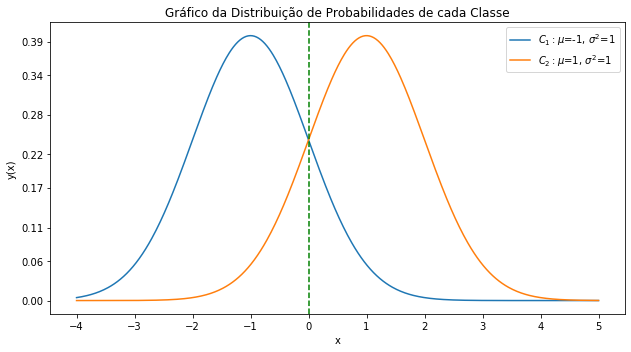
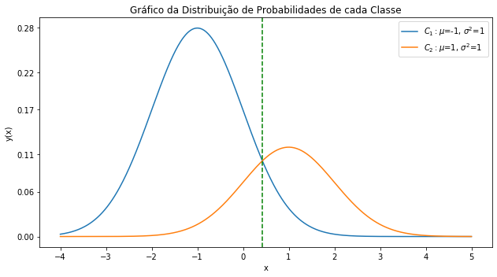
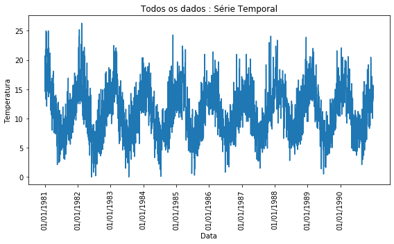
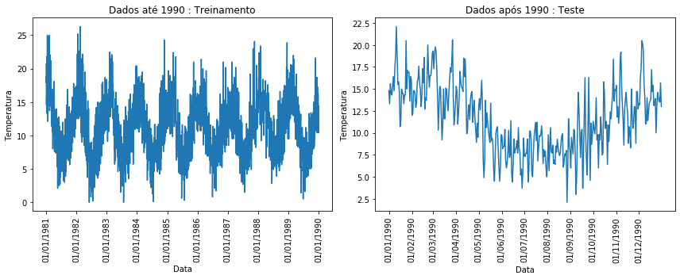
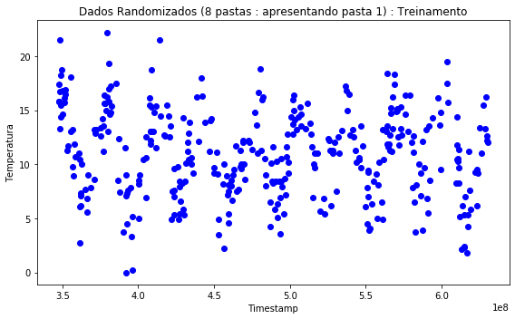
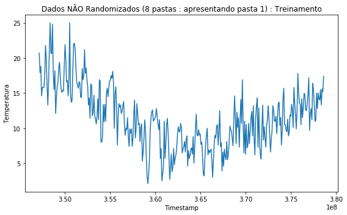
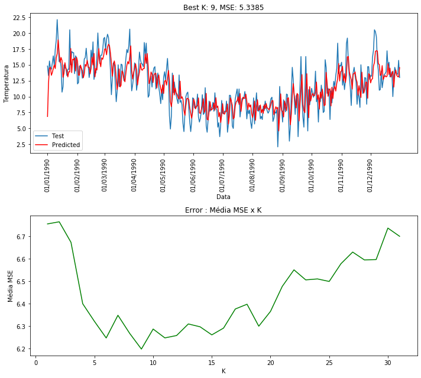
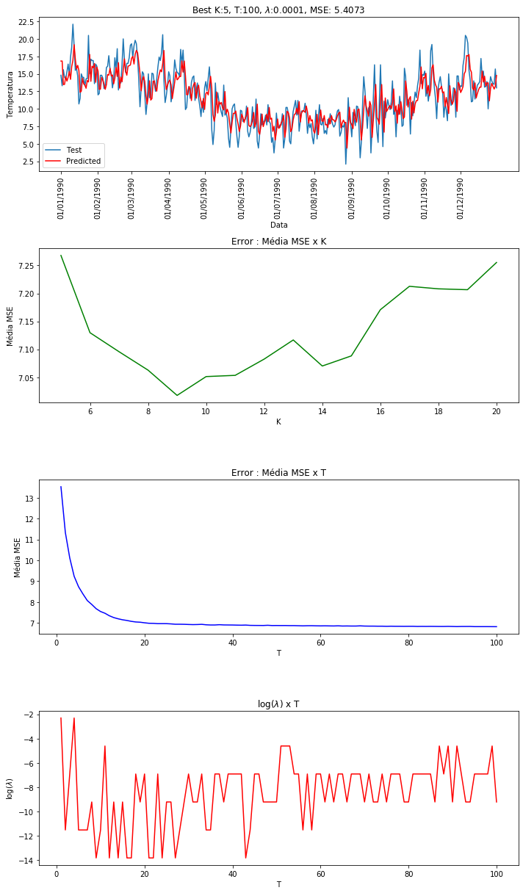

# IA006 - Exercícios de Fixação de Conceitos

$~$

## EFC1 - 2s2019

$~$

### Parte 1 - Atividades teóricas

$~$

#### **Exercício 1**

$~$

**Distribuição:**

|   X/Y   |  Y=0 |  Y=1  | Marg. X |
|:-------:|:----:|:-----:|:-------:|
|   X=0   |  1/6 |  3/8  |  13/24  |
|   X=1   |  1/8 |  1/3  |  11/24  |
| Marg. Y | 7/24 | 17/24 |    1    |

$~$
$~$

**a)** $P(X)$ e $P(Y)$

$~$
$~$

**Resposta:**

 - $P(X=x) = \{\frac{13}{24}, \frac{11}{24}\}$

 - $P(Y=y) = \{\frac{7}{24}, \frac{17}{24}\}$

$~$
$~$

**b)** $P(X=0|Y=0)$

$\frac{P({X=0}, {Y=0})}{P(Y=0)} = \frac{1}{6}\times\frac{24}{7} = \frac{24}{42} = \frac{4}{7}$

$\frac{P({X=1}, {Y=0})}{P(Y=0)} = \frac{1}{8}\times\frac{24}{7} = \frac{24}{56} = \frac{3}{7}$

$~$
$~$

**Resposta:**

 - $P(X=0|Y=0) = \frac{4}{7}$

$~$
$~$

**c)** $E[X]$ e $E[Y]$

$E[X] = \sum_kx_kP(x_k)$

$E[X] = 0 \times \frac{13}{24} + 1 \times \frac{11}{24}$

$E[Y] = 0 \times \frac{7}{24} + 1 \times \frac{17}{24}$

$~$
$~$

**Resposta:**

 - $E[X] = \frac{11}{24}$
 
 - $E[Y] = \frac{17}{24}$

$~$
$~$

**d)** São independentes? Por quê?

Resposta:

X e Y NÃO são independentes, pois a probabilidade do evento Y não afeta X, de acordo com a formulação:

$P(X,Y) = P(X)P(Y)$

Verificamos:

$P(X=x,Y=0) = P(X=x)P(Y=0)$

Por fim temos:

$P(X=0,Y=0) = P(X=0)P(Y=0) => \frac{1}{6} = \frac{13}{24}\times\frac{7}{24} => \frac{1}{6} \neq \frac{91}{576}$

$P(X=1,Y=0) = P(X=1)P(Y=0) => \frac{1}{8} = \frac{11}{24}\times\frac{7}{24} => \frac{1}{8} \neq \frac{77}{576}$

---

#### **Exercício 2**

$~$

**Distribuição:**

|   X/Y   | Y=0 | Y=1 | Marg. X |
|:-------:|:---:|:---:|:-------:|
|   X=0   |  0  | 1/4 |   1/4   |
|   X=1   | 3/8 | 3/8 |   3/4   |
| Marg. Y | 3/8 | 5/8 |    1    |

$~$
$~$

**a)** $H(X), H(Y), H(X,Y)$

Sendo: $H(X) = -\sum_x p(x)log_2[p(x)]$

$H(X) = H(\frac{1}{4}, \frac{3}{4})$

$H(X) = -((\frac{1}{4} \times log_2[\frac{1}{4}]) + (\frac{3}{4} \times log_2[\frac{3}{4}]))$

$H(X) = -((\frac{1}{4} \times -2) + (\frac{3}{4} (log_2[3]-2)))$

$H(X) = -((-\frac{1}{2}) + (\frac{3}{4} (log_2[3]-2)))$

$H(X) = 0.8112$

$~$

$H(Y) = H(\frac{3}{8}, \frac{5}{8})$

$H(Y) = -((\frac{3}{8} \times log_2[\frac{3}{8}]) + (\frac{5}{8} \times log_2[\frac{5}{8}]))$

$H(Y) = -((\frac{3}{8} (log_2(3)-3)) + (\frac{5}{8} (log_2(5)-3)))$

$H(Y) = 0.9544$

$~$
$~$

Calculando $H(X, Y)$

Sendo: $H(X, Y) = -\sum_x\sum_y p(x, y) log_2[p(x, y)]$

$H(X, Y) = -((\frac{1}{4} log_2(\frac{1}{4}))+(\frac{3}{8} log_2(\frac{3}{8}))+(\frac{3}{8} log_2(\frac{3}{8})))$

$H(X, Y) = 1.5612$

$~$

**Resposta:**

$H(X) = 0.8112$

$H(Y) = 0.9544$

$H(X, Y) = 1.5612$

$~$
$~$

**b)** $H(X|Y)$ e $H(Y|X)$

$H(Y|X) = -\sum_x\sum_y p(x, y) log_2[p(y|x)]$

$H(Y|X) = H(X, Y) - H(X)$

$H(X|Y) = H(X, Y) - H(Y)$

$~$

$P(Y=1 | X=0) = \frac{P(X=0, Y=1)}{P(X)} => \frac{1}{4}\times\frac{4}{1} = 1$

$P(Y=0 | X=1) = \frac{P(X=1, Y=0)}{P(X)} => \frac{3}{8}\times\frac{4}{3} = \frac{1}{2}$

$P(Y=1 | X=1) = \frac{P(X=1, Y=1)}{P(X)} = \frac{1}{2}$

$~$
$~$

$H(Y|X) = -( (\frac{1}{4} log_2(1)) + (\frac{3}{8} log_2(\frac{1}{2})) + (\frac{3}{8} log_2(\frac{1}{2})) )$

$H(Y|X) = -( (\frac{3}{8} \times -1) + (\frac{3}{8} \times -1) )$

$H(Y|X) = -( (-\frac{3}{8}) + (-\frac{3}{8}) )$

$H(Y|X) = 0.75$

$~$
$~$

$H(X|Y) = 1.5612 - 0.9544$

$H(X|Y) = 0.6068$

$~$

**Resposta:**

$H(Y|X) = 0.75$

$H(X|Y) = 0.6068$

$~$
$~$

**c)** $I(X, Y)$

Dado que,

$I(X, Y) = H(X) - H(X|Y)$

temos portanto,

$I(X, Y) = 0.8112 - 0.6068$

$I(X, Y) = 0.2044$

$~$

**Resposta:**

$I(X, Y) = 0.2044$

---

#### **Exercício 3**

**a)**

$C_1 =>\mu = -1, \sigma^2 = 1$

$C_2 =>\mu = 1, \sigma^2 = 1$

Função de probabilidade de densidade da Distribuição Normal é dada por:

$f(x|\mu,\sigma^2) = \frac{1}{\sqrt{2\pi\sigma^2}} exp(-\frac{(x - \mu)^2)}{2\sigma^2})$

Dado que MLE propõe:

$\theta_{MLE} = argmax_{\theta} log [p(x|\theta)]$

Sendo $\theta = (\mu, \sigma^2)$, portanto a MLE pode ser calculada usando:

$L(x|\mu,\sigma^2) = log [p(x|\mu,\sigma^2)]$

Usando a distribuição acima e a regra do estimado de máxima verossimilhança, calcula-se:

$L(x|\mu, \sigma^2) = -\frac{n}{2} log (2\pi\sigma^2) - \frac{1}{2\sigma^2}\sum_{i=1}^{n}(x - \mu)^2$

Aplicando acima, sendo $n=1$:

$L(x|\mu=-1,\sigma^2=1) = -\frac{1}{2} log (2\pi) - \frac{1}{2} (x + 1)^2$

$L(x|\mu=-1,\sigma^2=1) = -\frac{1}{2} log (2\pi) - \frac{1}{2} (x - 1)^2$

Dada as fórmulas acima podemos concluir portanto que quando $x = 0$, as equações terão valores iguais, definindo a fronteira no valor 0, sendo 0 indecisão (ambas as classes poderiam ser escolhidas).

Para demonstrar, podemos definir 2 (dois) valores para x, consideremos $x=(0, 1).$

Assim temos:

$L(x=1|\mu=-1,\sigma^2=1) = -\frac{1}{2} log (2\pi) - \frac{1}{2} (1 + 1)^2$

$L(x=1|\mu=-1,\sigma^2=1) = -0.9189 - \frac{1}{2} (2)^2$

$L(x=1|\mu=-1,\sigma^2=1) = -0.9189 - 2$

$L(x=1|\mu=-1,\sigma^2=1) = -2.9189$

$~$

$L(x=1|\mu=1,\sigma^2=1) = -\frac{1}{2} log (2\pi) - \frac{1}{2} (1 - 1)^2$

$L(x=1|\mu=1,\sigma^2=1) = -0.9189 - \frac{1}{2} (0)^2$

$L(x=1|\mu=1,\sigma^2=1) = -0.9189$

$~$

Definindo $x=0$:

$L(x=0|\mu=1,\sigma^2=1) = -\frac{1}{2} log (2\pi) - \frac{1}{2} (0 - 1)^2$

$L(x=0|\mu=1,\sigma^2=1) = -0.9189 - \frac{1}{2} (-1)^2$

$L(x=0|\mu=1,\sigma^2=1) = -1.4189$

$~$

$L(x=0|\mu=-1,\sigma^2=1) = -\frac{1}{2} log (2\pi) - \frac{1}{2} (0 - (-1))^2$

$L(x=0|\mu=-1,\sigma^2=1) = -0.9189 - \frac{1}{2} (1)^2$

$L(x=0|\mu=-1,\sigma^2=1) = -1.4189$

$~$

**Resposta:**

Dessa maneira, pode-se concluir que (conforma apresentado pelo gráfico também), amostras menores que 0 (zero) poderão ser classificados como sendo da classe $C_1$ e valores acima de 0 (zero) sendo da classe $C_2$, e 0 (zero) sendo a fronteira onde encontraremos indecisão.

$C_1 : x < 0$

$C_2 : x > 0$

$~$
$~$

**b)** $P(C_1) = 0,7, P(C_2) = 0,3$

Tendo a probabilidade a priori e utilizando o MAP cuja formulação apresenta:

$\theta_{MAP} = argmax_{\theta} log [p(x|\theta)] + log [p(\theta)]$

Sendo $\theta = (\mu, \sigma^2)$ e para o caso da classe $C_1$:

$f(x|\mu=-1, \sigma^2=1) = log [p(x|\mu=-1, \sigma^2=1)] + log [p(\mu=-1, \sigma^2=1)]$

Podemos definir para $x=0$:

$log [p(x=0|\mu=-1, \sigma^2=1)] = -1.4189$

$p(\mu=-1, \sigma^2=1) = 0.7$

Dessa maneira temos:

$f(x=0|\mu=-1, \sigma^2=1) = -1.4189 + log[0.7]$

$f(x=0|\mu=-1, \sigma^2=1) = -1.7755$

Para a classe $C_2$ temos:

$f(x=0|\mu=1, \sigma^2=1) = -1.4189 + log[0.3]$

$f(x=0|\mu=1, \sigma^2=1) = -2.6228$

$~$

**Resposta**:

Portanto no caso a amostra de valor 0 (zero) já não representa mais a região de indecisão do novo modelo dado as probabilidades.

Caso as distribuições sejam uniformes com média equidistantes e variâncias iguais a média, como o exercício fornece, pode-se calcular o ponto de intersecção, indiferente da densidade de probabilidades tendo valores a posteriori usando:

$\frac{P(C_1∣x)}{P(C_2∣x)} = \frac{f1(x)}{f2(x)}\times\frac{P(C_1)}{P(C_2)}$

$\frac{P(C_1∣x)}{P(C_2∣x)} = log\frac{f1(x)}{f2(x)} + log\frac{P(C_1)}{P(C_2)}$

$\frac{P(C_1∣x=-1)}{P(C_2∣x=1)} = log\frac{f1(x=-1)}{f2(x=1)} + log\frac{P(C_1)}{P(C_2)}$

$\frac{P(C_1∣x=-1)}{P(C_2∣x=1)} = log\frac{0.3989}{0.3989} + log\frac{0.7}{0.3}$

$\frac{P(C_1∣x=-1)}{P(C_2∣x=1)} = 0 + 0.8472$

Como temos 2 classes:

$\frac{P(C_1∣x=-1)}{P(C_2∣x=1)} = \frac{0.8472}{2}$

$\frac{P(C_1∣x=-1)}{P(C_2∣x=1)} = 0.4236$

Neste caso a fronteira de decisão será igual a $0.4236$.

$~$
$~$

Portanto:

$C_1 : x < 0.436$

$C_2 : x > 0.436$

---

### Parte 2 – Atividade computacional

$~$

Importação dos dados do *Australian Bureau of Meteorology* e sua apresentação.

Os dados, são definidos como uma série temporal onde em determinada data é apresentada a temperatura. Abaixo é apresentado os primeiros 10 registros dos 3650 itens.

             Data Temperature
    0  01/01/1981        20.7
    1  02/01/1981        17.9
    2  03/01/1981        18.8
    3  04/01/1981        14.6
    4  05/01/1981        15.8
    5  06/01/1981        15.8
    6  07/01/1981        15.8
    7  08/01/1981        17.4
    8  09/01/1981        21.8
    9  10/01/1981        20.0

Divisão dos dados em treinamento e teste. Conforme solicitado os dados até 1990 serão usado para treinamento e os posteriores para teste.

Utilização de K-Folds para dividir os dados de treinamento em pequenas "pastas" para verificar melhor configuração de treinamento dado os dados.

Conforme solicitado, os dados serão divididos em até 30 pastas, além disso, será testado a possibilidade de cada pasta conter dados randomicamente misturados de diferentes épocas para avaliar se o modelo se comporta de modo melhor ou pior em questão a temporalidade das informações.

#### **Exercício 1**

Calcular a melhor predição de acordo com os dados usando Quadrados Mínimos.

$w = \phi^T(\phi \phi^T)^{-1}y$

Usando K-Fold Cross Validation, o dataset foi dividido e executado para cada parâmetro de K. Sendo k a quantidade de atrasos.

Conforme discutido em aula, os atrasos da série, aqueles cujas valores começam a posição inicial poderiam ser preenchidos com 0 (zero). Entretanto, tentanto evitar um desvio inicial muito grande, essa série atrasada inicial foi preenchidas com valores de uma distribuição uniforme variando do valor mínimo e máximo contido dentro do dataset, conforme abaixo.

    Valores:
    --------------------
    Min: 0.0
    Max: 26.3

Dessa maneira foi executado um modelo de Regressão Linear nos dados, partindo de uma séria de K=1 até K=30 e usando K-Fold (variando até 20 folds).

O resultados obtidos são apresentados abaixo.

    Melhores valores
    --------------------
    K     : 9
    K-Fold: 6 / 6

Os gráficos acima, apresentam os valores após filtro pós-processamento para escolher o melhor valor de K.

Abaixo, são apresentados os primeiros 10 itens da iteração total executada. O primeiro item não representa a melhor opção, pois para escolha da melhor opção foi calculada a média dos valores.

          K  K-Fold  Validation Fold  Média MSE
    287  16       3                3   6.087971
    268  15       3                3   6.115867
    249  14       3                3   6.126024
    157   9       6                6   6.127955
    192  11       3                3   6.133455
    363  20       3                3   6.135489
    344  19       3                3   6.143807
    290  16       6                6   6.145325
    154   9       3                3   6.145530
    195  11       6                6   6.147887

É possível também, usar de outra alternativa no método de K-Fold... no caso estamos embaralhando os dados antes de passar para o método e consequentemente o modelo. Por fim, chegamos aproximadamente no mesmo resultado, entretanto tomando um caminho de certa maneira diferente... Neste sentido, podemos encontrar os melhores valores $W$ para o modelo em folds totalmente direfentes.

    Melhores valores
    --------------------
    K     : 9
    K-Fold: 5 / 1

Abaixo, são apresentados os primeiros 10 itens da iteração total executada. O primeiro item não representa a melhor opção, pois para escolha da melhor opção foi calculada a média dos valores.

          K  K-Fold  Validation Fold  Média MSE
    286  16       2                1   5.750690
    346  19       5                3   5.826303
    266  15       1                1   5.835400
    343  19       2                2   5.868697
    457  25       2                2   5.877817
    172  10       2                2   5.879661
    513  28       1                1   5.891007
    381  21       2                2   5.892352
    156   9       5                1   5.905596
    478  26       4                2   5.909008

#### **Exercício 2**

No exercício 2 usando o mesmo dataset usando anteriormente com a mesma questão de atraso, passaremos cada um dos itens por uma Rede Neural, usando como função de ativação a função hiperbólica.

Para validar a quantidade de unidades ( ou neurônios ) faremos a geração dessas unidades variando de 1 até 100 com seus pesos dentro de uma distribuição uniforme variando de -1 até 1.

Como valores para $\lambda$ (regularização) será utilizado o seguinte range: 1e+1 até 1e-6, dando espaçamentos de 0.1. Para visualmente ficar mais legível (devido a grande variação), os dados (os valores de regularização) são apresentados em escala logarítimica.

Para a normalização dos dados, evitando a saturação da tangente hiperbólica, os dados serão normalizados entre os valores de mínimo e máximo dos dados (os quais já foram apresentados acima).

Valores de K, estão dentro da faixa de 5 até 20 e o K-Fold utilizado foi de 1 até 10 folds.

    Valores de regularização testados: 8
    [1.e+01 1.e+00 1.e-01 1.e-02 1.e-03 1.e-04 1.e-05 1.e-06]

    K: 5  <=>  Time to run: 163.76 secs
    K: 6  <=>  Time to run: 168.24 secs
    K: 7  <=>  Time to run: 168.59 secs
    K: 8  <=>  Time to run: 167.77 secs
    K: 9  <=>  Time to run: 167.6 secs
    K: 10  <=>  Time to run: 167.5 secs
    K: 11  <=>  Time to run: 166.18 secs
    K: 12  <=>  Time to run: 167.34 secs
    K: 13  <=>  Time to run: 168.47 secs
    K: 14  <=>  Time to run: 190.73 secs
    K: 15  <=>  Time to run: 192.71 secs
    K: 16  <=>  Time to run: 182.79 secs
    K: 17  <=>  Time to run: 210.97 secs
    K: 18  <=>  Time to run: 187.06 secs
    K: 19  <=>  Time to run: 188.91 secs
    K: 20  <=>  Time to run: 174.61 secs

    Melhores resultados:
    --------------------
    K-Fold           :  1 / 1
    K                :  5
    T                :  100
    lambda           :  0.0001
    MSE da validação :  6.952768332192359

Abaixo, são apresentados os primeiros 10 itens da iteração total executada. O primeiro item não representa a melhor opção, pois para escolha da melhor opção foi calculada a média dos valores.

           K  K-Fold  Validation Fold    T  Regularizacao  Média MSE
    8483  14       3                2  101        0.00100   6.479141
    9378  15       3                2   87        0.01000   6.488502
    8459  14       3                2   77        0.00100   6.491464
    8469  14       3                2   87        0.00010   6.492263
    9374  15       3                2   83        0.00100   6.493626
    9337  15       3                2   46        0.00100   6.495681
    8440  14       3                2   58        0.00001   6.496261
    8479  14       3                2   97        0.00100   6.497782
    8468  14       3                2   86        0.00010   6.498737
    9386  15       3                2   95        0.00100   6.500816

O resultado do modelo acima ficou bem próximo do executado usando apenas a Regressão Linear simples (sem uma camada intermediára entre as entradas e o Regressor). Neste sentido, pela natureza dos dados, mesmo usando modelos mais complexos podemos acabar por chegar no mesmo resultado.

---

Rodolfo De Nadai - 208911

Todo o código deste relatório esta disponível em: https://github.com/rdenadai/ia006c
