# IA006 - Exercícios de Fixação de Conceitos

$~$

## EFC2 - 2s2019

$~$

### Parte 1 - Classificação Binária

$~$

**Problema:** identificação do gênero do locutor apartir de trechos de voz

**Dataset:** https://www.mldata.io/dataset-details/gender_voice/

Descrição dos dados:

* Showing 15 out of 21 attributes.

| Name | Type | Description |
|------|------|-------------|
| meanfreq | float | mean frequency (in kHz) |
| sd | float | standard deviation of frequency |
| median | float | median frequency (in kHz) |
| Q25 | float | first quantile (in kHz) |
| Q75 | float | third quantile (in kHz) |
| IQR | float | interquantile range (in kHz) |
| skew | float | skewness (see note in specprop description) |
| kurt | float | kurtosis (see note in specprop description) |
| sp.ent | float | spectral entropy |
| sfm | float | spectral flatness |
| mode | float | mode frequency |
| centroid | float | frequency centroid (see specprop) |
| meanfun | float | average of fundamental frequency measured across acoustic signal |
| minfun | float | minimum fundamental frequency measured across acoustic signal |
| label | string | Predictor class, male or female |

Apresentação dos 5 primeiros dados:

             sd    median       Q25       Q75       IQR       skew         kurt  \
    0  0.064241  0.032027  0.015071  0.090193  0.075122  12.863462   274.402906   
    1  0.067310  0.040229  0.019414  0.092666  0.073252  22.423285   634.613855   
    2  0.083829  0.036718  0.008701  0.131908  0.123207  30.757155  1024.927705   
    3  0.072111  0.158011  0.096582  0.207955  0.111374   1.232831     4.177296   
    4  0.079146  0.124656  0.078720  0.206045  0.127325   1.101174     4.333713   
    
         sp.ent       sfm      mode  centroid   meanfun    minfun    maxfun  \
    0  0.893369  0.491918  0.000000  0.059781  0.084279  0.015702  0.275862   
    1  0.892193  0.513724  0.000000  0.066009  0.107937  0.015826  0.250000   
    2  0.846389  0.478905  0.000000  0.077316  0.098706  0.015656  0.271186   
    3  0.963322  0.727232  0.083878  0.151228  0.088965  0.017798  0.250000   
    4  0.971955  0.783568  0.104261  0.135120  0.106398  0.016931  0.266667   
    
        meandom    mindom    maxdom   dfrange   modindx  label  
    0  0.007812  0.007812  0.007812  0.000000  0.000000    1.0  
    1  0.009014  0.007812  0.054688  0.046875  0.052632    1.0  
    2  0.007990  0.007812  0.015625  0.007812  0.046512    1.0  
    3  0.201497  0.007812  0.562500  0.554688  0.247119    1.0  
    4  0.712812  0.007812  5.484375  5.476562  0.208274    1.0  

$~$

**a)** Análise estatística dos dados

A análise estatística será feita particularmente em apenas um subset do conjunto total de features, que são: *sd, median, skew, kurt, sp.ent, sfm, mode, centroid, meanfun, meandom*.

Entretanto a matriz de correlação pearson será apresentada para todo o dataset.

          Field   Qtd    Min       Max    Mean  Median       Var.      Std  Unique
    0        sd  3168  0.018     0.115   0.057   0.059      0.000    0.017    3166
    1    median  3168  0.011     0.261   0.186   0.190      0.001    0.036    3077
    2      skew  3168  0.142    34.725   3.140   2.197     17.976    4.240    3166
    3      kurt  3168  2.068  1309.613  36.568   8.318  18199.997  134.907    3166
    4    sp.ent  3168  0.739     0.982   0.895   0.902      0.002    0.045    3166
    5       sfm  3168  0.037     0.843   0.408   0.396      0.032    0.177    3166
    6      mode  3168  0.000     0.280   0.165   0.187      0.006    0.077    2825
    7  centroid  3168  0.039     0.251   0.181   0.185      0.001    0.030    3166
    8   meanfun  3168  0.056     0.238   0.143   0.141      0.001    0.032    3166
    9   meandom  3168  0.008     2.958   0.829   0.766      0.276    0.525    2999

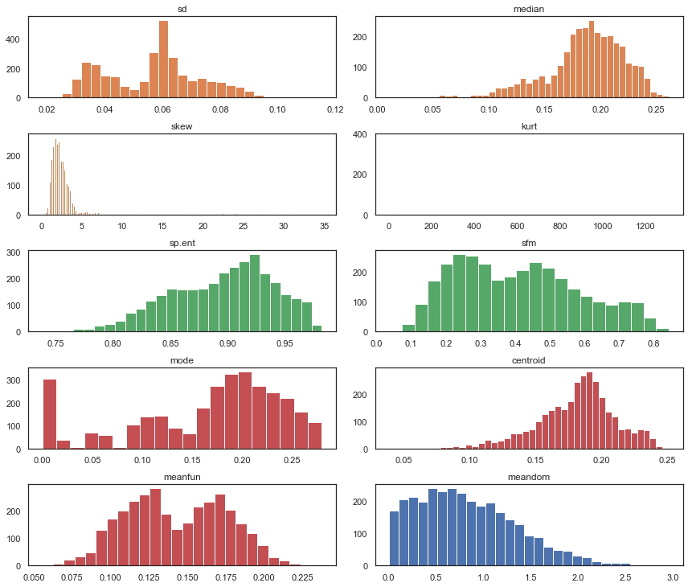

Como é possível observar alguns dos atributos tem o perfil de seu histograma próximo ao formato de uma distribuição gaussiana. Abaixo, são apresentados as Densidades de Probabilidade dos mesmos dados, entretanto escalonados usado a seguinte operação:

$~$

$y = \frac{x-\mu}{\sigma}$

$~$

onde $\mu$ é a média e $\sigma$ a variância de cada coluna.

          Field   Qtd      Min      Max  Mean   Median  Var.  Std  Unique
    0        sd  3168 -2.32814  3.49241  -0.0  0.12187   1.0  1.0    3166
    1    median  3168 -4.80399  2.07963  -0.0  0.12135   1.0  1.0    3077
    2      skew  3168 -0.70720  7.44961  -0.0 -0.22243   1.0  1.0    3166
    3      kurt  3168 -0.25573  9.43643   0.0 -0.20940   1.0  1.0    3166
    4    sp.ent  3168 -3.47939  1.93162   0.0  0.14764   1.0  1.0    3166
    5       sfm  3168 -2.09214  2.44922   0.0 -0.06694   1.0  1.0    3166
    6      mode  3168 -2.14121  1.48616   0.0  0.27616   1.0  1.0    2825
    7  centroid  3168 -4.73181  2.34737  -0.0  0.13144   1.0  1.0    3166
    8   meanfun  3168 -2.70103  2.93596  -0.0 -0.07084   1.0  1.0    3166
    9   meandom  3168 -1.56420  4.05329   0.0 -0.12076   1.0  1.0    2999

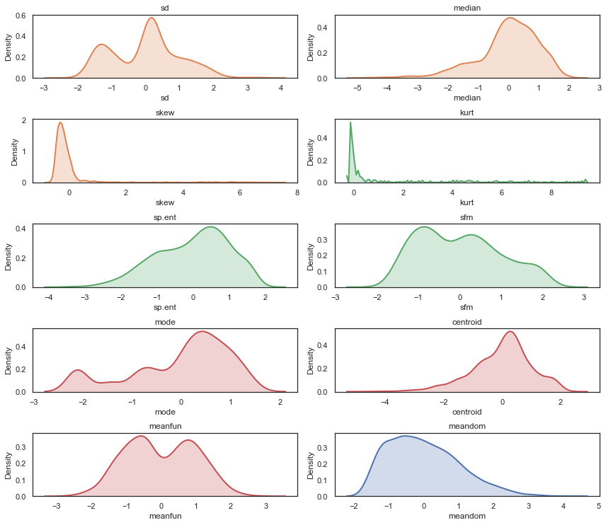

Através da matriz de correlação, podemos ter uma ideia de como as features de nosso dataset estão correlacionadas entre si.

Nota-se uma correlação relativamente alta entre os campos *meanfun* e o *label*. O que permite inferir que esse atributo terá forte influência na classificaçãod dos resultados.

Evitando, encontrar apenas correlações lineares entres os valores, aplica-se também a Correlação em Distância, a qual possibilita visualizar valores de correlação não lineares entre variáveis e também avaliar a indepedência das variáveis (quando o valor for zero).

A Correlação em Distância, também exemplifica o apresentado acima a respeito do atributo *meanfun*.

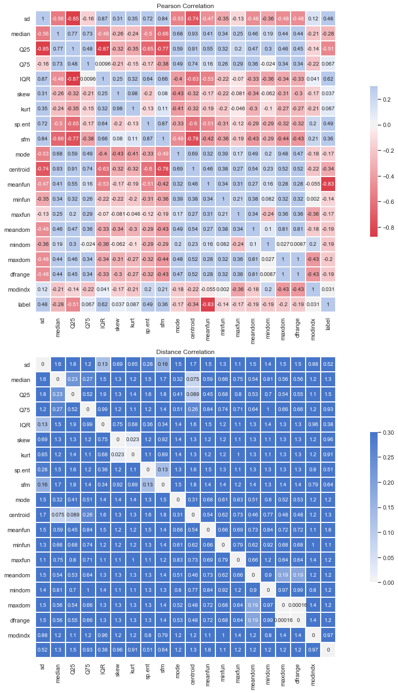

Abaixo alguns gráficos o quais apresentam a distribuição de algumas das correlações entre os atributos do dataset. Para que seja possível observar essa correlação linear ou não linear.

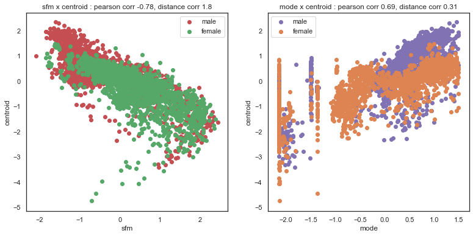

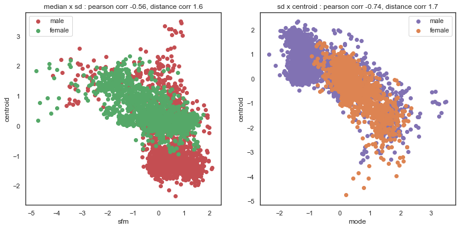

De acordo com a análise estatística apresentada acima, podemos usar apenas os seguintes campos do dataset para conseguir uma acurácia em torno de 96% (*sd, median, sp.ent, sfm, centroid, meanfun, meandom*).

Outros campos analisados como *skew* e *kurt*, tem baixa correlação com o label final e o campo *mode* tem uma forte correlação com todos os outros campos mas também relativamente baixa com o label.

$~$

**b)** Implementar a Regressão Logística e apresentar os valores da curva ROC e F1-Score em função do threshold.

O modelo de Regressão Logística implementado possui 5 hiperparâmetros, que podem ser alterados, são eles:

 - Regularização => valor padrão : 1e-4 (L2)
 - Learning rate => valor padrão : 1e-4
 - Épocas do algoritmo de GD => valor padrão : 10000
 - Batch Size => valor padrão : 32
 - Threshold de classificação => valor padrão : 0.5 (apenas para classificação binária)

O classificador implementa o processo iterativo conhecido como Gradiente Descendente no mini-batch passado. Além disso, ele valida os dados em um pequeno subset (30% dos dados de treinamento).

Nos testes iniciais o único valor padrão alterado foi de learning rate, alterado de 1e-4 para 1e-1, para que o modelo possa convergir no melhor ponto dentro da quantidade de épocas padrão. Neste algoritmo não foi implementado Early Stop, mas esta implementado a utilização de mini-batch.

Conforme mencionado em aula, apesar da análise estatística apresentar uma possível seleção de atributos, no caso do classificador serão utilizados todos os dados (todos os dados escalonados).

Executando o classificador obtemos as seguintes visualizações, respectivamente, da Curva ROC, a evolução da métrica F-Score e da Acurácia de acordo com o Threshold.

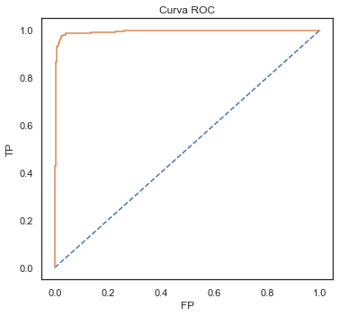

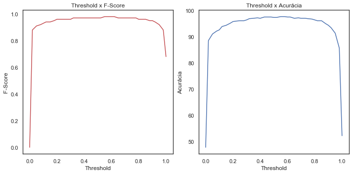

    Resultados:
    ------------------------------
        Threshold  Acurácia  Erros  Recall  Precisão  F-Score
    22       0.55     97.63   2.37    0.98      0.98     0.98
    23       0.58     97.63   2.37    0.98      0.98     0.98
    24       0.60     97.48   2.52    0.98      0.98     0.98
    25       0.62     97.48   2.52    0.98      0.98     0.98
    17       0.43     97.48   2.52    0.98      0.97     0.97
    18       0.45     97.48   2.52    0.98      0.97     0.97
    19       0.48     97.48   2.52    0.98      0.97     0.97
    20       0.50     97.32   2.68    0.98      0.97     0.97
    21       0.52     97.32   2.68    0.98      0.97     0.97
    15       0.38     97.16   2.84    0.98      0.96     0.97

A curva ROC apresenta a qualidade do classificador e a evolução da F-medida permite encontrar um melhor threshold para os dados.
Entretanto tal alternativa é realmente válida para classificação binária, visto que principalmente a curva ROC e o threshold são escolhas realizadas entre até 2 elementos.

Talvez uma alternativa para multi-classes, seria algo como gerar a curva ROC e o threshold para uma estrutura um-contra-todos, por exemplo.

$~$

**c)** Melhor valor do threshold e matriz de confusão dos resultados.

Abaixo será aplicado o melhor de threshold encontrado e observado na tabela acima.

    Melhor threshold encontrado usando os experimentos acima: 0.55
    
    Acurácia:
    ------------------------------
    Acertos: 97.63%
    Erros  : 2.37%
    
    Relatório de Classificação:
    ------------------------------
      Classe  Precisão  Recall  F1-Score  Support
    0      0      0.98    0.98      0.98      331
    1      1      0.97    0.98      0.98      303

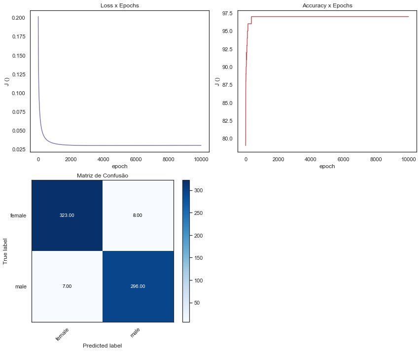

Após a análise exploratória dos dados e a verificação de qual o melhor threshold do classificador de Regressão Logística é possível notar a relativa precisão do classificador permitindo que o mesmo tenha um bom grau de generalização mesmo nos dados de teste. Dito isto a análise exploratória e mesmo a escolha das features e hiperparâmetros podem influenciar na melhor ou pior generalização do modelo.

$~$

### Parte 2 - Classificação Multi Classe

$~$

**Problema:** identificação de atividade humana usando dados de smartphones

**Dataset:** https://archive.ics.uci.edu/ml/datasets/human+activity+recognition+using+smartphones

Em primeiro lugar será feita a leitura do dataset e apresentação de algumas das informações.

O dataset contém informações pré-processadas das leituras de acelerômetros e giroscópio de aparelhos celulares.

Abaixo algumas informações numéricas do dataset.

    Quantidade de amostras para treinamento : 7352
    Quantidade de amostras para teste       : 2947
    Quantidade total de colunas (features)  : 561
    
    Apresentação dos primeiros 2 registros e algumas colunas:
    ------------------------------
            0         1         2         3         4         5         6    \
    0  0.288585 -0.020294 -0.132905 -0.995279 -0.983111 -0.913526 -0.995112   
    1  0.278419 -0.016411 -0.123520 -0.998245 -0.975300 -0.960322 -0.998807   
    
            7         8         9    ...       551       552       553       554  \
    0 -0.983185 -0.923527 -0.934724  ... -0.074323 -0.298676 -0.710304 -0.112754   
    1 -0.974914 -0.957686 -0.943068  ...  0.158075 -0.595051 -0.861499  0.053477   
    
            555       556       557       558       559       560  
    0  0.030400 -0.464761 -0.018446 -0.841247  0.179941 -0.058627  
    1 -0.007435 -0.732626  0.703511 -0.844788  0.180289 -0.054317  
    
    [2 rows x 561 columns]

$~$

**a**) Modelo de Regressão Logística

Para este exercício foi utilizado o modelo criado previamente no exercício anterior, o qual sofreu alterações para a possibilidade de expandi-lo para a classificação multiclasse. Neste sentido foi implementada a função softmax dada pela seguinte fórmula.

$~$

$y = \frac{exp(z)}{\sum{exp(z)}}$

$~$

Os dados brutos do dataset foram usados diretamente no modelo de Regressão Logística usando a camada de softmax para determinar as classes. Não há necessidade de normalização ou qualquer outro tipo de pré-processamento, visto que, como mencionado os dados já foram pré-processados.

Os resultados foram muito positivos dada a quantidade de informação e o tipo da mesma (dados de sensores).

Como o modelo utilizado é o mesmo que o implementado anterior, o único parâmetro que foi alterado para os resultados abaixo, foi o learning rate (valor de 1e-1).

Definido como métrica para os resultados a precisão, recall e f1-score. Todas métricas, além da acurácia que permitem analisar melhor como o modelo se comportou para a classificação de cada classe.

Abaixo, a apresentação dos resultados.

    Aplicando o classificador no conjunto de teste
    ------------------------------
    
    Acurácia:
    ------------------------------
    Acertos: 94.71%
    Erros  : 5.29%
    
    Relatório de Classificação:
    ------------------------------
      Classe  Precisão  Recall  F1-Score  Support
    0      1      0.94    0.99      0.96      496
    1      2      0.93    0.95      0.94      471
    2      3      0.98    0.91      0.94      420
    3      4      0.94    0.88      0.91      491
    4      5      0.90    0.95      0.92      532
    5      6      1.00    1.00      1.00      537

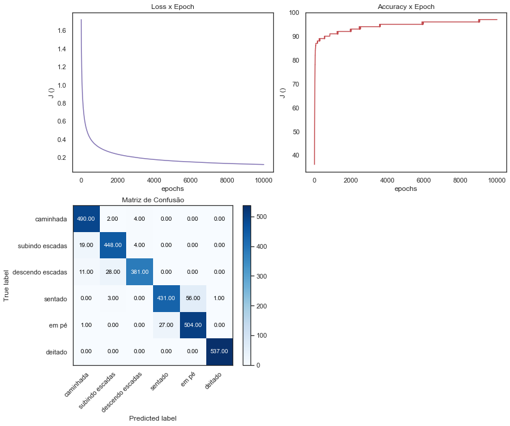

É evidente que mesmo modelos mais simples (diferentemente de Redes Neurais Profundas), pode sanar problemas que muitas vezes parecem ser complexos e com uma dinâmica aparentemente caótica.

Dessa maneira, pode ser muito interessante, avaliar os dados em modelos simples antes mesmo de partir para abordagens mais complexas e que necessitam de melhor tuning de parâmetros.

$~$

**b)** Implementação do kNN e variação do hiperparâmetro k.

Neste exercício foi implementado o algoritmo de classificação K Nearest Neighbors. A distância entre os padrões é calculada utilizando-se a distância euclidiana.

$~$

$w=\sqrt{(\sum{a}-{b})^2}$

$~$

Como parametrização do algoritmo é possível selecionar dois parametros.

O primeiro deles é o valor dos K vizinhos, dessa maneira, é possível selecionar a quantidade exata de vizinhos para se avaliar a qual classe o novo padrão deve vir a pertencer. O Valor padrão de K é 5.

O outro parâmetro criado é a heurística para determinar a classe baseada na distância. Neste sentido foram implementadas duas heurísticas: *uniform* e *distance*

 - *uniform*: Heurística padrão do modelo, e mais simples, defini a classe do novo padrão, verificando qual a maior quantidade de classes dos padrões mais próximos. Ou seja, tendo 5 padrões mais próximos daquele que se deseja classificar, a classe definida será a que possuir maior número dentro destes 5 padrões. Em caso de empate, opta-se pela classe que possui o padrão com menor distância (o mais próximo).
 - *distance*: Implementa uma heurística um pouco mais complexa que a de cima, ao invés de escolher apenas a classe que possui maior quantidade de padrões, calcula a IDW (Inverse distance weight) de cada classe para os K padrões.

$~$

$y = max_r (\sum_{i=1}^k d_i 1_{y(i)=r})$

$~$

onde d é o vetor invertido com o cálculo das distâncias para cada padrão, r é a quantidade de classes.

$~$

$d_i = \frac{1}{w_i}$

Abaixo, são apresentados os gráficos das validações do modelo, foram realizados a validação do valor de K variando de 1 até 20 e claro, para ambas as heurísticas de classificação *uniform* e *distance*.

No caso, o dataset de treinamento foi dividido em 2 partes, sendo 75% para "treino" e 25% para "validação".

Para a escolha do melhor valor de K, em um primeiro caso a métrica escolhida foi a Acurácia, e em caso de valores de K com mesmo Acurácia calculou-se a F-Medida como método de desempate (se mesmo assim ambas forem iguais, o valor de K não será atualizado para o novo, ficando o antigo valor como o eleito).

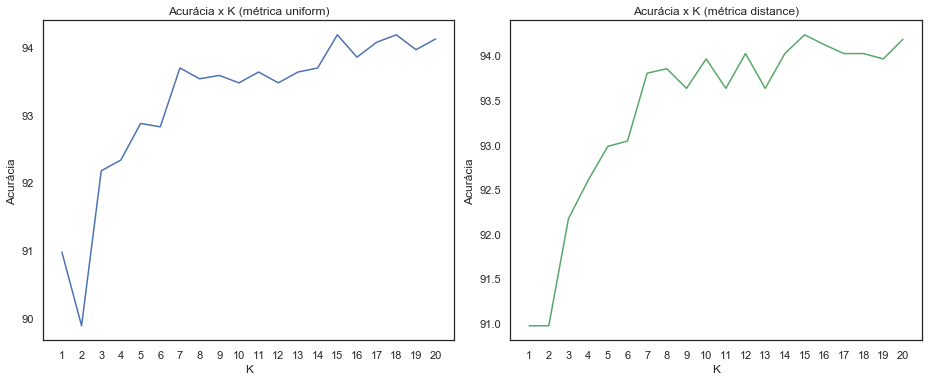

Seguindo ao informado acima, é selecionado o melhor valor de K baseado na acurácia nos dados de "treino" e validação.

Abaixo são apresentadas as métricas e a matriz de confusão para esse melhor valor de K nos dados de teste.

    Melhores valores
    ------------------------------
    K        : 15
    Métrica  : distance
    Acurácia : 90.97%
    
    Relatório de Classificação:
    ------------------------------
      Classe  Precisão  Recall  F1-Score  Support
    0      1      0.86    0.97      0.92      496
    1      2      0.90    0.90      0.90      471
    2      3      0.95    0.81      0.88      420
    3      4      0.91    0.82      0.86      491
    4      5      0.85    0.93      0.89      532
    5      6      1.00    0.99      1.00      537

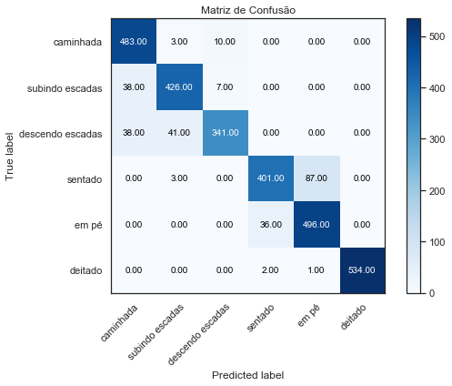

Por fim, após a execução do método KNN, é possível dizer que mesmo um método não-paramétrico é capaz de atingir resultados relativamente ótimos. Claro que nessa avaliação é importante salientar que os dados e consequentemente a relação entre cada uma das features permitem um excelente desempenho.

Dessa maneira, quando da escolha do melhor modelo ou método, para a abordagem de determinado problema, faz-se importante a avaliação de diversos, entendendo claro a peculiaridade de cada um e dos dados que se tem a disposição.

$~$

Rodolfo De Nadai - 208911

Anthony Miranda Vieira - 229058

Todo o código deste relatório esta disponível em: https://github.com/rdenadai/ia006c
