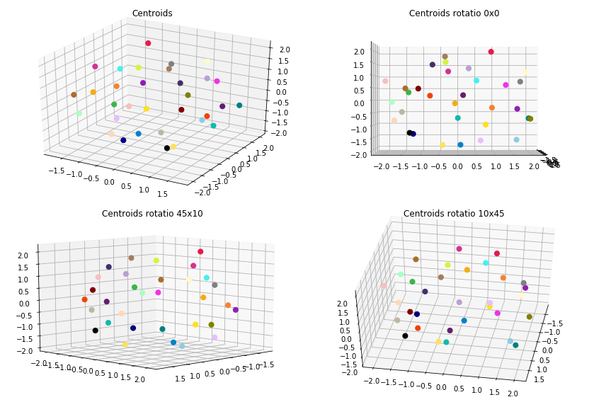
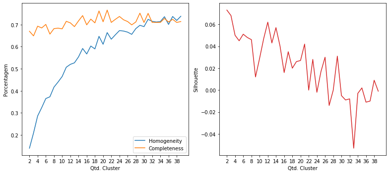
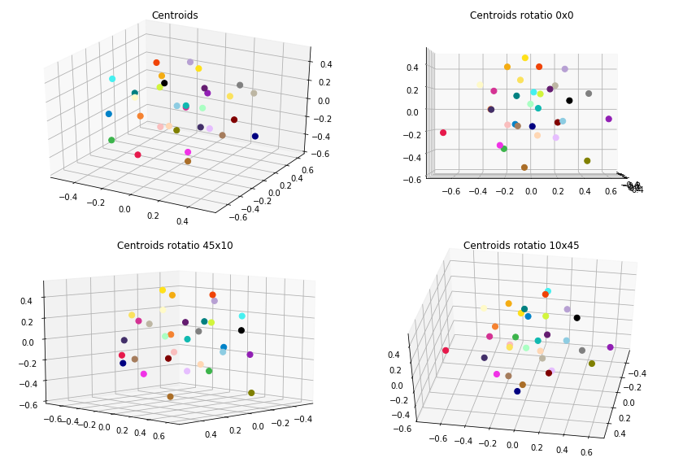
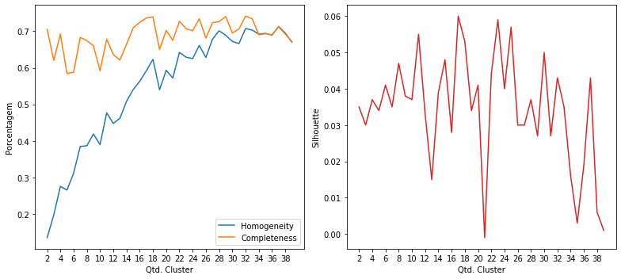
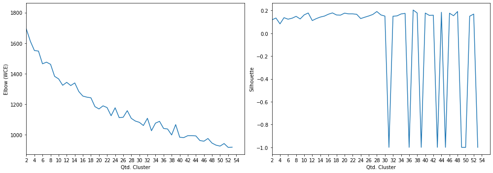

# Projeto Final

Este é o projeto final da disciplina Aprendizado de Máquina (IA006-C), ministrado pelos professores Levy Boccato e Romis, na Unicamp no 2S2019.

## Projeto

A ideia do projeto é permitir a clusterização de conteúdo textual, para que a partir deste seja criado um chatbot.

Os textos passarão pro um processo de clusterização (e aqui serão apresentados duas técnicas para gerar o espaço vetorial de documentos [TF-IDF e Doc2Vec]) usando o algoritmo KMeans e usando duas métricas para cálculo das distâncias dos documentos no espaço vetorial desejado.
 
Posterior a isso, textos que não forem similares (ou proximamente similares aos já "classificados") serão considerados como anomalias e por conseguintes novos clusters poderão ser gerados futuramente.

### Carregamento dos datasets

Os datasets de exemplos são frases já pré-categorizadas usadas em chatbots.

Contém 32 categorias e ao todo 690 documentos ou frases.

<table border="1" class="dataframe">
  <thead>
    <tr style="text-align: right;">
      <th>perguntas</th>
      <th>cluster</th>
    </tr>
  </thead>
  <tbody>
    <tr>
      <td>Como posso registrar um cartão SIM?</td>
      <td>ACTIVATE_DEVICE</td>
    </tr>
    <tr>
      <td>Por favor adicione o roaming internacional na minha conta.</td>
      <td>ACTIVATE_ROAMING</td>
    </tr>
    <tr>
      <td>Fui assaltado, preciso acionar seguro.</td>
      <td>ADD_INSURANCE</td>
    </tr>
    <tr>
      <td>Oi, eu estava esperando que você pudesse me dizer como adicionar o recurso de mensagens de texto ao meu plano?</td>
      <td>ADD_SERVICE_FEATURES</td>
    </tr>
    <tr>
      <td>Como cancelo meu serviço de telefone pré-pago?</td>
      <td>DEACTIVATE_PREPAID_PLAN</td>
    </tr>
    <tr>
      <td>Você pode verificar se posso fazer um upgrade?</td>
      <td>DEVICE_UPGRADE_ELIGIBILITY</td>
    </tr>
    <tr>
      <td>quero mudar minha password como devo proceder?</td>
      <td>PASSWORD</td>
    </tr>
    <tr>
      <td>Minha Senha está com problema</td>
      <td>PASSWORD</td>
    </tr>
    <tr>
      <td>Minha senha não funciona</td>
      <td>PASSWORD</td>
    </tr>
    <tr>
      <td>Como faço para transferir o serviço de um dispositivo antigo para um novo?</td>
      <td>SWAP_DEVICE</td>
    </tr>
  </tbody>
</table>

    Qtde. de documentos por categoria:

<table border="1" class="dataframe">
  <thead>
    <tr style="text-align: right;">
      <th>Categoria</th>
      <th>Qtde</th>
    </tr>
  </thead>
  <tbody>
    <tr>
      <td>ACCOUNT</td>
      <td>29</td>
    </tr>
    <tr>
      <td>ACTIVATE_DEVICE</td>
      <td>19</td>
    </tr>
    <tr>
      <td>ACTIVATE_PREPAID_PLAN</td>
      <td>21</td>
    </tr>
    <tr>
      <td>ACTIVATE_ROAMING</td>
      <td>20</td>
    </tr>
    <tr>
      <td>ADD_INSURANCE</td>
      <td>18</td>
    </tr>
    <tr>
      <td>ADD_SERVICE_FEATURES</td>
      <td>20</td>
    </tr>
    <tr>
      <td>BOT_FOUND</td>
      <td>20</td>
    </tr>
    <tr>
      <td>BOT_NAME</td>
      <td>16</td>
    </tr>
    <tr>
      <td>CERTIFICATE</td>
      <td>18</td>
    </tr>
    <tr>
      <td>CHANGE_PRICE_PLAN</td>
      <td>19</td>
    </tr>
    <tr>
      <td>COVERAGE_AREA_INQUIRY</td>
      <td>19</td>
    </tr>
    <tr>
      <td>DEACTIVATE_PREPAID_PLAN</td>
      <td>18</td>
    </tr>
    <tr>
      <td>DEACTIVATE_ROAMING</td>
      <td>18</td>
    </tr>
    <tr>
      <td>DEVICE_UPGRADE_ELIGIBILITY</td>
      <td>24</td>
    </tr>
    <tr>
      <td>EMAIL</td>
      <td>40</td>
    </tr>
    <tr>
      <td>INTERNATIONAL_RATE_PLAN_INQUIRY</td>
      <td>21</td>
    </tr>
    <tr>
      <td>NETWORK_COMPLAINTS</td>
      <td>23</td>
    </tr>
    <tr>
      <td>NETWORK_UNLOCK</td>
      <td>21</td>
    </tr>
    <tr>
      <td>NO_OPTION</td>
      <td>18</td>
    </tr>
    <tr>
      <td>PASSWORD</td>
      <td>27</td>
    </tr>
    <tr>
      <td>PORT_IN</td>
      <td>21</td>
    </tr>
    <tr>
      <td>PRICE_PLAN_INQUIRY</td>
      <td>23</td>
    </tr>
    <tr>
      <td>RECHARGE_SIM</td>
      <td>18</td>
    </tr>
    <tr>
      <td>REMOTE_ACCESS</td>
      <td>20</td>
    </tr>
    <tr>
      <td>REMOVE_SERVICE_FEATURES</td>
      <td>20</td>
    </tr>
    <tr>
      <td>RETURN_DEVICE</td>
      <td>21</td>
    </tr>
    <tr>
      <td>ROAMING_INQUIRY</td>
      <td>20</td>
    </tr>
    <tr>
      <td>SERVICES</td>
      <td>20</td>
    </tr>
    <tr>
      <td>SWAP_DEVICE</td>
      <td>15</td>
    </tr>
    <tr>
      <td>THANK_YOU</td>
      <td>23</td>
    </tr>
    <tr>
      <td>TROUBLESHOOTING</td>
      <td>36</td>
    </tr>
    <tr>
      <td>WIFI</td>
      <td>24</td>
    </tr>
  </tbody>
</table>

    Total docs     : 690
    Total cluster  : 690
    X_train size   : (552,)
    X_test  size   : (138,)

### Dataset tokenization

    Tokenization...
    Qtd documentos treino:  552
    Qtd Intents treino   :  32
    Finished...

    [TaggedDocument(words=['ir', 'estar', 'viajar', 'certar', 'empresar', 'fornecer', 'cobertura', 'telefonar', 'area', 'viagem', 'poder', 'dar', 'informacaes', 'sobrar', 'onde', 'servico', 'recepcao', 'estar', 'disponivel'], tags=[0]),
     TaggedDocument(words=['qual', 'outro', 'servico', 'bot', 'oferecer'], tags=[1]),
     TaggedDocument(words=['um', 'nome'], tags=[2]),
     TaggedDocument(words=['nao', 'poder', 'recarregar', 'porque', 'dizer', 'sim', 'desativado', 'sim', 'poder', 'ser', 'ativado'], tags=[3]),
     TaggedDocument(words=['poder', 'ajudar', 'mudar', 'tocar', 'telefonar'], tags=[4]),
     TaggedDocument(words=['configurar', 'email', 'thunderbird'], tags=[5]),
     TaggedDocument(words=['nao', 'precisar', 'mais', 'nado', 'obrigar'], tags=[6]),
     TaggedDocument(words=['nao', 'conseguir', 'acessar', 'web', 'telefonar', 'nao', 'certeza', 'precisar', 'algum', 'configuracao'], tags=[7]),
     TaggedDocument(words=['poder', 'ter', 'correar', 'voz', 'permanentemente', 'remover', 'planar'], tags=[8]),
     TaggedDocument(words=['tutorial', 'configuracao', 'redar', 'fiar', 'android'], tags=[9])]

### **Doc2Vec**

Parâmetros iniciais... quantidade de dimensões dos vetores gerados para cada frase, épocas de treinamento e épocas de posterior inferência para novas frases.

A quantidade de épocas de inferência, sugere-se ser bem superior as de treinamento.

    Dimensions   : 1500
    Epochs       : 200
    Infer Epochs : 15000

    Starting model...
    Building vocab...
    Training...
    Finish...

Validação do modelo gerado pelo Doc2Vec... teste tanto nos dados apresentados para treinamento quanto nos dados de testes e as acurácias alcançadas.

Randomicamente escolhendo 100 amostras de teste.

    - Acurácia treino: 100.0
     - Acurácia teste 1  : 57.0
     - Acurácia teste 2  : 56.0
     - Acurácia teste 3  : 57.0
     - Acurácia teste 4  : 57.0
     - Acurácia teste 5  : 57.0
    - Acurácia média teste: 56.8

#### Clusterização

Utilizou-se o KMeans definindo a quantidade de clusters para o número ideal de categorias existentes no caso 33. A métrica de distância utilizada, não foi a euclidiana, mas sim a de cosseno (métrica comumente usada na classificação de texto em seu espaço vetorial).

    Frases por cluster:

<table border="1" class="dataframe">
  <thead>
    <tr style="text-align: right;">
      <th>perguntas</th>
      <th>cluster</th>
    </tr>
  </thead>
  <tbody>
    <tr>
      <td>Eu vou estar viajando e estou certo se minha empresa fornece cobertura de telefone na minha área de viagens. Poderia me dar informações sobre onde o serviço e recepção estará disponível?</td>
      <td>0</td>
    </tr>
    <tr>
      <td>Como eu adiciono uma nova categoria de intenção?</td>
      <td>1</td>
    </tr>
    <tr>
      <td>esta dando erro ao tentar criar meu novo nome de usuário</td>
      <td>3</td>
    </tr>
    <tr>
      <td>como trocar minha senha</td>
      <td>4</td>
    </tr>
    <tr>
      <td>o email não esta no spam</td>
      <td>5</td>
    </tr>
    <tr>
      <td>Problema com suporte</td>
      <td>6</td>
    </tr>
    <tr>
      <td>Existe alguma interrupção no sinal? estou sem cobertura.</td>
      <td>6</td>
    </tr>
    <tr>
      <td>Que planos de dados posso escolher?</td>
      <td>7</td>
    </tr>
    <tr>
      <td>Preciso de informações sobre plano de chamada internacional, o que você sugere?</td>
      <td>7</td>
    </tr>
    <tr>
      <td>Quais são os custos de fazer ligações internacionais do meu país?</td>
      <td>8</td>
    </tr>
    <tr>
      <td>Como faço chamadas telefônicas para outros países?</td>
      <td>8</td>
    </tr>
    <tr>
      <td>Olá, eu tenho um novo dispositivo, e um cartão SIM de vocês com contrato mensal que obtive em uma loja, e já passaram 24 horas e o SIM ainda não está funcionando, e a loka está dizendo que tudo está ativado da parte deles</td>
      <td>12</td>
    </tr>
    <tr>
      <td>quais outras opções você pode me atender?</td>
      <td>13</td>
    </tr>
    <tr>
      <td>queria acessar remotamente a rede interna da empresa estando em outro pais</td>
      <td>16</td>
    </tr>
    <tr>
      <td>Você pode por favor me dizer se eu sou elegível para atualizar meu celular de graça? Caso contrário, em que data serei elegível para fazê-lo?</td>
      <td>17</td>
    </tr>
    <tr>
      <td>Estou tentando ativar o meu novo telefone com o serviço pré-pago.</td>
      <td>18</td>
    </tr>
    <tr>
      <td>você tem outras opções para ajudar?</td>
      <td>19</td>
    </tr>
    <tr>
      <td>posso ver outras opções de serviços?</td>
      <td>19</td>
    </tr>
    <tr>
      <td>Qual é a política de devolução para esse telefone</td>
      <td>20</td>
    </tr>
    <tr>
      <td>Meu WiFi não é acessível em toda a minha casa. A casa é pequena e o alcance do dispositivo deveria ser suficiente.</td>
      <td>22</td>
    </tr>
    <tr>
      <td>Onde eu ativo o meu dispositivo pré-pago?</td>
      <td>25</td>
    </tr>
    <tr>
      <td>É possível desativar o meu dispositivo de telefone pré-pago?</td>
      <td>25</td>
    </tr>
    <tr>
      <td>Preciso mudar para um novo dispositivo e preciso que você o ative depois de desativar o meu atual.</td>
      <td>25</td>
    </tr>
    <tr>
      <td>obrigado mesmo, você me ajudou</td>
      <td>26</td>
    </tr>
    <tr>
      <td>voce nao sabe nada sobre vpn?</td>
      <td>26</td>
    </tr>
    <tr>
      <td>Você pode me dizer se o roaming internacional está configurado no meu telefone?</td>
      <td>27</td>
    </tr>
    <tr>
      <td>Como desligar meus dados automaticamente quando o WI-FI está disponível?</td>
      <td>27</td>
    </tr>
    <tr>
      <td>Eu gostaria de incluir SMS no meu telefone em serviços. Como faço isso?</td>
      <td>28</td>
    </tr>
    <tr>
      <td>Posso incluir roaming no meu plano por duas semanas?</td>
      <td>29</td>
    </tr>
    <tr>
      <td>Posso cancelar meu plano pré-pago a qualquer momento?</td>
      <td>31</td>
    </tr>
  </tbody>
</table>

    --------------------
    Documentos por cluster:

<table border="1" class="dataframe">
  <tbody>
    <tr>
      <td>C0</td>
      <td>13</td>
    </tr>
    <tr>
      <td>C1</td>
      <td>12</td>
    </tr>
    <tr>
      <td>C2</td>
      <td>17</td>
    </tr>
    <tr>
      <td>C3</td>
      <td>12</td>
    </tr>
    <tr>
      <td>C4</td>
      <td>23</td>
    </tr>
    <tr>
      <td>C5</td>
      <td>26</td>
    </tr>
    <tr>
      <td>C6</td>
      <td>22</td>
    </tr>
    <tr>
      <td>C7</td>
      <td>20</td>
    </tr>
    <tr>
      <td>C8</td>
      <td>22</td>
    </tr>
    <tr>
      <td>C9</td>
      <td>16</td>
    </tr>
    <tr>
      <td>C10</td>
      <td>12</td>
    </tr>
    <tr>
      <td>C11</td>
      <td>21</td>
    </tr>
    <tr>
      <td>C12</td>
      <td>10</td>
    </tr>
    <tr>
      <td>C13</td>
      <td>16</td>
    </tr>
    <tr>
      <td>C14</td>
      <td>9</td>
    </tr>
    <tr>
      <td>C15</td>
      <td>7</td>
    </tr>
    <tr>
      <td>C16</td>
      <td>22</td>
    </tr>
    <tr>
      <td>C17</td>
      <td>19</td>
    </tr>
    <tr>
      <td>C18</td>
      <td>18</td>
    </tr>
    <tr>
      <td>C19</td>
      <td>12</td>
    </tr>
    <tr>
      <td>C20</td>
      <td>13</td>
    </tr>
    <tr>
      <td>C21</td>
      <td>25</td>
    </tr>
    <tr>
      <td>C22</td>
      <td>11</td>
    </tr>
    <tr>
      <td>C23</td>
      <td>17</td>
    </tr>
    <tr>
      <td>C24</td>
      <td>17</td>
    </tr>
    <tr>
      <td>C25</td>
      <td>20</td>
    </tr>
    <tr>
      <td>C26</td>
      <td>29</td>
    </tr>
    <tr>
      <td>C27</td>
      <td>14</td>
    </tr>
    <tr>
      <td>C28</td>
      <td>18</td>
    </tr>
    <tr>
      <td>C29</td>
      <td>16</td>
    </tr>
    <tr>
      <td>C30</td>
      <td>24</td>
    </tr>
    <tr>
      <td>C31</td>
      <td>19</td>
    </tr>
  </tbody>
</table>

#### Visualização

Apresentação dos protótipos gerados pelo KMeans, reduzindo a dimensão usando o algoritmo MDS (Multidimensional Scaling).

#### Clusterização dos dados de Teste

Por fim, realizada a clusterização dos dados de teste e a apresentação das 8 primeiras frases do conjunto de teste juntamente com outras duas frases do cluster ao qual foi identificado como o melhor.

    * Se eu ativar roaming agora, já posso utilizar?
      -  Como faço para ativar roaming para que eu possa usar dados quando estiver na Flórida?
      -  Eu gostaria de saber sobre os encargos de roaming internacional e como ativar isto.
    --------------------
    * Fui assaltado, preciso acionar seguro.
      -  Eu quero desligar a função de roaming.
      -  Posso cancelar meu roaming em qualquer momento?
    --------------------
    * Estou bastante cansado do meu telefone existente e gostaria de saber quando eu vou ser elegível para sua atualização?
      -  Disseram que eu preciso trocar meu celular atual. Eles vão me pagar a taxa de rescisão mas preciso comprar o telefone ao preço total...?
      -  Se eu mudar um proveder, o que acontecerá com o meu número atual?
    --------------------
    * Oi, como posso ativar o encaminhamento de chamada no meu plano?
      -  Preciso desconectar uma das minhas linhas telefônicas. Posso fazer isso por telefone?
      -  Algo parece estar seriamente errado, já que nem posso fazer nem receber chamadas independentemente de onde estou.
    --------------------
    * Eu não consigo acessar meu email
      -  Meu email não está acessando
      -  estou com problemas para acessar meu email
    --------------------
    * Estou indo para uma viagem ao extremo norte da Ilha de Vancouver e gostaria de verificar se há serviço de celular nessa área. Você pode verificar o quanto longe do norte eu posso esperar para receber a recepção.
      -  Poderia por favor compartilhar alguma informação sobre a cobertura de rede na área?
      -  Eu vou estar viajando e estou certo se minha empresa fornece cobertura de telefone na minha área de viagens. Poderia me dar informações sobre onde o serviço e recepção estará disponível?
    --------------------
    * Gostaria de verificar todas as taxas para cobertura internacional
      -  Por favor adicione o roaming internacional na minha conta.
      -  Esta operadora pode adicionar o seguro no celular após 30 dias?
    --------------------
    * Além do fornecimento de água vocês oferecem algum outro serviço?
      -  quero consultar outro tipo de informação com você, posso?
      -  você atende outro tipo de serviço? ou só estes?
    --------------------

#### Métricas

Abaixo são apresentadas métricas para demonstrar o quanto a clusterização parece funcionar.

    Homogeneidade    :  0.726
    Completude       :  0.734
    Silhouette       :  0.021

Como exemplo de comparação, foi executado o mesmo algoritmo de clusterização (conforme apresentado acima) entretanto variando a quantidade do número de clusters para verificar como as métricas se comportam.

#### Escolha da quantidade de Cluster

Como não sabe-se ao certo quantos clusteres na realidade podem vir a existir, considerou-se que a quantidade máxima de clusters seria algo em torno de 10% da quantidade de dados existentes.

Para calcular exatamente qual a quantidade máxima, utilizou-se do maior valor dados pelas métricas Elbow e Silhouette (cada uma dando seu valor ideal de clusteres).

Abaixo segue o resultado.

    Frases por cluster:

<table border="1" class="dataframe">
  <thead>
    <tr style="text-align: right;">
      <th>perguntas</th>
      <th>cluster</th>
    </tr>
  </thead>
  <tbody>
    <tr>
      <td>meu novo username não esta sendo criado</td>
      <td>1</td>
    </tr>
    <tr>
      <td>qual é o seu nome?</td>
      <td>1</td>
    </tr>
    <tr>
      <td>Eu preciso criar um email institucional</td>
      <td>1</td>
    </tr>
    <tr>
      <td>essa resposta, parece ser a de um chatbot</td>
      <td>4</td>
    </tr>
    <tr>
      <td>Será que um humano pode me atender?</td>
      <td>4</td>
    </tr>
    <tr>
      <td>Esta operadora pode adicionar o seguro no celular após 30 dias?</td>
      <td>5</td>
    </tr>
    <tr>
      <td>Eu preciso recarregar o dongle que pago mensalmente. Os dados foram consumidos.</td>
      <td>6</td>
    </tr>
    <tr>
      <td>Eu gostaria de segurar meu telefone. Pode me ajudar com isso?</td>
      <td>7</td>
    </tr>
    <tr>
      <td>Preciso saber como devolver meu celular</td>
      <td>7</td>
    </tr>
    <tr>
      <td>Quando dentro do contrato sou elegivel para atualizar meu atual aparelho?</td>
      <td>7</td>
    </tr>
    <tr>
      <td>Atualizar para um novo telefone</td>
      <td>7</td>
    </tr>
    <tr>
      <td>Eu quero obter um telefone diferente.</td>
      <td>8</td>
    </tr>
    <tr>
      <td>Solicitação de certificado digital</td>
      <td>9</td>
    </tr>
    <tr>
      <td>Favor realizar a ativação do meu SIM card</td>
      <td>12</td>
    </tr>
    <tr>
      <td>O que eu preciso fazer para ativar meu novo telefone pré-pago e remover a restrição?</td>
      <td>12</td>
    </tr>
    <tr>
      <td>Como faço chamadas telefônicas para outros países?</td>
      <td>13</td>
    </tr>
    <tr>
      <td>Estou recebendo chamadas indesejadas de números desconhecidos, como posso ativar Não perturbe?</td>
      <td>13</td>
    </tr>
    <tr>
      <td>Preciso desconectar uma das minhas linhas telefônicas. Posso fazer isso por telefone?</td>
      <td>13</td>
    </tr>
    <tr>
      <td>Você pode verificar se posso fazer um upgrade?</td>
      <td>13</td>
    </tr>
    <tr>
      <td>Meu telefone não faz nem recebe mais nenhuma chamada.</td>
      <td>13</td>
    </tr>
    <tr>
      <td>Se eu mudar um proveder, o que acontecerá com o meu número atual?</td>
      <td>14</td>
    </tr>
    <tr>
      <td>Sim eu quero desativar o roaming no meu número de telefone</td>
      <td>14</td>
    </tr>
    <tr>
      <td>Por favor desative o dispositivo pré-pago.</td>
      <td>15</td>
    </tr>
    <tr>
      <td>Oi, eu estava esperando que você pudesse me dizer como adicionar o recurso de mensagens de texto ao meu plano?</td>
      <td>17</td>
    </tr>
    <tr>
      <td>Quero adicionar minutos à minha subscrição.</td>
      <td>17</td>
    </tr>
    <tr>
      <td>Quanto custa enviar uma mensagem de texto internacionalmente?</td>
      <td>17</td>
    </tr>
    <tr>
      <td>Você pode me dizer como posso adicionar minutos ao meu telefone pré-pago?</td>
      <td>17</td>
    </tr>
    <tr>
      <td>Posso excluir o envio de sms?</td>
      <td>17</td>
    </tr>
    <tr>
      <td>Quero poder encaminhar chamadas do meu telefone, como posso adicionar esse recurso ao meu plano atual?</td>
      <td>17</td>
    </tr>
    <tr>
      <td>Como cancelo meu serviço de telefone pré-pago?</td>
      <td>19</td>
    </tr>
  </tbody>
</table>

    --------------------
    Documentos por cluster:

<table border="1" class="dataframe">
  <tbody>
    <tr>
      <td>C0</td>
      <td>22</td>
    </tr>
    <tr>
      <td>C1</td>
      <td>36</td>
    </tr>
    <tr>
      <td>C2</td>
      <td>36</td>
    </tr>
    <tr>
      <td>C3</td>
      <td>24</td>
    </tr>
    <tr>
      <td>C4</td>
      <td>25</td>
    </tr>
    <tr>
      <td>C5</td>
      <td>21</td>
    </tr>
    <tr>
      <td>C6</td>
      <td>29</td>
    </tr>
    <tr>
      <td>C7</td>
      <td>26</td>
    </tr>
    <tr>
      <td>C8</td>
      <td>24</td>
    </tr>
    <tr>
      <td>C9</td>
      <td>56</td>
    </tr>
    <tr>
      <td>C10</td>
      <td>26</td>
    </tr>
    <tr>
      <td>C11</td>
      <td>14</td>
    </tr>
    <tr>
      <td>C12</td>
      <td>28</td>
    </tr>
    <tr>
      <td>C13</td>
      <td>23</td>
    </tr>
    <tr>
      <td>C14</td>
      <td>30</td>
    </tr>
    <tr>
      <td>C15</td>
      <td>21</td>
    </tr>
    <tr>
      <td>C16</td>
      <td>27</td>
    </tr>
    <tr>
      <td>C17</td>
      <td>31</td>
    </tr>
    <tr>
      <td>C18</td>
      <td>22</td>
    </tr>
    <tr>
      <td>C19</td>
      <td>31</td>
    </tr>
  </tbody>
</table>

---

### **TF-IDF**

No caso do tf-idf, assim como no doc2vec foi escolhido um máximo de até 1500 features (ou dimensões). Entretanto, diferentemente do doc2vec o tf-idf não adiciona dimensões caso a quantidade de termos (palavras) seja inferior a esse máximo, mas ele corta caso for maior.

    Tokenization...
    Qtd documentos treino:  552
    Qtd Intents treino   :  32
    Finished...

    ['ir estar viajar certar empresar fornecer cobertura telefonar area viagem poder dar informacaes sobrar onde servico recepcao estar disponivel',
     'qual outro servico bot oferecer',
     'um nome',
     'nao poder recarregar porque dizer sim desativado sim poder ser ativado',
     'poder ajudar mudar tocar telefonar',
     'configurar email thunderbird',
     'nao precisar mais nado obrigar',
     'nao conseguir acessar web telefonar nao certeza precisar algum configuracao',
     'poder ter correar voz permanentemente remover planar',
     'tutorial configuracao redar fiar android']

Validação do modelo gerado pelo TF-IDF... teste tanto nos dados apresentados para treinamento quanto nos dados de testes e as acurácias alcançadas.

Randomicamente escolhendo 100 amostras de teste.

    - Acurácia treino: 99.0
    --------------------
     - Acurácia teste 1  : 58.0
     - Acurácia teste 2  : 54.0
     - Acurácia teste 3  : 54.0
     - Acurácia teste 4  : 56.0
     - Acurácia teste 5  : 56.0
    - Acurácia média teste: 55.6

#### Clusterização

Utilizou-se o KMeans definindo a quantidade de clusters para o número ideal de categorias existentes no caso 33. A métrica de distância utilizada, não foi a euclidiana, mas sim a de cosseno (métrica comumente usada na classificação de texto em seu espaço vetorial).

    Frases por cluster:

<table border="1" class="dataframe">
  <thead>
    <tr style="text-align: right;">
      <th>perguntas</th>
      <th>cluster</th>
    </tr>
  </thead>
  <tbody>
    <tr>
      <td>qual o nome que lhe foi dado?</td>
      <td>0</td>
    </tr>
    <tr>
      <td>é para colocar minha senha do meu departamento ou outra?</td>
      <td>1</td>
    </tr>
    <tr>
      <td>isso e tudo, obrigado</td>
      <td>2</td>
    </tr>
    <tr>
      <td>não consegui acessar meu email</td>
      <td>3</td>
    </tr>
    <tr>
      <td>Verificar o status da devolução</td>
      <td>4</td>
    </tr>
    <tr>
      <td>estou sem acesso ao meu endereco eletronico</td>
      <td>4</td>
    </tr>
    <tr>
      <td>Quai são meus recursos atuais</td>
      <td>4</td>
    </tr>
    <tr>
      <td>não quero falar com um bot, quero falar com um humano</td>
      <td>6</td>
    </tr>
    <tr>
      <td>quais serviços estão disponíveis?</td>
      <td>8</td>
    </tr>
    <tr>
      <td>Como desligar meus dados automaticamente quando o WI-FI está disponível?</td>
      <td>8</td>
    </tr>
    <tr>
      <td>Posso cancelar meu roaming em qualquer momento?</td>
      <td>9</td>
    </tr>
    <tr>
      <td>Como desativar a função roaming?</td>
      <td>9</td>
    </tr>
    <tr>
      <td>Como fazer a troca de um aparelho com vocês?</td>
      <td>11</td>
    </tr>
    <tr>
      <td>Posso trocar meu equipamento para o mais recente e o melhor disponível?</td>
      <td>11</td>
    </tr>
    <tr>
      <td>queria conectar a rede sem fio da empresa, como proceder?</td>
      <td>12</td>
    </tr>
    <tr>
      <td>Estou tendo um problema em contato com o suporte. Eu estava em espera por 45 minutos e finalmente desisti. Se eu deixar um número, é possível receber uma chamada em retorno?</td>
      <td>14</td>
    </tr>
    <tr>
      <td>As chamadas internacionais estão incluídas no meu plano?</td>
      <td>14</td>
    </tr>
    <tr>
      <td>Queria excluir as ligações fora da minha região do meu plano</td>
      <td>15</td>
    </tr>
    <tr>
      <td>quero mais informações sobre certificados digitais</td>
      <td>16</td>
    </tr>
    <tr>
      <td>Por favor adicione o roaming internacional na minha conta.</td>
      <td>17</td>
    </tr>
    <tr>
      <td>um patrulheiro pode ter uma conta de usuário?</td>
      <td>17</td>
    </tr>
    <tr>
      <td>Comprei um celular através da Amazon, como posso adicioná-lo à minha conta?</td>
      <td>17</td>
    </tr>
    <tr>
      <td>Problema com suporte</td>
      <td>18</td>
    </tr>
    <tr>
      <td>Como posso registrar um cartão SIM?</td>
      <td>21</td>
    </tr>
    <tr>
      <td>Eu fiz uma atualização e eu quero registrar um novo cartão SIM.</td>
      <td>21</td>
    </tr>
    <tr>
      <td>Por que sua loja não aceita o meu retorno?</td>
      <td>24</td>
    </tr>
    <tr>
      <td>Oi, eu estava esperando que você pudesse me dizer como adicionar o recurso de mensagens de texto ao meu plano?</td>
      <td>24</td>
    </tr>
    <tr>
      <td>Há alguma dívida em aberto no meu número e qual é o plano de internet que está aplicada no meu número?</td>
      <td>26</td>
    </tr>
    <tr>
      <td>Como posso desbloquear meu novo telefone pré-pago para que meu plano de serviço funcione?</td>
      <td>31</td>
    </tr>
    <tr>
      <td>Porque não é o meu novo telefone desbloqueado ainda?</td>
      <td>31</td>
    </tr>
  </tbody>
</table>

    --------------------
    Documentos por cluster:

<table border="1" class="dataframe">
  <tbody>
    <tr>
      <td>C0</td>
      <td>13</td>
    </tr>
    <tr>
      <td>C1</td>
      <td>17</td>
    </tr>
    <tr>
      <td>C2</td>
      <td>30</td>
    </tr>
    <tr>
      <td>C3</td>
      <td>27</td>
    </tr>
    <tr>
      <td>C4</td>
      <td>18</td>
    </tr>
    <tr>
      <td>C5</td>
      <td>8</td>
    </tr>
    <tr>
      <td>C6</td>
      <td>23</td>
    </tr>
    <tr>
      <td>C7</td>
      <td>17</td>
    </tr>
    <tr>
      <td>C8</td>
      <td>23</td>
    </tr>
    <tr>
      <td>C9</td>
      <td>29</td>
    </tr>
    <tr>
      <td>C10</td>
      <td>17</td>
    </tr>
    <tr>
      <td>C11</td>
      <td>17</td>
    </tr>
    <tr>
      <td>C12</td>
      <td>29</td>
    </tr>
    <tr>
      <td>C13</td>
      <td>9</td>
    </tr>
    <tr>
      <td>C14</td>
      <td>22</td>
    </tr>
    <tr>
      <td>C15</td>
      <td>23</td>
    </tr>
    <tr>
      <td>C16</td>
      <td>5</td>
    </tr>
    <tr>
      <td>C17</td>
      <td>21</td>
    </tr>
    <tr>
      <td>C18</td>
      <td>7</td>
    </tr>
    <tr>
      <td>C19</td>
      <td>9</td>
    </tr>
    <tr>
      <td>C20</td>
      <td>11</td>
    </tr>
    <tr>
      <td>C21</td>
      <td>16</td>
    </tr>
    <tr>
      <td>C22</td>
      <td>23</td>
    </tr>
    <tr>
      <td>C23</td>
      <td>14</td>
    </tr>
    <tr>
      <td>C24</td>
      <td>37</td>
    </tr>
    <tr>
      <td>C25</td>
      <td>8</td>
    </tr>
    <tr>
      <td>C26</td>
      <td>9</td>
    </tr>
    <tr>
      <td>C27</td>
      <td>15</td>
    </tr>
    <tr>
      <td>C28</td>
      <td>13</td>
    </tr>
    <tr>
      <td>C29</td>
      <td>15</td>
    </tr>
    <tr>
      <td>C30</td>
      <td>16</td>
    </tr>
    <tr>
      <td>C31</td>
      <td>11</td>
    </tr>
  </tbody>
</table>

#### Visualização

Apresentação dos protótipos gerados pelo KMeans, reduzindo a dimensão usando o algoritmo MDS (Multidimensional Scaling).

#### Clusterização dos dados de Teste

Por fim, realizada a clusterização dos dados de teste e a apresentação das 8 primeiras frases do conjunto de teste juntamente com outras duas frases do cluster ao qual foi identificado como o melhor.

    * Se eu ativar roaming agora, já posso utilizar?
      -  Qual a carência para desativar o roaming?
      -  Ajuda com a desativação de roaming
    --------------------
    * Fui assaltado, preciso acionar seguro.
      -  Há certas partes na minha cidade onde eu não tenho sinal. Pode me dizer qual poderia ser o motivo?
      -  Posso excluir o envio de sms?
    --------------------
    * Estou bastante cansado do meu telefone existente e gostaria de saber quando eu vou ser elegível para sua atualização?
      -  Você pode por favor me dizer se eu sou elegível para atualizar meu celular de graça? Caso contrário, em que data serei elegível para fazê-lo?
      -  Quero atualizar o meu plano com o seguro de telefone.
    --------------------
    * Oi, como posso ativar o encaminhamento de chamada no meu plano?
      -  como você se chama?
      -  Não consigo receber chamadas no meu telefone, mas posso fazer chamadas para qualquer pessoa em qualquer lugar.
    --------------------
    * Eu não consigo acessar meu email
      -  meu email foi bloqueado
      -  tem como configurar meu email no outlook?
    --------------------
    * Estou indo para uma viagem ao extremo norte da Ilha de Vancouver e gostaria de verificar se há serviço de celular nessa área. Você pode verificar o quanto longe do norte eu posso esperar para receber a recepção.
      -  Qual é a área de cobertura e confiabilidade de recepção?
      -  Onde estão as áreas perto de mim que eu poderia ter boa recepção?
    --------------------
    * Gostaria de verificar todas as taxas para cobertura internacional
      -  Olá, estava imaginando se essa queda de rede já foi consertada? Já existe uma cobertura LTE nesta área?
      -  Eu vou estar viajando e estou certo se minha empresa fornece cobertura de telefone na minha área de viagens. Poderia me dar informações sobre onde o serviço e recepção estará disponível?
    --------------------
    * Além do fornecimento de água vocês oferecem algum outro serviço?
      -  você atende outro tipo de serviço? ou só estes?
      -  quero consultar outro tipo de informação com você, posso?
    --------------------

#### Métricas

Abaixo são apresentadas métricas para demonstrar o quanto a clusterização parece funcionar.

    Homogeneidade:  0.702
    Completude   :  0.716
    Silhouette   :  0.028

#### Escolha da quantidade de Cluster

Como não sabe-se ao certo quantos clusteres na realidade podem vir a existir, considerou-se que a quantidade máxima de clusters seria algo em torno de 10% da quantidade de dados existentes.

Para calcular exatamente qual a quantidade máxima, utilizou-se do maior valor dados pelas métricas Elbow e Silhouette (cada uma dando seu valor ideal de clusteres).

Abaixo segue o resultado.

    Running Elbow...
    Running Silhouette...

    Frases por cluster:

<table border="1" class="dataframe">
  <thead>
    <tr style="text-align: right;">
      <th>perguntas</th>
      <th>cluster</th>
    </tr>
  </thead>
  <tbody>
    <tr>
      <td>Minha bateria esgotou rapidamente</td>
      <td>0</td>
    </tr>
    <tr>
      <td>voce nao sabe nada sobre vpn?</td>
      <td>0</td>
    </tr>
    <tr>
      <td>existe alguma maneira de alterar meu nome de usuário?</td>
      <td>0</td>
    </tr>
    <tr>
      <td>Qual é a área de cobertura e confiabilidade de recepção?</td>
      <td>0</td>
    </tr>
    <tr>
      <td>Como eu faço para criar um email institucional</td>
      <td>1</td>
    </tr>
    <tr>
      <td>Como redirecionar meus emails para outro endereço</td>
      <td>1</td>
    </tr>
    <tr>
      <td>o acesso ao meu email foi bloqueado</td>
      <td>1</td>
    </tr>
    <tr>
      <td>Esqueci a minha senha</td>
      <td>2</td>
    </tr>
    <tr>
      <td>meu usuario e senha expiraram o que fazer?</td>
      <td>2</td>
    </tr>
    <tr>
      <td>quero mais informacoes sobre senhas e como proceder</td>
      <td>2</td>
    </tr>
    <tr>
      <td>Qual é o procedimento para incluir minutos no meu pré-pago?</td>
      <td>4</td>
    </tr>
    <tr>
      <td>quais os sistemas operacionais suportados para se conectar a rede sem fio?</td>
      <td>7</td>
    </tr>
    <tr>
      <td>Como posso cancelar minha linha de telefone pré-pago?</td>
      <td>8</td>
    </tr>
    <tr>
      <td>Será que um humano pode me atender?</td>
      <td>11</td>
    </tr>
    <tr>
      <td>onde consigo mais informações sobre a emição / manutenção de certificados digitais emitidos pela empresa?</td>
      <td>12</td>
    </tr>
    <tr>
      <td>Como poderia ter meu correio de voz permanentemente removido do meu plano?</td>
      <td>13</td>
    </tr>
    <tr>
      <td>Como posso atualizar o mapa de cobertura de seu serviço? O mapa mostra que eu deveria ter total cobertura 4G, mas a realidade diz o contrário.</td>
      <td>13</td>
    </tr>
    <tr>
      <td>Remova a caixa postal, se possível.</td>
      <td>13</td>
    </tr>
    <tr>
      <td>voce nao conseguiu me entender preciso de ajuda de verdade</td>
      <td>15</td>
    </tr>
    <tr>
      <td>As chamadas internacionais estão incluídas no meu plano?</td>
      <td>19</td>
    </tr>
    <tr>
      <td>Eu vou sair de férias em breve. Eu preciso adicionar chamadas internacionais para o meu plano.</td>
      <td>19</td>
    </tr>
    <tr>
      <td>colaboradores externos conseguem ter uma conta de usuário?</td>
      <td>21</td>
    </tr>
    <tr>
      <td>Como posso criar uma conta para Colaborador Externo?</td>
      <td>21</td>
    </tr>
    <tr>
      <td>Olá preciso de um PIN de Desbloqueio de Rede, por favor</td>
      <td>24</td>
    </tr>
    <tr>
      <td>Eu gostaria de segurar meu telefone. Pode me ajudar com isso?</td>
      <td>26</td>
    </tr>
    <tr>
      <td>Eu preciso do meu PUK para o meu celular, fiz uma tentativa on-line, mas a operadora não aceitou meu nome, data de nascimento e endereço de e-mail válidos.</td>
      <td>26</td>
    </tr>
    <tr>
      <td>Como posso desativar o serviço no meu dispositivo pré-pago que é novo?</td>
      <td>29</td>
    </tr>
    <tr>
      <td>Quando dentro do contrato sou elegivel para atualizar meu atual aparelho?</td>
      <td>31</td>
    </tr>
    <tr>
      <td>Você pode por favor fornecer-me com informações sobre os diferentes planos que estão disponíveis?</td>
      <td>33</td>
    </tr>
    <tr>
      <td>Como faço para me certificar que posso manter meu número de telefone quando troco de operadora?</td>
      <td>38</td>
    </tr>
  </tbody>
</table>

    --------------------
    Documentos por cluster:

<table border="1" class="dataframe">
  <tbody>
    <tr>
      <td>C0</td>
      <td>27</td>
    </tr>
    <tr>
      <td>C1</td>
      <td>28</td>
    </tr>
    <tr>
      <td>C2</td>
      <td>23</td>
    </tr>
    <tr>
      <td>C3</td>
      <td>16</td>
    </tr>
    <tr>
      <td>C4</td>
      <td>12</td>
    </tr>
    <tr>
      <td>C5</td>
      <td>5</td>
    </tr>
    <tr>
      <td>C6</td>
      <td>20</td>
    </tr>
    <tr>
      <td>C7</td>
      <td>20</td>
    </tr>
    <tr>
      <td>C8</td>
      <td>17</td>
    </tr>
    <tr>
      <td>C9</td>
      <td>11</td>
    </tr>
    <tr>
      <td>C10</td>
      <td>5</td>
    </tr>
    <tr>
      <td>C11</td>
      <td>21</td>
    </tr>
    <tr>
      <td>C12</td>
      <td>12</td>
    </tr>
    <tr>
      <td>C13</td>
      <td>15</td>
    </tr>
    <tr>
      <td>C14</td>
      <td>12</td>
    </tr>
    <tr>
      <td>C15</td>
      <td>21</td>
    </tr>
    <tr>
      <td>C16</td>
      <td>4</td>
    </tr>
    <tr>
      <td>C17</td>
      <td>12</td>
    </tr>
    <tr>
      <td>C18</td>
      <td>4</td>
    </tr>
    <tr>
      <td>C19</td>
      <td>10</td>
    </tr>
    <tr>
      <td>C20</td>
      <td>13</td>
    </tr>
    <tr>
      <td>C21</td>
      <td>12</td>
    </tr>
    <tr>
      <td>C22</td>
      <td>10</td>
    </tr>
    <tr>
      <td>C23</td>
      <td>12</td>
    </tr>
    <tr>
      <td>C24</td>
      <td>11</td>
    </tr>
    <tr>
      <td>C25</td>
      <td>20</td>
    </tr>
    <tr>
      <td>C26</td>
      <td>14</td>
    </tr>
    <tr>
      <td>C27</td>
      <td>20</td>
    </tr>
    <tr>
      <td>C28</td>
      <td>19</td>
    </tr>
    <tr>
      <td>C29</td>
      <td>18</td>
    </tr>
    <tr>
      <td>C30</td>
      <td>26</td>
    </tr>
    <tr>
      <td>C31</td>
      <td>11</td>
    </tr>
    <tr>
      <td>C32</td>
      <td>6</td>
    </tr>
    <tr>
      <td>C33</td>
      <td>9</td>
    </tr>
    <tr>
      <td>C34</td>
      <td>16</td>
    </tr>
    <tr>
      <td>C35</td>
      <td>10</td>
    </tr>
    <tr>
      <td>C36</td>
      <td>6</td>
    </tr>
    <tr>
      <td>C37</td>
      <td>8</td>
    </tr>
    <tr>
      <td>C38</td>
      <td>16</td>
    </tr>
  </tbody>
</table>

