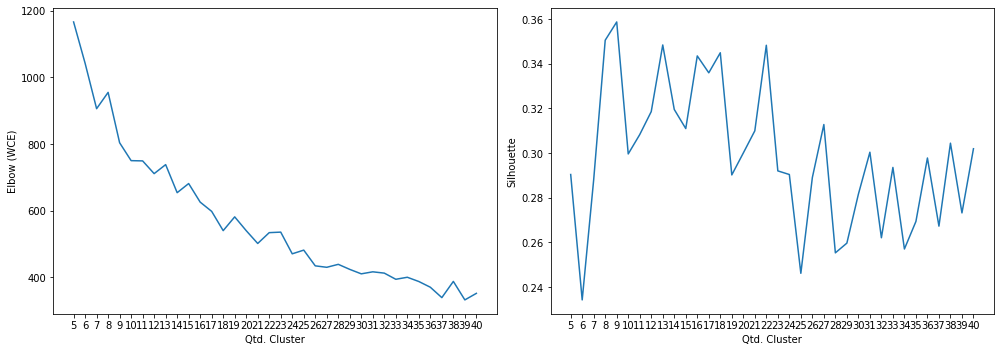

# Projeto Final

Este é o projeto final da disciplina Aprendizado de Máquina (IA006-C), ministrado pelos professores Levy Boccato e Romis, na Unicamp no 2S2019.

## Projeto

A ideia do projeto é permitir a clusterização de conteúdo textual, para que a partir deste seja criado um chatbot.

Os textos passarão pro um processo de clusterização (e aqui serão apresentados duas técnicas para gerar o espaço vetorial de documentos [TF-IDF e Doc2Vec]) usando o algoritmo KMeans e usando duas métricas para cálculo das distâncias dos documentos no espaço vetorial desejado.
 
Posterior a isso, textos que não forem similares (ou proximamente similares aos já "classificados") serão considerados como anomalias e por conseguintes novos clusters poderão ser gerados futuramente.

### Carregamento dos datasets

Os datasets de exemplos são frases já pré-categorizadas usadas em chatbots.

Contém 32 categorias e ao todo 690 documentos ou frases.

<table border="1" class="dataframe">
  <thead>
    <tr style="text-align: right;">
      <th>perguntas</th>
      <th>cluster</th>
    </tr>
  </thead>
  <tbody>
    <tr>
      <td>Como posso registrar um cartão SIM?</td>
      <td>ACTIVATE_DEVICE</td>
    </tr>
    <tr>
      <td>Por favor adicione o roaming internacional na minha conta.</td>
      <td>ACTIVATE_ROAMING</td>
    </tr>
    <tr>
      <td>Fui assaltado, preciso acionar seguro.</td>
      <td>ADD_INSURANCE</td>
    </tr>
    <tr>
      <td>Oi, eu estava esperando que você pudesse me dizer como adicionar o recurso de mensagens de texto ao meu plano?</td>
      <td>ADD_SERVICE_FEATURES</td>
    </tr>
    <tr>
      <td>Como cancelo meu serviço de telefone pré-pago?</td>
      <td>DEACTIVATE_PREPAID_PLAN</td>
    </tr>
    <tr>
      <td>Você pode verificar se posso fazer um upgrade?</td>
      <td>DEVICE_UPGRADE_ELIGIBILITY</td>
    </tr>
    <tr>
      <td>quero mudar minha password como devo proceder?</td>
      <td>PASSWORD</td>
    </tr>
    <tr>
      <td>Minha Senha está com problema</td>
      <td>PASSWORD</td>
    </tr>
    <tr>
      <td>Minha senha não funciona</td>
      <td>PASSWORD</td>
    </tr>
    <tr>
      <td>Como faço para transferir o serviço de um dispositivo antigo para um novo?</td>
      <td>SWAP_DEVICE</td>
    </tr>
  </tbody>
</table>

    Qtde. de documentos por categoria:

<table border="1" class="dataframe">
  <thead>
    <tr style="text-align: right;">
      <th>Categoria</th>
      <th>Qtde</th>
    </tr>
  </thead>
  <tbody>
    <tr>
      <td>ACCOUNT</td>
      <td>29</td>
    </tr>
    <tr>
      <td>ACTIVATE_DEVICE</td>
      <td>19</td>
    </tr>
    <tr>
      <td>ACTIVATE_PREPAID_PLAN</td>
      <td>21</td>
    </tr>
    <tr>
      <td>ACTIVATE_ROAMING</td>
      <td>20</td>
    </tr>
    <tr>
      <td>ADD_INSURANCE</td>
      <td>18</td>
    </tr>
    <tr>
      <td>ADD_SERVICE_FEATURES</td>
      <td>20</td>
    </tr>
    <tr>
      <td>BOT_FOUND</td>
      <td>20</td>
    </tr>
    <tr>
      <td>BOT_NAME</td>
      <td>16</td>
    </tr>
    <tr>
      <td>CERTIFICATE</td>
      <td>18</td>
    </tr>
    <tr>
      <td>CHANGE_PRICE_PLAN</td>
      <td>19</td>
    </tr>
    <tr>
      <td>COVERAGE_AREA_INQUIRY</td>
      <td>19</td>
    </tr>
    <tr>
      <td>DEACTIVATE_PREPAID_PLAN</td>
      <td>18</td>
    </tr>
    <tr>
      <td>DEACTIVATE_ROAMING</td>
      <td>18</td>
    </tr>
    <tr>
      <td>DEVICE_UPGRADE_ELIGIBILITY</td>
      <td>24</td>
    </tr>
    <tr>
      <td>EMAIL</td>
      <td>40</td>
    </tr>
    <tr>
      <td>INTERNATIONAL_RATE_PLAN_INQUIRY</td>
      <td>21</td>
    </tr>
    <tr>
      <td>NETWORK_COMPLAINTS</td>
      <td>23</td>
    </tr>
    <tr>
      <td>NETWORK_UNLOCK</td>
      <td>21</td>
    </tr>
    <tr>
      <td>NO_OPTION</td>
      <td>18</td>
    </tr>
    <tr>
      <td>PASSWORD</td>
      <td>27</td>
    </tr>
    <tr>
      <td>PORT_IN</td>
      <td>21</td>
    </tr>
    <tr>
      <td>PRICE_PLAN_INQUIRY</td>
      <td>23</td>
    </tr>
    <tr>
      <td>RECHARGE_SIM</td>
      <td>18</td>
    </tr>
    <tr>
      <td>REMOTE_ACCESS</td>
      <td>20</td>
    </tr>
    <tr>
      <td>REMOVE_SERVICE_FEATURES</td>
      <td>20</td>
    </tr>
    <tr>
      <td>RETURN_DEVICE</td>
      <td>21</td>
    </tr>
    <tr>
      <td>ROAMING_INQUIRY</td>
      <td>20</td>
    </tr>
    <tr>
      <td>SERVICES</td>
      <td>20</td>
    </tr>
    <tr>
      <td>SWAP_DEVICE</td>
      <td>15</td>
    </tr>
    <tr>
      <td>THANK_YOU</td>
      <td>23</td>
    </tr>
    <tr>
      <td>TROUBLESHOOTING</td>
      <td>36</td>
    </tr>
    <tr>
      <td>WIFI</td>
      <td>24</td>
    </tr>
  </tbody>
</table>

    Total docs     : 690
    Total cluster  : 690
    X_train size   : (552,)
    X_test  size   : (138,)

### Dataset tokenization

    Tokenization...
    Qtd documentos treino:  552
    Qtd Intents treino   :  32
    Finished...

    [TaggedDocument(words=['ir', 'viajar', 'certar', 'empresar', 'fornecer', 'cobertura', 'telefonar', 'viagem', 'poder', 'informacaes', 'servico', 'recepcao', 'disponivel'], tags=[0]),
     TaggedDocument(words=['servico', 'bot', 'oferecer'], tags=[1]),
     TaggedDocument(words=['voce', 'um', 'nome'], tags=[2]),
     TaggedDocument(words=['nao', 'recarregar', 'desativar', 'ativar'], tags=[3]),
     TaggedDocument(words=['voce', 'poder', 'ajudar', 'mudar', 'tocar', 'telefonar'], tags=[4]),
     TaggedDocument(words=['configurar', 'email', 'thunderbird'], tags=[5]),
     TaggedDocument(words=['nao', 'precisar', 'mais'], tags=[6]),
     TaggedDocument(words=['nao', 'conseguir', 'acessar', 'web', 'telefonar', 'nao', 'precisar', 'configuracao'], tags=[7]),
     TaggedDocument(words=['poder', 'correar', 'voz', 'permanentemente', 'remover', 'planar'], tags=[8]),
     TaggedDocument(words=['tutorial', 'configuracao', 'redar', 'fiar', 'android'], tags=[9])]

### **Doc2Vec**

Parâmetros iniciais... quantidade de dimensões dos vetores gerados para cada frase, épocas de treinamento e épocas de posterior inferência para novas frases.

A quantidade de épocas de inferência, sugere-se ser bem superior as de treinamento.

    Dimensions   : 1500
    Epochs       : 200
    Infer Epochs : 15000

    Starting model...
    Building vocab...
    Training...
    Finish...

Validação do modelo gerado pelo Doc2Vec... teste tanto nos dados apresentados para treinamento quanto nos dados de testes e as acurácias alcançadas.

Randomicamente escolhendo 100 amostras de teste.

    - Acurácia treino: 100.0
     - Acurácia teste 1  : 57.0
     - Acurácia teste 2  : 58.0
     - Acurácia teste 3  : 56.0
     - Acurácia teste 4  : 63.0
     - Acurácia teste 5  : 58.0
    - Acurácia média teste: 58.4

#### Clusterização

Utilizou-se o KMeans definindo a quantidade de clusters para o número ideal de categorias existentes no caso 33. A métrica de distância utilizada, não foi a euclidiana, mas sim a de cosseno (métrica comumente usada na classificação de texto em seu espaço vetorial).

    Frases por cluster:

<table border="1" class="dataframe">
  <thead>
    <tr style="text-align: right;">
      <th>title</th>
      <th>cluster</th>
    </tr>
  </thead>
  <tbody>
    <tr>
      <td>Existe a possibilidade de ter o meu dispositivo de telefone de alguma forma assegurado?</td>
      <td>0</td>
    </tr>
    <tr>
      <td>Eu vou estar viajando e estou certo se minha empresa fornece cobertura de telefone na minha área de viagens. Poderia me dar informações sobre onde o serviço e recepção estará disponível?</td>
      <td>0</td>
    </tr>
    <tr>
      <td>Existe alguma interrupção no sinal? estou sem cobertura.</td>
      <td>0</td>
    </tr>
    <tr>
      <td>Quanto custará aumentar a velocidade da minha internet para 1GB?</td>
      <td>1</td>
    </tr>
    <tr>
      <td>Eu estou com outra empresa agora, mas quero mudar para vocês. É possível manter meu número de telefone atual?</td>
      <td>1</td>
    </tr>
    <tr>
      <td>Posso levar meu telefone comigo se eu mudar para uma nova empresa.</td>
      <td>1</td>
    </tr>
    <tr>
      <td>Olá. É possível mudar o meu provedor para outro enquanto mantenho este número?</td>
      <td>2</td>
    </tr>
    <tr>
      <td>Que tipo de planos de roaming são oferecidos pelo meu provedor de serviços? Gostaria de um plano econômico que me permita roaming enquanto viajo.</td>
      <td>2</td>
    </tr>
    <tr>
      <td>Quero mudar os provedores de serviço, ainda posso manter meu mesmo número de telefone?</td>
      <td>2</td>
    </tr>
    <tr>
      <td>Desativar meu dispositivo quando no exterior</td>
      <td>3</td>
    </tr>
    <tr>
      <td>Por favor, você pode me ajudar a ativar o meu novo telefone pré-pago e fazê-lo funcionar corretamente.</td>
      <td>3</td>
    </tr>
    <tr>
      <td>Quando é que o crédito expira para o meu serviço pré-pago?</td>
      <td>3</td>
    </tr>
    <tr>
      <td>tem como configurar meu email no outlook?</td>
      <td>4</td>
    </tr>
    <tr>
      <td>consigo criar um endereço eletrônico de email institucional?</td>
      <td>4</td>
    </tr>
    <tr>
      <td>Como faço para recuperar meus emails?</td>
      <td>4</td>
    </tr>
    <tr>
      <td>Estou tendo problemas ao desativar o meu dispositivo pré-pago. Existe um FAQ disponível para me explicar isso passo a passo?</td>
      <td>5</td>
    </tr>
    <tr>
      <td>Você poderia me falar sobre os diferentes planos de preços disponíveis na minha localização?</td>
      <td>5</td>
    </tr>
    <tr>
      <td>quais outras opcoes voce consegue responder pra mim?</td>
      <td>5</td>
    </tr>
    <tr>
      <td>Quanto vai custar para usar a quantidade de dados que normalmente uso, em Londres?</td>
      <td>6</td>
    </tr>
    <tr>
      <td>Como desligar meus dados automaticamente quando o WI-FI está disponível?</td>
      <td>6</td>
    </tr>
    <tr>
      <td>Preciso de informações sobre plano de chamada internacional, o que você sugere?</td>
      <td>6</td>
    </tr>
    <tr>
      <td>Há alguma limitação quanto aos países no exterior que eu posso chamar e acessar do meu país de origem?</td>
      <td>7</td>
    </tr>
    <tr>
      <td>Posso incluir roaming no meu plano por duas semanas?</td>
      <td>7</td>
    </tr>
    <tr>
      <td>Chamadas feitas enquanto estou viajando no exterior estão incluídas no meu plano?</td>
      <td>7</td>
    </tr>
    <tr>
      <td>Preciso que um humano me ajude</td>
      <td>8</td>
    </tr>
    <tr>
      <td>você é um chatbot?</td>
      <td>8</td>
    </tr>
    <tr>
      <td>valeu mesmo, obrigado</td>
      <td>8</td>
    </tr>
    <tr>
      <td>Ei, quando estou no meu jardim eu não consigo um sinal, pode explicar isto por favor?</td>
      <td>9</td>
    </tr>
    <tr>
      <td>Você pode me dizer por que nunca tenho sinal no meu telefone quando estou no trabalho, mas não tenho problema em nenhum outro lugar?</td>
      <td>9</td>
    </tr>
    <tr>
      <td>Meu novo telefone não está ativado ainda. Quem pode me ajudar com este problema?</td>
      <td>9</td>
    </tr>
    <tr>
      <td>não consigo criar meu username, da mensagem de username já cadastrado</td>
      <td>10</td>
    </tr>
    <tr>
      <td>quero criar um novo username para mim</td>
      <td>10</td>
    </tr>
    <tr>
      <td>qual o nome que atribuiram a você?</td>
      <td>10</td>
    </tr>
    <tr>
      <td>Posso cancelar meu roaming em qualquer momento?</td>
      <td>11</td>
    </tr>
    <tr>
      <td>Preciso de informações em como cancelar o roaming</td>
      <td>11</td>
    </tr>
    <tr>
      <td>Gostaria de cancelar minha cobertura de roaming e tethering.</td>
      <td>11</td>
    </tr>
    <tr>
      <td>tem como renovar um certificado digital emitido?</td>
      <td>12</td>
    </tr>
    <tr>
      <td>onde consigo mais informações sobre a emição / manutenção de certificados digitais emitidos pela empresa?</td>
      <td>12</td>
    </tr>
    <tr>
      <td>Como faço para me certificar que posso manter meu número de telefone quando troco de operadora?</td>
      <td>12</td>
    </tr>
    <tr>
      <td>Quero informações sobre como alterar meu plano para uma nova oferta</td>
      <td>13</td>
    </tr>
    <tr>
      <td>Logo precisarei fazer várias ligações internacionais do meu país. Onde posso encontrar, ou como posso ter uma lista completa com todos os preços possíveis indicados?</td>
      <td>13</td>
    </tr>
    <tr>
      <td>Qual plano de dados é o menos caro para mim?</td>
      <td>13</td>
    </tr>
    <tr>
      <td>Quanto custa enviar uma mensagem de texto internacionalmente?</td>
      <td>14</td>
    </tr>
    <tr>
      <td>Eu gostaria de incluir texto de mensagem para o meu plano, pode fazer isso por mim?</td>
      <td>14</td>
    </tr>
    <tr>
      <td>Meu telefone novo não pode receber nenhuma mensagem de texto ou e-mail enquanto eu estou em uma chamada? Eu costumava ser capaz de fazer isso com meu telefone antigo</td>
      <td>14</td>
    </tr>
    <tr>
      <td>Quero desligar o roaming da minha conta</td>
      <td>15</td>
    </tr>
    <tr>
      <td>O serviço de roaming é ativado automaticamente ou eu preciso ativá-lo manualmente?</td>
      <td>15</td>
    </tr>
    <tr>
      <td>Eu vou à Florença neste fim de semana e quero ativar roaming.</td>
      <td>15</td>
    </tr>
    <tr>
      <td>existem mais serviços com os quais eu posso consultar?</td>
      <td>16</td>
    </tr>
    <tr>
      <td>nenhuma dessas opções me ajuda</td>
      <td>16</td>
    </tr>
    <tr>
      <td>quais outros serviços eu posso consultar por você?</td>
      <td>16</td>
    </tr>
    <tr>
      <td>Quais servicos posso remover diretamente pelo meu aparelho?</td>
      <td>17</td>
    </tr>
    <tr>
      <td>Como poderia ter meu correio de voz permanentemente removido do meu plano?</td>
      <td>17</td>
    </tr>
    <tr>
      <td>Quero informações sobre fazer ligações internacionais de casa</td>
      <td>17</td>
    </tr>
    <tr>
      <td>Posso por favor ter as instruções para desbloquear meu dispositivo?</td>
      <td>18</td>
    </tr>
    <tr>
      <td>Quero perguntar sobre o cancelamento do pedido de um dispositivo móvel</td>
      <td>18</td>
    </tr>
    <tr>
      <td>Olá, eu tenho um novo dispositivo, e um cartão SIM de vocês com contrato mensal que obtive em uma loja, e já passaram 24 horas e o SIM ainda não está funcionando, e a loka está dizendo que tudo está ativado da parte deles</td>
      <td>18</td>
    </tr>
    <tr>
      <td>Eu não sou elegível para uma atualização gratuita, mas eu gostaria de comprar um novo celular. Por favor, me mostre o preço do mais moderno.</td>
      <td>19</td>
    </tr>
    <tr>
      <td>Como trocar um plano de conversação direta para um telefone desta operadora gratuitamente?</td>
      <td>19</td>
    </tr>
    <tr>
      <td>Oi, eu preciso de um seguro para o meu telefone, quais são as opções disponíveis para o meu plano?</td>
      <td>19</td>
    </tr>
    <tr>
      <td>você atende outro tipo de serviço? ou só estes?</td>
      <td>20</td>
    </tr>
    <tr>
      <td>você disponibiliza outro tipo de serviço?</td>
      <td>20</td>
    </tr>
    <tr>
      <td>Você pode por favor fornecer-me com informações sobre os diferentes planos que estão disponíveis?</td>
      <td>20</td>
    </tr>
    <tr>
      <td>Eu pedi o telefone errado on-line e preciso devolvê-lo. Como faço para obter uma etiqueta de retorno e obter o telefone certo?</td>
      <td>21</td>
    </tr>
    <tr>
      <td>Indique quanto tempo eu aguardo para mudar meu telefone para um modelo mais novo</td>
      <td>21</td>
    </tr>
    <tr>
      <td>Você tem informações para me dar sobre como retornar um telefone que eu acabei de comprar?</td>
      <td>21</td>
    </tr>
    <tr>
      <td>como você se chama?</td>
      <td>22</td>
    </tr>
    <tr>
      <td>Quero poder encaminhar chamadas do meu telefone, como posso adicionar esse recurso ao meu plano atual?</td>
      <td>22</td>
    </tr>
    <tr>
      <td>As chamadas internacionais estão incluídas no meu plano?</td>
      <td>22</td>
    </tr>
    <tr>
      <td>Como faço para desbloquear minha conta no celular pré-pago?</td>
      <td>23</td>
    </tr>
    <tr>
      <td>Preciso apresentar algum documento para utilizar o seguro do meu aparelho?</td>
      <td>23</td>
    </tr>
    <tr>
      <td>Estive com esta empresa por 12 meses, posso obter um novo aparelho por um bom preço?</td>
      <td>23</td>
    </tr>
    <tr>
      <td>Esqueci a minha senha</td>
      <td>24</td>
    </tr>
    <tr>
      <td>inseri o email e senha e não deu certo</td>
      <td>24</td>
    </tr>
    <tr>
      <td>Não consigo restaurar a minha senha</td>
      <td>24</td>
    </tr>
    <tr>
      <td>poxa, obrigado, me ajudou muito</td>
      <td>25</td>
    </tr>
    <tr>
      <td>muito obrigado mesmo</td>
      <td>25</td>
    </tr>
    <tr>
      <td>acho que nenhuma opção padrão me interessa</td>
      <td>25</td>
    </tr>
    <tr>
      <td>how to configure vpn?</td>
      <td>26</td>
    </tr>
    <tr>
      <td>configurar vpn (acesso remoto) em aparelhos da nokia</td>
      <td>26</td>
    </tr>
    <tr>
      <td>utilizar o acesso remoto via vpn</td>
      <td>26</td>
    </tr>
    <tr>
      <td>é permitido que patrulheiros tenham uma conta?</td>
      <td>27</td>
    </tr>
    <tr>
      <td>tem como eu mudar meu nome de usuário?</td>
      <td>27</td>
    </tr>
    <tr>
      <td>um patrulheiro pode ter uma conta de usuário?</td>
      <td>27</td>
    </tr>
    <tr>
      <td>Eu não posso recarregar porque diz que meu sim está desativado , meu sim pode ser ativado?</td>
      <td>28</td>
    </tr>
    <tr>
      <td>Quando meu produto solicitado será ativado?</td>
      <td>28</td>
    </tr>
    <tr>
      <td>Preciso ir até uma loja para ativar meu novo SIM?</td>
      <td>28</td>
    </tr>
    <tr>
      <td>Eu não quero mais usar meu telefone pré-pago atual.</td>
      <td>29</td>
    </tr>
    <tr>
      <td>Eu preciso recarregar o dongle que pago mensalmente. Os dados foram consumidos.</td>
      <td>29</td>
    </tr>
    <tr>
      <td>Preciso remover o MMS no meu telefone.</td>
      <td>29</td>
    </tr>
    <tr>
      <td>Oi, já que você está aqui, está havendo algum problema com a cobertura na área de SP? Desde ontem o meu sinal normal de 4 barras ficou em 0, está bem em outros lugares.</td>
      <td>30</td>
    </tr>
    <tr>
      <td>Qual o tamanho da área de cobertura do meu novo telefone, e há lugares perto de mim onde eu não vou conseguir acessar o serviço?</td>
      <td>30</td>
    </tr>
    <tr>
      <td>Vou ficar sem sinal durante a troca para o plano pré-pago?</td>
      <td>30</td>
    </tr>
    <tr>
      <td>A rede está horrível! Alguma manutenção acontecendo?</td>
      <td>31</td>
    </tr>
    <tr>
      <td>queria saber se consigo configurar o wifi da empresa</td>
      <td>31</td>
    </tr>
    <tr>
      <td>como faco para acessar a rede sem fio de fora da empresa?</td>
      <td>31</td>
    </tr>
  </tbody>
</table>

    --------------------
    Documentos por cluster:

<table border="1" class="dataframe">
  <tbody>
    <tr>
      <td>C0</td>
      <td>13</td>
    </tr>
    <tr>
      <td>C1</td>
      <td>13</td>
    </tr>
    <tr>
      <td>C2</td>
      <td>7</td>
    </tr>
    <tr>
      <td>C3</td>
      <td>32</td>
    </tr>
    <tr>
      <td>C4</td>
      <td>18</td>
    </tr>
    <tr>
      <td>C5</td>
      <td>9</td>
    </tr>
    <tr>
      <td>C6</td>
      <td>12</td>
    </tr>
    <tr>
      <td>C7</td>
      <td>13</td>
    </tr>
    <tr>
      <td>C8</td>
      <td>28</td>
    </tr>
    <tr>
      <td>C9</td>
      <td>13</td>
    </tr>
    <tr>
      <td>C10</td>
      <td>27</td>
    </tr>
    <tr>
      <td>C11</td>
      <td>6</td>
    </tr>
    <tr>
      <td>C12</td>
      <td>13</td>
    </tr>
    <tr>
      <td>C13</td>
      <td>11</td>
    </tr>
    <tr>
      <td>C14</td>
      <td>9</td>
    </tr>
    <tr>
      <td>C15</td>
      <td>24</td>
    </tr>
    <tr>
      <td>C16</td>
      <td>15</td>
    </tr>
    <tr>
      <td>C17</td>
      <td>11</td>
    </tr>
    <tr>
      <td>C18</td>
      <td>21</td>
    </tr>
    <tr>
      <td>C19</td>
      <td>31</td>
    </tr>
    <tr>
      <td>C20</td>
      <td>17</td>
    </tr>
    <tr>
      <td>C21</td>
      <td>17</td>
    </tr>
    <tr>
      <td>C22</td>
      <td>23</td>
    </tr>
    <tr>
      <td>C23</td>
      <td>22</td>
    </tr>
    <tr>
      <td>C24</td>
      <td>28</td>
    </tr>
    <tr>
      <td>C25</td>
      <td>13</td>
    </tr>
    <tr>
      <td>C26</td>
      <td>14</td>
    </tr>
    <tr>
      <td>C27</td>
      <td>16</td>
    </tr>
    <tr>
      <td>C28</td>
      <td>21</td>
    </tr>
    <tr>
      <td>C29</td>
      <td>16</td>
    </tr>
    <tr>
      <td>C30</td>
      <td>3</td>
    </tr>
    <tr>
      <td>C31</td>
      <td>36</td>
    </tr>
  </tbody>
</table>

#### Visualização

Apresentação dos protótipos gerados pelo KMeans, reduzindo a dimensão usando o algoritmo MDS (Multidimensional Scaling).

#### Clusterização dos dados de Teste

Por fim, realizada a clusterização dos dados de teste e a apresentação das 8 primeiras frases do conjunto de teste juntamente com outras duas frases do cluster ao qual foi identificado como o melhor.

    * Se eu ativar roaming agora, já posso utilizar?
      -  configurar vpn (acesso remoto) em aparelhos da nokia
      -  utilizar o acesso remoto via vpn
    --------------------
    * Fui assaltado, preciso acionar seguro.
      -  Oi, eu preciso de um seguro para o meu telefone, quais são as opções disponíveis para o meu plano?
      -  Eu não sou elegível para uma atualização gratuita, mas eu gostaria de comprar um novo celular. Por favor, me mostre o preço do mais moderno.
    --------------------
    * Estou bastante cansado do meu telefone existente e gostaria de saber quando eu vou ser elegível para sua atualização?
      -  Posso por favor ter as instruções para desbloquear meu dispositivo?
      -  Olá, eu tenho um novo dispositivo, e um cartão SIM de vocês com contrato mensal que obtive em uma loja, e já passaram 24 horas e o SIM ainda não está funcionando, e a loka está dizendo que tudo está ativado da parte deles
    --------------------
    * Oi, como posso ativar o encaminhamento de chamada no meu plano?
      -  Quero informações sobre fazer ligações internacionais de casa
      -  Como poderia ter meu correio de voz permanentemente removido do meu plano?
    --------------------
    * Eu não consigo acessar meu email
      -  Esqueci a minha senha
      -  inseri o email e senha e não deu certo
    --------------------
    * Estou indo para uma viagem ao extremo norte da Ilha de Vancouver e gostaria de verificar se há serviço de celular nessa área. Você pode verificar o quanto longe do norte eu posso esperar para receber a recepção.
      -  Quero mudar os provedores de serviço, ainda posso manter meu mesmo número de telefone?
      -  Que tipo de planos de roaming são oferecidos pelo meu provedor de serviços? Gostaria de um plano econômico que me permita roaming enquanto viajo.
    --------------------
    * Gostaria de verificar todas as taxas para cobertura internacional
      -  Quero desligar o roaming da minha conta
      -  Eu vou à Florença neste fim de semana e quero ativar roaming.
    --------------------
    * Além do fornecimento de água vocês oferecem algum outro serviço?
      -  você disponibiliza outro tipo de serviço?
      -  Você pode por favor fornecer-me com informações sobre os diferentes planos que estão disponíveis?
    --------------------

#### Métricas

Abaixo são apresentadas métricas para demonstrar o quanto a clusterização parece funcionar.

    Homogeneidade    :  0.669
    Completude       :  0.69
    Silhouette       :  -0.027

Como exemplo de comparação, foi executado o mesmo algoritmo de clusterização (conforme apresentado acima) entretanto variando a quantidade do número de clusters para verificar como as métricas se comportam.

#### Escolha da quantidade de Cluster

Como não sabe-se ao certo quantos clusteres na realidade podem vir a existir, considerou-se que a quantidade máxima de clusters seria algo em torno de 40.

Para calcular exatamente qual a quantidade máxima, utilizou-se do maior valor dados pelas métricas Elbow e Silhouette (cada uma dando seu valor ideal de clusteres).

Abaixo segue o resultado.

    Running Elbow...
    Running Silhouette...
    N. Elbow      Cluster :  20
    N. Silhouette Cluster :  21

    Frases por cluster:

<table border="1" class="dataframe">
  <thead>
    <tr style="text-align: right;">
      <th>title</th>
      <th>cluster</th>
    </tr>
  </thead>
  <tbody>
    <tr>
      <td>quais outras opcoes voce consegue responder pra mim?</td>
      <td>0</td>
    </tr>
    <tr>
      <td>Oi. Tenho um sinal forte, mas não consigo fazer ou receber chamadas. Você pode me ajudar a ver como resolver esse problema?</td>
      <td>0</td>
    </tr>
    <tr>
      <td>Oi, já que você está aqui, está havendo algum problema com a cobertura na área de SP? Desde ontem o meu sinal normal de 4 barras ficou em 0, está bem em outros lugares.</td>
      <td>0</td>
    </tr>
    <tr>
      <td>Oi, eu comprei um celular novo e gostaria de trocar a minha conta do meu telefone velho para o meu telefone novo, por favor</td>
      <td>1</td>
    </tr>
    <tr>
      <td>Quero adicionar proteção do dispositivo à minha conta</td>
      <td>1</td>
    </tr>
    <tr>
      <td>Eu preciso recarregar o dongle que pago mensalmente. Os dados foram consumidos.</td>
      <td>1</td>
    </tr>
    <tr>
      <td>acho que por enquanto e só isso mesmo, obrigado</td>
      <td>2</td>
    </tr>
    <tr>
      <td>Bom dia, eu me pergunto se você gostaria de saber quais são as áreas de cobertura da companhia telefônica?</td>
      <td>2</td>
    </tr>
    <tr>
      <td>Você poderia me falar sobre os diferentes planos de preços disponíveis na minha localização?</td>
      <td>2</td>
    </tr>
    <tr>
      <td>Você poderia me ajudar em como mudar o toque do meu telefone?</td>
      <td>3</td>
    </tr>
    <tr>
      <td>Eu não tenho seguro para o meu telefone, como posso fazer/obter isso?</td>
      <td>3</td>
    </tr>
    <tr>
      <td>Quero mudar os provedores de serviço, ainda posso manter meu mesmo número de telefone?</td>
      <td>3</td>
    </tr>
    <tr>
      <td>Qual é o procedimento para incluir um seguro para o meu telefone?</td>
      <td>4</td>
    </tr>
    <tr>
      <td>Sabe quando serei elegível de ter um upgrade de dispositivo?</td>
      <td>4</td>
    </tr>
    <tr>
      <td>Olá eu acabei de atualizar o meu telefone e quero que minha filha use o meu antigo celular até ela poder atualizar.</td>
      <td>4</td>
    </tr>
    <tr>
      <td>Eu estava querendo me inscrever em um plano com sua empresa e estava pensando quais são alguns dos planos de preços que você tem para oferecer?</td>
      <td>5</td>
    </tr>
    <tr>
      <td>Quero que meu aparelho pare de buscar sinal quando chego em um novo país</td>
      <td>5</td>
    </tr>
    <tr>
      <td>Como posso fazer uma ligação internacional do meu país de origem?</td>
      <td>5</td>
    </tr>
    <tr>
      <td>Desativar meu dispositivo quando no exterior</td>
      <td>6</td>
    </tr>
    <tr>
      <td>Existe uma loja local que poderia ativar o meu telefone pré-pago?</td>
      <td>6</td>
    </tr>
    <tr>
      <td>Como cancelo meu serviço de telefone pré-pago?</td>
      <td>6</td>
    </tr>
    <tr>
      <td>Quanto vai custar para usar a quantidade de dados que normalmente uso, em Londres?</td>
      <td>7</td>
    </tr>
    <tr>
      <td>Eu quero aumentar o número de mensagens no meu plano de serviço</td>
      <td>7</td>
    </tr>
    <tr>
      <td>Quanto custará aumentar a velocidade da minha internet para 1GB?</td>
      <td>7</td>
    </tr>
    <tr>
      <td>Eu fui cobrada pelo serviço de identificação de chamadas que eu solicitei especificamente para não ter. Você pode remover o serviço e reembolsar a cobrança?</td>
      <td>8</td>
    </tr>
    <tr>
      <td>Quais servicos posso remover diretamente pelo meu aparelho?</td>
      <td>8</td>
    </tr>
    <tr>
      <td>Como poderia ter meu correio de voz permanentemente removido do meu plano?</td>
      <td>8</td>
    </tr>
    <tr>
      <td>nao preciso mais de ajuda, obrigado</td>
      <td>9</td>
    </tr>
    <tr>
      <td>Eu não sei porque, mas o meu telefone não funciona em casa.</td>
      <td>9</td>
    </tr>
    <tr>
      <td>Quando meu produto solicitado será ativado?</td>
      <td>9</td>
    </tr>
    <tr>
      <td>Por que sua loja não aceita o meu retorno?</td>
      <td>10</td>
    </tr>
    <tr>
      <td>Eu pedi o telefone errado on-line e preciso devolvê-lo. Como faço para obter uma etiqueta de retorno e obter o telefone certo?</td>
      <td>10</td>
    </tr>
    <tr>
      <td>Olá, eu tenho um novo dispositivo, e um cartão SIM de vocês com contrato mensal que obtive em uma loja, e já passaram 24 horas e o SIM ainda não está funcionando, e a loka está dizendo que tudo está ativado da parte deles</td>
      <td>10</td>
    </tr>
    <tr>
      <td>como acessar wifi da empresa?</td>
      <td>11</td>
    </tr>
    <tr>
      <td>tenho duvidas sobre vpn</td>
      <td>11</td>
    </tr>
    <tr>
      <td>quero acessar a rede da empresa da minha casa</td>
      <td>11</td>
    </tr>
    <tr>
      <td>Precio ir em uma loja fisica para fazer desbloqueio do meu aparelho celular?</td>
      <td>12</td>
    </tr>
    <tr>
      <td>O que eu preciso fazer para desbloquear meu novo aparelho?</td>
      <td>12</td>
    </tr>
    <tr>
      <td>Comprei um celular através da Amazon, como posso adicioná-lo à minha conta?</td>
      <td>12</td>
    </tr>
    <tr>
      <td>Não consigo iniciar o bluetooth para emparelhar com o fone de ouvido, o que devo fazer?</td>
      <td>13</td>
    </tr>
    <tr>
      <td>não consegui acessar meu email</td>
      <td>13</td>
    </tr>
    <tr>
      <td>Qual o tamanho da área de cobertura do meu novo telefone, e há lugares perto de mim onde eu não vou conseguir acessar o serviço?</td>
      <td>13</td>
    </tr>
    <tr>
      <td>quero mais informações sobre certificados digitais</td>
      <td>14</td>
    </tr>
    <tr>
      <td>Como faço para me certificar que posso manter meu número de telefone quando troco de operadora?</td>
      <td>14</td>
    </tr>
    <tr>
      <td>como emitir novos certificados digitais?</td>
      <td>14</td>
    </tr>
    <tr>
      <td>Qual o preço para ativar o roaming?</td>
      <td>15</td>
    </tr>
    <tr>
      <td>O serviço de roaming é ativado automaticamente ou eu preciso ativá-lo manualmente?</td>
      <td>15</td>
    </tr>
    <tr>
      <td>Eu gostaria de saber sobre os encargos de roaming internacional e como ativar isto.</td>
      <td>15</td>
    </tr>
    <tr>
      <td>Usuário / Matrícula já cadastrado com o username</td>
      <td>16</td>
    </tr>
    <tr>
      <td>eu consigo trocar meu username para outro?</td>
      <td>16</td>
    </tr>
    <tr>
      <td>Algo parece estar seriamente errado, já que nem posso fazer nem receber chamadas independentemente de onde estou.</td>
      <td>16</td>
    </tr>
    <tr>
      <td>quero me conectar a rede sem fio</td>
      <td>17</td>
    </tr>
    <tr>
      <td>como conectar a rede wifi do meu departamento?</td>
      <td>17</td>
    </tr>
    <tr>
      <td>queria conectar a rede sem fio da empresa, como proceder?</td>
      <td>17</td>
    </tr>
    <tr>
      <td>essa resposta, parece ser a de um chatbot</td>
      <td>18</td>
    </tr>
    <tr>
      <td>Quero falar com um atendente humano</td>
      <td>18</td>
    </tr>
    <tr>
      <td>estou falando com um chatbot com certeza</td>
      <td>18</td>
    </tr>
    <tr>
      <td>existe alguma maneira de alterar meu nome de usuário?</td>
      <td>19</td>
    </tr>
    <tr>
      <td>um patrulheiro pode ter uma conta de usuário?</td>
      <td>19</td>
    </tr>
    <tr>
      <td>como criar um endereço eletrônico de email institucional</td>
      <td>19</td>
    </tr>
    <tr>
      <td>Eu preciso obter um plano maior. Eu posso obter algumas cotações de preço</td>
      <td>20</td>
    </tr>
    <tr>
      <td>Qual é o custo por ativação de um dispositivo?</td>
      <td>20</td>
    </tr>
    <tr>
      <td>Quanto tempo leva para que um dispositivo pré-pago pare de funcionar?</td>
      <td>20</td>
    </tr>
  </tbody>
</table>

    --------------------
    Documentos por cluster:

<table border="1" class="dataframe">
  <tbody>
    <tr>
      <td>C0</td>
      <td>28</td>
    </tr>
    <tr>
      <td>C1</td>
      <td>13</td>
    </tr>
    <tr>
      <td>C2</td>
      <td>48</td>
    </tr>
    <tr>
      <td>C3</td>
      <td>18</td>
    </tr>
    <tr>
      <td>C4</td>
      <td>33</td>
    </tr>
    <tr>
      <td>C5</td>
      <td>23</td>
    </tr>
    <tr>
      <td>C6</td>
      <td>34</td>
    </tr>
    <tr>
      <td>C7</td>
      <td>19</td>
    </tr>
    <tr>
      <td>C8</td>
      <td>26</td>
    </tr>
    <tr>
      <td>C9</td>
      <td>22</td>
    </tr>
    <tr>
      <td>C10</td>
      <td>26</td>
    </tr>
    <tr>
      <td>C11</td>
      <td>27</td>
    </tr>
    <tr>
      <td>C12</td>
      <td>20</td>
    </tr>
    <tr>
      <td>C13</td>
      <td>37</td>
    </tr>
    <tr>
      <td>C14</td>
      <td>13</td>
    </tr>
    <tr>
      <td>C15</td>
      <td>42</td>
    </tr>
    <tr>
      <td>C16</td>
      <td>20</td>
    </tr>
    <tr>
      <td>C17</td>
      <td>29</td>
    </tr>
    <tr>
      <td>C18</td>
      <td>26</td>
    </tr>
    <tr>
      <td>C19</td>
      <td>28</td>
    </tr>
    <tr>
      <td>C20</td>
      <td>20</td>
    </tr>
  </tbody>
</table>

---

### **TF-IDF**

No caso do tf-idf, assim como no doc2vec foi escolhido um máximo de até 500 features (ou dimensões). Entretanto, diferentemente do doc2vec o tf-idf não adiciona dimensões caso a quantidade de termos (palavras) seja inferior a esse máximo, mas ele corta caso for maior.

    Tokenization...
    Qtd documentos treino:  552
    Qtd Intents treino   :  32
    Finished...

    ['ir viajar certar empresar fornecer cobertura telefonar viagem poder informacaes servico recepcao disponivel',
     'servico bot oferecer',
     'voce um nome',
     'nao recarregar desativar ativar',
     'voce poder ajudar mudar tocar telefonar',
     'configurar email thunderbird',
     'nao precisar mais',
     'nao conseguir acessar web telefonar nao precisar configuracao',
     'poder correar voz permanentemente remover planar',
     'tutorial configuracao redar fiar android']

Validação do modelo gerado pelo TF-IDF... teste tanto nos dados apresentados para treinamento quanto nos dados de testes e as acurácias alcançadas.

Randomicamente escolhendo 100 amostras de teste.

    - Acurácia treino: 97.0
    --------------------
     - Acurácia teste 1  : 61.0
     - Acurácia teste 2  : 58.0
     - Acurácia teste 3  : 59.0
     - Acurácia teste 4  : 54.0
     - Acurácia teste 5  : 57.0
    - Acurácia média teste: 57.8

#### Clusterização

Utilizou-se o KMeans definindo a quantidade de clusters para o número ideal de categorias existentes no caso 33. A métrica de distância utilizada, não foi a euclidiana, mas sim a de cosseno (métrica comumente usada na classificação de texto em seu espaço vetorial).

    Frases por cluster:

<table border="1" class="dataframe">
  <thead>
    <tr style="text-align: right;">
      <th>title</th>
      <th>cluster</th>
    </tr>
  </thead>
  <tbody>
    <tr>
      <td>Minha bateria esgotou rapidamente</td>
      <td>0</td>
    </tr>
    <tr>
      <td>estou sem acesso ao meu endereco eletronico</td>
      <td>0</td>
    </tr>
    <tr>
      <td>Como posso desbloquear meu novo telefone pré-pago para que meu plano de serviço funcione?</td>
      <td>1</td>
    </tr>
    <tr>
      <td>Olá preciso de um PIN de Desbloqueio de Rede, por favor</td>
      <td>1</td>
    </tr>
    <tr>
      <td>não estou conseguindo criar um novo nome de usuário</td>
      <td>2</td>
    </tr>
    <tr>
      <td>qual é o seu nome?</td>
      <td>2</td>
    </tr>
    <tr>
      <td>Preciso de alguém que possa me ensinar a cancelar meu telefone pré-pago.</td>
      <td>3</td>
    </tr>
    <tr>
      <td>Como posso cancelar minha linha de telefone pré-pago?</td>
      <td>3</td>
    </tr>
    <tr>
      <td>Chamadas feitas enquanto estou viajando no exterior estão incluídas no meu plano?</td>
      <td>4</td>
    </tr>
    <tr>
      <td>Onde posso localizar informações detalhadas sobre o seu plano de taxa internacional?</td>
      <td>4</td>
    </tr>
    <tr>
      <td>Quando dentro do contrato sou elegivel para atualizar meu atual aparelho?</td>
      <td>5</td>
    </tr>
    <tr>
      <td>Se eu mudar um proveder, o que acontecerá com o meu número atual?</td>
      <td>5</td>
    </tr>
    <tr>
      <td>você atende outro tipo de serviço? ou só estes?</td>
      <td>6</td>
    </tr>
    <tr>
      <td>pra que voce serve?</td>
      <td>6</td>
    </tr>
    <tr>
      <td>como eu devo lhe chamar?</td>
      <td>7</td>
    </tr>
    <tr>
      <td>Não consigo iniciar o bluetooth para emparelhar com o fone de ouvido, o que devo fazer?</td>
      <td>7</td>
    </tr>
    <tr>
      <td>O equipamento deve ser devolvido à empresa quando você cancela o meu serviço?</td>
      <td>8</td>
    </tr>
    <tr>
      <td>Quando é o último dia que posso devolver meu telefone?</td>
      <td>8</td>
    </tr>
    <tr>
      <td>Alteração de certificado digital</td>
      <td>9</td>
    </tr>
    <tr>
      <td>tem como renovar um certificado digital emitido?</td>
      <td>9</td>
    </tr>
    <tr>
      <td>E se eu diminuir meu plano de dados para 5Gb e desejar alterá-lo de volta para 15GB minutos depois. Posso pegar meu plano atual de volta?</td>
      <td>10</td>
    </tr>
    <tr>
      <td>Eu preciso recarregar o dongle que pago mensalmente. Os dados foram consumidos.</td>
      <td>10</td>
    </tr>
    <tr>
      <td>Como eu adiciono uma nova categoria de intenção?</td>
      <td>11</td>
    </tr>
    <tr>
      <td>Por favor adicione o roaming internacional na minha conta.</td>
      <td>11</td>
    </tr>
    <tr>
      <td>Como mudar de telefone?</td>
      <td>12</td>
    </tr>
    <tr>
      <td>Eu pedi para manter meu número antigo enviado isso on-line na noite de sexta-feira, logo após a meia-noite ainda meu número não foi transferido</td>
      <td>12</td>
    </tr>
    <tr>
      <td>O meu telefone não recebe cobertura quando eu dirijo para a casa da minha mãe. Se eu lhe der o endereço dela, poderia me dizer o que posso fazer para melhorar minha recepção lá?</td>
      <td>13</td>
    </tr>
    <tr>
      <td>Você tem recepção nas áreas rurais do estado?</td>
      <td>13</td>
    </tr>
    <tr>
      <td>Você poderia me falar sobre os diferentes planos de preços disponíveis na minha localização?</td>
      <td>14</td>
    </tr>
    <tr>
      <td>Tenho usado o meu celular menos desde o ano passado, então eu gostaria de ter melhores planos de preços que atendam às minhas necessidades.</td>
      <td>14</td>
    </tr>
    <tr>
      <td>Posso falar com um humano?</td>
      <td>15</td>
    </tr>
    <tr>
      <td>estou falando com um bot não?</td>
      <td>15</td>
    </tr>
    <tr>
      <td>Como faço chamadas telefônicas para outros países?</td>
      <td>16</td>
    </tr>
    <tr>
      <td>Quero que meu aparelho pare de buscar sinal quando chego em um novo país</td>
      <td>16</td>
    </tr>
    <tr>
      <td>A minha internet não funciona no meu celular</td>
      <td>17</td>
    </tr>
    <tr>
      <td>Posso mudar o meu plano de tarifa para algo que funcione melhor para mim?</td>
      <td>17</td>
    </tr>
    <tr>
      <td>Seria possível alguém para me acompanhar através das etapas para ativar meu dispositivo pré-pago?</td>
      <td>18</td>
    </tr>
    <tr>
      <td>Quero ativar o meu novo aparelho telefonico por favor</td>
      <td>18</td>
    </tr>
    <tr>
      <td>eu consigo trocar meu username para outro?</td>
      <td>19</td>
    </tr>
    <tr>
      <td>como trocar minha senha</td>
      <td>19</td>
    </tr>
    <tr>
      <td>Eu pedi o telefone errado on-line e preciso devolvê-lo. Como faço para obter uma etiqueta de retorno e obter o telefone certo?</td>
      <td>20</td>
    </tr>
    <tr>
      <td>Eu gostaria de segurar meu telefone. Pode me ajudar com isso?</td>
      <td>20</td>
    </tr>
    <tr>
      <td>Eu fiz uma atualização e eu quero registrar um novo cartão SIM.</td>
      <td>21</td>
    </tr>
    <tr>
      <td>Você pode me enviar uma nova cópia da minha conta?</td>
      <td>21</td>
    </tr>
    <tr>
      <td>Preciso desconectar uma das minhas linhas telefônicas. Posso fazer isso por telefone?</td>
      <td>22</td>
    </tr>
    <tr>
      <td>Remover o encaminhamento de chamada</td>
      <td>22</td>
    </tr>
    <tr>
      <td>Eu solicitei uma troca de SIM, mas ainda não está completo, então não consigo fazer ou receber chamadas</td>
      <td>23</td>
    </tr>
    <tr>
      <td>Não consigo acessar a web no meu telefone, não tenho certeza se isso precisar de algumas configurações.</td>
      <td>23</td>
    </tr>
    <tr>
      <td>Eu quero desligar a função de roaming.</td>
      <td>24</td>
    </tr>
    <tr>
      <td>Você pode me dizer se o roaming internacional está configurado no meu telefone?</td>
      <td>24</td>
    </tr>
    <tr>
      <td>você ajudou muito</td>
      <td>25</td>
    </tr>
    <tr>
      <td>Você poderia me ajudar em como mudar o toque do meu telefone?</td>
      <td>25</td>
    </tr>
    <tr>
      <td>não estou conseguindo acessar meu email</td>
      <td>26</td>
    </tr>
    <tr>
      <td>não estou tendo sucesso ao tentar acessar meu email</td>
      <td>26</td>
    </tr>
    <tr>
      <td>tem como configurar meu email no outlook?</td>
      <td>27</td>
    </tr>
    <tr>
      <td>Como eu configuro meu email no thunderbird</td>
      <td>27</td>
    </tr>
    <tr>
      <td>queria acessar remotamente a rede interna da empresa estando em outro pais</td>
      <td>28</td>
    </tr>
    <tr>
      <td>como eu acesso a rede interna da minha empresa estando em outro pais?</td>
      <td>28</td>
    </tr>
    <tr>
      <td>Quando vou poder usar meu novo dispositivo, com o meu número de telefone comum?</td>
      <td>29</td>
    </tr>
    <tr>
      <td>Por favor desative o dispositivo pré-pago.</td>
      <td>29</td>
    </tr>
    <tr>
      <td>Quero saber sobre os planos pré-pagos</td>
      <td>30</td>
    </tr>
    <tr>
      <td>Que planos de dados posso escolher?</td>
      <td>30</td>
    </tr>
    <tr>
      <td>Há certas partes na minha cidade onde eu não tenho sinal. Pode me dizer qual poderia ser o motivo?</td>
      <td>31</td>
    </tr>
    <tr>
      <td>Por que a sinal da operadora em São Paulo está tão ruim?</td>
      <td>31</td>
    </tr>
  </tbody>
</table>

    --------------------
    Documentos por cluster:

<table border="1" class="dataframe">
  <tbody>
    <tr>
      <td>C0</td>
      <td>25</td>
    </tr>
    <tr>
      <td>C1</td>
      <td>14</td>
    </tr>
    <tr>
      <td>C2</td>
      <td>15</td>
    </tr>
    <tr>
      <td>C3</td>
      <td>11</td>
    </tr>
    <tr>
      <td>C4</td>
      <td>22</td>
    </tr>
    <tr>
      <td>C5</td>
      <td>9</td>
    </tr>
    <tr>
      <td>C6</td>
      <td>21</td>
    </tr>
    <tr>
      <td>C7</td>
      <td>6</td>
    </tr>
    <tr>
      <td>C8</td>
      <td>6</td>
    </tr>
    <tr>
      <td>C9</td>
      <td>13</td>
    </tr>
    <tr>
      <td>C10</td>
      <td>15</td>
    </tr>
    <tr>
      <td>C11</td>
      <td>28</td>
    </tr>
    <tr>
      <td>C12</td>
      <td>16</td>
    </tr>
    <tr>
      <td>C13</td>
      <td>12</td>
    </tr>
    <tr>
      <td>C14</td>
      <td>7</td>
    </tr>
    <tr>
      <td>C15</td>
      <td>31</td>
    </tr>
    <tr>
      <td>C16</td>
      <td>9</td>
    </tr>
    <tr>
      <td>C17</td>
      <td>15</td>
    </tr>
    <tr>
      <td>C18</td>
      <td>26</td>
    </tr>
    <tr>
      <td>C19</td>
      <td>15</td>
    </tr>
    <tr>
      <td>C20</td>
      <td>14</td>
    </tr>
    <tr>
      <td>C21</td>
      <td>18</td>
    </tr>
    <tr>
      <td>C22</td>
      <td>14</td>
    </tr>
    <tr>
      <td>C23</td>
      <td>27</td>
    </tr>
    <tr>
      <td>C24</td>
      <td>25</td>
    </tr>
    <tr>
      <td>C25</td>
      <td>28</td>
    </tr>
    <tr>
      <td>C26</td>
      <td>29</td>
    </tr>
    <tr>
      <td>C27</td>
      <td>14</td>
    </tr>
    <tr>
      <td>C28</td>
      <td>26</td>
    </tr>
    <tr>
      <td>C29</td>
      <td>28</td>
    </tr>
    <tr>
      <td>C30</td>
      <td>3</td>
    </tr>
    <tr>
      <td>C31</td>
      <td>10</td>
    </tr>
  </tbody>
</table>

#### Visualização

Apresentação dos protótipos gerados pelo KMeans, reduzindo a dimensão usando o algoritmo MDS (Multidimensional Scaling).

#### Clusterização dos dados de Teste

Por fim, realizada a clusterização dos dados de teste e a apresentação das 8 primeiras frases do conjunto de teste juntamente com outras duas frases do cluster ao qual foi identificado como o melhor.

    * Se eu ativar roaming agora, já posso utilizar?
      -  Eu quero desligar a função de roaming.
      -  Você pode me dizer se o roaming internacional está configurado no meu telefone?
    --------------------
    * Fui assaltado, preciso acionar seguro.
      -  Eu pedi o telefone errado on-line e preciso devolvê-lo. Como faço para obter uma etiqueta de retorno e obter o telefone certo?
      -  Eu gostaria de segurar meu telefone. Pode me ajudar com isso?
    --------------------
    * Estou bastante cansado do meu telefone existente e gostaria de saber quando eu vou ser elegível para sua atualização?
      -  Quando dentro do contrato sou elegivel para atualizar meu atual aparelho?
      -  Se eu mudar um proveder, o que acontecerá com o meu número atual?
    --------------------
    * Oi, como posso ativar o encaminhamento de chamada no meu plano?
      -  Chamadas feitas enquanto estou viajando no exterior estão incluídas no meu plano?
      -  Onde posso localizar informações detalhadas sobre o seu plano de taxa internacional?
    --------------------
    * Eu não consigo acessar meu email
      -  não estou tendo sucesso ao tentar acessar meu email
      -  não estou conseguindo acessar meu email
    --------------------
    * Estou indo para uma viagem ao extremo norte da Ilha de Vancouver e gostaria de verificar se há serviço de celular nessa área. Você pode verificar o quanto longe do norte eu posso esperar para receber a recepção.
      -  O meu telefone não recebe cobertura quando eu dirijo para a casa da minha mãe. Se eu lhe der o endereço dela, poderia me dizer o que posso fazer para melhorar minha recepção lá?
      -  Você tem recepção nas áreas rurais do estado?
    --------------------
    * Gostaria de verificar todas as taxas para cobertura internacional
      -  Onde posso localizar informações detalhadas sobre o seu plano de taxa internacional?
      -  Chamadas feitas enquanto estou viajando no exterior estão incluídas no meu plano?
    --------------------
    * Além do fornecimento de água vocês oferecem algum outro serviço?
      -  você atende outro tipo de serviço? ou só estes?
      -  pra que voce serve?
    --------------------

#### Métricas

Abaixo são apresentadas métricas para demonstrar o quanto a clusterização parece funcionar.

    Homogeneidade:  0.695
    Completude   :  0.727
    Silhouette   :  0.088

#### Escolha da quantidade de Cluster

Como não sabe-se ao certo quantos clusteres na realidade podem vir a existir, considerou-se que a quantidade máxima de clusters seria algo em torno de 40.

Para calcular exatamente qual a quantidade máxima, utilizou-se do maior valor dados pelas métricas Elbow e Silhouette (cada uma dando seu valor ideal de clusteres).

Abaixo segue o resultado.

    Running Elbow...
    Running Silhouette...
    N. Elbow      Cluster :  24
    N. Silhouette Cluster :  38

    Frases por cluster:

<table border="1" class="dataframe">
  <thead>
    <tr style="text-align: right;">
      <th>title</th>
      <th>cluster</th>
    </tr>
  </thead>
  <tbody>
    <tr>
      <td>Quanto tempo vai demorar para o meu telefone ativar?</td>
      <td>0</td>
    </tr>
    <tr>
      <td>Posso ter ajuda na ativação de meu novo telefone pré-pago por favor?</td>
      <td>0</td>
    </tr>
    <tr>
      <td>acho que por enquanto e só isso mesmo, obrigado</td>
      <td>0</td>
    </tr>
    <tr>
      <td>Adicionar uma quantidade de minutos ao meu pré-pago.</td>
      <td>1</td>
    </tr>
    <tr>
      <td>Como adiciono minutos?</td>
      <td>1</td>
    </tr>
    <tr>
      <td>Qual é o procedimento para incluir minutos no meu pré-pago?</td>
      <td>1</td>
    </tr>
    <tr>
      <td>Qual é o custo por ativação de um dispositivo?</td>
      <td>2</td>
    </tr>
    <tr>
      <td>Eu preciso obter um plano maior. Eu posso obter algumas cotações de preço</td>
      <td>2</td>
    </tr>
    <tr>
      <td>Estive com esta empresa por 12 meses, posso obter um novo aparelho por um bom preço?</td>
      <td>2</td>
    </tr>
    <tr>
      <td>Oi Tom. Recebi o meu novo dispositivo. Gostaria de saber se você pode me ajudar a desativá-lo?</td>
      <td>3</td>
    </tr>
    <tr>
      <td>nao preciso de mais nada, obrigado</td>
      <td>3</td>
    </tr>
    <tr>
      <td>Quero sua ajuda para colocar o dinheiro no meu cartão SIM.</td>
      <td>3</td>
    </tr>
    <tr>
      <td>Você poderia me ajudar em como mudar o toque do meu telefone?</td>
      <td>4</td>
    </tr>
    <tr>
      <td>Quanto tempo eu tenho para devolver o telefone, se eu mudar de ideia?</td>
      <td>4</td>
    </tr>
    <tr>
      <td>Posso levar meu telefone comigo se eu mudar para uma nova empresa.</td>
      <td>4</td>
    </tr>
    <tr>
      <td>Solicitação de certificado digital</td>
      <td>5</td>
    </tr>
    <tr>
      <td>quero revogar meu certificado digital emitido para meu sistema</td>
      <td>5</td>
    </tr>
    <tr>
      <td>tem como renovar um certificado digital emitido?</td>
      <td>5</td>
    </tr>
    <tr>
      <td>Se eu recarregar R$ 50, o que eu ganho?</td>
      <td>6</td>
    </tr>
    <tr>
      <td>Sim eu quero desativar o roaming no meu número de telefone</td>
      <td>6</td>
    </tr>
    <tr>
      <td>Eu não sei como desativar meu telefone pré-pago, você pode me dizer?</td>
      <td>6</td>
    </tr>
    <tr>
      <td>inseri o email e senha e não deu certo</td>
      <td>7</td>
    </tr>
    <tr>
      <td>Meu email não está acessando</td>
      <td>7</td>
    </tr>
    <tr>
      <td>existem outros programas para acessar meu email?</td>
      <td>7</td>
    </tr>
    <tr>
      <td>Remover o encaminhamento de chamada</td>
      <td>8</td>
    </tr>
    <tr>
      <td>Como poderia ter meu correio de voz permanentemente removido do meu plano?</td>
      <td>8</td>
    </tr>
    <tr>
      <td>Queria excluir as ligações fora da minha região do meu plano</td>
      <td>8</td>
    </tr>
    <tr>
      <td>Preciso desconectar uma das minhas linhas telefônicas. Posso fazer isso por telefone?</td>
      <td>9</td>
    </tr>
    <tr>
      <td>Preciso ir até uma loja para ativar meu novo SIM?</td>
      <td>9</td>
    </tr>
    <tr>
      <td>um patrulheiro pode ter uma conta de usuário?</td>
      <td>9</td>
    </tr>
    <tr>
      <td>eu consigo trocar meu username para outro?</td>
      <td>10</td>
    </tr>
    <tr>
      <td>quero consultar outro tipo de informação com você, posso?</td>
      <td>10</td>
    </tr>
    <tr>
      <td>Como redirecionar meus emails para outro endereço</td>
      <td>10</td>
    </tr>
    <tr>
      <td>Tenho problemas com a minha linha pré-paga. Existe um fórum disponível com passos/etapas que eu poderia seguir?</td>
      <td>11</td>
    </tr>
    <tr>
      <td>Minha Senha está com problema</td>
      <td>11</td>
    </tr>
    <tr>
      <td>estou com problemas de autenticacao</td>
      <td>11</td>
    </tr>
    <tr>
      <td>Existe uma maneira de obter informações precisas sobre a área de cobertura e a qualidade da chamada esperada em cada área respectiva?</td>
      <td>12</td>
    </tr>
    <tr>
      <td>Eu quero adicionar um serviço de produto à minha conta, ou seja, mais dados ao seguro eurotraveller</td>
      <td>12</td>
    </tr>
    <tr>
      <td>Quero atualizar o meu plano com o seguro de telefone.</td>
      <td>12</td>
    </tr>
    <tr>
      <td>Ligue a função de roaming internacional.</td>
      <td>13</td>
    </tr>
    <tr>
      <td>Quero desligar o roaming da minha conta</td>
      <td>13</td>
    </tr>
    <tr>
      <td>Como desativar a função roaming?</td>
      <td>13</td>
    </tr>
    <tr>
      <td>qual usuario e senha usar para acessar os sistemas?</td>
      <td>14</td>
    </tr>
    <tr>
      <td>acessar remotamente os sistemas da empresa da minha casa</td>
      <td>14</td>
    </tr>
    <tr>
      <td>como acessar os sistemas da empresa de casa</td>
      <td>14</td>
    </tr>
    <tr>
      <td>configurar vpn (acesso remoto) em aparelhos da nokia</td>
      <td>15</td>
    </tr>
    <tr>
      <td>como utilizar acesso vpn</td>
      <td>15</td>
    </tr>
    <tr>
      <td>como configurar a vpn</td>
      <td>15</td>
    </tr>
    <tr>
      <td>Existe a possibilidade de ter o meu dispositivo de telefone de alguma forma assegurado?</td>
      <td>16</td>
    </tr>
    <tr>
      <td>não tem outras opções para me mostrar?</td>
      <td>16</td>
    </tr>
    <tr>
      <td>nenhuma dessas opções me interessa</td>
      <td>16</td>
    </tr>
    <tr>
      <td>Quando é o último dia que posso devolver meu telefone?</td>
      <td>17</td>
    </tr>
    <tr>
      <td>Eu quero reconectar meu telefone, os dois telefones na conta na verdade</td>
      <td>17</td>
    </tr>
    <tr>
      <td>Você pode me dizer como posso retornar meu telefone atual para uma atualização?</td>
      <td>17</td>
    </tr>
    <tr>
      <td>quero configurar a rede sem fio (wifi) da empresa no meu computador</td>
      <td>18</td>
    </tr>
    <tr>
      <td>acessar a rede wifi (sem fio) no macbook</td>
      <td>18</td>
    </tr>
    <tr>
      <td>como acesso a rede sem fio no meu departamento</td>
      <td>18</td>
    </tr>
    <tr>
      <td>Quais servicos posso remover diretamente pelo meu aparelho?</td>
      <td>19</td>
    </tr>
    <tr>
      <td>Como você desbloqueia o seu novo aparelho? Você usa o mesmo SIM que no seu aparelho anterior?</td>
      <td>19</td>
    </tr>
    <tr>
      <td>Quando dentro do contrato sou elegivel para atualizar meu atual aparelho?</td>
      <td>19</td>
    </tr>
    <tr>
      <td>Quero trocar o meu antigo telefone por um crédito</td>
      <td>20</td>
    </tr>
    <tr>
      <td>Você tem informações para me dar sobre como retornar um telefone que eu acabei de comprar?</td>
      <td>20</td>
    </tr>
    <tr>
      <td>Oi, eu comprei um celular novo e gostaria de trocar a minha conta do meu telefone velho para o meu telefone novo, por favor</td>
      <td>20</td>
    </tr>
    <tr>
      <td>Quero poder encaminhar chamadas do meu telefone, como posso adicionar esse recurso ao meu plano atual?</td>
      <td>21</td>
    </tr>
    <tr>
      <td>Oi, eu estava esperando que você pudesse me dizer como adicionar o recurso de mensagens de texto ao meu plano?</td>
      <td>21</td>
    </tr>
    <tr>
      <td>Remova a caixa postal, se possível.</td>
      <td>21</td>
    </tr>
    <tr>
      <td>Gostaria de alterar meu plano de preços. Você pode listar opções de planos de preços que têm conversas e textos ilimitados?</td>
      <td>22</td>
    </tr>
    <tr>
      <td>Foi-me prometido uma cobertura total na minha cidade quando me inscrevi no ano passado. 12 meses depois, metade da minha cidade não tem conexão. Quando isso será consertado?</td>
      <td>22</td>
    </tr>
    <tr>
      <td>Bom dia, eu me pergunto que tipos de planos estão oferecendo e contendo esses planos de serviços?</td>
      <td>22</td>
    </tr>
    <tr>
      <td>Verificar o status da devolução</td>
      <td>23</td>
    </tr>
    <tr>
      <td>Qual é a política de devolução para esse telefone</td>
      <td>23</td>
    </tr>
    <tr>
      <td>Olá quero verificar meu status de roaming internacional</td>
      <td>23</td>
    </tr>
    <tr>
      <td>Existem áreas sem recepção das quais que eu deveria estar ciente?</td>
      <td>24</td>
    </tr>
    <tr>
      <td>Bom dia, eu me pergunto se você gostaria de saber quais são as áreas de cobertura da companhia telefônica?</td>
      <td>24</td>
    </tr>
    <tr>
      <td>Eu gostaria de incluir texto de mensagem para o meu plano, pode fazer isso por mim?</td>
      <td>24</td>
    </tr>
    <tr>
      <td>quais outros serviços este bot oferece?</td>
      <td>25</td>
    </tr>
    <tr>
      <td>quais serviços estão disponíveis?</td>
      <td>25</td>
    </tr>
    <tr>
      <td>quais os serviços que podem ser resolvidos pelo bot?</td>
      <td>25</td>
    </tr>
    <tr>
      <td>para se conectar a rede sem fio, posso usar quais sistemas operacionais?</td>
      <td>26</td>
    </tr>
    <tr>
      <td>e necessario instalar algum software adicional para conectar na rede sem fio?</td>
      <td>26</td>
    </tr>
    <tr>
      <td>quais os sistemas operacionais suportados para se conectar a rede sem fio?</td>
      <td>26</td>
    </tr>
    <tr>
      <td>Precio ir em uma loja fisica para fazer desbloqueio do meu aparelho celular?</td>
      <td>27</td>
    </tr>
    <tr>
      <td>Como posso desbloquear meu novo telefone pré-pago para que meu plano de serviço funcione?</td>
      <td>27</td>
    </tr>
    <tr>
      <td>O cliente deseja ter o seu serviço desbloqueado</td>
      <td>27</td>
    </tr>
    <tr>
      <td>quero falar com um atendente de verdade</td>
      <td>28</td>
    </tr>
    <tr>
      <td>voce nao conseguiu me ajudar, quero falar com um atendente</td>
      <td>28</td>
    </tr>
    <tr>
      <td>estou falando com um bot não?</td>
      <td>28</td>
    </tr>
    <tr>
      <td>não obrigado, isso é tudo</td>
      <td>29</td>
    </tr>
    <tr>
      <td>Eu não recebo sinal quando estou no Edifício 32.</td>
      <td>29</td>
    </tr>
    <tr>
      <td>Não consigo restaurar a minha senha</td>
      <td>29</td>
    </tr>
    <tr>
      <td>posso acessar meu endereço eletrônico via thunderbird ou outlook?</td>
      <td>30</td>
    </tr>
    <tr>
      <td>configurar outlook</td>
      <td>30</td>
    </tr>
    <tr>
      <td>Como eu configuro meu email no thunderbird</td>
      <td>30</td>
    </tr>
    <tr>
      <td>muitíssimo obrigado</td>
      <td>31</td>
    </tr>
    <tr>
      <td>você ajudou muito, obrigadão</td>
      <td>31</td>
    </tr>
    <tr>
      <td>Eu estive dirigido muito recentemente e foi praticamente impossível usar o serviço em algumas áreas. Você poderia me fornecer uma lista de locais / áreas com pouca ou nenhuma recepção?</td>
      <td>31</td>
    </tr>
    <tr>
      <td>consigo alterar meu username para um novo?</td>
      <td>32</td>
    </tr>
    <tr>
      <td>Meu telefone pode rastrear quando uso internet no exterior?</td>
      <td>32</td>
    </tr>
    <tr>
      <td>Posso alterar minhas configurações para usar o roaming no meu celular pré-pago no exterior?</td>
      <td>32</td>
    </tr>
    <tr>
      <td>Posso cancelar meu roaming em qualquer momento?</td>
      <td>33</td>
    </tr>
    <tr>
      <td>O servico de roaming é cobrado na fatura, em real?</td>
      <td>33</td>
    </tr>
    <tr>
      <td>Onde posso localizar informações detalhadas sobre o seu plano de taxa internacional?</td>
      <td>33</td>
    </tr>
    <tr>
      <td>tem como eu mudar meu nome de usuário?</td>
      <td>34</td>
    </tr>
    <tr>
      <td>qual o nome que lhe foi dado?</td>
      <td>34</td>
    </tr>
    <tr>
      <td>Como eu faço para criar um email institucional</td>
      <td>34</td>
    </tr>
    <tr>
      <td>como eu faco para acessar a rede da empresa estando eu em outro pais</td>
      <td>35</td>
    </tr>
    <tr>
      <td>queria acessar remotamente a rede interna da empresa estando em outro pais</td>
      <td>35</td>
    </tr>
    <tr>
      <td>como acessar wifi da empresa?</td>
      <td>35</td>
    </tr>
    <tr>
      <td>A minha internet não funciona no meu celular</td>
      <td>36</td>
    </tr>
    <tr>
      <td>Esqueci a minha senha</td>
      <td>36</td>
    </tr>
    <tr>
      <td>minha senha não esta funcionando</td>
      <td>36</td>
    </tr>
    <tr>
      <td>Você pode por favor me dizer se eu sou elegível para atualizar meu celular de graça? Caso contrário, em que data serei elegível para fazê-lo?</td>
      <td>37</td>
    </tr>
    <tr>
      <td>Quando minha conta vai ser elegível para um dispositivo atualizado</td>
      <td>37</td>
    </tr>
    <tr>
      <td>Por favor me diga quando eu vou ser elegível para minha próxima atualização do dispositivo.</td>
      <td>37</td>
    </tr>
  </tbody>
</table>

    --------------------
    Documentos por cluster:

<table border="1" class="dataframe">
  <tbody>
    <tr>
      <td>C0</td>
      <td>33</td>
    </tr>
    <tr>
      <td>C1</td>
      <td>14</td>
    </tr>
    <tr>
      <td>C2</td>
      <td>21</td>
    </tr>
    <tr>
      <td>C3</td>
      <td>21</td>
    </tr>
    <tr>
      <td>C4</td>
      <td>23</td>
    </tr>
    <tr>
      <td>C5</td>
      <td>12</td>
    </tr>
    <tr>
      <td>C6</td>
      <td>15</td>
    </tr>
    <tr>
      <td>C7</td>
      <td>23</td>
    </tr>
    <tr>
      <td>C8</td>
      <td>5</td>
    </tr>
    <tr>
      <td>C9</td>
      <td>14</td>
    </tr>
    <tr>
      <td>C10</td>
      <td>9</td>
    </tr>
    <tr>
      <td>C11</td>
      <td>13</td>
    </tr>
    <tr>
      <td>C12</td>
      <td>14</td>
    </tr>
    <tr>
      <td>C13</td>
      <td>5</td>
    </tr>
    <tr>
      <td>C14</td>
      <td>7</td>
    </tr>
    <tr>
      <td>C15</td>
      <td>10</td>
    </tr>
    <tr>
      <td>C16</td>
      <td>17</td>
    </tr>
    <tr>
      <td>C17</td>
      <td>8</td>
    </tr>
    <tr>
      <td>C18</td>
      <td>14</td>
    </tr>
    <tr>
      <td>C19</td>
      <td>7</td>
    </tr>
    <tr>
      <td>C20</td>
      <td>18</td>
    </tr>
    <tr>
      <td>C21</td>
      <td>8</td>
    </tr>
    <tr>
      <td>C22</td>
      <td>14</td>
    </tr>
    <tr>
      <td>C23</td>
      <td>5</td>
    </tr>
    <tr>
      <td>C24</td>
      <td>12</td>
    </tr>
    <tr>
      <td>C25</td>
      <td>22</td>
    </tr>
    <tr>
      <td>C26</td>
      <td>9</td>
    </tr>
    <tr>
      <td>C27</td>
      <td>13</td>
    </tr>
    <tr>
      <td>C28</td>
      <td>17</td>
    </tr>
    <tr>
      <td>C29</td>
      <td>26</td>
    </tr>
    <tr>
      <td>C30</td>
      <td>4</td>
    </tr>
    <tr>
      <td>C31</td>
      <td>15</td>
    </tr>
    <tr>
      <td>C32</td>
      <td>10</td>
    </tr>
    <tr>
      <td>C33</td>
      <td>34</td>
    </tr>
    <tr>
      <td>C34</td>
      <td>24</td>
    </tr>
    <tr>
      <td>C35</td>
      <td>5</td>
    </tr>
    <tr>
      <td>C36</td>
      <td>19</td>
    </tr>
    <tr>
      <td>C37</td>
      <td>12</td>
    </tr>
  </tbody>
</table>

