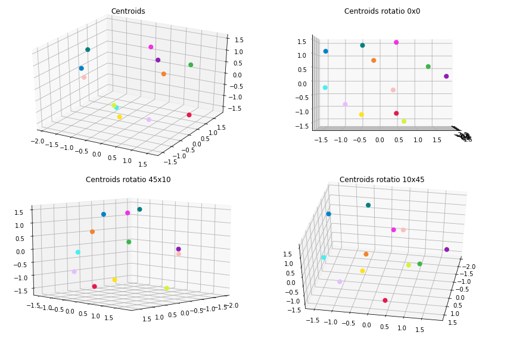
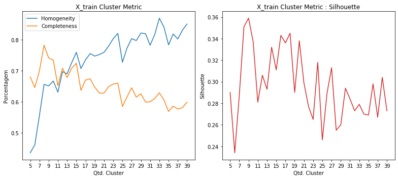
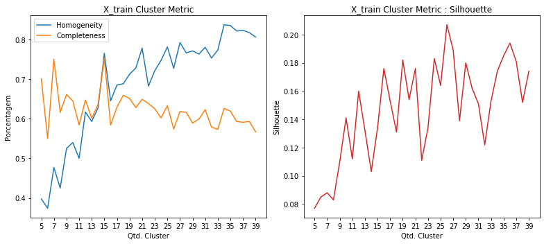

# Projeto Final

Este é o projeto final da disciplina Aprendizado de Máquina (IA006-C), ministrado pelos professores Levy Boccato e Romis, na Unicamp no 2S2019.

## Projeto

A ideia do projeto é permitir a clusterização de conteúdo textual, para que a partir deste seja criado um chatbot.

Os textos passarão pro um processo de clusterização (e aqui serão apresentados duas técnicas para gerar o espaço vetorial de documentos [TF-IDF e Doc2Vec]) usando o algoritmo KMeans e usando duas métricas para cálculo das distâncias dos documentos no espaço vetorial desejado.
 
Posterior a isso, textos que não forem similares (ou proximamente similares aos já "classificados") serão considerados como anomalias e por conseguintes novos clusters poderão ser gerados futuramente.

### Carregamento dos datasets

Os datasets de exemplos são frases já pré-categorizadas usadas em chatbots.

Contém 32 categorias e ao todo 690 documentos ou frases.

<table border="1" class="dataframe">
  <thead>
    <tr style="text-align: right;">
      <th></th>
      <th>perguntas</th>
      <th>cluster</th>
    </tr>
  </thead>
  <tbody>
    <tr>
      <th>198</th>
      <td>como faco para trocar o meu usuario</td>
      <td>ACCOUNT</td>
    </tr>
    <tr>
      <th>204</th>
      <td>eu consigo trocar meu username para outro?</td>
      <td>ACCOUNT</td>
    </tr>
    <tr>
      <th>237</th>
      <td>estou falando com um bot não?</td>
      <td>BOT_FOUND</td>
    </tr>
    <tr>
      <th>226</th>
      <td>quero solicitar a renovação de um certificado digital</td>
      <td>CERTIFICATE</td>
    </tr>
    <tr>
      <th>148</th>
      <td>estou sem acesso ao meu endereco eletronico</td>
      <td>EMAIL</td>
    </tr>
    <tr>
      <th>167</th>
      <td>como saber mais sobre o email da empresa</td>
      <td>EMAIL</td>
    </tr>
    <tr>
      <th>113</th>
      <td>quais outras opções tem para me mostrar?</td>
      <td>NO_OPTION</td>
    </tr>
    <tr>
      <th>119</th>
      <td>nenhuma dessas opções me ajuda</td>
      <td>NO_OPTION</td>
    </tr>
    <tr>
      <th>23</th>
      <td>Não consigo trocar a minha senha</td>
      <td>PASSWORD</td>
    </tr>
    <tr>
      <th>0</th>
      <td>posso consultar informações relativas a outros serviços e projetos?</td>
      <td>SERVICES</td>
    </tr>
  </tbody>
</table>

    Qtde. de documentos por categoria:

<table border="1" class="dataframe">
  <thead>
    <tr style="text-align: right;">
      <th>Categoria</th>
      <th>Qtde</th>
    </tr>
  </thead>
  <tbody>
    <tr>
      <td>ACCOUNT</td>
      <td>29</td>
    </tr>
    <tr>
      <td>BOT_FOUND</td>
      <td>20</td>
    </tr>
    <tr>
      <td>BOT_NAME</td>
      <td>16</td>
    </tr>
    <tr>
      <td>CERTIFICATE</td>
      <td>18</td>
    </tr>
    <tr>
      <td>EMAIL</td>
      <td>40</td>
    </tr>
    <tr>
      <td>NO_OPTION</td>
      <td>18</td>
    </tr>
    <tr>
      <td>PASSWORD</td>
      <td>27</td>
    </tr>
    <tr>
      <td>REMOTE_ACCESS</td>
      <td>20</td>
    </tr>
    <tr>
      <td>SERVICES</td>
      <td>20</td>
    </tr>
    <tr>
      <td>THANK_YOU</td>
      <td>23</td>
    </tr>
    <tr>
      <td>TROUBLESHOOTING</td>
      <td>17</td>
    </tr>
    <tr>
      <td>WIFI</td>
      <td>24</td>
    </tr>
  </tbody>
</table>

    Total docs     : 272
    Total cluster  : 272
    X_train size   : (217,)
    X_test  size   : (55,)

### Dataset tokenization

    Tokenization...
    Qtd documentos treino:  217
    Qtd Intents treino   :  12
    Finished...

    [TaggedDocument(words=['existir', 'algum', 'maneirar', 'alterar', 'nome', 'usuario'], tags=[0]),
     TaggedDocument(words=['nao', 'precisar', 'mais'], tags=[1]),
     TaggedDocument(words=['configurar', 'outlook'], tags=[2]),
     TaggedDocument(words=['senha', 'acessar'], tags=[3]),
     TaggedDocument(words=['certificar', 'digitar'], tags=[4]),
     TaggedDocument(words=['mais', 'email', 'empresar'], tags=[5]),
     TaggedDocument(words=['necessario', 'instalar', 'algum', 'software', 'adicional', 'conectar', 'redar', 'fiar'], tags=[6]),
     TaggedDocument(words=['alterar', 'senha', 'usuario'], tags=[7]),
     TaggedDocument(words=['opcao', 'ajudar'], tags=[8]),
     TaggedDocument(words=['email', 'nao', 'entrar', 'acessar'], tags=[9])]

### **Doc2Vec**

Parâmetros iniciais... quantidade de dimensões dos vetores gerados para cada frase, épocas de treinamento e épocas de posterior inferência para novas frases.

A quantidade de épocas de inferência, sugere-se ser bem superior as de treinamento.

    Dimensions   : 1000
    Epochs       : 200
    Infer Epochs : 15000

    Starting model...
    Building vocab...
    Training...
    Finish...

Validação do modelo gerado pelo Doc2Vec... teste tanto nos dados apresentados para treinamento quanto nos dados de testes e as acurácias alcançadas.

Randomicamente escolhendo 100 amostras de teste.

    - Acurácia treino: 99.0
     - Acurácia teste 1  : 80.0
     - Acurácia teste 2  : 80.0
     - Acurácia teste 3  : 80.0
     - Acurácia teste 4  : 80.0
     - Acurácia teste 5  : 80.0
    - Acurácia média teste: 80.0

#### Clusterização

Utilizou-se o KMeans definindo a quantidade de clusters para o número ideal de categorias existentes no caso 33. A métrica de distância utilizada, não foi a euclidiana, mas sim a de cosseno (métrica comumente usada na classificação de texto em seu espaço vetorial).

    Frases por cluster:

<table border="1" class="dataframe">
  <thead>
    <tr style="text-align: right;">
      <th>title</th>
      <th>cluster</th>
    </tr>
  </thead>
  <tbody>
    <tr>
      <td>quero falar com um atendente, não com um chatbot</td>
      <td>0</td>
    </tr>
    <tr>
      <td>Quero falar com um humano</td>
      <td>0</td>
    </tr>
    <tr>
      <td>Será que um humano pode me atender?</td>
      <td>0</td>
    </tr>
    <tr>
      <td>não estou conseguindo criar um novo nome de usuário</td>
      <td>1</td>
    </tr>
    <tr>
      <td>consigo alterar meu username para um novo?</td>
      <td>1</td>
    </tr>
    <tr>
      <td>tem como trocar o meu username?</td>
      <td>1</td>
    </tr>
    <tr>
      <td>que tipos de serviços você oferece?</td>
      <td>2</td>
    </tr>
    <tr>
      <td>quero consultar outro tipo de informação com você, posso?</td>
      <td>2</td>
    </tr>
    <tr>
      <td>tem outros serviços disponibilizados por você?</td>
      <td>2</td>
    </tr>
    <tr>
      <td>e necessario instalar algum software adicional para conectar na rede sem fio?</td>
      <td>3</td>
    </tr>
    <tr>
      <td>preciso conectar me a internet através da rede sem fio (wifi)</td>
      <td>3</td>
    </tr>
    <tr>
      <td>como me conectar a rede sem fio</td>
      <td>3</td>
    </tr>
    <tr>
      <td>existe alguma maneira de alterar meu nome de usuário?</td>
      <td>4</td>
    </tr>
    <tr>
      <td>tem como eu mudar meu nome de usuário?</td>
      <td>4</td>
    </tr>
    <tr>
      <td>qual senha usar para acessar o sistema</td>
      <td>4</td>
    </tr>
    <tr>
      <td>Como posso criar uma conta para Colaborador Externo?</td>
      <td>5</td>
    </tr>
    <tr>
      <td>é permitido que patrulheiros tenham uma conta?</td>
      <td>5</td>
    </tr>
    <tr>
      <td>quero criar uma conta de usuário para um colaborador externo, como fazer?</td>
      <td>5</td>
    </tr>
    <tr>
      <td>posso ver outras opções de serviços?</td>
      <td>6</td>
    </tr>
    <tr>
      <td>essas opções não tem o que estou procurando</td>
      <td>6</td>
    </tr>
    <tr>
      <td>nenhuma dessas opções me interessa</td>
      <td>6</td>
    </tr>
    <tr>
      <td>Como eu configuro meu email no thunderbird</td>
      <td>7</td>
    </tr>
    <tr>
      <td>estou sem acesso ao meu email</td>
      <td>7</td>
    </tr>
    <tr>
      <td>Meu email não entra, sem acesso</td>
      <td>7</td>
    </tr>
    <tr>
      <td>Revogação de certificado digital</td>
      <td>8</td>
    </tr>
    <tr>
      <td>certificados digitais</td>
      <td>8</td>
    </tr>
    <tr>
      <td>como solicitar um novo certificado digital para um sistema que criei no me departamento?</td>
      <td>8</td>
    </tr>
    <tr>
      <td>onde consigo mais informações sobre a emição / manutenção de certificados digitais emitidos pela empresa?</td>
      <td>9</td>
    </tr>
    <tr>
      <td>minha empresa pode emitir certificados digitais para mim?</td>
      <td>9</td>
    </tr>
    <tr>
      <td>quero mais informações sobre certificados digitais</td>
      <td>9</td>
    </tr>
    <tr>
      <td>como eu acesso a rede interna da minha empresa estando em outro pais?</td>
      <td>10</td>
    </tr>
    <tr>
      <td>como acessar os sistemas da empresa de casa</td>
      <td>10</td>
    </tr>
    <tr>
      <td>queria acessar remotamente a rede interna da empresa estando em outro pais</td>
      <td>10</td>
    </tr>
    <tr>
      <td>nenhuma dessas opções me ajuda</td>
      <td>11</td>
    </tr>
    <tr>
      <td>nao preciso de mais nada, obrigado</td>
      <td>11</td>
    </tr>
    <tr>
      <td>Você não conseguiu me ajudar</td>
      <td>11</td>
    </tr>
  </tbody>
</table>

    --------------------
    Documentos por cluster:

<table border="1" class="dataframe">
  <tbody>
    <tr>
      <td>C0</td>
      <td>27</td>
    </tr>
    <tr>
      <td>C1</td>
      <td>13</td>
    </tr>
    <tr>
      <td>C2</td>
      <td>23</td>
    </tr>
    <tr>
      <td>C3</td>
      <td>19</td>
    </tr>
    <tr>
      <td>C4</td>
      <td>24</td>
    </tr>
    <tr>
      <td>C5</td>
      <td>14</td>
    </tr>
    <tr>
      <td>C6</td>
      <td>13</td>
    </tr>
    <tr>
      <td>C7</td>
      <td>30</td>
    </tr>
    <tr>
      <td>C8</td>
      <td>10</td>
    </tr>
    <tr>
      <td>C9</td>
      <td>5</td>
    </tr>
    <tr>
      <td>C10</td>
      <td>16</td>
    </tr>
    <tr>
      <td>C11</td>
      <td>23</td>
    </tr>
  </tbody>
</table>

#### Visualização

Apresentação dos protótipos gerados pelo KMeans, reduzindo a dimensão usando o algoritmo MDS (Multidimensional Scaling).

#### Clusterização dos dados de Teste

Por fim, realizada a clusterização dos dados de teste e a apresentação das 8 primeiras frases do conjunto de teste juntamente com outras duas frases do cluster ao qual foi identificado como o melhor.

    * Meu email está com problema
      -  Meu email não entra, sem acesso
      -  Como eu configuro meu email no thunderbird
    --------------------
    * existem mais serviços com os quais eu posso consultar?
      -  quero consultar outro tipo de informação com você, posso?
      -  que tipos de serviços você oferece?
    --------------------
    * como eu faco para criar um novo usuario?
      -  é permitido que patrulheiros tenham uma conta?
      -  quero criar uma conta de usuário para um colaborador externo, como fazer?
    --------------------
    * como me conectar ao wifi (rede sem fio) da empresa
      -  e necessario instalar algum software adicional para conectar na rede sem fio?
      -  preciso conectar me a internet através da rede sem fio (wifi)
    --------------------
    * eu consigo alterar meu nome de usuário para outro?
      -  não estou conseguindo criar um novo nome de usuário
      -  tem como trocar o meu username?
    --------------------
    * qual usuario e senha usar para acessar os sistemas?
      -  existe alguma maneira de alterar meu nome de usuário?
      -  tem como eu mudar meu nome de usuário?
    --------------------
    * Não consigo entrar no meu email
      -  estou sem acesso ao meu email
      -  Meu email não entra, sem acesso
    --------------------
    * tem como renovar um certificado digital emitido?
      -  certificados digitais
      -  Revogação de certificado digital
    --------------------

#### Métricas

Abaixo são apresentadas métricas para demonstrar o quanto a clusterização parece funcionar.

    Homogeneidade    :  0.79
    Completude       :  0.804
    Silhouette       :  0.137

Como exemplo de comparação, foi executado o mesmo algoritmo de clusterização (conforme apresentado acima) entretanto variando a quantidade do número de clusters para verificar como as métricas se comportam.

#### Escolha da quantidade de Cluster

Como não sabe-se ao certo quantos clusteres na realidade podem vir a existir, considerou-se que a quantidade máxima de clusters seria algo em torno de 40.

Para calcular exatamente qual a quantidade máxima, utilizou-se do maior valor dados pelas métricas Elbow e Silhouette (cada uma dando seu valor ideal de clusteres).

Abaixo segue o resultado.

    Running Elbow...
    Running Silhouette...
    N. Elbow      Cluster :  18
    N. Silhouette Cluster :  9

    Dados treinamento
    --------------------
    Homogeneity  : 61.0
    Completeness : 70.0
    V-Measure    : 65.0
    Silhouette   : 0.30134716629981995
    
    Dados teste
    --------------------
    Homogeneity  : 69.0
    Completeness : 79.0
    V-Measure    : 74.0
    Silhouette   : 0.11756753921508789

    Frases por cluster:

<table border="1" class="dataframe">
  <thead>
    <tr style="text-align: right;">
      <th>title</th>
      <th>cluster</th>
    </tr>
  </thead>
  <tbody>
    <tr>
      <td>posso fazer a configuracao em meu so sem usar a informacao de certificado digital disponibilizada?</td>
      <td>0</td>
    </tr>
    <tr>
      <td>como faço para criar um novo certificado digital?</td>
      <td>0</td>
    </tr>
    <tr>
      <td>certificado digital das ACs onde encontrar?</td>
      <td>0</td>
    </tr>
    <tr>
      <td>quais serviços eu posso consultar com você?</td>
      <td>1</td>
    </tr>
    <tr>
      <td>tem outros serviços disponibilizados por você?</td>
      <td>1</td>
    </tr>
    <tr>
      <td>posso ver outras opções de serviços?</td>
      <td>1</td>
    </tr>
    <tr>
      <td>inseri o email e senha e não deu certo</td>
      <td>2</td>
    </tr>
    <tr>
      <td>Não consigo recuperar a minha senha</td>
      <td>2</td>
    </tr>
    <tr>
      <td>qual senha usar para acessar o sistema</td>
      <td>2</td>
    </tr>
    <tr>
      <td>um chatbot nao conseguirá resolver meu problema</td>
      <td>3</td>
    </tr>
    <tr>
      <td>te chamo de quê?</td>
      <td>3</td>
    </tr>
    <tr>
      <td>poxa, não queria falar com um chatbot... queria um humano de verdade.</td>
      <td>3</td>
    </tr>
    <tr>
      <td>você ajudou muito</td>
      <td>4</td>
    </tr>
    <tr>
      <td>Você não conseguiu me ajudar</td>
      <td>4</td>
    </tr>
    <tr>
      <td>voce nao conseguiu me ajudar, quero falar com um atendente</td>
      <td>4</td>
    </tr>
    <tr>
      <td>como faco para trocar o meu usuario</td>
      <td>5</td>
    </tr>
    <tr>
      <td>quero criar uma conta de usuário para um colaborador externo, como fazer?</td>
      <td>5</td>
    </tr>
    <tr>
      <td>minha conta de email foi desativada</td>
      <td>5</td>
    </tr>
    <tr>
      <td>como eu acesso a rede interna da minha empresa estando em outro pais?</td>
      <td>6</td>
    </tr>
    <tr>
      <td>como configurar a vpn</td>
      <td>6</td>
    </tr>
    <tr>
      <td>qual o usuario para acessar os sistemas da minha empresa</td>
      <td>6</td>
    </tr>
    <tr>
      <td>preciso mesmo usar o certificado para configurar minha rede sem fio?</td>
      <td>7</td>
    </tr>
    <tr>
      <td>quero mais informacoes sobre senhas e como proceder</td>
      <td>7</td>
    </tr>
    <tr>
      <td>como me conectar a rede sem fio</td>
      <td>7</td>
    </tr>
    <tr>
      <td>voce nao sabe nada sobre vpn?</td>
      <td>8</td>
    </tr>
    <tr>
      <td>preciso de ajudar</td>
      <td>8</td>
    </tr>
    <tr>
      <td>nenhuma dessas opções me interessa</td>
      <td>8</td>
    </tr>
  </tbody>
</table>

    --------------------
    Documentos por cluster:

<table border="1" class="dataframe">
  <tbody>
    <tr>
      <td>C0</td>
      <td>14</td>
    </tr>
    <tr>
      <td>C1</td>
      <td>21</td>
    </tr>
    <tr>
      <td>C2</td>
      <td>39</td>
    </tr>
    <tr>
      <td>C3</td>
      <td>26</td>
    </tr>
    <tr>
      <td>C4</td>
      <td>17</td>
    </tr>
    <tr>
      <td>C5</td>
      <td>35</td>
    </tr>
    <tr>
      <td>C6</td>
      <td>23</td>
    </tr>
    <tr>
      <td>C7</td>
      <td>21</td>
    </tr>
    <tr>
      <td>C8</td>
      <td>21</td>
    </tr>
  </tbody>
</table>

---

### **TF-IDF**

No caso do tf-idf, assim como no doc2vec foi escolhido um máximo de até 500 features (ou dimensões). Entretanto, diferentemente do doc2vec o tf-idf não adiciona dimensões caso a quantidade de termos (palavras) seja inferior a esse máximo, mas ele corta caso for maior.

    Tokenization...
    Qtd documentos treino:  217
    Qtd Intents treino   :  12
    Finished...

    ['existir algum maneirar alterar nome usuario',
     'nao precisar mais',
     'configurar outlook',
     'senha acessar',
     'certificar digitar',
     'mais email empresar',
     'necessario instalar algum software adicional conectar redar fiar',
     'alterar senha usuario',
     'opcao ajudar',
     'email nao entrar acessar']

Validação do modelo gerado pelo TF-IDF... teste tanto nos dados apresentados para treinamento quanto nos dados de testes e as acurácias alcançadas.

Randomicamente escolhendo 100 amostras de teste.

    - Acurácia treino: 87.0
    --------------------
     - Acurácia teste 1  : 78.18
     - Acurácia teste 2  : 78.18
     - Acurácia teste 3  : 78.18
     - Acurácia teste 4  : 78.18
     - Acurácia teste 5  : 78.18
    - Acurácia média teste: 78.18

#### Clusterização

Utilizou-se o KMeans definindo a quantidade de clusters para o número ideal de categorias existentes no caso 33. A métrica de distância utilizada, não foi a euclidiana, mas sim a de cosseno (métrica comumente usada na classificação de texto em seu espaço vetorial).

    Frases por cluster:

<table border="1" class="dataframe">
  <thead>
    <tr style="text-align: right;">
      <th>title</th>
      <th>cluster</th>
    </tr>
  </thead>
  <tbody>
    <tr>
      <td>Como redirecionar meus emails para outro endereço</td>
      <td>0</td>
    </tr>
    <tr>
      <td>vc tem nome?</td>
      <td>0</td>
    </tr>
    <tr>
      <td>o email não esta no spam</td>
      <td>1</td>
    </tr>
    <tr>
      <td>estou tentanto criar meu username, mas não estou conseguindo</td>
      <td>1</td>
    </tr>
    <tr>
      <td>que serviços estão disponíveis?</td>
      <td>2</td>
    </tr>
    <tr>
      <td>acho que nenhuma opção padrão me interessa</td>
      <td>2</td>
    </tr>
    <tr>
      <td>tenho certeza que você é um bot</td>
      <td>3</td>
    </tr>
    <tr>
      <td>quais outros servicos voce oferece?</td>
      <td>3</td>
    </tr>
    <tr>
      <td>Você não resolveu meu problema, quero falar com um humano</td>
      <td>4</td>
    </tr>
    <tr>
      <td>você não parece ser um ser humano</td>
      <td>4</td>
    </tr>
    <tr>
      <td>quero acessar a rede da empresa da minha casa</td>
      <td>5</td>
    </tr>
    <tr>
      <td>como faco para acessar a rede sem fio de fora da empresa?</td>
      <td>5</td>
    </tr>
    <tr>
      <td>posso consultar informações relativas a outros serviços e projetos?</td>
      <td>6</td>
    </tr>
    <tr>
      <td>existem outros programas para acessar meu email?</td>
      <td>6</td>
    </tr>
    <tr>
      <td>quero me conectar a rede sem fio</td>
      <td>7</td>
    </tr>
    <tr>
      <td>como me conectar a rede sem fio</td>
      <td>7</td>
    </tr>
    <tr>
      <td>como faço para criar um novo certificado digital?</td>
      <td>8</td>
    </tr>
    <tr>
      <td>como emitir novos certificados digitais?</td>
      <td>8</td>
    </tr>
    <tr>
      <td>É possível criar um conta para colaborador externo?</td>
      <td>9</td>
    </tr>
    <tr>
      <td>como eu faço para encaminhar meus emails para outro conta?</td>
      <td>9</td>
    </tr>
    <tr>
      <td>como conectar a rede wifi do meu departamento?</td>
      <td>10</td>
    </tr>
    <tr>
      <td>é para colocar minha senha do meu departamento ou outra?</td>
      <td>10</td>
    </tr>
    <tr>
      <td>tem como trocar o meu nome de usuário para outro?</td>
      <td>11</td>
    </tr>
    <tr>
      <td>como trocar minha senha</td>
      <td>11</td>
    </tr>
  </tbody>
</table>

    --------------------
    Documentos por cluster:

<table border="1" class="dataframe">
  <tbody>
    <tr>
      <td>C0</td>
      <td>52</td>
    </tr>
    <tr>
      <td>C1</td>
      <td>21</td>
    </tr>
    <tr>
      <td>C2</td>
      <td>16</td>
    </tr>
    <tr>
      <td>C3</td>
      <td>25</td>
    </tr>
    <tr>
      <td>C4</td>
      <td>24</td>
    </tr>
    <tr>
      <td>C5</td>
      <td>13</td>
    </tr>
    <tr>
      <td>C6</td>
      <td>6</td>
    </tr>
    <tr>
      <td>C7</td>
      <td>14</td>
    </tr>
    <tr>
      <td>C8</td>
      <td>13</td>
    </tr>
    <tr>
      <td>C9</td>
      <td>9</td>
    </tr>
    <tr>
      <td>C10</td>
      <td>6</td>
    </tr>
    <tr>
      <td>C11</td>
      <td>18</td>
    </tr>
  </tbody>
</table>

#### Visualização

Apresentação dos protótipos gerados pelo KMeans, reduzindo a dimensão usando o algoritmo MDS (Multidimensional Scaling).

#### Clusterização dos dados de Teste

Por fim, realizada a clusterização dos dados de teste e a apresentação das 8 primeiras frases do conjunto de teste juntamente com outras duas frases do cluster ao qual foi identificado como o melhor.

    * Meu email está com problema
      -  vc tem nome?
      -  Como redirecionar meus emails para outro endereço
    --------------------
    * existem mais serviços com os quais eu posso consultar?
      -  existem outros programas para acessar meu email?
      -  posso consultar informações relativas a outros serviços e projetos?
    --------------------
    * como eu faco para criar um novo usuario?
      -  como trocar minha senha
      -  tem como trocar o meu nome de usuário para outro?
    --------------------
    * como me conectar ao wifi (rede sem fio) da empresa
      -  quero me conectar a rede sem fio
      -  como me conectar a rede sem fio
    --------------------
    * eu consigo alterar meu nome de usuário para outro?
      -  como trocar minha senha
      -  tem como trocar o meu nome de usuário para outro?
    --------------------
    * qual usuario e senha usar para acessar os sistemas?
      -  como faco para acessar a rede sem fio de fora da empresa?
      -  quero acessar a rede da empresa da minha casa
    --------------------
    * Não consigo entrar no meu email
      -  o email não esta no spam
      -  estou tentanto criar meu username, mas não estou conseguindo
    --------------------
    * tem como renovar um certificado digital emitido?
      -  como emitir novos certificados digitais?
      -  como faço para criar um novo certificado digital?
    --------------------

#### Métricas

Abaixo são apresentadas métricas para demonstrar o quanto a clusterização parece funcionar.

    Homogeneidade:  0.773
    Completude   :  0.742
    Silhouette   :  0.191

#### Escolha da quantidade de Cluster

Como não sabe-se ao certo quantos clusteres na realidade podem vir a existir, considerou-se que a quantidade máxima de clusters seria algo em torno de 40.

Para calcular exatamente qual a quantidade máxima, utilizou-se do maior valor dados pelas métricas Elbow e Silhouette (cada uma dando seu valor ideal de clusteres).

Abaixo segue o resultado.

    Running Elbow...
    Running Silhouette...
    N. Elbow      Cluster :  18
    N. Silhouette Cluster :  26

    Dados treinamento
    --------------------
    Homogeneity  : 65.0
    Completeness : 63.0
    V-Measure    : 64.0
    Silhouette   : 0.15650876153333035
    
    Dados teste
    --------------------
    Homogeneity  : 79.0
    Completeness : 79.0
    V-Measure    : 79.0
    Silhouette   : 0.16472088296509504

    Frases por cluster:

<table border="1" class="dataframe">
  <thead>
    <tr style="text-align: right;">
      <th>title</th>
      <th>cluster</th>
    </tr>
  </thead>
  <tbody>
    <tr>
      <td>como você se chama?</td>
      <td>0</td>
    </tr>
    <tr>
      <td>como é que te chamam?</td>
      <td>0</td>
    </tr>
    <tr>
      <td>muitíssimo obrigado</td>
      <td>1</td>
    </tr>
    <tr>
      <td>poxa, obrigado, me ajudou muito</td>
      <td>1</td>
    </tr>
    <tr>
      <td>você pode me responder sobre quais serviços disponíveis?</td>
      <td>2</td>
    </tr>
    <tr>
      <td>que serviços estão disponíveis?</td>
      <td>2</td>
    </tr>
    <tr>
      <td>quais outros servicos voce oferece?</td>
      <td>3</td>
    </tr>
    <tr>
      <td>não estou conseguindo criar um novo nome de usuário</td>
      <td>3</td>
    </tr>
    <tr>
      <td>Você não conseguiu me ajudar</td>
      <td>4</td>
    </tr>
    <tr>
      <td>obrigado pela ajuda, deu certo</td>
      <td>4</td>
    </tr>
    <tr>
      <td>como faco para trocar o meu usuario</td>
      <td>5</td>
    </tr>
    <tr>
      <td>Não consigo trocar a minha senha</td>
      <td>5</td>
    </tr>
    <tr>
      <td>quais as opções de serviços oferecidos mesmo?</td>
      <td>6</td>
    </tr>
    <tr>
      <td>existem outras opções de serviços prestados?</td>
      <td>6</td>
    </tr>
    <tr>
      <td>tenho duvidas sobre vpn</td>
      <td>7</td>
    </tr>
    <tr>
      <td>configurar outlook</td>
      <td>7</td>
    </tr>
    <tr>
      <td>ok, agora consegui, obrigado</td>
      <td>8</td>
    </tr>
    <tr>
      <td>como me conectar a internet wireless da empresa ou do meu departamento?</td>
      <td>8</td>
    </tr>
    <tr>
      <td>quero criar uma conta de usuário para os meus patrulheiros</td>
      <td>9</td>
    </tr>
    <tr>
      <td>colaboradores externos conseguem ter uma conta de usuário?</td>
      <td>9</td>
    </tr>
    <tr>
      <td>não preciso mais de ajuda, estou satisfeito</td>
      <td>10</td>
    </tr>
    <tr>
      <td>nao preciso mais de ajuda</td>
      <td>10</td>
    </tr>
    <tr>
      <td>nenhuma das opções mais solicitadas me ajuda</td>
      <td>11</td>
    </tr>
    <tr>
      <td>quero mais informacoes sobre senhas e como proceder</td>
      <td>11</td>
    </tr>
    <tr>
      <td>Revogação de certificado digital</td>
      <td>12</td>
    </tr>
    <tr>
      <td>certificado digital das ACs onde encontrar?</td>
      <td>12</td>
    </tr>
    <tr>
      <td>quais outras opcoes voce consegue responder pra mim?</td>
      <td>13</td>
    </tr>
    <tr>
      <td>pra que voce serve?</td>
      <td>13</td>
    </tr>
    <tr>
      <td>voce nao conseguiu me entender preciso de ajuda de verdade</td>
      <td>14</td>
    </tr>
    <tr>
      <td>preciso conectar me a internet através da rede sem fio (wifi)</td>
      <td>14</td>
    </tr>
    <tr>
      <td>como solicitar a emissão de certificados digitais?</td>
      <td>15</td>
    </tr>
    <tr>
      <td>onde consigo mais informações sobre a emição / manutenção de certificados digitais emitidos pela empresa?</td>
      <td>15</td>
    </tr>
    <tr>
      <td>Quero ser atendido por um atendente humano</td>
      <td>16</td>
    </tr>
    <tr>
      <td>quero falar com um atendente, não com um chatbot</td>
      <td>16</td>
    </tr>
    <tr>
      <td>Posso falar com outro atendente?</td>
      <td>17</td>
    </tr>
    <tr>
      <td>como eu faço para encaminhar meus emails para outro conta?</td>
      <td>17</td>
    </tr>
  </tbody>
</table>

    --------------------
    Documentos por cluster:

<table border="1" class="dataframe">
  <tbody>
    <tr>
      <td>C0</td>
      <td>5</td>
    </tr>
    <tr>
      <td>C1</td>
      <td>6</td>
    </tr>
    <tr>
      <td>C2</td>
      <td>3</td>
    </tr>
    <tr>
      <td>C3</td>
      <td>16</td>
    </tr>
    <tr>
      <td>C4</td>
      <td>19</td>
    </tr>
    <tr>
      <td>C5</td>
      <td>15</td>
    </tr>
    <tr>
      <td>C6</td>
      <td>12</td>
    </tr>
    <tr>
      <td>C7</td>
      <td>55</td>
    </tr>
    <tr>
      <td>C8</td>
      <td>7</td>
    </tr>
    <tr>
      <td>C9</td>
      <td>21</td>
    </tr>
    <tr>
      <td>C10</td>
      <td>3</td>
    </tr>
    <tr>
      <td>C11</td>
      <td>2</td>
    </tr>
    <tr>
      <td>C12</td>
      <td>7</td>
    </tr>
    <tr>
      <td>C13</td>
      <td>2</td>
    </tr>
    <tr>
      <td>C14</td>
      <td>8</td>
    </tr>
    <tr>
      <td>C15</td>
      <td>6</td>
    </tr>
    <tr>
      <td>C16</td>
      <td>20</td>
    </tr>
    <tr>
      <td>C17</td>
      <td>10</td>
    </tr>
  </tbody>
</table>

