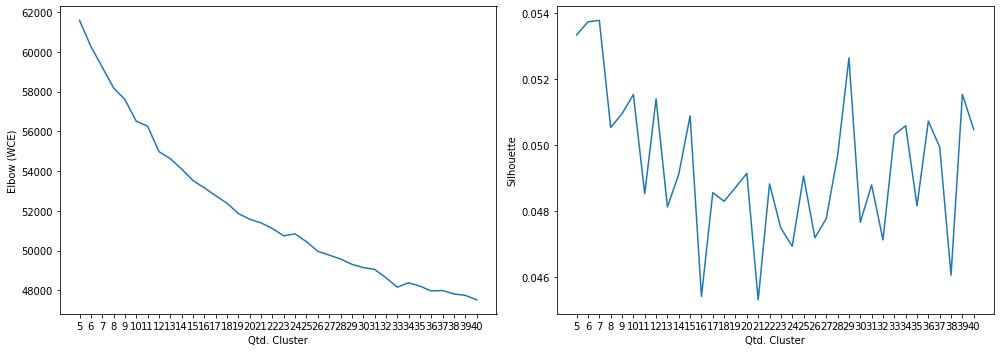

<table border="1" class="dataframe">
  <thead>
    <tr style="text-align: right;">
      <th>title</th>
      <th>description</th>
    </tr>
  </thead>
  <tbody>
    <tr>
      <td>Confira o provável setlist do show Amigos</td>
      <td>Na noite deste sábado, na Arena do Grêmio, Chitãozinho &amp; Xororó, Zezé di Camargo &amp; Luciano e Leonardo apresentam o show Amigos 20 Anos - A História Continua, que faz um passeio nos sucessos dos sertanejos. O primeiro show da turnê foi em julho, em Be</td>
    </tr>
    <tr>
      <td>Crítica | A Grande Mentira (2019): verdadeiros atores</td>
      <td>Dois idosos se conhecem num site para encontros românticos. Ao se encontrarem, revelam que mentiram sobre seus nomes. Isso acaba quebrando o gelo entre o casal e dá início a um relacionamento de intimidade de tal nível que a recém-viúva não hesita em hospedá-</td>
    </tr>
    <tr>
      <td>Fã cria arte da versão sombria da Capitã Marvel</td>
      <td>O artista BossLogic decidiu alterar suas obras com Brie Larson para criar a versão ‘live action’ da Capitã Marvel que está matando os Vingadores nos quadrinhos. E o resultado pode ser visto abaixo:Reworked one of my #captainmarvel pieces, made it a little d</td>
    </tr>
    <tr>
      <td>Google vai matar o Cloud Print e dá um ano aos utilizadores para encontrarem alternativa</td>
      <td>Muitos não perceberam a utilidade de ter um serviço cloud para imprimir remotamente. Alguns guias de utilização mostraram o poder deste serviço gratuito da Google. Contudo, nem todos os serviços conseguem vingar. Assim, num ano em que houve a morte do Inbox,</td>
    </tr>
    <tr>
      <td>Guedes defende zerar INSS para empresários, mas não diz quem pagará a conta</td>
      <td>Foto: Pedro Ladeira/FolhapressO ministro da Economia, Paulo Guedes, afirmou que é possível criar milhões de empregos se os encargos trabalhistas forem zerados, em um evento empresarial nesta sexta (22), no Rio de Janeiro, de acordo o jornal Valor Econôm</td>
    </tr>
    <tr>
      <td>MacMagazine no Ar #347: evento em 2/12, teclado do MacBook Pro de 16″, AirPods Pro vs. Galaxy Buds, Donald Trump e mais!</td>
      <td>E hoje é dia de MacMagazine no Ar! 😀 Esta é a 347ª edição do nosso podcast.PodPesquisa 2019A Associação Brasileira de Podcasters (ABPod) está realizando a PodPesquisa 2019, a fim de desenhar o perfil do ouvinte de podcast brasileiro.Ela ficará no ar at</td>
    </tr>
    <tr>
      <td>PCP marca congresso para 27, 28 e 29 de novembro de 2020</td>
      <td>O secretário-geral do PCP, Jerónimo de Sousa, anunciou hoje, em Lisboa, que vai marcar o XXI congresso do partido para 27, 28 e 29 de novembro de 2020, sustentando que o país mantém os mesmos graves problemas estruturais.Jerónimo de Sousa falava numa conf</td>
    </tr>
    <tr>
      <td>Palcos da semana</td>
      <td>Os próximos dias trazem Gregorio Duvivier num Sísifo hiperligado, o regresso dos Vampire Weekend, os finalistas ao Prémio Sonae Media Art, Akram Khan em danças de guerra e o comunismo em palco com Wen Hui e Jana Svobodová.</td>
    </tr>
    <tr>
      <td>Pressionado, Facebook avalia mudanças em regras para anúncios políticos</td>
      <td>RIO Após as decisões de GoogleeTwitter, de restringir osanúncios políticos, oFacebookestá considerando alterações em suas regras, informaram fontes ao Wall Street Journal. Segundo elas, a companhia está pensando em aumentar o número mínimo de</td>
    </tr>
    <tr>
      <td>Protocolo de segurança, limpeza espiritual e até manual para a família: os preparativos dos rubro-negros para a final da Libertadores</td>
      <td>Às vésperas da decisão mais importante dos últimos 38 anos, todo cuidado é pouco. Esse tem sido o mantra dos rubro-negros, que não economizam em simpatias, correntes de WhatsApp e superstições para ver o Flamengo conquistar o bi da Libertadores. Entre as br</td>
    </tr>
  </tbody>
</table>

    Tokenization...
    Qtd documentos treino:  3104
    Finished...

    [TaggedDocument(words=['morte', 'gugu', 'liberato', 'ultimo', 'sextafeira', 'orlar', 'estar', 'unir', 'apresentador', 'receber', 'diverso', 'homenagem', 'amigo', 'famoso', 'familiar', 'rede', 'social', 'filho', 'pronunciar', 'joao', 'augusto', 'ano', 'geme'], tags=['0d159f9a-42aa-4981-9ee0-635677da589f']),
     TaggedDocument(words=['pegar', 'vara', 'embarcar', 'expressar', 'hogwarts', 'rumar', 'ccxp', 'britanico', 'mark', 'williams', 'mais', 'um', 'nome', 'confirmar', 'festival', 'cultura', 'pop', 'planeta', 'acontecer', 'dezembro', 'paulo', 'expo', 'mundialmente'], tags=['9e787f9f-8846-447a-b2e7-e179dd4f426c']),
     TaggedDocument(words=['hojeas', 'ano', 'exito', 'tetralogia', 'amigar', 'genial', 'elena', 'ferrante', 'regressar', 'romance', 'bastar', 'publicacao', 'o', 'vita', 'bugiarda', 'degli', 'adulti', 'vidar', 'mentiroso', 'adulto', 'previsivel', 'traducao', 'portugues', 'foss'], tags=['7c245bb1-1388-4ecf-91f8-9ff9a3013ebb']),
     TaggedDocument(words=['monger', 'tibetano', 'cultuar', 'seguidor', 'ano', 'morto', 'corpo', 'quase', 'intactohistoria', 'vidanascido', 'monger', 'tibetano', 'dashidorzho', 'itigilov', 'comecar', 'educacao', 'religioso', 'ano', 'estudar', 'um', 'mosteiro'], tags=['b9212e72-88cd-49c7-b0b1-6950b0ae1aba']),
     TaggedDocument(words=['entrar', 'carrar', 'equipar', 'motorfast', 'racing', 'treino', 'livrar', 'abrir', 'penultimo', 'etapa', 'temporada', 'stock', 'light', 'ricardo', 'barbosa', 'saber', 'nao', 'um', 'rookie', 'padrao', 'estrear', 'retar', 'campeonato', 'pilotar'], tags=['cf1e2f09-86ae-46fc-b501-3e3f2d713a99']),
     TaggedDocument(words=['historia', 'resgatar', 'animar', 'comovente', 'publico', 'acompanhar', 'um', 'trabalhar', 'reality', 'show', 'resgatar', 'pet', 'estrear', 'domingar', 'redetv', 'ong', 'focinhar', 'abandonar', 'programar'], tags=['14775e57-1afb-493a-bee7-e9e84b926cbe']),
     TaggedDocument(words=['narrador', 'galvao', 'bueno', 'globo', 'ficar', 'transmissao', 'copar', 'libertador', 'flamengo', 'river', 'plate', 'sabado', 'nao', 'narrador', 'ficar', 'participar', 'cobertura', 'umar', 'libertar', 'rubro'], tags=['564c4053-8b89-4f09-a20b-ed6241dd7323']),
     TaggedDocument(words=['atacante', 'vagner', 'love', 'declarar', 'hoje', 'entrevistar', 'coletiva', 'ct', 'joaquim', 'gravar', 'esquema', 'fabio', 'carille', 'demitir', 'inicio', 'prejudicar', 'futebol', 'camisa', 'corinthians', 'utilizar', 'discursar', 'antigo', 'companheiro', 'posica'], tags=['55877cde-0dca-4652-8521-fafab1a407e2']),
     TaggedDocument(words=['governar', 'socialista', 'umar', 'idear', 'brilhante', 'reforcar', 'sns', 'fixar', 'recemespecialistas', 'idear', 'algum', 'ganhar', 'contorno', 'umar', 'estrategia', 'diferente', 'ano', 'preocupaca'], tags=['eb86377e-0e7f-4117-9e69-a7bdb1656ede']),
     TaggedDocument(words=['disney', 'marvel', 'trabalhar', 'firmar', 'vidar', 'serie', 'integrar', 'universo', 'cinematografico', 'marvel', 'deescolher', 'roteirista', 'mulherhulk', 'estudio', 'divulgar', 'comandar', 'moon', 'knight', 'producao', 'cavaleirar', 'lua.jer'], tags=['953c0c38-11b5-4c0f-a2d6-de68f51fe3f9'])]

    building vocab...
    Adding machado...
    Adding mac_morpho...
    Adding floresta...
    finish...

    18104

    Dimensions   : 750
    Epochs       : 200

    DBOW: Building vocab...
    DBOW: Training...
    DMM: Building vocab...
    DMM: Training...
    Finish...

    (3104, 1500)

    Running Elbow...
    Running Silhouette...
    N. Elbow      Cluster :  19
    N. Silhouette Cluster :  7

    Documentos por cluster:

<table border="1" class="dataframe">
  <thead>
    <tr style="text-align: right;">
      <th>title</th>
      <th>cluster</th>
    </tr>
  </thead>
  <tbody>
    <tr>
      <td>Havan é vencedora do Prêmio Top de Marketing e Vendas ADVB/SC 2019 na categoria Varejo</td>
      <td>0</td>
    </tr>
    <tr>
      <td>Caso de padre pedófilo na República Centro-Africana leva Nações Unidas a suspender apoio à Caritas</td>
      <td>0</td>
    </tr>
    <tr>
      <td>Nobel Economia: Criptomoedas são uma péssima ideia</td>
      <td>0</td>
    </tr>
    <tr>
      <td>Operadoras culpam Anacom por atrasos no 5G</td>
      <td>1</td>
    </tr>
    <tr>
      <td>League of Legends | Justiça inocenta Fla e nega R$ 50 mil à RED por brTT</td>
      <td>1</td>
    </tr>
    <tr>
      <td>Grife Victorias Secret cancela desfile de 2019</td>
      <td>1</td>
    </tr>
    <tr>
      <td>Lolo Fernández, o ídolo cujo rosto foi pintado pela torcida no Monumental</td>
      <td>2</td>
    </tr>
    <tr>
      <td>Cenário para rali de Natal em Wall Street pode estar se formando</td>
      <td>2</td>
    </tr>
    <tr>
      <td>Este ministério não sabe comunicar em saúde pública</td>
      <td>2</td>
    </tr>
    <tr>
      <td>Dicas do Dia: Os Vingadores e Como Ser Solteira São os destaques de Hoje</td>
      <td>3</td>
    </tr>
    <tr>
      <td>Museu do Prado: 5 enigmas de As Meninas, de Velázquez, o mais icônico quadro da instituição de Madri</td>
      <td>3</td>
    </tr>
    <tr>
      <td>Trump: Bolton volta a usar o Twitter e dá a entender que pode fazer revelações</td>
      <td>3</td>
    </tr>
    <tr>
      <td>De onde vêm os nomes do que comemos? Parte 11: Grãos-do-paraíso e bafo-de-dragão</td>
      <td>4</td>
    </tr>
    <tr>
      <td>Tabata Amaral diz que extinção de processo do PDT mostra que ação teve razões políticas</td>
      <td>4</td>
    </tr>
    <tr>
      <td>Bebé deixado no lixo desperta interesse em acolhimento</td>
      <td>4</td>
    </tr>
    <tr>
      <td>Ministério Público pede 14 anos de prisão para mãe que partiu para a Síria</td>
      <td>5</td>
    </tr>
    <tr>
      <td>Esquerda pode perder domínio político no Uruguai</td>
      <td>5</td>
    </tr>
    <tr>
      <td>O dia em que o rabino Henry Sobel desafiou a ditadura</td>
      <td>5</td>
    </tr>
    <tr>
      <td>Victorias Secret | Cancelamento de desfile marca o fim de uma era na moda</td>
      <td>6</td>
    </tr>
    <tr>
      <td>De Star Trek a Rivais com Bonnie e Clyde pelo meio. Morreu o ator Michael J. Pollard</td>
      <td>6</td>
    </tr>
    <tr>
      <td>Indra fornece Exército espanhol com laboratório móvel contra ataque químicos</td>
      <td>6</td>
    </tr>
    <tr>
      <td>PSD de Lisboa não vai apoiar nenhum dos candidatos à liderança</td>
      <td>7</td>
    </tr>
    <tr>
      <td>Quadrinho vintage da Marvel Comics é vendido por US$1,26 milhão em leilão</td>
      <td>7</td>
    </tr>
    <tr>
      <td>Fiocruz promove debate com economista que defende o Estado gastar na própria moeda para garantir políticas sociais e emprego</td>
      <td>7</td>
    </tr>
    <tr>
      <td>Ibovespa supera 108 mil pontos com negociação China-EUA</td>
      <td>8</td>
    </tr>
    <tr>
      <td>Adeptos do Flamengo otimistas dentro e fora do Maracanã para Libertadores</td>
      <td>8</td>
    </tr>
    <tr>
      <td>Streaming | Quais são os desafios da Disney+ para enfrentar a Netflix</td>
      <td>8</td>
    </tr>
    <tr>
      <td>Marcelo convida Ramalho Eanes para almoço no aniversário do 25 de Novembro</td>
      <td>9</td>
    </tr>
    <tr>
      <td>Ticktum diz que provavelmente esquecerá o automobilismo se o sonho da F1 desmoronar</td>
      <td>9</td>
    </tr>
    <tr>
      <td>Mister Jesus é aclamado e adeptos do Flamengo pedem continuidade</td>
      <td>9</td>
    </tr>
    <tr>
      <td>História de Leilah Assumpção se confunde com a própria origem do teatro brasileiro</td>
      <td>10</td>
    </tr>
    <tr>
      <td>António Costa (ainda) não está preocupado com coligação negativa para reduzir preço da luz</td>
      <td>10</td>
    </tr>
    <tr>
      <td>Chile: Piñera anuncia projeto para aumentar funções das Forças Armadas e aumento do efetivo policial</td>
      <td>10</td>
    </tr>
    <tr>
      <td>Frankfurt de Paciência e André Silva com ação contra racismo e a discriminação</td>
      <td>11</td>
    </tr>
    <tr>
      <td>Globo e Sportv vão repudiar o racismo durante programação</td>
      <td>11</td>
    </tr>
    <tr>
      <td>Dois lados do Brexit resignados à fragmentação do Reino Unido</td>
      <td>11</td>
    </tr>
    <tr>
      <td>Horner e Tanabe compartilham a mesma esperança após o sucesso no Brasil</td>
      <td>12</td>
    </tr>
    <tr>
      <td>Cuba é o farol da América Latina: esquerda britânica presta solidariedade em Londres</td>
      <td>12</td>
    </tr>
    <tr>
      <td>Longa Duração: compramos um Onix Plus e passamos pelo recall do incêndio</td>
      <td>12</td>
    </tr>
    <tr>
      <td>Público denuncia assédio sexual na ‘Fazenda’ e pede expulsão de Lucas</td>
      <td>13</td>
    </tr>
    <tr>
      <td>Marcelo pede melhores condições para médicos</td>
      <td>13</td>
    </tr>
    <tr>
      <td>Angers vence Nimes e sobe ao segundo lugar na liga francesa</td>
      <td>13</td>
    </tr>
    <tr>
      <td>Família de Gugu autoriza doação dos órgãos do apresentador</td>
      <td>14</td>
    </tr>
    <tr>
      <td>Flamengo rumo ao topo do mundo...</td>
      <td>14</td>
    </tr>
    <tr>
      <td>Conheça algumas ações solidárias de Natal que ocorrem em Caxias do Sul</td>
      <td>14</td>
    </tr>
    <tr>
      <td>Taycan 4S é o novo esportivo elétrico de entrada da Porsche</td>
      <td>15</td>
    </tr>
    <tr>
      <td>O veterano de guerra que morreu sozinho em casa, mas só foi encontrado ‘3 anos depois’</td>
      <td>15</td>
    </tr>
    <tr>
      <td>Luiza Veiga: TSE cassa diploma de prefeito por contratação de servidores</td>
      <td>15</td>
    </tr>
    <tr>
      <td>Espião chinês deserta e revela segredos de inteligência</td>
      <td>16</td>
    </tr>
    <tr>
      <td>Orçamento 2020. Jerónimo quer prioridade à solução de problemas e não submissão a metas</td>
      <td>16</td>
    </tr>
    <tr>
      <td>Guerrinha: jogo contra o Palmeiras tem cara de encrenca para o Grêmio</td>
      <td>16</td>
    </tr>
    <tr>
      <td>MTV - Programação Semanal de 25 de novembro a 01 de dezembro</td>
      <td>17</td>
    </tr>
    <tr>
      <td>Spelfie | Projeto oferece selfies espaciais por meio de aplicativo gratuito</td>
      <td>17</td>
    </tr>
    <tr>
      <td>Al-Assad acusa EUA de roubarem petróleo da Síria</td>
      <td>17</td>
    </tr>
    <tr>
      <td>Sentido! Membros da boy band BTS terão que prestar serviço militar na Coreia do Sul</td>
      <td>18</td>
    </tr>
    <tr>
      <td>Morte de Gugu e desfiliação de Bolsonaro do PSL marcam a semana</td>
      <td>18</td>
    </tr>
    <tr>
      <td>Consciência Negra | Política, saúde, afetividade, religião</td>
      <td>18</td>
    </tr>
  </tbody>
</table>

    --------------------
    Qtde documentos por cluster:

<table border="1" class="dataframe">
  <tbody>
    <tr>
      <td>C0</td>
      <td>130</td>
    </tr>
    <tr>
      <td>C1</td>
      <td>176</td>
    </tr>
    <tr>
      <td>C2</td>
      <td>190</td>
    </tr>
    <tr>
      <td>C3</td>
      <td>331</td>
    </tr>
    <tr>
      <td>C4</td>
      <td>146</td>
    </tr>
    <tr>
      <td>C5</td>
      <td>146</td>
    </tr>
    <tr>
      <td>C6</td>
      <td>229</td>
    </tr>
    <tr>
      <td>C7</td>
      <td>215</td>
    </tr>
    <tr>
      <td>C8</td>
      <td>97</td>
    </tr>
    <tr>
      <td>C9</td>
      <td>137</td>
    </tr>
    <tr>
      <td>C10</td>
      <td>123</td>
    </tr>
    <tr>
      <td>C11</td>
      <td>156</td>
    </tr>
    <tr>
      <td>C12</td>
      <td>147</td>
    </tr>
    <tr>
      <td>C13</td>
      <td>160</td>
    </tr>
    <tr>
      <td>C14</td>
      <td>122</td>
    </tr>
    <tr>
      <td>C15</td>
      <td>153</td>
    </tr>
    <tr>
      <td>C16</td>
      <td>154</td>
    </tr>
    <tr>
      <td>C17</td>
      <td>155</td>
    </tr>
    <tr>
      <td>C18</td>
      <td>137</td>
    </tr>
  </tbody>
</table>

