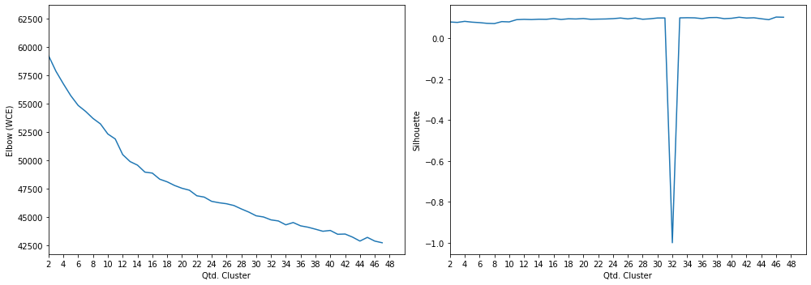

    Tokenization...
    Qtd documentos treino:  3095
    Finished...

    [TaggedDocument(words=['golpe', 'falso', 'criptomoeda', 'movimentar', 'mais', 'r$', 'milhao', 'brasil'], tags=['829a43f5-e577-4e91-8c0d-058dd44fcfa9']),
     TaggedDocument(words=['apos', 'ligar', 'urubu', 'flamadrid', 'rubronegros', 'veem', 'outro', 'lado', 'secador', 'final', 'libertador'], tags=['a7f6dd0c-3f17-4f3a-9ee0-a68b0ee3247f']),
     TaggedDocument(words=['michael', 'bloomberg', 'candidatar', 'presidencia', 'eua'], tags=['477faa14-1636-4939-9a27-75d8a2a0ff32']),
     TaggedDocument(words=['homem', 'atropelar', 'moto', 'agua', 'menino'], tags=['3d6c64bf-cea6-420e-b4b9-0d52cc8efa34']),
     TaggedDocument(words=['glamour', 'garcia', 'falir', 'fim', 'britney', 'emocionar', 'ver', 'noivo', 'querer'], tags=['72131cf7-f508-49a8-bdf7-4fb183d0b198']),
     TaggedDocument(words=['monstro', 'pantano', 'produtor', 'roteirista', 'falir', 'sobrar', 'plano', 'descartar', 'segundo', 'temporada'], tags=['b7642629-1ff0-4694-bf28-a88032988614']),
     TaggedDocument(words=['independent', 'spirit', 'awards', 'vidar', 'invisivel', 'indicar', 'oscar', 'cinema', 'independente'], tags=['1e76540c-4c45-4d9c-9ddc-100de4481361']),
     TaggedDocument(words=['apresentador', 'tv', 'ficar', 'ferir', 'acidentar', 'avenida', 'perimetral', 'bairro', 'mondubim'], tags=['9c83fd7a-c858-4e6e-8fa3-8ff7202a807f']),
     TaggedDocument(words=['entidade', 'denunciar', 'posicao', 'brasil', 'cupula', 'nairobi', 'violar', 'constituicao', 'ferir', 'direito', 'mulher', 'aumentar', 'riscar', 'morte', 'materno'], tags=['96845ae4-6dd7-4248-89ce-e0746d858c7d']),
     TaggedDocument(words=['dar', 'trabalhar', 'cigano'], tags=['14ef3e40-9bc6-443b-8809-2b4c7f9af939'])]

    Dimensions   : 1500
    Epochs       : 200
    Infer Epochs : 15000

    Starting model...
    Building vocab...
    Training...
    Finish...

    Running Elbow...
    Running Silhouette...
    Elbow      Cluster :  17
    Silhouette Cluster :  2

    Frases por cluster:

<table border="1" class="dataframe">
  <thead>
    <tr style="text-align: right;">
      <th>perguntas</th>
      <th>cluster</th>
    </tr>
  </thead>
  <tbody>
    <tr>
      <td>Black Friday já começou, mas só no calendário da Amazon</td>
      <td>0</td>
    </tr>
    <tr>
      <td>Lois Lane e Clark Kent se encontram em nova imagem de "Crise nas Infinitas Terras"</td>
      <td>0</td>
    </tr>
    <tr>
      <td>Brilhante: Michael Mann escreve ao realizador de Joker para elogiar o filme</td>
      <td>1</td>
    </tr>
    <tr>
      <td>5 frases de Miguel de Unamuno</td>
      <td>1</td>
    </tr>
    <tr>
      <td>Black Friday: prepare-se para o futuro com cursos da Udemy a partir de R$ 19,99</td>
      <td>1</td>
    </tr>
    <tr>
      <td>John le Carré, Jimmy Wales e Joanna Lumley dizem que não vão votar Corbyn por causa do antissemitismo</td>
      <td>2</td>
    </tr>
    <tr>
      <td>‘The Batman’: John Turturro é confirmado como icônico personagem</td>
      <td>2</td>
    </tr>
    <tr>
      <td>Uruguai escolhe no domingo entre austeridade e gastos sociais</td>
      <td>2</td>
    </tr>
    <tr>
      <td>Estudantes de Medicina escrevem à Ministra</td>
      <td>3</td>
    </tr>
    <tr>
      <td>Urologista realiza técnica inovadora no tratamento de doença da próstata</td>
      <td>3</td>
    </tr>
    <tr>
      <td>Durante posse como governador, presidente do Tribunal de Justiça elogia Witzel por querer fazer festa do réveillon</td>
      <td>3</td>
    </tr>
    <tr>
      <td>O dia em que Henry Sobel enfrentou a ditadura militar</td>
      <td>3</td>
    </tr>
    <tr>
      <td>Dois do Fla na disputa | Libertadores: melhor jogador ganhará anel com 128 diamantes</td>
      <td>5</td>
    </tr>
    <tr>
      <td>Professor acusado de agredir aluno surdo em escola de Penafiel</td>
      <td>5</td>
    </tr>
    <tr>
      <td>Netanyahu mantém tom desafiador apesar de pedidos por renúncia</td>
      <td>5</td>
    </tr>
    <tr>
      <td>12 segredos que não te contaram sobre consórcios</td>
      <td>5</td>
    </tr>
    <tr>
      <td>Quanta demanda! Apple deve fechar o ano vendendo 60 milhões de fones AirPods</td>
      <td>6</td>
    </tr>
    <tr>
      <td>Trabalhadora com gravidez de alto risco passa a ter isenção de carência no INSS</td>
      <td>7</td>
    </tr>
    <tr>
      <td>Emocionou internet | Ana Maria chora ao contar que cachorra Cristal está cega</td>
      <td>8</td>
    </tr>
    <tr>
      <td>Coelho fala sobre racismo e dificuldades de treinadores negros no Brasil</td>
      <td>9</td>
    </tr>
    <tr>
      <td>José Silvano. "Há mais legitimidade para quem está no poder se ganhar à primeira volta"</td>
      <td>9</td>
    </tr>
    <tr>
      <td>Farage olha além do 'Brexit' e promete "revolução política"</td>
      <td>10</td>
    </tr>
    <tr>
      <td>Gustavo Myasava lidera sexta-feira de ensaios da Stock Light em Goiânia</td>
      <td>10</td>
    </tr>
    <tr>
      <td>Carbon nomeia Ellen Kullman presidente e diretora executiva, Dr. Joseph DeSimone nomeado presidente executivo</td>
      <td>12</td>
    </tr>
    <tr>
      <td>35% do desmatamento da Amazônia é grilagem de terras, aponta Ipam</td>
      <td>13</td>
    </tr>
    <tr>
      <td>Joaquin Phoenix negocia retorno para sequência de ‘Coringa’</td>
      <td>14</td>
    </tr>
    <tr>
      <td>Primeira cirurgia robótica para remover nódulos da tiróide realizada com sucesso</td>
      <td>15</td>
    </tr>
    <tr>
      <td>Não é o pântano, é a planície</td>
      <td>15</td>
    </tr>
    <tr>
      <td>Tecnologia. Realidade aumentada está cada vez menos virtual em Portugal</td>
      <td>15</td>
    </tr>
    <tr>
      <td>Esquerda pode perder domínio político no Uruguai</td>
      <td>16</td>
    </tr>
  </tbody>
</table>

    --------------------
    Documentos por cluster:

<table border="1" class="dataframe">
  <tbody>
    <tr>
      <td>C0</td>
      <td>121</td>
    </tr>
    <tr>
      <td>C1</td>
      <td>169</td>
    </tr>
    <tr>
      <td>C2</td>
      <td>144</td>
    </tr>
    <tr>
      <td>C3</td>
      <td>157</td>
    </tr>
    <tr>
      <td>C4</td>
      <td>129</td>
    </tr>
    <tr>
      <td>C5</td>
      <td>181</td>
    </tr>
    <tr>
      <td>C6</td>
      <td>157</td>
    </tr>
    <tr>
      <td>C7</td>
      <td>170</td>
    </tr>
    <tr>
      <td>C8</td>
      <td>142</td>
    </tr>
    <tr>
      <td>C9</td>
      <td>106</td>
    </tr>
    <tr>
      <td>C10</td>
      <td>138</td>
    </tr>
    <tr>
      <td>C11</td>
      <td>128</td>
    </tr>
    <tr>
      <td>C12</td>
      <td>168</td>
    </tr>
    <tr>
      <td>C13</td>
      <td>119</td>
    </tr>
    <tr>
      <td>C14</td>
      <td>132</td>
    </tr>
    <tr>
      <td>C15</td>
      <td>154</td>
    </tr>
    <tr>
      <td>C16</td>
      <td>105</td>
    </tr>
  </tbody>
</table>

