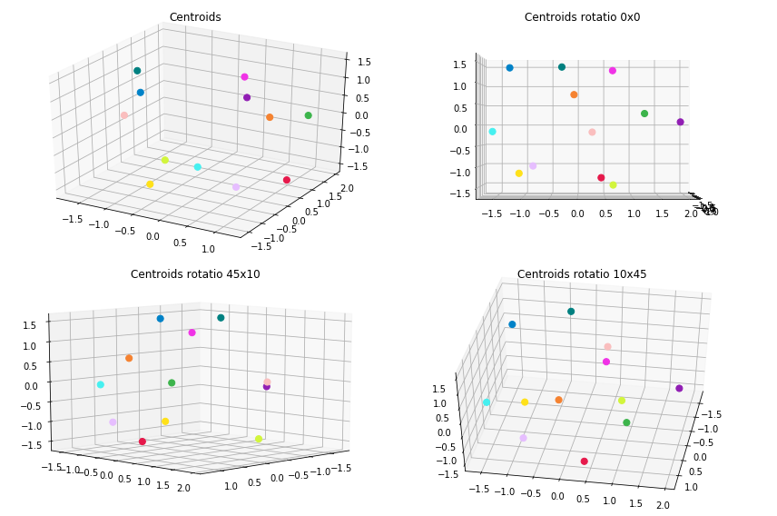
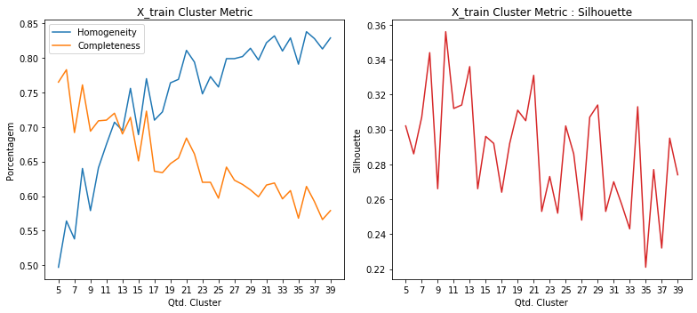
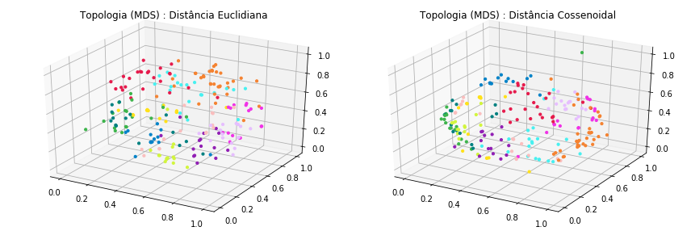
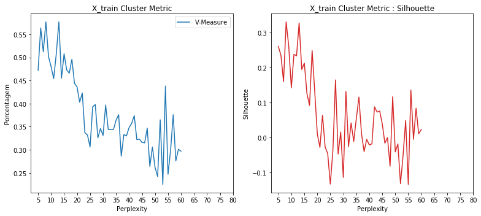
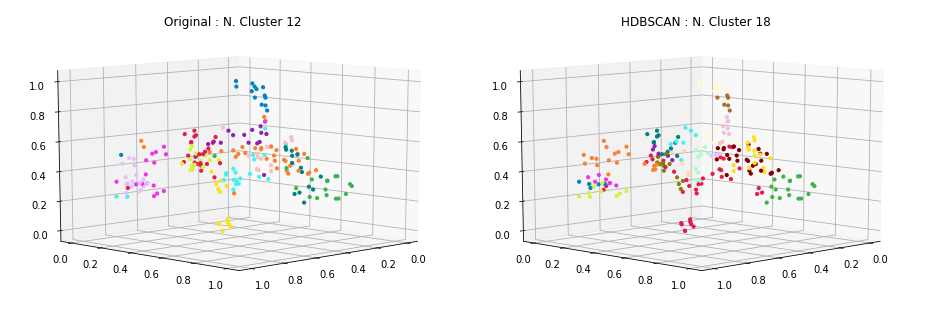
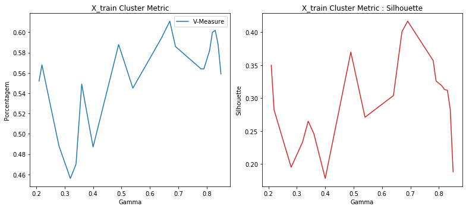
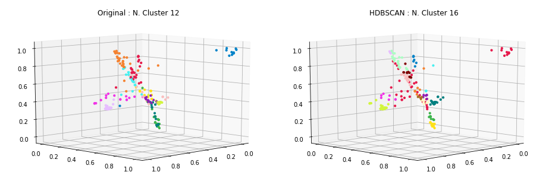
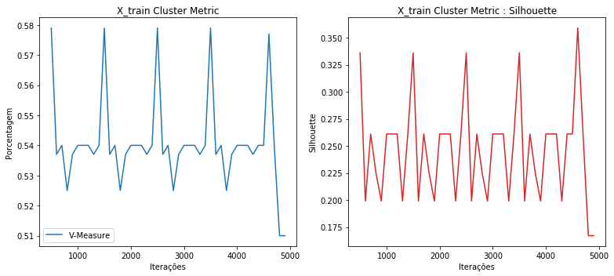
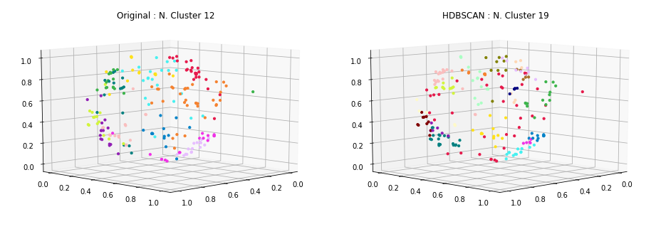

### Carregamento dos datasets

Os datasets de exemplos são frases já pré-categorizadas usadas em chatbots.

Contém 33 categorias e ao todo 696 documentos ou frases.

<table border="1" class="dataframe">
  <thead>
    <tr style="text-align: right;">
      <th></th>
      <th>perguntas</th>
      <th>cluster</th>
    </tr>
  </thead>
  <tbody>
    <tr>
      <th>198</th>
      <td>como faco para trocar o meu usuario</td>
      <td>ACCOUNT</td>
    </tr>
    <tr>
      <th>204</th>
      <td>eu consigo trocar meu username para outro?</td>
      <td>ACCOUNT</td>
    </tr>
    <tr>
      <th>237</th>
      <td>estou falando com um bot não?</td>
      <td>BOT_FOUND</td>
    </tr>
    <tr>
      <th>226</th>
      <td>quero solicitar a renovação de um certificado digital</td>
      <td>CERTIFICATE</td>
    </tr>
    <tr>
      <th>148</th>
      <td>estou sem acesso ao meu endereco eletronico</td>
      <td>EMAIL</td>
    </tr>
    <tr>
      <th>167</th>
      <td>como saber mais sobre o email da empresa</td>
      <td>EMAIL</td>
    </tr>
    <tr>
      <th>113</th>
      <td>quais outras opções tem para me mostrar?</td>
      <td>NO_OPTION</td>
    </tr>
    <tr>
      <th>119</th>
      <td>nenhuma dessas opções me ajuda</td>
      <td>NO_OPTION</td>
    </tr>
    <tr>
      <th>23</th>
      <td>Não consigo trocar a minha senha</td>
      <td>PASSWORD</td>
    </tr>
    <tr>
      <th>0</th>
      <td>posso consultar informações relativas a outros serviços e projetos?</td>
      <td>SERVICES</td>
    </tr>
  </tbody>
</table>

    Qtde. de documentos por categoria:

<table border="1" class="dataframe">
  <thead>
    <tr style="text-align: right;">
      <th></th>
      <th>Categoria</th>
      <th>Qtde</th>
    </tr>
  </thead>
  <tbody>
    <tr>
      <th>0</th>
      <td>ACCOUNT</td>
      <td>29</td>
    </tr>
    <tr>
      <th>1</th>
      <td>BOT_FOUND</td>
      <td>20</td>
    </tr>
    <tr>
      <th>2</th>
      <td>BOT_NAME</td>
      <td>16</td>
    </tr>
    <tr>
      <th>3</th>
      <td>CERTIFICATE</td>
      <td>18</td>
    </tr>
    <tr>
      <th>4</th>
      <td>EMAIL</td>
      <td>40</td>
    </tr>
    <tr>
      <th>5</th>
      <td>NO_OPTION</td>
      <td>18</td>
    </tr>
    <tr>
      <th>6</th>
      <td>PASSWORD</td>
      <td>27</td>
    </tr>
    <tr>
      <th>7</th>
      <td>REMOTE_ACCESS</td>
      <td>20</td>
    </tr>
    <tr>
      <th>8</th>
      <td>SERVICES</td>
      <td>20</td>
    </tr>
    <tr>
      <th>9</th>
      <td>THANK_YOU</td>
      <td>23</td>
    </tr>
    <tr>
      <th>10</th>
      <td>TROUBLESHOOTING</td>
      <td>17</td>
    </tr>
    <tr>
      <th>11</th>
      <td>WIFI</td>
      <td>24</td>
    </tr>
  </tbody>
</table>

    Total docs     : 272
    Total cluster  : 272
    X_train size   : (217,)
    X_test  size   : (55,)

### Dataset tokenization

    Tokenization...
    Qtd documentos treino:  217
    Qtd Intents treino   :  12
    Finished...

    [TaggedDocument(words=['existir', 'algum', 'maneirar', 'alterar', 'nome', 'usuario'], tags=[0]),
     TaggedDocument(words=['nao', 'precisar', 'mais'], tags=[1]),
     TaggedDocument(words=['configurar', 'outlook'], tags=[2]),
     TaggedDocument(words=['senha', 'acessar'], tags=[3]),
     TaggedDocument(words=['certificar', 'digitar'], tags=[4]),
     TaggedDocument(words=['mais', 'email', 'empresar'], tags=[5]),
     TaggedDocument(words=['necessario', 'instalar', 'algum', 'software', 'adicional', 'conectar', 'redar', 'fiar'], tags=[6]),
     TaggedDocument(words=['alterar', 'senha', 'usuario'], tags=[7]),
     TaggedDocument(words=['opcao', 'ajudar'], tags=[8]),
     TaggedDocument(words=['email', 'nao', 'entrar', 'acessar'], tags=[9])]

### **Doc2Vec**

Parâmetros iniciais... quantidade de dimensões dos vetores gerados para cada frase, épocas de treinamento e épocas de posterior inferência para novas frases.

A quantidade de épocas de inferência, sugere-se ser bem superior as de treinamento.

    Dimensions   : 500
    Epochs       : 200
    Infer Epochs : 15000

    Starting model...
    Building vocab...
    Training...
    Finish...

Validação do modelo gerado pelo Doc2Vec... teste tanto nos dados apresentados para treinamento quanto nos dados de testes e as acurácias alcançadas.

    - Acurácia treino: 99.0
     - Acurácia teste 1  : 81.82
     - Acurácia teste 2  : 81.82
     - Acurácia teste 3  : 81.82
     - Acurácia teste 4  : 81.82
     - Acurácia teste 5  : 81.82
    - Acurácia média teste: 81.82

### Clusterização

Utilizou-se o KMeans definindo a quantidade de clusters para o número ideal de categorias existentes no caso 33. A métrica de distância utilizada, não foi a euclidiana, mas sim a de cosseno (métrica comumente usada na classificação de texto em seu espaço vetorial).

    Frases por cluster:

<table border="1" class="dataframe">
  <thead>
    <tr style="text-align: right;">
      <th>title</th>
      <th>cluster</th>
    </tr>
  </thead>
  <tbody>
    <tr>
      <td>vc tem nome?</td>
      <td>0</td>
    </tr>
    <tr>
      <td>estou falando com um chatbot com certeza</td>
      <td>0</td>
    </tr>
    <tr>
      <td>estou falando com um bot não?</td>
      <td>0</td>
    </tr>
    <tr>
      <td>eu consigo trocar meu username para outro?</td>
      <td>1</td>
    </tr>
    <tr>
      <td>não obrigado, isso é tudo</td>
      <td>1</td>
    </tr>
    <tr>
      <td>é possível alterar meu username?</td>
      <td>1</td>
    </tr>
    <tr>
      <td>posso consultar informações relativas a outros serviços e projetos?</td>
      <td>2</td>
    </tr>
    <tr>
      <td>quais serviços eu posso consultar com você?</td>
      <td>2</td>
    </tr>
    <tr>
      <td>quais serviços estão disponíveis?</td>
      <td>2</td>
    </tr>
    <tr>
      <td>como utilizar a rede sem fio (wifi)</td>
      <td>3</td>
    </tr>
    <tr>
      <td>queria configurar rede sem fio</td>
      <td>3</td>
    </tr>
    <tr>
      <td>como acesso a rede sem fio no meu departamento</td>
      <td>3</td>
    </tr>
    <tr>
      <td>como você se chama?</td>
      <td>4</td>
    </tr>
    <tr>
      <td>é para colocar minha senha do meu departamento ou outra?</td>
      <td>4</td>
    </tr>
    <tr>
      <td>existe alguma maneira de alterar meu nome de usuário?</td>
      <td>4</td>
    </tr>
    <tr>
      <td>quero criar uma conta de usuário para um colaborador externo, como fazer?</td>
      <td>5</td>
    </tr>
    <tr>
      <td>colaboradores externos conseguem ter uma conta de usuário?</td>
      <td>5</td>
    </tr>
    <tr>
      <td>Eu preciso criar um email institucional</td>
      <td>5</td>
    </tr>
    <tr>
      <td>quais outras opções você pode me atender?</td>
      <td>6</td>
    </tr>
    <tr>
      <td>quais outras opções tem para me mostrar?</td>
      <td>6</td>
    </tr>
    <tr>
      <td>nenhuma dessas opções me interessa</td>
      <td>6</td>
    </tr>
    <tr>
      <td>ok, agora consegui, obrigado</td>
      <td>7</td>
    </tr>
    <tr>
      <td>Como acesso meu email</td>
      <td>7</td>
    </tr>
    <tr>
      <td>inseri o email e senha e não deu certo</td>
      <td>7</td>
    </tr>
    <tr>
      <td>como solicitar um novo certificado digital para um sistema que criei no me departamento?</td>
      <td>8</td>
    </tr>
    <tr>
      <td>como faço para criar um novo certificado digital?</td>
      <td>8</td>
    </tr>
    <tr>
      <td>Revogação de certificado digital</td>
      <td>8</td>
    </tr>
    <tr>
      <td>quero mais informações sobre certificados digitais</td>
      <td>9</td>
    </tr>
    <tr>
      <td>minha empresa pode emitir certificados digitais para mim?</td>
      <td>9</td>
    </tr>
    <tr>
      <td>quero mais informacoes sobre senhas e como proceder</td>
      <td>9</td>
    </tr>
    <tr>
      <td>configurar outlook</td>
      <td>10</td>
    </tr>
    <tr>
      <td>quero acessar a rede da empresa da minha casa</td>
      <td>10</td>
    </tr>
    <tr>
      <td>quero acessar remotamente a rede interna da minha empresa diretamente de minha casa</td>
      <td>10</td>
    </tr>
    <tr>
      <td>não preciso mais de ajuda, estou satisfeito</td>
      <td>11</td>
    </tr>
    <tr>
      <td>você tem outras opções para ajudar?</td>
      <td>11</td>
    </tr>
    <tr>
      <td>Preciso que um humano me ajude</td>
      <td>11</td>
    </tr>
  </tbody>
</table>

    --------------------
    Documentos por cluster:

<table border="1" class="dataframe">
  <tbody>
    <tr>
      <td>C0</td>
      <td>32</td>
    </tr>
    <tr>
      <td>C1</td>
      <td>14</td>
    </tr>
    <tr>
      <td>C2</td>
      <td>19</td>
    </tr>
    <tr>
      <td>C3</td>
      <td>19</td>
    </tr>
    <tr>
      <td>C4</td>
      <td>24</td>
    </tr>
    <tr>
      <td>C5</td>
      <td>14</td>
    </tr>
    <tr>
      <td>C6</td>
      <td>9</td>
    </tr>
    <tr>
      <td>C7</td>
      <td>31</td>
    </tr>
    <tr>
      <td>C8</td>
      <td>10</td>
    </tr>
    <tr>
      <td>C9</td>
      <td>6</td>
    </tr>
    <tr>
      <td>C10</td>
      <td>16</td>
    </tr>
    <tr>
      <td>C11</td>
      <td>23</td>
    </tr>
  </tbody>
</table>

### Visualização

Apresentação dos protótipos gerados pelo KMeans, reduzindo a dimensão usando o algoritmo MDS (Multidimensional Scaling).

### Clusterização dos dados de Teste

Por fim, realizada a clusterização dos dados de teste e a apresentação das 8 primeiras frases do conjunto de teste juntamente com outras duas frases do cluster ao qual foi identificado como o melhor.

    * Meu email está com problema
      -  inseri o email e senha e não deu certo
      -  Como acesso meu email
    --------------------
    * existem mais serviços com os quais eu posso consultar?
      -  quais serviços estão disponíveis?
      -  posso consultar informações relativas a outros serviços e projetos?
    --------------------
    * como eu faco para criar um novo usuario?
      -  colaboradores externos conseguem ter uma conta de usuário?
      -  quero criar uma conta de usuário para um colaborador externo, como fazer?
    --------------------
    * como me conectar ao wifi (rede sem fio) da empresa
      -  como acesso a rede sem fio no meu departamento
      -  como utilizar a rede sem fio (wifi)
    --------------------
    * eu consigo alterar meu nome de usuário para outro?
      -  não obrigado, isso é tudo
      -  eu consigo trocar meu username para outro?
    --------------------
    * qual usuario e senha usar para acessar os sistemas?
      -  existe alguma maneira de alterar meu nome de usuário?
      -  é para colocar minha senha do meu departamento ou outra?
    --------------------
    * Não consigo entrar no meu email
      -  Como acesso meu email
      -  inseri o email e senha e não deu certo
    --------------------
    * tem como renovar um certificado digital emitido?
      -  Revogação de certificado digital
      -  como faço para criar um novo certificado digital?
    --------------------

### Métricas

Abaixo são apresentadas métricas para demonstrar o quanto a clusterização parece funcionar.

    Homogeneidade    :  0.821
    Completude       :  0.837
    V-Measure        :  0.829
    Silhouette       :  0.158

Como exemplo de comparação, foi executado o mesmo algoritmo de clusterização (conforme apresentado acima) entretanto variando a quantidade do número de clusters para verificar como as métricas se comportam.

### HDBSCAN no espaço dos dados

    Frases por cluster:

<table border="1" class="dataframe">
  <thead>
    <tr style="text-align: right;">
      <th>title</th>
      <th>cluster</th>
    </tr>
  </thead>
  <tbody>
    <tr>
      <td>certificados digitais</td>
      <td>0</td>
    </tr>
    <tr>
      <td>posso fazer a configuracao em meu so sem usar a informacao de certificado digital disponibilizada?</td>
      <td>0</td>
    </tr>
    <tr>
      <td>quero mais informações sobre certificados digitais</td>
      <td>0</td>
    </tr>
    <tr>
      <td>how to configure vpn?</td>
      <td>1</td>
    </tr>
    <tr>
      <td>quero instalar a vpn</td>
      <td>1</td>
    </tr>
    <tr>
      <td>tenho duvidas sobre vpn</td>
      <td>1</td>
    </tr>
    <tr>
      <td>preciso mesmo usar o certificado para configurar minha rede sem fio?</td>
      <td>2</td>
    </tr>
    <tr>
      <td>quero configurar a rede sem fio no meu celular</td>
      <td>2</td>
    </tr>
    <tr>
      <td>como eu configuro a rede sem fio no meu computador?</td>
      <td>2</td>
    </tr>
    <tr>
      <td>como acessar os sistemas da empresa de casa</td>
      <td>3</td>
    </tr>
    <tr>
      <td>como eu acesso a rede interna da minha empresa estando em outro pais?</td>
      <td>3</td>
    </tr>
    <tr>
      <td>como eu faco para acessar a rede da empresa estando eu em outro pais</td>
      <td>3</td>
    </tr>
    <tr>
      <td>quero me conectar a rede sem fio</td>
      <td>4</td>
    </tr>
    <tr>
      <td>preciso conectar me a internet através da rede sem fio (wifi)</td>
      <td>4</td>
    </tr>
    <tr>
      <td>como acesso a rede sem fio no meu departamento</td>
      <td>4</td>
    </tr>
    <tr>
      <td>vc tem nome?</td>
      <td>5</td>
    </tr>
    <tr>
      <td>você tem um nome?</td>
      <td>5</td>
    </tr>
    <tr>
      <td>seu nome qual é mesmo?</td>
      <td>5</td>
    </tr>
    <tr>
      <td>não estou tendo sucesso ao tentar acessar meu email</td>
      <td>6</td>
    </tr>
    <tr>
      <td>meu usuário e senha não estão funcionando</td>
      <td>6</td>
    </tr>
    <tr>
      <td>meu email foi bloqueado</td>
      <td>6</td>
    </tr>
    <tr>
      <td>não estou conseguindo criar um novo nome de usuário</td>
      <td>7</td>
    </tr>
    <tr>
      <td>estou tentanto criar meu username, mas não estou conseguindo</td>
      <td>7</td>
    </tr>
    <tr>
      <td>Username já cadastrado</td>
      <td>7</td>
    </tr>
    <tr>
      <td>tem como trocar o meu username?</td>
      <td>8</td>
    </tr>
    <tr>
      <td>é possível trocar o meu username?</td>
      <td>8</td>
    </tr>
    <tr>
      <td>é possível alterar meu username?</td>
      <td>8</td>
    </tr>
    <tr>
      <td>qual o nome que lhe foi dado?</td>
      <td>9</td>
    </tr>
    <tr>
      <td>Como faço para recuperar meus emails?</td>
      <td>9</td>
    </tr>
    <tr>
      <td>você ajudou muito, obrigadão</td>
      <td>9</td>
    </tr>
    <tr>
      <td>é permitido que patrulheiros tenham uma conta?</td>
      <td>10</td>
    </tr>
    <tr>
      <td>Como posso criar uma conta para Colaborador Externo?</td>
      <td>10</td>
    </tr>
    <tr>
      <td>tem como eu mudar meu nome de usuário?</td>
      <td>10</td>
    </tr>
    <tr>
      <td>estou sem acesso ao meu endereco eletronico</td>
      <td>11</td>
    </tr>
    <tr>
      <td>Como encaminhar meus emails para outro endereço</td>
      <td>11</td>
    </tr>
    <tr>
      <td>como eu faço para encaminhar meus emails para outro conta?</td>
      <td>11</td>
    </tr>
    <tr>
      <td>Não consigo recuperar a minha senha</td>
      <td>12</td>
    </tr>
    <tr>
      <td>como alterar minha senha do usuário?</td>
      <td>12</td>
    </tr>
    <tr>
      <td>Esqueci a minha senha</td>
      <td>12</td>
    </tr>
    <tr>
      <td>Posso falar com um humano?</td>
      <td>13</td>
    </tr>
    <tr>
      <td>Quero falar com um humano</td>
      <td>13</td>
    </tr>
    <tr>
      <td>poxa, não queria falar com um chatbot... queria um humano de verdade.</td>
      <td>13</td>
    </tr>
    <tr>
      <td>nao preciso de mais nada, obrigado</td>
      <td>14</td>
    </tr>
    <tr>
      <td>preciso de ajudar</td>
      <td>14</td>
    </tr>
    <tr>
      <td>Preciso que um humano me ajude</td>
      <td>14</td>
    </tr>
    <tr>
      <td>não tem outras opções para me mostrar?</td>
      <td>15</td>
    </tr>
    <tr>
      <td>essas opções não me ajudam</td>
      <td>15</td>
    </tr>
    <tr>
      <td>essas opções não tem o que estou procurando</td>
      <td>15</td>
    </tr>
    <tr>
      <td>acho que por enquanto e só isso mesmo, obrigado</td>
      <td>16</td>
    </tr>
    <tr>
      <td>posso ver outras opções de serviços?</td>
      <td>16</td>
    </tr>
    <tr>
      <td>acho que nenhuma opção padrão me interessa</td>
      <td>16</td>
    </tr>
    <tr>
      <td>quais serviços eu posso consultar com você?</td>
      <td>17</td>
    </tr>
    <tr>
      <td>você tem outros serviços?</td>
      <td>17</td>
    </tr>
    <tr>
      <td>existem outros serviços que posso consultar com você?</td>
      <td>17</td>
    </tr>
  </tbody>
</table>

    --------------------
    Documentos por cluster:

<table border="1" class="dataframe">
  <tbody>
    <tr>
      <td>C0</td>
      <td>15</td>
    </tr>
    <tr>
      <td>C1</td>
      <td>8</td>
    </tr>
    <tr>
      <td>C2</td>
      <td>5</td>
    </tr>
    <tr>
      <td>C3</td>
      <td>9</td>
    </tr>
    <tr>
      <td>C4</td>
      <td>10</td>
    </tr>
    <tr>
      <td>C5</td>
      <td>7</td>
    </tr>
    <tr>
      <td>C6</td>
      <td>20</td>
    </tr>
    <tr>
      <td>C7</td>
      <td>6</td>
    </tr>
    <tr>
      <td>C8</td>
      <td>5</td>
    </tr>
    <tr>
      <td>C9</td>
      <td>45</td>
    </tr>
    <tr>
      <td>C10</td>
      <td>9</td>
    </tr>
    <tr>
      <td>C11</td>
      <td>7</td>
    </tr>
    <tr>
      <td>C12</td>
      <td>13</td>
    </tr>
    <tr>
      <td>C13</td>
      <td>24</td>
    </tr>
    <tr>
      <td>C14</td>
      <td>7</td>
    </tr>
    <tr>
      <td>C15</td>
      <td>9</td>
    </tr>
    <tr>
      <td>C16</td>
      <td>6</td>
    </tr>
    <tr>
      <td>C17</td>
      <td>12</td>
    </tr>
  </tbody>
</table>

### Topologia dos dados de treinamento usando MDS

## **HDBSCAN**

 - [How HDBSCAN Works](https://nbviewer.jupyter.org/github/scikit-learn-contrib/hdbscan/blob/master/notebooks/How%20HDBSCAN%20Works.ipynb)
 - [hdbscan github implementation](https://github.com/scikit-learn-contrib/hdbscan)
 - [Density-Based Clustering Based on Hierarchical Density Estimates](https://link.springer.com/chapter/10.1007/978-3-642-37456-2_14)

---

## **t-SNE + HDBSCAN**

<table border="1" class="dataframe">
  <thead>
    <tr style="text-align: right;">
      <th></th>
      <th>Perplexity</th>
      <th>Learning Rate</th>
      <th>Angle</th>
      <th>V-Measure</th>
      <th>Silhouette</th>
    </tr>
  </thead>
  <tbody>
    <tr>
      <th>3</th>
      <td>8</td>
      <td>170</td>
      <td>0.83</td>
      <td>0.577</td>
      <td>0.331</td>
    </tr>
    <tr>
      <th>8</th>
      <td>13</td>
      <td>220</td>
      <td>0.89</td>
      <td>0.577</td>
      <td>0.328</td>
    </tr>
    <tr>
      <th>0</th>
      <td>5</td>
      <td>152</td>
      <td>0.89</td>
      <td>0.472</td>
      <td>0.261</td>
    </tr>
    <tr>
      <th>4</th>
      <td>9</td>
      <td>172</td>
      <td>0.83</td>
      <td>0.502</td>
      <td>0.261</td>
    </tr>
    <tr>
      <th>13</th>
      <td>18</td>
      <td>170</td>
      <td>0.83</td>
      <td>0.496</td>
      <td>0.249</td>
    </tr>
    <tr>
      <th>6</th>
      <td>11</td>
      <td>155</td>
      <td>0.77</td>
      <td>0.454</td>
      <td>0.238</td>
    </tr>
    <tr>
      <th>1</th>
      <td>6</td>
      <td>131</td>
      <td>0.67</td>
      <td>0.564</td>
      <td>0.235</td>
    </tr>
    <tr>
      <th>7</th>
      <td>12</td>
      <td>164</td>
      <td>0.89</td>
      <td>0.508</td>
      <td>0.234</td>
    </tr>
    <tr>
      <th>10</th>
      <td>15</td>
      <td>152</td>
      <td>0.89</td>
      <td>0.508</td>
      <td>0.213</td>
    </tr>
    <tr>
      <th>9</th>
      <td>14</td>
      <td>187</td>
      <td>0.70</td>
      <td>0.455</td>
      <td>0.195</td>
    </tr>
    <tr>
      <th>22</th>
      <td>27</td>
      <td>202</td>
      <td>0.89</td>
      <td>0.398</td>
      <td>0.165</td>
    </tr>
    <tr>
      <th>2</th>
      <td>7</td>
      <td>202</td>
      <td>0.89</td>
      <td>0.512</td>
      <td>0.160</td>
    </tr>
    <tr>
      <th>5</th>
      <td>10</td>
      <td>169</td>
      <td>0.78</td>
      <td>0.480</td>
      <td>0.142</td>
    </tr>
    <tr>
      <th>51</th>
      <td>56</td>
      <td>135</td>
      <td>0.90</td>
      <td>0.300</td>
      <td>0.136</td>
    </tr>
    <tr>
      <th>14</th>
      <td>19</td>
      <td>172</td>
      <td>0.83</td>
      <td>0.444</td>
      <td>0.132</td>
    </tr>
    <tr>
      <th>26</th>
      <td>31</td>
      <td>155</td>
      <td>0.77</td>
      <td>0.397</td>
      <td>0.132</td>
    </tr>
    <tr>
      <th>11</th>
      <td>16</td>
      <td>131</td>
      <td>0.67</td>
      <td>0.473</td>
      <td>0.126</td>
    </tr>
    <tr>
      <th>44</th>
      <td>49</td>
      <td>203</td>
      <td>0.87</td>
      <td>0.306</td>
      <td>0.117</td>
    </tr>
    <tr>
      <th>31</th>
      <td>36</td>
      <td>131</td>
      <td>0.67</td>
      <td>0.376</td>
      <td>0.116</td>
    </tr>
    <tr>
      <th>12</th>
      <td>17</td>
      <td>202</td>
      <td>0.89</td>
      <td>0.466</td>
      <td>0.092</td>
    </tr>
    <tr>
      <th>37</th>
      <td>42</td>
      <td>164</td>
      <td>0.89</td>
      <td>0.374</td>
      <td>0.088</td>
    </tr>
    <tr>
      <th>53</th>
      <td>58</td>
      <td>131</td>
      <td>0.82</td>
      <td>0.276</td>
      <td>0.084</td>
    </tr>
    <tr>
      <th>39</th>
      <td>44</td>
      <td>187</td>
      <td>0.70</td>
      <td>0.323</td>
      <td>0.076</td>
    </tr>
    <tr>
      <th>38</th>
      <td>43</td>
      <td>220</td>
      <td>0.89</td>
      <td>0.322</td>
      <td>0.073</td>
    </tr>
    <tr>
      <th>17</th>
      <td>22</td>
      <td>164</td>
      <td>0.89</td>
      <td>0.423</td>
      <td>0.064</td>
    </tr>
  </tbody>
</table>

    Homogeneidade    :  0.605
    Completude       :  0.551
    V-Measure        :  0.577
    Silhouette       :  0.331

    Frases por cluster:

<table border="1" class="dataframe">
  <thead>
    <tr style="text-align: right;">
      <th>title</th>
      <th>cluster</th>
    </tr>
  </thead>
  <tbody>
    <tr>
      <td>você tem nome?</td>
      <td>0</td>
    </tr>
    <tr>
      <td>a senha esta inválida ou incorreta</td>
      <td>0</td>
    </tr>
    <tr>
      <td>como e o seu nome?</td>
      <td>0</td>
    </tr>
    <tr>
      <td>estou falando com um chatbot com certeza</td>
      <td>1</td>
    </tr>
    <tr>
      <td>voce nao resolveu meu problema, quero falar com um atendente humano</td>
      <td>1</td>
    </tr>
    <tr>
      <td>ainda estou com dificuldades, um bot não pode resolver meu problema</td>
      <td>1</td>
    </tr>
    <tr>
      <td>Preciso de outro tipo de ajuda</td>
      <td>2</td>
    </tr>
    <tr>
      <td>voce nao conseguiu me entender preciso de ajuda de verdade</td>
      <td>2</td>
    </tr>
    <tr>
      <td>voce nao conseguiu me ajudar, quero falar com um atendente</td>
      <td>2</td>
    </tr>
    <tr>
      <td>como acessar wifi da empresa?</td>
      <td>3</td>
    </tr>
    <tr>
      <td>qual o usuario para acessar os sistemas da minha empresa</td>
      <td>3</td>
    </tr>
    <tr>
      <td>como acessar os sistemas da empresa de casa</td>
      <td>3</td>
    </tr>
    <tr>
      <td>configurar outlook</td>
      <td>4</td>
    </tr>
    <tr>
      <td>configurar vpn (acesso remoto) em aparelhos da nokia</td>
      <td>4</td>
    </tr>
    <tr>
      <td>quais serviços eu posso consultar com você?</td>
      <td>4</td>
    </tr>
    <tr>
      <td>que serviços estão disponíveis?</td>
      <td>5</td>
    </tr>
    <tr>
      <td>você pode me responder sobre quais serviços disponíveis?</td>
      <td>5</td>
    </tr>
    <tr>
      <td>quais outras informações sobre serviços prestados você oferece?</td>
      <td>5</td>
    </tr>
    <tr>
      <td>nenhuma dessas opções me interessa</td>
      <td>6</td>
    </tr>
    <tr>
      <td>acho que nenhuma opção padrão me interessa</td>
      <td>6</td>
    </tr>
    <tr>
      <td>quais outros servicos voce oferece?</td>
      <td>6</td>
    </tr>
    <tr>
      <td>preciso conectar me a internet através da rede sem fio (wifi)</td>
      <td>7</td>
    </tr>
    <tr>
      <td>como acesso a rede sem fio no meu departamento</td>
      <td>7</td>
    </tr>
    <tr>
      <td>como faco para acessar a rede sem fio de fora da empresa?</td>
      <td>7</td>
    </tr>
    <tr>
      <td>como eu faco para acessar a rede da empresa estando eu em outro pais</td>
      <td>8</td>
    </tr>
    <tr>
      <td>queria conectar a rede sem fio da empresa, como proceder?</td>
      <td>8</td>
    </tr>
    <tr>
      <td>queria saber qual usuario e senha usar para me conectar no wifi</td>
      <td>8</td>
    </tr>
    <tr>
      <td>essas opções não me ajudam</td>
      <td>9</td>
    </tr>
    <tr>
      <td>essas opções não tem o que estou procurando</td>
      <td>9</td>
    </tr>
    <tr>
      <td>você tem outras opções para ajudar?</td>
      <td>9</td>
    </tr>
    <tr>
      <td>consigo alterar meu username para um novo?</td>
      <td>10</td>
    </tr>
    <tr>
      <td>estou tentanto criar meu username, mas não estou conseguindo</td>
      <td>10</td>
    </tr>
    <tr>
      <td>Usuário / Matrícula já cadastrado com o username</td>
      <td>10</td>
    </tr>
    <tr>
      <td>obrigado pela ajuda, deu certo</td>
      <td>11</td>
    </tr>
    <tr>
      <td>quero mais informacoes sobre senhas e como proceder</td>
      <td>11</td>
    </tr>
    <tr>
      <td>inseri o email e senha e não deu certo</td>
      <td>11</td>
    </tr>
    <tr>
      <td>quero mais informações sobre certificados digitais</td>
      <td>12</td>
    </tr>
    <tr>
      <td>minha empresa pode emitir certificados digitais para mim?</td>
      <td>12</td>
    </tr>
    <tr>
      <td>certificados digitais</td>
      <td>12</td>
    </tr>
    <tr>
      <td>como solicitar um novo certificado digital para um sistema que criei no me departamento?</td>
      <td>13</td>
    </tr>
    <tr>
      <td>nenhuma das opções mais solicitadas me ajuda</td>
      <td>13</td>
    </tr>
    <tr>
      <td>como faço para criar um novo certificado digital?</td>
      <td>13</td>
    </tr>
    <tr>
      <td>existem outros programas para acessar meu email?</td>
      <td>14</td>
    </tr>
    <tr>
      <td>posso acessar meu endereço eletrônico via thunderbird ou outlook?</td>
      <td>14</td>
    </tr>
    <tr>
      <td>consigo recuperar emails perdidos?</td>
      <td>14</td>
    </tr>
    <tr>
      <td>como eu altero, ou troco, minha senha</td>
      <td>15</td>
    </tr>
    <tr>
      <td>estou com problemas de autenticacao</td>
      <td>15</td>
    </tr>
    <tr>
      <td>consigo criar um endereço eletrônico de email institucional?</td>
      <td>15</td>
    </tr>
    <tr>
      <td>como você se chama?</td>
      <td>16</td>
    </tr>
    <tr>
      <td>meu usuario esta cancelado</td>
      <td>16</td>
    </tr>
    <tr>
      <td>Como posso criar uma conta para Colaborador Externo?</td>
      <td>16</td>
    </tr>
    <tr>
      <td>como eu faço para encaminhar meus emails para outro conta?</td>
      <td>17</td>
    </tr>
    <tr>
      <td>minha conta de email foi desativada</td>
      <td>17</td>
    </tr>
    <tr>
      <td>como faco para trocar o meu usuario</td>
      <td>17</td>
    </tr>
  </tbody>
</table>

    --------------------
    Documentos por cluster:

<table border="1" class="dataframe">
  <tbody>
    <tr>
      <td>C0</td>
      <td>39</td>
    </tr>
    <tr>
      <td>C1</td>
      <td>18</td>
    </tr>
    <tr>
      <td>C2</td>
      <td>15</td>
    </tr>
    <tr>
      <td>C3</td>
      <td>5</td>
    </tr>
    <tr>
      <td>C4</td>
      <td>19</td>
    </tr>
    <tr>
      <td>C5</td>
      <td>5</td>
    </tr>
    <tr>
      <td>C6</td>
      <td>7</td>
    </tr>
    <tr>
      <td>C7</td>
      <td>7</td>
    </tr>
    <tr>
      <td>C8</td>
      <td>10</td>
    </tr>
    <tr>
      <td>C9</td>
      <td>6</td>
    </tr>
    <tr>
      <td>C10</td>
      <td>12</td>
    </tr>
    <tr>
      <td>C11</td>
      <td>6</td>
    </tr>
    <tr>
      <td>C12</td>
      <td>6</td>
    </tr>
    <tr>
      <td>C13</td>
      <td>10</td>
    </tr>
    <tr>
      <td>C14</td>
      <td>26</td>
    </tr>
    <tr>
      <td>C15</td>
      <td>9</td>
    </tr>
    <tr>
      <td>C16</td>
      <td>12</td>
    </tr>
    <tr>
      <td>C17</td>
      <td>5</td>
    </tr>
  </tbody>
</table>

---

## **Spectral Embedding + HDBSCAN**

<table border="1" class="dataframe">
  <thead>
    <tr style="text-align: right;">
      <th></th>
      <th>Gamma</th>
      <th>V-Measure</th>
      <th>Silhouette</th>
    </tr>
  </thead>
  <tbody>
    <tr>
      <th>8</th>
      <td>0.69</td>
      <td>0.586</td>
      <td>0.417</td>
    </tr>
    <tr>
      <th>1</th>
      <td>0.69</td>
      <td>0.586</td>
      <td>0.417</td>
    </tr>
    <tr>
      <th>17</th>
      <td>0.67</td>
      <td>0.611</td>
      <td>0.401</td>
    </tr>
    <tr>
      <th>14</th>
      <td>0.49</td>
      <td>0.588</td>
      <td>0.370</td>
    </tr>
    <tr>
      <th>10</th>
      <td>0.78</td>
      <td>0.564</td>
      <td>0.357</td>
    </tr>
    <tr>
      <th>15</th>
      <td>0.21</td>
      <td>0.552</td>
      <td>0.350</td>
    </tr>
    <tr>
      <th>19</th>
      <td>0.79</td>
      <td>0.564</td>
      <td>0.326</td>
    </tr>
    <tr>
      <th>7</th>
      <td>0.81</td>
      <td>0.582</td>
      <td>0.319</td>
    </tr>
    <tr>
      <th>12</th>
      <td>0.82</td>
      <td>0.600</td>
      <td>0.313</td>
    </tr>
    <tr>
      <th>6</th>
      <td>0.83</td>
      <td>0.602</td>
      <td>0.312</td>
    </tr>
    <tr>
      <th>0</th>
      <td>0.64</td>
      <td>0.594</td>
      <td>0.304</td>
    </tr>
    <tr>
      <th>16</th>
      <td>0.84</td>
      <td>0.588</td>
      <td>0.283</td>
    </tr>
    <tr>
      <th>4</th>
      <td>0.22</td>
      <td>0.568</td>
      <td>0.282</td>
    </tr>
    <tr>
      <th>3</th>
      <td>0.54</td>
      <td>0.545</td>
      <td>0.271</td>
    </tr>
    <tr>
      <th>5</th>
      <td>0.34</td>
      <td>0.470</td>
      <td>0.265</td>
    </tr>
    <tr>
      <th>13</th>
      <td>0.36</td>
      <td>0.549</td>
      <td>0.246</td>
    </tr>
    <tr>
      <th>18</th>
      <td>0.32</td>
      <td>0.456</td>
      <td>0.233</td>
    </tr>
    <tr>
      <th>11</th>
      <td>0.28</td>
      <td>0.488</td>
      <td>0.195</td>
    </tr>
    <tr>
      <th>9</th>
      <td>0.85</td>
      <td>0.559</td>
      <td>0.188</td>
    </tr>
    <tr>
      <th>2</th>
      <td>0.40</td>
      <td>0.487</td>
      <td>0.178</td>
    </tr>
  </tbody>
</table>

    Homogeneidade    :  0.598
    Completude       :  0.575
    V-Measure        :  0.586
    Silhouette       :  0.417

---

## **MDS + HDBSCAN**

<table border="1" class="dataframe">
  <thead>
    <tr style="text-align: right;">
      <th></th>
      <th>Iterações</th>
      <th>N_Init</th>
      <th>V-Measure</th>
      <th>Silhouette</th>
    </tr>
  </thead>
  <tbody>
    <tr>
      <th>41</th>
      <td>4600</td>
      <td>16</td>
      <td>0.577</td>
      <td>0.359</td>
    </tr>
    <tr>
      <th>0</th>
      <td>500</td>
      <td>15</td>
      <td>0.579</td>
      <td>0.336</td>
    </tr>
    <tr>
      <th>10</th>
      <td>1500</td>
      <td>15</td>
      <td>0.579</td>
      <td>0.336</td>
    </tr>
    <tr>
      <th>30</th>
      <td>3500</td>
      <td>15</td>
      <td>0.579</td>
      <td>0.336</td>
    </tr>
    <tr>
      <th>20</th>
      <td>2500</td>
      <td>15</td>
      <td>0.579</td>
      <td>0.336</td>
    </tr>
    <tr>
      <th>39</th>
      <td>4400</td>
      <td>31</td>
      <td>0.540</td>
      <td>0.261</td>
    </tr>
    <tr>
      <th>37</th>
      <td>4200</td>
      <td>44</td>
      <td>0.540</td>
      <td>0.261</td>
    </tr>
    <tr>
      <th>36</th>
      <td>4100</td>
      <td>43</td>
      <td>0.540</td>
      <td>0.261</td>
    </tr>
    <tr>
      <th>19</th>
      <td>2400</td>
      <td>31</td>
      <td>0.540</td>
      <td>0.261</td>
    </tr>
    <tr>
      <th>32</th>
      <td>3700</td>
      <td>41</td>
      <td>0.540</td>
      <td>0.261</td>
    </tr>
    <tr>
      <th>40</th>
      <td>4500</td>
      <td>39</td>
      <td>0.540</td>
      <td>0.261</td>
    </tr>
    <tr>
      <th>42</th>
      <td>4700</td>
      <td>32</td>
      <td>0.540</td>
      <td>0.261</td>
    </tr>
    <tr>
      <th>29</th>
      <td>3400</td>
      <td>31</td>
      <td>0.540</td>
      <td>0.261</td>
    </tr>
    <tr>
      <th>27</th>
      <td>3200</td>
      <td>44</td>
      <td>0.540</td>
      <td>0.261</td>
    </tr>
    <tr>
      <th>26</th>
      <td>3100</td>
      <td>43</td>
      <td>0.540</td>
      <td>0.261</td>
    </tr>
    <tr>
      <th>25</th>
      <td>3000</td>
      <td>45</td>
      <td>0.540</td>
      <td>0.261</td>
    </tr>
    <tr>
      <th>35</th>
      <td>4000</td>
      <td>45</td>
      <td>0.540</td>
      <td>0.261</td>
    </tr>
    <tr>
      <th>22</th>
      <td>2700</td>
      <td>41</td>
      <td>0.540</td>
      <td>0.261</td>
    </tr>
    <tr>
      <th>5</th>
      <td>1000</td>
      <td>45</td>
      <td>0.540</td>
      <td>0.261</td>
    </tr>
    <tr>
      <th>15</th>
      <td>2000</td>
      <td>45</td>
      <td>0.540</td>
      <td>0.261</td>
    </tr>
    <tr>
      <th>9</th>
      <td>1400</td>
      <td>31</td>
      <td>0.540</td>
      <td>0.261</td>
    </tr>
    <tr>
      <th>17</th>
      <td>2200</td>
      <td>44</td>
      <td>0.540</td>
      <td>0.261</td>
    </tr>
    <tr>
      <th>6</th>
      <td>1100</td>
      <td>43</td>
      <td>0.540</td>
      <td>0.261</td>
    </tr>
    <tr>
      <th>12</th>
      <td>1700</td>
      <td>41</td>
      <td>0.540</td>
      <td>0.261</td>
    </tr>
    <tr>
      <th>7</th>
      <td>1200</td>
      <td>44</td>
      <td>0.540</td>
      <td>0.261</td>
    </tr>
  </tbody>
</table>

    Homogeneidade    :  0.617
    Completude       :  0.543
    V-Measure        :  0.577
    Silhouette       :  0.359

