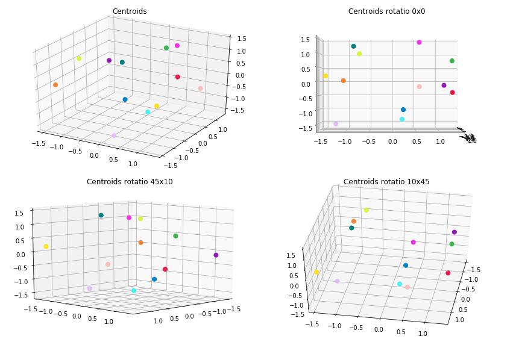
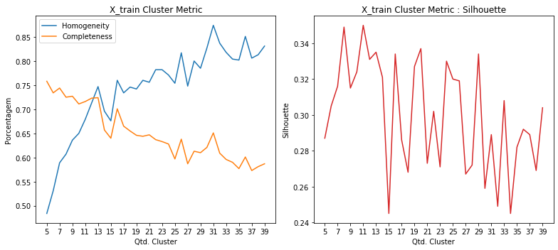
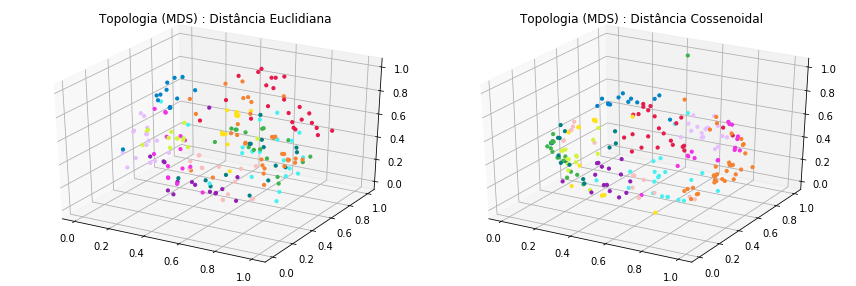
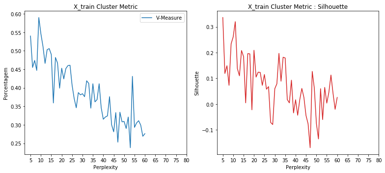
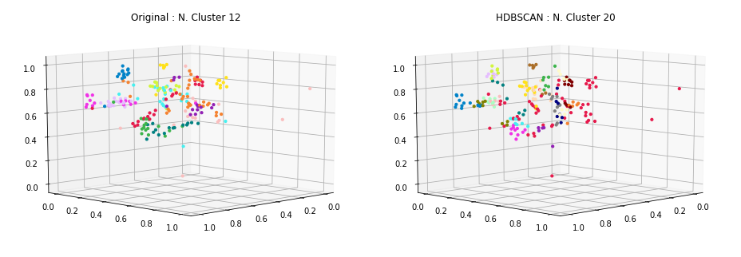
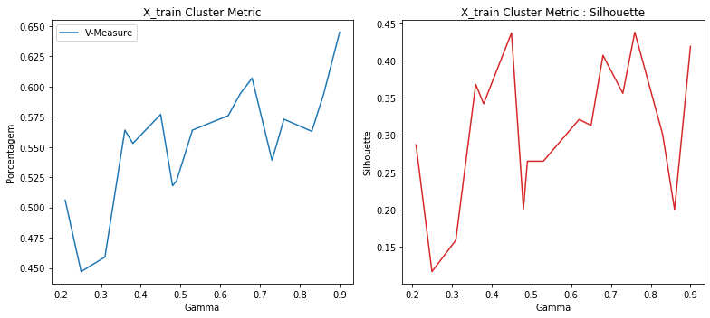
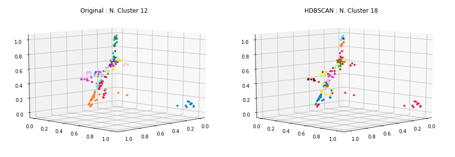
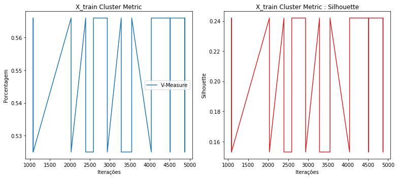
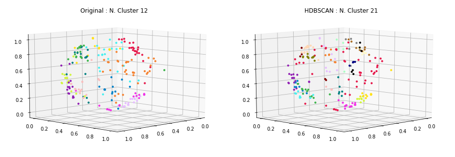

### Carregamento dos datasets

Os datasets de exemplos são frases já pré-categorizadas usadas em chatbots.

Contém 33 categorias e ao todo 696 documentos ou frases.

<table border="1" class="dataframe">
  <thead>
    <tr style="text-align: right;">
      <th></th>
      <th>perguntas</th>
      <th>cluster</th>
    </tr>
  </thead>
  <tbody>
    <tr>
      <th>198</th>
      <td>como faco para trocar o meu usuario</td>
      <td>ACCOUNT</td>
    </tr>
    <tr>
      <th>204</th>
      <td>eu consigo trocar meu username para outro?</td>
      <td>ACCOUNT</td>
    </tr>
    <tr>
      <th>237</th>
      <td>estou falando com um bot não?</td>
      <td>BOT_FOUND</td>
    </tr>
    <tr>
      <th>226</th>
      <td>quero solicitar a renovação de um certificado digital</td>
      <td>CERTIFICATE</td>
    </tr>
    <tr>
      <th>148</th>
      <td>estou sem acesso ao meu endereco eletronico</td>
      <td>EMAIL</td>
    </tr>
    <tr>
      <th>167</th>
      <td>como saber mais sobre o email da empresa</td>
      <td>EMAIL</td>
    </tr>
    <tr>
      <th>113</th>
      <td>quais outras opções tem para me mostrar?</td>
      <td>NO_OPTION</td>
    </tr>
    <tr>
      <th>119</th>
      <td>nenhuma dessas opções me ajuda</td>
      <td>NO_OPTION</td>
    </tr>
    <tr>
      <th>23</th>
      <td>Não consigo trocar a minha senha</td>
      <td>PASSWORD</td>
    </tr>
    <tr>
      <th>0</th>
      <td>posso consultar informações relativas a outros serviços e projetos?</td>
      <td>SERVICES</td>
    </tr>
  </tbody>
</table>

    Qtde. de documentos por categoria:

<table border="1" class="dataframe">
  <thead>
    <tr style="text-align: right;">
      <th></th>
      <th>Categoria</th>
      <th>Qtde</th>
    </tr>
  </thead>
  <tbody>
    <tr>
      <th>0</th>
      <td>ACCOUNT</td>
      <td>29</td>
    </tr>
    <tr>
      <th>1</th>
      <td>BOT_FOUND</td>
      <td>20</td>
    </tr>
    <tr>
      <th>2</th>
      <td>BOT_NAME</td>
      <td>16</td>
    </tr>
    <tr>
      <th>3</th>
      <td>CERTIFICATE</td>
      <td>18</td>
    </tr>
    <tr>
      <th>4</th>
      <td>EMAIL</td>
      <td>40</td>
    </tr>
    <tr>
      <th>5</th>
      <td>NO_OPTION</td>
      <td>18</td>
    </tr>
    <tr>
      <th>6</th>
      <td>PASSWORD</td>
      <td>27</td>
    </tr>
    <tr>
      <th>7</th>
      <td>REMOTE_ACCESS</td>
      <td>20</td>
    </tr>
    <tr>
      <th>8</th>
      <td>SERVICES</td>
      <td>20</td>
    </tr>
    <tr>
      <th>9</th>
      <td>THANK_YOU</td>
      <td>23</td>
    </tr>
    <tr>
      <th>10</th>
      <td>TROUBLESHOOTING</td>
      <td>17</td>
    </tr>
    <tr>
      <th>11</th>
      <td>WIFI</td>
      <td>24</td>
    </tr>
  </tbody>
</table>

    Total docs     : 272
    Total cluster  : 272
    X_train size   : (217,)
    X_test  size   : (55,)

### Dataset tokenization

    Tokenization...
    Qtd documentos treino:  217
    Qtd Intents treino   :  12
    Finished...

    [TaggedDocument(words=['existir', 'algum', 'maneirar', 'alterar', 'nome', 'usuario'], tags=[0]),
     TaggedDocument(words=['nao', 'precisar', 'mais'], tags=[1]),
     TaggedDocument(words=['configurar', 'outlook'], tags=[2]),
     TaggedDocument(words=['senha', 'acessar'], tags=[3]),
     TaggedDocument(words=['certificar', 'digitar'], tags=[4]),
     TaggedDocument(words=['mais', 'email', 'empresar'], tags=[5]),
     TaggedDocument(words=['necessario', 'instalar', 'algum', 'software', 'adicional', 'conectar', 'redar', 'fiar'], tags=[6]),
     TaggedDocument(words=['alterar', 'senha', 'usuario'], tags=[7]),
     TaggedDocument(words=['opcao', 'ajudar'], tags=[8]),
     TaggedDocument(words=['email', 'nao', 'entrar', 'acessar'], tags=[9])]

### **Doc2Vec**

Parâmetros iniciais... quantidade de dimensões dos vetores gerados para cada frase, épocas de treinamento e épocas de posterior inferência para novas frases.

A quantidade de épocas de inferência, sugere-se ser bem superior as de treinamento.

    Dimensions   : 1000
    Epochs       : 200
    Infer Epochs : 15000

    Starting model...
    Building vocab...
    Training...
    Finish...

Validação do modelo gerado pelo Doc2Vec... teste tanto nos dados apresentados para treinamento quanto nos dados de testes e as acurácias alcançadas.

### Acurácia distância cossenoidal

    - Acurácia treino: 99.0
     - Acurácia teste 1  : 81.82
     - Acurácia teste 2  : 80.0
     - Acurácia teste 3  : 80.0
     - Acurácia teste 4  : 80.0
     - Acurácia teste 5  : 80.0
    - Acurácia média teste: 80.36

### Acurácia distância euclidiana

    - Acurácia treino: 97.0
     - Acurácia teste 1  : 74.55
     - Acurácia teste 2  : 74.55
     - Acurácia teste 3  : 72.73
     - Acurácia teste 4  : 74.55
     - Acurácia teste 5  : 74.55
    - Acurácia média teste: 74.18

### Clusterização

Utilizou-se o KMeans definindo a quantidade de clusters para o número ideal de categorias existentes no caso 33. A métrica de distância utilizada, não foi a euclidiana, mas sim a de cosseno (métrica comumente usada na classificação de texto em seu espaço vetorial).

    Frases por cluster:

<table border="1" class="dataframe">
  <thead>
    <tr style="text-align: right;">
      <th>title</th>
      <th>cluster</th>
    </tr>
  </thead>
  <tbody>
    <tr>
      <td>poxa, obrigado, me ajudou muito</td>
      <td>0</td>
    </tr>
    <tr>
      <td>Preciso de outro tipo de ajuda</td>
      <td>0</td>
    </tr>
    <tr>
      <td>muitíssimo obrigado</td>
      <td>0</td>
    </tr>
    <tr>
      <td>não preciso mais de ajuda, estou satisfeito</td>
      <td>1</td>
    </tr>
    <tr>
      <td>nao preciso de mais nada, obrigado</td>
      <td>1</td>
    </tr>
    <tr>
      <td>preciso de ajuda de verdade</td>
      <td>1</td>
    </tr>
    <tr>
      <td>acesso remoto à rede de dados da empresa</td>
      <td>2</td>
    </tr>
    <tr>
      <td>como faco para acessar a rede sem fio de fora da empresa?</td>
      <td>2</td>
    </tr>
    <tr>
      <td>quero configurar a rede sem fio no meu celular</td>
      <td>2</td>
    </tr>
    <tr>
      <td>existem outros serviços que posso consultar com você?</td>
      <td>3</td>
    </tr>
    <tr>
      <td>você tem nome?</td>
      <td>3</td>
    </tr>
    <tr>
      <td>qual o nome que atribuiram a você?</td>
      <td>3</td>
    </tr>
    <tr>
      <td>como faco para trocar o meu usuario</td>
      <td>4</td>
    </tr>
    <tr>
      <td>colaboradores externos conseguem ter uma conta de usuário?</td>
      <td>4</td>
    </tr>
    <tr>
      <td>minha conta de email foi desativada</td>
      <td>4</td>
    </tr>
    <tr>
      <td>você não parece ser um ser humano</td>
      <td>5</td>
    </tr>
    <tr>
      <td>Você é um bot?</td>
      <td>5</td>
    </tr>
    <tr>
      <td>você é um chatbot?</td>
      <td>5</td>
    </tr>
    <tr>
      <td>existem outras opções de serviços prestados?</td>
      <td>6</td>
    </tr>
    <tr>
      <td>vc tem nome?</td>
      <td>6</td>
    </tr>
    <tr>
      <td>quais outras informações sobre serviços prestados você oferece?</td>
      <td>6</td>
    </tr>
    <tr>
      <td>obrigado pela ajuda, deu certo</td>
      <td>7</td>
    </tr>
    <tr>
      <td>qual o nome que lhe foi dado?</td>
      <td>7</td>
    </tr>
    <tr>
      <td>ainda estou com problemas, você não me ajudou</td>
      <td>7</td>
    </tr>
    <tr>
      <td>meu novo username não esta sendo criado</td>
      <td>8</td>
    </tr>
    <tr>
      <td>consigo criar um endereço eletrônico de email institucional?</td>
      <td>8</td>
    </tr>
    <tr>
      <td>consigo alterar meu username para um novo?</td>
      <td>8</td>
    </tr>
    <tr>
      <td>posso ver outras opções de serviços?</td>
      <td>9</td>
    </tr>
    <tr>
      <td>quero mais informacoes sobre senhas e como proceder</td>
      <td>9</td>
    </tr>
    <tr>
      <td>voce nao sabe nada sobre vpn?</td>
      <td>9</td>
    </tr>
    <tr>
      <td>estou com problemas para acessar meu email</td>
      <td>10</td>
    </tr>
    <tr>
      <td>não estou tendo sucesso ao tentar acessar meu email</td>
      <td>10</td>
    </tr>
    <tr>
      <td>meu email esta sem acesso, não estou conseguindo acessar</td>
      <td>10</td>
    </tr>
    <tr>
      <td>como solicitar a emissão de certificados digitais?</td>
      <td>11</td>
    </tr>
    <tr>
      <td>como emitir novos certificados digitais?</td>
      <td>11</td>
    </tr>
    <tr>
      <td>Revogação de certificado digital</td>
      <td>11</td>
    </tr>
  </tbody>
</table>

    --------------------
    Documentos por cluster:

<table border="1" class="dataframe">
  <tbody>
    <tr>
      <td>C0</td>
      <td>10</td>
    </tr>
    <tr>
      <td>C1</td>
      <td>9</td>
    </tr>
    <tr>
      <td>C2</td>
      <td>37</td>
    </tr>
    <tr>
      <td>C3</td>
      <td>17</td>
    </tr>
    <tr>
      <td>C4</td>
      <td>18</td>
    </tr>
    <tr>
      <td>C5</td>
      <td>23</td>
    </tr>
    <tr>
      <td>C6</td>
      <td>11</td>
    </tr>
    <tr>
      <td>C7</td>
      <td>5</td>
    </tr>
    <tr>
      <td>C8</td>
      <td>17</td>
    </tr>
    <tr>
      <td>C9</td>
      <td>17</td>
    </tr>
    <tr>
      <td>C10</td>
      <td>38</td>
    </tr>
    <tr>
      <td>C11</td>
      <td>15</td>
    </tr>
  </tbody>
</table>

### Visualização

Apresentação dos protótipos gerados pelo KMeans, reduzindo a dimensão usando o algoritmo MDS (Multidimensional Scaling).

### Clusterização dos dados de Teste

Por fim, realizada a clusterização dos dados de teste e a apresentação das 8 primeiras frases do conjunto de teste juntamente com outras duas frases do cluster ao qual foi identificado como o melhor.

    * Meu email está com problema
      -  meu email esta sem acesso, não estou conseguindo acessar
      -  não estou tendo sucesso ao tentar acessar meu email
    --------------------
    * existem mais serviços com os quais eu posso consultar?
      -  você tem nome?
      -  existem outros serviços que posso consultar com você?
    --------------------
    * como eu faco para criar um novo usuario?
      -  minha conta de email foi desativada
      -  colaboradores externos conseguem ter uma conta de usuário?
    --------------------
    * como me conectar ao wifi (rede sem fio) da empresa
      -  acesso remoto à rede de dados da empresa
      -  como faco para acessar a rede sem fio de fora da empresa?
    --------------------
    * eu consigo alterar meu nome de usuário para outro?
      -  minha conta de email foi desativada
      -  como faco para trocar o meu usuario
    --------------------
    * qual usuario e senha usar para acessar os sistemas?
      -  não estou tendo sucesso ao tentar acessar meu email
      -  meu email esta sem acesso, não estou conseguindo acessar
    --------------------
    * Não consigo entrar no meu email
      -  não estou tendo sucesso ao tentar acessar meu email
      -  estou com problemas para acessar meu email
    --------------------
    * tem como renovar um certificado digital emitido?
      -  como emitir novos certificados digitais?
      -  Revogação de certificado digital
    --------------------

### Métricas

Abaixo são apresentadas métricas para demonstrar o quanto a clusterização parece funcionar.

    Homogeneidade    :  0.744
    Completude       :  0.777
    V-Measure        :  0.76
    Silhouette       :  0.117

Como exemplo de comparação, foi executado o mesmo algoritmo de clusterização (conforme apresentado acima) entretanto variando a quantidade do número de clusters para verificar como as métricas se comportam.

### HDBSCAN no espaço dos dados

    Frases por cluster:

<table border="1" class="dataframe">
  <thead>
    <tr style="text-align: right;">
      <th>title</th>
      <th>cluster</th>
    </tr>
  </thead>
  <tbody>
    <tr>
      <td>como acesso a rede sem fio no meu departamento</td>
      <td>0</td>
    </tr>
    <tr>
      <td>como eu faco para configurar a rede sem fio (wifi)?</td>
      <td>0</td>
    </tr>
    <tr>
      <td>como conectar a rede wifi do meu departamento?</td>
      <td>0</td>
    </tr>
    <tr>
      <td>Como eu configuro meu email no thunderbird</td>
      <td>1</td>
    </tr>
    <tr>
      <td>tenho duvidas sobre vpn</td>
      <td>1</td>
    </tr>
    <tr>
      <td>como configurar a vpn</td>
      <td>1</td>
    </tr>
    <tr>
      <td>como solicitar um novo certificado digital para um sistema que criei no me departamento?</td>
      <td>2</td>
    </tr>
    <tr>
      <td>como saber mais sobre o email da empresa</td>
      <td>2</td>
    </tr>
    <tr>
      <td>onde consigo mais informações sobre a emição / manutenção de certificados digitais emitidos pela empresa?</td>
      <td>2</td>
    </tr>
    <tr>
      <td>qual o nome que atribuiram a você?</td>
      <td>3</td>
    </tr>
    <tr>
      <td>você tem um nome?</td>
      <td>3</td>
    </tr>
    <tr>
      <td>vc tem nome?</td>
      <td>3</td>
    </tr>
    <tr>
      <td>quais outras opções você pode me atender?</td>
      <td>4</td>
    </tr>
    <tr>
      <td>estou tentando acesso ao meu email mas não estou conseguindo</td>
      <td>4</td>
    </tr>
    <tr>
      <td>queria saber qual senha devo usar para acessar o email</td>
      <td>4</td>
    </tr>
    <tr>
      <td>Usuário / Matrícula já cadastrado com o username</td>
      <td>5</td>
    </tr>
    <tr>
      <td>Username já cadastrado</td>
      <td>5</td>
    </tr>
    <tr>
      <td>meu novo username não esta sendo criado</td>
      <td>5</td>
    </tr>
    <tr>
      <td>eu consigo trocar meu username para outro?</td>
      <td>6</td>
    </tr>
    <tr>
      <td>é possível alterar meu username?</td>
      <td>6</td>
    </tr>
    <tr>
      <td>é possível trocar o meu username?</td>
      <td>6</td>
    </tr>
    <tr>
      <td>você ajudou muito</td>
      <td>7</td>
    </tr>
    <tr>
      <td>poxa, obrigado, me ajudou muito</td>
      <td>7</td>
    </tr>
    <tr>
      <td>muitíssimo obrigado</td>
      <td>7</td>
    </tr>
    <tr>
      <td>Como redirecionar meus emails para outro endereço</td>
      <td>8</td>
    </tr>
    <tr>
      <td>como eu faço para encaminhar meus emails para outro conta?</td>
      <td>8</td>
    </tr>
    <tr>
      <td>posso acessar meu endereço eletrônico via thunderbird ou outlook?</td>
      <td>8</td>
    </tr>
    <tr>
      <td>tem como eu mudar meu nome de usuário?</td>
      <td>9</td>
    </tr>
    <tr>
      <td>É possível criar um conta para colaborador externo?</td>
      <td>9</td>
    </tr>
    <tr>
      <td>quero criar uma conta de usuário para os meus patrulheiros</td>
      <td>9</td>
    </tr>
    <tr>
      <td>como eu altero, ou troco, minha senha</td>
      <td>10</td>
    </tr>
    <tr>
      <td>como alterar minha senha do usuário?</td>
      <td>10</td>
    </tr>
    <tr>
      <td>Minha Senha está com problema</td>
      <td>10</td>
    </tr>
    <tr>
      <td>você não parece ser um ser humano</td>
      <td>11</td>
    </tr>
    <tr>
      <td>quero falar com um atendente, não com um chatbot</td>
      <td>11</td>
    </tr>
    <tr>
      <td>tenho certeza que você é um bot</td>
      <td>11</td>
    </tr>
    <tr>
      <td>preciso de ajuda de verdade</td>
      <td>12</td>
    </tr>
    <tr>
      <td>não preciso mais de ajuda, estou satisfeito</td>
      <td>12</td>
    </tr>
    <tr>
      <td>nao preciso mais de ajuda</td>
      <td>12</td>
    </tr>
    <tr>
      <td>nenhuma dessas opções me ajuda</td>
      <td>13</td>
    </tr>
    <tr>
      <td>você tem outras opções para ajudar?</td>
      <td>13</td>
    </tr>
    <tr>
      <td>não tem outras opções para me mostrar?</td>
      <td>13</td>
    </tr>
    <tr>
      <td>nenhuma dessas opções me interessa</td>
      <td>14</td>
    </tr>
    <tr>
      <td>quais as opções de serviços oferecidos mesmo?</td>
      <td>14</td>
    </tr>
    <tr>
      <td>posso ver outras opções de serviços?</td>
      <td>14</td>
    </tr>
    <tr>
      <td>quais serviços eu posso consultar com você?</td>
      <td>15</td>
    </tr>
    <tr>
      <td>posso consultar informações relativas a outros serviços e projetos?</td>
      <td>15</td>
    </tr>
    <tr>
      <td>você tem outros serviços?</td>
      <td>15</td>
    </tr>
  </tbody>
</table>

    --------------------
    Documentos por cluster:

<table border="1" class="dataframe">
  <tbody>
    <tr>
      <td>C0</td>
      <td>27</td>
    </tr>
    <tr>
      <td>C1</td>
      <td>8</td>
    </tr>
    <tr>
      <td>C2</td>
      <td>15</td>
    </tr>
    <tr>
      <td>C3</td>
      <td>7</td>
    </tr>
    <tr>
      <td>C4</td>
      <td>56</td>
    </tr>
    <tr>
      <td>C5</td>
      <td>6</td>
    </tr>
    <tr>
      <td>C6</td>
      <td>5</td>
    </tr>
    <tr>
      <td>C7</td>
      <td>6</td>
    </tr>
    <tr>
      <td>C8</td>
      <td>7</td>
    </tr>
    <tr>
      <td>C9</td>
      <td>9</td>
    </tr>
    <tr>
      <td>C10</td>
      <td>13</td>
    </tr>
    <tr>
      <td>C11</td>
      <td>24</td>
    </tr>
    <tr>
      <td>C12</td>
      <td>7</td>
    </tr>
    <tr>
      <td>C13</td>
      <td>9</td>
    </tr>
    <tr>
      <td>C14</td>
      <td>6</td>
    </tr>
    <tr>
      <td>C15</td>
      <td>12</td>
    </tr>
  </tbody>
</table>

### Topologia dos dados de treinamento usando MDS

## **HDBSCAN**

 - [How HDBSCAN Works](https://nbviewer.jupyter.org/github/scikit-learn-contrib/hdbscan/blob/master/notebooks/How%20HDBSCAN%20Works.ipynb)
 - [hdbscan github implementation](https://github.com/scikit-learn-contrib/hdbscan)
 - [Density-Based Clustering Based on Hierarchical Density Estimates](https://link.springer.com/chapter/10.1007/978-3-642-37456-2_14)

---

## **t-SNE + HDBSCAN**

<table border="1" class="dataframe">
  <thead>
    <tr style="text-align: right;">
      <th></th>
      <th>Perplexity</th>
      <th>Learning Rate</th>
      <th>Angle</th>
      <th>V-Measure</th>
      <th>Silhouette</th>
    </tr>
  </thead>
  <tbody>
    <tr>
      <th>0</th>
      <td>5</td>
      <td>187</td>
      <td>0.80</td>
      <td>0.540</td>
      <td>0.336</td>
    </tr>
    <tr>
      <th>6</th>
      <td>11</td>
      <td>184</td>
      <td>0.86</td>
      <td>0.512</td>
      <td>0.320</td>
    </tr>
    <tr>
      <th>5</th>
      <td>10</td>
      <td>213</td>
      <td>0.89</td>
      <td>0.546</td>
      <td>0.261</td>
    </tr>
    <tr>
      <th>4</th>
      <td>9</td>
      <td>152</td>
      <td>0.86</td>
      <td>0.590</td>
      <td>0.234</td>
    </tr>
    <tr>
      <th>15</th>
      <td>20</td>
      <td>213</td>
      <td>0.89</td>
      <td>0.453</td>
      <td>0.209</td>
    </tr>
    <tr>
      <th>9</th>
      <td>14</td>
      <td>151</td>
      <td>0.77</td>
      <td>0.506</td>
      <td>0.208</td>
    </tr>
    <tr>
      <th>27</th>
      <td>32</td>
      <td>110</td>
      <td>0.74</td>
      <td>0.419</td>
      <td>0.197</td>
    </tr>
    <tr>
      <th>12</th>
      <td>17</td>
      <td>171</td>
      <td>0.82</td>
      <td>0.482</td>
      <td>0.196</td>
    </tr>
    <tr>
      <th>13</th>
      <td>18</td>
      <td>97</td>
      <td>0.76</td>
      <td>0.467</td>
      <td>0.195</td>
    </tr>
    <tr>
      <th>10</th>
      <td>15</td>
      <td>187</td>
      <td>0.80</td>
      <td>0.490</td>
      <td>0.184</td>
    </tr>
    <tr>
      <th>29</th>
      <td>34</td>
      <td>151</td>
      <td>0.77</td>
      <td>0.345</td>
      <td>0.182</td>
    </tr>
    <tr>
      <th>30</th>
      <td>35</td>
      <td>187</td>
      <td>0.80</td>
      <td>0.411</td>
      <td>0.179</td>
    </tr>
    <tr>
      <th>2</th>
      <td>7</td>
      <td>171</td>
      <td>0.82</td>
      <td>0.474</td>
      <td>0.149</td>
    </tr>
    <tr>
      <th>7</th>
      <td>12</td>
      <td>110</td>
      <td>0.74</td>
      <td>0.466</td>
      <td>0.138</td>
    </tr>
    <tr>
      <th>43</th>
      <td>48</td>
      <td>127</td>
      <td>0.85</td>
      <td>0.334</td>
      <td>0.127</td>
    </tr>
    <tr>
      <th>17</th>
      <td>22</td>
      <td>110</td>
      <td>0.74</td>
      <td>0.452</td>
      <td>0.124</td>
    </tr>
    <tr>
      <th>18</th>
      <td>23</td>
      <td>150</td>
      <td>0.87</td>
      <td>0.460</td>
      <td>0.123</td>
    </tr>
    <tr>
      <th>1</th>
      <td>6</td>
      <td>137</td>
      <td>0.82</td>
      <td>0.455</td>
      <td>0.119</td>
    </tr>
    <tr>
      <th>20</th>
      <td>25</td>
      <td>187</td>
      <td>0.80</td>
      <td>0.407</td>
      <td>0.115</td>
    </tr>
    <tr>
      <th>52</th>
      <td>57</td>
      <td>125</td>
      <td>0.86</td>
      <td>0.311</td>
      <td>0.113</td>
    </tr>
    <tr>
      <th>8</th>
      <td>13</td>
      <td>150</td>
      <td>0.87</td>
      <td>0.503</td>
      <td>0.110</td>
    </tr>
    <tr>
      <th>16</th>
      <td>21</td>
      <td>184</td>
      <td>0.86</td>
      <td>0.424</td>
      <td>0.105</td>
    </tr>
    <tr>
      <th>33</th>
      <td>38</td>
      <td>97</td>
      <td>0.76</td>
      <td>0.411</td>
      <td>0.093</td>
    </tr>
    <tr>
      <th>28</th>
      <td>33</td>
      <td>150</td>
      <td>0.87</td>
      <td>0.412</td>
      <td>0.089</td>
    </tr>
    <tr>
      <th>26</th>
      <td>31</td>
      <td>184</td>
      <td>0.86</td>
      <td>0.376</td>
      <td>0.079</td>
    </tr>
  </tbody>
</table>

    Homogeneidade    :  0.574
    Completude       :  0.511
    V-Measure        :  0.54
    Silhouette       :  0.336

    Frases por cluster:

<table border="1" class="dataframe">
  <thead>
    <tr style="text-align: right;">
      <th>title</th>
      <th>cluster</th>
    </tr>
  </thead>
  <tbody>
    <tr>
      <td>qual o nome que atribuiram a você?</td>
      <td>0</td>
    </tr>
    <tr>
      <td>Não consigo restaurar a minha senha</td>
      <td>0</td>
    </tr>
    <tr>
      <td>nenhuma das opções mais solicitadas me ajuda</td>
      <td>0</td>
    </tr>
    <tr>
      <td>posso ver outras opções de serviços?</td>
      <td>1</td>
    </tr>
    <tr>
      <td>que serviços estão disponíveis?</td>
      <td>1</td>
    </tr>
    <tr>
      <td>quais serviços estão disponíveis?</td>
      <td>1</td>
    </tr>
    <tr>
      <td>quais outros servicos voce oferece?</td>
      <td>2</td>
    </tr>
    <tr>
      <td>quem e voce?</td>
      <td>2</td>
    </tr>
    <tr>
      <td>existem outros serviços que posso consultar com você?</td>
      <td>2</td>
    </tr>
    <tr>
      <td>quero acessar a rede da empresa da minha casa</td>
      <td>3</td>
    </tr>
    <tr>
      <td>quero acessar remotamente a rede interna da minha empresa diretamente de minha casa</td>
      <td>3</td>
    </tr>
    <tr>
      <td>queria acessar remotamente a rede interna da empresa estando em outro pais</td>
      <td>3</td>
    </tr>
    <tr>
      <td>Eu não consigo acessar meu email</td>
      <td>4</td>
    </tr>
    <tr>
      <td>não estou conseguindo acessar meu email</td>
      <td>4</td>
    </tr>
    <tr>
      <td>Preciso de outro tipo de ajuda</td>
      <td>4</td>
    </tr>
    <tr>
      <td>voce nao conseguiu me ajudar, quero falar com um humano</td>
      <td>5</td>
    </tr>
    <tr>
      <td>voce nao conseguiu me ajudar, quero falar com um atendente</td>
      <td>5</td>
    </tr>
    <tr>
      <td>Você não conseguiu me ajudar</td>
      <td>5</td>
    </tr>
    <tr>
      <td>tenho certeza que você é um bot</td>
      <td>6</td>
    </tr>
    <tr>
      <td>estou falando com um bot não?</td>
      <td>6</td>
    </tr>
    <tr>
      <td>um chatbot nao conseguirá resolver meu problema</td>
      <td>6</td>
    </tr>
    <tr>
      <td>Quero falar com um humano</td>
      <td>7</td>
    </tr>
    <tr>
      <td>poxa, não queria falar com um chatbot... queria um humano de verdade.</td>
      <td>7</td>
    </tr>
    <tr>
      <td>quero falar com um atendente, não com um chatbot</td>
      <td>7</td>
    </tr>
    <tr>
      <td>como solicitar um novo certificado digital para um sistema que criei no me departamento?</td>
      <td>8</td>
    </tr>
    <tr>
      <td>Solicitação de certificado digital</td>
      <td>8</td>
    </tr>
    <tr>
      <td>posso fazer a configuracao em meu so sem usar a informacao de certificado digital disponibilizada?</td>
      <td>8</td>
    </tr>
    <tr>
      <td>como configurar a vpn</td>
      <td>9</td>
    </tr>
    <tr>
      <td>configurar outlook</td>
      <td>9</td>
    </tr>
    <tr>
      <td>how to configure vpn?</td>
      <td>9</td>
    </tr>
    <tr>
      <td>quero informações sobre email da minha empresa</td>
      <td>10</td>
    </tr>
    <tr>
      <td>é possível trocar o meu username?</td>
      <td>10</td>
    </tr>
    <tr>
      <td>tem como trocar o meu username?</td>
      <td>10</td>
    </tr>
    <tr>
      <td>minha empresa pode emitir certificados digitais para mim?</td>
      <td>11</td>
    </tr>
    <tr>
      <td>como emitir novos certificados digitais?</td>
      <td>11</td>
    </tr>
    <tr>
      <td>onde consigo mais informações sobre a emição / manutenção de certificados digitais emitidos pela empresa?</td>
      <td>11</td>
    </tr>
    <tr>
      <td>te chamo de quê?</td>
      <td>12</td>
    </tr>
    <tr>
      <td>como é que te chamam?</td>
      <td>12</td>
    </tr>
    <tr>
      <td>tem como eu mudar meu nome de usuário?</td>
      <td>12</td>
    </tr>
    <tr>
      <td>você tem outras opções para ajudar?</td>
      <td>13</td>
    </tr>
    <tr>
      <td>como eu faço para encaminhar meus emails para outro conta?</td>
      <td>13</td>
    </tr>
    <tr>
      <td>essas opções não me ajudam em nada</td>
      <td>13</td>
    </tr>
    <tr>
      <td>não tem outras opções para me mostrar?</td>
      <td>14</td>
    </tr>
    <tr>
      <td>Como posso criar uma conta para Colaborador Externo?</td>
      <td>14</td>
    </tr>
    <tr>
      <td>quero criar uma conta de usuário para os meus patrulheiros</td>
      <td>14</td>
    </tr>
    <tr>
      <td>e necessario instalar algum software adicional para conectar na rede sem fio?</td>
      <td>15</td>
    </tr>
    <tr>
      <td>para se conectar a rede sem fio, posso usar quais sistemas operacionais?</td>
      <td>15</td>
    </tr>
    <tr>
      <td>queria conectar a rede sem fio da empresa, como proceder?</td>
      <td>15</td>
    </tr>
    <tr>
      <td>queria configurar rede sem fio</td>
      <td>16</td>
    </tr>
    <tr>
      <td>meu novo username não esta sendo criado</td>
      <td>16</td>
    </tr>
    <tr>
      <td>eu odeio chatbots</td>
      <td>16</td>
    </tr>
    <tr>
      <td>Minha Senha está com problema</td>
      <td>17</td>
    </tr>
    <tr>
      <td>Como eu configuro meu email no thunderbird</td>
      <td>17</td>
    </tr>
    <tr>
      <td>como eu altero, ou troco, minha senha</td>
      <td>17</td>
    </tr>
    <tr>
      <td>preciso de ajudar</td>
      <td>18</td>
    </tr>
    <tr>
      <td>nao preciso mais de ajuda</td>
      <td>18</td>
    </tr>
    <tr>
      <td>inseri o email e senha e não funcionou</td>
      <td>18</td>
    </tr>
    <tr>
      <td>Preciso que um humano me ajude</td>
      <td>19</td>
    </tr>
    <tr>
      <td>o email não esta no spam</td>
      <td>19</td>
    </tr>
    <tr>
      <td>preciso de ajuda de verdade</td>
      <td>19</td>
    </tr>
  </tbody>
</table>

    --------------------
    Documentos por cluster:

<table border="1" class="dataframe">
  <tbody>
    <tr>
      <td>C0</td>
      <td>53</td>
    </tr>
    <tr>
      <td>C1</td>
      <td>7</td>
    </tr>
    <tr>
      <td>C2</td>
      <td>13</td>
    </tr>
    <tr>
      <td>C3</td>
      <td>14</td>
    </tr>
    <tr>
      <td>C4</td>
      <td>6</td>
    </tr>
    <tr>
      <td>C5</td>
      <td>5</td>
    </tr>
    <tr>
      <td>C6</td>
      <td>8</td>
    </tr>
    <tr>
      <td>C7</td>
      <td>10</td>
    </tr>
    <tr>
      <td>C8</td>
      <td>7</td>
    </tr>
    <tr>
      <td>C9</td>
      <td>5</td>
    </tr>
    <tr>
      <td>C10</td>
      <td>7</td>
    </tr>
    <tr>
      <td>C11</td>
      <td>6</td>
    </tr>
    <tr>
      <td>C12</td>
      <td>7</td>
    </tr>
    <tr>
      <td>C13</td>
      <td>9</td>
    </tr>
    <tr>
      <td>C14</td>
      <td>12</td>
    </tr>
    <tr>
      <td>C15</td>
      <td>8</td>
    </tr>
    <tr>
      <td>C16</td>
      <td>9</td>
    </tr>
    <tr>
      <td>C17</td>
      <td>13</td>
    </tr>
    <tr>
      <td>C18</td>
      <td>7</td>
    </tr>
    <tr>
      <td>C19</td>
      <td>11</td>
    </tr>
  </tbody>
</table>

---

## **Spectral Embedding + HDBSCAN**

<table border="1" class="dataframe">
  <thead>
    <tr style="text-align: right;">
      <th></th>
      <th>Gamma</th>
      <th>V-Measure</th>
      <th>Silhouette</th>
    </tr>
  </thead>
  <tbody>
    <tr>
      <th>18</th>
      <td>0.76</td>
      <td>0.573</td>
      <td>0.438</td>
    </tr>
    <tr>
      <th>0</th>
      <td>0.45</td>
      <td>0.577</td>
      <td>0.437</td>
    </tr>
    <tr>
      <th>6</th>
      <td>0.90</td>
      <td>0.645</td>
      <td>0.419</td>
    </tr>
    <tr>
      <th>14</th>
      <td>0.68</td>
      <td>0.607</td>
      <td>0.407</td>
    </tr>
    <tr>
      <th>15</th>
      <td>0.36</td>
      <td>0.564</td>
      <td>0.368</td>
    </tr>
    <tr>
      <th>7</th>
      <td>0.73</td>
      <td>0.539</td>
      <td>0.356</td>
    </tr>
    <tr>
      <th>11</th>
      <td>0.38</td>
      <td>0.553</td>
      <td>0.342</td>
    </tr>
    <tr>
      <th>17</th>
      <td>0.62</td>
      <td>0.576</td>
      <td>0.321</td>
    </tr>
    <tr>
      <th>3</th>
      <td>0.62</td>
      <td>0.576</td>
      <td>0.321</td>
    </tr>
    <tr>
      <th>1</th>
      <td>0.65</td>
      <td>0.594</td>
      <td>0.313</td>
    </tr>
    <tr>
      <th>10</th>
      <td>0.83</td>
      <td>0.563</td>
      <td>0.301</td>
    </tr>
    <tr>
      <th>16</th>
      <td>0.21</td>
      <td>0.506</td>
      <td>0.287</td>
    </tr>
    <tr>
      <th>12</th>
      <td>0.49</td>
      <td>0.522</td>
      <td>0.265</td>
    </tr>
    <tr>
      <th>5</th>
      <td>0.53</td>
      <td>0.564</td>
      <td>0.265</td>
    </tr>
    <tr>
      <th>2</th>
      <td>0.48</td>
      <td>0.518</td>
      <td>0.201</td>
    </tr>
    <tr>
      <th>8</th>
      <td>0.86</td>
      <td>0.594</td>
      <td>0.200</td>
    </tr>
    <tr>
      <th>19</th>
      <td>0.31</td>
      <td>0.459</td>
      <td>0.159</td>
    </tr>
    <tr>
      <th>13</th>
      <td>0.31</td>
      <td>0.459</td>
      <td>0.159</td>
    </tr>
    <tr>
      <th>9</th>
      <td>0.25</td>
      <td>0.447</td>
      <td>0.117</td>
    </tr>
    <tr>
      <th>4</th>
      <td>0.25</td>
      <td>0.447</td>
      <td>0.117</td>
    </tr>
  </tbody>
</table>

    Homogeneidade    :  0.603
    Completude       :  0.546
    V-Measure        :  0.573
    Silhouette       :  0.438

---

## **MDS + HDBSCAN**

<table border="1" class="dataframe">
  <thead>
    <tr style="text-align: right;">
      <th></th>
      <th>Iterações</th>
      <th>N_Init</th>
      <th>V-Measure</th>
      <th>Silhouette</th>
    </tr>
  </thead>
  <tbody>
    <tr>
      <th>11</th>
      <td>4876</td>
      <td>16</td>
      <td>0.566</td>
      <td>0.242</td>
    </tr>
    <tr>
      <th>23</th>
      <td>2591</td>
      <td>28</td>
      <td>0.566</td>
      <td>0.242</td>
    </tr>
    <tr>
      <th>18</th>
      <td>4039</td>
      <td>23</td>
      <td>0.566</td>
      <td>0.242</td>
    </tr>
    <tr>
      <th>14</th>
      <td>4513</td>
      <td>19</td>
      <td>0.566</td>
      <td>0.242</td>
    </tr>
    <tr>
      <th>15</th>
      <td>3287</td>
      <td>20</td>
      <td>0.566</td>
      <td>0.242</td>
    </tr>
    <tr>
      <th>20</th>
      <td>1083</td>
      <td>25</td>
      <td>0.566</td>
      <td>0.242</td>
    </tr>
    <tr>
      <th>12</th>
      <td>2938</td>
      <td>17</td>
      <td>0.566</td>
      <td>0.242</td>
    </tr>
    <tr>
      <th>22</th>
      <td>2938</td>
      <td>27</td>
      <td>0.566</td>
      <td>0.242</td>
    </tr>
    <tr>
      <th>13</th>
      <td>2591</td>
      <td>18</td>
      <td>0.566</td>
      <td>0.242</td>
    </tr>
    <tr>
      <th>24</th>
      <td>4513</td>
      <td>29</td>
      <td>0.566</td>
      <td>0.242</td>
    </tr>
    <tr>
      <th>19</th>
      <td>2397</td>
      <td>24</td>
      <td>0.566</td>
      <td>0.242</td>
    </tr>
    <tr>
      <th>21</th>
      <td>4876</td>
      <td>26</td>
      <td>0.566</td>
      <td>0.242</td>
    </tr>
    <tr>
      <th>17</th>
      <td>2032</td>
      <td>22</td>
      <td>0.566</td>
      <td>0.242</td>
    </tr>
    <tr>
      <th>16</th>
      <td>3549</td>
      <td>21</td>
      <td>0.566</td>
      <td>0.242</td>
    </tr>
    <tr>
      <th>8</th>
      <td>4039</td>
      <td>13</td>
      <td>0.525</td>
      <td>0.153</td>
    </tr>
    <tr>
      <th>4</th>
      <td>4513</td>
      <td>9</td>
      <td>0.525</td>
      <td>0.153</td>
    </tr>
    <tr>
      <th>1</th>
      <td>4876</td>
      <td>6</td>
      <td>0.525</td>
      <td>0.153</td>
    </tr>
    <tr>
      <th>0</th>
      <td>1083</td>
      <td>5</td>
      <td>0.525</td>
      <td>0.153</td>
    </tr>
    <tr>
      <th>6</th>
      <td>3549</td>
      <td>11</td>
      <td>0.525</td>
      <td>0.153</td>
    </tr>
    <tr>
      <th>5</th>
      <td>3287</td>
      <td>10</td>
      <td>0.525</td>
      <td>0.153</td>
    </tr>
    <tr>
      <th>3</th>
      <td>2591</td>
      <td>8</td>
      <td>0.525</td>
      <td>0.153</td>
    </tr>
    <tr>
      <th>9</th>
      <td>2397</td>
      <td>14</td>
      <td>0.525</td>
      <td>0.153</td>
    </tr>
    <tr>
      <th>7</th>
      <td>2032</td>
      <td>12</td>
      <td>0.525</td>
      <td>0.153</td>
    </tr>
    <tr>
      <th>10</th>
      <td>1083</td>
      <td>15</td>
      <td>0.525</td>
      <td>0.153</td>
    </tr>
    <tr>
      <th>2</th>
      <td>2938</td>
      <td>7</td>
      <td>0.525</td>
      <td>0.153</td>
    </tr>
  </tbody>
</table>

    Homogeneidade    :  0.607
    Completude       :  0.529
    V-Measure        :  0.566
    Silhouette       :  0.242

