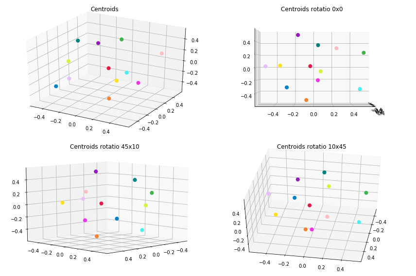
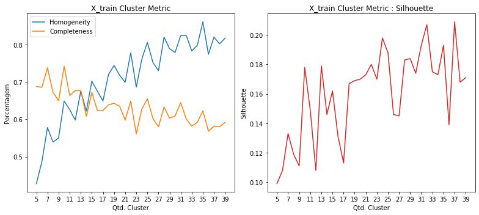
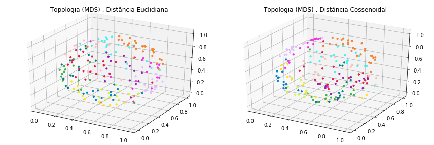
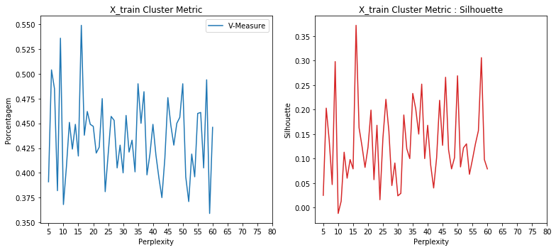
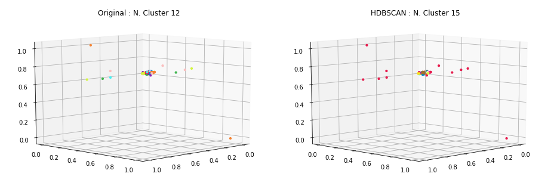
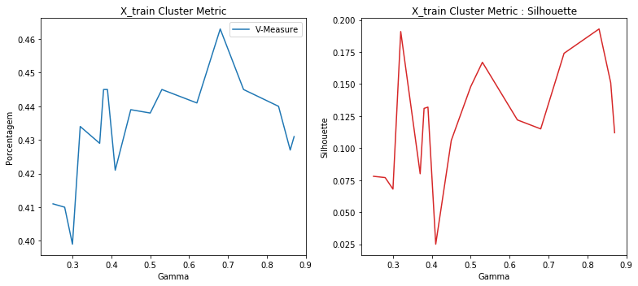
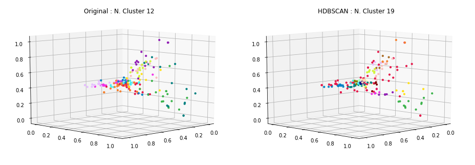
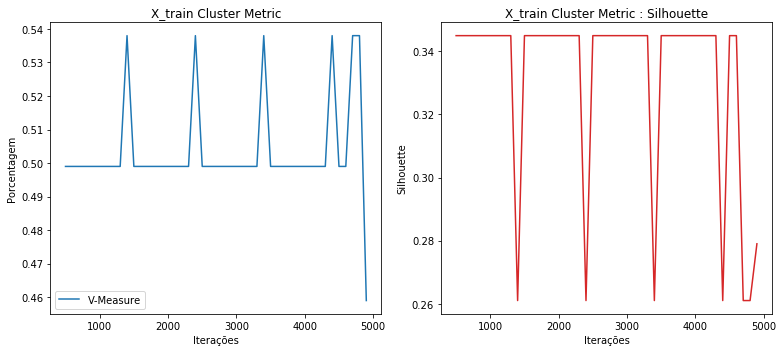
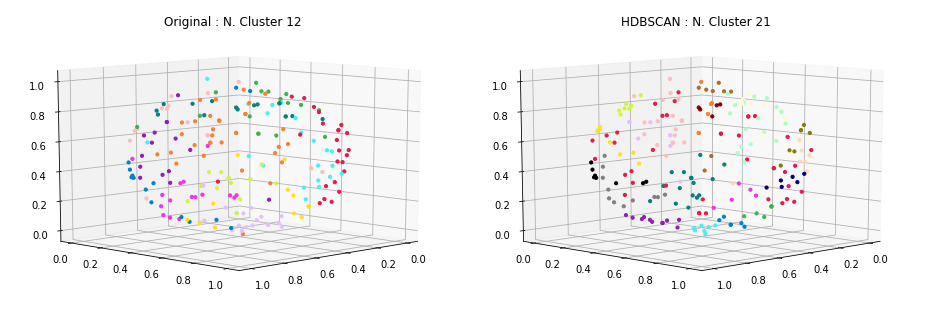

### Carregamento dos datasets

Os datasets de exemplos são frases já pré-categorizadas usadas em chatbots.

Contém 33 categorias e ao todo 696 documentos ou frases.

<table border="1" class="dataframe">
  <thead>
    <tr style="text-align: right;">
      <th></th>
      <th>perguntas</th>
      <th>cluster</th>
    </tr>
  </thead>
  <tbody>
    <tr>
      <th>198</th>
      <td>como faco para trocar o meu usuario</td>
      <td>ACCOUNT</td>
    </tr>
    <tr>
      <th>204</th>
      <td>eu consigo trocar meu username para outro?</td>
      <td>ACCOUNT</td>
    </tr>
    <tr>
      <th>237</th>
      <td>estou falando com um bot não?</td>
      <td>BOT_FOUND</td>
    </tr>
    <tr>
      <th>226</th>
      <td>quero solicitar a renovação de um certificado digital</td>
      <td>CERTIFICATE</td>
    </tr>
    <tr>
      <th>148</th>
      <td>estou sem acesso ao meu endereco eletronico</td>
      <td>EMAIL</td>
    </tr>
    <tr>
      <th>167</th>
      <td>como saber mais sobre o email da empresa</td>
      <td>EMAIL</td>
    </tr>
    <tr>
      <th>113</th>
      <td>quais outras opções tem para me mostrar?</td>
      <td>NO_OPTION</td>
    </tr>
    <tr>
      <th>119</th>
      <td>nenhuma dessas opções me ajuda</td>
      <td>NO_OPTION</td>
    </tr>
    <tr>
      <th>23</th>
      <td>Não consigo trocar a minha senha</td>
      <td>PASSWORD</td>
    </tr>
    <tr>
      <th>0</th>
      <td>posso consultar informações relativas a outros serviços e projetos?</td>
      <td>SERVICES</td>
    </tr>
  </tbody>
</table>

    Qtde. de documentos por categoria:

<table border="1" class="dataframe">
  <thead>
    <tr style="text-align: right;">
      <th></th>
      <th>Categoria</th>
      <th>Qtde</th>
    </tr>
  </thead>
  <tbody>
    <tr>
      <th>0</th>
      <td>ACCOUNT</td>
      <td>29</td>
    </tr>
    <tr>
      <th>1</th>
      <td>BOT_FOUND</td>
      <td>20</td>
    </tr>
    <tr>
      <th>2</th>
      <td>BOT_NAME</td>
      <td>16</td>
    </tr>
    <tr>
      <th>3</th>
      <td>CERTIFICATE</td>
      <td>18</td>
    </tr>
    <tr>
      <th>4</th>
      <td>EMAIL</td>
      <td>40</td>
    </tr>
    <tr>
      <th>5</th>
      <td>NO_OPTION</td>
      <td>18</td>
    </tr>
    <tr>
      <th>6</th>
      <td>PASSWORD</td>
      <td>27</td>
    </tr>
    <tr>
      <th>7</th>
      <td>REMOTE_ACCESS</td>
      <td>20</td>
    </tr>
    <tr>
      <th>8</th>
      <td>SERVICES</td>
      <td>20</td>
    </tr>
    <tr>
      <th>9</th>
      <td>THANK_YOU</td>
      <td>23</td>
    </tr>
    <tr>
      <th>10</th>
      <td>TROUBLESHOOTING</td>
      <td>17</td>
    </tr>
    <tr>
      <th>11</th>
      <td>WIFI</td>
      <td>24</td>
    </tr>
  </tbody>
</table>

    Total docs     : 272
    Total cluster  : 272
    X_train size   : (217,)
    X_test  size   : (55,)

### Dataset tokenization

    Tokenization...
    Qtd documentos treino:  217
    Qtd Intents treino   :  12
    Finished...

    ['existir algum maneirar alterar nome usuario',
     'nao precisar mais',
     'configurar outlook',
     'senha acessar',
     'certificar digitar',
     'mais email empresar',
     'necessario instalar algum software adicional conectar redar fiar',
     'alterar senha usuario',
     'opcao ajudar',
     'email nao entrar acessar']

### **TF-IDF**

Validação do modelo gerado pelo TF-IDF... teste tanto nos dados apresentados para treinamento quanto nos dados de testes e as acurácias alcançadas.

    - Acurácia treino: 87.0
    --------------------
     - Acurácia teste 1  : 78.18
     - Acurácia teste 2  : 78.18
     - Acurácia teste 3  : 78.18
     - Acurácia teste 4  : 78.18
     - Acurácia teste 5  : 78.18
    - Acurácia média teste: 78.18

### Clusterização

Utilizou-se o KMeans definindo a quantidade de clusters para o número ideal de categorias existentes no caso 33. A métrica de distância utilizada, não foi a euclidiana, mas sim a de cosseno (métrica comumente usada na classificação de texto em seu espaço vetorial).

    Frases por cluster:

<table border="1" class="dataframe">
  <thead>
    <tr style="text-align: right;">
      <th>title</th>
      <th>cluster</th>
    </tr>
  </thead>
  <tbody>
    <tr>
      <td>colaboradores externos conseguem ter uma conta de usuário?</td>
      <td>0</td>
    </tr>
    <tr>
      <td>como e o seu nome?</td>
      <td>0</td>
    </tr>
    <tr>
      <td>Não consigo restaurar a minha senha</td>
      <td>1</td>
    </tr>
    <tr>
      <td>como recuperar meus emails?</td>
      <td>1</td>
    </tr>
    <tr>
      <td>pra que voce serve?</td>
      <td>2</td>
    </tr>
    <tr>
      <td>existem outras opções de serviços prestados?</td>
      <td>2</td>
    </tr>
    <tr>
      <td>queria saber qual usuario e senha usar para me conectar no wifi</td>
      <td>3</td>
    </tr>
    <tr>
      <td>e necessario instalar algum software adicional para conectar na rede sem fio?</td>
      <td>3</td>
    </tr>
    <tr>
      <td>qual senha usar para acessar o sistema</td>
      <td>4</td>
    </tr>
    <tr>
      <td>Não consigo trocar a minha senha</td>
      <td>4</td>
    </tr>
    <tr>
      <td>Eu preciso criar um email institucional</td>
      <td>5</td>
    </tr>
    <tr>
      <td>estou sem acesso ao meu endereco eletronico</td>
      <td>5</td>
    </tr>
    <tr>
      <td>Meu email não funciona</td>
      <td>6</td>
    </tr>
    <tr>
      <td>inseri o email e senha e não deu certo</td>
      <td>6</td>
    </tr>
    <tr>
      <td>fico agradecido por toda sua ajuda</td>
      <td>7</td>
    </tr>
    <tr>
      <td>nao preciso mais de ajuda</td>
      <td>7</td>
    </tr>
    <tr>
      <td>como faco para acessar a rede sem fio de fora da empresa?</td>
      <td>8</td>
    </tr>
    <tr>
      <td>quero acessar remotamente a rede interna da minha empresa diretamente de minha casa</td>
      <td>8</td>
    </tr>
    <tr>
      <td>estou tentanto criar meu username, mas não estou conseguindo</td>
      <td>9</td>
    </tr>
    <tr>
      <td>Username já cadastrado</td>
      <td>9</td>
    </tr>
    <tr>
      <td>como saber mais sobre o email da empresa</td>
      <td>10</td>
    </tr>
    <tr>
      <td>estou com bloqueio no meu email</td>
      <td>10</td>
    </tr>
    <tr>
      <td>quero configurar a rede sem fio no meu celular</td>
      <td>11</td>
    </tr>
    <tr>
      <td>preciso mesmo usar o certificado para configurar minha rede sem fio?</td>
      <td>11</td>
    </tr>
  </tbody>
</table>

    --------------------
    Documentos por cluster:

<table border="1" class="dataframe">
  <tbody>
    <tr>
      <td>C0</td>
      <td>56</td>
    </tr>
    <tr>
      <td>C1</td>
      <td>6</td>
    </tr>
    <tr>
      <td>C2</td>
      <td>29</td>
    </tr>
    <tr>
      <td>C3</td>
      <td>13</td>
    </tr>
    <tr>
      <td>C4</td>
      <td>12</td>
    </tr>
    <tr>
      <td>C5</td>
      <td>8</td>
    </tr>
    <tr>
      <td>C6</td>
      <td>6</td>
    </tr>
    <tr>
      <td>C7</td>
      <td>29</td>
    </tr>
    <tr>
      <td>C8</td>
      <td>14</td>
    </tr>
    <tr>
      <td>C9</td>
      <td>10</td>
    </tr>
    <tr>
      <td>C10</td>
      <td>21</td>
    </tr>
    <tr>
      <td>C11</td>
      <td>13</td>
    </tr>
  </tbody>
</table>

### Visualização

Apresentação dos protótipos gerados pelo KMeans, reduzindo a dimensão usando o algoritmo MDS (Multidimensional Scaling).

### Clusterização dos dados de Teste

Por fim, realizada a clusterização dos dados de teste e a apresentação das 8 primeiras frases do conjunto de teste juntamente com outras duas frases do cluster ao qual foi identificado como o melhor.

    * Meu email está com problema
      -  estou com bloqueio no meu email
      -  como saber mais sobre o email da empresa
    --------------------
    * existem mais serviços com os quais eu posso consultar?
      -  existem outras opções de serviços prestados?
      -  pra que voce serve?
    --------------------
    * como eu faco para criar um novo usuario?
      -  colaboradores externos conseguem ter uma conta de usuário?
      -  como e o seu nome?
    --------------------
    * como me conectar ao wifi (rede sem fio) da empresa
      -  queria saber qual usuario e senha usar para me conectar no wifi
      -  e necessario instalar algum software adicional para conectar na rede sem fio?
    --------------------
    * eu consigo alterar meu nome de usuário para outro?
      -  colaboradores externos conseguem ter uma conta de usuário?
      -  como e o seu nome?
    --------------------
    * qual usuario e senha usar para acessar os sistemas?
      -  Não consigo trocar a minha senha
      -  qual senha usar para acessar o sistema
    --------------------
    * Não consigo entrar no meu email
      -  estou com bloqueio no meu email
      -  como saber mais sobre o email da empresa
    --------------------
    * tem como renovar um certificado digital emitido?
      -  como e o seu nome?
      -  colaboradores externos conseguem ter uma conta de usuário?
    --------------------

### Métricas

Abaixo são apresentadas métricas para demonstrar o quanto a clusterização parece funcionar.

    Homogeneidade    :  0.652
    Completude       :  0.73
    V-Measure        :  0.689
    Silhouette       :  0.126

### HDBSCAN no espaço dos dados

    Frases por cluster:

<table border="1" class="dataframe">
  <thead>
    <tr style="text-align: right;">
      <th>title</th>
      <th>cluster</th>
    </tr>
  </thead>
  <tbody>
    <tr>
      <td>minha empresa pode emitir certificados digitais para mim?</td>
      <td>0</td>
    </tr>
    <tr>
      <td>onde consigo mais informações sobre a emição / manutenção de certificados digitais emitidos pela empresa?</td>
      <td>0</td>
    </tr>
    <tr>
      <td>quero mais informações sobre certificados digitais</td>
      <td>0</td>
    </tr>
    <tr>
      <td>Renovação de certificado digital</td>
      <td>1</td>
    </tr>
    <tr>
      <td>como solicitar um novo certificado digital para um sistema que criei no me departamento?</td>
      <td>1</td>
    </tr>
    <tr>
      <td>como faço para criar um novo certificado digital?</td>
      <td>1</td>
    </tr>
    <tr>
      <td>como eu faço para encaminhar meus emails para outro conta?</td>
      <td>2</td>
    </tr>
    <tr>
      <td>consigo criar um endereço eletrônico de email institucional?</td>
      <td>2</td>
    </tr>
    <tr>
      <td>tem como redirecionar meu endereço eletrônico (email) para algum outro?</td>
      <td>2</td>
    </tr>
    <tr>
      <td>quero criar uma conta de usuário para os meus patrulheiros</td>
      <td>3</td>
    </tr>
    <tr>
      <td>Como posso criar uma conta para Colaborador Externo?</td>
      <td>3</td>
    </tr>
    <tr>
      <td>um patrulheiro pode ter uma conta de usuário?</td>
      <td>3</td>
    </tr>
    <tr>
      <td>como acessar wifi da empresa?</td>
      <td>4</td>
    </tr>
    <tr>
      <td>como eu configuro a rede sem fio no meu computador?</td>
      <td>4</td>
    </tr>
    <tr>
      <td>para se conectar a rede sem fio, posso usar quais sistemas operacionais?</td>
      <td>4</td>
    </tr>
    <tr>
      <td>meu novo username não esta sendo criado</td>
      <td>5</td>
    </tr>
    <tr>
      <td>Usuário / Matrícula já cadastrado com o username</td>
      <td>5</td>
    </tr>
    <tr>
      <td>Username já cadastrado</td>
      <td>5</td>
    </tr>
    <tr>
      <td>quero consultar outro tipo de informação com você, posso?</td>
      <td>6</td>
    </tr>
    <tr>
      <td>essas opções não tem o que estou procurando</td>
      <td>6</td>
    </tr>
    <tr>
      <td>tem como eu mudar meu nome de usuário?</td>
      <td>6</td>
    </tr>
    <tr>
      <td>Minha Senha está com problema</td>
      <td>7</td>
    </tr>
    <tr>
      <td>estou tentando acessar meu email mas sem sucesso</td>
      <td>7</td>
    </tr>
    <tr>
      <td>estou com problemas para acessar meu email</td>
      <td>7</td>
    </tr>
    <tr>
      <td>configurar vpn (acesso remoto) em aparelhos da nokia</td>
      <td>8</td>
    </tr>
    <tr>
      <td>como configurar a vpn</td>
      <td>8</td>
    </tr>
    <tr>
      <td>how to configure vpn?</td>
      <td>8</td>
    </tr>
    <tr>
      <td>Não consigo restaurar a minha senha</td>
      <td>9</td>
    </tr>
    <tr>
      <td>como faco para trocar o meu usuario</td>
      <td>9</td>
    </tr>
    <tr>
      <td>Não consigo trocar a minha senha</td>
      <td>9</td>
    </tr>
    <tr>
      <td>te chamo de quê?</td>
      <td>10</td>
    </tr>
    <tr>
      <td>como você se chama?</td>
      <td>10</td>
    </tr>
    <tr>
      <td>como eu devo lhe chamar?</td>
      <td>10</td>
    </tr>
    <tr>
      <td>você ajudou muito</td>
      <td>11</td>
    </tr>
    <tr>
      <td>você ajudou muito, obrigadão</td>
      <td>11</td>
    </tr>
    <tr>
      <td>poxa, obrigado, me ajudou muito</td>
      <td>11</td>
    </tr>
    <tr>
      <td>essas opções não me ajudam em nada</td>
      <td>12</td>
    </tr>
    <tr>
      <td>essas opções não me ajudam</td>
      <td>12</td>
    </tr>
    <tr>
      <td>nenhuma das opções mais solicitadas me ajuda</td>
      <td>12</td>
    </tr>
    <tr>
      <td>você tem nome?</td>
      <td>13</td>
    </tr>
    <tr>
      <td>qual o nome que atribuiram a você?</td>
      <td>13</td>
    </tr>
    <tr>
      <td>você tem um nome?</td>
      <td>13</td>
    </tr>
    <tr>
      <td>tem outros serviços disponibilizados por você?</td>
      <td>14</td>
    </tr>
    <tr>
      <td>quais serviços eu posso consultar com você?</td>
      <td>14</td>
    </tr>
    <tr>
      <td>quais outros serviços eu posso consultar por você?</td>
      <td>14</td>
    </tr>
    <tr>
      <td>Posso falar com um humano?</td>
      <td>15</td>
    </tr>
    <tr>
      <td>quero falar com um atendente de verdade</td>
      <td>15</td>
    </tr>
    <tr>
      <td>Quero falar com um humano</td>
      <td>15</td>
    </tr>
    <tr>
      <td>não preciso mais de ajuda, estou satisfeito</td>
      <td>16</td>
    </tr>
    <tr>
      <td>Preciso de outro tipo de ajuda</td>
      <td>16</td>
    </tr>
    <tr>
      <td>preciso de ajuda de verdade</td>
      <td>16</td>
    </tr>
  </tbody>
</table>

    --------------------
    Documentos por cluster:

<table border="1" class="dataframe">
  <tbody>
    <tr>
      <td>C0</td>
      <td>6</td>
    </tr>
    <tr>
      <td>C1</td>
      <td>6</td>
    </tr>
    <tr>
      <td>C2</td>
      <td>7</td>
    </tr>
    <tr>
      <td>C3</td>
      <td>7</td>
    </tr>
    <tr>
      <td>C4</td>
      <td>28</td>
    </tr>
    <tr>
      <td>C5</td>
      <td>5</td>
    </tr>
    <tr>
      <td>C6</td>
      <td>68</td>
    </tr>
    <tr>
      <td>C7</td>
      <td>16</td>
    </tr>
    <tr>
      <td>C8</td>
      <td>5</td>
    </tr>
    <tr>
      <td>C9</td>
      <td>16</td>
    </tr>
    <tr>
      <td>C10</td>
      <td>5</td>
    </tr>
    <tr>
      <td>C11</td>
      <td>6</td>
    </tr>
    <tr>
      <td>C12</td>
      <td>6</td>
    </tr>
    <tr>
      <td>C13</td>
      <td>7</td>
    </tr>
    <tr>
      <td>C14</td>
      <td>6</td>
    </tr>
    <tr>
      <td>C15</td>
      <td>15</td>
    </tr>
    <tr>
      <td>C16</td>
      <td>8</td>
    </tr>
  </tbody>
</table>

### Topologia dos dados de treinamento usando MDS

## **HDBSCAN**

 - [How HDBSCAN Works](https://nbviewer.jupyter.org/github/scikit-learn-contrib/hdbscan/blob/master/notebooks/How%20HDBSCAN%20Works.ipynb)
 - [hdbscan github implementation](https://github.com/scikit-learn-contrib/hdbscan)
 - [Density-Based Clustering Based on Hierarchical Density Estimates](https://link.springer.com/chapter/10.1007/978-3-642-37456-2_14)

---

## **t-SNE + HDBSCAN**

<table border="1" class="dataframe">
  <thead>
    <tr style="text-align: right;">
      <th></th>
      <th>Perplexity</th>
      <th>Learning Rate</th>
      <th>Angle</th>
      <th>V-Measure</th>
      <th>Silhouette</th>
    </tr>
  </thead>
  <tbody>
    <tr>
      <th>11</th>
      <td>16</td>
      <td>85</td>
      <td>0.83</td>
      <td>0.549</td>
      <td>0.372</td>
    </tr>
    <tr>
      <th>53</th>
      <td>58</td>
      <td>111</td>
      <td>0.87</td>
      <td>0.494</td>
      <td>0.306</td>
    </tr>
    <tr>
      <th>4</th>
      <td>9</td>
      <td>109</td>
      <td>0.89</td>
      <td>0.536</td>
      <td>0.298</td>
    </tr>
    <tr>
      <th>45</th>
      <td>50</td>
      <td>88</td>
      <td>0.89</td>
      <td>0.490</td>
      <td>0.269</td>
    </tr>
    <tr>
      <th>41</th>
      <td>46</td>
      <td>173</td>
      <td>0.73</td>
      <td>0.448</td>
      <td>0.266</td>
    </tr>
    <tr>
      <th>33</th>
      <td>38</td>
      <td>195</td>
      <td>0.83</td>
      <td>0.398</td>
      <td>0.252</td>
    </tr>
    <tr>
      <th>30</th>
      <td>35</td>
      <td>167</td>
      <td>0.80</td>
      <td>0.490</td>
      <td>0.233</td>
    </tr>
    <tr>
      <th>21</th>
      <td>26</td>
      <td>85</td>
      <td>0.83</td>
      <td>0.457</td>
      <td>0.221</td>
    </tr>
    <tr>
      <th>39</th>
      <td>44</td>
      <td>168</td>
      <td>0.71</td>
      <td>0.415</td>
      <td>0.219</td>
    </tr>
    <tr>
      <th>1</th>
      <td>6</td>
      <td>85</td>
      <td>0.83</td>
      <td>0.504</td>
      <td>0.203</td>
    </tr>
    <tr>
      <th>31</th>
      <td>36</td>
      <td>85</td>
      <td>0.83</td>
      <td>0.450</td>
      <td>0.201</td>
    </tr>
    <tr>
      <th>16</th>
      <td>21</td>
      <td>200</td>
      <td>0.87</td>
      <td>0.420</td>
      <td>0.199</td>
    </tr>
    <tr>
      <th>27</th>
      <td>32</td>
      <td>162</td>
      <td>0.89</td>
      <td>0.421</td>
      <td>0.189</td>
    </tr>
    <tr>
      <th>35</th>
      <td>40</td>
      <td>179</td>
      <td>0.86</td>
      <td>0.449</td>
      <td>0.168</td>
    </tr>
    <tr>
      <th>18</th>
      <td>23</td>
      <td>130</td>
      <td>0.84</td>
      <td>0.475</td>
      <td>0.168</td>
    </tr>
    <tr>
      <th>12</th>
      <td>17</td>
      <td>126</td>
      <td>0.79</td>
      <td>0.438</td>
      <td>0.163</td>
    </tr>
    <tr>
      <th>52</th>
      <td>57</td>
      <td>134</td>
      <td>0.85</td>
      <td>0.405</td>
      <td>0.157</td>
    </tr>
    <tr>
      <th>22</th>
      <td>27</td>
      <td>126</td>
      <td>0.79</td>
      <td>0.453</td>
      <td>0.156</td>
    </tr>
    <tr>
      <th>32</th>
      <td>37</td>
      <td>126</td>
      <td>0.79</td>
      <td>0.482</td>
      <td>0.150</td>
    </tr>
    <tr>
      <th>20</th>
      <td>25</td>
      <td>167</td>
      <td>0.80</td>
      <td>0.419</td>
      <td>0.142</td>
    </tr>
    <tr>
      <th>2</th>
      <td>7</td>
      <td>126</td>
      <td>0.79</td>
      <td>0.485</td>
      <td>0.137</td>
    </tr>
    <tr>
      <th>51</th>
      <td>56</td>
      <td>173</td>
      <td>0.73</td>
      <td>0.461</td>
      <td>0.130</td>
    </tr>
    <tr>
      <th>48</th>
      <td>53</td>
      <td>93</td>
      <td>0.78</td>
      <td>0.419</td>
      <td>0.130</td>
    </tr>
    <tr>
      <th>40</th>
      <td>45</td>
      <td>71</td>
      <td>0.74</td>
      <td>0.476</td>
      <td>0.127</td>
    </tr>
    <tr>
      <th>13</th>
      <td>18</td>
      <td>195</td>
      <td>0.83</td>
      <td>0.462</td>
      <td>0.125</td>
    </tr>
  </tbody>
</table>

    Homogeneidade    :  0.555
    Completude       :  0.544
    V-Measure        :  0.549
    Silhouette       :  0.372

    Frases por cluster:

<table border="1" class="dataframe">
  <thead>
    <tr style="text-align: right;">
      <th>title</th>
      <th>cluster</th>
    </tr>
  </thead>
  <tbody>
    <tr>
      <td>claro que voce nao conseguiu entender voce eh so um conjunto de if e elses quase nao tem inteligencia</td>
      <td>0</td>
    </tr>
    <tr>
      <td>não tem outras opções para me mostrar?</td>
      <td>0</td>
    </tr>
    <tr>
      <td>Como encaminhar meus emails para outro endereço</td>
      <td>0</td>
    </tr>
    <tr>
      <td>como acessar os sistemas da empresa de casa</td>
      <td>1</td>
    </tr>
    <tr>
      <td>quero acessar remotamente a rede interna da minha empresa diretamente de minha casa</td>
      <td>1</td>
    </tr>
    <tr>
      <td>como acessar wifi da empresa?</td>
      <td>1</td>
    </tr>
    <tr>
      <td>quais serviços eu posso consultar com você?</td>
      <td>2</td>
    </tr>
    <tr>
      <td>quais outras opcoes voce consegue responder pra mim?</td>
      <td>2</td>
    </tr>
    <tr>
      <td>quais outros servicos voce oferece?</td>
      <td>2</td>
    </tr>
    <tr>
      <td>essas opções não tem o que estou procurando</td>
      <td>3</td>
    </tr>
    <tr>
      <td>estou falando com um chatbot com certeza</td>
      <td>3</td>
    </tr>
    <tr>
      <td>estou falando com um bot não?</td>
      <td>3</td>
    </tr>
    <tr>
      <td>Revogação de certificado digital</td>
      <td>4</td>
    </tr>
    <tr>
      <td>Solicitação de certificado digital</td>
      <td>4</td>
    </tr>
    <tr>
      <td>como solicitar um novo certificado digital para um sistema que criei no me departamento?</td>
      <td>4</td>
    </tr>
    <tr>
      <td>qual o nome que atribuiram a você?</td>
      <td>5</td>
    </tr>
    <tr>
      <td>você tem nome?</td>
      <td>5</td>
    </tr>
    <tr>
      <td>não estou conseguindo criar um novo nome de usuário</td>
      <td>5</td>
    </tr>
    <tr>
      <td>poxa, obrigado, me ajudou muito</td>
      <td>6</td>
    </tr>
    <tr>
      <td>você ajudou muito, obrigadão</td>
      <td>6</td>
    </tr>
    <tr>
      <td>muito obrigado mesmo</td>
      <td>6</td>
    </tr>
    <tr>
      <td>estou tentando acessar meu email mas sem sucesso</td>
      <td>7</td>
    </tr>
    <tr>
      <td>quero mais informacoes sobre senhas e como proceder</td>
      <td>7</td>
    </tr>
    <tr>
      <td>quero informações sobre email da minha empresa</td>
      <td>7</td>
    </tr>
    <tr>
      <td>não preciso mais de ajuda, estou satisfeito</td>
      <td>8</td>
    </tr>
    <tr>
      <td>nao preciso mais de ajuda</td>
      <td>8</td>
    </tr>
    <tr>
      <td>consigo criar um endereço eletrônico de email institucional?</td>
      <td>8</td>
    </tr>
    <tr>
      <td>é para colocar minha senha do meu departamento ou outra?</td>
      <td>9</td>
    </tr>
    <tr>
      <td>como acesso a rede sem fio no meu departamento</td>
      <td>9</td>
    </tr>
    <tr>
      <td>como eu acesso a rede interna da minha empresa estando em outro pais?</td>
      <td>9</td>
    </tr>
    <tr>
      <td>preciso mesmo usar o certificado para configurar minha rede sem fio?</td>
      <td>10</td>
    </tr>
    <tr>
      <td>minha empresa pode emitir certificados digitais para mim?</td>
      <td>10</td>
    </tr>
    <tr>
      <td>e necessario instalar algum software adicional para conectar na rede sem fio?</td>
      <td>10</td>
    </tr>
    <tr>
      <td>posso acessar meu endereço eletrônico via thunderbird ou outlook?</td>
      <td>11</td>
    </tr>
    <tr>
      <td>como configurar a vpn</td>
      <td>11</td>
    </tr>
    <tr>
      <td>configurar vpn (acesso remoto) em aparelhos da nokia</td>
      <td>11</td>
    </tr>
    <tr>
      <td>Não consigo restaurar a minha senha</td>
      <td>12</td>
    </tr>
    <tr>
      <td>meu usuario e senha expiraram o que fazer?</td>
      <td>12</td>
    </tr>
    <tr>
      <td>tem como trocar o meu username?</td>
      <td>12</td>
    </tr>
    <tr>
      <td>meu email esta sem acesso, não estou conseguindo acessar</td>
      <td>13</td>
    </tr>
    <tr>
      <td>o email não esta no spam</td>
      <td>13</td>
    </tr>
    <tr>
      <td>não consegui acessar meu email</td>
      <td>13</td>
    </tr>
    <tr>
      <td>preciso de ajudar</td>
      <td>14</td>
    </tr>
    <tr>
      <td>um patrulheiro pode ter uma conta de usuário?</td>
      <td>14</td>
    </tr>
    <tr>
      <td>voce nao conseguiu me entender preciso de ajuda de verdade</td>
      <td>14</td>
    </tr>
  </tbody>
</table>

    --------------------
    Documentos por cluster:

<table border="1" class="dataframe">
  <tbody>
    <tr>
      <td>C0</td>
      <td>25</td>
    </tr>
    <tr>
      <td>C1</td>
      <td>7</td>
    </tr>
    <tr>
      <td>C2</td>
      <td>15</td>
    </tr>
    <tr>
      <td>C3</td>
      <td>41</td>
    </tr>
    <tr>
      <td>C4</td>
      <td>6</td>
    </tr>
    <tr>
      <td>C5</td>
      <td>9</td>
    </tr>
    <tr>
      <td>C6</td>
      <td>7</td>
    </tr>
    <tr>
      <td>C7</td>
      <td>8</td>
    </tr>
    <tr>
      <td>C8</td>
      <td>11</td>
    </tr>
    <tr>
      <td>C9</td>
      <td>25</td>
    </tr>
    <tr>
      <td>C10</td>
      <td>6</td>
    </tr>
    <tr>
      <td>C11</td>
      <td>11</td>
    </tr>
    <tr>
      <td>C12</td>
      <td>27</td>
    </tr>
    <tr>
      <td>C13</td>
      <td>14</td>
    </tr>
    <tr>
      <td>C14</td>
      <td>5</td>
    </tr>
  </tbody>
</table>

---

## **Spectral Embedding + HDBSCAN**

<table border="1" class="dataframe">
  <thead>
    <tr style="text-align: right;">
      <th></th>
      <th>Gamma</th>
      <th>V-Measure</th>
      <th>Silhouette</th>
    </tr>
  </thead>
  <tbody>
    <tr>
      <th>11</th>
      <td>0.83</td>
      <td>0.440</td>
      <td>0.193</td>
    </tr>
    <tr>
      <th>18</th>
      <td>0.32</td>
      <td>0.434</td>
      <td>0.191</td>
    </tr>
    <tr>
      <th>19</th>
      <td>0.74</td>
      <td>0.445</td>
      <td>0.174</td>
    </tr>
    <tr>
      <th>8</th>
      <td>0.53</td>
      <td>0.445</td>
      <td>0.167</td>
    </tr>
    <tr>
      <th>16</th>
      <td>0.86</td>
      <td>0.427</td>
      <td>0.151</td>
    </tr>
    <tr>
      <th>14</th>
      <td>0.50</td>
      <td>0.438</td>
      <td>0.148</td>
    </tr>
    <tr>
      <th>5</th>
      <td>0.39</td>
      <td>0.445</td>
      <td>0.132</td>
    </tr>
    <tr>
      <th>7</th>
      <td>0.38</td>
      <td>0.445</td>
      <td>0.131</td>
    </tr>
    <tr>
      <th>13</th>
      <td>0.62</td>
      <td>0.441</td>
      <td>0.122</td>
    </tr>
    <tr>
      <th>4</th>
      <td>0.68</td>
      <td>0.463</td>
      <td>0.115</td>
    </tr>
    <tr>
      <th>1</th>
      <td>0.87</td>
      <td>0.431</td>
      <td>0.112</td>
    </tr>
    <tr>
      <th>0</th>
      <td>0.45</td>
      <td>0.439</td>
      <td>0.106</td>
    </tr>
    <tr>
      <th>3</th>
      <td>0.45</td>
      <td>0.439</td>
      <td>0.106</td>
    </tr>
    <tr>
      <th>6</th>
      <td>0.37</td>
      <td>0.429</td>
      <td>0.080</td>
    </tr>
    <tr>
      <th>12</th>
      <td>0.25</td>
      <td>0.411</td>
      <td>0.078</td>
    </tr>
    <tr>
      <th>15</th>
      <td>0.28</td>
      <td>0.410</td>
      <td>0.077</td>
    </tr>
    <tr>
      <th>10</th>
      <td>0.28</td>
      <td>0.410</td>
      <td>0.077</td>
    </tr>
    <tr>
      <th>2</th>
      <td>0.30</td>
      <td>0.399</td>
      <td>0.068</td>
    </tr>
    <tr>
      <th>9</th>
      <td>0.30</td>
      <td>0.399</td>
      <td>0.068</td>
    </tr>
    <tr>
      <th>17</th>
      <td>0.41</td>
      <td>0.421</td>
      <td>0.025</td>
    </tr>
  </tbody>
</table>

    Homogeneidade    :  0.455
    Completude       :  0.425
    V-Measure        :  0.44
    Silhouette       :  0.193

---

## **MDS + HDBSCAN**

<table border="1" class="dataframe">
  <thead>
    <tr style="text-align: right;">
      <th></th>
      <th>Iterações</th>
      <th>N_Init</th>
      <th>V-Measure</th>
      <th>Silhouette</th>
    </tr>
  </thead>
  <tbody>
    <tr>
      <th>0</th>
      <td>500</td>
      <td>28</td>
      <td>0.499</td>
      <td>0.345</td>
    </tr>
    <tr>
      <th>21</th>
      <td>2600</td>
      <td>26</td>
      <td>0.499</td>
      <td>0.345</td>
    </tr>
    <tr>
      <th>23</th>
      <td>2800</td>
      <td>34</td>
      <td>0.499</td>
      <td>0.345</td>
    </tr>
    <tr>
      <th>24</th>
      <td>2900</td>
      <td>16</td>
      <td>0.499</td>
      <td>0.345</td>
    </tr>
    <tr>
      <th>25</th>
      <td>3000</td>
      <td>26</td>
      <td>0.499</td>
      <td>0.345</td>
    </tr>
    <tr>
      <th>26</th>
      <td>3100</td>
      <td>18</td>
      <td>0.499</td>
      <td>0.345</td>
    </tr>
    <tr>
      <th>27</th>
      <td>3200</td>
      <td>18</td>
      <td>0.499</td>
      <td>0.345</td>
    </tr>
    <tr>
      <th>28</th>
      <td>3300</td>
      <td>17</td>
      <td>0.499</td>
      <td>0.345</td>
    </tr>
    <tr>
      <th>30</th>
      <td>3500</td>
      <td>28</td>
      <td>0.499</td>
      <td>0.345</td>
    </tr>
    <tr>
      <th>31</th>
      <td>3600</td>
      <td>26</td>
      <td>0.499</td>
      <td>0.345</td>
    </tr>
    <tr>
      <th>32</th>
      <td>3700</td>
      <td>16</td>
      <td>0.499</td>
      <td>0.345</td>
    </tr>
    <tr>
      <th>33</th>
      <td>3800</td>
      <td>34</td>
      <td>0.499</td>
      <td>0.345</td>
    </tr>
    <tr>
      <th>34</th>
      <td>3900</td>
      <td>16</td>
      <td>0.499</td>
      <td>0.345</td>
    </tr>
    <tr>
      <th>35</th>
      <td>4000</td>
      <td>26</td>
      <td>0.499</td>
      <td>0.345</td>
    </tr>
    <tr>
      <th>36</th>
      <td>4100</td>
      <td>18</td>
      <td>0.499</td>
      <td>0.345</td>
    </tr>
    <tr>
      <th>37</th>
      <td>4200</td>
      <td>18</td>
      <td>0.499</td>
      <td>0.345</td>
    </tr>
    <tr>
      <th>38</th>
      <td>4300</td>
      <td>17</td>
      <td>0.499</td>
      <td>0.345</td>
    </tr>
    <tr>
      <th>40</th>
      <td>4500</td>
      <td>16</td>
      <td>0.499</td>
      <td>0.345</td>
    </tr>
    <tr>
      <th>41</th>
      <td>4600</td>
      <td>24</td>
      <td>0.499</td>
      <td>0.345</td>
    </tr>
    <tr>
      <th>1</th>
      <td>600</td>
      <td>26</td>
      <td>0.499</td>
      <td>0.345</td>
    </tr>
    <tr>
      <th>22</th>
      <td>2700</td>
      <td>16</td>
      <td>0.499</td>
      <td>0.345</td>
    </tr>
    <tr>
      <th>20</th>
      <td>2500</td>
      <td>28</td>
      <td>0.499</td>
      <td>0.345</td>
    </tr>
    <tr>
      <th>12</th>
      <td>1700</td>
      <td>16</td>
      <td>0.499</td>
      <td>0.345</td>
    </tr>
    <tr>
      <th>6</th>
      <td>1100</td>
      <td>18</td>
      <td>0.499</td>
      <td>0.345</td>
    </tr>
    <tr>
      <th>7</th>
      <td>1200</td>
      <td>18</td>
      <td>0.499</td>
      <td>0.345</td>
    </tr>
  </tbody>
</table>

    Homogeneidade    :  0.541
    Completude       :  0.462
    V-Measure        :  0.499
    Silhouette       :  0.345

