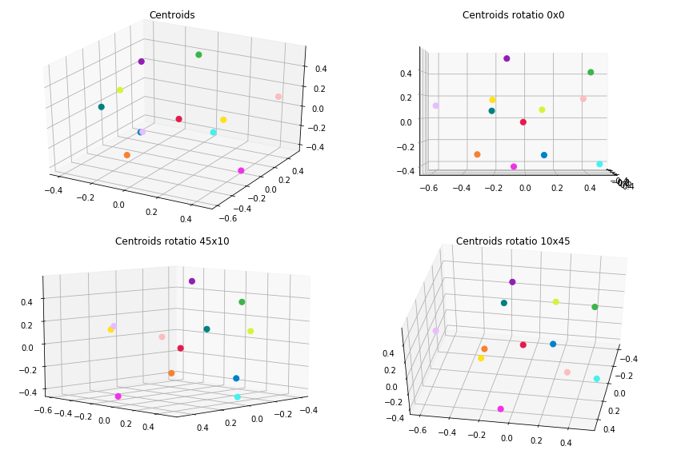
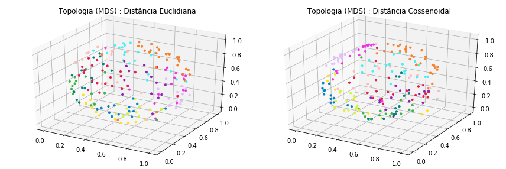
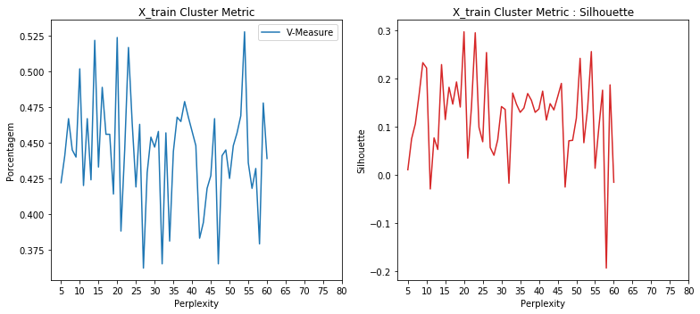
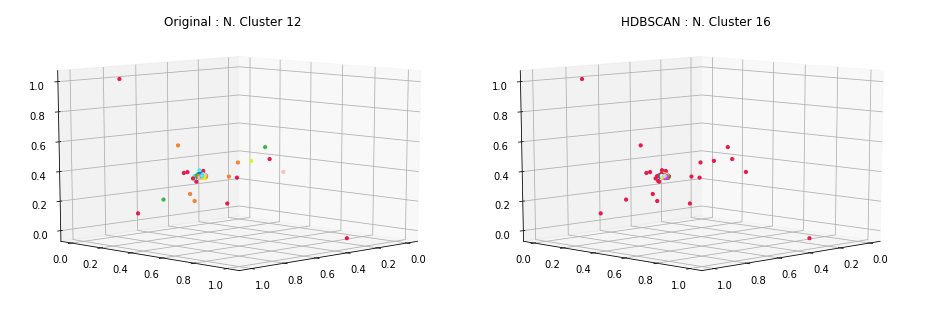
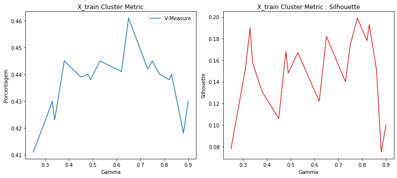
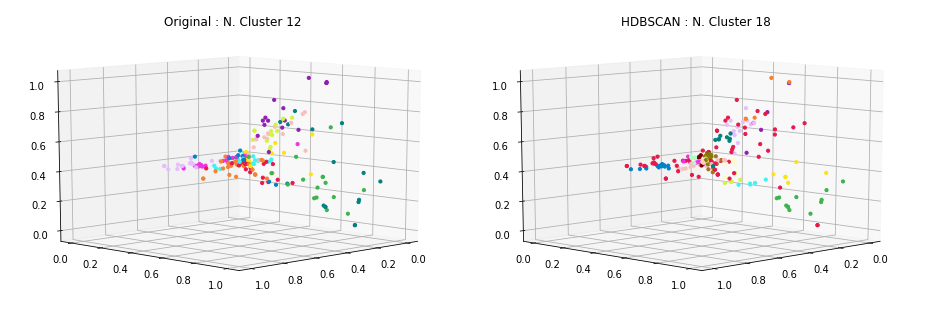
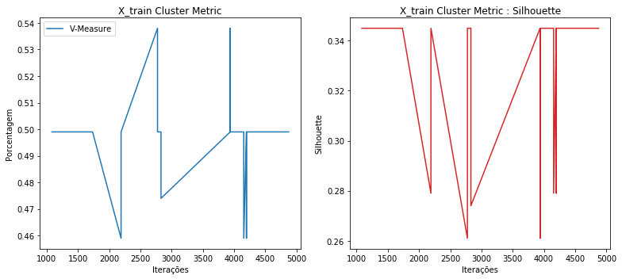
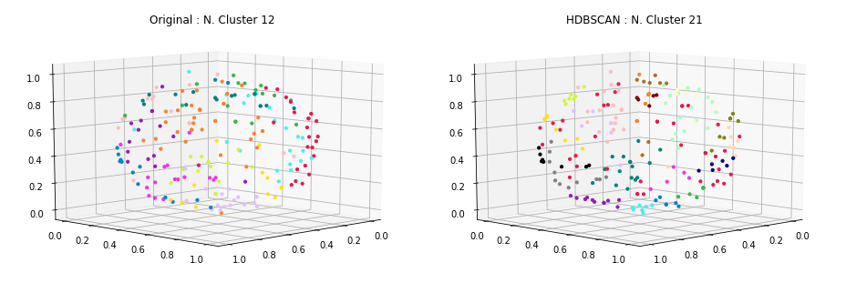

### Carregamento dos datasets

Os datasets de exemplos são frases já pré-categorizadas usadas em chatbots.

Contém 33 categorias e ao todo 696 documentos ou frases.

<table border="1" class="dataframe">
  <thead>
    <tr style="text-align: right;">
      <th></th>
      <th>perguntas</th>
      <th>cluster</th>
    </tr>
  </thead>
  <tbody>
    <tr>
      <th>198</th>
      <td>como faco para trocar o meu usuario</td>
      <td>ACCOUNT</td>
    </tr>
    <tr>
      <th>204</th>
      <td>eu consigo trocar meu username para outro?</td>
      <td>ACCOUNT</td>
    </tr>
    <tr>
      <th>237</th>
      <td>estou falando com um bot não?</td>
      <td>BOT_FOUND</td>
    </tr>
    <tr>
      <th>226</th>
      <td>quero solicitar a renovação de um certificado digital</td>
      <td>CERTIFICATE</td>
    </tr>
    <tr>
      <th>148</th>
      <td>estou sem acesso ao meu endereco eletronico</td>
      <td>EMAIL</td>
    </tr>
    <tr>
      <th>167</th>
      <td>como saber mais sobre o email da empresa</td>
      <td>EMAIL</td>
    </tr>
    <tr>
      <th>113</th>
      <td>quais outras opções tem para me mostrar?</td>
      <td>NO_OPTION</td>
    </tr>
    <tr>
      <th>119</th>
      <td>nenhuma dessas opções me ajuda</td>
      <td>NO_OPTION</td>
    </tr>
    <tr>
      <th>23</th>
      <td>Não consigo trocar a minha senha</td>
      <td>PASSWORD</td>
    </tr>
    <tr>
      <th>0</th>
      <td>posso consultar informações relativas a outros serviços e projetos?</td>
      <td>SERVICES</td>
    </tr>
  </tbody>
</table>

    Qtde. de documentos por categoria:

<table border="1" class="dataframe">
  <thead>
    <tr style="text-align: right;">
      <th></th>
      <th>Categoria</th>
      <th>Qtde</th>
    </tr>
  </thead>
  <tbody>
    <tr>
      <th>0</th>
      <td>ACCOUNT</td>
      <td>29</td>
    </tr>
    <tr>
      <th>1</th>
      <td>BOT_FOUND</td>
      <td>20</td>
    </tr>
    <tr>
      <th>2</th>
      <td>BOT_NAME</td>
      <td>16</td>
    </tr>
    <tr>
      <th>3</th>
      <td>CERTIFICATE</td>
      <td>18</td>
    </tr>
    <tr>
      <th>4</th>
      <td>EMAIL</td>
      <td>40</td>
    </tr>
    <tr>
      <th>5</th>
      <td>NO_OPTION</td>
      <td>18</td>
    </tr>
    <tr>
      <th>6</th>
      <td>PASSWORD</td>
      <td>27</td>
    </tr>
    <tr>
      <th>7</th>
      <td>REMOTE_ACCESS</td>
      <td>20</td>
    </tr>
    <tr>
      <th>8</th>
      <td>SERVICES</td>
      <td>20</td>
    </tr>
    <tr>
      <th>9</th>
      <td>THANK_YOU</td>
      <td>23</td>
    </tr>
    <tr>
      <th>10</th>
      <td>TROUBLESHOOTING</td>
      <td>17</td>
    </tr>
    <tr>
      <th>11</th>
      <td>WIFI</td>
      <td>24</td>
    </tr>
  </tbody>
</table>

    Total docs     : 272
    Total cluster  : 272
    X_train size   : (217,)
    X_test  size   : (55,)

### Dataset tokenization

    Tokenization...
    Qtd documentos treino:  217
    Qtd Intents treino   :  12
    Finished...

    ['existir algum maneirar alterar nome usuario',
     'nao precisar mais',
     'configurar outlook',
     'senha acessar',
     'certificar digitar',
     'mais email empresar',
     'necessario instalar algum software adicional conectar redar fiar',
     'alterar senha usuario',
     'opcao ajudar',
     'email nao entrar acessar']

### **TF-IDF**

Validação do modelo gerado pelo TF-IDF... teste tanto nos dados apresentados para treinamento quanto nos dados de testes e as acurácias alcançadas.

### Acurácia distância cossenoidal

    - Acurácia treino: 99.0
    --------------------
     - Acurácia teste 1  : 78.18
     - Acurácia teste 2  : 78.18
     - Acurácia teste 3  : 78.18
     - Acurácia teste 4  : 78.18
     - Acurácia teste 5  : 78.18
    - Acurácia média teste: 78.18

### Acurácia distância euclidiana

    - Acurácia treino: 99.0
    --------------------
     - Acurácia teste 1  : 80.0
     - Acurácia teste 2  : 80.0
     - Acurácia teste 3  : 80.0
     - Acurácia teste 4  : 80.0
     - Acurácia teste 5  : 80.0
    - Acurácia média teste: 80.0

### Clusterização

Utilizou-se o KMeans definindo a quantidade de clusters para o número ideal de categorias existentes no caso 33. A métrica de distância utilizada, não foi a euclidiana, mas sim a de cosseno (métrica comumente usada na classificação de texto em seu espaço vetorial).

    Frases por cluster:

<table border="1" class="dataframe">
  <thead>
    <tr style="text-align: right;">
      <th>title</th>
      <th>cluster</th>
    </tr>
  </thead>
  <tbody>
    <tr>
      <td>Esqueci a minha senha</td>
      <td>0</td>
    </tr>
    <tr>
      <td>Minha Senha está com problema</td>
      <td>0</td>
    </tr>
    <tr>
      <td>Preciso de outro tipo de ajuda</td>
      <td>1</td>
    </tr>
    <tr>
      <td>não preciso mais de ajuda, estou satisfeito</td>
      <td>1</td>
    </tr>
    <tr>
      <td>tenho duvidas sobre vpn</td>
      <td>2</td>
    </tr>
    <tr>
      <td>queria configurar rede sem fio</td>
      <td>2</td>
    </tr>
    <tr>
      <td>Você é um bot?</td>
      <td>3</td>
    </tr>
    <tr>
      <td>quais outras informações sobre serviços prestados você oferece?</td>
      <td>3</td>
    </tr>
    <tr>
      <td>É possível criar um conta para colaborador externo?</td>
      <td>4</td>
    </tr>
    <tr>
      <td>estou com problemas de expiracao do meu usuario</td>
      <td>4</td>
    </tr>
    <tr>
      <td>você é um chatbot?</td>
      <td>5</td>
    </tr>
    <tr>
      <td>quero falar com um atendente de verdade</td>
      <td>5</td>
    </tr>
    <tr>
      <td>posso ver outras opções de serviços?</td>
      <td>6</td>
    </tr>
    <tr>
      <td>você pode me responder sobre quais serviços disponíveis?</td>
      <td>6</td>
    </tr>
    <tr>
      <td>acesso remoto à rede de dados da empresa</td>
      <td>7</td>
    </tr>
    <tr>
      <td>parabens, deu certo, obrigado pela ajuda</td>
      <td>7</td>
    </tr>
    <tr>
      <td>eu consigo trocar meu username para outro?</td>
      <td>8</td>
    </tr>
    <tr>
      <td>como faco para trocar o meu usuario</td>
      <td>8</td>
    </tr>
    <tr>
      <td>quais outras opções você pode me atender?</td>
      <td>9</td>
    </tr>
    <tr>
      <td>essas opções não tem o que estou procurando</td>
      <td>9</td>
    </tr>
    <tr>
      <td>inseri o email e senha e não funcionou</td>
      <td>10</td>
    </tr>
    <tr>
      <td>como recuperar meus emails?</td>
      <td>10</td>
    </tr>
    <tr>
      <td>como emitir novos certificados digitais?</td>
      <td>11</td>
    </tr>
    <tr>
      <td>posso fazer a configuracao em meu so sem usar a informacao de certificado digital disponibilizada?</td>
      <td>11</td>
    </tr>
  </tbody>
</table>

    --------------------
    Documentos por cluster:

<table border="1" class="dataframe">
  <tbody>
    <tr>
      <td>C0</td>
      <td>33</td>
    </tr>
    <tr>
      <td>C1</td>
      <td>10</td>
    </tr>
    <tr>
      <td>C2</td>
      <td>15</td>
    </tr>
    <tr>
      <td>C3</td>
      <td>23</td>
    </tr>
    <tr>
      <td>C4</td>
      <td>17</td>
    </tr>
    <tr>
      <td>C5</td>
      <td>21</td>
    </tr>
    <tr>
      <td>C6</td>
      <td>7</td>
    </tr>
    <tr>
      <td>C7</td>
      <td>6</td>
    </tr>
    <tr>
      <td>C8</td>
      <td>22</td>
    </tr>
    <tr>
      <td>C9</td>
      <td>11</td>
    </tr>
    <tr>
      <td>C10</td>
      <td>39</td>
    </tr>
    <tr>
      <td>C11</td>
      <td>13</td>
    </tr>
  </tbody>
</table>

### Visualização

Apresentação dos protótipos gerados pelo KMeans, reduzindo a dimensão usando o algoritmo MDS (Multidimensional Scaling).

### Clusterização dos dados de Teste

Por fim, realizada a clusterização dos dados de teste e a apresentação das 8 primeiras frases do conjunto de teste juntamente com outras duas frases do cluster ao qual foi identificado como o melhor.

    * Meu email está com problema
      -  inseri o email e senha e não funcionou
      -  como recuperar meus emails?
    --------------------
    * existem mais serviços com os quais eu posso consultar?
      -  posso ver outras opções de serviços?
      -  você pode me responder sobre quais serviços disponíveis?
    --------------------
    * como eu faco para criar um novo usuario?
      -  estou com problemas de expiracao do meu usuario
      -  É possível criar um conta para colaborador externo?
    --------------------
    * como me conectar ao wifi (rede sem fio) da empresa
      -  Minha Senha está com problema
      -  Esqueci a minha senha
    --------------------
    * eu consigo alterar meu nome de usuário para outro?
      -  estou com problemas de expiracao do meu usuario
      -  É possível criar um conta para colaborador externo?
    --------------------
    * qual usuario e senha usar para acessar os sistemas?
      -  É possível criar um conta para colaborador externo?
      -  estou com problemas de expiracao do meu usuario
    --------------------
    * Não consigo entrar no meu email
      -  como recuperar meus emails?
      -  inseri o email e senha e não funcionou
    --------------------
    * tem como renovar um certificado digital emitido?
      -  posso fazer a configuracao em meu so sem usar a informacao de certificado digital disponibilizada?
      -  como emitir novos certificados digitais?
    --------------------

### Métricas

Abaixo são apresentadas métricas para demonstrar o quanto a clusterização parece funcionar.

    Homogeneidade    :  0.687
    Completude       :  0.701
    V-Measure        :  0.694
    Silhouette       :  0.16

### HDBSCAN no espaço dos dados

    Frases por cluster:

<table border="1" class="dataframe">
  <thead>
    <tr style="text-align: right;">
      <th>title</th>
      <th>cluster</th>
    </tr>
  </thead>
  <tbody>
    <tr>
      <td>certificados digitais</td>
      <td>0</td>
    </tr>
    <tr>
      <td>como emitir novos certificados digitais?</td>
      <td>0</td>
    </tr>
    <tr>
      <td>onde consigo mais informações sobre a emição / manutenção de certificados digitais emitidos pela empresa?</td>
      <td>0</td>
    </tr>
    <tr>
      <td>como solicitar um novo certificado digital para um sistema que criei no me departamento?</td>
      <td>1</td>
    </tr>
    <tr>
      <td>Solicitação de certificado digital</td>
      <td>1</td>
    </tr>
    <tr>
      <td>certificado digital das ACs onde encontrar?</td>
      <td>1</td>
    </tr>
    <tr>
      <td>tem como redirecionar meu endereço eletrônico (email) para algum outro?</td>
      <td>2</td>
    </tr>
    <tr>
      <td>Como encaminhar meus emails para outro endereço</td>
      <td>2</td>
    </tr>
    <tr>
      <td>Eu preciso criar um email institucional</td>
      <td>2</td>
    </tr>
    <tr>
      <td>é permitido que patrulheiros tenham uma conta?</td>
      <td>3</td>
    </tr>
    <tr>
      <td>um patrulheiro pode ter uma conta de usuário?</td>
      <td>3</td>
    </tr>
    <tr>
      <td>quero criar uma conta de usuário para os meus patrulheiros</td>
      <td>3</td>
    </tr>
    <tr>
      <td>quero acessar remotamente a rede interna da minha empresa diretamente de minha casa</td>
      <td>4</td>
    </tr>
    <tr>
      <td>quero configurar a rede sem fio no meu celular</td>
      <td>4</td>
    </tr>
    <tr>
      <td>como conectar a rede wifi do meu departamento?</td>
      <td>4</td>
    </tr>
    <tr>
      <td>Usuário / Matrícula já cadastrado com o username</td>
      <td>5</td>
    </tr>
    <tr>
      <td>meu novo username não esta sendo criado</td>
      <td>5</td>
    </tr>
    <tr>
      <td>estou tentanto criar meu username, mas não estou conseguindo</td>
      <td>5</td>
    </tr>
    <tr>
      <td>o email não esta no spam</td>
      <td>6</td>
    </tr>
    <tr>
      <td>ok, agora consegui, obrigado</td>
      <td>6</td>
    </tr>
    <tr>
      <td>qual senha usar para acessar o sistema</td>
      <td>6</td>
    </tr>
    <tr>
      <td>meu email foi bloqueado</td>
      <td>7</td>
    </tr>
    <tr>
      <td>Meu email não entra, sem acesso</td>
      <td>7</td>
    </tr>
    <tr>
      <td>estou tentando acessar meu email mas sem sucesso</td>
      <td>7</td>
    </tr>
    <tr>
      <td>configurar o vpn (acesso remoto) no macOSX</td>
      <td>8</td>
    </tr>
    <tr>
      <td>voce nao sabe nada sobre vpn?</td>
      <td>8</td>
    </tr>
    <tr>
      <td>como configurar a vpn</td>
      <td>8</td>
    </tr>
    <tr>
      <td>Não consigo trocar a minha senha</td>
      <td>9</td>
    </tr>
    <tr>
      <td>como trocar minha senha</td>
      <td>9</td>
    </tr>
    <tr>
      <td>como faco para trocar o meu usuario</td>
      <td>9</td>
    </tr>
    <tr>
      <td>como você se chama?</td>
      <td>10</td>
    </tr>
    <tr>
      <td>as pessoas te chamam como?</td>
      <td>10</td>
    </tr>
    <tr>
      <td>te chamo de quê?</td>
      <td>10</td>
    </tr>
    <tr>
      <td>poxa vida! muito obrigado</td>
      <td>11</td>
    </tr>
    <tr>
      <td>muito obrigado mesmo</td>
      <td>11</td>
    </tr>
    <tr>
      <td>muitíssimo obrigado</td>
      <td>11</td>
    </tr>
    <tr>
      <td>nenhuma dessas opções me ajuda</td>
      <td>12</td>
    </tr>
    <tr>
      <td>quais outras opções você pode me atender?</td>
      <td>12</td>
    </tr>
    <tr>
      <td>você tem outras opções para ajudar?</td>
      <td>12</td>
    </tr>
    <tr>
      <td>você tem um nome?</td>
      <td>13</td>
    </tr>
    <tr>
      <td>você tem nome?</td>
      <td>13</td>
    </tr>
    <tr>
      <td>qual o nome que atribuiram a você?</td>
      <td>13</td>
    </tr>
    <tr>
      <td>quais serviços eu posso consultar com você?</td>
      <td>14</td>
    </tr>
    <tr>
      <td>quem e voce?</td>
      <td>14</td>
    </tr>
    <tr>
      <td>existem outros serviços que posso consultar com você?</td>
      <td>14</td>
    </tr>
    <tr>
      <td>Posso falar com outro atendente?</td>
      <td>15</td>
    </tr>
    <tr>
      <td>quero falar com um atendente, não com um chatbot</td>
      <td>15</td>
    </tr>
    <tr>
      <td>um chatbot nao conseguirá resolver meu problema</td>
      <td>15</td>
    </tr>
    <tr>
      <td>preciso de ajuda de verdade</td>
      <td>16</td>
    </tr>
    <tr>
      <td>não preciso mais de ajuda, estou satisfeito</td>
      <td>16</td>
    </tr>
    <tr>
      <td>nao preciso mais de ajuda</td>
      <td>16</td>
    </tr>
  </tbody>
</table>

    --------------------
    Documentos por cluster:

<table border="1" class="dataframe">
  <tbody>
    <tr>
      <td>C0</td>
      <td>6</td>
    </tr>
    <tr>
      <td>C1</td>
      <td>6</td>
    </tr>
    <tr>
      <td>C2</td>
      <td>7</td>
    </tr>
    <tr>
      <td>C3</td>
      <td>7</td>
    </tr>
    <tr>
      <td>C4</td>
      <td>28</td>
    </tr>
    <tr>
      <td>C5</td>
      <td>5</td>
    </tr>
    <tr>
      <td>C6</td>
      <td>68</td>
    </tr>
    <tr>
      <td>C7</td>
      <td>16</td>
    </tr>
    <tr>
      <td>C8</td>
      <td>5</td>
    </tr>
    <tr>
      <td>C9</td>
      <td>16</td>
    </tr>
    <tr>
      <td>C10</td>
      <td>5</td>
    </tr>
    <tr>
      <td>C11</td>
      <td>6</td>
    </tr>
    <tr>
      <td>C12</td>
      <td>6</td>
    </tr>
    <tr>
      <td>C13</td>
      <td>7</td>
    </tr>
    <tr>
      <td>C14</td>
      <td>6</td>
    </tr>
    <tr>
      <td>C15</td>
      <td>15</td>
    </tr>
    <tr>
      <td>C16</td>
      <td>8</td>
    </tr>
  </tbody>
</table>

### Topologia dos dados de treinamento usando MDS

## **HDBSCAN**

 - [How HDBSCAN Works](https://nbviewer.jupyter.org/github/scikit-learn-contrib/hdbscan/blob/master/notebooks/How%20HDBSCAN%20Works.ipynb)
 - [hdbscan github implementation](https://github.com/scikit-learn-contrib/hdbscan)
 - [Density-Based Clustering Based on Hierarchical Density Estimates](https://link.springer.com/chapter/10.1007/978-3-642-37456-2_14)

---

## **t-SNE + HDBSCAN**

<table border="1" class="dataframe">
  <thead>
    <tr style="text-align: right;">
      <th></th>
      <th>Perplexity</th>
      <th>Learning Rate</th>
      <th>Angle</th>
      <th>V-Measure</th>
      <th>Silhouette</th>
    </tr>
  </thead>
  <tbody>
    <tr>
      <th>15</th>
      <td>20</td>
      <td>131</td>
      <td>0.67</td>
      <td>0.524</td>
      <td>0.297</td>
    </tr>
    <tr>
      <th>18</th>
      <td>23</td>
      <td>172</td>
      <td>0.83</td>
      <td>0.517</td>
      <td>0.295</td>
    </tr>
    <tr>
      <th>49</th>
      <td>54</td>
      <td>180</td>
      <td>0.85</td>
      <td>0.528</td>
      <td>0.256</td>
    </tr>
    <tr>
      <th>21</th>
      <td>26</td>
      <td>141</td>
      <td>0.80</td>
      <td>0.463</td>
      <td>0.254</td>
    </tr>
    <tr>
      <th>46</th>
      <td>51</td>
      <td>96</td>
      <td>0.78</td>
      <td>0.448</td>
      <td>0.242</td>
    </tr>
    <tr>
      <th>4</th>
      <td>9</td>
      <td>152</td>
      <td>0.89</td>
      <td>0.440</td>
      <td>0.233</td>
    </tr>
    <tr>
      <th>9</th>
      <td>14</td>
      <td>169</td>
      <td>0.78</td>
      <td>0.522</td>
      <td>0.229</td>
    </tr>
    <tr>
      <th>5</th>
      <td>10</td>
      <td>131</td>
      <td>0.67</td>
      <td>0.502</td>
      <td>0.222</td>
    </tr>
    <tr>
      <th>13</th>
      <td>18</td>
      <td>82</td>
      <td>0.86</td>
      <td>0.456</td>
      <td>0.193</td>
    </tr>
    <tr>
      <th>41</th>
      <td>46</td>
      <td>164</td>
      <td>0.89</td>
      <td>0.467</td>
      <td>0.190</td>
    </tr>
    <tr>
      <th>54</th>
      <td>59</td>
      <td>145</td>
      <td>0.86</td>
      <td>0.478</td>
      <td>0.187</td>
    </tr>
    <tr>
      <th>11</th>
      <td>16</td>
      <td>141</td>
      <td>0.80</td>
      <td>0.489</td>
      <td>0.182</td>
    </tr>
    <tr>
      <th>52</th>
      <td>57</td>
      <td>220</td>
      <td>0.89</td>
      <td>0.432</td>
      <td>0.176</td>
    </tr>
    <tr>
      <th>36</th>
      <td>41</td>
      <td>202</td>
      <td>0.89</td>
      <td>0.448</td>
      <td>0.174</td>
    </tr>
    <tr>
      <th>28</th>
      <td>33</td>
      <td>172</td>
      <td>0.83</td>
      <td>0.457</td>
      <td>0.170</td>
    </tr>
    <tr>
      <th>32</th>
      <td>37</td>
      <td>176</td>
      <td>0.82</td>
      <td>0.465</td>
      <td>0.169</td>
    </tr>
    <tr>
      <th>3</th>
      <td>8</td>
      <td>82</td>
      <td>0.86</td>
      <td>0.445</td>
      <td>0.166</td>
    </tr>
    <tr>
      <th>40</th>
      <td>45</td>
      <td>155</td>
      <td>0.77</td>
      <td>0.427</td>
      <td>0.162</td>
    </tr>
    <tr>
      <th>33</th>
      <td>38</td>
      <td>82</td>
      <td>0.86</td>
      <td>0.479</td>
      <td>0.155</td>
    </tr>
    <tr>
      <th>38</th>
      <td>43</td>
      <td>172</td>
      <td>0.83</td>
      <td>0.394</td>
      <td>0.148</td>
    </tr>
    <tr>
      <th>29</th>
      <td>34</td>
      <td>169</td>
      <td>0.78</td>
      <td>0.381</td>
      <td>0.147</td>
    </tr>
    <tr>
      <th>12</th>
      <td>17</td>
      <td>176</td>
      <td>0.82</td>
      <td>0.456</td>
      <td>0.147</td>
    </tr>
    <tr>
      <th>25</th>
      <td>30</td>
      <td>131</td>
      <td>0.67</td>
      <td>0.447</td>
      <td>0.142</td>
    </tr>
    <tr>
      <th>17</th>
      <td>22</td>
      <td>170</td>
      <td>0.83</td>
      <td>0.445</td>
      <td>0.142</td>
    </tr>
    <tr>
      <th>14</th>
      <td>19</td>
      <td>152</td>
      <td>0.89</td>
      <td>0.414</td>
      <td>0.141</td>
    </tr>
  </tbody>
</table>

    Homogeneidade    :  0.534
    Completude       :  0.515
    V-Measure        :  0.524
    Silhouette       :  0.297

    Frases por cluster:

<table border="1" class="dataframe">
  <thead>
    <tr style="text-align: right;">
      <th>title</th>
      <th>cluster</th>
    </tr>
  </thead>
  <tbody>
    <tr>
      <td>quero informações sobre email da minha empresa</td>
      <td>0</td>
    </tr>
    <tr>
      <td>meu novo username não esta sendo criado</td>
      <td>0</td>
    </tr>
    <tr>
      <td>quero consultar outro tipo de informação com você, posso?</td>
      <td>0</td>
    </tr>
    <tr>
      <td>as pessoas te chamam como?</td>
      <td>1</td>
    </tr>
    <tr>
      <td>como você se chama?</td>
      <td>1</td>
    </tr>
    <tr>
      <td>que serviços estão disponíveis?</td>
      <td>1</td>
    </tr>
    <tr>
      <td>onde consigo mais informações sobre a emição / manutenção de certificados digitais emitidos pela empresa?</td>
      <td>2</td>
    </tr>
    <tr>
      <td>quero mais informações sobre certificados digitais</td>
      <td>2</td>
    </tr>
    <tr>
      <td>certificados digitais</td>
      <td>2</td>
    </tr>
    <tr>
      <td>quero falar com um atendente, não com um chatbot</td>
      <td>3</td>
    </tr>
    <tr>
      <td>Quero falar com um humano</td>
      <td>3</td>
    </tr>
    <tr>
      <td>você é um chatbot?</td>
      <td>3</td>
    </tr>
    <tr>
      <td>queria conectar a rede sem fio da empresa, como proceder?</td>
      <td>4</td>
    </tr>
    <tr>
      <td>como acesso a rede sem fio no meu departamento</td>
      <td>4</td>
    </tr>
    <tr>
      <td>quero me conectar a rede sem fio</td>
      <td>4</td>
    </tr>
    <tr>
      <td>acessar a rede wifi (sem fio) no macbook</td>
      <td>5</td>
    </tr>
    <tr>
      <td>como acessar wifi da empresa?</td>
      <td>5</td>
    </tr>
    <tr>
      <td>tenho duvidas sobre vpn</td>
      <td>5</td>
    </tr>
    <tr>
      <td>nenhuma dessas opções me interessa</td>
      <td>6</td>
    </tr>
    <tr>
      <td>acho que por enquanto e só isso mesmo, obrigado</td>
      <td>6</td>
    </tr>
    <tr>
      <td>meu usuario esta cancelado</td>
      <td>6</td>
    </tr>
    <tr>
      <td>quais outros serviços eu posso consultar por você?</td>
      <td>7</td>
    </tr>
    <tr>
      <td>existem outros serviços que posso consultar com você?</td>
      <td>7</td>
    </tr>
    <tr>
      <td>qual o nome que lhe foi dado?</td>
      <td>7</td>
    </tr>
    <tr>
      <td>estou tentando acesso ao meu email mas não estou conseguindo</td>
      <td>8</td>
    </tr>
    <tr>
      <td>estou tentando acessar meu email mas sem sucesso</td>
      <td>8</td>
    </tr>
    <tr>
      <td>não estou tendo sucesso ao tentar acessar meu email</td>
      <td>8</td>
    </tr>
    <tr>
      <td>how to configure vpn?</td>
      <td>9</td>
    </tr>
    <tr>
      <td>como configurar a vpn</td>
      <td>9</td>
    </tr>
    <tr>
      <td>como faco para acessar a rede sem fio de fora da empresa?</td>
      <td>9</td>
    </tr>
    <tr>
      <td>quero acessar remotamente a rede interna da minha empresa diretamente de minha casa</td>
      <td>10</td>
    </tr>
    <tr>
      <td>acessar remotamente os sistemas da empresa da minha casa</td>
      <td>10</td>
    </tr>
    <tr>
      <td>como acessar os sistemas da empresa de casa</td>
      <td>10</td>
    </tr>
    <tr>
      <td>eu consigo trocar meu username para outro?</td>
      <td>11</td>
    </tr>
    <tr>
      <td>Meu email não funciona</td>
      <td>11</td>
    </tr>
    <tr>
      <td>meu usuário e senha não estão funcionando</td>
      <td>11</td>
    </tr>
    <tr>
      <td>Não consigo trocar a minha senha</td>
      <td>12</td>
    </tr>
    <tr>
      <td>muitíssimo obrigado</td>
      <td>12</td>
    </tr>
    <tr>
      <td>muito obrigado mesmo</td>
      <td>12</td>
    </tr>
    <tr>
      <td>Preciso de outro tipo de ajuda</td>
      <td>13</td>
    </tr>
    <tr>
      <td>existem outros programas para acessar meu email?</td>
      <td>13</td>
    </tr>
    <tr>
      <td>preciso de ajuda de verdade</td>
      <td>13</td>
    </tr>
    <tr>
      <td>o email não esta no spam</td>
      <td>14</td>
    </tr>
    <tr>
      <td>essas opções não me ajudam em nada</td>
      <td>14</td>
    </tr>
    <tr>
      <td>essas opções não me ajudam</td>
      <td>14</td>
    </tr>
    <tr>
      <td>Usuário / Matrícula já cadastrado com o username</td>
      <td>15</td>
    </tr>
    <tr>
      <td>essas opções não tem o que estou procurando</td>
      <td>15</td>
    </tr>
    <tr>
      <td>estou tentanto criar meu username, mas não estou conseguindo</td>
      <td>15</td>
    </tr>
  </tbody>
</table>

    --------------------
    Documentos por cluster:

<table border="1" class="dataframe">
  <tbody>
    <tr>
      <td>C0</td>
      <td>49</td>
    </tr>
    <tr>
      <td>C1</td>
      <td>9</td>
    </tr>
    <tr>
      <td>C2</td>
      <td>6</td>
    </tr>
    <tr>
      <td>C3</td>
      <td>25</td>
    </tr>
    <tr>
      <td>C4</td>
      <td>11</td>
    </tr>
    <tr>
      <td>C5</td>
      <td>8</td>
    </tr>
    <tr>
      <td>C6</td>
      <td>9</td>
    </tr>
    <tr>
      <td>C7</td>
      <td>21</td>
    </tr>
    <tr>
      <td>C8</td>
      <td>6</td>
    </tr>
    <tr>
      <td>C9</td>
      <td>8</td>
    </tr>
    <tr>
      <td>C10</td>
      <td>9</td>
    </tr>
    <tr>
      <td>C11</td>
      <td>9</td>
    </tr>
    <tr>
      <td>C12</td>
      <td>12</td>
    </tr>
    <tr>
      <td>C13</td>
      <td>22</td>
    </tr>
    <tr>
      <td>C14</td>
      <td>6</td>
    </tr>
    <tr>
      <td>C15</td>
      <td>7</td>
    </tr>
  </tbody>
</table>

---

## **Spectral Embedding + HDBSCAN**

<table border="1" class="dataframe">
  <thead>
    <tr style="text-align: right;">
      <th></th>
      <th>Gamma</th>
      <th>V-Measure</th>
      <th>Silhouette</th>
    </tr>
  </thead>
  <tbody>
    <tr>
      <th>1</th>
      <td>0.78</td>
      <td>0.440</td>
      <td>0.199</td>
    </tr>
    <tr>
      <th>16</th>
      <td>0.83</td>
      <td>0.440</td>
      <td>0.193</td>
    </tr>
    <tr>
      <th>2</th>
      <td>0.33</td>
      <td>0.430</td>
      <td>0.190</td>
    </tr>
    <tr>
      <th>7</th>
      <td>0.65</td>
      <td>0.461</td>
      <td>0.182</td>
    </tr>
    <tr>
      <th>5</th>
      <td>0.82</td>
      <td>0.438</td>
      <td>0.178</td>
    </tr>
    <tr>
      <th>4</th>
      <td>0.75</td>
      <td>0.445</td>
      <td>0.174</td>
    </tr>
    <tr>
      <th>8</th>
      <td>0.48</td>
      <td>0.440</td>
      <td>0.168</td>
    </tr>
    <tr>
      <th>11</th>
      <td>0.53</td>
      <td>0.445</td>
      <td>0.167</td>
    </tr>
    <tr>
      <th>0</th>
      <td>0.34</td>
      <td>0.423</td>
      <td>0.158</td>
    </tr>
    <tr>
      <th>19</th>
      <td>0.31</td>
      <td>0.425</td>
      <td>0.152</td>
    </tr>
    <tr>
      <th>14</th>
      <td>0.86</td>
      <td>0.427</td>
      <td>0.151</td>
    </tr>
    <tr>
      <th>18</th>
      <td>0.49</td>
      <td>0.438</td>
      <td>0.148</td>
    </tr>
    <tr>
      <th>13</th>
      <td>0.73</td>
      <td>0.442</td>
      <td>0.140</td>
    </tr>
    <tr>
      <th>17</th>
      <td>0.38</td>
      <td>0.445</td>
      <td>0.131</td>
    </tr>
    <tr>
      <th>9</th>
      <td>0.62</td>
      <td>0.441</td>
      <td>0.122</td>
    </tr>
    <tr>
      <th>6</th>
      <td>0.45</td>
      <td>0.439</td>
      <td>0.106</td>
    </tr>
    <tr>
      <th>12</th>
      <td>0.90</td>
      <td>0.430</td>
      <td>0.100</td>
    </tr>
    <tr>
      <th>10</th>
      <td>0.25</td>
      <td>0.411</td>
      <td>0.078</td>
    </tr>
    <tr>
      <th>15</th>
      <td>0.25</td>
      <td>0.411</td>
      <td>0.078</td>
    </tr>
    <tr>
      <th>3</th>
      <td>0.88</td>
      <td>0.418</td>
      <td>0.075</td>
    </tr>
  </tbody>
</table>

    Homogeneidade    :  0.45
    Completude       :  0.43
    V-Measure        :  0.44
    Silhouette       :  0.199

---

## **MDS + HDBSCAN**

<table border="1" class="dataframe">
  <thead>
    <tr style="text-align: right;">
      <th></th>
      <th>Iterações</th>
      <th>N_Init</th>
      <th>V-Measure</th>
      <th>Silhouette</th>
    </tr>
  </thead>
  <tbody>
    <tr>
      <th>18</th>
      <td>1083</td>
      <td>23</td>
      <td>0.499</td>
      <td>0.345</td>
    </tr>
    <tr>
      <th>10</th>
      <td>2775</td>
      <td>15</td>
      <td>0.499</td>
      <td>0.345</td>
    </tr>
    <tr>
      <th>9</th>
      <td>4876</td>
      <td>14</td>
      <td>0.499</td>
      <td>0.345</td>
    </tr>
    <tr>
      <th>24</th>
      <td>4199</td>
      <td>29</td>
      <td>0.499</td>
      <td>0.345</td>
    </tr>
    <tr>
      <th>14</th>
      <td>4199</td>
      <td>19</td>
      <td>0.499</td>
      <td>0.345</td>
    </tr>
    <tr>
      <th>15</th>
      <td>4156</td>
      <td>20</td>
      <td>0.499</td>
      <td>0.345</td>
    </tr>
    <tr>
      <th>11</th>
      <td>3939</td>
      <td>16</td>
      <td>0.499</td>
      <td>0.345</td>
    </tr>
    <tr>
      <th>21</th>
      <td>3939</td>
      <td>26</td>
      <td>0.499</td>
      <td>0.345</td>
    </tr>
    <tr>
      <th>12</th>
      <td>2831</td>
      <td>17</td>
      <td>0.499</td>
      <td>0.345</td>
    </tr>
    <tr>
      <th>8</th>
      <td>1083</td>
      <td>13</td>
      <td>0.499</td>
      <td>0.345</td>
    </tr>
    <tr>
      <th>22</th>
      <td>2831</td>
      <td>27</td>
      <td>0.499</td>
      <td>0.345</td>
    </tr>
    <tr>
      <th>20</th>
      <td>2775</td>
      <td>25</td>
      <td>0.499</td>
      <td>0.345</td>
    </tr>
    <tr>
      <th>23</th>
      <td>2191</td>
      <td>28</td>
      <td>0.499</td>
      <td>0.345</td>
    </tr>
    <tr>
      <th>13</th>
      <td>2191</td>
      <td>18</td>
      <td>0.499</td>
      <td>0.345</td>
    </tr>
    <tr>
      <th>16</th>
      <td>1735</td>
      <td>21</td>
      <td>0.499</td>
      <td>0.345</td>
    </tr>
    <tr>
      <th>6</th>
      <td>1735</td>
      <td>11</td>
      <td>0.499</td>
      <td>0.345</td>
    </tr>
    <tr>
      <th>7</th>
      <td>1401</td>
      <td>12</td>
      <td>0.499</td>
      <td>0.345</td>
    </tr>
    <tr>
      <th>17</th>
      <td>1401</td>
      <td>22</td>
      <td>0.499</td>
      <td>0.345</td>
    </tr>
    <tr>
      <th>19</th>
      <td>4876</td>
      <td>24</td>
      <td>0.499</td>
      <td>0.345</td>
    </tr>
    <tr>
      <th>3</th>
      <td>2191</td>
      <td>8</td>
      <td>0.459</td>
      <td>0.279</td>
    </tr>
    <tr>
      <th>5</th>
      <td>4156</td>
      <td>10</td>
      <td>0.459</td>
      <td>0.279</td>
    </tr>
    <tr>
      <th>4</th>
      <td>4199</td>
      <td>9</td>
      <td>0.459</td>
      <td>0.279</td>
    </tr>
    <tr>
      <th>2</th>
      <td>2831</td>
      <td>7</td>
      <td>0.474</td>
      <td>0.274</td>
    </tr>
    <tr>
      <th>0</th>
      <td>2775</td>
      <td>5</td>
      <td>0.538</td>
      <td>0.261</td>
    </tr>
    <tr>
      <th>1</th>
      <td>3939</td>
      <td>6</td>
      <td>0.538</td>
      <td>0.261</td>
    </tr>
  </tbody>
</table>

    Homogeneidade    :  0.541
    Completude       :  0.462
    V-Measure        :  0.499
    Silhouette       :  0.345

