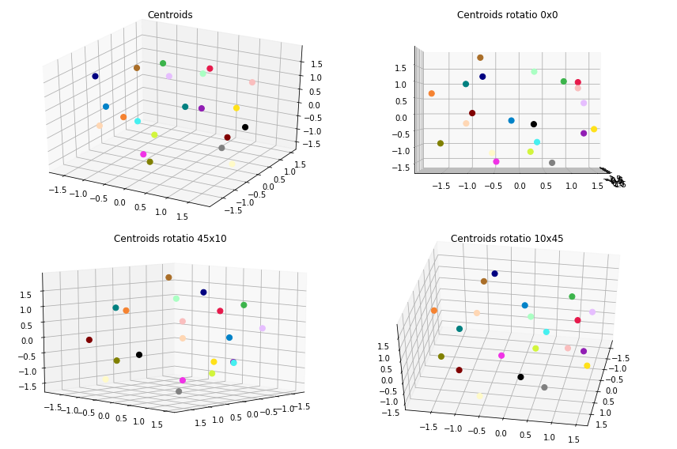
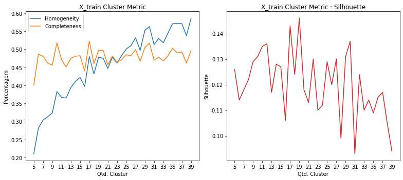
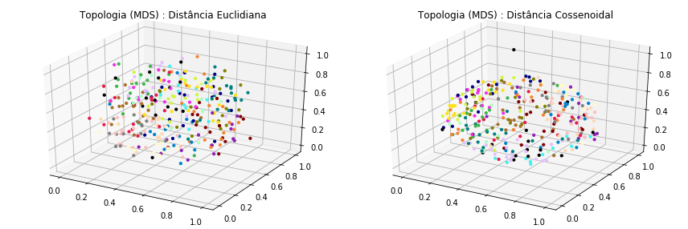
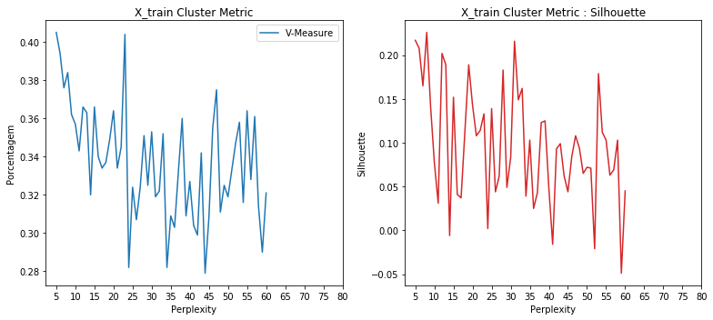
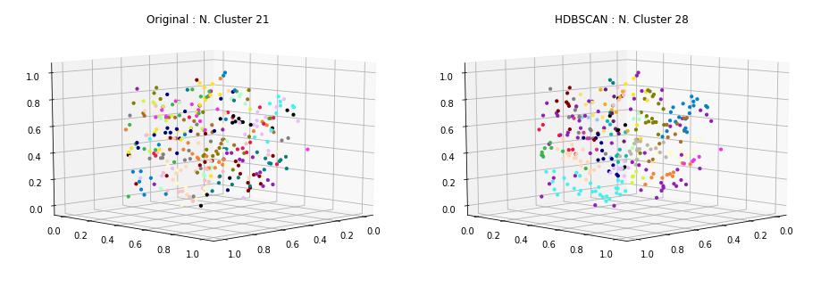
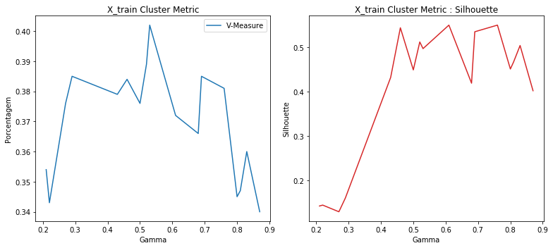
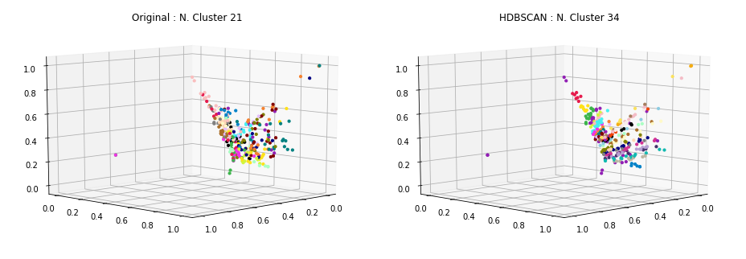
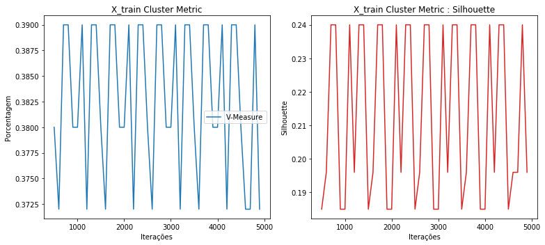
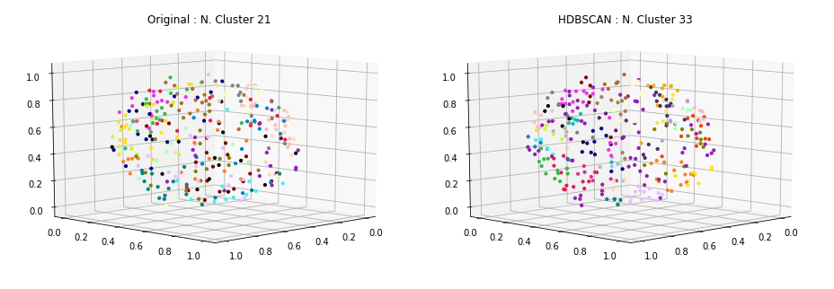

### Carregamento dos datasets

Os datasets de exemplos são frases já pré-categorizadas usadas em chatbots.

Contém 33 categorias e ao todo 696 documentos ou frases.

<table border="1" class="dataframe">
  <thead>
    <tr style="text-align: right;">
      <th></th>
      <th>perguntas</th>
      <th>cluster</th>
    </tr>
  </thead>
  <tbody>
    <tr>
      <th>41</th>
      <td>Se eu ativar roaming agora, já posso utilizar?</td>
      <td>ACTIVATE_ROAMING</td>
    </tr>
    <tr>
      <th>42</th>
      <td>Posso incluir roaming no meu plano por duas semanas?</td>
      <td>ACTIVATE_ROAMING</td>
    </tr>
    <tr>
      <th>110</th>
      <td>Eu gostaria de comprar um plano somente</td>
      <td>CHANGE_PRICE_PLAN</td>
    </tr>
    <tr>
      <th>153</th>
      <td>A desativação online está disponível para o meu telefone pré-pago?</td>
      <td>DEACTIVATE_PREPAID_PLAN</td>
    </tr>
    <tr>
      <th>170</th>
      <td>Como desativar a função roaming?</td>
      <td>DEACTIVATE_ROAMING</td>
    </tr>
    <tr>
      <th>198</th>
      <td>Quero informações sobre fazer ligações internacionais de casa</td>
      <td>INTERNATIONAL_RATE_PLAN_INQUIRY</td>
    </tr>
    <tr>
      <th>254</th>
      <td>Eu preciso do meu PUK para o meu celular, fiz uma tentativa on-line, mas a operadora não aceitou meu nome, data de nascimento e endereço de e-mail válidos.</td>
      <td>NETWORK_UNLOCK</td>
    </tr>
    <tr>
      <th>396</th>
      <td>Quem eu contato para mudar meu contrato do meu velho telefone para o meu novo telefone?</td>
      <td>SWAP_DEVICE</td>
    </tr>
    <tr>
      <th>406</th>
      <td>Meu roteador esta com uma luz vermelha</td>
      <td>TROUBLESHOOTING</td>
    </tr>
    <tr>
      <th>403</th>
      <td>Eu tenho um tablet novo que está reiniciando continuamente, como eu resolvo isso?/ como posso resolver isso? / como faço para resolver isso?</td>
      <td>TROUBLESHOOTING</td>
    </tr>
  </tbody>
</table>

    Qtde. de documentos por categoria:

<table border="1" class="dataframe">
  <thead>
    <tr style="text-align: right;">
      <th></th>
      <th>Categoria</th>
      <th>Qtde</th>
    </tr>
  </thead>
  <tbody>
    <tr>
      <th>0</th>
      <td>ACTIVATE_DEVICE</td>
      <td>19</td>
    </tr>
    <tr>
      <th>1</th>
      <td>ACTIVATE_PREPAID_PLAN</td>
      <td>21</td>
    </tr>
    <tr>
      <th>2</th>
      <td>ACTIVATE_ROAMING</td>
      <td>20</td>
    </tr>
    <tr>
      <th>3</th>
      <td>ADD_INSURANCE</td>
      <td>18</td>
    </tr>
    <tr>
      <th>4</th>
      <td>ADD_SERVICE_FEATURES</td>
      <td>20</td>
    </tr>
    <tr>
      <th>5</th>
      <td>CHANGE_PRICE_PLAN</td>
      <td>19</td>
    </tr>
    <tr>
      <th>6</th>
      <td>COVERAGE_AREA_INQUIRY</td>
      <td>19</td>
    </tr>
    <tr>
      <th>7</th>
      <td>DEACTIVATE_PREPAID_PLAN</td>
      <td>18</td>
    </tr>
    <tr>
      <th>8</th>
      <td>DEACTIVATE_ROAMING</td>
      <td>18</td>
    </tr>
    <tr>
      <th>9</th>
      <td>DEVICE_UPGRADE_ELIGIBILITY</td>
      <td>24</td>
    </tr>
    <tr>
      <th>10</th>
      <td>INTERNATIONAL_RATE_PLAN_INQUIRY</td>
      <td>21</td>
    </tr>
    <tr>
      <th>11</th>
      <td>NETWORK_COMPLAINTS</td>
      <td>23</td>
    </tr>
    <tr>
      <th>12</th>
      <td>NETWORK_UNLOCK</td>
      <td>21</td>
    </tr>
    <tr>
      <th>13</th>
      <td>PORT_IN</td>
      <td>21</td>
    </tr>
    <tr>
      <th>14</th>
      <td>PRICE_PLAN_INQUIRY</td>
      <td>23</td>
    </tr>
    <tr>
      <th>15</th>
      <td>RECHARGE_SIM</td>
      <td>18</td>
    </tr>
    <tr>
      <th>16</th>
      <td>REMOVE_SERVICE_FEATURES</td>
      <td>20</td>
    </tr>
    <tr>
      <th>17</th>
      <td>RETURN_DEVICE</td>
      <td>21</td>
    </tr>
    <tr>
      <th>18</th>
      <td>ROAMING_INQUIRY</td>
      <td>20</td>
    </tr>
    <tr>
      <th>19</th>
      <td>SWAP_DEVICE</td>
      <td>15</td>
    </tr>
    <tr>
      <th>20</th>
      <td>TROUBLESHOOTING</td>
      <td>19</td>
    </tr>
  </tbody>
</table>

    Total docs     : 418
    Total cluster  : 418
    X_train size   : (334,)
    X_test  size   : (84,)

### Dataset tokenization

    Tokenization...
    Qtd documentos treino:  334
    Qtd Intents treino   :  21
    Finished...

    [TaggedDocument(words=['trocar', 'um', 'planar', 'conversacao', 'direta', 'um', 'telefonar', 'operador', 'gratuitamente'], tags=[0]),
     TaggedDocument(words=['consultar', 'valorar', 'aplicar', 'ligacoes', 'internacional'], tags=[1]),
     TaggedDocument(words=['alterar', 'configuracao', 'roaming', 'celular', 'prepago', 'exterior'], tags=[2]),
     TaggedDocument(words=['oi', 'comprar', 'um', 'celular', 'gostar', 'trocar', 'contar', 'telefonar', 'velho', 'telefonar'], tags=[3]),
     TaggedDocument(words=['precisar', 'mudar', 'um', 'dispositivo', 'precisar', 'voce', 'ativar', 'desativar', 'atual'], tags=[4]),
     TaggedDocument(words=['detalhar', 'planar', 'preco', 'atual', 'cobrar'], tags=[5]),
     TaggedDocument(words=['precisar', 'informacao', 'cancelar', 'roaming'], tags=[6]),
     TaggedDocument(words=['mudar', 'empresar', 'querer', 'encontrar', 'um', 'planar', 'prepago', 'funcionar', 'mim', 'voce'], tags=[7]),
     TaggedDocument(words=['nao', 'receber', 'sinal', 'edificio'], tags=[8]),
     TaggedDocument(words=['poder', 'compartilhar', 'algum', 'informacao', 'cobertura', 'redar'], tags=[9])]

### **Doc2Vec**

Parâmetros iniciais... quantidade de dimensões dos vetores gerados para cada frase, épocas de treinamento e épocas de posterior inferência para novas frases.

A quantidade de épocas de inferência, sugere-se ser bem superior as de treinamento.

    Dimensions   : 500
    Epochs       : 200
    Infer Epochs : 15000

    Starting model...
    Building vocab...
    Training...
    Finish...

Validação do modelo gerado pelo Doc2Vec... teste tanto nos dados apresentados para treinamento quanto nos dados de testes e as acurácias alcançadas.

    - Acurácia treino: 100.0
     - Acurácia teste 1  : 36.9
     - Acurácia teste 2  : 35.71
     - Acurácia teste 3  : 34.52
     - Acurácia teste 4  : 35.71
     - Acurácia teste 5  : 38.1
    - Acurácia média teste: 36.19

### Clusterização

Utilizou-se o KMeans definindo a quantidade de clusters para o número ideal de categorias existentes no caso 33. A métrica de distância utilizada, não foi a euclidiana, mas sim a de cosseno (métrica comumente usada na classificação de texto em seu espaço vetorial).

    Frases por cluster:

<table border="1" class="dataframe">
  <thead>
    <tr style="text-align: right;">
      <th>title</th>
      <th>cluster</th>
    </tr>
  </thead>
  <tbody>
    <tr>
      <td>Qual é o procedimento para incluir um seguro para o meu telefone?</td>
      <td>0</td>
    </tr>
    <tr>
      <td>Olá eu acabei de atualizar o meu telefone e quero que minha filha use o meu antigo celular até ela poder atualizar.</td>
      <td>0</td>
    </tr>
    <tr>
      <td>Oi! Este telefone tem seguro? Posso fazer o seguro para este telefone eu mesmo?</td>
      <td>0</td>
    </tr>
    <tr>
      <td>Olá, quero saber se posso ficar com meu telefone se eu decidir mudar de provedor.</td>
      <td>1</td>
    </tr>
    <tr>
      <td>Posso levar meu telefone comigo se eu mudar para uma nova empresa.</td>
      <td>1</td>
    </tr>
    <tr>
      <td>Como mudar de telefone?</td>
      <td>1</td>
    </tr>
    <tr>
      <td>Quero meu desbloqueio no meu dispositivo atual</td>
      <td>2</td>
    </tr>
    <tr>
      <td>Quero desbloquear o meu novo telefone. Como faço isso?</td>
      <td>2</td>
    </tr>
    <tr>
      <td>Precio ir em uma loja fisica para fazer desbloqueio do meu aparelho celular?</td>
      <td>2</td>
    </tr>
    <tr>
      <td>Por favor, garanta-me que meu telefone funciona somente nos Estados Unidos.</td>
      <td>3</td>
    </tr>
    <tr>
      <td>Okey, mas vou viajar para Bolonha e quero ter certeza de que meu telefone vai funcionar.</td>
      <td>3</td>
    </tr>
    <tr>
      <td>Vou ter que pagar taxas de roaming quando usar o meu telefone no exterior?</td>
      <td>3</td>
    </tr>
    <tr>
      <td>As chamadas internacionais estão incluídas no meu plano?</td>
      <td>4</td>
    </tr>
    <tr>
      <td>Gostaria de alterar meu plano de preços. Você pode listar opções de planos de preços que têm conversas e textos ilimitados?</td>
      <td>4</td>
    </tr>
    <tr>
      <td>Eu quero fazer chamadas internacionais. Preciso de um plano para chamar um país europeu. Você pode me dar algumas tarifas?</td>
      <td>4</td>
    </tr>
    <tr>
      <td>Meu aparelho nao esta funcionando direito.</td>
      <td>5</td>
    </tr>
    <tr>
      <td>Em caso de sinistro em quanto tempo posso pegar outro aparelho?</td>
      <td>5</td>
    </tr>
    <tr>
      <td>O que eu preciso fazer para desbloquear meu novo aparelho?</td>
      <td>5</td>
    </tr>
    <tr>
      <td>Como posso cancelar minha linha de telefone pré-pago?</td>
      <td>6</td>
    </tr>
    <tr>
      <td>Quando é que o crédito expira para o meu serviço pré-pago?</td>
      <td>6</td>
    </tr>
    <tr>
      <td>Sim eu quero desativar o roaming no meu número de telefone</td>
      <td>6</td>
    </tr>
    <tr>
      <td>Posso ativar roaming diretamente no meu aparelho?</td>
      <td>7</td>
    </tr>
    <tr>
      <td>O serviço de roaming é ativado automaticamente ou eu preciso ativá-lo manualmente?</td>
      <td>7</td>
    </tr>
    <tr>
      <td>Eu não posso recarregar porque diz que meu sim está desativado , meu sim pode ser ativado?</td>
      <td>7</td>
    </tr>
    <tr>
      <td>Quais os meios de cancelamento do meu plano pré-pago?</td>
      <td>8</td>
    </tr>
    <tr>
      <td>Comprei outro SIM e quero ativar como pre-pago.</td>
      <td>8</td>
    </tr>
    <tr>
      <td>Qual é o custo do custo de usar o meu telefone pré-pago no exterior seria?</td>
      <td>8</td>
    </tr>
    <tr>
      <td>Oi! Recebi um telefonema no outro dia sobre meu contrato terminar e ofereceram-me um novo acordo. Eu entrei em uma loja e eles me falaram sobre um negócio melhor e eu gostaria de mudar de novo.</td>
      <td>9</td>
    </tr>
    <tr>
      <td>Eu fiz uma atualização e eu quero registrar um novo cartão SIM.</td>
      <td>9</td>
    </tr>
    <tr>
      <td>Qual é o processo para retornar o produto para uma loja?</td>
      <td>9</td>
    </tr>
    <tr>
      <td>Vocês oferecem seguros para celulares? Eu tenho uma conta comercial com vários dispositivos e gostaria de encontrar uma cobertura razoável.</td>
      <td>10</td>
    </tr>
    <tr>
      <td>Consulta sobre portabilidade</td>
      <td>10</td>
    </tr>
    <tr>
      <td>Bom dia, eu me pergunto se você gostaria de saber quais são as áreas de cobertura da companhia telefônica?</td>
      <td>10</td>
    </tr>
    <tr>
      <td>Se eu cancelar o roaming agora, demora muito pra concluir o pedido?</td>
      <td>11</td>
    </tr>
    <tr>
      <td>Eu gostaria de cancelar os correios de voz Visual no meu telefone</td>
      <td>11</td>
    </tr>
    <tr>
      <td>Essa não é a instrução que me deram. Me mandaram um novo chip e me mandaram transferir meu velho número da outra operadora</td>
      <td>11</td>
    </tr>
    <tr>
      <td>Quanto é o custo de um plano familiar de 3 linhas?</td>
      <td>12</td>
    </tr>
    <tr>
      <td>Adicionar uma quantidade de minutos ao meu pré-pago.</td>
      <td>12</td>
    </tr>
    <tr>
      <td>Quero adicionar minutos à minha subscrição.</td>
      <td>12</td>
    </tr>
    <tr>
      <td>Eu não recebo sinal quando estou no Edifício 32.</td>
      <td>13</td>
    </tr>
    <tr>
      <td>Há certas partes na minha cidade onde eu não tenho sinal. Pode me dizer qual poderia ser o motivo?</td>
      <td>13</td>
    </tr>
    <tr>
      <td>Oi, já que você está aqui, está havendo algum problema com a cobertura na área de SP? Desde ontem o meu sinal normal de 4 barras ficou em 0, está bem em outros lugares.</td>
      <td>13</td>
    </tr>
    <tr>
      <td>O meu telefone não recebe cobertura quando eu dirijo para a casa da minha mãe. Se eu lhe der o endereço dela, poderia me dizer o que posso fazer para melhorar minha recepção lá?</td>
      <td>14</td>
    </tr>
    <tr>
      <td>Existem áreas sem recepção das quais que eu deveria estar ciente?</td>
      <td>14</td>
    </tr>
    <tr>
      <td>Meu WiFi não é acessível em toda a minha casa. A casa é pequena e o alcance do dispositivo deveria ser suficiente.</td>
      <td>14</td>
    </tr>
    <tr>
      <td>Eu quero reconectar meu telefone, os dois telefones na conta na verdade</td>
      <td>15</td>
    </tr>
    <tr>
      <td>Eu quero adicionar mais dados na minha conta para os dias restantes, por favor</td>
      <td>15</td>
    </tr>
    <tr>
      <td>Eu não sou elegível para uma atualização gratuita, mas eu gostaria de comprar um novo celular. Por favor, me mostre o preço do mais moderno.</td>
      <td>15</td>
    </tr>
    <tr>
      <td>Eu solicitei uma troca de SIM, mas ainda não está completo, então não consigo fazer ou receber chamadas</td>
      <td>16</td>
    </tr>
    <tr>
      <td>Você pode por favor me informar o status do meu Serviço de Valor Agregado (VAS) - novo toque de chamadas? Eu tinha pedido isso ontem, eu ainda não o vejo ativado.</td>
      <td>16</td>
    </tr>
    <tr>
      <td>Meu telefone não faz nem recebe mais nenhuma chamada.</td>
      <td>16</td>
    </tr>
    <tr>
      <td>Cancelar o serviço de roaming</td>
      <td>17</td>
    </tr>
    <tr>
      <td>Eu tenho algumas perguntas sobre roaming.</td>
      <td>17</td>
    </tr>
    <tr>
      <td>Eu gostaria de cancelar o serviço de encaminhamento das minhas ligações. Como faço isso?</td>
      <td>17</td>
    </tr>
    <tr>
      <td>Eu gostaria de incluir SMS no meu telefone em serviços. Como faço isso?</td>
      <td>18</td>
    </tr>
    <tr>
      <td>Preciso remover o MMS no meu telefone.</td>
      <td>18</td>
    </tr>
    <tr>
      <td>Gostaria de falar com um representante de serviço ao cliente para saber sobre a adição de novos serviços ao meu plano.</td>
      <td>18</td>
    </tr>
    <tr>
      <td>Posso ativar meu novo telefone na loja local da minha cidade?</td>
      <td>19</td>
    </tr>
    <tr>
      <td>Qual o preço para ativar o roaming?</td>
      <td>19</td>
    </tr>
    <tr>
      <td>Gostaria que meu celular seja ativado hoje</td>
      <td>19</td>
    </tr>
    <tr>
      <td>Se eu recarregar R$ 50, o que eu ganho?</td>
      <td>20</td>
    </tr>
    <tr>
      <td>Como posso recarregar meu dispositivo quando estou na Áustria?</td>
      <td>20</td>
    </tr>
    <tr>
      <td>Eu preciso do meu PUK para o meu celular, fiz uma tentativa on-line, mas a operadora não aceitou meu nome, data de nascimento e endereço de e-mail válidos.</td>
      <td>20</td>
    </tr>
  </tbody>
</table>

    --------------------
    Documentos por cluster:

<table border="1" class="dataframe">
  <tbody>
    <tr>
      <td>C0</td>
      <td>21</td>
    </tr>
    <tr>
      <td>C1</td>
      <td>23</td>
    </tr>
    <tr>
      <td>C2</td>
      <td>14</td>
    </tr>
    <tr>
      <td>C3</td>
      <td>14</td>
    </tr>
    <tr>
      <td>C4</td>
      <td>27</td>
    </tr>
    <tr>
      <td>C5</td>
      <td>9</td>
    </tr>
    <tr>
      <td>C6</td>
      <td>20</td>
    </tr>
    <tr>
      <td>C7</td>
      <td>13</td>
    </tr>
    <tr>
      <td>C8</td>
      <td>15</td>
    </tr>
    <tr>
      <td>C9</td>
      <td>20</td>
    </tr>
    <tr>
      <td>C10</td>
      <td>17</td>
    </tr>
    <tr>
      <td>C11</td>
      <td>10</td>
    </tr>
    <tr>
      <td>C12</td>
      <td>19</td>
    </tr>
    <tr>
      <td>C13</td>
      <td>11</td>
    </tr>
    <tr>
      <td>C14</td>
      <td>14</td>
    </tr>
    <tr>
      <td>C15</td>
      <td>17</td>
    </tr>
    <tr>
      <td>C16</td>
      <td>20</td>
    </tr>
    <tr>
      <td>C17</td>
      <td>19</td>
    </tr>
    <tr>
      <td>C18</td>
      <td>16</td>
    </tr>
    <tr>
      <td>C19</td>
      <td>4</td>
    </tr>
    <tr>
      <td>C20</td>
      <td>11</td>
    </tr>
  </tbody>
</table>

### Visualização

Apresentação dos protótipos gerados pelo KMeans, reduzindo a dimensão usando o algoritmo MDS (Multidimensional Scaling).

### Clusterização dos dados de Teste

Por fim, realizada a clusterização dos dados de teste e a apresentação das 8 primeiras frases do conjunto de teste juntamente com outras duas frases do cluster ao qual foi identificado como o melhor.

    * Eu não quero mais usar meu telefone pré-pago atual.
      -  Eu não sou elegível para uma atualização gratuita, mas eu gostaria de comprar um novo celular. Por favor, me mostre o preço do mais moderno.
      -  Eu quero reconectar meu telefone, os dois telefones na conta na verdade
    --------------------
    * Isso vai funcionar em todos os lugares?
      -  Meu aparelho nao esta funcionando direito.
      -  Em caso de sinistro em quanto tempo posso pegar outro aparelho?
    --------------------
    * Verificar o status da devolução
      -  Cancelar o serviço de roaming
      -  Eu gostaria de cancelar o serviço de encaminhamento das minhas ligações. Como faço isso?
    --------------------
    * Meu telefone está velho. Posso pegar uma atualização gratuita.
      -  Olá, quero saber se posso ficar com meu telefone se eu decidir mudar de provedor.
      -  Como mudar de telefone?
    --------------------
    * O que vai custar menos ficar no meu plano atual ou mudar para o novo?
      -  Adicionar uma quantidade de minutos ao meu pré-pago.
      -  Quero adicionar minutos à minha subscrição.
    --------------------
    * Posso transferir meus dados quando troco telefones?
      -  Se eu cancelar o roaming agora, demora muito pra concluir o pedido?
      -  Essa não é a instrução que me deram. Me mandaram um novo chip e me mandaram transferir meu velho número da outra operadora
    --------------------
    * Você pode por favor me dizer se eu sou elegível para atualizar meu celular de graça? Caso contrário, em que data serei elegível para fazê-lo?
      -  Qual é o procedimento para incluir um seguro para o meu telefone?
      -  Oi! Este telefone tem seguro? Posso fazer o seguro para este telefone eu mesmo?
    --------------------
    * Eu pedi o plano errado. Você poderia mudar isso para o plano de R$ 50?
      -  Como mudar de telefone?
      -  Olá, quero saber se posso ficar com meu telefone se eu decidir mudar de provedor.
    --------------------

### Métricas

Abaixo são apresentadas métricas para demonstrar o quanto a clusterização parece funcionar.

    Homogeneidade    :  0.603
    Completude       :  0.612
    V-Measure        :  0.607
    Silhouette       :  -0.106

Como exemplo de comparação, foi executado o mesmo algoritmo de clusterização (conforme apresentado acima) entretanto variando a quantidade do número de clusters para verificar como as métricas se comportam.

### HDBSCAN no espaço dos dados

    Frases por cluster:

<table border="1" class="dataframe">
  <thead>
    <tr style="text-align: right;">
      <th>title</th>
      <th>cluster</th>
    </tr>
  </thead>
  <tbody>
    <tr>
      <td>Quais são os preços para os planos de dados e chamadas diferentes que você oferece?</td>
      <td>0</td>
    </tr>
    <tr>
      <td>Que planos estão disponíveis para chamada e dados Internacional?</td>
      <td>0</td>
    </tr>
    <tr>
      <td>Gostaria de alterar meu plano de preços. Você pode listar opções de planos de preços que têm conversas e textos ilimitados?</td>
      <td>0</td>
    </tr>
    <tr>
      <td>Baseado no uso histórico de voz e dados dos últimos 6 meses, qual plano que você sugere para mim… que seja economicamente viável?</td>
      <td>1</td>
    </tr>
    <tr>
      <td>Como trocar de plano, o plano ilimitado é muito caro</td>
      <td>1</td>
    </tr>
    <tr>
      <td>E se eu diminuir meu plano de dados para 5Gb e desejar alterá-lo de volta para 15GB minutos depois. Posso pegar meu plano atual de volta?</td>
      <td>1</td>
    </tr>
    <tr>
      <td>Qual é o mais recente plano 4G adequado para mim como um pacote família?</td>
      <td>2</td>
    </tr>
    <tr>
      <td>Você pode me dizer como posso adicionar minutos ao meu telefone pré-pago?</td>
      <td>2</td>
    </tr>
    <tr>
      <td>Gostaria de adicionar o MMS ao meu pacote.</td>
      <td>2</td>
    </tr>
    <tr>
      <td>As chamadas internacionais estão incluídas no meu plano?</td>
      <td>3</td>
    </tr>
    <tr>
      <td>Ei, posso incluir chamada internacional por favor</td>
      <td>3</td>
    </tr>
    <tr>
      <td>Posso incluir roaming no meu plano por duas semanas?</td>
      <td>3</td>
    </tr>
    <tr>
      <td>Eu tenho um cartão SIM no meu aparelho e eu gostaria de desbloqueá-lo.</td>
      <td>4</td>
    </tr>
    <tr>
      <td>Como posso desbloquear meu novo aparelho? Tenho que usar o mesmo cartão SIM do meu telefone antigo?</td>
      <td>4</td>
    </tr>
    <tr>
      <td>Como posso registrar um cartão SIM?</td>
      <td>4</td>
    </tr>
    <tr>
      <td>Oi, como posso saber se eu sou elegível para um upgrade para o meu dispositivo?</td>
      <td>5</td>
    </tr>
    <tr>
      <td>Quando dentro do contrato sou elegivel para atualizar meu atual aparelho?</td>
      <td>5</td>
    </tr>
    <tr>
      <td>Atualizar para um novo telefone</td>
      <td>5</td>
    </tr>
    <tr>
      <td>Quero saber se posso comprar o seguro de telefone.</td>
      <td>6</td>
    </tr>
    <tr>
      <td>Eu não tenho seguro para o meu telefone, como posso fazer/obter isso?</td>
      <td>6</td>
    </tr>
    <tr>
      <td>Eu gostaria de segurar meu telefone. Pode me ajudar com isso?</td>
      <td>6</td>
    </tr>
    <tr>
      <td>Você poderia me ajudar em como mudar o toque do meu telefone?</td>
      <td>7</td>
    </tr>
    <tr>
      <td>Eu quero obter o telefone preto em vez do telefone prateado que eu pedi</td>
      <td>7</td>
    </tr>
    <tr>
      <td>Qual é a política de devolução para esse telefone</td>
      <td>7</td>
    </tr>
    <tr>
      <td>Como posso cancelar minha linha de telefone pré-pago?</td>
      <td>8</td>
    </tr>
    <tr>
      <td>Como cancelo meu serviço de telefone pré-pago?</td>
      <td>8</td>
    </tr>
    <tr>
      <td>O que eu preciso fazer para que o serviço do telefone pré-pago seja desligado?</td>
      <td>8</td>
    </tr>
    <tr>
      <td>O meu telefone não recebe cobertura quando eu dirijo para a casa da minha mãe. Se eu lhe der o endereço dela, poderia me dizer o que posso fazer para melhorar minha recepção lá?</td>
      <td>9</td>
    </tr>
    <tr>
      <td>Existem áreas sem recepção das quais que eu deveria estar ciente?</td>
      <td>9</td>
    </tr>
    <tr>
      <td>Eu estive dirigido muito recentemente e foi praticamente impossível usar o serviço em algumas áreas. Você poderia me fornecer uma lista de locais / áreas com pouca ou nenhuma recepção?</td>
      <td>9</td>
    </tr>
    <tr>
      <td>Quando é o último dia que posso devolver meu telefone?</td>
      <td>10</td>
    </tr>
    <tr>
      <td>Como desligar meus dados automaticamente quando o WI-FI está disponível?</td>
      <td>10</td>
    </tr>
    <tr>
      <td>Por favor, garanta-me que meu telefone funciona somente nos Estados Unidos.</td>
      <td>10</td>
    </tr>
    <tr>
      <td>Quero poder encaminhar chamadas do meu telefone, como posso adicionar esse recurso ao meu plano atual?</td>
      <td>11</td>
    </tr>
    <tr>
      <td>Oi, eu estava esperando que você pudesse me dizer como adicionar o recurso de mensagens de texto ao meu plano?</td>
      <td>11</td>
    </tr>
    <tr>
      <td>Como remover recursos do plano do telefone sem fio em casa?</td>
      <td>11</td>
    </tr>
    <tr>
      <td>Eu não recebo sinal quando estou no Edifício 32.</td>
      <td>12</td>
    </tr>
    <tr>
      <td>Meu telefone não tem sinal no meu porão.</td>
      <td>12</td>
    </tr>
    <tr>
      <td>Oi, já que você está aqui, está havendo algum problema com a cobertura na área de SP? Desde ontem o meu sinal normal de 4 barras ficou em 0, está bem em outros lugares.</td>
      <td>12</td>
    </tr>
    <tr>
      <td>Quanto devo recarregar para chegar ao final do mês?</td>
      <td>13</td>
    </tr>
    <tr>
      <td>Se eu recarregar R$ 50, o que eu ganho?</td>
      <td>13</td>
    </tr>
    <tr>
      <td>Como posso recarregar meu dispositivo quando estou na Áustria?</td>
      <td>13</td>
    </tr>
    <tr>
      <td>Estou tendo um problema com o meu telefone. Não consigo fazer ou receber chamadas! Eu preciso de ajuda!</td>
      <td>14</td>
    </tr>
    <tr>
      <td>Eu solicitei uma troca de SIM, mas ainda não está completo, então não consigo fazer ou receber chamadas</td>
      <td>14</td>
    </tr>
    <tr>
      <td>Porque não é o meu novo telefone desbloqueado ainda?</td>
      <td>14</td>
    </tr>
    <tr>
      <td>Porque o meu dispositivo ainda está pendente para ativar</td>
      <td>15</td>
    </tr>
    <tr>
      <td>Eu vou à Florença neste fim de semana e quero ativar roaming.</td>
      <td>15</td>
    </tr>
    <tr>
      <td>Posso ativar roaming diretamente no meu aparelho?</td>
      <td>15</td>
    </tr>
    <tr>
      <td>O usuário deseja ativar o roaming internacional.</td>
      <td>16</td>
    </tr>
    <tr>
      <td>Como posso ativar o roaming internacional, por favor?</td>
      <td>16</td>
    </tr>
    <tr>
      <td>Eu gostaria de saber sobre os encargos de roaming internacional e como ativar isto.</td>
      <td>16</td>
    </tr>
  </tbody>
</table>

    --------------------
    Documentos por cluster:

<table border="1" class="dataframe">
  <tbody>
    <tr>
      <td>C0</td>
      <td>10</td>
    </tr>
    <tr>
      <td>C1</td>
      <td>5</td>
    </tr>
    <tr>
      <td>C2</td>
      <td>9</td>
    </tr>
    <tr>
      <td>C3</td>
      <td>5</td>
    </tr>
    <tr>
      <td>C4</td>
      <td>11</td>
    </tr>
    <tr>
      <td>C5</td>
      <td>7</td>
    </tr>
    <tr>
      <td>C6</td>
      <td>6</td>
    </tr>
    <tr>
      <td>C7</td>
      <td>12</td>
    </tr>
    <tr>
      <td>C8</td>
      <td>10</td>
    </tr>
    <tr>
      <td>C9</td>
      <td>6</td>
    </tr>
    <tr>
      <td>C10</td>
      <td>195</td>
    </tr>
    <tr>
      <td>C11</td>
      <td>12</td>
    </tr>
    <tr>
      <td>C12</td>
      <td>5</td>
    </tr>
    <tr>
      <td>C13</td>
      <td>5</td>
    </tr>
    <tr>
      <td>C14</td>
      <td>14</td>
    </tr>
    <tr>
      <td>C15</td>
      <td>17</td>
    </tr>
    <tr>
      <td>C16</td>
      <td>5</td>
    </tr>
  </tbody>
</table>

### Topologia dos dados de treinamento usando MDS

## **HDBSCAN**

 - [How HDBSCAN Works](https://nbviewer.jupyter.org/github/scikit-learn-contrib/hdbscan/blob/master/notebooks/How%20HDBSCAN%20Works.ipynb)
 - [hdbscan github implementation](https://github.com/scikit-learn-contrib/hdbscan)
 - [Density-Based Clustering Based on Hierarchical Density Estimates](https://link.springer.com/chapter/10.1007/978-3-642-37456-2_14)

---

## **t-SNE + HDBSCAN**

<table border="1" class="dataframe">
  <thead>
    <tr style="text-align: right;">
      <th></th>
      <th>Perplexity</th>
      <th>Learning Rate</th>
      <th>Angle</th>
      <th>V-Measure</th>
      <th>Silhouette</th>
    </tr>
  </thead>
  <tbody>
    <tr>
      <th>3</th>
      <td>8</td>
      <td>123</td>
      <td>0.85</td>
      <td>0.384</td>
      <td>0.226</td>
    </tr>
    <tr>
      <th>0</th>
      <td>5</td>
      <td>163</td>
      <td>0.79</td>
      <td>0.405</td>
      <td>0.217</td>
    </tr>
    <tr>
      <th>26</th>
      <td>31</td>
      <td>168</td>
      <td>0.76</td>
      <td>0.319</td>
      <td>0.216</td>
    </tr>
    <tr>
      <th>1</th>
      <td>6</td>
      <td>148</td>
      <td>0.88</td>
      <td>0.394</td>
      <td>0.208</td>
    </tr>
    <tr>
      <th>7</th>
      <td>12</td>
      <td>238</td>
      <td>0.89</td>
      <td>0.366</td>
      <td>0.202</td>
    </tr>
    <tr>
      <th>14</th>
      <td>19</td>
      <td>226</td>
      <td>0.87</td>
      <td>0.349</td>
      <td>0.189</td>
    </tr>
    <tr>
      <th>8</th>
      <td>13</td>
      <td>110</td>
      <td>0.85</td>
      <td>0.363</td>
      <td>0.189</td>
    </tr>
    <tr>
      <th>23</th>
      <td>28</td>
      <td>123</td>
      <td>0.85</td>
      <td>0.351</td>
      <td>0.183</td>
    </tr>
    <tr>
      <th>48</th>
      <td>53</td>
      <td>155</td>
      <td>0.90</td>
      <td>0.358</td>
      <td>0.179</td>
    </tr>
    <tr>
      <th>2</th>
      <td>7</td>
      <td>143</td>
      <td>0.89</td>
      <td>0.376</td>
      <td>0.165</td>
    </tr>
    <tr>
      <th>28</th>
      <td>33</td>
      <td>110</td>
      <td>0.85</td>
      <td>0.352</td>
      <td>0.162</td>
    </tr>
    <tr>
      <th>10</th>
      <td>15</td>
      <td>163</td>
      <td>0.79</td>
      <td>0.366</td>
      <td>0.152</td>
    </tr>
    <tr>
      <th>27</th>
      <td>32</td>
      <td>238</td>
      <td>0.89</td>
      <td>0.322</td>
      <td>0.149</td>
    </tr>
    <tr>
      <th>15</th>
      <td>20</td>
      <td>121</td>
      <td>0.88</td>
      <td>0.364</td>
      <td>0.143</td>
    </tr>
    <tr>
      <th>4</th>
      <td>9</td>
      <td>226</td>
      <td>0.87</td>
      <td>0.362</td>
      <td>0.142</td>
    </tr>
    <tr>
      <th>20</th>
      <td>25</td>
      <td>163</td>
      <td>0.79</td>
      <td>0.324</td>
      <td>0.139</td>
    </tr>
    <tr>
      <th>18</th>
      <td>23</td>
      <td>110</td>
      <td>0.85</td>
      <td>0.404</td>
      <td>0.133</td>
    </tr>
    <tr>
      <th>34</th>
      <td>39</td>
      <td>226</td>
      <td>0.87</td>
      <td>0.309</td>
      <td>0.125</td>
    </tr>
    <tr>
      <th>33</th>
      <td>38</td>
      <td>123</td>
      <td>0.85</td>
      <td>0.360</td>
      <td>0.123</td>
    </tr>
    <tr>
      <th>17</th>
      <td>22</td>
      <td>238</td>
      <td>0.89</td>
      <td>0.345</td>
      <td>0.114</td>
    </tr>
    <tr>
      <th>13</th>
      <td>18</td>
      <td>123</td>
      <td>0.85</td>
      <td>0.337</td>
      <td>0.113</td>
    </tr>
    <tr>
      <th>49</th>
      <td>54</td>
      <td>160</td>
      <td>0.82</td>
      <td>0.316</td>
      <td>0.112</td>
    </tr>
    <tr>
      <th>42</th>
      <td>47</td>
      <td>109</td>
      <td>0.90</td>
      <td>0.375</td>
      <td>0.108</td>
    </tr>
    <tr>
      <th>16</th>
      <td>21</td>
      <td>168</td>
      <td>0.76</td>
      <td>0.334</td>
      <td>0.108</td>
    </tr>
    <tr>
      <th>30</th>
      <td>35</td>
      <td>163</td>
      <td>0.79</td>
      <td>0.309</td>
      <td>0.103</td>
    </tr>
  </tbody>
</table>

    Homogeneidade    :  0.386
    Completude       :  0.381
    V-Measure        :  0.384
    Silhouette       :  0.226

    Frases por cluster:

<table border="1" class="dataframe">
  <thead>
    <tr style="text-align: right;">
      <th>title</th>
      <th>cluster</th>
    </tr>
  </thead>
  <tbody>
    <tr>
      <td>Por favor, você pode me ajudar a ativar o meu novo telefone pré-pago e fazê-lo funcionar corretamente.</td>
      <td>0</td>
    </tr>
    <tr>
      <td>Por favor, garanta-me que meu telefone funciona somente nos Estados Unidos.</td>
      <td>0</td>
    </tr>
    <tr>
      <td>Não consigo receber chamadas no meu telefone, mas posso fazer chamadas para qualquer pessoa em qualquer lugar.</td>
      <td>0</td>
    </tr>
    <tr>
      <td>Como posso parar de usar meu telefone enquanto estou viajando?</td>
      <td>1</td>
    </tr>
    <tr>
      <td>Posso incluir roaming no meu plano por duas semanas?</td>
      <td>1</td>
    </tr>
    <tr>
      <td>Estou viajando para o exterior e quero adicionar um plano de dados.</td>
      <td>1</td>
    </tr>
    <tr>
      <td>Eu estou com outra empresa agora, mas quero mudar para vocês. É possível manter meu número de telefone atual?</td>
      <td>2</td>
    </tr>
    <tr>
      <td>O usuário deseja ativar o roaming internacional.</td>
      <td>2</td>
    </tr>
    <tr>
      <td>Gostaria de verificar todas as taxas para cobertura internacional</td>
      <td>2</td>
    </tr>
    <tr>
      <td>Estou recebendo chamadas indesejadas de números desconhecidos, como posso ativar Não perturbe?</td>
      <td>3</td>
    </tr>
    <tr>
      <td>Por que a sinal da operadora em São Paulo está tão ruim?</td>
      <td>3</td>
    </tr>
    <tr>
      <td>Bom dia, eu me pergunto se você gostaria de saber quais são as áreas de cobertura da companhia telefônica?</td>
      <td>3</td>
    </tr>
    <tr>
      <td>Como podemos fazer uma mudança no plano de preços em nossos dispositivos?</td>
      <td>4</td>
    </tr>
    <tr>
      <td>Eu preciso de cerca de 100 GB de dados todos os meses e acima de 20 Mbps de velocidade, você pode sugerir alguns planos de dados que possam corresponder às minhas necessidades?</td>
      <td>4</td>
    </tr>
    <tr>
      <td>Vocês oferecem seguros para celulares? Eu tenho uma conta comercial com vários dispositivos e gostaria de encontrar uma cobertura razoável.</td>
      <td>4</td>
    </tr>
    <tr>
      <td>Posso levar meu telefone comigo se eu mudar para uma nova empresa.</td>
      <td>5</td>
    </tr>
    <tr>
      <td>Quero informações sobre como alterar meu plano para uma nova oferta</td>
      <td>5</td>
    </tr>
    <tr>
      <td>Eu vou à Florença neste fim de semana e quero ativar roaming.</td>
      <td>5</td>
    </tr>
    <tr>
      <td>Eu preciso de ajuda para manter o meu número antigo enquanto mudo de fornecedores.</td>
      <td>6</td>
    </tr>
    <tr>
      <td>Se eu mudar um proveder, o que acontecerá com o meu número atual?</td>
      <td>6</td>
    </tr>
    <tr>
      <td>Eu quero colocar tempo de conversação no meu telefone.</td>
      <td>6</td>
    </tr>
    <tr>
      <td>Quais são os custos de fazer ligações internacionais do meu país?</td>
      <td>7</td>
    </tr>
    <tr>
      <td>Como posso fazer uma ligação internacional do meu país de origem?</td>
      <td>7</td>
    </tr>
    <tr>
      <td>Quero informações sobre fazer ligações internacionais de casa</td>
      <td>7</td>
    </tr>
    <tr>
      <td>Será que meu telefone seja elegível para atualizar este ano em um preço com desconto?</td>
      <td>8</td>
    </tr>
    <tr>
      <td>Eu tenho um tablet novo que está reiniciando continuamente, como eu resolvo isso?/ como posso resolver isso? / como faço para resolver isso?</td>
      <td>8</td>
    </tr>
    <tr>
      <td>As chamadas internacionais estão incluídas no meu plano?</td>
      <td>8</td>
    </tr>
    <tr>
      <td>Quero ativar o meu novo aparelho telefonico por favor</td>
      <td>9</td>
    </tr>
    <tr>
      <td>Posso ativar roaming diretamente no meu aparelho?</td>
      <td>9</td>
    </tr>
    <tr>
      <td>Meu aparelho já vem com roaming de dados ativado?</td>
      <td>9</td>
    </tr>
    <tr>
      <td>Ligue a função de roaming internacional.</td>
      <td>10</td>
    </tr>
    <tr>
      <td>Como faço para ativar roaming para que eu possa usar dados quando estiver na Flórida?</td>
      <td>10</td>
    </tr>
    <tr>
      <td>Qual é o plano de dados que estou na ativa?</td>
      <td>10</td>
    </tr>
    <tr>
      <td>Quando minha conta vai ser elegível para um dispositivo atualizado</td>
      <td>11</td>
    </tr>
    <tr>
      <td>Eu vou sair de férias em breve. Eu preciso adicionar chamadas internacionais para o meu plano.</td>
      <td>11</td>
    </tr>
    <tr>
      <td>Quando dentro do contrato sou elegivel para atualizar meu atual aparelho?</td>
      <td>11</td>
    </tr>
    <tr>
      <td>Foi-me prometido uma cobertura total na minha cidade quando me inscrevi no ano passado. 12 meses depois, metade da minha cidade não tem conexão. Quando isso será consertado?</td>
      <td>12</td>
    </tr>
    <tr>
      <td>Meu telefone mostra barras de sinal, mas eu não posso fazer nenhuma ligação.</td>
      <td>12</td>
    </tr>
    <tr>
      <td>Quanto tempo vai demorar para o meu telefone ativar?</td>
      <td>12</td>
    </tr>
    <tr>
      <td>Onde consulto os valores aplicados para ligacoes internacionais?</td>
      <td>13</td>
    </tr>
    <tr>
      <td>A portabilidade possui alguma cobranca?</td>
      <td>13</td>
    </tr>
    <tr>
      <td>Desde que não uso meus dados muito, posso mudar para um de plano apenas 1 GB de dados.</td>
      <td>13</td>
    </tr>
    <tr>
      <td>Preciso de informações em como cancelar o roaming</td>
      <td>14</td>
    </tr>
    <tr>
      <td>Gostaria de cancelar minha cobertura de roaming e tethering.</td>
      <td>14</td>
    </tr>
    <tr>
      <td>Você pode por favor me dizer como posso adicionar roaming ao meu plano atual?</td>
      <td>14</td>
    </tr>
    <tr>
      <td>Olá, eu tenho um novo dispositivo, e um cartão SIM de vocês com contrato mensal que obtive em uma loja, e já passaram 24 horas e o SIM ainda não está funcionando, e a loka está dizendo que tudo está ativado da parte deles</td>
      <td>15</td>
    </tr>
    <tr>
      <td>Meu dispositivo parou de funcionar. Posso devolver e obter um novo dispositivo?</td>
      <td>15</td>
    </tr>
    <tr>
      <td>Em caso de sinistro em quanto tempo posso pegar outro aparelho?</td>
      <td>15</td>
    </tr>
    <tr>
      <td>Quanto custaria adicionar dados ilimitados ao meu plano atual?</td>
      <td>16</td>
    </tr>
    <tr>
      <td>Meu wifi está lento e caindo o tempo todo</td>
      <td>16</td>
    </tr>
    <tr>
      <td>Oi! Este telefone tem seguro? Posso fazer o seguro para este telefone eu mesmo?</td>
      <td>16</td>
    </tr>
    <tr>
      <td>Eu acabei de gastar R$ 800 neste celular novo - como faço para ter certeza de que não tenho que pagar para consertar isso mais tarde?</td>
      <td>17</td>
    </tr>
    <tr>
      <td>Eu pedi para manter meu número antigo enviado isso on-line na noite de sexta-feira, logo após a meia-noite ainda meu número não foi transferido</td>
      <td>17</td>
    </tr>
    <tr>
      <td>Preciso saber como devolver meu celular</td>
      <td>17</td>
    </tr>
    <tr>
      <td>Me ajude com a inclusão de minutos no pré-pago.</td>
      <td>18</td>
    </tr>
    <tr>
      <td>Você pode me dizer como posso adicionar minutos ao meu telefone pré-pago?</td>
      <td>18</td>
    </tr>
    <tr>
      <td>Como faço para transferir o serviço de um dispositivo antigo para um novo?</td>
      <td>18</td>
    </tr>
    <tr>
      <td>Meu telefone pode rastrear quando uso internet no exterior?</td>
      <td>19</td>
    </tr>
    <tr>
      <td>Como posso começar a usar o meu telefone no exterior?</td>
      <td>19</td>
    </tr>
    <tr>
      <td>Quero cancelar o pagamento do meu telefone pré-pago.</td>
      <td>19</td>
    </tr>
    <tr>
      <td>Como posso ativar o roaming internacional, por favor?</td>
      <td>20</td>
    </tr>
    <tr>
      <td>O que eu preciso fazer para desbloquear meu novo aparelho?</td>
      <td>20</td>
    </tr>
    <tr>
      <td>Adicionar uma quantidade de minutos ao meu pré-pago.</td>
      <td>20</td>
    </tr>
    <tr>
      <td>Quero desbloquear o meu novo telefone. Como faço isso?</td>
      <td>21</td>
    </tr>
    <tr>
      <td>Ajuda com a desativação de roaming</td>
      <td>21</td>
    </tr>
    <tr>
      <td>Porque não é o meu novo telefone desbloqueado ainda?</td>
      <td>21</td>
    </tr>
    <tr>
      <td>O cliente deseja ter o seu serviço desbloqueado</td>
      <td>22</td>
    </tr>
    <tr>
      <td>Estou bastante cansado do meu telefone existente e gostaria de saber quando eu vou ser elegível para sua atualização?</td>
      <td>22</td>
    </tr>
    <tr>
      <td>O servico de roaming é cobrado na fatura, em real?</td>
      <td>22</td>
    </tr>
    <tr>
      <td>Eu gostaria de saber se seria possível para mim usar meu novo dispositivo pré-pago, enquanto na França ou não.</td>
      <td>23</td>
    </tr>
    <tr>
      <td>Favor realizar a ativação do meu SIM card</td>
      <td>23</td>
    </tr>
    <tr>
      <td>Estou tentando ativar o meu novo telefone com o serviço pré-pago.</td>
      <td>23</td>
    </tr>
    <tr>
      <td>Quero meu desbloqueio no meu dispositivo atual</td>
      <td>24</td>
    </tr>
    <tr>
      <td>Posso remover um novo recurso no meu plano?</td>
      <td>24</td>
    </tr>
    <tr>
      <td>Como você desbloqueia o seu novo aparelho? Você usa o mesmo SIM que no seu aparelho anterior?</td>
      <td>24</td>
    </tr>
    <tr>
      <td>Posso incluir mensagens de vídeo como um recurso de serviço novo no meu telefone?</td>
      <td>25</td>
    </tr>
    <tr>
      <td>Oi Tom, como posso transferir meu número de telefone da antiga operadora para a minha nova linha com vocês?</td>
      <td>25</td>
    </tr>
    <tr>
      <td>Você pode me dizer como posso retornar meu telefone atual para uma atualização?</td>
      <td>25</td>
    </tr>
    <tr>
      <td>Desativar meu dispositivo quando no exterior</td>
      <td>26</td>
    </tr>
    <tr>
      <td>As tarifas internacionais são calculadas por minutos ou por chamadas individuais?</td>
      <td>26</td>
    </tr>
    <tr>
      <td>Recebi o dispositivo pré-pago e quero saber como ativar</td>
      <td>26</td>
    </tr>
    <tr>
      <td>Quanto é o custo de um plano familiar de 3 linhas?</td>
      <td>27</td>
    </tr>
    <tr>
      <td>Onde eu ativo o meu dispositivo pré-pago?</td>
      <td>27</td>
    </tr>
    <tr>
      <td>Porque o meu dispositivo ainda está pendente para ativar</td>
      <td>27</td>
    </tr>
  </tbody>
</table>

    --------------------
    Documentos por cluster:

<table border="1" class="dataframe">
  <tbody>
    <tr>
      <td>C0</td>
      <td>6</td>
    </tr>
    <tr>
      <td>C1</td>
      <td>9</td>
    </tr>
    <tr>
      <td>C2</td>
      <td>7</td>
    </tr>
    <tr>
      <td>C3</td>
      <td>20</td>
    </tr>
    <tr>
      <td>C4</td>
      <td>10</td>
    </tr>
    <tr>
      <td>C5</td>
      <td>56</td>
    </tr>
    <tr>
      <td>C6</td>
      <td>28</td>
    </tr>
    <tr>
      <td>C7</td>
      <td>5</td>
    </tr>
    <tr>
      <td>C8</td>
      <td>5</td>
    </tr>
    <tr>
      <td>C9</td>
      <td>5</td>
    </tr>
    <tr>
      <td>C10</td>
      <td>5</td>
    </tr>
    <tr>
      <td>C11</td>
      <td>8</td>
    </tr>
    <tr>
      <td>C12</td>
      <td>11</td>
    </tr>
    <tr>
      <td>C13</td>
      <td>11</td>
    </tr>
    <tr>
      <td>C14</td>
      <td>10</td>
    </tr>
    <tr>
      <td>C15</td>
      <td>7</td>
    </tr>
    <tr>
      <td>C16</td>
      <td>20</td>
    </tr>
    <tr>
      <td>C17</td>
      <td>19</td>
    </tr>
    <tr>
      <td>C18</td>
      <td>12</td>
    </tr>
    <tr>
      <td>C19</td>
      <td>12</td>
    </tr>
    <tr>
      <td>C20</td>
      <td>6</td>
    </tr>
    <tr>
      <td>C21</td>
      <td>5</td>
    </tr>
    <tr>
      <td>C22</td>
      <td>5</td>
    </tr>
    <tr>
      <td>C23</td>
      <td>6</td>
    </tr>
    <tr>
      <td>C24</td>
      <td>11</td>
    </tr>
    <tr>
      <td>C25</td>
      <td>20</td>
    </tr>
    <tr>
      <td>C26</td>
      <td>7</td>
    </tr>
    <tr>
      <td>C27</td>
      <td>8</td>
    </tr>
  </tbody>
</table>

---

## **Spectral Embedding + HDBSCAN**

<table border="1" class="dataframe">
  <thead>
    <tr style="text-align: right;">
      <th></th>
      <th>Gamma</th>
      <th>V-Measure</th>
      <th>Silhouette</th>
    </tr>
  </thead>
  <tbody>
    <tr>
      <th>15</th>
      <td>0.61</td>
      <td>0.372</td>
      <td>0.550</td>
    </tr>
    <tr>
      <th>2</th>
      <td>0.76</td>
      <td>0.381</td>
      <td>0.550</td>
    </tr>
    <tr>
      <th>13</th>
      <td>0.76</td>
      <td>0.381</td>
      <td>0.550</td>
    </tr>
    <tr>
      <th>3</th>
      <td>0.46</td>
      <td>0.384</td>
      <td>0.544</td>
    </tr>
    <tr>
      <th>4</th>
      <td>0.69</td>
      <td>0.385</td>
      <td>0.535</td>
    </tr>
    <tr>
      <th>6</th>
      <td>0.52</td>
      <td>0.389</td>
      <td>0.512</td>
    </tr>
    <tr>
      <th>0</th>
      <td>0.83</td>
      <td>0.360</td>
      <td>0.504</td>
    </tr>
    <tr>
      <th>12</th>
      <td>0.83</td>
      <td>0.360</td>
      <td>0.504</td>
    </tr>
    <tr>
      <th>8</th>
      <td>0.53</td>
      <td>0.402</td>
      <td>0.497</td>
    </tr>
    <tr>
      <th>17</th>
      <td>0.81</td>
      <td>0.347</td>
      <td>0.467</td>
    </tr>
    <tr>
      <th>10</th>
      <td>0.80</td>
      <td>0.345</td>
      <td>0.451</td>
    </tr>
    <tr>
      <th>16</th>
      <td>0.50</td>
      <td>0.376</td>
      <td>0.449</td>
    </tr>
    <tr>
      <th>18</th>
      <td>0.43</td>
      <td>0.379</td>
      <td>0.432</td>
    </tr>
    <tr>
      <th>1</th>
      <td>0.43</td>
      <td>0.379</td>
      <td>0.432</td>
    </tr>
    <tr>
      <th>7</th>
      <td>0.68</td>
      <td>0.366</td>
      <td>0.419</td>
    </tr>
    <tr>
      <th>14</th>
      <td>0.87</td>
      <td>0.340</td>
      <td>0.402</td>
    </tr>
    <tr>
      <th>19</th>
      <td>0.29</td>
      <td>0.385</td>
      <td>0.160</td>
    </tr>
    <tr>
      <th>9</th>
      <td>0.22</td>
      <td>0.343</td>
      <td>0.144</td>
    </tr>
    <tr>
      <th>11</th>
      <td>0.21</td>
      <td>0.354</td>
      <td>0.142</td>
    </tr>
    <tr>
      <th>5</th>
      <td>0.27</td>
      <td>0.376</td>
      <td>0.129</td>
    </tr>
  </tbody>
</table>

    Homogeneidade    :  0.394
    Completude       :  0.353
    V-Measure        :  0.372
    Silhouette       :  0.55

---

## **MDS + HDBSCAN**

<table border="1" class="dataframe">
  <thead>
    <tr style="text-align: right;">
      <th></th>
      <th>Iterações</th>
      <th>N_Init</th>
      <th>V-Measure</th>
      <th>Silhouette</th>
    </tr>
  </thead>
  <tbody>
    <tr>
      <th>22</th>
      <td>2700</td>
      <td>33</td>
      <td>0.390</td>
      <td>0.240</td>
    </tr>
    <tr>
      <th>12</th>
      <td>1700</td>
      <td>33</td>
      <td>0.390</td>
      <td>0.240</td>
    </tr>
    <tr>
      <th>28</th>
      <td>3300</td>
      <td>21</td>
      <td>0.390</td>
      <td>0.240</td>
    </tr>
    <tr>
      <th>23</th>
      <td>2800</td>
      <td>30</td>
      <td>0.390</td>
      <td>0.240</td>
    </tr>
    <tr>
      <th>29</th>
      <td>3400</td>
      <td>19</td>
      <td>0.390</td>
      <td>0.240</td>
    </tr>
    <tr>
      <th>32</th>
      <td>3700</td>
      <td>33</td>
      <td>0.390</td>
      <td>0.240</td>
    </tr>
    <tr>
      <th>19</th>
      <td>2400</td>
      <td>19</td>
      <td>0.390</td>
      <td>0.240</td>
    </tr>
    <tr>
      <th>18</th>
      <td>2300</td>
      <td>21</td>
      <td>0.390</td>
      <td>0.240</td>
    </tr>
    <tr>
      <th>33</th>
      <td>3800</td>
      <td>30</td>
      <td>0.390</td>
      <td>0.240</td>
    </tr>
    <tr>
      <th>16</th>
      <td>2100</td>
      <td>26</td>
      <td>0.390</td>
      <td>0.240</td>
    </tr>
    <tr>
      <th>36</th>
      <td>4100</td>
      <td>26</td>
      <td>0.390</td>
      <td>0.240</td>
    </tr>
    <tr>
      <th>26</th>
      <td>3100</td>
      <td>26</td>
      <td>0.390</td>
      <td>0.240</td>
    </tr>
    <tr>
      <th>13</th>
      <td>1800</td>
      <td>30</td>
      <td>0.390</td>
      <td>0.240</td>
    </tr>
    <tr>
      <th>38</th>
      <td>4300</td>
      <td>21</td>
      <td>0.390</td>
      <td>0.240</td>
    </tr>
    <tr>
      <th>39</th>
      <td>4400</td>
      <td>19</td>
      <td>0.390</td>
      <td>0.240</td>
    </tr>
    <tr>
      <th>9</th>
      <td>1400</td>
      <td>19</td>
      <td>0.390</td>
      <td>0.240</td>
    </tr>
    <tr>
      <th>8</th>
      <td>1300</td>
      <td>21</td>
      <td>0.390</td>
      <td>0.240</td>
    </tr>
    <tr>
      <th>6</th>
      <td>1100</td>
      <td>26</td>
      <td>0.390</td>
      <td>0.240</td>
    </tr>
    <tr>
      <th>43</th>
      <td>4800</td>
      <td>22</td>
      <td>0.390</td>
      <td>0.240</td>
    </tr>
    <tr>
      <th>3</th>
      <td>800</td>
      <td>30</td>
      <td>0.390</td>
      <td>0.240</td>
    </tr>
    <tr>
      <th>2</th>
      <td>700</td>
      <td>33</td>
      <td>0.390</td>
      <td>0.240</td>
    </tr>
    <tr>
      <th>37</th>
      <td>4200</td>
      <td>46</td>
      <td>0.372</td>
      <td>0.196</td>
    </tr>
    <tr>
      <th>41</th>
      <td>4600</td>
      <td>38</td>
      <td>0.372</td>
      <td>0.196</td>
    </tr>
    <tr>
      <th>42</th>
      <td>4700</td>
      <td>46</td>
      <td>0.372</td>
      <td>0.196</td>
    </tr>
    <tr>
      <th>31</th>
      <td>3600</td>
      <td>43</td>
      <td>0.372</td>
      <td>0.196</td>
    </tr>
  </tbody>
</table>

    Homogeneidade    :  0.404
    Completude       :  0.377
    V-Measure        :  0.39
    Silhouette       :  0.24

