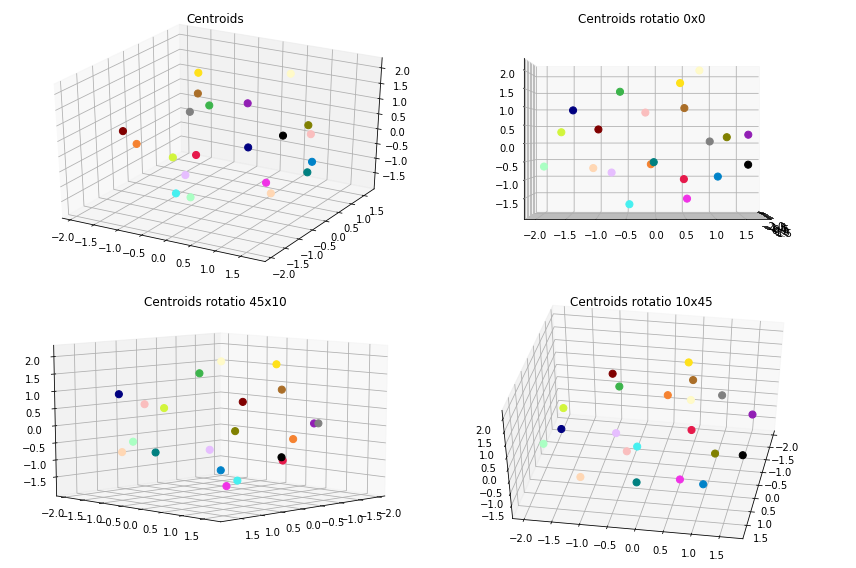
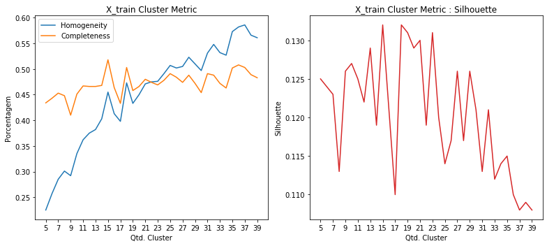
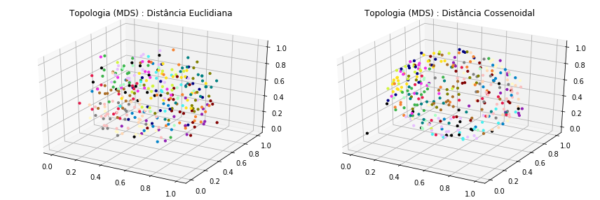
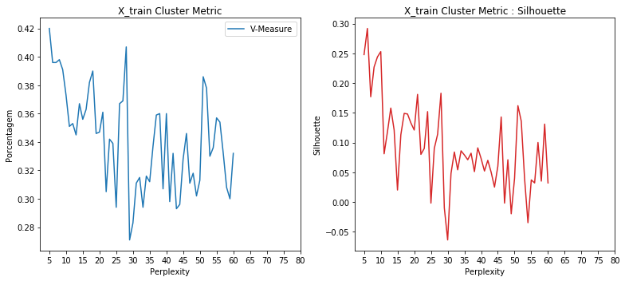
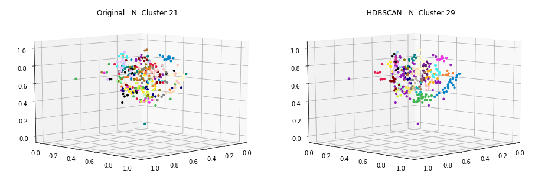
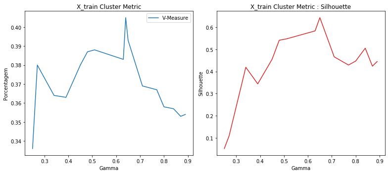
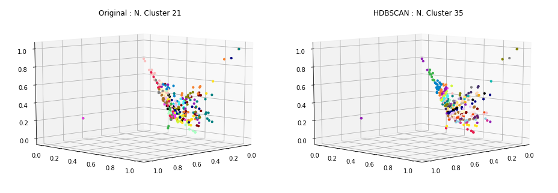
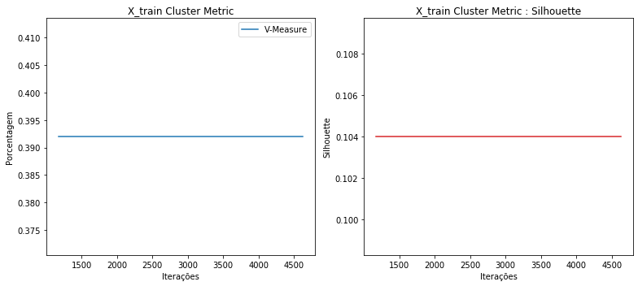
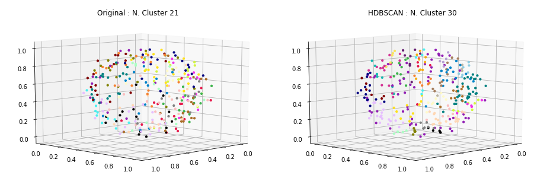

### Carregamento dos datasets

Os datasets de exemplos são frases já pré-categorizadas usadas em chatbots.

Contém 33 categorias e ao todo 696 documentos ou frases.

<table border="1" class="dataframe">
  <thead>
    <tr style="text-align: right;">
      <th></th>
      <th>perguntas</th>
      <th>cluster</th>
    </tr>
  </thead>
  <tbody>
    <tr>
      <th>41</th>
      <td>Se eu ativar roaming agora, já posso utilizar?</td>
      <td>ACTIVATE_ROAMING</td>
    </tr>
    <tr>
      <th>42</th>
      <td>Posso incluir roaming no meu plano por duas semanas?</td>
      <td>ACTIVATE_ROAMING</td>
    </tr>
    <tr>
      <th>110</th>
      <td>Eu gostaria de comprar um plano somente</td>
      <td>CHANGE_PRICE_PLAN</td>
    </tr>
    <tr>
      <th>153</th>
      <td>A desativação online está disponível para o meu telefone pré-pago?</td>
      <td>DEACTIVATE_PREPAID_PLAN</td>
    </tr>
    <tr>
      <th>170</th>
      <td>Como desativar a função roaming?</td>
      <td>DEACTIVATE_ROAMING</td>
    </tr>
    <tr>
      <th>198</th>
      <td>Quero informações sobre fazer ligações internacionais de casa</td>
      <td>INTERNATIONAL_RATE_PLAN_INQUIRY</td>
    </tr>
    <tr>
      <th>254</th>
      <td>Eu preciso do meu PUK para o meu celular, fiz uma tentativa on-line, mas a operadora não aceitou meu nome, data de nascimento e endereço de e-mail válidos.</td>
      <td>NETWORK_UNLOCK</td>
    </tr>
    <tr>
      <th>396</th>
      <td>Quem eu contato para mudar meu contrato do meu velho telefone para o meu novo telefone?</td>
      <td>SWAP_DEVICE</td>
    </tr>
    <tr>
      <th>406</th>
      <td>Meu roteador esta com uma luz vermelha</td>
      <td>TROUBLESHOOTING</td>
    </tr>
    <tr>
      <th>403</th>
      <td>Eu tenho um tablet novo que está reiniciando continuamente, como eu resolvo isso?/ como posso resolver isso? / como faço para resolver isso?</td>
      <td>TROUBLESHOOTING</td>
    </tr>
  </tbody>
</table>

    Qtde. de documentos por categoria:

<table border="1" class="dataframe">
  <thead>
    <tr style="text-align: right;">
      <th></th>
      <th>Categoria</th>
      <th>Qtde</th>
    </tr>
  </thead>
  <tbody>
    <tr>
      <th>0</th>
      <td>ACTIVATE_DEVICE</td>
      <td>19</td>
    </tr>
    <tr>
      <th>1</th>
      <td>ACTIVATE_PREPAID_PLAN</td>
      <td>21</td>
    </tr>
    <tr>
      <th>2</th>
      <td>ACTIVATE_ROAMING</td>
      <td>20</td>
    </tr>
    <tr>
      <th>3</th>
      <td>ADD_INSURANCE</td>
      <td>18</td>
    </tr>
    <tr>
      <th>4</th>
      <td>ADD_SERVICE_FEATURES</td>
      <td>20</td>
    </tr>
    <tr>
      <th>5</th>
      <td>CHANGE_PRICE_PLAN</td>
      <td>19</td>
    </tr>
    <tr>
      <th>6</th>
      <td>COVERAGE_AREA_INQUIRY</td>
      <td>19</td>
    </tr>
    <tr>
      <th>7</th>
      <td>DEACTIVATE_PREPAID_PLAN</td>
      <td>18</td>
    </tr>
    <tr>
      <th>8</th>
      <td>DEACTIVATE_ROAMING</td>
      <td>18</td>
    </tr>
    <tr>
      <th>9</th>
      <td>DEVICE_UPGRADE_ELIGIBILITY</td>
      <td>24</td>
    </tr>
    <tr>
      <th>10</th>
      <td>INTERNATIONAL_RATE_PLAN_INQUIRY</td>
      <td>21</td>
    </tr>
    <tr>
      <th>11</th>
      <td>NETWORK_COMPLAINTS</td>
      <td>23</td>
    </tr>
    <tr>
      <th>12</th>
      <td>NETWORK_UNLOCK</td>
      <td>21</td>
    </tr>
    <tr>
      <th>13</th>
      <td>PORT_IN</td>
      <td>21</td>
    </tr>
    <tr>
      <th>14</th>
      <td>PRICE_PLAN_INQUIRY</td>
      <td>23</td>
    </tr>
    <tr>
      <th>15</th>
      <td>RECHARGE_SIM</td>
      <td>18</td>
    </tr>
    <tr>
      <th>16</th>
      <td>REMOVE_SERVICE_FEATURES</td>
      <td>20</td>
    </tr>
    <tr>
      <th>17</th>
      <td>RETURN_DEVICE</td>
      <td>21</td>
    </tr>
    <tr>
      <th>18</th>
      <td>ROAMING_INQUIRY</td>
      <td>20</td>
    </tr>
    <tr>
      <th>19</th>
      <td>SWAP_DEVICE</td>
      <td>15</td>
    </tr>
    <tr>
      <th>20</th>
      <td>TROUBLESHOOTING</td>
      <td>19</td>
    </tr>
  </tbody>
</table>

    Total docs     : 418
    Total cluster  : 418
    X_train size   : (334,)
    X_test  size   : (84,)

### Dataset tokenization

    Tokenization...
    Qtd documentos treino:  334
    Qtd Intents treino   :  21
    Finished...

    [TaggedDocument(words=['trocar', 'um', 'planar', 'conversacao', 'direta', 'um', 'telefonar', 'operador', 'gratuitamente'], tags=[0]),
     TaggedDocument(words=['consultar', 'valorar', 'aplicar', 'ligacoes', 'internacional'], tags=[1]),
     TaggedDocument(words=['alterar', 'configuracao', 'roaming', 'celular', 'prepago', 'exterior'], tags=[2]),
     TaggedDocument(words=['oi', 'comprar', 'um', 'celular', 'gostar', 'trocar', 'contar', 'telefonar', 'velho', 'telefonar'], tags=[3]),
     TaggedDocument(words=['precisar', 'mudar', 'um', 'dispositivo', 'precisar', 'voce', 'ativar', 'desativar', 'atual'], tags=[4]),
     TaggedDocument(words=['detalhar', 'planar', 'preco', 'atual', 'cobrar'], tags=[5]),
     TaggedDocument(words=['precisar', 'informacao', 'cancelar', 'roaming'], tags=[6]),
     TaggedDocument(words=['mudar', 'empresar', 'querer', 'encontrar', 'um', 'planar', 'prepago', 'funcionar', 'mim', 'voce'], tags=[7]),
     TaggedDocument(words=['nao', 'receber', 'sinal', 'edificio'], tags=[8]),
     TaggedDocument(words=['poder', 'compartilhar', 'algum', 'informacao', 'cobertura', 'redar'], tags=[9])]

### **Doc2Vec**

Parâmetros iniciais... quantidade de dimensões dos vetores gerados para cada frase, épocas de treinamento e épocas de posterior inferência para novas frases.

A quantidade de épocas de inferência, sugere-se ser bem superior as de treinamento.

    Dimensions   : 1000
    Epochs       : 200
    Infer Epochs : 15000

    Starting model...
    Building vocab...
    Training...
    Finish...

Validação do modelo gerado pelo Doc2Vec... teste tanto nos dados apresentados para treinamento quanto nos dados de testes e as acurácias alcançadas.

### Acurácia distância cossenoidal

    - Acurácia treino: 100.0
     - Acurácia teste 1  : 39.29
     - Acurácia teste 2  : 36.9
     - Acurácia teste 3  : 35.71
     - Acurácia teste 4  : 38.1
     - Acurácia teste 5  : 36.9
    - Acurácia média teste: 37.38

### Acurácia distância euclidiana

    - Acurácia treino: 99.0
     - Acurácia teste 1  : 34.52
     - Acurácia teste 2  : 34.52
     - Acurácia teste 3  : 34.52
     - Acurácia teste 4  : 34.52
     - Acurácia teste 5  : 34.52
    - Acurácia média teste: 34.52

### Clusterização

Utilizou-se o KMeans definindo a quantidade de clusters para o número ideal de categorias existentes no caso 33. A métrica de distância utilizada, não foi a euclidiana, mas sim a de cosseno (métrica comumente usada na classificação de texto em seu espaço vetorial).

    Frases por cluster:

<table border="1" class="dataframe">
  <thead>
    <tr style="text-align: right;">
      <th>title</th>
      <th>cluster</th>
    </tr>
  </thead>
  <tbody>
    <tr>
      <td>Você poderia me ajudar em como mudar o toque do meu telefone?</td>
      <td>0</td>
    </tr>
    <tr>
      <td>Como faço para transferir o serviço de um dispositivo antigo para um novo?</td>
      <td>0</td>
    </tr>
    <tr>
      <td>Indique quanto tempo eu aguardo para mudar meu telefone para um modelo mais novo</td>
      <td>0</td>
    </tr>
    <tr>
      <td>A portabilidade possui alguma cobranca?</td>
      <td>1</td>
    </tr>
    <tr>
      <td>Além do fornecimento de água vocês oferecem algum outro serviço?</td>
      <td>1</td>
    </tr>
    <tr>
      <td>Quais servicos posso remover diretamente pelo meu aparelho?</td>
      <td>1</td>
    </tr>
    <tr>
      <td>Oi. Tenho um sinal forte, mas não consigo fazer ou receber chamadas. Você pode me ajudar a ver como resolver esse problema?</td>
      <td>2</td>
    </tr>
    <tr>
      <td>Oi, já que você está aqui, está havendo algum problema com a cobertura na área de SP? Desde ontem o meu sinal normal de 4 barras ficou em 0, está bem em outros lugares.</td>
      <td>2</td>
    </tr>
    <tr>
      <td>Vou ficar sem sinal durante a troca para o plano pré-pago?</td>
      <td>2</td>
    </tr>
    <tr>
      <td>Posso alterar minhas configurações para usar o roaming no meu celular pré-pago no exterior?</td>
      <td>3</td>
    </tr>
    <tr>
      <td>Como posso parar de usar meu telefone enquanto estou viajando?</td>
      <td>3</td>
    </tr>
    <tr>
      <td>Okey, mas vou viajar para Bolonha e quero ter certeza de que meu telefone vai funcionar.</td>
      <td>3</td>
    </tr>
    <tr>
      <td>Trocar meu aparelho por um novo é possivel?</td>
      <td>4</td>
    </tr>
    <tr>
      <td>Essa não é a instrução que me deram. Me mandaram um novo chip e me mandaram transferir meu velho número da outra operadora</td>
      <td>4</td>
    </tr>
    <tr>
      <td>Disseram que eu preciso trocar meu celular atual. Eles vão me pagar a taxa de rescisão mas preciso comprar o telefone ao preço total...?</td>
      <td>4</td>
    </tr>
    <tr>
      <td>Recentemente, comprei um novo dispositivo, mas não tenho ideia de como eu deveria ativá-lo. Você pode me ajudar?</td>
      <td>5</td>
    </tr>
    <tr>
      <td>Comprei outro SIM e quero ativar como pre-pago.</td>
      <td>5</td>
    </tr>
    <tr>
      <td>Porque o meu dispositivo ainda está pendente para ativar</td>
      <td>5</td>
    </tr>
    <tr>
      <td>Fui assaltado, preciso acionar seguro.</td>
      <td>6</td>
    </tr>
    <tr>
      <td>Quero saber se posso comprar o seguro de telefone.</td>
      <td>6</td>
    </tr>
    <tr>
      <td>Eu preciso obter um plano maior. Eu posso obter algumas cotações de preço</td>
      <td>6</td>
    </tr>
    <tr>
      <td>Já posso fazer o upgrade do meu telefone? Se não, quanto tempo vai demorar até que eu possa?</td>
      <td>7</td>
    </tr>
    <tr>
      <td>Se eu cancelar o roaming agora, demora muito pra concluir o pedido?</td>
      <td>7</td>
    </tr>
    <tr>
      <td>Eu gostaria de cancelar os correios de voz Visual no meu telefone</td>
      <td>7</td>
    </tr>
    <tr>
      <td>Eu quero aumentar o número de mensagens no meu plano de serviço</td>
      <td>8</td>
    </tr>
    <tr>
      <td>O serviço ainda está indisponível na zona de ramblas, estou tendo problemas com o meu streaming de vídeo, a qualidade está extremamente ruim.</td>
      <td>8</td>
    </tr>
    <tr>
      <td>Gostaria de falar com um representante de serviço ao cliente para saber sobre a adição de novos serviços ao meu plano.</td>
      <td>8</td>
    </tr>
    <tr>
      <td>Eu quero saber as tarifas de roaming europeu</td>
      <td>9</td>
    </tr>
    <tr>
      <td>Eu quero fazer chamadas internacionais. Preciso de um plano para chamar um país europeu. Você pode me dar algumas tarifas?</td>
      <td>9</td>
    </tr>
    <tr>
      <td>As tarifas internacionais são calculadas por minutos ou por chamadas individuais?</td>
      <td>9</td>
    </tr>
    <tr>
      <td>Qual é o mais recente plano 4G adequado para mim como um pacote família?</td>
      <td>10</td>
    </tr>
    <tr>
      <td>Quantos tabletes podem ser adicionados ao meu plano de família?</td>
      <td>10</td>
    </tr>
    <tr>
      <td>Onde adicionar servicos extras?</td>
      <td>10</td>
    </tr>
    <tr>
      <td>Vocês oferecem seguros para celulares? Eu tenho uma conta comercial com vários dispositivos e gostaria de encontrar uma cobertura razoável.</td>
      <td>11</td>
    </tr>
    <tr>
      <td>Quanto eu tenho que pagar por mais GBs no meu plano?</td>
      <td>11</td>
    </tr>
    <tr>
      <td>Eu quero adicionar um serviço de produto à minha conta, ou seja, mais dados ao seguro eurotraveller</td>
      <td>11</td>
    </tr>
    <tr>
      <td>Estou tendo um problema com o meu telefone. Não consigo fazer ou receber chamadas! Eu preciso de ajuda!</td>
      <td>12</td>
    </tr>
    <tr>
      <td>Quero que meu aparelho pare de buscar sinal quando chego em um novo país</td>
      <td>12</td>
    </tr>
    <tr>
      <td>Nenhum dos meus dispositivos está funcionando. Acho que o roteador não está funcionando. Pode me acompanhar através de uma reinicialização.</td>
      <td>12</td>
    </tr>
    <tr>
      <td>Estou indo para uma viagem ao extremo norte da Ilha de Vancouver e gostaria de verificar se há serviço de celular nessa área. Você pode verificar o quanto longe do norte eu posso esperar para receber a recepção.</td>
      <td>13</td>
    </tr>
    <tr>
      <td>Bom dia, eu me pergunto se você gostaria de saber quais são as áreas de cobertura da companhia telefônica?</td>
      <td>13</td>
    </tr>
    <tr>
      <td>Qual é a área de cobertura e confiabilidade de recepção?</td>
      <td>13</td>
    </tr>
    <tr>
      <td>Como posso devolver meu dispositivo de troca para o outra promoção? Não recebi nenhuma embalagem de retorno.</td>
      <td>14</td>
    </tr>
    <tr>
      <td>Estou tendo um problema em contato com o suporte. Eu estava em espera por 45 minutos e finalmente desisti. Se eu deixar um número, é possível receber uma chamada em retorno?</td>
      <td>14</td>
    </tr>
    <tr>
      <td>Como faço para retornar o meu dispositivo para sua empresa?</td>
      <td>14</td>
    </tr>
    <tr>
      <td>Posso incluir mensagens de vídeo como um recurso de serviço novo no meu telefone?</td>
      <td>15</td>
    </tr>
    <tr>
      <td>Eu gostaria de incluir SMS no meu telefone em serviços. Como faço isso?</td>
      <td>15</td>
    </tr>
    <tr>
      <td>Eu gostaria de incluir texto de mensagem para o meu plano, pode fazer isso por mim?</td>
      <td>15</td>
    </tr>
    <tr>
      <td>O serviço de roaming é ativado automaticamente ou eu preciso ativá-lo manualmente?</td>
      <td>16</td>
    </tr>
    <tr>
      <td>Se eu estiver nos EUA, consigo ligar na boa pro Brasil com o roaming?</td>
      <td>16</td>
    </tr>
    <tr>
      <td>Como faço para ativar roaming para que eu possa usar dados quando estiver na Flórida?</td>
      <td>16</td>
    </tr>
    <tr>
      <td>Posso excluir o envio de sms?</td>
      <td>17</td>
    </tr>
    <tr>
      <td>Qual plano de dados é o menos caro para mim?</td>
      <td>17</td>
    </tr>
    <tr>
      <td>Queria excluir as ligações fora da minha região do meu plano</td>
      <td>17</td>
    </tr>
    <tr>
      <td>Tenho usado o meu celular menos desde o ano passado, então eu gostaria de ter melhores planos de preços que atendam às minhas necessidades.</td>
      <td>18</td>
    </tr>
    <tr>
      <td>Você pode por favor fornecer-me com informações sobre os diferentes planos que estão disponíveis?</td>
      <td>18</td>
    </tr>
    <tr>
      <td>Eu estava querendo me inscrever em um plano com sua empresa e estava pensando quais são alguns dos planos de preços que você tem para oferecer?</td>
      <td>18</td>
    </tr>
    <tr>
      <td>Eu não sei como desbloquear o meu novo dispositivo. Pode me dizer como?</td>
      <td>19</td>
    </tr>
    <tr>
      <td>Como posso desbloquear meu novo aparelho? Tenho que usar o mesmo cartão SIM do meu telefone antigo?</td>
      <td>19</td>
    </tr>
    <tr>
      <td>Como posso desbloquear meu novo telefone pré-pago para que meu plano de serviço funcione?</td>
      <td>19</td>
    </tr>
    <tr>
      <td>Como cancelo meu serviço de telefone pré-pago?</td>
      <td>20</td>
    </tr>
    <tr>
      <td>Posso ter ajuda na ativação de meu novo telefone pré-pago por favor?</td>
      <td>20</td>
    </tr>
    <tr>
      <td>Sim eu quero desativar o roaming no meu número de telefone</td>
      <td>20</td>
    </tr>
  </tbody>
</table>

    --------------------
    Documentos por cluster:

<table border="1" class="dataframe">
  <tbody>
    <tr>
      <td>C0</td>
      <td>29</td>
    </tr>
    <tr>
      <td>C1</td>
      <td>6</td>
    </tr>
    <tr>
      <td>C2</td>
      <td>9</td>
    </tr>
    <tr>
      <td>C3</td>
      <td>16</td>
    </tr>
    <tr>
      <td>C4</td>
      <td>24</td>
    </tr>
    <tr>
      <td>C5</td>
      <td>24</td>
    </tr>
    <tr>
      <td>C6</td>
      <td>13</td>
    </tr>
    <tr>
      <td>C7</td>
      <td>9</td>
    </tr>
    <tr>
      <td>C8</td>
      <td>14</td>
    </tr>
    <tr>
      <td>C9</td>
      <td>12</td>
    </tr>
    <tr>
      <td>C10</td>
      <td>19</td>
    </tr>
    <tr>
      <td>C11</td>
      <td>17</td>
    </tr>
    <tr>
      <td>C12</td>
      <td>28</td>
    </tr>
    <tr>
      <td>C13</td>
      <td>11</td>
    </tr>
    <tr>
      <td>C14</td>
      <td>11</td>
    </tr>
    <tr>
      <td>C15</td>
      <td>9</td>
    </tr>
    <tr>
      <td>C16</td>
      <td>24</td>
    </tr>
    <tr>
      <td>C17</td>
      <td>8</td>
    </tr>
    <tr>
      <td>C18</td>
      <td>19</td>
    </tr>
    <tr>
      <td>C19</td>
      <td>17</td>
    </tr>
    <tr>
      <td>C20</td>
      <td>15</td>
    </tr>
  </tbody>
</table>

### Visualização

Apresentação dos protótipos gerados pelo KMeans, reduzindo a dimensão usando o algoritmo MDS (Multidimensional Scaling).

### Clusterização dos dados de Teste

Por fim, realizada a clusterização dos dados de teste e a apresentação das 8 primeiras frases do conjunto de teste juntamente com outras duas frases do cluster ao qual foi identificado como o melhor.

    * Eu não quero mais usar meu telefone pré-pago atual.
      -  Quanto eu tenho que pagar por mais GBs no meu plano?
      -  Eu quero adicionar um serviço de produto à minha conta, ou seja, mais dados ao seguro eurotraveller
    --------------------
    * Isso vai funcionar em todos os lugares?
      -  Como posso desbloquear meu novo telefone pré-pago para que meu plano de serviço funcione?
      -  Eu não sei como desbloquear o meu novo dispositivo. Pode me dizer como?
    --------------------
    * Verificar o status da devolução
      -  Como faço para ativar roaming para que eu possa usar dados quando estiver na Flórida?
      -  Se eu estiver nos EUA, consigo ligar na boa pro Brasil com o roaming?
    --------------------
    * Meu telefone está velho. Posso pegar uma atualização gratuita.
      -  Como faço para transferir o serviço de um dispositivo antigo para um novo?
      -  Indique quanto tempo eu aguardo para mudar meu telefone para um modelo mais novo
    --------------------
    * O que vai custar menos ficar no meu plano atual ou mudar para o novo?
      -  Quantos tabletes podem ser adicionados ao meu plano de família?
      -  Onde adicionar servicos extras?
    --------------------
    * Posso transferir meus dados quando troco telefones?
      -  Indique quanto tempo eu aguardo para mudar meu telefone para um modelo mais novo
      -  Como faço para transferir o serviço de um dispositivo antigo para um novo?
    --------------------
    * Você pode por favor me dizer se eu sou elegível para atualizar meu celular de graça? Caso contrário, em que data serei elegível para fazê-lo?
      -  Eu não sei como desbloquear o meu novo dispositivo. Pode me dizer como?
      -  Como posso desbloquear meu novo aparelho? Tenho que usar o mesmo cartão SIM do meu telefone antigo?
    --------------------
    * Eu pedi o plano errado. Você poderia mudar isso para o plano de R$ 50?
      -  Como faço para transferir o serviço de um dispositivo antigo para um novo?
      -  Indique quanto tempo eu aguardo para mudar meu telefone para um modelo mais novo
    --------------------

### Métricas

Abaixo são apresentadas métricas para demonstrar o quanto a clusterização parece funcionar.

    Homogeneidade    :  0.59
    Completude       :  0.609
    V-Measure        :  0.599
    Silhouette       :  -0.115

Como exemplo de comparação, foi executado o mesmo algoritmo de clusterização (conforme apresentado acima) entretanto variando a quantidade do número de clusters para verificar como as métricas se comportam.

### HDBSCAN no espaço dos dados

    Frases por cluster:

<table border="1" class="dataframe">
  <thead>
    <tr style="text-align: right;">
      <th>title</th>
      <th>cluster</th>
    </tr>
  </thead>
  <tbody>
    <tr>
      <td>Quero informações sobre como alterar meu plano para uma nova oferta</td>
      <td>0</td>
    </tr>
    <tr>
      <td>Como podemos fazer uma mudança no plano de preços em nossos dispositivos?</td>
      <td>0</td>
    </tr>
    <tr>
      <td>Você pode por favor fornecer-me com informações sobre os diferentes planos que estão disponíveis?</td>
      <td>0</td>
    </tr>
    <tr>
      <td>Você pode me dizer como posso adicionar minutos ao meu telefone pré-pago?</td>
      <td>1</td>
    </tr>
    <tr>
      <td>Gostaria de adicionar o MMS ao meu pacote.</td>
      <td>1</td>
    </tr>
    <tr>
      <td>Quantos tabletes podem ser adicionados ao meu plano de família?</td>
      <td>1</td>
    </tr>
    <tr>
      <td>E se eu diminuir meu plano de dados para 5Gb e desejar alterá-lo de volta para 15GB minutos depois. Posso pegar meu plano atual de volta?</td>
      <td>2</td>
    </tr>
    <tr>
      <td>Qual plano de dados é o menos caro para mim?</td>
      <td>2</td>
    </tr>
    <tr>
      <td>Baseado no uso histórico de voz e dados dos últimos 6 meses, qual plano que você sugere para mim… que seja economicamente viável?</td>
      <td>2</td>
    </tr>
    <tr>
      <td>Eu gostaria de incluir chamada esperando meu plano de serviço. Quanto custa, e quando poderia ser incluído?</td>
      <td>3</td>
    </tr>
    <tr>
      <td>Posso incluir roaming no meu plano por duas semanas?</td>
      <td>3</td>
    </tr>
    <tr>
      <td>Chamadas feitas enquanto estou viajando no exterior estão incluídas no meu plano?</td>
      <td>3</td>
    </tr>
    <tr>
      <td>Eu quero obter o telefone preto em vez do telefone prateado que eu pedi</td>
      <td>4</td>
    </tr>
    <tr>
      <td>Olá, quero saber se posso ficar com meu telefone se eu decidir mudar de provedor.</td>
      <td>4</td>
    </tr>
    <tr>
      <td>Qual é a política de devolução para esse telefone</td>
      <td>4</td>
    </tr>
    <tr>
      <td>Teria sido muito difícil para me alertarem que uma mudança de planos me faria perder a minha atualização? Isso é imperdoável.</td>
      <td>5</td>
    </tr>
    <tr>
      <td>Eu fiz uma atualização e eu quero registrar um novo cartão SIM.</td>
      <td>5</td>
    </tr>
    <tr>
      <td>Como posso registrar um cartão SIM?</td>
      <td>5</td>
    </tr>
    <tr>
      <td>Qual é o primeiro mês quando eu posso atualizar um dos meus dispositivos</td>
      <td>6</td>
    </tr>
    <tr>
      <td>Será que meu telefone seja elegível para atualizar este ano em um preço com desconto?</td>
      <td>6</td>
    </tr>
    <tr>
      <td>Atualizar para um novo telefone</td>
      <td>6</td>
    </tr>
    <tr>
      <td>Oi! Este telefone tem seguro? Posso fazer o seguro para este telefone eu mesmo?</td>
      <td>7</td>
    </tr>
    <tr>
      <td>Quero saber se posso comprar o seguro de telefone.</td>
      <td>7</td>
    </tr>
    <tr>
      <td>Qual é o procedimento para incluir um seguro para o meu telefone?</td>
      <td>7</td>
    </tr>
    <tr>
      <td>Quero trocar o meu antigo telefone por um crédito</td>
      <td>8</td>
    </tr>
    <tr>
      <td>Eu tenho um dispositivo antigo e novo e quero mudar meu serviço do meu antigo para o meu novo</td>
      <td>8</td>
    </tr>
    <tr>
      <td>Eu gostaria de incluir SMS no meu telefone em serviços. Como faço isso?</td>
      <td>8</td>
    </tr>
    <tr>
      <td>Quai são meus recursos atuais</td>
      <td>9</td>
    </tr>
    <tr>
      <td>Posso remover um novo recurso no meu plano?</td>
      <td>9</td>
    </tr>
    <tr>
      <td>Como faço para remover o serviço de mensagens de texto?</td>
      <td>9</td>
    </tr>
    <tr>
      <td>Vou ter que pagar taxas de roaming quando usar o meu telefone no exterior?</td>
      <td>10</td>
    </tr>
    <tr>
      <td>O que eu preciso fazer para desbloquear meu novo aparelho?</td>
      <td>10</td>
    </tr>
    <tr>
      <td>Oi, a velocidade de dados no meu dispositivo ainda está muito abaixo dos níveis anunciados. Isso já está acontecendo por dois meses agora. Como serei compensado por isso? Estou pensando em mudar de novo. Isto é uma quebra de contrato.</td>
      <td>10</td>
    </tr>
    <tr>
      <td>Eu estive dirigido muito recentemente e foi praticamente impossível usar o serviço em algumas áreas. Você poderia me fornecer uma lista de locais / áreas com pouca ou nenhuma recepção?</td>
      <td>11</td>
    </tr>
    <tr>
      <td>Existem áreas sem recepção das quais que eu deveria estar ciente?</td>
      <td>11</td>
    </tr>
    <tr>
      <td>Há certas partes na minha cidade onde eu não tenho sinal. Pode me dizer qual poderia ser o motivo?</td>
      <td>11</td>
    </tr>
    <tr>
      <td>Não tenho nenhum sinal dentro da minha casa. Existe uma maneira de corrigir isso?</td>
      <td>12</td>
    </tr>
    <tr>
      <td>Meu telefone não tem sinal no meu porão.</td>
      <td>12</td>
    </tr>
    <tr>
      <td>Eu não recebo sinal quando estou no Edifício 32.</td>
      <td>12</td>
    </tr>
    <tr>
      <td>Por favor, eu preciso de uma maneira fácil de recarregar.</td>
      <td>13</td>
    </tr>
    <tr>
      <td>Quanto devo recarregar para chegar ao final do mês?</td>
      <td>13</td>
    </tr>
    <tr>
      <td>Como posso recarregar meu dispositivo quando estou na Áustria?</td>
      <td>13</td>
    </tr>
    <tr>
      <td>Eu solicitei uma troca de SIM, mas ainda não está completo, então não consigo fazer ou receber chamadas</td>
      <td>14</td>
    </tr>
    <tr>
      <td>Posso por favor ter as instruções para desbloquear meu dispositivo?</td>
      <td>14</td>
    </tr>
    <tr>
      <td>Meu novo telefone não está desbloqueado ainda. Quem pode me ajudar com este problema?</td>
      <td>14</td>
    </tr>
    <tr>
      <td>Como posso desativar o roaming de dados em meu telefone?</td>
      <td>15</td>
    </tr>
    <tr>
      <td>Sim eu quero desativar o roaming no meu número de telefone</td>
      <td>15</td>
    </tr>
    <tr>
      <td>Se eu ativar roaming agora, já posso utilizar?</td>
      <td>15</td>
    </tr>
    <tr>
      <td>Ligue a função de roaming internacional.</td>
      <td>16</td>
    </tr>
    <tr>
      <td>Como posso ativar o roaming internacional, por favor?</td>
      <td>16</td>
    </tr>
    <tr>
      <td>O usuário deseja ativar o roaming internacional.</td>
      <td>16</td>
    </tr>
  </tbody>
</table>

    --------------------
    Documentos por cluster:

<table border="1" class="dataframe">
  <tbody>
    <tr>
      <td>C0</td>
      <td>10</td>
    </tr>
    <tr>
      <td>C1</td>
      <td>9</td>
    </tr>
    <tr>
      <td>C2</td>
      <td>6</td>
    </tr>
    <tr>
      <td>C3</td>
      <td>5</td>
    </tr>
    <tr>
      <td>C4</td>
      <td>12</td>
    </tr>
    <tr>
      <td>C5</td>
      <td>11</td>
    </tr>
    <tr>
      <td>C6</td>
      <td>7</td>
    </tr>
    <tr>
      <td>C7</td>
      <td>6</td>
    </tr>
    <tr>
      <td>C8</td>
      <td>7</td>
    </tr>
    <tr>
      <td>C9</td>
      <td>12</td>
    </tr>
    <tr>
      <td>C10</td>
      <td>197</td>
    </tr>
    <tr>
      <td>C11</td>
      <td>6</td>
    </tr>
    <tr>
      <td>C12</td>
      <td>5</td>
    </tr>
    <tr>
      <td>C13</td>
      <td>5</td>
    </tr>
    <tr>
      <td>C14</td>
      <td>14</td>
    </tr>
    <tr>
      <td>C15</td>
      <td>17</td>
    </tr>
    <tr>
      <td>C16</td>
      <td>5</td>
    </tr>
  </tbody>
</table>

### Topologia dos dados de treinamento usando MDS

## **HDBSCAN**

 - [How HDBSCAN Works](https://nbviewer.jupyter.org/github/scikit-learn-contrib/hdbscan/blob/master/notebooks/How%20HDBSCAN%20Works.ipynb)
 - [hdbscan github implementation](https://github.com/scikit-learn-contrib/hdbscan)
 - [Density-Based Clustering Based on Hierarchical Density Estimates](https://link.springer.com/chapter/10.1007/978-3-642-37456-2_14)

---

## **t-SNE + HDBSCAN**

<table border="1" class="dataframe">
  <thead>
    <tr style="text-align: right;">
      <th></th>
      <th>Perplexity</th>
      <th>Learning Rate</th>
      <th>Angle</th>
      <th>V-Measure</th>
      <th>Silhouette</th>
    </tr>
  </thead>
  <tbody>
    <tr>
      <th>1</th>
      <td>6</td>
      <td>108</td>
      <td>0.82</td>
      <td>0.396</td>
      <td>0.292</td>
    </tr>
    <tr>
      <th>5</th>
      <td>10</td>
      <td>134</td>
      <td>0.90</td>
      <td>0.373</td>
      <td>0.253</td>
    </tr>
    <tr>
      <th>0</th>
      <td>5</td>
      <td>174</td>
      <td>0.88</td>
      <td>0.420</td>
      <td>0.248</td>
    </tr>
    <tr>
      <th>4</th>
      <td>9</td>
      <td>202</td>
      <td>0.88</td>
      <td>0.391</td>
      <td>0.244</td>
    </tr>
    <tr>
      <th>3</th>
      <td>8</td>
      <td>67</td>
      <td>0.85</td>
      <td>0.398</td>
      <td>0.227</td>
    </tr>
    <tr>
      <th>23</th>
      <td>28</td>
      <td>67</td>
      <td>0.85</td>
      <td>0.407</td>
      <td>0.183</td>
    </tr>
    <tr>
      <th>16</th>
      <td>21</td>
      <td>192</td>
      <td>0.83</td>
      <td>0.361</td>
      <td>0.181</td>
    </tr>
    <tr>
      <th>2</th>
      <td>7</td>
      <td>95</td>
      <td>0.74</td>
      <td>0.396</td>
      <td>0.177</td>
    </tr>
    <tr>
      <th>46</th>
      <td>51</td>
      <td>58</td>
      <td>0.87</td>
      <td>0.386</td>
      <td>0.162</td>
    </tr>
    <tr>
      <th>8</th>
      <td>13</td>
      <td>214</td>
      <td>0.84</td>
      <td>0.345</td>
      <td>0.158</td>
    </tr>
    <tr>
      <th>19</th>
      <td>24</td>
      <td>208</td>
      <td>0.89</td>
      <td>0.339</td>
      <td>0.152</td>
    </tr>
    <tr>
      <th>12</th>
      <td>17</td>
      <td>95</td>
      <td>0.74</td>
      <td>0.382</td>
      <td>0.149</td>
    </tr>
    <tr>
      <th>13</th>
      <td>18</td>
      <td>67</td>
      <td>0.85</td>
      <td>0.390</td>
      <td>0.148</td>
    </tr>
    <tr>
      <th>41</th>
      <td>46</td>
      <td>126</td>
      <td>0.90</td>
      <td>0.346</td>
      <td>0.143</td>
    </tr>
    <tr>
      <th>47</th>
      <td>52</td>
      <td>107</td>
      <td>0.78</td>
      <td>0.378</td>
      <td>0.136</td>
    </tr>
    <tr>
      <th>14</th>
      <td>19</td>
      <td>202</td>
      <td>0.88</td>
      <td>0.346</td>
      <td>0.133</td>
    </tr>
    <tr>
      <th>54</th>
      <td>59</td>
      <td>169</td>
      <td>0.67</td>
      <td>0.300</td>
      <td>0.131</td>
    </tr>
    <tr>
      <th>15</th>
      <td>20</td>
      <td>134</td>
      <td>0.90</td>
      <td>0.347</td>
      <td>0.121</td>
    </tr>
    <tr>
      <th>9</th>
      <td>14</td>
      <td>208</td>
      <td>0.89</td>
      <td>0.367</td>
      <td>0.121</td>
    </tr>
    <tr>
      <th>7</th>
      <td>12</td>
      <td>170</td>
      <td>0.77</td>
      <td>0.353</td>
      <td>0.118</td>
    </tr>
    <tr>
      <th>22</th>
      <td>27</td>
      <td>95</td>
      <td>0.74</td>
      <td>0.369</td>
      <td>0.114</td>
    </tr>
    <tr>
      <th>11</th>
      <td>16</td>
      <td>108</td>
      <td>0.82</td>
      <td>0.363</td>
      <td>0.113</td>
    </tr>
    <tr>
      <th>52</th>
      <td>57</td>
      <td>144</td>
      <td>0.84</td>
      <td>0.332</td>
      <td>0.100</td>
    </tr>
    <tr>
      <th>34</th>
      <td>39</td>
      <td>202</td>
      <td>0.88</td>
      <td>0.307</td>
      <td>0.091</td>
    </tr>
    <tr>
      <th>18</th>
      <td>23</td>
      <td>214</td>
      <td>0.84</td>
      <td>0.342</td>
      <td>0.090</td>
    </tr>
  </tbody>
</table>

    Homogeneidade    :  0.399
    Completude       :  0.393
    V-Measure        :  0.396
    Silhouette       :  0.292

    Frases por cluster:

<table border="1" class="dataframe">
  <thead>
    <tr style="text-align: right;">
      <th>title</th>
      <th>cluster</th>
    </tr>
  </thead>
  <tbody>
    <tr>
      <td>Você pode explicar como desbloquear um gflex por favor?</td>
      <td>0</td>
    </tr>
    <tr>
      <td>Alguém poderia me mostrar como ativar meu novo dispositivo pré-pago?</td>
      <td>0</td>
    </tr>
    <tr>
      <td>Problema com suporte</td>
      <td>0</td>
    </tr>
    <tr>
      <td>Gostaria de cancelar minha cobertura de roaming e tethering.</td>
      <td>1</td>
    </tr>
    <tr>
      <td>Posso ter ajuda na ativação de meu novo telefone pré-pago por favor?</td>
      <td>1</td>
    </tr>
    <tr>
      <td>Se eu cancelar o roaming agora, demora muito pra concluir o pedido?</td>
      <td>1</td>
    </tr>
    <tr>
      <td>Meu telefone mostra barras de sinal, mas eu não posso fazer nenhuma ligação.</td>
      <td>2</td>
    </tr>
    <tr>
      <td>Posso ativar meu novo telefone na loja local da minha cidade?</td>
      <td>2</td>
    </tr>
    <tr>
      <td>Foi-me prometido uma cobertura total na minha cidade quando me inscrevi no ano passado. 12 meses depois, metade da minha cidade não tem conexão. Quando isso será consertado?</td>
      <td>2</td>
    </tr>
    <tr>
      <td>Gostaria de falar com um representante de serviço ao cliente para saber sobre a adição de novos serviços ao meu plano.</td>
      <td>3</td>
    </tr>
    <tr>
      <td>Eu estou com outra empresa agora, mas quero mudar para vocês. É possível manter meu número de telefone atual?</td>
      <td>3</td>
    </tr>
    <tr>
      <td>Estou mudando de empresa e queria encontrar um plano pré-pago que funciona para mim, o que você tem?</td>
      <td>3</td>
    </tr>
    <tr>
      <td>Como mudar de telefone?</td>
      <td>4</td>
    </tr>
    <tr>
      <td>Indique quanto tempo eu aguardo para mudar meu telefone para um modelo mais novo</td>
      <td>4</td>
    </tr>
    <tr>
      <td>Você poderia me ajudar em como mudar o toque do meu telefone?</td>
      <td>4</td>
    </tr>
    <tr>
      <td>Posso ativar roaming diretamente no meu aparelho?</td>
      <td>5</td>
    </tr>
    <tr>
      <td>As chamadas internacionais estão incluídas no meu plano?</td>
      <td>5</td>
    </tr>
    <tr>
      <td>Como faço para ativar roaming para que eu possa usar dados quando estiver na Flórida?</td>
      <td>5</td>
    </tr>
    <tr>
      <td>Oi, a velocidade de dados no meu dispositivo ainda está muito abaixo dos níveis anunciados. Isso já está acontecendo por dois meses agora. Como serei compensado por isso? Estou pensando em mudar de novo. Isto é uma quebra de contrato.</td>
      <td>6</td>
    </tr>
    <tr>
      <td>Qual é a política de devolução para esse telefone</td>
      <td>6</td>
    </tr>
    <tr>
      <td>Qual plano de dados é o menos caro para mim?</td>
      <td>6</td>
    </tr>
    <tr>
      <td>Eu gostaria de segurar meu telefone. Pode me ajudar com isso?</td>
      <td>7</td>
    </tr>
    <tr>
      <td>Oi, eu preciso de um seguro para o meu telefone, quais são as opções disponíveis para o meu plano?</td>
      <td>7</td>
    </tr>
    <tr>
      <td>Oi! Este telefone tem seguro? Posso fazer o seguro para este telefone eu mesmo?</td>
      <td>7</td>
    </tr>
    <tr>
      <td>Eu gostaria de saber sobre os encargos de roaming internacional e como ativar isto.</td>
      <td>8</td>
    </tr>
    <tr>
      <td>Qual é a razão do meu celular sempre ter uma taxa de acesso à Internet lenta?</td>
      <td>8</td>
    </tr>
    <tr>
      <td>Qual o preço para ativar o roaming?</td>
      <td>8</td>
    </tr>
    <tr>
      <td>Eu quero adicionar um serviço de produto à minha conta, ou seja, mais dados ao seguro eurotraveller</td>
      <td>9</td>
    </tr>
    <tr>
      <td>Por favor, garanta-me que meu telefone funciona somente nos Estados Unidos.</td>
      <td>9</td>
    </tr>
    <tr>
      <td>Por favor adicione o roaming internacional na minha conta.</td>
      <td>9</td>
    </tr>
    <tr>
      <td>Eu estava querendo me inscrever em um plano com sua empresa e estava pensando quais são alguns dos planos de preços que você tem para oferecer?</td>
      <td>10</td>
    </tr>
    <tr>
      <td>Gostaria de alterar meu plano de preços. Você pode listar opções de planos de preços que têm conversas e textos ilimitados?</td>
      <td>10</td>
    </tr>
    <tr>
      <td>Eu quero aumentar o número de mensagens no meu plano de serviço</td>
      <td>10</td>
    </tr>
    <tr>
      <td>Quando meu produto solicitado será ativado?</td>
      <td>11</td>
    </tr>
    <tr>
      <td>Por que a sinal da operadora em São Paulo está tão ruim?</td>
      <td>11</td>
    </tr>
    <tr>
      <td>Meu telefone não tem sinal no meu porão.</td>
      <td>11</td>
    </tr>
    <tr>
      <td>Oi, eu comprei um celular novo e gostaria de trocar a minha conta do meu telefone velho para o meu telefone novo, por favor</td>
      <td>12</td>
    </tr>
    <tr>
      <td>Eu quero fazer chamadas internacionais. Preciso de um plano para chamar um país europeu. Você pode me dar algumas tarifas?</td>
      <td>12</td>
    </tr>
    <tr>
      <td>Minha bateria esgotou rapidamente</td>
      <td>12</td>
    </tr>
    <tr>
      <td>Como posso desbloquear meu novo telefone pré-pago para que meu plano de serviço funcione?</td>
      <td>13</td>
    </tr>
    <tr>
      <td>Como poderia ter meu correio de voz permanentemente removido do meu plano?</td>
      <td>13</td>
    </tr>
    <tr>
      <td>Posso remover um novo recurso no meu plano?</td>
      <td>13</td>
    </tr>
    <tr>
      <td>Quanto devo recarregar para chegar ao final do mês?</td>
      <td>14</td>
    </tr>
    <tr>
      <td>Por favor, eu preciso de uma maneira fácil de recarregar.</td>
      <td>14</td>
    </tr>
    <tr>
      <td>Quanto custará aumentar a velocidade da minha internet para 1GB?</td>
      <td>14</td>
    </tr>
    <tr>
      <td>Qual é o custo do custo de usar o meu telefone pré-pago no exterior seria?</td>
      <td>15</td>
    </tr>
    <tr>
      <td>Custo cancelamento roaming</td>
      <td>15</td>
    </tr>
    <tr>
      <td>Qual é o plano de dados que estou na ativa?</td>
      <td>15</td>
    </tr>
    <tr>
      <td>Vocês oferecem seguros para celulares? Eu tenho uma conta comercial com vários dispositivos e gostaria de encontrar uma cobertura razoável.</td>
      <td>16</td>
    </tr>
    <tr>
      <td>Onde posso localizar informações detalhadas sobre o seu plano de taxa internacional?</td>
      <td>16</td>
    </tr>
    <tr>
      <td>Olá quero verificar meu status de roaming internacional</td>
      <td>16</td>
    </tr>
    <tr>
      <td>Você pode me informar sobre cobranças internacionais adicionais?</td>
      <td>17</td>
    </tr>
    <tr>
      <td>Quero que meu aparelho pare de buscar sinal quando chego em um novo país</td>
      <td>17</td>
    </tr>
    <tr>
      <td>Porque não é o meu novo telefone desbloqueado ainda?</td>
      <td>17</td>
    </tr>
    <tr>
      <td>Atualizar para um novo telefone</td>
      <td>18</td>
    </tr>
    <tr>
      <td>Meu novo telefone não está ativado ainda. Quem pode me ajudar com este problema?</td>
      <td>18</td>
    </tr>
    <tr>
      <td>Nenhum dos meus dispositivos está funcionando. Acho que o roteador não está funcionando. Pode me acompanhar através de uma reinicialização.</td>
      <td>18</td>
    </tr>
    <tr>
      <td>O que eu preciso fazer para desbloquear meu novo aparelho?</td>
      <td>19</td>
    </tr>
    <tr>
      <td>Como posso desativar o roaming de dados em meu telefone?</td>
      <td>19</td>
    </tr>
    <tr>
      <td>Vou ter que pagar taxas de roaming quando usar o meu telefone no exterior?</td>
      <td>19</td>
    </tr>
    <tr>
      <td>Existem áreas sem recepção das quais que eu deveria estar ciente?</td>
      <td>20</td>
    </tr>
    <tr>
      <td>Como posso fazer uma ligação internacional do meu país de origem?</td>
      <td>20</td>
    </tr>
    <tr>
      <td>Há alguma limitação quanto aos países no exterior que eu posso chamar e acessar do meu país de origem?</td>
      <td>20</td>
    </tr>
    <tr>
      <td>Eu estive dirigido muito recentemente e foi praticamente impossível usar o serviço em algumas áreas. Você poderia me fornecer uma lista de locais / áreas com pouca ou nenhuma recepção?</td>
      <td>21</td>
    </tr>
    <tr>
      <td>Quero informações sobre fazer ligações internacionais de casa</td>
      <td>21</td>
    </tr>
    <tr>
      <td>Além do fornecimento de água vocês oferecem algum outro serviço?</td>
      <td>21</td>
    </tr>
    <tr>
      <td>Quanto da área total no meu país é coberta pela recepção?</td>
      <td>22</td>
    </tr>
    <tr>
      <td>Existe alguma interrupção no sinal? estou sem cobertura.</td>
      <td>22</td>
    </tr>
    <tr>
      <td>O meu telefone não recebe cobertura quando eu dirijo para a casa da minha mãe. Se eu lhe der o endereço dela, poderia me dizer o que posso fazer para melhorar minha recepção lá?</td>
      <td>22</td>
    </tr>
    <tr>
      <td>Eu preciso de ajuda para desativar meu celular pré-pago.</td>
      <td>23</td>
    </tr>
    <tr>
      <td>Desativar meu dispositivo quando no exterior</td>
      <td>23</td>
    </tr>
    <tr>
      <td>Comprei outro SIM e quero ativar como pre-pago.</td>
      <td>23</td>
    </tr>
    <tr>
      <td>Okey, mas vou viajar para Bolonha e quero ter certeza de que meu telefone vai funcionar.</td>
      <td>24</td>
    </tr>
    <tr>
      <td>Posso alterar minhas configurações para usar o roaming no meu celular pré-pago no exterior?</td>
      <td>24</td>
    </tr>
    <tr>
      <td>Como faço para ativar e adicionar à minha conta um telefone pré-pago que comprei em outra loja?</td>
      <td>24</td>
    </tr>
    <tr>
      <td>Preciso mudar para um novo dispositivo e preciso que você o ative depois de desativar o meu atual.</td>
      <td>25</td>
    </tr>
    <tr>
      <td>Precio ir em uma loja fisica para fazer desbloqueio do meu aparelho celular?</td>
      <td>25</td>
    </tr>
    <tr>
      <td>Posso por favor ter as instruções para desbloquear meu dispositivo?</td>
      <td>25</td>
    </tr>
    <tr>
      <td>Comprei um celular através da Amazon, como posso adicioná-lo à minha conta?</td>
      <td>26</td>
    </tr>
    <tr>
      <td>Você pode verificar se posso fazer um upgrade?</td>
      <td>26</td>
    </tr>
    <tr>
      <td>Sabe quando serei elegível de ter um upgrade de dispositivo?</td>
      <td>26</td>
    </tr>
    <tr>
      <td>Posso usar meu aparelho para outras operadoras?</td>
      <td>27</td>
    </tr>
    <tr>
      <td>Eu preciso obter um plano maior. Eu posso obter algumas cotações de preço</td>
      <td>27</td>
    </tr>
    <tr>
      <td>Adicionar uma quantidade de minutos ao meu pré-pago.</td>
      <td>27</td>
    </tr>
    <tr>
      <td>Quais servicos posso remover diretamente pelo meu aparelho?</td>
      <td>28</td>
    </tr>
    <tr>
      <td>Eu preciso viajar para Vancouver, quanto custa o roaming por 1 mês?</td>
      <td>28</td>
    </tr>
    <tr>
      <td>Qual é o primeiro mês quando eu posso atualizar um dos meus dispositivos</td>
      <td>28</td>
    </tr>
  </tbody>
</table>

    --------------------
    Documentos por cluster:

<table border="1" class="dataframe">
  <tbody>
    <tr>
      <td>C0</td>
      <td>7</td>
    </tr>
    <tr>
      <td>C1</td>
      <td>24</td>
    </tr>
    <tr>
      <td>C2</td>
      <td>5</td>
    </tr>
    <tr>
      <td>C3</td>
      <td>21</td>
    </tr>
    <tr>
      <td>C4</td>
      <td>7</td>
    </tr>
    <tr>
      <td>C5</td>
      <td>63</td>
    </tr>
    <tr>
      <td>C6</td>
      <td>12</td>
    </tr>
    <tr>
      <td>C7</td>
      <td>8</td>
    </tr>
    <tr>
      <td>C8</td>
      <td>5</td>
    </tr>
    <tr>
      <td>C9</td>
      <td>8</td>
    </tr>
    <tr>
      <td>C10</td>
      <td>9</td>
    </tr>
    <tr>
      <td>C11</td>
      <td>9</td>
    </tr>
    <tr>
      <td>C12</td>
      <td>5</td>
    </tr>
    <tr>
      <td>C13</td>
      <td>24</td>
    </tr>
    <tr>
      <td>C14</td>
      <td>11</td>
    </tr>
    <tr>
      <td>C15</td>
      <td>6</td>
    </tr>
    <tr>
      <td>C16</td>
      <td>5</td>
    </tr>
    <tr>
      <td>C17</td>
      <td>9</td>
    </tr>
    <tr>
      <td>C18</td>
      <td>9</td>
    </tr>
    <tr>
      <td>C19</td>
      <td>5</td>
    </tr>
    <tr>
      <td>C20</td>
      <td>5</td>
    </tr>
    <tr>
      <td>C21</td>
      <td>6</td>
    </tr>
    <tr>
      <td>C22</td>
      <td>7</td>
    </tr>
    <tr>
      <td>C23</td>
      <td>10</td>
    </tr>
    <tr>
      <td>C24</td>
      <td>6</td>
    </tr>
    <tr>
      <td>C25</td>
      <td>7</td>
    </tr>
    <tr>
      <td>C26</td>
      <td>15</td>
    </tr>
    <tr>
      <td>C27</td>
      <td>18</td>
    </tr>
    <tr>
      <td>C28</td>
      <td>8</td>
    </tr>
  </tbody>
</table>

---

## **Spectral Embedding + HDBSCAN**

<table border="1" class="dataframe">
  <thead>
    <tr style="text-align: right;">
      <th></th>
      <th>Gamma</th>
      <th>V-Measure</th>
      <th>Silhouette</th>
    </tr>
  </thead>
  <tbody>
    <tr>
      <th>4</th>
      <td>0.65</td>
      <td>0.393</td>
      <td>0.643</td>
    </tr>
    <tr>
      <th>19</th>
      <td>0.64</td>
      <td>0.405</td>
      <td>0.613</td>
    </tr>
    <tr>
      <th>12</th>
      <td>0.63</td>
      <td>0.383</td>
      <td>0.583</td>
    </tr>
    <tr>
      <th>17</th>
      <td>0.51</td>
      <td>0.388</td>
      <td>0.547</td>
    </tr>
    <tr>
      <th>16</th>
      <td>0.51</td>
      <td>0.388</td>
      <td>0.547</td>
    </tr>
    <tr>
      <th>1</th>
      <td>0.48</td>
      <td>0.387</td>
      <td>0.541</td>
    </tr>
    <tr>
      <th>14</th>
      <td>0.48</td>
      <td>0.387</td>
      <td>0.541</td>
    </tr>
    <tr>
      <th>0</th>
      <td>0.84</td>
      <td>0.357</td>
      <td>0.505</td>
    </tr>
    <tr>
      <th>18</th>
      <td>0.71</td>
      <td>0.369</td>
      <td>0.466</td>
    </tr>
    <tr>
      <th>5</th>
      <td>0.45</td>
      <td>0.380</td>
      <td>0.455</td>
    </tr>
    <tr>
      <th>11</th>
      <td>0.80</td>
      <td>0.358</td>
      <td>0.447</td>
    </tr>
    <tr>
      <th>15</th>
      <td>0.89</td>
      <td>0.354</td>
      <td>0.445</td>
    </tr>
    <tr>
      <th>9</th>
      <td>0.77</td>
      <td>0.367</td>
      <td>0.429</td>
    </tr>
    <tr>
      <th>8</th>
      <td>0.87</td>
      <td>0.353</td>
      <td>0.424</td>
    </tr>
    <tr>
      <th>13</th>
      <td>0.87</td>
      <td>0.353</td>
      <td>0.424</td>
    </tr>
    <tr>
      <th>6</th>
      <td>0.34</td>
      <td>0.364</td>
      <td>0.419</td>
    </tr>
    <tr>
      <th>2</th>
      <td>0.34</td>
      <td>0.364</td>
      <td>0.419</td>
    </tr>
    <tr>
      <th>10</th>
      <td>0.39</td>
      <td>0.363</td>
      <td>0.344</td>
    </tr>
    <tr>
      <th>3</th>
      <td>0.27</td>
      <td>0.380</td>
      <td>0.109</td>
    </tr>
    <tr>
      <th>7</th>
      <td>0.25</td>
      <td>0.336</td>
      <td>0.052</td>
    </tr>
  </tbody>
</table>

    Homogeneidade    :  0.421
    Completude       :  0.368
    V-Measure        :  0.393
    Silhouette       :  0.643

---

## **MDS + HDBSCAN**

<table border="1" class="dataframe">
  <thead>
    <tr style="text-align: right;">
      <th></th>
      <th>Iterações</th>
      <th>N_Init</th>
      <th>V-Measure</th>
      <th>Silhouette</th>
    </tr>
  </thead>
  <tbody>
    <tr>
      <th>19</th>
      <td>1174</td>
      <td>24</td>
      <td>0.392</td>
      <td>0.104</td>
    </tr>
    <tr>
      <th>14</th>
      <td>3073</td>
      <td>19</td>
      <td>0.392</td>
      <td>0.104</td>
    </tr>
    <tr>
      <th>6</th>
      <td>4624</td>
      <td>11</td>
      <td>0.392</td>
      <td>0.104</td>
    </tr>
    <tr>
      <th>7</th>
      <td>3937</td>
      <td>12</td>
      <td>0.392</td>
      <td>0.104</td>
    </tr>
    <tr>
      <th>17</th>
      <td>3937</td>
      <td>22</td>
      <td>0.392</td>
      <td>0.104</td>
    </tr>
    <tr>
      <th>15</th>
      <td>3740</td>
      <td>20</td>
      <td>0.392</td>
      <td>0.104</td>
    </tr>
    <tr>
      <th>5</th>
      <td>3740</td>
      <td>10</td>
      <td>0.392</td>
      <td>0.104</td>
    </tr>
    <tr>
      <th>3</th>
      <td>3713</td>
      <td>8</td>
      <td>0.392</td>
      <td>0.104</td>
    </tr>
    <tr>
      <th>13</th>
      <td>3713</td>
      <td>18</td>
      <td>0.392</td>
      <td>0.104</td>
    </tr>
    <tr>
      <th>23</th>
      <td>3713</td>
      <td>28</td>
      <td>0.392</td>
      <td>0.104</td>
    </tr>
    <tr>
      <th>24</th>
      <td>3073</td>
      <td>29</td>
      <td>0.392</td>
      <td>0.104</td>
    </tr>
    <tr>
      <th>4</th>
      <td>3073</td>
      <td>9</td>
      <td>0.392</td>
      <td>0.104</td>
    </tr>
    <tr>
      <th>1</th>
      <td>3064</td>
      <td>6</td>
      <td>0.392</td>
      <td>0.104</td>
    </tr>
    <tr>
      <th>9</th>
      <td>1174</td>
      <td>14</td>
      <td>0.392</td>
      <td>0.104</td>
    </tr>
    <tr>
      <th>21</th>
      <td>3064</td>
      <td>26</td>
      <td>0.392</td>
      <td>0.104</td>
    </tr>
    <tr>
      <th>11</th>
      <td>3064</td>
      <td>16</td>
      <td>0.392</td>
      <td>0.104</td>
    </tr>
    <tr>
      <th>2</th>
      <td>2528</td>
      <td>7</td>
      <td>0.392</td>
      <td>0.104</td>
    </tr>
    <tr>
      <th>12</th>
      <td>2528</td>
      <td>17</td>
      <td>0.392</td>
      <td>0.104</td>
    </tr>
    <tr>
      <th>22</th>
      <td>2528</td>
      <td>27</td>
      <td>0.392</td>
      <td>0.104</td>
    </tr>
    <tr>
      <th>8</th>
      <td>2178</td>
      <td>13</td>
      <td>0.392</td>
      <td>0.104</td>
    </tr>
    <tr>
      <th>18</th>
      <td>2178</td>
      <td>23</td>
      <td>0.392</td>
      <td>0.104</td>
    </tr>
    <tr>
      <th>10</th>
      <td>1386</td>
      <td>15</td>
      <td>0.392</td>
      <td>0.104</td>
    </tr>
    <tr>
      <th>20</th>
      <td>1386</td>
      <td>25</td>
      <td>0.392</td>
      <td>0.104</td>
    </tr>
    <tr>
      <th>0</th>
      <td>1386</td>
      <td>5</td>
      <td>0.392</td>
      <td>0.104</td>
    </tr>
    <tr>
      <th>16</th>
      <td>4624</td>
      <td>21</td>
      <td>0.392</td>
      <td>0.104</td>
    </tr>
  </tbody>
</table>

    Homogeneidade    :  0.396
    Completude       :  0.387
    V-Measure        :  0.392
    Silhouette       :  0.104

