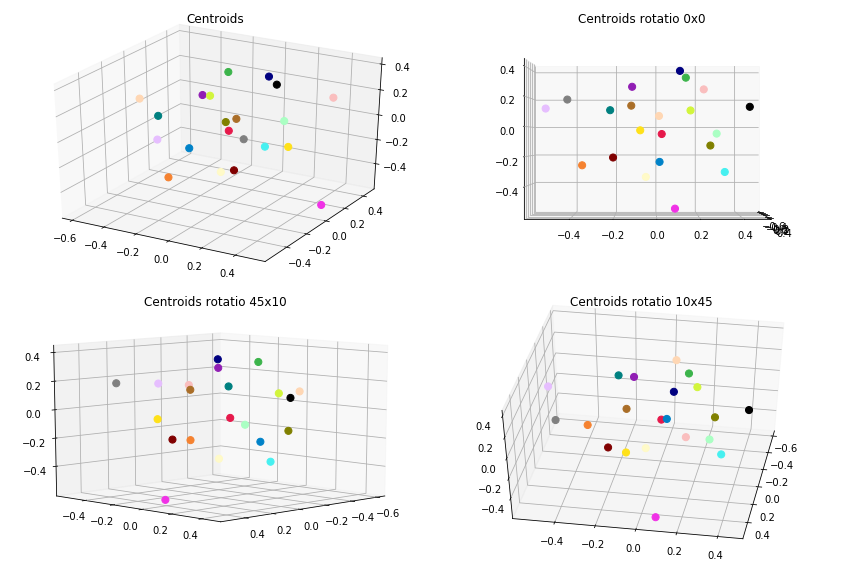
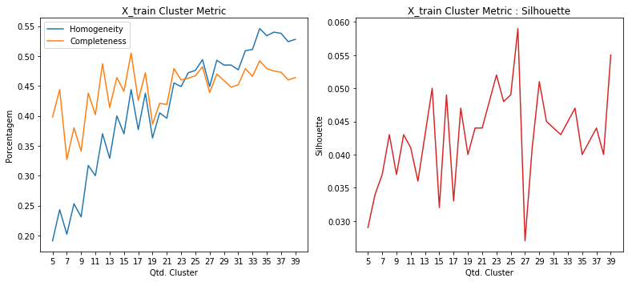
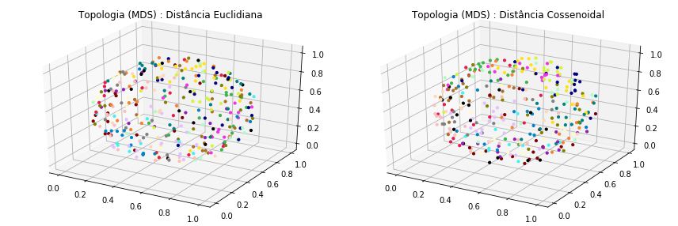
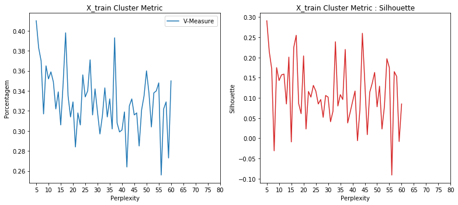
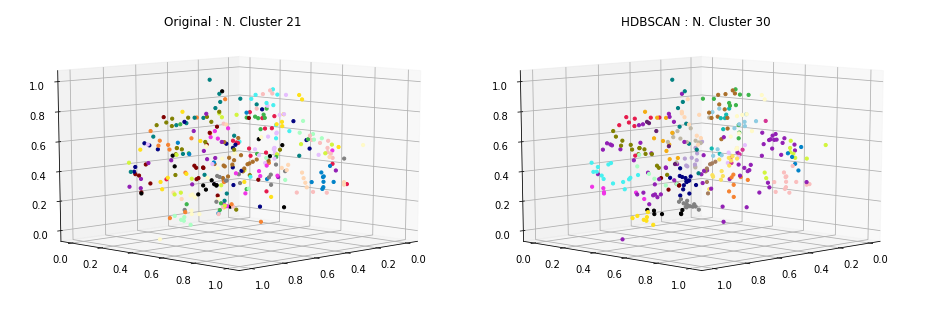
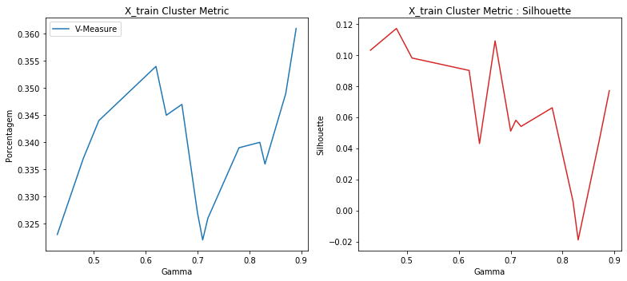
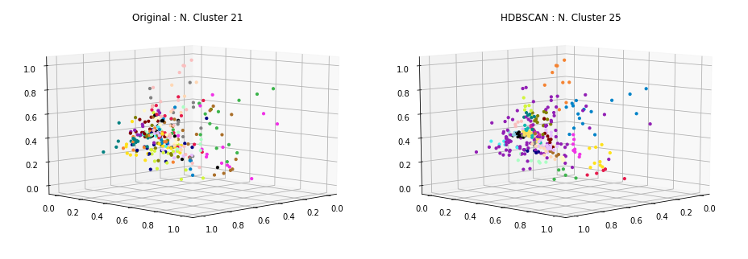
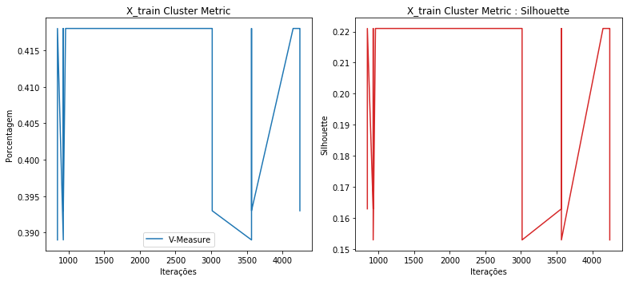
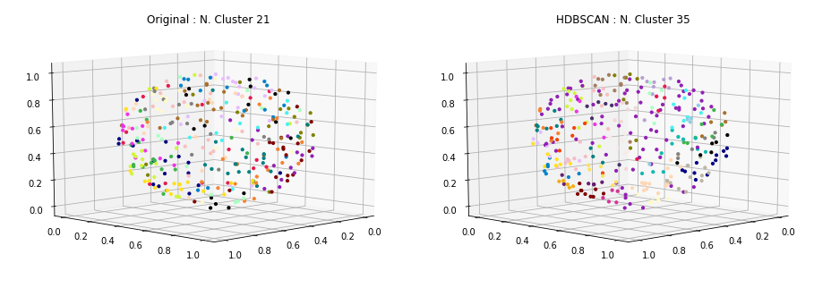

### Carregamento dos datasets

Os datasets de exemplos são frases já pré-categorizadas usadas em chatbots.

Contém 33 categorias e ao todo 696 documentos ou frases.

<table border="1" class="dataframe">
  <thead>
    <tr style="text-align: right;">
      <th></th>
      <th>perguntas</th>
      <th>cluster</th>
    </tr>
  </thead>
  <tbody>
    <tr>
      <th>41</th>
      <td>Se eu ativar roaming agora, já posso utilizar?</td>
      <td>ACTIVATE_ROAMING</td>
    </tr>
    <tr>
      <th>42</th>
      <td>Posso incluir roaming no meu plano por duas semanas?</td>
      <td>ACTIVATE_ROAMING</td>
    </tr>
    <tr>
      <th>110</th>
      <td>Eu gostaria de comprar um plano somente</td>
      <td>CHANGE_PRICE_PLAN</td>
    </tr>
    <tr>
      <th>153</th>
      <td>A desativação online está disponível para o meu telefone pré-pago?</td>
      <td>DEACTIVATE_PREPAID_PLAN</td>
    </tr>
    <tr>
      <th>170</th>
      <td>Como desativar a função roaming?</td>
      <td>DEACTIVATE_ROAMING</td>
    </tr>
    <tr>
      <th>198</th>
      <td>Quero informações sobre fazer ligações internacionais de casa</td>
      <td>INTERNATIONAL_RATE_PLAN_INQUIRY</td>
    </tr>
    <tr>
      <th>254</th>
      <td>Eu preciso do meu PUK para o meu celular, fiz uma tentativa on-line, mas a operadora não aceitou meu nome, data de nascimento e endereço de e-mail válidos.</td>
      <td>NETWORK_UNLOCK</td>
    </tr>
    <tr>
      <th>396</th>
      <td>Quem eu contato para mudar meu contrato do meu velho telefone para o meu novo telefone?</td>
      <td>SWAP_DEVICE</td>
    </tr>
    <tr>
      <th>406</th>
      <td>Meu roteador esta com uma luz vermelha</td>
      <td>TROUBLESHOOTING</td>
    </tr>
    <tr>
      <th>403</th>
      <td>Eu tenho um tablet novo que está reiniciando continuamente, como eu resolvo isso?/ como posso resolver isso? / como faço para resolver isso?</td>
      <td>TROUBLESHOOTING</td>
    </tr>
  </tbody>
</table>

    Qtde. de documentos por categoria:

<table border="1" class="dataframe">
  <thead>
    <tr style="text-align: right;">
      <th></th>
      <th>Categoria</th>
      <th>Qtde</th>
    </tr>
  </thead>
  <tbody>
    <tr>
      <th>0</th>
      <td>ACTIVATE_DEVICE</td>
      <td>19</td>
    </tr>
    <tr>
      <th>1</th>
      <td>ACTIVATE_PREPAID_PLAN</td>
      <td>21</td>
    </tr>
    <tr>
      <th>2</th>
      <td>ACTIVATE_ROAMING</td>
      <td>20</td>
    </tr>
    <tr>
      <th>3</th>
      <td>ADD_INSURANCE</td>
      <td>18</td>
    </tr>
    <tr>
      <th>4</th>
      <td>ADD_SERVICE_FEATURES</td>
      <td>20</td>
    </tr>
    <tr>
      <th>5</th>
      <td>CHANGE_PRICE_PLAN</td>
      <td>19</td>
    </tr>
    <tr>
      <th>6</th>
      <td>COVERAGE_AREA_INQUIRY</td>
      <td>19</td>
    </tr>
    <tr>
      <th>7</th>
      <td>DEACTIVATE_PREPAID_PLAN</td>
      <td>18</td>
    </tr>
    <tr>
      <th>8</th>
      <td>DEACTIVATE_ROAMING</td>
      <td>18</td>
    </tr>
    <tr>
      <th>9</th>
      <td>DEVICE_UPGRADE_ELIGIBILITY</td>
      <td>24</td>
    </tr>
    <tr>
      <th>10</th>
      <td>INTERNATIONAL_RATE_PLAN_INQUIRY</td>
      <td>21</td>
    </tr>
    <tr>
      <th>11</th>
      <td>NETWORK_COMPLAINTS</td>
      <td>23</td>
    </tr>
    <tr>
      <th>12</th>
      <td>NETWORK_UNLOCK</td>
      <td>21</td>
    </tr>
    <tr>
      <th>13</th>
      <td>PORT_IN</td>
      <td>21</td>
    </tr>
    <tr>
      <th>14</th>
      <td>PRICE_PLAN_INQUIRY</td>
      <td>23</td>
    </tr>
    <tr>
      <th>15</th>
      <td>RECHARGE_SIM</td>
      <td>18</td>
    </tr>
    <tr>
      <th>16</th>
      <td>REMOVE_SERVICE_FEATURES</td>
      <td>20</td>
    </tr>
    <tr>
      <th>17</th>
      <td>RETURN_DEVICE</td>
      <td>21</td>
    </tr>
    <tr>
      <th>18</th>
      <td>ROAMING_INQUIRY</td>
      <td>20</td>
    </tr>
    <tr>
      <th>19</th>
      <td>SWAP_DEVICE</td>
      <td>15</td>
    </tr>
    <tr>
      <th>20</th>
      <td>TROUBLESHOOTING</td>
      <td>19</td>
    </tr>
  </tbody>
</table>

    Total docs     : 418
    Total cluster  : 418
    X_train size   : (334,)
    X_test  size   : (84,)

### Dataset tokenization

    Tokenization...
    Qtd documentos treino:  334
    Qtd Intents treino   :  21
    Finished...

    ['trocar um planar conversacao direta um telefonar operador gratuitamente',
     'consultar valorar aplicar ligacoes internacional',
     'alterar configuracao roaming celular prepago exterior',
     'oi comprar um celular gostar trocar contar telefonar velho telefonar',
     'precisar mudar um dispositivo precisar voce ativar desativar atual',
     'detalhar planar preco atual cobrar',
     'precisar informacao cancelar roaming',
     'mudar empresar querer encontrar um planar prepago funcionar mim voce',
     'nao receber sinal edificio',
     'poder compartilhar algum informacao cobertura redar']

### **TF-IDF**

Validação do modelo gerado pelo TF-IDF... teste tanto nos dados apresentados para treinamento quanto nos dados de testes e as acurácias alcançadas.

### Acurácia distância cossenoidal

    - Acurácia treino: 100.0
    --------------------
     - Acurácia teste 1  : 42.86
     - Acurácia teste 2  : 42.86
     - Acurácia teste 3  : 42.86
     - Acurácia teste 4  : 42.86
     - Acurácia teste 5  : 42.86
    - Acurácia média teste: 42.86

### Acurácia distância euclidiana

    - Acurácia treino: 100.0
    --------------------
     - Acurácia teste 1  : 44.05
     - Acurácia teste 2  : 44.05
     - Acurácia teste 3  : 44.05
     - Acurácia teste 4  : 44.05
     - Acurácia teste 5  : 44.05
    - Acurácia média teste: 44.05

### Clusterização

Utilizou-se o KMeans definindo a quantidade de clusters para o número ideal de categorias existentes no caso 33. A métrica de distância utilizada, não foi a euclidiana, mas sim a de cosseno (métrica comumente usada na classificação de texto em seu espaço vetorial).

    Frases por cluster:

<table border="1" class="dataframe">
  <thead>
    <tr style="text-align: right;">
      <th>title</th>
      <th>cluster</th>
    </tr>
  </thead>
  <tbody>
    <tr>
      <td>Quando é o último dia que posso devolver meu telefone?</td>
      <td>0</td>
    </tr>
    <tr>
      <td>Eu preciso de ajuda para manter o meu número antigo enquanto mudo de fornecedores.</td>
      <td>0</td>
    </tr>
    <tr>
      <td>Como um cliente de longo prazo, você pode me dizer quais os descontos que posso receber em minhas cobranças?</td>
      <td>1</td>
    </tr>
    <tr>
      <td>Consulta sobre portabilidade</td>
      <td>1</td>
    </tr>
    <tr>
      <td>Oi, já que você está aqui, está havendo algum problema com a cobertura na área de SP? Desde ontem o meu sinal normal de 4 barras ficou em 0, está bem em outros lugares.</td>
      <td>2</td>
    </tr>
    <tr>
      <td>Eu não recebo sinal quando estou no Edifício 32.</td>
      <td>2</td>
    </tr>
    <tr>
      <td>Onde posso localizar informações detalhadas sobre o seu plano de taxa internacional?</td>
      <td>3</td>
    </tr>
    <tr>
      <td>Vou viajar para o exterior, quero desativar o roaming.</td>
      <td>3</td>
    </tr>
    <tr>
      <td>Estou bastante cansado do meu telefone existente e gostaria de saber quando eu vou ser elegível para sua atualização?</td>
      <td>4</td>
    </tr>
    <tr>
      <td>Sabe quando serei elegível de ter um upgrade de dispositivo?</td>
      <td>4</td>
    </tr>
    <tr>
      <td>Eu quero ativar o identificador de chamadas.</td>
      <td>5</td>
    </tr>
    <tr>
      <td>Comprei outro SIM e quero ativar como pre-pago.</td>
      <td>5</td>
    </tr>
    <tr>
      <td>Eu preciso de ajuda para desativar meu celular pré-pago.</td>
      <td>6</td>
    </tr>
    <tr>
      <td>Favor realizar a ativação do meu SIM card</td>
      <td>6</td>
    </tr>
    <tr>
      <td>Bom dia, eu me pergunto se você gostaria de saber quais são as áreas de cobertura da companhia telefônica?</td>
      <td>7</td>
    </tr>
    <tr>
      <td>Eu gostaria de perguntar sobre como manter o meu número existente quando eu trocar.</td>
      <td>7</td>
    </tr>
    <tr>
      <td>Como faço para remover o serviço de mensagens de texto?</td>
      <td>8</td>
    </tr>
    <tr>
      <td>Quanto vai custar para usar a quantidade de dados que normalmente uso, em Londres?</td>
      <td>8</td>
    </tr>
    <tr>
      <td>Logo precisarei fazer várias ligações internacionais do meu país. Onde posso encontrar, ou como posso ter uma lista completa com todos os preços possíveis indicados?</td>
      <td>9</td>
    </tr>
    <tr>
      <td>Quanto da área total no meu país é coberta pela recepção?</td>
      <td>9</td>
    </tr>
    <tr>
      <td>Eu quero adicionar um serviço de produto à minha conta, ou seja, mais dados ao seguro eurotraveller</td>
      <td>10</td>
    </tr>
    <tr>
      <td>Quantos tabletes podem ser adicionados ao meu plano de família?</td>
      <td>10</td>
    </tr>
    <tr>
      <td>Vocês oferecem seguros para celulares? Eu tenho uma conta comercial com vários dispositivos e gostaria de encontrar uma cobertura razoável.</td>
      <td>11</td>
    </tr>
    <tr>
      <td>Como eu adiciono uma nova categoria de intenção?</td>
      <td>11</td>
    </tr>
    <tr>
      <td>A minha internet não funciona no meu celular</td>
      <td>12</td>
    </tr>
    <tr>
      <td>Se eu recarregar R$ 50, o que eu ganho?</td>
      <td>12</td>
    </tr>
    <tr>
      <td>Como desligar meus dados automaticamente quando o WI-FI está disponível?</td>
      <td>13</td>
    </tr>
    <tr>
      <td>Onde estão as áreas perto de mim que eu poderia ter boa recepção?</td>
      <td>13</td>
    </tr>
    <tr>
      <td>Eu disse que recebi um novo sim e gostaria de compartilhar o código de pac do meu número atual com você.</td>
      <td>14</td>
    </tr>
    <tr>
      <td>Tom, quais são as políticas para retornar um dispositivo que foi usado por um tempo?</td>
      <td>14</td>
    </tr>
    <tr>
      <td>Meu telefone não faz nem recebe mais nenhuma chamada.</td>
      <td>15</td>
    </tr>
    <tr>
      <td>Quanto me custará por minuto para chamar minha tia na Austrália?</td>
      <td>15</td>
    </tr>
    <tr>
      <td>Como posso ativar o roaming internacional, por favor?</td>
      <td>16</td>
    </tr>
    <tr>
      <td>Meu aparelho já vem com roaming de dados ativado?</td>
      <td>16</td>
    </tr>
    <tr>
      <td>Quanto custa enviar uma mensagem de texto internacionalmente?</td>
      <td>17</td>
    </tr>
    <tr>
      <td>Queria excluir as ligações fora da minha região do meu plano</td>
      <td>17</td>
    </tr>
    <tr>
      <td>Quero saber sobre os planos pré-pagos</td>
      <td>18</td>
    </tr>
    <tr>
      <td>Como podemos fazer uma mudança no plano de preços em nossos dispositivos?</td>
      <td>18</td>
    </tr>
    <tr>
      <td>Por favor me ajude desbloquear meu novo telefone no meu plano de serviço.</td>
      <td>19</td>
    </tr>
    <tr>
      <td>Quero meu desbloqueio no meu dispositivo atual</td>
      <td>19</td>
    </tr>
    <tr>
      <td>Oi, estou mesmo querendo uma recarga no meu celular. Você pode por favor ajudar, diz que eu não tenho crédito.</td>
      <td>20</td>
    </tr>
    <tr>
      <td>Recentemente, comprei um novo dispositivo, mas não tenho ideia de como eu deveria ativá-lo. Você pode me ajudar?</td>
      <td>20</td>
    </tr>
  </tbody>
</table>

    --------------------
    Documentos por cluster:

<table border="1" class="dataframe">
  <tbody>
    <tr>
      <td>C0</td>
      <td>45</td>
    </tr>
    <tr>
      <td>C1</td>
      <td>11</td>
    </tr>
    <tr>
      <td>C2</td>
      <td>11</td>
    </tr>
    <tr>
      <td>C3</td>
      <td>15</td>
    </tr>
    <tr>
      <td>C4</td>
      <td>14</td>
    </tr>
    <tr>
      <td>C5</td>
      <td>33</td>
    </tr>
    <tr>
      <td>C6</td>
      <td>10</td>
    </tr>
    <tr>
      <td>C7</td>
      <td>3</td>
    </tr>
    <tr>
      <td>C8</td>
      <td>18</td>
    </tr>
    <tr>
      <td>C9</td>
      <td>7</td>
    </tr>
    <tr>
      <td>C10</td>
      <td>20</td>
    </tr>
    <tr>
      <td>C11</td>
      <td>4</td>
    </tr>
    <tr>
      <td>C12</td>
      <td>18</td>
    </tr>
    <tr>
      <td>C13</td>
      <td>12</td>
    </tr>
    <tr>
      <td>C14</td>
      <td>15</td>
    </tr>
    <tr>
      <td>C15</td>
      <td>19</td>
    </tr>
    <tr>
      <td>C16</td>
      <td>38</td>
    </tr>
    <tr>
      <td>C17</td>
      <td>5</td>
    </tr>
    <tr>
      <td>C18</td>
      <td>14</td>
    </tr>
    <tr>
      <td>C19</td>
      <td>16</td>
    </tr>
    <tr>
      <td>C20</td>
      <td>6</td>
    </tr>
  </tbody>
</table>

### Visualização

Apresentação dos protótipos gerados pelo KMeans, reduzindo a dimensão usando o algoritmo MDS (Multidimensional Scaling).

### Clusterização dos dados de Teste

Por fim, realizada a clusterização dos dados de teste e a apresentação das 8 primeiras frases do conjunto de teste juntamente com outras duas frases do cluster ao qual foi identificado como o melhor.

    * Eu não quero mais usar meu telefone pré-pago atual.
      -  Favor realizar a ativação do meu SIM card
      -  Eu preciso de ajuda para desativar meu celular pré-pago.
    --------------------
    * Isso vai funcionar em todos os lugares?
      -  A minha internet não funciona no meu celular
      -  Se eu recarregar R$ 50, o que eu ganho?
    --------------------
    * Verificar o status da devolução
      -  Tom, quais são as políticas para retornar um dispositivo que foi usado por um tempo?
      -  Eu disse que recebi um novo sim e gostaria de compartilhar o código de pac do meu número atual com você.
    --------------------
    * Meu telefone está velho. Posso pegar uma atualização gratuita.
      -  Sabe quando serei elegível de ter um upgrade de dispositivo?
      -  Estou bastante cansado do meu telefone existente e gostaria de saber quando eu vou ser elegível para sua atualização?
    --------------------
    * O que vai custar menos ficar no meu plano atual ou mudar para o novo?
      -  Como faço para remover o serviço de mensagens de texto?
      -  Quanto vai custar para usar a quantidade de dados que normalmente uso, em Londres?
    --------------------
    * Posso transferir meus dados quando troco telefones?
      -  Eu preciso de ajuda para manter o meu número antigo enquanto mudo de fornecedores.
      -  Quando é o último dia que posso devolver meu telefone?
    --------------------
    * Você pode por favor me dizer se eu sou elegível para atualizar meu celular de graça? Caso contrário, em que data serei elegível para fazê-lo?
      -  Sabe quando serei elegível de ter um upgrade de dispositivo?
      -  Estou bastante cansado do meu telefone existente e gostaria de saber quando eu vou ser elegível para sua atualização?
    --------------------
    * Eu pedi o plano errado. Você poderia mudar isso para o plano de R$ 50?
      -  Quanto vai custar para usar a quantidade de dados que normalmente uso, em Londres?
      -  Como faço para remover o serviço de mensagens de texto?
    --------------------

### Métricas

Abaixo são apresentadas métricas para demonstrar o quanto a clusterização parece funcionar.

    Homogeneidade    :  0.656
    Completude       :  0.681
    V-Measure        :  0.668
    Silhouette       :  -0.003

### HDBSCAN no espaço dos dados

    Frases por cluster:

<table border="1" class="dataframe">
  <thead>
    <tr style="text-align: right;">
      <th>title</th>
      <th>cluster</th>
    </tr>
  </thead>
  <tbody>
    <tr>
      <td>Como trocar um plano de conversação direta para um telefone desta operadora gratuitamente?</td>
      <td>0</td>
    </tr>
    <tr>
      <td>Eu quero desligar a função de roaming.</td>
      <td>0</td>
    </tr>
    <tr>
      <td>Eu gostaria de cancelar os correios de voz Visual no meu telefone</td>
      <td>0</td>
    </tr>
    <tr>
      <td>Eu estava querendo me inscrever em um plano com sua empresa e estava pensando quais são alguns dos planos de preços que você tem para oferecer?</td>
      <td>1</td>
    </tr>
    <tr>
      <td>Você poderia me falar sobre os diferentes planos de preços disponíveis na minha localização?</td>
      <td>1</td>
    </tr>
    <tr>
      <td>Quais são os preços para os planos de dados e chamadas diferentes que você oferece?</td>
      <td>1</td>
    </tr>
    <tr>
      <td>Quero adicionar minutos à minha subscrição.</td>
      <td>2</td>
    </tr>
    <tr>
      <td>Me ajude com a inclusão de minutos no pré-pago.</td>
      <td>2</td>
    </tr>
    <tr>
      <td>Você pode me dizer como posso adicionar minutos ao meu telefone pré-pago?</td>
      <td>2</td>
    </tr>
    <tr>
      <td>Quero mudar os provedores de serviço, ainda posso manter meu mesmo número de telefone?</td>
      <td>3</td>
    </tr>
    <tr>
      <td>Olá. É possível mudar o meu provedor para outro enquanto mantenho este número?</td>
      <td>3</td>
    </tr>
    <tr>
      <td>Estou apenas olhando para ver quando eu posso mudar de telefone, obrigado pela sua ajuda.</td>
      <td>3</td>
    </tr>
    <tr>
      <td>Eu tenho um dispositivo antigo e novo e quero mudar meu serviço do meu antigo para o meu novo</td>
      <td>4</td>
    </tr>
    <tr>
      <td>Quero trocar o meu antigo telefone por um crédito</td>
      <td>4</td>
    </tr>
    <tr>
      <td>Como posso adicionar meus serviços de telefone do meu dispositivo móvel antigo para o novo?</td>
      <td>4</td>
    </tr>
    <tr>
      <td>Qual é o primeiro mês quando eu posso atualizar um dos meus dispositivos</td>
      <td>5</td>
    </tr>
    <tr>
      <td>Eu não tenho seguro para o meu telefone, como posso fazer/obter isso?</td>
      <td>5</td>
    </tr>
    <tr>
      <td>Qual é o procedimento para incluir um seguro para o meu telefone?</td>
      <td>5</td>
    </tr>
    <tr>
      <td>Chamadas feitas enquanto estou viajando no exterior estão incluídas no meu plano?</td>
      <td>6</td>
    </tr>
    <tr>
      <td>As chamadas internacionais estão incluídas no meu plano?</td>
      <td>6</td>
    </tr>
    <tr>
      <td>Ei, posso incluir chamada internacional por favor</td>
      <td>6</td>
    </tr>
    <tr>
      <td>Cancelar o serviço de roaming</td>
      <td>7</td>
    </tr>
    <tr>
      <td>Como cancelo meu serviço de telefone pré-pago?</td>
      <td>7</td>
    </tr>
    <tr>
      <td>Preciso de informações em como cancelar o roaming</td>
      <td>7</td>
    </tr>
    <tr>
      <td>Estou tendo um problema com o meu telefone. Não consigo fazer ou receber chamadas! Eu preciso de ajuda!</td>
      <td>8</td>
    </tr>
    <tr>
      <td>Eu solicitei uma troca de SIM, mas ainda não está completo, então não consigo fazer ou receber chamadas</td>
      <td>8</td>
    </tr>
    <tr>
      <td>Não preciso mais do meu roaming</td>
      <td>8</td>
    </tr>
    <tr>
      <td>É possível desativar o meu dispositivo de telefone pré-pago?</td>
      <td>9</td>
    </tr>
    <tr>
      <td>Eu preciso de ajuda para desativar meu celular pré-pago.</td>
      <td>9</td>
    </tr>
    <tr>
      <td>Sim eu quero desativar o roaming no meu número de telefone</td>
      <td>9</td>
    </tr>
    <tr>
      <td>Desde que não uso meus dados muito, posso mudar para um de plano apenas 1 GB de dados.</td>
      <td>10</td>
    </tr>
    <tr>
      <td>Quais servicos posso remover diretamente pelo meu aparelho?</td>
      <td>10</td>
    </tr>
    <tr>
      <td>Qual é o plano de dados que estou na ativa?</td>
      <td>10</td>
    </tr>
    <tr>
      <td>Como posso ativar o roaming internacional, por favor?</td>
      <td>11</td>
    </tr>
    <tr>
      <td>Eu gostaria de saber sobre os encargos de roaming internacional e como ativar isto.</td>
      <td>11</td>
    </tr>
    <tr>
      <td>O usuário deseja ativar o roaming internacional.</td>
      <td>11</td>
    </tr>
  </tbody>
</table>

    --------------------
    Documentos por cluster:

<table border="1" class="dataframe">
  <tbody>
    <tr>
      <td>C0</td>
      <td>232</td>
    </tr>
    <tr>
      <td>C1</td>
      <td>5</td>
    </tr>
    <tr>
      <td>C2</td>
      <td>5</td>
    </tr>
    <tr>
      <td>C3</td>
      <td>9</td>
    </tr>
    <tr>
      <td>C4</td>
      <td>8</td>
    </tr>
    <tr>
      <td>C5</td>
      <td>20</td>
    </tr>
    <tr>
      <td>C6</td>
      <td>6</td>
    </tr>
    <tr>
      <td>C7</td>
      <td>7</td>
    </tr>
    <tr>
      <td>C8</td>
      <td>19</td>
    </tr>
    <tr>
      <td>C9</td>
      <td>13</td>
    </tr>
    <tr>
      <td>C10</td>
      <td>5</td>
    </tr>
    <tr>
      <td>C11</td>
      <td>5</td>
    </tr>
  </tbody>
</table>

### Topologia dos dados de treinamento usando MDS

## **HDBSCAN**

 - [How HDBSCAN Works](https://nbviewer.jupyter.org/github/scikit-learn-contrib/hdbscan/blob/master/notebooks/How%20HDBSCAN%20Works.ipynb)
 - [hdbscan github implementation](https://github.com/scikit-learn-contrib/hdbscan)
 - [Density-Based Clustering Based on Hierarchical Density Estimates](https://link.springer.com/chapter/10.1007/978-3-642-37456-2_14)

---

## **t-SNE + HDBSCAN**

<table border="1" class="dataframe">
  <thead>
    <tr style="text-align: right;">
      <th></th>
      <th>Perplexity</th>
      <th>Learning Rate</th>
      <th>Angle</th>
      <th>V-Measure</th>
      <th>Silhouette</th>
    </tr>
  </thead>
  <tbody>
    <tr>
      <th>0</th>
      <td>5</td>
      <td>158</td>
      <td>0.82</td>
      <td>0.410</td>
      <td>0.291</td>
    </tr>
    <tr>
      <th>39</th>
      <td>44</td>
      <td>126</td>
      <td>0.84</td>
      <td>0.332</td>
      <td>0.260</td>
    </tr>
    <tr>
      <th>12</th>
      <td>17</td>
      <td>78</td>
      <td>0.84</td>
      <td>0.398</td>
      <td>0.255</td>
    </tr>
    <tr>
      <th>28</th>
      <td>33</td>
      <td>208</td>
      <td>0.89</td>
      <td>0.343</td>
      <td>0.239</td>
    </tr>
    <tr>
      <th>11</th>
      <td>16</td>
      <td>119</td>
      <td>0.74</td>
      <td>0.348</td>
      <td>0.225</td>
    </tr>
    <tr>
      <th>32</th>
      <td>37</td>
      <td>78</td>
      <td>0.84</td>
      <td>0.393</td>
      <td>0.220</td>
    </tr>
    <tr>
      <th>1</th>
      <td>6</td>
      <td>119</td>
      <td>0.74</td>
      <td>0.383</td>
      <td>0.215</td>
    </tr>
    <tr>
      <th>15</th>
      <td>20</td>
      <td>192</td>
      <td>0.83</td>
      <td>0.329</td>
      <td>0.204</td>
    </tr>
    <tr>
      <th>9</th>
      <td>14</td>
      <td>126</td>
      <td>0.84</td>
      <td>0.339</td>
      <td>0.201</td>
    </tr>
    <tr>
      <th>49</th>
      <td>54</td>
      <td>199</td>
      <td>0.86</td>
      <td>0.340</td>
      <td>0.197</td>
    </tr>
    <tr>
      <th>50</th>
      <td>55</td>
      <td>126</td>
      <td>0.90</td>
      <td>0.348</td>
      <td>0.175</td>
    </tr>
    <tr>
      <th>4</th>
      <td>9</td>
      <td>134</td>
      <td>0.90</td>
      <td>0.365</td>
      <td>0.175</td>
    </tr>
    <tr>
      <th>2</th>
      <td>7</td>
      <td>78</td>
      <td>0.84</td>
      <td>0.370</td>
      <td>0.172</td>
    </tr>
    <tr>
      <th>52</th>
      <td>57</td>
      <td>150</td>
      <td>0.85</td>
      <td>0.322</td>
      <td>0.165</td>
    </tr>
    <tr>
      <th>44</th>
      <td>49</td>
      <td>146</td>
      <td>0.82</td>
      <td>0.335</td>
      <td>0.163</td>
    </tr>
    <tr>
      <th>7</th>
      <td>12</td>
      <td>214</td>
      <td>0.84</td>
      <td>0.349</td>
      <td>0.159</td>
    </tr>
    <tr>
      <th>6</th>
      <td>11</td>
      <td>170</td>
      <td>0.77</td>
      <td>0.359</td>
      <td>0.157</td>
    </tr>
    <tr>
      <th>53</th>
      <td>58</td>
      <td>169</td>
      <td>0.67</td>
      <td>0.329</td>
      <td>0.153</td>
    </tr>
    <tr>
      <th>5</th>
      <td>10</td>
      <td>192</td>
      <td>0.83</td>
      <td>0.352</td>
      <td>0.143</td>
    </tr>
    <tr>
      <th>40</th>
      <td>45</td>
      <td>126</td>
      <td>0.90</td>
      <td>0.316</td>
      <td>0.137</td>
    </tr>
    <tr>
      <th>43</th>
      <td>48</td>
      <td>169</td>
      <td>0.67</td>
      <td>0.321</td>
      <td>0.136</td>
    </tr>
    <tr>
      <th>19</th>
      <td>24</td>
      <td>126</td>
      <td>0.84</td>
      <td>0.356</td>
      <td>0.131</td>
    </tr>
    <tr>
      <th>46</th>
      <td>51</td>
      <td>107</td>
      <td>0.78</td>
      <td>0.338</td>
      <td>0.129</td>
    </tr>
    <tr>
      <th>20</th>
      <td>25</td>
      <td>158</td>
      <td>0.82</td>
      <td>0.334</td>
      <td>0.117</td>
    </tr>
    <tr>
      <th>36</th>
      <td>41</td>
      <td>170</td>
      <td>0.77</td>
      <td>0.319</td>
      <td>0.117</td>
    </tr>
  </tbody>
</table>

    Homogeneidade    :  0.417
    Completude       :  0.403
    V-Measure        :  0.41
    Silhouette       :  0.291

    Frases por cluster:

<table border="1" class="dataframe">
  <thead>
    <tr style="text-align: right;">
      <th>title</th>
      <th>cluster</th>
    </tr>
  </thead>
  <tbody>
    <tr>
      <td>Remova a caixa postal, se possível.</td>
      <td>0</td>
    </tr>
    <tr>
      <td>Como remover recursos do plano do telefone sem fio em casa?</td>
      <td>0</td>
    </tr>
    <tr>
      <td>Preciso remover o MMS no meu telefone.</td>
      <td>0</td>
    </tr>
    <tr>
      <td>Quanto da área total no meu país é coberta pela recepção?</td>
      <td>1</td>
    </tr>
    <tr>
      <td>Poderia por favor compartilhar alguma informação sobre a cobertura de rede na área?</td>
      <td>1</td>
    </tr>
    <tr>
      <td>Oi, já que você está aqui, está havendo algum problema com a cobertura na área de SP? Desde ontem o meu sinal normal de 4 barras ficou em 0, está bem em outros lugares.</td>
      <td>1</td>
    </tr>
    <tr>
      <td>Como adiciono minutos?</td>
      <td>2</td>
    </tr>
    <tr>
      <td>Quero adicionar minutos à minha subscrição.</td>
      <td>2</td>
    </tr>
    <tr>
      <td>Eu quero adicionar um serviço de produto à minha conta, ou seja, mais dados ao seguro eurotraveller</td>
      <td>2</td>
    </tr>
    <tr>
      <td>Como posso parar de usar meu telefone enquanto estou viajando?</td>
      <td>3</td>
    </tr>
    <tr>
      <td>Okey, mas vou viajar para Bolonha e quero ter certeza de que meu telefone vai funcionar.</td>
      <td>3</td>
    </tr>
    <tr>
      <td>Olá, eu tenho um novo dispositivo, e um cartão SIM de vocês com contrato mensal que obtive em uma loja, e já passaram 24 horas e o SIM ainda não está funcionando, e a loka está dizendo que tudo está ativado da parte deles</td>
      <td>3</td>
    </tr>
    <tr>
      <td>Eu quero colocar tempo de conversação no meu telefone.</td>
      <td>4</td>
    </tr>
    <tr>
      <td>Como trocar um plano de conversação direta para um telefone desta operadora gratuitamente?</td>
      <td>4</td>
    </tr>
    <tr>
      <td>O usuário deseja ativar o roaming internacional.</td>
      <td>4</td>
    </tr>
    <tr>
      <td>Sim eu quero desativar o roaming no meu número de telefone</td>
      <td>5</td>
    </tr>
    <tr>
      <td>Posso levar meu telefone comigo se eu mudar para uma nova empresa.</td>
      <td>5</td>
    </tr>
    <tr>
      <td>Que tipo de planos de roaming são oferecidos pelo meu provedor de serviços? Gostaria de um plano econômico que me permita roaming enquanto viajo.</td>
      <td>5</td>
    </tr>
    <tr>
      <td>Como trocar de plano, o plano ilimitado é muito caro</td>
      <td>6</td>
    </tr>
    <tr>
      <td>Quanto vai custar para usar a quantidade de dados que normalmente uso, em Londres?</td>
      <td>6</td>
    </tr>
    <tr>
      <td>Qual plano de dados é o menos caro para mim?</td>
      <td>6</td>
    </tr>
    <tr>
      <td>Eu preciso de cerca de 100 GB de dados todos os meses e acima de 20 Mbps de velocidade, você pode sugerir alguns planos de dados que possam corresponder às minhas necessidades?</td>
      <td>7</td>
    </tr>
    <tr>
      <td>Você pode me dizer como posso retornar meu telefone atual para uma atualização?</td>
      <td>7</td>
    </tr>
    <tr>
      <td>Desde que não uso meus dados muito, posso mudar para um de plano apenas 1 GB de dados.</td>
      <td>7</td>
    </tr>
    <tr>
      <td>Olá eu acabei de atualizar o meu telefone e quero que minha filha use o meu antigo celular até ela poder atualizar.</td>
      <td>8</td>
    </tr>
    <tr>
      <td>Como faço para retornar o meu dispositivo para sua empresa?</td>
      <td>8</td>
    </tr>
    <tr>
      <td>Quando dentro do contrato sou elegivel para atualizar meu atual aparelho?</td>
      <td>8</td>
    </tr>
    <tr>
      <td>Oi, eu preciso de um seguro para o meu telefone, quais são as opções disponíveis para o meu plano?</td>
      <td>9</td>
    </tr>
    <tr>
      <td>Quero atualizar o meu plano com o seguro de telefone.</td>
      <td>9</td>
    </tr>
    <tr>
      <td>Eu gostaria de segurar meu telefone. Pode me ajudar com isso?</td>
      <td>9</td>
    </tr>
    <tr>
      <td>Posso trocar meu equipamento para o mais recente e o melhor disponível?</td>
      <td>10</td>
    </tr>
    <tr>
      <td>Quais são os custos de fazer ligações internacionais do meu país?</td>
      <td>10</td>
    </tr>
    <tr>
      <td>Onde consulto os valores aplicados para ligacoes internacionais?</td>
      <td>10</td>
    </tr>
    <tr>
      <td>Oi. Tenho um sinal forte, mas não consigo fazer ou receber chamadas. Você pode me ajudar a ver como resolver esse problema?</td>
      <td>11</td>
    </tr>
    <tr>
      <td>Eu tenho um tablet novo que está reiniciando continuamente, como eu resolvo isso?/ como posso resolver isso? / como faço para resolver isso?</td>
      <td>11</td>
    </tr>
    <tr>
      <td>Meu telefone novo não pode receber nenhuma mensagem de texto ou e-mail enquanto eu estou em uma chamada? Eu costumava ser capaz de fazer isso com meu telefone antigo</td>
      <td>11</td>
    </tr>
    <tr>
      <td>Em caso de sinistro em quanto tempo posso pegar outro aparelho?</td>
      <td>12</td>
    </tr>
    <tr>
      <td>Gostaria de verificar todas as taxas para cobertura internacional</td>
      <td>12</td>
    </tr>
    <tr>
      <td>Meu novo telefone não está ativado ainda. Quem pode me ajudar com este problema?</td>
      <td>12</td>
    </tr>
    <tr>
      <td>Há certas partes na minha cidade onde eu não tenho sinal. Pode me dizer qual poderia ser o motivo?</td>
      <td>13</td>
    </tr>
    <tr>
      <td>Meu telefone mostra barras de sinal, mas eu não posso fazer nenhuma ligação.</td>
      <td>13</td>
    </tr>
    <tr>
      <td>Existe uma maneira de obter informações precisas sobre a área de cobertura e a qualidade da chamada esperada em cada área respectiva?</td>
      <td>13</td>
    </tr>
    <tr>
      <td>Qual é a razão do meu celular sempre ter uma taxa de acesso à Internet lenta?</td>
      <td>14</td>
    </tr>
    <tr>
      <td>Eu preciso obter um plano maior. Eu posso obter algumas cotações de preço</td>
      <td>14</td>
    </tr>
    <tr>
      <td>Nenhum dos meus dispositivos está funcionando. Acho que o roteador não está funcionando. Pode me acompanhar através de uma reinicialização.</td>
      <td>14</td>
    </tr>
    <tr>
      <td>Minha bateria esgotou rapidamente</td>
      <td>15</td>
    </tr>
    <tr>
      <td>Meu wifi está lento e caindo o tempo todo</td>
      <td>15</td>
    </tr>
    <tr>
      <td>Ajuda com a desativação de roaming</td>
      <td>15</td>
    </tr>
    <tr>
      <td>Eu gostaria de incluir texto de mensagem para o meu plano, pode fazer isso por mim?</td>
      <td>16</td>
    </tr>
    <tr>
      <td>Que planos estão disponíveis para chamada e dados Internacional?</td>
      <td>16</td>
    </tr>
    <tr>
      <td>Posso excluir o envio de sms?</td>
      <td>16</td>
    </tr>
    <tr>
      <td>O equipamento deve ser devolvido à empresa quando você cancela o meu serviço?</td>
      <td>17</td>
    </tr>
    <tr>
      <td>Eu preciso do meu PUK para o meu celular, fiz uma tentativa on-line, mas a operadora não aceitou meu nome, data de nascimento e endereço de e-mail válidos.</td>
      <td>17</td>
    </tr>
    <tr>
      <td>Cancelar o serviço de roaming</td>
      <td>17</td>
    </tr>
    <tr>
      <td>Por favor me ajude desbloquear meu novo telefone no meu plano de serviço.</td>
      <td>18</td>
    </tr>
    <tr>
      <td>Você pode me dizer a tarifa atual de cobrança da Europa Continental para o Reino Unido do meu telefone?</td>
      <td>18</td>
    </tr>
    <tr>
      <td>Como posso adicionar meus serviços de telefone do meu dispositivo móvel antigo para o novo?</td>
      <td>18</td>
    </tr>
    <tr>
      <td>Como cancelo meu serviço de telefone pré-pago?</td>
      <td>19</td>
    </tr>
    <tr>
      <td>Estou apenas olhando para ver quando eu posso mudar de telefone, obrigado pela sua ajuda.</td>
      <td>19</td>
    </tr>
    <tr>
      <td>Por favor adicione o roaming internacional na minha conta.</td>
      <td>19</td>
    </tr>
    <tr>
      <td>Eu quero mudar meu serviço para um novo dispositivo, mas mantendo os mesmos dados pessoais. Você pode me dizer como fazê-lo?</td>
      <td>20</td>
    </tr>
    <tr>
      <td>Quero mudar os provedores de serviço, ainda posso manter meu mesmo número de telefone?</td>
      <td>20</td>
    </tr>
    <tr>
      <td>Olá, quero saber se posso ficar com meu telefone se eu decidir mudar de provedor.</td>
      <td>20</td>
    </tr>
    <tr>
      <td>Estou tendo um problema com o meu telefone. Não consigo fazer ou receber chamadas! Eu preciso de ajuda!</td>
      <td>21</td>
    </tr>
    <tr>
      <td>Quanto tempo vai demorar para o meu telefone ativar?</td>
      <td>21</td>
    </tr>
    <tr>
      <td>Eu solicitei uma troca de SIM, mas ainda não está completo, então não consigo fazer ou receber chamadas</td>
      <td>21</td>
    </tr>
    <tr>
      <td>Estou recebendo chamadas indesejadas de números desconhecidos, como posso ativar Não perturbe?</td>
      <td>22</td>
    </tr>
    <tr>
      <td>Meu telefone não faz nem recebe mais nenhuma chamada.</td>
      <td>22</td>
    </tr>
    <tr>
      <td>Não preciso mais do meu roaming</td>
      <td>22</td>
    </tr>
    <tr>
      <td>É possível desativar o meu dispositivo de telefone pré-pago?</td>
      <td>23</td>
    </tr>
    <tr>
      <td>Estou tendo problemas ativando meu dispositivo pré-pago. Existe um FAQ disponível para me explicar isso passo a passo?</td>
      <td>23</td>
    </tr>
    <tr>
      <td>Posso usar meu aparelho para outras operadoras?</td>
      <td>23</td>
    </tr>
    <tr>
      <td>Porque o meu dispositivo ainda está pendente para ativar</td>
      <td>24</td>
    </tr>
    <tr>
      <td>Quanto é a taxa de ativação de um novo cartão SIM da minha operadora?</td>
      <td>24</td>
    </tr>
    <tr>
      <td>Como faço para ativar o novo dispositivo pré-pago que acabei de receber?</td>
      <td>24</td>
    </tr>
    <tr>
      <td>Vocês oferecem seguros para celulares? Eu tenho uma conta comercial com vários dispositivos e gostaria de encontrar uma cobertura razoável.</td>
      <td>25</td>
    </tr>
    <tr>
      <td>Como posso registrar um cartão SIM?</td>
      <td>25</td>
    </tr>
    <tr>
      <td>Após quanto tempo do pagamento da fatura atrasada, meu chip é desbloqueado?</td>
      <td>25</td>
    </tr>
    <tr>
      <td>Como podemos fazer uma mudança no plano de preços em nossos dispositivos?</td>
      <td>26</td>
    </tr>
    <tr>
      <td>Tenho usado o meu celular menos desde o ano passado, então eu gostaria de ter melhores planos de preços que atendam às minhas necessidades.</td>
      <td>26</td>
    </tr>
    <tr>
      <td>Quantos tabletes podem ser adicionados ao meu plano de família?</td>
      <td>26</td>
    </tr>
    <tr>
      <td>Eu quero fazer chamadas internacionais. Preciso de um plano para chamar um país europeu. Você pode me dar algumas tarifas?</td>
      <td>27</td>
    </tr>
    <tr>
      <td>Você pode me ajudar com problemas técnicos no meu telefone, ou você apenas fornece informações sobre planos de preços, etc.?</td>
      <td>27</td>
    </tr>
    <tr>
      <td>Eu disse que recebi um novo sim e gostaria de compartilhar o código de pac do meu número atual com você.</td>
      <td>27</td>
    </tr>
    <tr>
      <td>Como posso desbloquear meu novo aparelho? Tenho que usar o mesmo cartão SIM do meu telefone antigo?</td>
      <td>28</td>
    </tr>
    <tr>
      <td>Precio ir em uma loja fisica para fazer desbloqueio do meu aparelho celular?</td>
      <td>28</td>
    </tr>
    <tr>
      <td>Como posso começar a usar o meu telefone no exterior?</td>
      <td>28</td>
    </tr>
    <tr>
      <td>Quero desbloquear o meu novo telefone. Como faço isso?</td>
      <td>29</td>
    </tr>
    <tr>
      <td>Bom dia, eu me pergunto se você gostaria de saber quais são as áreas de cobertura da companhia telefônica?</td>
      <td>29</td>
    </tr>
    <tr>
      <td>Essa não é a instrução que me deram. Me mandaram um novo chip e me mandaram transferir meu velho número da outra operadora</td>
      <td>29</td>
    </tr>
  </tbody>
</table>

    --------------------
    Documentos por cluster:

<table border="1" class="dataframe">
  <tbody>
    <tr>
      <td>C0</td>
      <td>8</td>
    </tr>
    <tr>
      <td>C1</td>
      <td>11</td>
    </tr>
    <tr>
      <td>C2</td>
      <td>7</td>
    </tr>
    <tr>
      <td>C3</td>
      <td>5</td>
    </tr>
    <tr>
      <td>C4</td>
      <td>7</td>
    </tr>
    <tr>
      <td>C5</td>
      <td>68</td>
    </tr>
    <tr>
      <td>C6</td>
      <td>14</td>
    </tr>
    <tr>
      <td>C7</td>
      <td>6</td>
    </tr>
    <tr>
      <td>C8</td>
      <td>9</td>
    </tr>
    <tr>
      <td>C9</td>
      <td>13</td>
    </tr>
    <tr>
      <td>C10</td>
      <td>9</td>
    </tr>
    <tr>
      <td>C11</td>
      <td>5</td>
    </tr>
    <tr>
      <td>C12</td>
      <td>12</td>
    </tr>
    <tr>
      <td>C13</td>
      <td>10</td>
    </tr>
    <tr>
      <td>C14</td>
      <td>5</td>
    </tr>
    <tr>
      <td>C15</td>
      <td>6</td>
    </tr>
    <tr>
      <td>C16</td>
      <td>15</td>
    </tr>
    <tr>
      <td>C17</td>
      <td>9</td>
    </tr>
    <tr>
      <td>C18</td>
      <td>15</td>
    </tr>
    <tr>
      <td>C19</td>
      <td>13</td>
    </tr>
    <tr>
      <td>C20</td>
      <td>7</td>
    </tr>
    <tr>
      <td>C21</td>
      <td>11</td>
    </tr>
    <tr>
      <td>C22</td>
      <td>5</td>
    </tr>
    <tr>
      <td>C23</td>
      <td>12</td>
    </tr>
    <tr>
      <td>C24</td>
      <td>7</td>
    </tr>
    <tr>
      <td>C25</td>
      <td>13</td>
    </tr>
    <tr>
      <td>C26</td>
      <td>10</td>
    </tr>
    <tr>
      <td>C27</td>
      <td>5</td>
    </tr>
    <tr>
      <td>C28</td>
      <td>7</td>
    </tr>
    <tr>
      <td>C29</td>
      <td>10</td>
    </tr>
  </tbody>
</table>

---

## **Spectral Embedding + HDBSCAN**

<table border="1" class="dataframe">
  <thead>
    <tr style="text-align: right;">
      <th></th>
      <th>Gamma</th>
      <th>V-Measure</th>
      <th>Silhouette</th>
    </tr>
  </thead>
  <tbody>
    <tr>
      <th>0</th>
      <td>0.48</td>
      <td>0.337</td>
      <td>0.117</td>
    </tr>
    <tr>
      <th>18</th>
      <td>0.67</td>
      <td>0.347</td>
      <td>0.109</td>
    </tr>
    <tr>
      <th>12</th>
      <td>0.43</td>
      <td>0.323</td>
      <td>0.103</td>
    </tr>
    <tr>
      <th>2</th>
      <td>0.51</td>
      <td>0.344</td>
      <td>0.098</td>
    </tr>
    <tr>
      <th>3</th>
      <td>0.51</td>
      <td>0.344</td>
      <td>0.098</td>
    </tr>
    <tr>
      <th>10</th>
      <td>0.51</td>
      <td>0.344</td>
      <td>0.098</td>
    </tr>
    <tr>
      <th>13</th>
      <td>0.62</td>
      <td>0.354</td>
      <td>0.090</td>
    </tr>
    <tr>
      <th>7</th>
      <td>0.89</td>
      <td>0.361</td>
      <td>0.077</td>
    </tr>
    <tr>
      <th>1</th>
      <td>0.89</td>
      <td>0.361</td>
      <td>0.077</td>
    </tr>
    <tr>
      <th>11</th>
      <td>0.78</td>
      <td>0.339</td>
      <td>0.066</td>
    </tr>
    <tr>
      <th>6</th>
      <td>0.78</td>
      <td>0.339</td>
      <td>0.066</td>
    </tr>
    <tr>
      <th>4</th>
      <td>0.71</td>
      <td>0.322</td>
      <td>0.058</td>
    </tr>
    <tr>
      <th>8</th>
      <td>0.72</td>
      <td>0.326</td>
      <td>0.054</td>
    </tr>
    <tr>
      <th>17</th>
      <td>0.70</td>
      <td>0.327</td>
      <td>0.051</td>
    </tr>
    <tr>
      <th>9</th>
      <td>0.70</td>
      <td>0.327</td>
      <td>0.051</td>
    </tr>
    <tr>
      <th>15</th>
      <td>0.87</td>
      <td>0.349</td>
      <td>0.044</td>
    </tr>
    <tr>
      <th>5</th>
      <td>0.64</td>
      <td>0.345</td>
      <td>0.043</td>
    </tr>
    <tr>
      <th>16</th>
      <td>0.64</td>
      <td>0.345</td>
      <td>0.043</td>
    </tr>
    <tr>
      <th>19</th>
      <td>0.82</td>
      <td>0.340</td>
      <td>0.006</td>
    </tr>
    <tr>
      <th>14</th>
      <td>0.83</td>
      <td>0.336</td>
      <td>-0.019</td>
    </tr>
  </tbody>
</table>

    Homogeneidade    :  0.318
    Completude       :  0.358
    V-Measure        :  0.337
    Silhouette       :  0.117

---

## **MDS + HDBSCAN**

<table border="1" class="dataframe">
  <thead>
    <tr style="text-align: right;">
      <th></th>
      <th>Iterações</th>
      <th>N_Init</th>
      <th>V-Measure</th>
      <th>Silhouette</th>
    </tr>
  </thead>
  <tbody>
    <tr>
      <th>11</th>
      <td>3015</td>
      <td>16</td>
      <td>0.418</td>
      <td>0.221</td>
    </tr>
    <tr>
      <th>7</th>
      <td>4151</td>
      <td>12</td>
      <td>0.418</td>
      <td>0.221</td>
    </tr>
    <tr>
      <th>13</th>
      <td>3567</td>
      <td>18</td>
      <td>0.418</td>
      <td>0.221</td>
    </tr>
    <tr>
      <th>18</th>
      <td>4241</td>
      <td>23</td>
      <td>0.418</td>
      <td>0.221</td>
    </tr>
    <tr>
      <th>8</th>
      <td>4241</td>
      <td>13</td>
      <td>0.418</td>
      <td>0.221</td>
    </tr>
    <tr>
      <th>21</th>
      <td>3015</td>
      <td>26</td>
      <td>0.418</td>
      <td>0.221</td>
    </tr>
    <tr>
      <th>14</th>
      <td>842</td>
      <td>19</td>
      <td>0.418</td>
      <td>0.221</td>
    </tr>
    <tr>
      <th>6</th>
      <td>2509</td>
      <td>11</td>
      <td>0.418</td>
      <td>0.221</td>
    </tr>
    <tr>
      <th>16</th>
      <td>2509</td>
      <td>21</td>
      <td>0.418</td>
      <td>0.221</td>
    </tr>
    <tr>
      <th>5</th>
      <td>1841</td>
      <td>10</td>
      <td>0.418</td>
      <td>0.221</td>
    </tr>
    <tr>
      <th>15</th>
      <td>1841</td>
      <td>20</td>
      <td>0.418</td>
      <td>0.221</td>
    </tr>
    <tr>
      <th>9</th>
      <td>956</td>
      <td>14</td>
      <td>0.418</td>
      <td>0.221</td>
    </tr>
    <tr>
      <th>19</th>
      <td>956</td>
      <td>24</td>
      <td>0.418</td>
      <td>0.221</td>
    </tr>
    <tr>
      <th>10</th>
      <td>4246</td>
      <td>15</td>
      <td>0.418</td>
      <td>0.221</td>
    </tr>
    <tr>
      <th>12</th>
      <td>924</td>
      <td>17</td>
      <td>0.418</td>
      <td>0.221</td>
    </tr>
    <tr>
      <th>20</th>
      <td>4246</td>
      <td>25</td>
      <td>0.418</td>
      <td>0.221</td>
    </tr>
    <tr>
      <th>4</th>
      <td>842</td>
      <td>9</td>
      <td>0.418</td>
      <td>0.221</td>
    </tr>
    <tr>
      <th>17</th>
      <td>4151</td>
      <td>22</td>
      <td>0.418</td>
      <td>0.221</td>
    </tr>
    <tr>
      <th>24</th>
      <td>842</td>
      <td>29</td>
      <td>0.389</td>
      <td>0.163</td>
    </tr>
    <tr>
      <th>23</th>
      <td>3567</td>
      <td>28</td>
      <td>0.389</td>
      <td>0.163</td>
    </tr>
    <tr>
      <th>22</th>
      <td>924</td>
      <td>27</td>
      <td>0.389</td>
      <td>0.163</td>
    </tr>
    <tr>
      <th>3</th>
      <td>3567</td>
      <td>8</td>
      <td>0.393</td>
      <td>0.153</td>
    </tr>
    <tr>
      <th>1</th>
      <td>3015</td>
      <td>6</td>
      <td>0.393</td>
      <td>0.153</td>
    </tr>
    <tr>
      <th>2</th>
      <td>924</td>
      <td>7</td>
      <td>0.393</td>
      <td>0.153</td>
    </tr>
    <tr>
      <th>0</th>
      <td>4246</td>
      <td>5</td>
      <td>0.393</td>
      <td>0.153</td>
    </tr>
  </tbody>
</table>

    Homogeneidade    :  0.43
    Completude       :  0.407
    V-Measure        :  0.418
    Silhouette       :  0.221

