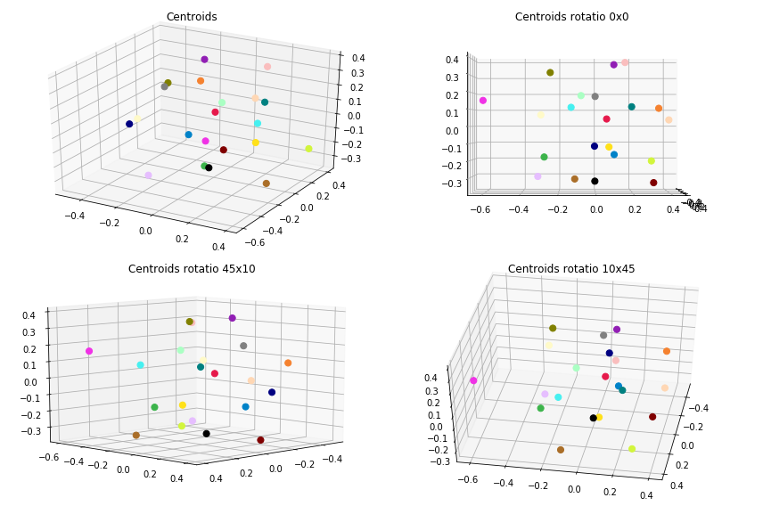
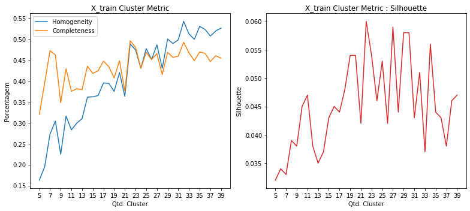
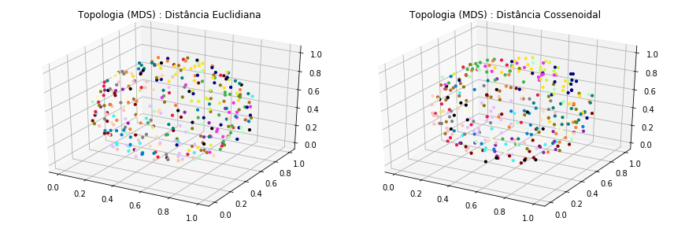
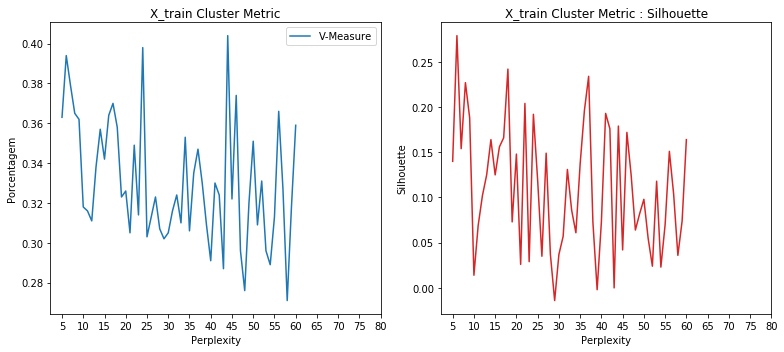
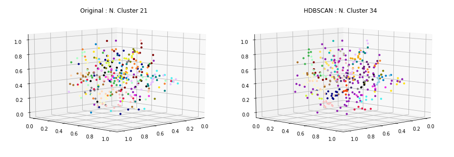
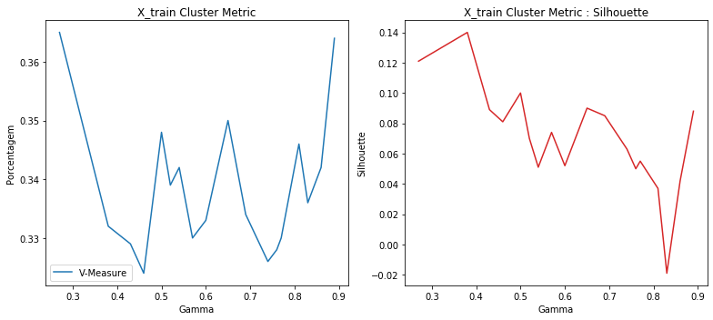
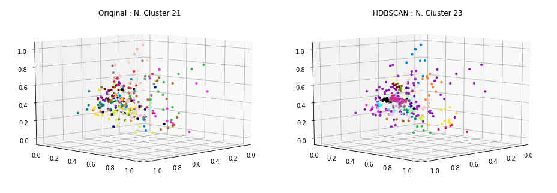
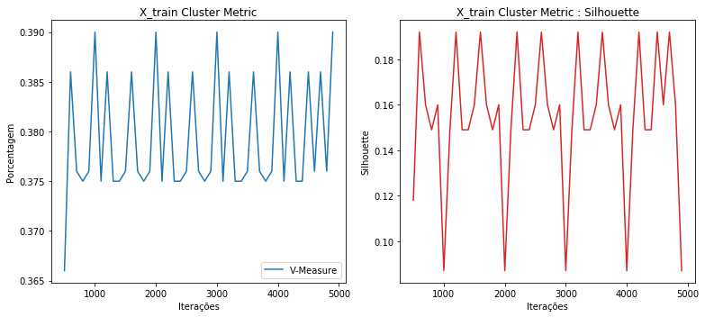
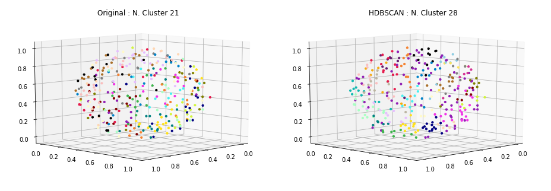

### Carregamento dos datasets

Os datasets de exemplos são frases já pré-categorizadas usadas em chatbots.

Contém 33 categorias e ao todo 696 documentos ou frases.

<table border="1" class="dataframe">
  <thead>
    <tr style="text-align: right;">
      <th></th>
      <th>perguntas</th>
      <th>cluster</th>
    </tr>
  </thead>
  <tbody>
    <tr>
      <th>41</th>
      <td>Se eu ativar roaming agora, já posso utilizar?</td>
      <td>ACTIVATE_ROAMING</td>
    </tr>
    <tr>
      <th>42</th>
      <td>Posso incluir roaming no meu plano por duas semanas?</td>
      <td>ACTIVATE_ROAMING</td>
    </tr>
    <tr>
      <th>110</th>
      <td>Eu gostaria de comprar um plano somente</td>
      <td>CHANGE_PRICE_PLAN</td>
    </tr>
    <tr>
      <th>153</th>
      <td>A desativação online está disponível para o meu telefone pré-pago?</td>
      <td>DEACTIVATE_PREPAID_PLAN</td>
    </tr>
    <tr>
      <th>170</th>
      <td>Como desativar a função roaming?</td>
      <td>DEACTIVATE_ROAMING</td>
    </tr>
    <tr>
      <th>198</th>
      <td>Quero informações sobre fazer ligações internacionais de casa</td>
      <td>INTERNATIONAL_RATE_PLAN_INQUIRY</td>
    </tr>
    <tr>
      <th>254</th>
      <td>Eu preciso do meu PUK para o meu celular, fiz uma tentativa on-line, mas a operadora não aceitou meu nome, data de nascimento e endereço de e-mail válidos.</td>
      <td>NETWORK_UNLOCK</td>
    </tr>
    <tr>
      <th>396</th>
      <td>Quem eu contato para mudar meu contrato do meu velho telefone para o meu novo telefone?</td>
      <td>SWAP_DEVICE</td>
    </tr>
    <tr>
      <th>406</th>
      <td>Meu roteador esta com uma luz vermelha</td>
      <td>TROUBLESHOOTING</td>
    </tr>
    <tr>
      <th>403</th>
      <td>Eu tenho um tablet novo que está reiniciando continuamente, como eu resolvo isso?/ como posso resolver isso? / como faço para resolver isso?</td>
      <td>TROUBLESHOOTING</td>
    </tr>
  </tbody>
</table>

    Qtde. de documentos por categoria:

<table border="1" class="dataframe">
  <thead>
    <tr style="text-align: right;">
      <th></th>
      <th>Categoria</th>
      <th>Qtde</th>
    </tr>
  </thead>
  <tbody>
    <tr>
      <th>0</th>
      <td>ACTIVATE_DEVICE</td>
      <td>19</td>
    </tr>
    <tr>
      <th>1</th>
      <td>ACTIVATE_PREPAID_PLAN</td>
      <td>21</td>
    </tr>
    <tr>
      <th>2</th>
      <td>ACTIVATE_ROAMING</td>
      <td>20</td>
    </tr>
    <tr>
      <th>3</th>
      <td>ADD_INSURANCE</td>
      <td>18</td>
    </tr>
    <tr>
      <th>4</th>
      <td>ADD_SERVICE_FEATURES</td>
      <td>20</td>
    </tr>
    <tr>
      <th>5</th>
      <td>CHANGE_PRICE_PLAN</td>
      <td>19</td>
    </tr>
    <tr>
      <th>6</th>
      <td>COVERAGE_AREA_INQUIRY</td>
      <td>19</td>
    </tr>
    <tr>
      <th>7</th>
      <td>DEACTIVATE_PREPAID_PLAN</td>
      <td>18</td>
    </tr>
    <tr>
      <th>8</th>
      <td>DEACTIVATE_ROAMING</td>
      <td>18</td>
    </tr>
    <tr>
      <th>9</th>
      <td>DEVICE_UPGRADE_ELIGIBILITY</td>
      <td>24</td>
    </tr>
    <tr>
      <th>10</th>
      <td>INTERNATIONAL_RATE_PLAN_INQUIRY</td>
      <td>21</td>
    </tr>
    <tr>
      <th>11</th>
      <td>NETWORK_COMPLAINTS</td>
      <td>23</td>
    </tr>
    <tr>
      <th>12</th>
      <td>NETWORK_UNLOCK</td>
      <td>21</td>
    </tr>
    <tr>
      <th>13</th>
      <td>PORT_IN</td>
      <td>21</td>
    </tr>
    <tr>
      <th>14</th>
      <td>PRICE_PLAN_INQUIRY</td>
      <td>23</td>
    </tr>
    <tr>
      <th>15</th>
      <td>RECHARGE_SIM</td>
      <td>18</td>
    </tr>
    <tr>
      <th>16</th>
      <td>REMOVE_SERVICE_FEATURES</td>
      <td>20</td>
    </tr>
    <tr>
      <th>17</th>
      <td>RETURN_DEVICE</td>
      <td>21</td>
    </tr>
    <tr>
      <th>18</th>
      <td>ROAMING_INQUIRY</td>
      <td>20</td>
    </tr>
    <tr>
      <th>19</th>
      <td>SWAP_DEVICE</td>
      <td>15</td>
    </tr>
    <tr>
      <th>20</th>
      <td>TROUBLESHOOTING</td>
      <td>19</td>
    </tr>
  </tbody>
</table>

    Total docs     : 418
    Total cluster  : 418
    X_train size   : (334,)
    X_test  size   : (84,)

### Dataset tokenization

    Tokenization...
    Qtd documentos treino:  334
    Qtd Intents treino   :  21
    Finished...

    ['trocar um planar conversacao direta um telefonar operador gratuitamente',
     'consultar valorar aplicar ligacoes internacional',
     'alterar configuracao roaming celular prepago exterior',
     'oi comprar um celular gostar trocar contar telefonar velho telefonar',
     'precisar mudar um dispositivo precisar voce ativar desativar atual',
     'detalhar planar preco atual cobrar',
     'precisar informacao cancelar roaming',
     'mudar empresar querer encontrar um planar prepago funcionar mim voce',
     'nao receber sinal edificio',
     'poder compartilhar algum informacao cobertura redar']

### **TF-IDF**

Validação do modelo gerado pelo TF-IDF... teste tanto nos dados apresentados para treinamento quanto nos dados de testes e as acurácias alcançadas.

    - Acurácia treino: 99.0
    --------------------
     - Acurácia teste 1  : 42.86
     - Acurácia teste 2  : 42.86
     - Acurácia teste 3  : 42.86
     - Acurácia teste 4  : 42.86
     - Acurácia teste 5  : 42.86
    - Acurácia média teste: 42.86

### Clusterização

Utilizou-se o KMeans definindo a quantidade de clusters para o número ideal de categorias existentes no caso 33. A métrica de distância utilizada, não foi a euclidiana, mas sim a de cosseno (métrica comumente usada na classificação de texto em seu espaço vetorial).

    Frases por cluster:

<table border="1" class="dataframe">
  <thead>
    <tr style="text-align: right;">
      <th>title</th>
      <th>cluster</th>
    </tr>
  </thead>
  <tbody>
    <tr>
      <td>Por favor, garanta-me que meu telefone funciona somente nos Estados Unidos.</td>
      <td>0</td>
    </tr>
    <tr>
      <td>Estive com esta empresa por 12 meses, posso obter um novo aparelho por um bom preço?</td>
      <td>0</td>
    </tr>
    <tr>
      <td>Eu estou com outra empresa agora, mas quero mudar para vocês. É possível manter meu número de telefone atual?</td>
      <td>1</td>
    </tr>
    <tr>
      <td>Eu tenho um dispositivo antigo e novo e quero mudar meu serviço do meu antigo para o meu novo</td>
      <td>1</td>
    </tr>
    <tr>
      <td>Quero adicionar minutos à minha subscrição.</td>
      <td>2</td>
    </tr>
    <tr>
      <td>Como você desbloqueia o seu novo aparelho? Você usa o mesmo SIM que no seu aparelho anterior?</td>
      <td>2</td>
    </tr>
    <tr>
      <td>Vou incorrer taxas extras usando meu telefone pré-pago em outro país?</td>
      <td>3</td>
    </tr>
    <tr>
      <td>Vou ter que pagar taxas de roaming quando usar o meu telefone no exterior?</td>
      <td>3</td>
    </tr>
    <tr>
      <td>Gostaria de alterar meu plano de preços. Você pode listar opções de planos de preços que têm conversas e textos ilimitados?</td>
      <td>4</td>
    </tr>
    <tr>
      <td>Logo precisarei fazer várias ligações internacionais do meu país. Onde posso encontrar, ou como posso ter uma lista completa com todos os preços possíveis indicados?</td>
      <td>4</td>
    </tr>
    <tr>
      <td>O cliente deseja ter o seu serviço desbloqueado</td>
      <td>5</td>
    </tr>
    <tr>
      <td>Preciso apresentar algum documento para utilizar o seguro do meu aparelho?</td>
      <td>5</td>
    </tr>
    <tr>
      <td>Estou tendo problemas ao desativar o meu dispositivo pré-pago. Existe um FAQ disponível para me explicar isso passo a passo?</td>
      <td>6</td>
    </tr>
    <tr>
      <td>Como posso desativar o serviço no meu dispositivo pré-pago que é novo?</td>
      <td>6</td>
    </tr>
    <tr>
      <td>Qual é o plano de dados que estou na ativa?</td>
      <td>7</td>
    </tr>
    <tr>
      <td>Como faço para ativar roaming para que eu possa usar dados quando estiver na Flórida?</td>
      <td>7</td>
    </tr>
    <tr>
      <td>Qual é o custo do custo de usar o meu telefone pré-pago no exterior seria?</td>
      <td>8</td>
    </tr>
    <tr>
      <td>Quais os meios de cancelamento do meu plano pré-pago?</td>
      <td>8</td>
    </tr>
    <tr>
      <td>Teria sido muito difícil para me alertarem que uma mudança de planos me faria perder a minha atualização? Isso é imperdoável.</td>
      <td>9</td>
    </tr>
    <tr>
      <td>Quero registrar o meu chip e o telefone novo</td>
      <td>9</td>
    </tr>
    <tr>
      <td>Tenho usado o meu celular menos desde o ano passado, então eu gostaria de ter melhores planos de preços que atendam às minhas necessidades.</td>
      <td>10</td>
    </tr>
    <tr>
      <td>Eu gostaria de incluir texto de mensagem para o meu plano, pode fazer isso por mim?</td>
      <td>10</td>
    </tr>
    <tr>
      <td>Eu quero obter o telefone preto em vez do telefone prateado que eu pedi</td>
      <td>11</td>
    </tr>
    <tr>
      <td>Eu pedi para manter meu número antigo enviado isso on-line na noite de sexta-feira, logo após a meia-noite ainda meu número não foi transferido</td>
      <td>11</td>
    </tr>
    <tr>
      <td>Quanto custará aumentar a velocidade da minha internet para 1GB?</td>
      <td>12</td>
    </tr>
    <tr>
      <td>Qual é a razão do meu celular sempre ter uma taxa de acesso à Internet lenta?</td>
      <td>12</td>
    </tr>
    <tr>
      <td>Oi, já que você está aqui, está havendo algum problema com a cobertura na área de SP? Desde ontem o meu sinal normal de 4 barras ficou em 0, está bem em outros lugares.</td>
      <td>13</td>
    </tr>
    <tr>
      <td>Há certas partes na minha cidade onde eu não tenho sinal. Pode me dizer qual poderia ser o motivo?</td>
      <td>13</td>
    </tr>
    <tr>
      <td>Eu estive dirigido muito recentemente e foi praticamente impossível usar o serviço em algumas áreas. Você poderia me fornecer uma lista de locais / áreas com pouca ou nenhuma recepção?</td>
      <td>14</td>
    </tr>
    <tr>
      <td>Quanto da área total no meu país é coberta pela recepção?</td>
      <td>14</td>
    </tr>
    <tr>
      <td>Você pode por favor fornecer-me com informações sobre os diferentes planos que estão disponíveis?</td>
      <td>15</td>
    </tr>
    <tr>
      <td>Qual é o processo para retornar o produto para uma loja?</td>
      <td>15</td>
    </tr>
    <tr>
      <td>Meu telefone não faz nem recebe mais nenhuma chamada.</td>
      <td>16</td>
    </tr>
    <tr>
      <td>Oi. Tenho um sinal forte, mas não consigo fazer ou receber chamadas. Você pode me ajudar a ver como resolver esse problema?</td>
      <td>16</td>
    </tr>
    <tr>
      <td>Não uso o serviço de chamada em conferência associado à minha conta. Posso encerrar esse serviço e removê-lo da minha conta?</td>
      <td>17</td>
    </tr>
    <tr>
      <td>Gostaria de falar com um representante de serviço ao cliente para saber sobre a adição de novos serviços ao meu plano.</td>
      <td>17</td>
    </tr>
    <tr>
      <td>Como poderia ter meu correio de voz permanentemente removido do meu plano?</td>
      <td>18</td>
    </tr>
    <tr>
      <td>Cancelar o serviço de roaming</td>
      <td>18</td>
    </tr>
    <tr>
      <td>Quando meu produto solicitado será ativado?</td>
      <td>19</td>
    </tr>
    <tr>
      <td>O usuário deseja ativar o roaming internacional.</td>
      <td>19</td>
    </tr>
    <tr>
      <td>Adicionar uma quantidade de minutos ao meu pré-pago.</td>
      <td>20</td>
    </tr>
    <tr>
      <td>Se eu recarregar R$ 50, o que eu ganho?</td>
      <td>20</td>
    </tr>
  </tbody>
</table>

    --------------------
    Documentos por cluster:

<table border="1" class="dataframe">
  <tbody>
    <tr>
      <td>C0</td>
      <td>46</td>
    </tr>
    <tr>
      <td>C1</td>
      <td>20</td>
    </tr>
    <tr>
      <td>C2</td>
      <td>20</td>
    </tr>
    <tr>
      <td>C3</td>
      <td>19</td>
    </tr>
    <tr>
      <td>C4</td>
      <td>11</td>
    </tr>
    <tr>
      <td>C5</td>
      <td>24</td>
    </tr>
    <tr>
      <td>C6</td>
      <td>19</td>
    </tr>
    <tr>
      <td>C7</td>
      <td>5</td>
    </tr>
    <tr>
      <td>C8</td>
      <td>8</td>
    </tr>
    <tr>
      <td>C9</td>
      <td>11</td>
    </tr>
    <tr>
      <td>C10</td>
      <td>19</td>
    </tr>
    <tr>
      <td>C11</td>
      <td>6</td>
    </tr>
    <tr>
      <td>C12</td>
      <td>8</td>
    </tr>
    <tr>
      <td>C13</td>
      <td>9</td>
    </tr>
    <tr>
      <td>C14</td>
      <td>8</td>
    </tr>
    <tr>
      <td>C15</td>
      <td>22</td>
    </tr>
    <tr>
      <td>C16</td>
      <td>15</td>
    </tr>
    <tr>
      <td>C17</td>
      <td>11</td>
    </tr>
    <tr>
      <td>C18</td>
      <td>14</td>
    </tr>
    <tr>
      <td>C19</td>
      <td>26</td>
    </tr>
    <tr>
      <td>C20</td>
      <td>13</td>
    </tr>
  </tbody>
</table>

### Visualização

Apresentação dos protótipos gerados pelo KMeans, reduzindo a dimensão usando o algoritmo MDS (Multidimensional Scaling).

### Clusterização dos dados de Teste

Por fim, realizada a clusterização dos dados de teste e a apresentação das 8 primeiras frases do conjunto de teste juntamente com outras duas frases do cluster ao qual foi identificado como o melhor.

    * Eu não quero mais usar meu telefone pré-pago atual.
      -  Meu telefone não faz nem recebe mais nenhuma chamada.
      -  Oi. Tenho um sinal forte, mas não consigo fazer ou receber chamadas. Você pode me ajudar a ver como resolver esse problema?
    --------------------
    * Isso vai funcionar em todos os lugares?
      -  Qual é a razão do meu celular sempre ter uma taxa de acesso à Internet lenta?
      -  Quanto custará aumentar a velocidade da minha internet para 1GB?
    --------------------
    * Verificar o status da devolução
      -  Eu gostaria de incluir texto de mensagem para o meu plano, pode fazer isso por mim?
      -  Tenho usado o meu celular menos desde o ano passado, então eu gostaria de ter melhores planos de preços que atendam às minhas necessidades.
    --------------------
    * Meu telefone está velho. Posso pegar uma atualização gratuita.
      -  Teria sido muito difícil para me alertarem que uma mudança de planos me faria perder a minha atualização? Isso é imperdoável.
      -  Quero registrar o meu chip e o telefone novo
    --------------------
    * O que vai custar menos ficar no meu plano atual ou mudar para o novo?
      -  Qual é o custo do custo de usar o meu telefone pré-pago no exterior seria?
      -  Quais os meios de cancelamento do meu plano pré-pago?
    --------------------
    * Posso transferir meus dados quando troco telefones?
      -  Estou tendo problemas ao desativar o meu dispositivo pré-pago. Existe um FAQ disponível para me explicar isso passo a passo?
      -  Como posso desativar o serviço no meu dispositivo pré-pago que é novo?
    --------------------
    * Você pode por favor me dizer se eu sou elegível para atualizar meu celular de graça? Caso contrário, em que data serei elegível para fazê-lo?
      -  Por favor, garanta-me que meu telefone funciona somente nos Estados Unidos.
      -  Estive com esta empresa por 12 meses, posso obter um novo aparelho por um bom preço?
    --------------------
    * Eu pedi o plano errado. Você poderia mudar isso para o plano de R$ 50?
      -  Eu pedi para manter meu número antigo enviado isso on-line na noite de sexta-feira, logo após a meia-noite ainda meu número não foi transferido
      -  Eu quero obter o telefone preto em vez do telefone prateado que eu pedi
    --------------------

### Métricas

Abaixo são apresentadas métricas para demonstrar o quanto a clusterização parece funcionar.

    Homogeneidade    :  0.585
    Completude       :  0.606
    V-Measure        :  0.596
    Silhouette       :  -0.031

### HDBSCAN no espaço dos dados

    Frases por cluster:

<table border="1" class="dataframe">
  <thead>
    <tr style="text-align: right;">
      <th>title</th>
      <th>cluster</th>
    </tr>
  </thead>
  <tbody>
    <tr>
      <td>Você pode me dizer por que nunca tenho sinal no meu telefone quando estou no trabalho, mas não tenho problema em nenhum outro lugar?</td>
      <td>0</td>
    </tr>
    <tr>
      <td>Posso excluir o envio de sms?</td>
      <td>0</td>
    </tr>
    <tr>
      <td>Estou indo para uma viagem ao extremo norte da Ilha de Vancouver e gostaria de verificar se há serviço de celular nessa área. Você pode verificar o quanto longe do norte eu posso esperar para receber a recepção.</td>
      <td>0</td>
    </tr>
    <tr>
      <td>Você pode por favor fornecer-me com informações sobre os diferentes planos que estão disponíveis?</td>
      <td>1</td>
    </tr>
    <tr>
      <td>Que planos estão disponíveis para chamada e dados Internacional?</td>
      <td>1</td>
    </tr>
    <tr>
      <td>Você poderia me falar sobre os diferentes planos de preços disponíveis na minha localização?</td>
      <td>1</td>
    </tr>
    <tr>
      <td>Você pode me dizer como posso adicionar minutos ao meu telefone pré-pago?</td>
      <td>2</td>
    </tr>
    <tr>
      <td>Quero adicionar minutos à minha subscrição.</td>
      <td>2</td>
    </tr>
    <tr>
      <td>Como adiciono minutos?</td>
      <td>2</td>
    </tr>
    <tr>
      <td>Você poderia me ajudar em como mudar o toque do meu telefone?</td>
      <td>3</td>
    </tr>
    <tr>
      <td>Quero mudar os provedores de serviço, ainda posso manter meu mesmo número de telefone?</td>
      <td>3</td>
    </tr>
    <tr>
      <td>Olá, quero saber se posso ficar com meu telefone se eu decidir mudar de provedor.</td>
      <td>3</td>
    </tr>
    <tr>
      <td>Eu preciso de ajuda para manter o meu número antigo enquanto mudo de fornecedores.</td>
      <td>4</td>
    </tr>
    <tr>
      <td>Como faço para transferir o serviço de um dispositivo antigo para um novo?</td>
      <td>4</td>
    </tr>
    <tr>
      <td>Eu gostaria de transferir o serviço em meu novo telefone por favor</td>
      <td>4</td>
    </tr>
    <tr>
      <td>Sabe quando serei elegível de ter um upgrade de dispositivo?</td>
      <td>5</td>
    </tr>
    <tr>
      <td>Oi! Este telefone tem seguro? Posso fazer o seguro para este telefone eu mesmo?</td>
      <td>5</td>
    </tr>
    <tr>
      <td>Eu gostaria de segurar meu telefone. Pode me ajudar com isso?</td>
      <td>5</td>
    </tr>
    <tr>
      <td>As chamadas internacionais estão incluídas no meu plano?</td>
      <td>6</td>
    </tr>
    <tr>
      <td>Eu gostaria de incluir SMS no meu telefone em serviços. Como faço isso?</td>
      <td>6</td>
    </tr>
    <tr>
      <td>Ei, posso incluir chamada internacional por favor</td>
      <td>6</td>
    </tr>
    <tr>
      <td>Como cancelo meu serviço de telefone pré-pago?</td>
      <td>7</td>
    </tr>
    <tr>
      <td>Cancelar o serviço de roaming</td>
      <td>7</td>
    </tr>
    <tr>
      <td>Preciso de informações em como cancelar o roaming</td>
      <td>7</td>
    </tr>
    <tr>
      <td>Meu novo telefone não está desbloqueado ainda. Quem pode me ajudar com este problema?</td>
      <td>8</td>
    </tr>
    <tr>
      <td>Estou tendo um problema com o meu telefone. Não consigo fazer ou receber chamadas! Eu preciso de ajuda!</td>
      <td>8</td>
    </tr>
    <tr>
      <td>Eu não sei como desbloquear o meu novo dispositivo. Pode me dizer como?</td>
      <td>8</td>
    </tr>
    <tr>
      <td>Qual a carência para desativar o roaming?</td>
      <td>9</td>
    </tr>
    <tr>
      <td>Eu preciso de ajuda para desativar meu celular pré-pago.</td>
      <td>9</td>
    </tr>
    <tr>
      <td>Como posso desativar o roaming de dados em meu telefone?</td>
      <td>9</td>
    </tr>
    <tr>
      <td>Qual é o plano de dados que estou na ativa?</td>
      <td>10</td>
    </tr>
    <tr>
      <td>Desde que não uso meus dados muito, posso mudar para um de plano apenas 1 GB de dados.</td>
      <td>10</td>
    </tr>
    <tr>
      <td>Meu aparelho já vem com roaming de dados ativado?</td>
      <td>10</td>
    </tr>
    <tr>
      <td>Qual o preço para ativar o roaming?</td>
      <td>11</td>
    </tr>
    <tr>
      <td>Eu gostaria de saber sobre os encargos de roaming internacional e como ativar isto.</td>
      <td>11</td>
    </tr>
    <tr>
      <td>Como posso ativar o roaming internacional, por favor?</td>
      <td>11</td>
    </tr>
  </tbody>
</table>

    --------------------
    Documentos por cluster:

<table border="1" class="dataframe">
  <tbody>
    <tr>
      <td>C0</td>
      <td>232</td>
    </tr>
    <tr>
      <td>C1</td>
      <td>5</td>
    </tr>
    <tr>
      <td>C2</td>
      <td>5</td>
    </tr>
    <tr>
      <td>C3</td>
      <td>9</td>
    </tr>
    <tr>
      <td>C4</td>
      <td>8</td>
    </tr>
    <tr>
      <td>C5</td>
      <td>20</td>
    </tr>
    <tr>
      <td>C6</td>
      <td>6</td>
    </tr>
    <tr>
      <td>C7</td>
      <td>7</td>
    </tr>
    <tr>
      <td>C8</td>
      <td>19</td>
    </tr>
    <tr>
      <td>C9</td>
      <td>13</td>
    </tr>
    <tr>
      <td>C10</td>
      <td>5</td>
    </tr>
    <tr>
      <td>C11</td>
      <td>5</td>
    </tr>
  </tbody>
</table>

### Topologia dos dados de treinamento usando MDS

## **HDBSCAN**

 - [How HDBSCAN Works](https://nbviewer.jupyter.org/github/scikit-learn-contrib/hdbscan/blob/master/notebooks/How%20HDBSCAN%20Works.ipynb)
 - [hdbscan github implementation](https://github.com/scikit-learn-contrib/hdbscan)
 - [Density-Based Clustering Based on Hierarchical Density Estimates](https://link.springer.com/chapter/10.1007/978-3-642-37456-2_14)

---

## **t-SNE + HDBSCAN**

<table border="1" class="dataframe">
  <thead>
    <tr style="text-align: right;">
      <th></th>
      <th>Perplexity</th>
      <th>Learning Rate</th>
      <th>Angle</th>
      <th>V-Measure</th>
      <th>Silhouette</th>
    </tr>
  </thead>
  <tbody>
    <tr>
      <th>1</th>
      <td>6</td>
      <td>150</td>
      <td>0.79</td>
      <td>0.394</td>
      <td>0.279</td>
    </tr>
    <tr>
      <th>13</th>
      <td>18</td>
      <td>135</td>
      <td>0.89</td>
      <td>0.358</td>
      <td>0.242</td>
    </tr>
    <tr>
      <th>32</th>
      <td>37</td>
      <td>121</td>
      <td>0.89</td>
      <td>0.347</td>
      <td>0.234</td>
    </tr>
    <tr>
      <th>3</th>
      <td>8</td>
      <td>135</td>
      <td>0.89</td>
      <td>0.365</td>
      <td>0.227</td>
    </tr>
    <tr>
      <th>17</th>
      <td>22</td>
      <td>164</td>
      <td>0.88</td>
      <td>0.349</td>
      <td>0.204</td>
    </tr>
    <tr>
      <th>31</th>
      <td>36</td>
      <td>150</td>
      <td>0.79</td>
      <td>0.335</td>
      <td>0.196</td>
    </tr>
    <tr>
      <th>36</th>
      <td>41</td>
      <td>153</td>
      <td>0.88</td>
      <td>0.330</td>
      <td>0.193</td>
    </tr>
    <tr>
      <th>19</th>
      <td>24</td>
      <td>52</td>
      <td>0.85</td>
      <td>0.398</td>
      <td>0.192</td>
    </tr>
    <tr>
      <th>4</th>
      <td>9</td>
      <td>113</td>
      <td>0.86</td>
      <td>0.362</td>
      <td>0.188</td>
    </tr>
    <tr>
      <th>39</th>
      <td>44</td>
      <td>52</td>
      <td>0.85</td>
      <td>0.404</td>
      <td>0.179</td>
    </tr>
    <tr>
      <th>37</th>
      <td>42</td>
      <td>164</td>
      <td>0.88</td>
      <td>0.324</td>
      <td>0.176</td>
    </tr>
    <tr>
      <th>41</th>
      <td>46</td>
      <td>93</td>
      <td>0.86</td>
      <td>0.374</td>
      <td>0.172</td>
    </tr>
    <tr>
      <th>12</th>
      <td>17</td>
      <td>121</td>
      <td>0.89</td>
      <td>0.370</td>
      <td>0.166</td>
    </tr>
    <tr>
      <th>9</th>
      <td>14</td>
      <td>52</td>
      <td>0.85</td>
      <td>0.357</td>
      <td>0.164</td>
    </tr>
    <tr>
      <th>55</th>
      <td>60</td>
      <td>116</td>
      <td>0.83</td>
      <td>0.359</td>
      <td>0.164</td>
    </tr>
    <tr>
      <th>11</th>
      <td>16</td>
      <td>150</td>
      <td>0.79</td>
      <td>0.364</td>
      <td>0.156</td>
    </tr>
    <tr>
      <th>2</th>
      <td>7</td>
      <td>121</td>
      <td>0.89</td>
      <td>0.379</td>
      <td>0.154</td>
    </tr>
    <tr>
      <th>51</th>
      <td>56</td>
      <td>93</td>
      <td>0.86</td>
      <td>0.366</td>
      <td>0.151</td>
    </tr>
    <tr>
      <th>22</th>
      <td>27</td>
      <td>121</td>
      <td>0.89</td>
      <td>0.323</td>
      <td>0.149</td>
    </tr>
    <tr>
      <th>15</th>
      <td>20</td>
      <td>207</td>
      <td>0.87</td>
      <td>0.326</td>
      <td>0.148</td>
    </tr>
    <tr>
      <th>0</th>
      <td>5</td>
      <td>157</td>
      <td>0.89</td>
      <td>0.363</td>
      <td>0.140</td>
    </tr>
    <tr>
      <th>30</th>
      <td>35</td>
      <td>157</td>
      <td>0.89</td>
      <td>0.306</td>
      <td>0.137</td>
    </tr>
    <tr>
      <th>27</th>
      <td>32</td>
      <td>164</td>
      <td>0.88</td>
      <td>0.324</td>
      <td>0.131</td>
    </tr>
    <tr>
      <th>8</th>
      <td>13</td>
      <td>145</td>
      <td>0.89</td>
      <td>0.338</td>
      <td>0.125</td>
    </tr>
    <tr>
      <th>42</th>
      <td>47</td>
      <td>148</td>
      <td>0.84</td>
      <td>0.296</td>
      <td>0.125</td>
    </tr>
  </tbody>
</table>

    Homogeneidade    :  0.404
    Completude       :  0.385
    V-Measure        :  0.394
    Silhouette       :  0.279

    Frases por cluster:

<table border="1" class="dataframe">
  <thead>
    <tr style="text-align: right;">
      <th>title</th>
      <th>cluster</th>
    </tr>
  </thead>
  <tbody>
    <tr>
      <td>Bom dia, eu me pergunto se você gostaria de saber quais são as áreas de cobertura da companhia telefônica?</td>
      <td>0</td>
    </tr>
    <tr>
      <td>Eu preciso do meu PUK para o meu celular, fiz uma tentativa on-line, mas a operadora não aceitou meu nome, data de nascimento e endereço de e-mail válidos.</td>
      <td>0</td>
    </tr>
    <tr>
      <td>Eu tenho algumas perguntas sobre roaming.</td>
      <td>0</td>
    </tr>
    <tr>
      <td>Eu fui cobrada pelo serviço de identificação de chamadas que eu solicitei especificamente para não ter. Você pode remover o serviço e reembolsar a cobrança?</td>
      <td>1</td>
    </tr>
    <tr>
      <td>Eu quero saber as tarifas de roaming europeu</td>
      <td>1</td>
    </tr>
    <tr>
      <td>Quero adicionar minutos à minha subscrição.</td>
      <td>1</td>
    </tr>
    <tr>
      <td>Eu estive dirigido muito recentemente e foi praticamente impossível usar o serviço em algumas áreas. Você poderia me fornecer uma lista de locais / áreas com pouca ou nenhuma recepção?</td>
      <td>2</td>
    </tr>
    <tr>
      <td>Onde consulto os valores aplicados para ligacoes internacionais?</td>
      <td>2</td>
    </tr>
    <tr>
      <td>Eu vou estar viajando e estou certo se minha empresa fornece cobertura de telefone na minha área de viagens. Poderia me dar informações sobre onde o serviço e recepção estará disponível?</td>
      <td>2</td>
    </tr>
    <tr>
      <td>Há alguma limitação quanto aos países no exterior que eu posso chamar e acessar do meu país de origem?</td>
      <td>3</td>
    </tr>
    <tr>
      <td>Quais são os custos de fazer ligações internacionais do meu país?</td>
      <td>3</td>
    </tr>
    <tr>
      <td>Como posso fazer uma ligação internacional do meu país de origem?</td>
      <td>3</td>
    </tr>
    <tr>
      <td>Qual plano de dados é o menos caro para mim?</td>
      <td>4</td>
    </tr>
    <tr>
      <td>Em caso de sinistro em quanto tempo posso pegar outro aparelho?</td>
      <td>4</td>
    </tr>
    <tr>
      <td>Meu WiFi não é acessível em toda a minha casa. A casa é pequena e o alcance do dispositivo deveria ser suficiente.</td>
      <td>4</td>
    </tr>
    <tr>
      <td>Oi Tom, como posso transferir meu número de telefone da antiga operadora para a minha nova linha com vocês?</td>
      <td>5</td>
    </tr>
    <tr>
      <td>Eu gostaria de transferir o serviço em meu novo telefone por favor</td>
      <td>5</td>
    </tr>
    <tr>
      <td>Como posso devolver meu dispositivo de troca para o outra promoção? Não recebi nenhuma embalagem de retorno.</td>
      <td>5</td>
    </tr>
    <tr>
      <td>Oi, a velocidade de dados no meu dispositivo ainda está muito abaixo dos níveis anunciados. Isso já está acontecendo por dois meses agora. Como serei compensado por isso? Estou pensando em mudar de novo. Isto é uma quebra de contrato.</td>
      <td>6</td>
    </tr>
    <tr>
      <td>Eu quero colocar tempo de conversação no meu telefone.</td>
      <td>6</td>
    </tr>
    <tr>
      <td>Desde que não uso meus dados muito, posso mudar para um de plano apenas 1 GB de dados.</td>
      <td>6</td>
    </tr>
    <tr>
      <td>Por que a sinal da operadora em São Paulo está tão ruim?</td>
      <td>7</td>
    </tr>
    <tr>
      <td>Posso incluir roaming no meu plano por duas semanas?</td>
      <td>7</td>
    </tr>
    <tr>
      <td>Meu novo telefone não está desbloqueado ainda. Quem pode me ajudar com este problema?</td>
      <td>7</td>
    </tr>
    <tr>
      <td>Eu disse que recebi um novo sim e gostaria de compartilhar o código de pac do meu número atual com você.</td>
      <td>8</td>
    </tr>
    <tr>
      <td>Você pode me informar sobre cobranças internacionais adicionais?</td>
      <td>8</td>
    </tr>
    <tr>
      <td>Por favor adicione o roaming internacional na minha conta.</td>
      <td>8</td>
    </tr>
    <tr>
      <td>Indique quanto tempo eu aguardo para mudar meu telefone para um modelo mais novo</td>
      <td>9</td>
    </tr>
    <tr>
      <td>Olá, quero saber se posso ficar com meu telefone se eu decidir mudar de provedor.</td>
      <td>9</td>
    </tr>
    <tr>
      <td>Quero mudar os provedores de serviço, ainda posso manter meu mesmo número de telefone?</td>
      <td>9</td>
    </tr>
    <tr>
      <td>Quanto custa enviar uma mensagem de texto internacionalmente?</td>
      <td>10</td>
    </tr>
    <tr>
      <td>Quero poder encaminhar chamadas do meu telefone, como posso adicionar esse recurso ao meu plano atual?</td>
      <td>10</td>
    </tr>
    <tr>
      <td>Oi, eu estava esperando que você pudesse me dizer como adicionar o recurso de mensagens de texto ao meu plano?</td>
      <td>10</td>
    </tr>
    <tr>
      <td>Posso remover um novo recurso no meu plano?</td>
      <td>11</td>
    </tr>
    <tr>
      <td>Posso trocar meu equipamento para o mais recente e o melhor disponível?</td>
      <td>11</td>
    </tr>
    <tr>
      <td>Oi, como posso ativar o encaminhamento de chamada no meu plano?</td>
      <td>11</td>
    </tr>
    <tr>
      <td>Quando é o último dia que posso devolver meu telefone?</td>
      <td>12</td>
    </tr>
    <tr>
      <td>Gostaria de verificar todas as taxas para cobertura internacional</td>
      <td>12</td>
    </tr>
    <tr>
      <td>Estou tendo problemas ativando meu dispositivo pré-pago. Existe um FAQ disponível para me explicar isso passo a passo?</td>
      <td>12</td>
    </tr>
    <tr>
      <td>Como posso registrar um cartão SIM?</td>
      <td>13</td>
    </tr>
    <tr>
      <td>Como posso desbloquear meu novo aparelho? Tenho que usar o mesmo cartão SIM do meu telefone antigo?</td>
      <td>13</td>
    </tr>
    <tr>
      <td>Como posso adicionar meus serviços de telefone do meu dispositivo móvel antigo para o novo?</td>
      <td>13</td>
    </tr>
    <tr>
      <td>Quero desbloquear o meu novo telefone. Como faço isso?</td>
      <td>14</td>
    </tr>
    <tr>
      <td>Tenho um sim card pré-pago e preciso ativar</td>
      <td>14</td>
    </tr>
    <tr>
      <td>Favor realizar a ativação do meu SIM card</td>
      <td>14</td>
    </tr>
    <tr>
      <td>Como posso ativar o roaming internacional, por favor?</td>
      <td>15</td>
    </tr>
    <tr>
      <td>Oi, estou mesmo querendo uma recarga no meu celular. Você pode por favor ajudar, diz que eu não tenho crédito.</td>
      <td>15</td>
    </tr>
    <tr>
      <td>Preciso mudar para um novo dispositivo e preciso que você o ative depois de desativar o meu atual.</td>
      <td>15</td>
    </tr>
    <tr>
      <td>Oi, já que você está aqui, está havendo algum problema com a cobertura na área de SP? Desde ontem o meu sinal normal de 4 barras ficou em 0, está bem em outros lugares.</td>
      <td>16</td>
    </tr>
    <tr>
      <td>Pode me dar os detalhes do plano de preços atual pelo qual estão me cobrando?</td>
      <td>16</td>
    </tr>
    <tr>
      <td>Estou tendo um problema em contato com o suporte. Eu estava em espera por 45 minutos e finalmente desisti. Se eu deixar um número, é possível receber uma chamada em retorno?</td>
      <td>16</td>
    </tr>
    <tr>
      <td>Eu preciso de ajuda para manter o meu número antigo enquanto mudo de fornecedores.</td>
      <td>17</td>
    </tr>
    <tr>
      <td>Por favor, garanta-me que meu telefone funciona somente nos Estados Unidos.</td>
      <td>17</td>
    </tr>
    <tr>
      <td>Qual é a área de cobertura e confiabilidade de recepção?</td>
      <td>17</td>
    </tr>
    <tr>
      <td>Eu tenho um plano com outra empresa. Posso manter meu número?</td>
      <td>18</td>
    </tr>
    <tr>
      <td>Você pode me dizer como posso retornar meu telefone atual para uma atualização?</td>
      <td>18</td>
    </tr>
    <tr>
      <td>Eu estou com outra empresa agora, mas quero mudar para vocês. É possível manter meu número de telefone atual?</td>
      <td>18</td>
    </tr>
    <tr>
      <td>Eu não posso recarregar porque diz que meu sim está desativado , meu sim pode ser ativado?</td>
      <td>19</td>
    </tr>
    <tr>
      <td>Gostaria de alterar meu plano de preços. Você pode listar opções de planos de preços que têm conversas e textos ilimitados?</td>
      <td>19</td>
    </tr>
    <tr>
      <td>Como adiciono minutos?</td>
      <td>19</td>
    </tr>
    <tr>
      <td>Por favor, eu preciso de uma maneira fácil de recarregar.</td>
      <td>20</td>
    </tr>
    <tr>
      <td>Como podemos fazer uma mudança no plano de preços em nossos dispositivos?</td>
      <td>20</td>
    </tr>
    <tr>
      <td>Recentemente, comprei um novo dispositivo, mas não tenho ideia de como eu deveria ativá-lo. Você pode me ajudar?</td>
      <td>20</td>
    </tr>
    <tr>
      <td>Existe uma maneira de obter informações precisas sobre a área de cobertura e a qualidade da chamada esperada em cada área respectiva?</td>
      <td>21</td>
    </tr>
    <tr>
      <td>Você pode me dizer por que nunca tenho sinal no meu telefone quando estou no trabalho, mas não tenho problema em nenhum outro lugar?</td>
      <td>21</td>
    </tr>
    <tr>
      <td>Eu não recebo sinal quando estou no Edifício 32.</td>
      <td>21</td>
    </tr>
    <tr>
      <td>O equipamento deve ser devolvido à empresa quando você cancela o meu serviço?</td>
      <td>22</td>
    </tr>
    <tr>
      <td>Minha bateria esgotou rapidamente</td>
      <td>22</td>
    </tr>
    <tr>
      <td>O serviço de roaming é ativado automaticamente ou eu preciso ativá-lo manualmente?</td>
      <td>22</td>
    </tr>
    <tr>
      <td>Vou viajar para o exterior, quero desativar o roaming.</td>
      <td>23</td>
    </tr>
    <tr>
      <td>Desativar meu dispositivo quando no exterior</td>
      <td>23</td>
    </tr>
    <tr>
      <td>Preciso desconectar uma das minhas linhas telefônicas. Posso fazer isso por telefone?</td>
      <td>23</td>
    </tr>
    <tr>
      <td>Eu gostaria de cancelar os correios de voz Visual no meu telefone</td>
      <td>24</td>
    </tr>
    <tr>
      <td>Como um cliente de longo prazo, você pode me dizer quais os descontos que posso receber em minhas cobranças?</td>
      <td>24</td>
    </tr>
    <tr>
      <td>Vou ter que pagar taxas de roaming quando usar o meu telefone no exterior?</td>
      <td>24</td>
    </tr>
    <tr>
      <td>Cancelar o serviço de roaming</td>
      <td>25</td>
    </tr>
    <tr>
      <td>Qual é o custo do custo de usar o meu telefone pré-pago no exterior seria?</td>
      <td>25</td>
    </tr>
    <tr>
      <td>Você pode me enviar uma nova cópia da minha conta?</td>
      <td>25</td>
    </tr>
    <tr>
      <td>Posso excluir o envio de sms?</td>
      <td>26</td>
    </tr>
    <tr>
      <td>Preciso de informações em como cancelar o roaming</td>
      <td>26</td>
    </tr>
    <tr>
      <td>Sim eu quero desativar o roaming no meu número de telefone</td>
      <td>26</td>
    </tr>
    <tr>
      <td>A portabilidade possui alguma cobranca?</td>
      <td>27</td>
    </tr>
    <tr>
      <td>Eu gostaria de incluir chamada esperando meu plano de serviço. Quanto custa, e quando poderia ser incluído?</td>
      <td>27</td>
    </tr>
    <tr>
      <td>Chamadas feitas enquanto estou viajando no exterior estão incluídas no meu plano?</td>
      <td>27</td>
    </tr>
    <tr>
      <td>Eu preciso obter um plano maior. Eu posso obter algumas cotações de preço</td>
      <td>28</td>
    </tr>
    <tr>
      <td>Eu quero obter o telefone preto em vez do telefone prateado que eu pedi</td>
      <td>28</td>
    </tr>
    <tr>
      <td>Por favor, você pode me ajudar a ativar o meu novo telefone pré-pago e fazê-lo funcionar corretamente.</td>
      <td>28</td>
    </tr>
    <tr>
      <td>Gostaria que meu celular seja ativado hoje</td>
      <td>29</td>
    </tr>
    <tr>
      <td>Nenhum dos meus dispositivos está funcionando. Acho que o roteador não está funcionando. Pode me acompanhar através de uma reinicialização.</td>
      <td>29</td>
    </tr>
    <tr>
      <td>Eu gostaria de saber sobre os encargos de roaming internacional e como ativar isto.</td>
      <td>29</td>
    </tr>
    <tr>
      <td>Por favor me ajude desbloquear meu novo telefone no meu plano de serviço.</td>
      <td>30</td>
    </tr>
    <tr>
      <td>Quero que meu aparelho pare de buscar sinal quando chego em um novo país</td>
      <td>30</td>
    </tr>
    <tr>
      <td>Oi, eu preciso de um seguro para o meu telefone, quais são as opções disponíveis para o meu plano?</td>
      <td>30</td>
    </tr>
    <tr>
      <td>Quero atualizar o meu plano com o seguro de telefone.</td>
      <td>31</td>
    </tr>
    <tr>
      <td>Olá eu acabei de atualizar o meu telefone e quero que minha filha use o meu antigo celular até ela poder atualizar.</td>
      <td>31</td>
    </tr>
    <tr>
      <td>Eu quero reconectar meu telefone, os dois telefones na conta na verdade</td>
      <td>31</td>
    </tr>
    <tr>
      <td>Preciso apresentar algum documento para utilizar o seguro do meu aparelho?</td>
      <td>32</td>
    </tr>
    <tr>
      <td>Quero saber sobre os planos pré-pagos</td>
      <td>32</td>
    </tr>
    <tr>
      <td>Okey, mas vou viajar para Bolonha e quero ter certeza de que meu telefone vai funcionar.</td>
      <td>32</td>
    </tr>
    <tr>
      <td>Oi! Recebi um telefonema no outro dia sobre meu contrato terminar e ofereceram-me um novo acordo. Eu entrei em uma loja e eles me falaram sobre um negócio melhor e eu gostaria de mudar de novo.</td>
      <td>33</td>
    </tr>
    <tr>
      <td>Onde eu ativo o meu dispositivo pré-pago?</td>
      <td>33</td>
    </tr>
    <tr>
      <td>Recebi o dispositivo pré-pago e quero saber como ativar</td>
      <td>33</td>
    </tr>
  </tbody>
</table>

    --------------------
    Documentos por cluster:

<table border="1" class="dataframe">
  <tbody>
    <tr>
      <td>C0</td>
      <td>5</td>
    </tr>
    <tr>
      <td>C1</td>
      <td>9</td>
    </tr>
    <tr>
      <td>C2</td>
      <td>6</td>
    </tr>
    <tr>
      <td>C3</td>
      <td>5</td>
    </tr>
    <tr>
      <td>C4</td>
      <td>6</td>
    </tr>
    <tr>
      <td>C5</td>
      <td>77</td>
    </tr>
    <tr>
      <td>C6</td>
      <td>6</td>
    </tr>
    <tr>
      <td>C7</td>
      <td>5</td>
    </tr>
    <tr>
      <td>C8</td>
      <td>5</td>
    </tr>
    <tr>
      <td>C9</td>
      <td>9</td>
    </tr>
    <tr>
      <td>C10</td>
      <td>8</td>
    </tr>
    <tr>
      <td>C11</td>
      <td>11</td>
    </tr>
    <tr>
      <td>C12</td>
      <td>5</td>
    </tr>
    <tr>
      <td>C13</td>
      <td>14</td>
    </tr>
    <tr>
      <td>C14</td>
      <td>7</td>
    </tr>
    <tr>
      <td>C15</td>
      <td>8</td>
    </tr>
    <tr>
      <td>C16</td>
      <td>6</td>
    </tr>
    <tr>
      <td>C17</td>
      <td>8</td>
    </tr>
    <tr>
      <td>C18</td>
      <td>13</td>
    </tr>
    <tr>
      <td>C19</td>
      <td>5</td>
    </tr>
    <tr>
      <td>C20</td>
      <td>5</td>
    </tr>
    <tr>
      <td>C21</td>
      <td>6</td>
    </tr>
    <tr>
      <td>C22</td>
      <td>10</td>
    </tr>
    <tr>
      <td>C23</td>
      <td>13</td>
    </tr>
    <tr>
      <td>C24</td>
      <td>8</td>
    </tr>
    <tr>
      <td>C25</td>
      <td>5</td>
    </tr>
    <tr>
      <td>C26</td>
      <td>15</td>
    </tr>
    <tr>
      <td>C27</td>
      <td>8</td>
    </tr>
    <tr>
      <td>C28</td>
      <td>7</td>
    </tr>
    <tr>
      <td>C29</td>
      <td>7</td>
    </tr>
    <tr>
      <td>C30</td>
      <td>13</td>
    </tr>
    <tr>
      <td>C31</td>
      <td>7</td>
    </tr>
    <tr>
      <td>C32</td>
      <td>7</td>
    </tr>
    <tr>
      <td>C33</td>
      <td>5</td>
    </tr>
  </tbody>
</table>

---

## **Spectral Embedding + HDBSCAN**

<table border="1" class="dataframe">
  <thead>
    <tr style="text-align: right;">
      <th></th>
      <th>Gamma</th>
      <th>V-Measure</th>
      <th>Silhouette</th>
    </tr>
  </thead>
  <tbody>
    <tr>
      <th>3</th>
      <td>0.38</td>
      <td>0.332</td>
      <td>0.140</td>
    </tr>
    <tr>
      <th>10</th>
      <td>0.38</td>
      <td>0.332</td>
      <td>0.140</td>
    </tr>
    <tr>
      <th>6</th>
      <td>0.38</td>
      <td>0.332</td>
      <td>0.140</td>
    </tr>
    <tr>
      <th>18</th>
      <td>0.27</td>
      <td>0.365</td>
      <td>0.121</td>
    </tr>
    <tr>
      <th>5</th>
      <td>0.50</td>
      <td>0.348</td>
      <td>0.100</td>
    </tr>
    <tr>
      <th>12</th>
      <td>0.65</td>
      <td>0.350</td>
      <td>0.090</td>
    </tr>
    <tr>
      <th>14</th>
      <td>0.43</td>
      <td>0.329</td>
      <td>0.089</td>
    </tr>
    <tr>
      <th>1</th>
      <td>0.89</td>
      <td>0.364</td>
      <td>0.088</td>
    </tr>
    <tr>
      <th>17</th>
      <td>0.69</td>
      <td>0.334</td>
      <td>0.085</td>
    </tr>
    <tr>
      <th>16</th>
      <td>0.46</td>
      <td>0.324</td>
      <td>0.081</td>
    </tr>
    <tr>
      <th>0</th>
      <td>0.57</td>
      <td>0.330</td>
      <td>0.074</td>
    </tr>
    <tr>
      <th>19</th>
      <td>0.52</td>
      <td>0.339</td>
      <td>0.070</td>
    </tr>
    <tr>
      <th>9</th>
      <td>0.74</td>
      <td>0.326</td>
      <td>0.063</td>
    </tr>
    <tr>
      <th>11</th>
      <td>0.77</td>
      <td>0.330</td>
      <td>0.055</td>
    </tr>
    <tr>
      <th>2</th>
      <td>0.60</td>
      <td>0.333</td>
      <td>0.052</td>
    </tr>
    <tr>
      <th>8</th>
      <td>0.54</td>
      <td>0.342</td>
      <td>0.051</td>
    </tr>
    <tr>
      <th>15</th>
      <td>0.76</td>
      <td>0.328</td>
      <td>0.050</td>
    </tr>
    <tr>
      <th>7</th>
      <td>0.86</td>
      <td>0.342</td>
      <td>0.042</td>
    </tr>
    <tr>
      <th>4</th>
      <td>0.81</td>
      <td>0.346</td>
      <td>0.037</td>
    </tr>
    <tr>
      <th>13</th>
      <td>0.83</td>
      <td>0.336</td>
      <td>-0.019</td>
    </tr>
  </tbody>
</table>

    Homogeneidade    :  0.309
    Completude       :  0.36
    V-Measure        :  0.332
    Silhouette       :  0.14

---

## **MDS + HDBSCAN**

<table border="1" class="dataframe">
  <thead>
    <tr style="text-align: right;">
      <th></th>
      <th>Iterações</th>
      <th>N_Init</th>
      <th>V-Measure</th>
      <th>Silhouette</th>
    </tr>
  </thead>
  <tbody>
    <tr>
      <th>11</th>
      <td>1600</td>
      <td>48</td>
      <td>0.386</td>
      <td>0.192</td>
    </tr>
    <tr>
      <th>40</th>
      <td>4500</td>
      <td>33</td>
      <td>0.386</td>
      <td>0.192</td>
    </tr>
    <tr>
      <th>21</th>
      <td>2600</td>
      <td>48</td>
      <td>0.386</td>
      <td>0.192</td>
    </tr>
    <tr>
      <th>31</th>
      <td>3600</td>
      <td>48</td>
      <td>0.386</td>
      <td>0.192</td>
    </tr>
    <tr>
      <th>17</th>
      <td>2200</td>
      <td>36</td>
      <td>0.386</td>
      <td>0.192</td>
    </tr>
    <tr>
      <th>42</th>
      <td>4700</td>
      <td>32</td>
      <td>0.386</td>
      <td>0.192</td>
    </tr>
    <tr>
      <th>27</th>
      <td>3200</td>
      <td>36</td>
      <td>0.386</td>
      <td>0.192</td>
    </tr>
    <tr>
      <th>1</th>
      <td>600</td>
      <td>48</td>
      <td>0.386</td>
      <td>0.192</td>
    </tr>
    <tr>
      <th>7</th>
      <td>1200</td>
      <td>36</td>
      <td>0.386</td>
      <td>0.192</td>
    </tr>
    <tr>
      <th>37</th>
      <td>4200</td>
      <td>36</td>
      <td>0.386</td>
      <td>0.192</td>
    </tr>
    <tr>
      <th>34</th>
      <td>3900</td>
      <td>29</td>
      <td>0.376</td>
      <td>0.160</td>
    </tr>
    <tr>
      <th>10</th>
      <td>1500</td>
      <td>28</td>
      <td>0.376</td>
      <td>0.160</td>
    </tr>
    <tr>
      <th>24</th>
      <td>2900</td>
      <td>29</td>
      <td>0.376</td>
      <td>0.160</td>
    </tr>
    <tr>
      <th>12</th>
      <td>1700</td>
      <td>28</td>
      <td>0.376</td>
      <td>0.160</td>
    </tr>
    <tr>
      <th>41</th>
      <td>4600</td>
      <td>31</td>
      <td>0.376</td>
      <td>0.160</td>
    </tr>
    <tr>
      <th>14</th>
      <td>1900</td>
      <td>29</td>
      <td>0.376</td>
      <td>0.160</td>
    </tr>
    <tr>
      <th>43</th>
      <td>4800</td>
      <td>29</td>
      <td>0.376</td>
      <td>0.160</td>
    </tr>
    <tr>
      <th>32</th>
      <td>3700</td>
      <td>28</td>
      <td>0.376</td>
      <td>0.160</td>
    </tr>
    <tr>
      <th>4</th>
      <td>900</td>
      <td>29</td>
      <td>0.376</td>
      <td>0.160</td>
    </tr>
    <tr>
      <th>30</th>
      <td>3500</td>
      <td>28</td>
      <td>0.376</td>
      <td>0.160</td>
    </tr>
    <tr>
      <th>20</th>
      <td>2500</td>
      <td>28</td>
      <td>0.376</td>
      <td>0.160</td>
    </tr>
    <tr>
      <th>2</th>
      <td>700</td>
      <td>28</td>
      <td>0.376</td>
      <td>0.160</td>
    </tr>
    <tr>
      <th>22</th>
      <td>2700</td>
      <td>28</td>
      <td>0.376</td>
      <td>0.160</td>
    </tr>
    <tr>
      <th>33</th>
      <td>3800</td>
      <td>9</td>
      <td>0.375</td>
      <td>0.149</td>
    </tr>
    <tr>
      <th>29</th>
      <td>3400</td>
      <td>15</td>
      <td>0.375</td>
      <td>0.149</td>
    </tr>
  </tbody>
</table>

    Homogeneidade    :  0.387
    Completude       :  0.386
    V-Measure        :  0.386
    Silhouette       :  0.192

