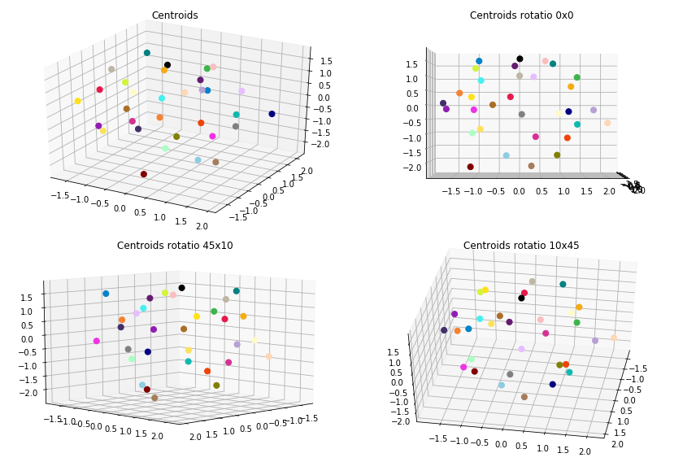
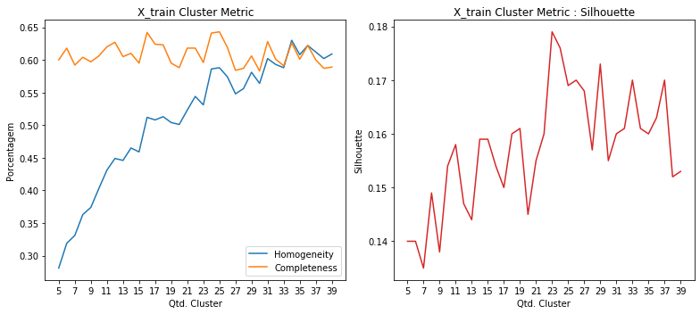
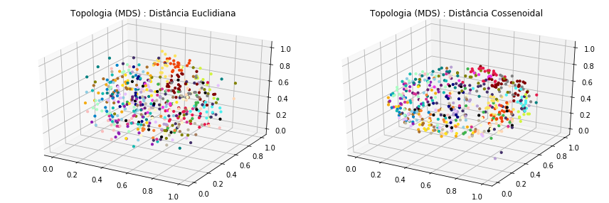
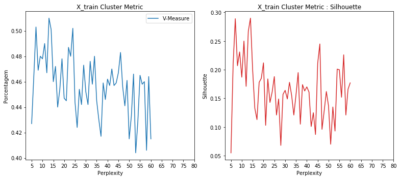
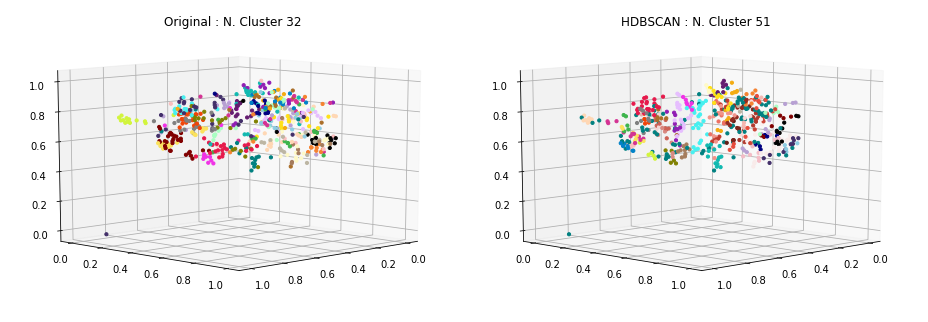
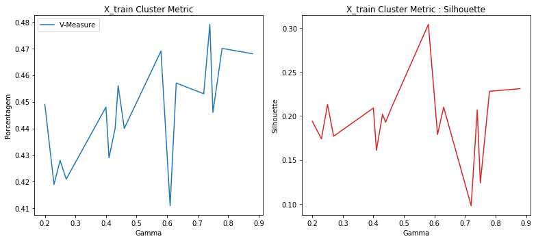
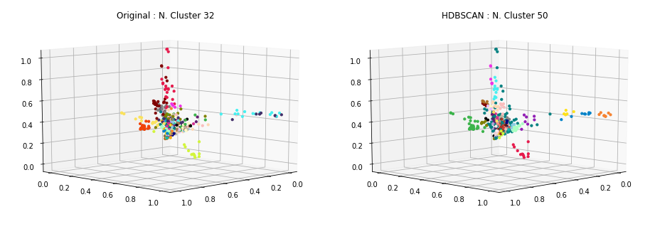
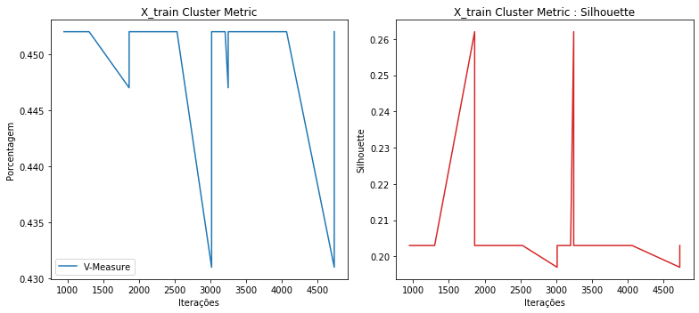
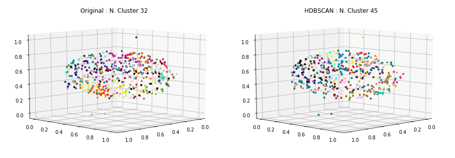

### Carregamento dos datasets

Os datasets de exemplos são frases já pré-categorizadas usadas em chatbots.

Contém 33 categorias e ao todo 696 documentos ou frases.

<table border="1" class="dataframe">
  <thead>
    <tr style="text-align: right;">
      <th></th>
      <th>perguntas</th>
      <th>cluster</th>
    </tr>
  </thead>
  <tbody>
    <tr>
      <th>13</th>
      <td>Como posso registrar um cartão SIM?</td>
      <td>ACTIVATE_DEVICE</td>
    </tr>
    <tr>
      <th>44</th>
      <td>Por favor adicione o roaming internacional na minha conta.</td>
      <td>ACTIVATE_ROAMING</td>
    </tr>
    <tr>
      <th>70</th>
      <td>Fui assaltado, preciso acionar seguro.</td>
      <td>ADD_INSURANCE</td>
    </tr>
    <tr>
      <th>97</th>
      <td>Oi, eu estava esperando que você pudesse me dizer como adicionar o recurso de mensagens de texto ao meu plano?</td>
      <td>ADD_SERVICE_FEATURES</td>
    </tr>
    <tr>
      <th>152</th>
      <td>Como cancelo meu serviço de telefone pré-pago?</td>
      <td>DEACTIVATE_PREPAID_PLAN</td>
    </tr>
    <tr>
      <th>195</th>
      <td>Você pode verificar se posso fazer um upgrade?</td>
      <td>DEVICE_UPGRADE_ELIGIBILITY</td>
    </tr>
    <tr>
      <th>34</th>
      <td>quero mudar minha password como devo proceder?</td>
      <td>PASSWORD</td>
    </tr>
    <tr>
      <th>24</th>
      <td>Minha Senha está com problema</td>
      <td>PASSWORD</td>
    </tr>
    <tr>
      <th>45</th>
      <td>Minha senha não funciona</td>
      <td>PASSWORD</td>
    </tr>
    <tr>
      <th>393</th>
      <td>Como faço para transferir o serviço de um dispositivo antigo para um novo?</td>
      <td>SWAP_DEVICE</td>
    </tr>
  </tbody>
</table>

    Qtde. de documentos por categoria:

<table border="1" class="dataframe">
  <thead>
    <tr style="text-align: right;">
      <th></th>
      <th>Categoria</th>
      <th>Qtde</th>
    </tr>
  </thead>
  <tbody>
    <tr>
      <th>0</th>
      <td>ACCOUNT</td>
      <td>29</td>
    </tr>
    <tr>
      <th>1</th>
      <td>ACTIVATE_DEVICE</td>
      <td>19</td>
    </tr>
    <tr>
      <th>2</th>
      <td>ACTIVATE_PREPAID_PLAN</td>
      <td>21</td>
    </tr>
    <tr>
      <th>3</th>
      <td>ACTIVATE_ROAMING</td>
      <td>20</td>
    </tr>
    <tr>
      <th>4</th>
      <td>ADD_INSURANCE</td>
      <td>18</td>
    </tr>
    <tr>
      <th>5</th>
      <td>ADD_SERVICE_FEATURES</td>
      <td>20</td>
    </tr>
    <tr>
      <th>6</th>
      <td>BOT_FOUND</td>
      <td>20</td>
    </tr>
    <tr>
      <th>7</th>
      <td>BOT_NAME</td>
      <td>16</td>
    </tr>
    <tr>
      <th>8</th>
      <td>CERTIFICATE</td>
      <td>18</td>
    </tr>
    <tr>
      <th>9</th>
      <td>CHANGE_PRICE_PLAN</td>
      <td>19</td>
    </tr>
    <tr>
      <th>10</th>
      <td>COVERAGE_AREA_INQUIRY</td>
      <td>19</td>
    </tr>
    <tr>
      <th>11</th>
      <td>DEACTIVATE_PREPAID_PLAN</td>
      <td>18</td>
    </tr>
    <tr>
      <th>12</th>
      <td>DEACTIVATE_ROAMING</td>
      <td>18</td>
    </tr>
    <tr>
      <th>13</th>
      <td>DEVICE_UPGRADE_ELIGIBILITY</td>
      <td>24</td>
    </tr>
    <tr>
      <th>14</th>
      <td>EMAIL</td>
      <td>40</td>
    </tr>
    <tr>
      <th>15</th>
      <td>INTERNATIONAL_RATE_PLAN_INQUIRY</td>
      <td>21</td>
    </tr>
    <tr>
      <th>16</th>
      <td>NETWORK_COMPLAINTS</td>
      <td>23</td>
    </tr>
    <tr>
      <th>17</th>
      <td>NETWORK_UNLOCK</td>
      <td>21</td>
    </tr>
    <tr>
      <th>18</th>
      <td>NO_OPTION</td>
      <td>18</td>
    </tr>
    <tr>
      <th>19</th>
      <td>PASSWORD</td>
      <td>27</td>
    </tr>
    <tr>
      <th>20</th>
      <td>PORT_IN</td>
      <td>21</td>
    </tr>
    <tr>
      <th>21</th>
      <td>PRICE_PLAN_INQUIRY</td>
      <td>23</td>
    </tr>
    <tr>
      <th>22</th>
      <td>RECHARGE_SIM</td>
      <td>18</td>
    </tr>
    <tr>
      <th>23</th>
      <td>REMOTE_ACCESS</td>
      <td>20</td>
    </tr>
    <tr>
      <th>24</th>
      <td>REMOVE_SERVICE_FEATURES</td>
      <td>20</td>
    </tr>
    <tr>
      <th>25</th>
      <td>RETURN_DEVICE</td>
      <td>21</td>
    </tr>
    <tr>
      <th>26</th>
      <td>ROAMING_INQUIRY</td>
      <td>20</td>
    </tr>
    <tr>
      <th>27</th>
      <td>SERVICES</td>
      <td>20</td>
    </tr>
    <tr>
      <th>28</th>
      <td>SWAP_DEVICE</td>
      <td>15</td>
    </tr>
    <tr>
      <th>29</th>
      <td>THANK_YOU</td>
      <td>23</td>
    </tr>
    <tr>
      <th>30</th>
      <td>TROUBLESHOOTING</td>
      <td>36</td>
    </tr>
    <tr>
      <th>31</th>
      <td>WIFI</td>
      <td>24</td>
    </tr>
  </tbody>
</table>

    Total docs     : 690
    Total cluster  : 690
    X_train size   : (552,)
    X_test  size   : (138,)

### Dataset tokenization

    Tokenization...
    Qtd documentos treino:  552
    Qtd Intents treino   :  32
    Finished...

    [TaggedDocument(words=['ir', 'viajar', 'certar', 'empresar', 'fornecer', 'cobertura', 'telefonar', 'viagem', 'poder', 'informacaes', 'servico', 'recepcao', 'disponivel'], tags=[0]),
     TaggedDocument(words=['servico', 'bot', 'oferecer'], tags=[1]),
     TaggedDocument(words=['voce', 'um', 'nome'], tags=[2]),
     TaggedDocument(words=['nao', 'recarregar', 'desativar', 'ativar'], tags=[3]),
     TaggedDocument(words=['voce', 'poder', 'ajudar', 'mudar', 'tocar', 'telefonar'], tags=[4]),
     TaggedDocument(words=['configurar', 'email', 'thunderbird'], tags=[5]),
     TaggedDocument(words=['nao', 'precisar', 'mais'], tags=[6]),
     TaggedDocument(words=['nao', 'conseguir', 'acessar', 'web', 'telefonar', 'nao', 'precisar', 'configuracao'], tags=[7]),
     TaggedDocument(words=['poder', 'correar', 'voz', 'permanentemente', 'remover', 'planar'], tags=[8]),
     TaggedDocument(words=['tutorial', 'configuracao', 'redar', 'fiar', 'android'], tags=[9])]

### **Doc2Vec**

Parâmetros iniciais... quantidade de dimensões dos vetores gerados para cada frase, épocas de treinamento e épocas de posterior inferência para novas frases.

A quantidade de épocas de inferência, sugere-se ser bem superior as de treinamento.

    Dimensions   : 1000
    Epochs       : 200
    Infer Epochs : 15000

    Starting model...
    Building vocab...
    Training...
    Finish...

Validação do modelo gerado pelo Doc2Vec... teste tanto nos dados apresentados para treinamento quanto nos dados de testes e as acurácias alcançadas.

### Acurácia distância cossenoidal

    - Acurácia treino: 100.0
     - Acurácia teste 1  : 56.0
     - Acurácia teste 2  : 58.0
     - Acurácia teste 3  : 56.0
     - Acurácia teste 4  : 63.0
     - Acurácia teste 5  : 58.0
    - Acurácia média teste: 58.2

### Acurácia distância euclidiana

    - Acurácia treino: 100.0
     - Acurácia teste 1  : 55.0
     - Acurácia teste 2  : 56.0
     - Acurácia teste 3  : 52.0
     - Acurácia teste 4  : 54.0
     - Acurácia teste 5  : 56.0
    - Acurácia média teste: 54.6

### Clusterização

Utilizou-se o KMeans definindo a quantidade de clusters para o número ideal de categorias existentes no caso 33. A métrica de distância utilizada, não foi a euclidiana, mas sim a de cosseno (métrica comumente usada na classificação de texto em seu espaço vetorial).

    Frases por cluster:

<table border="1" class="dataframe">
  <thead>
    <tr style="text-align: right;">
      <th>title</th>
      <th>cluster</th>
    </tr>
  </thead>
  <tbody>
    <tr>
      <td>Eu vou sair de férias em breve. Eu preciso adicionar chamadas internacionais para o meu plano.</td>
      <td>0</td>
    </tr>
    <tr>
      <td>Logo precisarei fazer várias ligações internacionais do meu país. Onde posso encontrar, ou como posso ter uma lista completa com todos os preços possíveis indicados?</td>
      <td>0</td>
    </tr>
    <tr>
      <td>As chamadas internacionais estão incluídas no meu plano?</td>
      <td>0</td>
    </tr>
    <tr>
      <td>é permitido que patrulheiros tenham uma conta?</td>
      <td>1</td>
    </tr>
    <tr>
      <td>Você pode me dizer como posso retornar meu telefone atual para uma atualização?</td>
      <td>1</td>
    </tr>
    <tr>
      <td>Me qualifico para uma atualização de telefone neste momento?</td>
      <td>1</td>
    </tr>
    <tr>
      <td>Gostaria de cancelar minha cobertura de roaming e tethering.</td>
      <td>2</td>
    </tr>
    <tr>
      <td>Eu estive dirigido muito recentemente e foi praticamente impossível usar o serviço em algumas áreas. Você poderia me fornecer uma lista de locais / áreas com pouca ou nenhuma recepção?</td>
      <td>2</td>
    </tr>
    <tr>
      <td>Bom dia, eu me pergunto se você gostaria de saber quais são as áreas de cobertura da companhia telefônica?</td>
      <td>2</td>
    </tr>
    <tr>
      <td>Eu pedi para manter meu número antigo enviado isso on-line na noite de sexta-feira, logo após a meia-noite ainda meu número não foi transferido</td>
      <td>3</td>
    </tr>
    <tr>
      <td>Eu tenho um plano com outra empresa. Posso manter meu número?</td>
      <td>3</td>
    </tr>
    <tr>
      <td>Quero mudar os provedores de serviço, ainda posso manter meu mesmo número de telefone?</td>
      <td>3</td>
    </tr>
    <tr>
      <td>Estou recebendo chamadas indesejadas de números desconhecidos, como posso ativar Não perturbe?</td>
      <td>4</td>
    </tr>
    <tr>
      <td>Como posso recarregar meu dispositivo quando estou na Áustria?</td>
      <td>4</td>
    </tr>
    <tr>
      <td>Qual é o plano de dados que estou na ativa?</td>
      <td>4</td>
    </tr>
    <tr>
      <td>Quero desligar o roaming da minha conta</td>
      <td>5</td>
    </tr>
    <tr>
      <td>Se eu cancelar o roaming agora, demora muito pra concluir o pedido?</td>
      <td>5</td>
    </tr>
    <tr>
      <td>Ajuda com a desativação de roaming</td>
      <td>5</td>
    </tr>
    <tr>
      <td>Eu gostaria de segurar meu telefone. Pode me ajudar com isso?</td>
      <td>6</td>
    </tr>
    <tr>
      <td>Quais os meios de cancelamento do meu plano pré-pago?</td>
      <td>6</td>
    </tr>
    <tr>
      <td>Como posso desbloquear meu novo telefone pré-pago para que meu plano de serviço funcione?</td>
      <td>6</td>
    </tr>
    <tr>
      <td>Preciso saber como devolver meu celular</td>
      <td>7</td>
    </tr>
    <tr>
      <td>Olá preciso de um PIN de Desbloqueio de Rede, por favor</td>
      <td>7</td>
    </tr>
    <tr>
      <td>Precio ir em uma loja fisica para fazer desbloqueio do meu aparelho celular?</td>
      <td>7</td>
    </tr>
    <tr>
      <td>Quando meu produto solicitado será ativado?</td>
      <td>8</td>
    </tr>
    <tr>
      <td>Você pode por favor me dizer como posso adicionar roaming ao meu plano atual?</td>
      <td>8</td>
    </tr>
    <tr>
      <td>Eu gostaria de saber sobre os encargos de roaming internacional e como ativar isto.</td>
      <td>8</td>
    </tr>
    <tr>
      <td>Você poderia me ajudar em como mudar o toque do meu telefone?</td>
      <td>9</td>
    </tr>
    <tr>
      <td>Eu preciso devolver os controles para a empresa?</td>
      <td>9</td>
    </tr>
    <tr>
      <td>Quando é o último dia que posso devolver meu telefone?</td>
      <td>9</td>
    </tr>
    <tr>
      <td>Posso trocar meu equipamento para o mais recente e o melhor disponível?</td>
      <td>10</td>
    </tr>
    <tr>
      <td>Posso mudar o meu plano de tarifa para algo que funcione melhor para mim?</td>
      <td>10</td>
    </tr>
    <tr>
      <td>Quantos tabletes podem ser adicionados ao meu plano de família?</td>
      <td>10</td>
    </tr>
    <tr>
      <td>Você tem informações para me dar sobre como retornar um telefone que eu acabei de comprar?</td>
      <td>11</td>
    </tr>
    <tr>
      <td>É possível trocar meu celular?</td>
      <td>11</td>
    </tr>
    <tr>
      <td>Quando minha conta vai ser elegível para um dispositivo atualizado</td>
      <td>11</td>
    </tr>
    <tr>
      <td>Quai são meus recursos atuais</td>
      <td>12</td>
    </tr>
    <tr>
      <td>você tem outros serviços?</td>
      <td>12</td>
    </tr>
    <tr>
      <td>Como faço para remover o serviço de mensagens de texto?</td>
      <td>12</td>
    </tr>
    <tr>
      <td>Estou tendo um problema em contato com o suporte. Eu estava em espera por 45 minutos e finalmente desisti. Se eu deixar um número, é possível receber uma chamada em retorno?</td>
      <td>13</td>
    </tr>
    <tr>
      <td>Foi-me prometido uma cobertura total na minha cidade quando me inscrevi no ano passado. 12 meses depois, metade da minha cidade não tem conexão. Quando isso será consertado?</td>
      <td>13</td>
    </tr>
    <tr>
      <td>Preciso desconectar uma das minhas linhas telefônicas. Posso fazer isso por telefone?</td>
      <td>13</td>
    </tr>
    <tr>
      <td>Solicitação de certificado digital</td>
      <td>14</td>
    </tr>
    <tr>
      <td>quero solicitar a renovação de um certificado digital</td>
      <td>14</td>
    </tr>
    <tr>
      <td>como emitir novos certificados digitais?</td>
      <td>14</td>
    </tr>
    <tr>
      <td>Preciso apresentar algum documento para utilizar o seguro do meu aparelho?</td>
      <td>15</td>
    </tr>
    <tr>
      <td>poxa vida! muito obrigado</td>
      <td>15</td>
    </tr>
    <tr>
      <td>A portabilidade possui alguma cobranca?</td>
      <td>15</td>
    </tr>
    <tr>
      <td>Não consigo acessar a web no meu telefone, não tenho certeza se isso precisar de algumas configurações.</td>
      <td>16</td>
    </tr>
    <tr>
      <td>Meu email não está acessando</td>
      <td>16</td>
    </tr>
    <tr>
      <td>tem como configurar meu email no outlook?</td>
      <td>16</td>
    </tr>
    <tr>
      <td>um patrulheiro pode ter uma conta de usuário?</td>
      <td>17</td>
    </tr>
    <tr>
      <td>eu consigo trocar meu username para outro?</td>
      <td>17</td>
    </tr>
    <tr>
      <td>Não consigo criar meu username</td>
      <td>17</td>
    </tr>
    <tr>
      <td>quero falar com um atendente de verdade</td>
      <td>18</td>
    </tr>
    <tr>
      <td>estou falando com um chatbot com certeza</td>
      <td>18</td>
    </tr>
    <tr>
      <td>Posso falar com um humano?</td>
      <td>18</td>
    </tr>
    <tr>
      <td>Preciso que um humano me ajude</td>
      <td>19</td>
    </tr>
    <tr>
      <td>Preciso de outro tipo de ajuda</td>
      <td>19</td>
    </tr>
    <tr>
      <td>Oi. Tenho um sinal forte, mas não consigo fazer ou receber chamadas. Você pode me ajudar a ver como resolver esse problema?</td>
      <td>19</td>
    </tr>
    <tr>
      <td>Se eu atualizar o meu plano/dispositivo e decidir que não gosto do telefone, posso devolver o telefone?</td>
      <td>20</td>
    </tr>
    <tr>
      <td>Gostaria que meu celular seja ativado hoje</td>
      <td>20</td>
    </tr>
    <tr>
      <td>Por favor me diga quando eu vou ser elegível para minha próxima atualização do dispositivo.</td>
      <td>20</td>
    </tr>
    <tr>
      <td>configurar vpn (acesso remoto) em aparelhos da nokia</td>
      <td>21</td>
    </tr>
    <tr>
      <td>utilizar o acesso remoto via vpn</td>
      <td>21</td>
    </tr>
    <tr>
      <td>tenho duvidas sobre vpn</td>
      <td>21</td>
    </tr>
    <tr>
      <td>Meu telefone não tem sinal no meu porão.</td>
      <td>22</td>
    </tr>
    <tr>
      <td>Você pode me dizer por que nunca tenho sinal no meu telefone quando estou no trabalho, mas não tenho problema em nenhum outro lugar?</td>
      <td>22</td>
    </tr>
    <tr>
      <td>Existe a possibilidade de ter o meu dispositivo de telefone de alguma forma assegurado?</td>
      <td>22</td>
    </tr>
    <tr>
      <td>quais outros servicos voce oferece?</td>
      <td>23</td>
    </tr>
    <tr>
      <td>Quais são os preços para os planos de dados e chamadas diferentes que você oferece?</td>
      <td>23</td>
    </tr>
    <tr>
      <td>Eu estava querendo me inscrever em um plano com sua empresa e estava pensando quais são alguns dos planos de preços que você tem para oferecer?</td>
      <td>23</td>
    </tr>
    <tr>
      <td>minha senha não esta funcionando</td>
      <td>24</td>
    </tr>
    <tr>
      <td>não obrigado, isso é tudo</td>
      <td>24</td>
    </tr>
    <tr>
      <td>inseri o email e senha e não deu certo</td>
      <td>24</td>
    </tr>
    <tr>
      <td>Isso vai funcionar em todos os lugares?</td>
      <td>25</td>
    </tr>
    <tr>
      <td>Vou ficar sem sinal durante a troca para o plano pré-pago?</td>
      <td>25</td>
    </tr>
    <tr>
      <td>Quero que meu aparelho pare de buscar sinal quando chego em um novo país</td>
      <td>25</td>
    </tr>
    <tr>
      <td>isso e tudo, obrigado</td>
      <td>26</td>
    </tr>
    <tr>
      <td>Posso excluir o envio de sms?</td>
      <td>26</td>
    </tr>
    <tr>
      <td>muitíssimo obrigado</td>
      <td>26</td>
    </tr>
    <tr>
      <td>Quero trocar o meu antigo telefone por um crédito</td>
      <td>27</td>
    </tr>
    <tr>
      <td>Quanto é a taxa de ativação de um novo cartão SIM da minha operadora?</td>
      <td>27</td>
    </tr>
    <tr>
      <td>Qual é a política de devolução para esse telefone</td>
      <td>27</td>
    </tr>
    <tr>
      <td>estou com problema de conexao na rede sem fio (wifi)</td>
      <td>28</td>
    </tr>
    <tr>
      <td>Estou tendo problema de conectividade da minha casa para conectar-me à Internet</td>
      <td>28</td>
    </tr>
    <tr>
      <td>como utilizar a rede sem fio (wifi)</td>
      <td>28</td>
    </tr>
    <tr>
      <td>qual é seu nome?</td>
      <td>29</td>
    </tr>
    <tr>
      <td>como e o seu nome?</td>
      <td>29</td>
    </tr>
    <tr>
      <td>você tem um nome?</td>
      <td>29</td>
    </tr>
    <tr>
      <td>Quero ativar o meu novo aparelho telefonico por favor</td>
      <td>30</td>
    </tr>
    <tr>
      <td>Alguém poderia me mostrar como ativar meu novo dispositivo pré-pago?</td>
      <td>30</td>
    </tr>
    <tr>
      <td>Desativar meu dispositivo quando no exterior</td>
      <td>30</td>
    </tr>
    <tr>
      <td>meu usuário e senha não estão funcionando</td>
      <td>31</td>
    </tr>
    <tr>
      <td>como trocar minha senha</td>
      <td>31</td>
    </tr>
    <tr>
      <td>Minha Senha está com problema</td>
      <td>31</td>
    </tr>
  </tbody>
</table>

    --------------------
    Documentos por cluster:

<table border="1" class="dataframe">
  <tbody>
    <tr>
      <td>C0</td>
      <td>25</td>
    </tr>
    <tr>
      <td>C1</td>
      <td>11</td>
    </tr>
    <tr>
      <td>C2</td>
      <td>14</td>
    </tr>
    <tr>
      <td>C3</td>
      <td>9</td>
    </tr>
    <tr>
      <td>C4</td>
      <td>17</td>
    </tr>
    <tr>
      <td>C5</td>
      <td>19</td>
    </tr>
    <tr>
      <td>C6</td>
      <td>15</td>
    </tr>
    <tr>
      <td>C7</td>
      <td>13</td>
    </tr>
    <tr>
      <td>C8</td>
      <td>14</td>
    </tr>
    <tr>
      <td>C9</td>
      <td>15</td>
    </tr>
    <tr>
      <td>C10</td>
      <td>13</td>
    </tr>
    <tr>
      <td>C11</td>
      <td>25</td>
    </tr>
    <tr>
      <td>C12</td>
      <td>18</td>
    </tr>
    <tr>
      <td>C13</td>
      <td>18</td>
    </tr>
    <tr>
      <td>C14</td>
      <td>12</td>
    </tr>
    <tr>
      <td>C15</td>
      <td>23</td>
    </tr>
    <tr>
      <td>C16</td>
      <td>27</td>
    </tr>
    <tr>
      <td>C17</td>
      <td>24</td>
    </tr>
    <tr>
      <td>C18</td>
      <td>24</td>
    </tr>
    <tr>
      <td>C19</td>
      <td>20</td>
    </tr>
    <tr>
      <td>C20</td>
      <td>8</td>
    </tr>
    <tr>
      <td>C21</td>
      <td>24</td>
    </tr>
    <tr>
      <td>C22</td>
      <td>19</td>
    </tr>
    <tr>
      <td>C23</td>
      <td>23</td>
    </tr>
    <tr>
      <td>C24</td>
      <td>11</td>
    </tr>
    <tr>
      <td>C25</td>
      <td>8</td>
    </tr>
    <tr>
      <td>C26</td>
      <td>11</td>
    </tr>
    <tr>
      <td>C27</td>
      <td>20</td>
    </tr>
    <tr>
      <td>C28</td>
      <td>23</td>
    </tr>
    <tr>
      <td>C29</td>
      <td>12</td>
    </tr>
    <tr>
      <td>C30</td>
      <td>22</td>
    </tr>
    <tr>
      <td>C31</td>
      <td>15</td>
    </tr>
  </tbody>
</table>

### Visualização

Apresentação dos protótipos gerados pelo KMeans, reduzindo a dimensão usando o algoritmo MDS (Multidimensional Scaling).

### Clusterização dos dados de Teste

Por fim, realizada a clusterização dos dados de teste e a apresentação das 8 primeiras frases do conjunto de teste juntamente com outras duas frases do cluster ao qual foi identificado como o melhor.

    * Se eu ativar roaming agora, já posso utilizar?
      -  utilizar o acesso remoto via vpn
      -  tenho duvidas sobre vpn
    --------------------
    * Fui assaltado, preciso acionar seguro.
      -  Qual é a política de devolução para esse telefone
      -  Quanto é a taxa de ativação de um novo cartão SIM da minha operadora?
    --------------------
    * Estou bastante cansado do meu telefone existente e gostaria de saber quando eu vou ser elegível para sua atualização?
      -  Se eu atualizar o meu plano/dispositivo e decidir que não gosto do telefone, posso devolver o telefone?
      -  Gostaria que meu celular seja ativado hoje
    --------------------
    * Oi, como posso ativar o encaminhamento de chamada no meu plano?
      -  Quai são meus recursos atuais
      -  Como faço para remover o serviço de mensagens de texto?
    --------------------
    * Eu não consigo acessar meu email
      -  tem como configurar meu email no outlook?
      -  Não consigo acessar a web no meu telefone, não tenho certeza se isso precisar de algumas configurações.
    --------------------
    * Estou indo para uma viagem ao extremo norte da Ilha de Vancouver e gostaria de verificar se há serviço de celular nessa área. Você pode verificar o quanto longe do norte eu posso esperar para receber a recepção.
      -  Meu telefone não tem sinal no meu porão.
      -  Você pode me dizer por que nunca tenho sinal no meu telefone quando estou no trabalho, mas não tenho problema em nenhum outro lugar?
    --------------------
    * Gostaria de verificar todas as taxas para cobertura internacional
      -  Eu gostaria de saber sobre os encargos de roaming internacional e como ativar isto.
      -  Quando meu produto solicitado será ativado?
    --------------------
    * Além do fornecimento de água vocês oferecem algum outro serviço?
      -  Eu estava querendo me inscrever em um plano com sua empresa e estava pensando quais são alguns dos planos de preços que você tem para oferecer?
      -  Quais são os preços para os planos de dados e chamadas diferentes que você oferece?
    --------------------

### Métricas

Abaixo são apresentadas métricas para demonstrar o quanto a clusterização parece funcionar.

    Homogeneidade    :  0.73
    Completude       :  0.736
    V-Measure        :  0.733
    Silhouette       :  -0.022

Como exemplo de comparação, foi executado o mesmo algoritmo de clusterização (conforme apresentado acima) entretanto variando a quantidade do número de clusters para verificar como as métricas se comportam.

### HDBSCAN no espaço dos dados

    Frases por cluster:

<table border="1" class="dataframe">
  <thead>
    <tr style="text-align: right;">
      <th>title</th>
      <th>cluster</th>
    </tr>
  </thead>
  <tbody>
    <tr>
      <td>Essa não é a instrução que me deram. Me mandaram um novo chip e me mandaram transferir meu velho número da outra operadora</td>
      <td>0</td>
    </tr>
    <tr>
      <td>Quero trocar o meu antigo telefone por um crédito</td>
      <td>0</td>
    </tr>
    <tr>
      <td>Como faço para transferir o serviço de um dispositivo antigo para um novo?</td>
      <td>0</td>
    </tr>
    <tr>
      <td>Alteração de certificado digital</td>
      <td>1</td>
    </tr>
    <tr>
      <td>como emitir novos certificados digitais?</td>
      <td>1</td>
    </tr>
    <tr>
      <td>onde consigo mais informações sobre a emição / manutenção de certificados digitais emitidos pela empresa?</td>
      <td>1</td>
    </tr>
    <tr>
      <td>Por favor, eu preciso de uma maneira fácil de recarregar.</td>
      <td>2</td>
    </tr>
    <tr>
      <td>Eu não posso recarregar porque diz que meu sim está desativado , meu sim pode ser ativado?</td>
      <td>2</td>
    </tr>
    <tr>
      <td>Se eu recarregar R$ 50, o que eu ganho?</td>
      <td>2</td>
    </tr>
    <tr>
      <td>Posso levar meu telefone comigo se eu mudar para uma nova empresa.</td>
      <td>3</td>
    </tr>
    <tr>
      <td>Quando é o último dia que posso devolver meu telefone?</td>
      <td>3</td>
    </tr>
    <tr>
      <td>Eu tenho um plano com outra empresa. Posso manter meu número?</td>
      <td>3</td>
    </tr>
    <tr>
      <td>Como atualizo minha conta para incluir chamadas internacionais?</td>
      <td>4</td>
    </tr>
    <tr>
      <td>Você pode me dizer como posso adicionar minutos ao meu telefone pré-pago?</td>
      <td>4</td>
    </tr>
    <tr>
      <td>Eu vou sair de férias em breve. Eu preciso adicionar chamadas internacionais para o meu plano.</td>
      <td>4</td>
    </tr>
    <tr>
      <td>É possível criar um conta para colaborador externo?</td>
      <td>5</td>
    </tr>
    <tr>
      <td>um patrulheiro pode ter uma conta de usuário?</td>
      <td>5</td>
    </tr>
    <tr>
      <td>é permitido que patrulheiros tenham uma conta?</td>
      <td>5</td>
    </tr>
    <tr>
      <td>Você pode me dizer como posso retornar meu telefone atual para uma atualização?</td>
      <td>6</td>
    </tr>
    <tr>
      <td>Como posso registrar um cartão SIM?</td>
      <td>6</td>
    </tr>
    <tr>
      <td>Eu tenho um cartão SIM no meu aparelho e eu gostaria de desbloqueá-lo.</td>
      <td>6</td>
    </tr>
    <tr>
      <td>Será que meu telefone seja elegível para atualizar este ano em um preço com desconto?</td>
      <td>7</td>
    </tr>
    <tr>
      <td>Oi! Este telefone tem seguro? Posso fazer o seguro para este telefone eu mesmo?</td>
      <td>7</td>
    </tr>
    <tr>
      <td>Quero atualizar o meu plano com o seguro de telefone.</td>
      <td>7</td>
    </tr>
    <tr>
      <td>como utilizar acesso vpn</td>
      <td>8</td>
    </tr>
    <tr>
      <td>configurar o vpn (acesso remoto) no macOSX</td>
      <td>8</td>
    </tr>
    <tr>
      <td>how to configure vpn?</td>
      <td>8</td>
    </tr>
    <tr>
      <td>qual o nome que lhe foi dado?</td>
      <td>9</td>
    </tr>
    <tr>
      <td>qual é seu nome?</td>
      <td>9</td>
    </tr>
    <tr>
      <td>qual o nome que atribuiram a você?</td>
      <td>9</td>
    </tr>
    <tr>
      <td>não consigo criar meu username, da mensagem de username já cadastrado</td>
      <td>10</td>
    </tr>
    <tr>
      <td>estou tentanto criar meu username, mas não estou conseguindo</td>
      <td>10</td>
    </tr>
    <tr>
      <td>Username já cadastrado</td>
      <td>10</td>
    </tr>
    <tr>
      <td>Meu telefone não faz nem recebe mais nenhuma chamada.</td>
      <td>11</td>
    </tr>
    <tr>
      <td>as pessoas te chamam como?</td>
      <td>11</td>
    </tr>
    <tr>
      <td>Como faço chamadas telefônicas para outros países?</td>
      <td>11</td>
    </tr>
    <tr>
      <td>Quais os meios de cancelamento do meu plano pré-pago?</td>
      <td>12</td>
    </tr>
    <tr>
      <td>Como cancelo meu serviço de telefone pré-pago?</td>
      <td>12</td>
    </tr>
    <tr>
      <td>Como posso cancelar minha linha de telefone pré-pago?</td>
      <td>12</td>
    </tr>
    <tr>
      <td>Quais são os preços para os planos de dados e chamadas diferentes que você oferece?</td>
      <td>13</td>
    </tr>
    <tr>
      <td>Que planos de dados posso escolher?</td>
      <td>13</td>
    </tr>
    <tr>
      <td>Eu preciso de cerca de 100 GB de dados todos os meses e acima de 20 Mbps de velocidade, você pode sugerir alguns planos de dados que possam corresponder às minhas necessidades?</td>
      <td>13</td>
    </tr>
    <tr>
      <td>acho que por enquanto e só isso mesmo, obrigado</td>
      <td>14</td>
    </tr>
    <tr>
      <td>nenhuma dessas opções me interessa</td>
      <td>14</td>
    </tr>
    <tr>
      <td>nenhuma das opções apresentadas tem o que quero fazer</td>
      <td>14</td>
    </tr>
    <tr>
      <td>quais os sistemas operacionais suportados para se conectar a rede sem fio?</td>
      <td>15</td>
    </tr>
    <tr>
      <td>como eu acesso a rede interna da minha empresa estando em outro pais?</td>
      <td>15</td>
    </tr>
    <tr>
      <td>acessar a rede wifi (sem fio) no macbook</td>
      <td>15</td>
    </tr>
    <tr>
      <td>Eu quero desligar a função de roaming.</td>
      <td>16</td>
    </tr>
    <tr>
      <td>Por favor desative o dispositivo pré-pago.</td>
      <td>16</td>
    </tr>
    <tr>
      <td>Qual a carência para desativar o roaming?</td>
      <td>16</td>
    </tr>
    <tr>
      <td>meu usuário e senha não estão funcionando</td>
      <td>17</td>
    </tr>
    <tr>
      <td>inseri o email e senha e não funcionou</td>
      <td>17</td>
    </tr>
    <tr>
      <td>Minha Senha está com problema</td>
      <td>17</td>
    </tr>
    <tr>
      <td>ainda estou com dificuldades, um bot não pode resolver meu problema</td>
      <td>18</td>
    </tr>
    <tr>
      <td>voce nao conseguiu me ajudar, quero falar com um atendente</td>
      <td>18</td>
    </tr>
    <tr>
      <td>um chatbot nao conseguirá resolver meu problema</td>
      <td>18</td>
    </tr>
    <tr>
      <td>será que posso ser atendido por um humano</td>
      <td>19</td>
    </tr>
    <tr>
      <td>essa resposta, parece ser a de um chatbot</td>
      <td>19</td>
    </tr>
    <tr>
      <td>Será que um humano pode me atender?</td>
      <td>19</td>
    </tr>
    <tr>
      <td>Não consigo recuperar a minha senha</td>
      <td>20</td>
    </tr>
    <tr>
      <td>Como faço para recuperar meus emails?</td>
      <td>20</td>
    </tr>
    <tr>
      <td>consigo recuperar emails perdidos?</td>
      <td>20</td>
    </tr>
    <tr>
      <td>meu email foi bloqueado</td>
      <td>21</td>
    </tr>
    <tr>
      <td>não estou tendo sucesso ao tentar acessar meu email</td>
      <td>21</td>
    </tr>
    <tr>
      <td>estou com problemas para acessar meu email</td>
      <td>21</td>
    </tr>
    <tr>
      <td>nao preciso mais de ajuda</td>
      <td>22</td>
    </tr>
    <tr>
      <td>nao preciso mais de ajuda, obrigado</td>
      <td>22</td>
    </tr>
    <tr>
      <td>Preciso de outro tipo de ajuda</td>
      <td>22</td>
    </tr>
    <tr>
      <td>estou com problemas de autenticacao</td>
      <td>23</td>
    </tr>
    <tr>
      <td>voce nao conseguiu me entender preciso de ajuda de verdade</td>
      <td>23</td>
    </tr>
    <tr>
      <td>você tem outras opções para ajudar?</td>
      <td>23</td>
    </tr>
    <tr>
      <td>muito obrigado mesmo</td>
      <td>24</td>
    </tr>
    <tr>
      <td>poxa vida! muito obrigado</td>
      <td>24</td>
    </tr>
    <tr>
      <td>você ajudou muito</td>
      <td>24</td>
    </tr>
    <tr>
      <td>Oi, já que você está aqui, está havendo algum problema com a cobertura na área de SP? Desde ontem o meu sinal normal de 4 barras ficou em 0, está bem em outros lugares.</td>
      <td>25</td>
    </tr>
    <tr>
      <td>como faco para trocar o meu usuario</td>
      <td>25</td>
    </tr>
    <tr>
      <td>Isso vai funcionar em todos os lugares?</td>
      <td>25</td>
    </tr>
  </tbody>
</table>

    --------------------
    Documentos por cluster:

<table border="1" class="dataframe">
  <tbody>
    <tr>
      <td>C0</td>
      <td>6</td>
    </tr>
    <tr>
      <td>C1</td>
      <td>12</td>
    </tr>
    <tr>
      <td>C2</td>
      <td>7</td>
    </tr>
    <tr>
      <td>C3</td>
      <td>11</td>
    </tr>
    <tr>
      <td>C4</td>
      <td>16</td>
    </tr>
    <tr>
      <td>C5</td>
      <td>6</td>
    </tr>
    <tr>
      <td>C6</td>
      <td>6</td>
    </tr>
    <tr>
      <td>C7</td>
      <td>13</td>
    </tr>
    <tr>
      <td>C8</td>
      <td>9</td>
    </tr>
    <tr>
      <td>C9</td>
      <td>12</td>
    </tr>
    <tr>
      <td>C10</td>
      <td>9</td>
    </tr>
    <tr>
      <td>C11</td>
      <td>6</td>
    </tr>
    <tr>
      <td>C12</td>
      <td>6</td>
    </tr>
    <tr>
      <td>C13</td>
      <td>5</td>
    </tr>
    <tr>
      <td>C14</td>
      <td>5</td>
    </tr>
    <tr>
      <td>C15</td>
      <td>31</td>
    </tr>
    <tr>
      <td>C16</td>
      <td>15</td>
    </tr>
    <tr>
      <td>C17</td>
      <td>6</td>
    </tr>
    <tr>
      <td>C18</td>
      <td>5</td>
    </tr>
    <tr>
      <td>C19</td>
      <td>15</td>
    </tr>
    <tr>
      <td>C20</td>
      <td>7</td>
    </tr>
    <tr>
      <td>C21</td>
      <td>18</td>
    </tr>
    <tr>
      <td>C22</td>
      <td>7</td>
    </tr>
    <tr>
      <td>C23</td>
      <td>10</td>
    </tr>
    <tr>
      <td>C24</td>
      <td>7</td>
    </tr>
    <tr>
      <td>C25</td>
      <td>302</td>
    </tr>
  </tbody>
</table>

### Topologia dos dados de treinamento usando MDS

## **HDBSCAN**

 - [How HDBSCAN Works](https://nbviewer.jupyter.org/github/scikit-learn-contrib/hdbscan/blob/master/notebooks/How%20HDBSCAN%20Works.ipynb)
 - [hdbscan github implementation](https://github.com/scikit-learn-contrib/hdbscan)
 - [Density-Based Clustering Based on Hierarchical Density Estimates](https://link.springer.com/chapter/10.1007/978-3-642-37456-2_14)

---

## **t-SNE + HDBSCAN**

<table border="1" class="dataframe">
  <thead>
    <tr style="text-align: right;">
      <th></th>
      <th>Perplexity</th>
      <th>Learning Rate</th>
      <th>Angle</th>
      <th>V-Measure</th>
      <th>Silhouette</th>
    </tr>
  </thead>
  <tbody>
    <tr>
      <th>9</th>
      <td>14</td>
      <td>66</td>
      <td>0.89</td>
      <td>0.501</td>
      <td>0.290</td>
    </tr>
    <tr>
      <th>2</th>
      <td>7</td>
      <td>215</td>
      <td>0.85</td>
      <td>0.503</td>
      <td>0.289</td>
    </tr>
    <tr>
      <th>8</th>
      <td>13</td>
      <td>118</td>
      <td>0.79</td>
      <td>0.510</td>
      <td>0.267</td>
    </tr>
    <tr>
      <th>6</th>
      <td>11</td>
      <td>132</td>
      <td>0.89</td>
      <td>0.490</td>
      <td>0.250</td>
    </tr>
    <tr>
      <th>41</th>
      <td>46</td>
      <td>127</td>
      <td>0.88</td>
      <td>0.483</td>
      <td>0.245</td>
    </tr>
    <tr>
      <th>4</th>
      <td>9</td>
      <td>136</td>
      <td>0.80</td>
      <td>0.480</td>
      <td>0.231</td>
    </tr>
    <tr>
      <th>52</th>
      <td>57</td>
      <td>149</td>
      <td>0.86</td>
      <td>0.460</td>
      <td>0.226</td>
    </tr>
    <tr>
      <th>15</th>
      <td>20</td>
      <td>152</td>
      <td>0.80</td>
      <td>0.447</td>
      <td>0.212</td>
    </tr>
    <tr>
      <th>40</th>
      <td>45</td>
      <td>92</td>
      <td>0.88</td>
      <td>0.467</td>
      <td>0.211</td>
    </tr>
    <tr>
      <th>1</th>
      <td>6</td>
      <td>177</td>
      <td>0.84</td>
      <td>0.464</td>
      <td>0.209</td>
    </tr>
    <tr>
      <th>3</th>
      <td>8</td>
      <td>151</td>
      <td>0.82</td>
      <td>0.469</td>
      <td>0.207</td>
    </tr>
    <tr>
      <th>49</th>
      <td>54</td>
      <td>165</td>
      <td>0.84</td>
      <td>0.429</td>
      <td>0.201</td>
    </tr>
    <tr>
      <th>50</th>
      <td>55</td>
      <td>92</td>
      <td>0.88</td>
      <td>0.465</td>
      <td>0.200</td>
    </tr>
    <tr>
      <th>10</th>
      <td>15</td>
      <td>174</td>
      <td>0.88</td>
      <td>0.460</td>
      <td>0.200</td>
    </tr>
    <tr>
      <th>31</th>
      <td>36</td>
      <td>177</td>
      <td>0.84</td>
      <td>0.430</td>
      <td>0.195</td>
    </tr>
    <tr>
      <th>20</th>
      <td>25</td>
      <td>174</td>
      <td>0.88</td>
      <td>0.444</td>
      <td>0.188</td>
    </tr>
    <tr>
      <th>5</th>
      <td>10</td>
      <td>152</td>
      <td>0.80</td>
      <td>0.478</td>
      <td>0.187</td>
    </tr>
    <tr>
      <th>14</th>
      <td>19</td>
      <td>136</td>
      <td>0.80</td>
      <td>0.478</td>
      <td>0.185</td>
    </tr>
    <tr>
      <th>17</th>
      <td>22</td>
      <td>149</td>
      <td>0.83</td>
      <td>0.487</td>
      <td>0.184</td>
    </tr>
    <tr>
      <th>13</th>
      <td>18</td>
      <td>151</td>
      <td>0.82</td>
      <td>0.454</td>
      <td>0.178</td>
    </tr>
    <tr>
      <th>27</th>
      <td>32</td>
      <td>149</td>
      <td>0.83</td>
      <td>0.476</td>
      <td>0.178</td>
    </tr>
    <tr>
      <th>55</th>
      <td>60</td>
      <td>209</td>
      <td>0.87</td>
      <td>0.415</td>
      <td>0.177</td>
    </tr>
    <tr>
      <th>33</th>
      <td>38</td>
      <td>151</td>
      <td>0.82</td>
      <td>0.459</td>
      <td>0.174</td>
    </tr>
    <tr>
      <th>7</th>
      <td>12</td>
      <td>149</td>
      <td>0.83</td>
      <td>0.467</td>
      <td>0.171</td>
    </tr>
    <tr>
      <th>35</th>
      <td>40</td>
      <td>152</td>
      <td>0.80</td>
      <td>0.462</td>
      <td>0.170</td>
    </tr>
  </tbody>
</table>

    Homogeneidade    :  0.511
    Completude       :  0.492
    V-Measure        :  0.501
    Silhouette       :  0.29

    Frases por cluster:

<table border="1" class="dataframe">
  <thead>
    <tr style="text-align: right;">
      <th>title</th>
      <th>cluster</th>
    </tr>
  </thead>
  <tbody>
    <tr>
      <td>Você é um bot?</td>
      <td>0</td>
    </tr>
    <tr>
      <td>essa resposta, parece ser a de um chatbot</td>
      <td>0</td>
    </tr>
    <tr>
      <td>ainda estou com dificuldades, um bot não pode resolver meu problema</td>
      <td>0</td>
    </tr>
    <tr>
      <td>Qual o tamanho da área de cobertura do meu novo telefone, e há lugares perto de mim onde eu não vou conseguir acessar o serviço?</td>
      <td>1</td>
    </tr>
    <tr>
      <td>ok funcionou direito, obrigado</td>
      <td>1</td>
    </tr>
    <tr>
      <td>Meu aparelho nao esta funcionando direito.</td>
      <td>1</td>
    </tr>
    <tr>
      <td>Eu gostaria de cancelar o serviço de encaminhamento das minhas ligações. Como faço isso?</td>
      <td>2</td>
    </tr>
    <tr>
      <td>Posso cancelar meu roaming em qualquer momento?</td>
      <td>2</td>
    </tr>
    <tr>
      <td>Posso ativar roaming diretamente no meu aparelho?</td>
      <td>2</td>
    </tr>
    <tr>
      <td>configurar outlook</td>
      <td>3</td>
    </tr>
    <tr>
      <td>estou sem acesso ao meu endereco eletronico</td>
      <td>3</td>
    </tr>
    <tr>
      <td>tenho duvidas sobre vpn</td>
      <td>3</td>
    </tr>
    <tr>
      <td>Como ativar meu roaming pra usar na Argentina?</td>
      <td>4</td>
    </tr>
    <tr>
      <td>Como posso ativar o roaming internacional, por favor?</td>
      <td>4</td>
    </tr>
    <tr>
      <td>Eu gostaria de saber sobre os encargos de roaming internacional e como ativar isto.</td>
      <td>4</td>
    </tr>
    <tr>
      <td>houve um erro de senha</td>
      <td>5</td>
    </tr>
    <tr>
      <td>Algo parece estar seriamente errado, já que nem posso fazer nem receber chamadas independentemente de onde estou.</td>
      <td>5</td>
    </tr>
    <tr>
      <td>Estou tendo um problema em contato com o suporte. Eu estava em espera por 45 minutos e finalmente desisti. Se eu deixar um número, é possível receber uma chamada em retorno?</td>
      <td>5</td>
    </tr>
    <tr>
      <td>Estou recebendo chamadas indesejadas de números desconhecidos, como posso ativar Não perturbe?</td>
      <td>6</td>
    </tr>
    <tr>
      <td>como você se chama?</td>
      <td>6</td>
    </tr>
    <tr>
      <td>Preciso desconectar uma das minhas linhas telefônicas. Posso fazer isso por telefone?</td>
      <td>6</td>
    </tr>
    <tr>
      <td>nao preciso mais de ajuda</td>
      <td>7</td>
    </tr>
    <tr>
      <td>nao preciso mais de ajuda, obrigado</td>
      <td>7</td>
    </tr>
    <tr>
      <td>nao preciso de mais nada, obrigado</td>
      <td>7</td>
    </tr>
    <tr>
      <td>Eu preciso criar um email institucional</td>
      <td>8</td>
    </tr>
    <tr>
      <td>consigo criar um endereço eletrônico de email institucional?</td>
      <td>8</td>
    </tr>
    <tr>
      <td>como criar um endereço eletrônico de email institucional</td>
      <td>8</td>
    </tr>
    <tr>
      <td>gostaria de utilizar a vpn da empresa</td>
      <td>9</td>
    </tr>
    <tr>
      <td>configurar o vpn (acesso remoto) no macOSX</td>
      <td>9</td>
    </tr>
    <tr>
      <td>utilizar o acesso remoto via vpn</td>
      <td>9</td>
    </tr>
    <tr>
      <td>Eu já tenho um sim da operadora, eu quero adicionar serviço de roaming internacional.</td>
      <td>10</td>
    </tr>
    <tr>
      <td>estou tentando acessar meu email mas sem sucesso</td>
      <td>10</td>
    </tr>
    <tr>
      <td>Não consigo recuperar a minha senha</td>
      <td>10</td>
    </tr>
    <tr>
      <td>Como posso fazer mais chamadas com o meu cartão recarregável?</td>
      <td>11</td>
    </tr>
    <tr>
      <td>Eu solicitei uma troca de SIM, mas ainda não está completo, então não consigo fazer ou receber chamadas</td>
      <td>11</td>
    </tr>
    <tr>
      <td>preciso de ajuda de verdade</td>
      <td>11</td>
    </tr>
    <tr>
      <td>Ei, quando estou no meu jardim eu não consigo um sinal, pode explicar isto por favor?</td>
      <td>12</td>
    </tr>
    <tr>
      <td>Eu não recebo sinal quando estou no Edifício 32.</td>
      <td>12</td>
    </tr>
    <tr>
      <td>Você pode me dizer por que nunca tenho sinal no meu telefone quando estou no trabalho, mas não tenho problema em nenhum outro lugar?</td>
      <td>12</td>
    </tr>
    <tr>
      <td>Você pode por favor me informar o status do meu Serviço de Valor Agregado (VAS) - novo toque de chamadas? Eu tinha pedido isso ontem, eu ainda não o vejo ativado.</td>
      <td>13</td>
    </tr>
    <tr>
      <td>Remover o encaminhamento de chamada</td>
      <td>13</td>
    </tr>
    <tr>
      <td>Eu fui cobrada pelo serviço de identificação de chamadas que eu solicitei especificamente para não ter. Você pode remover o serviço e reembolsar a cobrança?</td>
      <td>13</td>
    </tr>
    <tr>
      <td>Posso por favor ter as instruções para desbloquear meu dispositivo?</td>
      <td>14</td>
    </tr>
    <tr>
      <td>Quais os meios de cancelamento do meu plano pré-pago?</td>
      <td>14</td>
    </tr>
    <tr>
      <td>Posso ter ajuda na ativação de meu novo telefone pré-pago por favor?</td>
      <td>14</td>
    </tr>
    <tr>
      <td>Como cancelo meu serviço de telefone pré-pago?</td>
      <td>15</td>
    </tr>
    <tr>
      <td>O que eu preciso fazer para que o serviço do telefone pré-pago seja desligado?</td>
      <td>15</td>
    </tr>
    <tr>
      <td>Como posso cancelar minha linha de telefone pré-pago?</td>
      <td>15</td>
    </tr>
    <tr>
      <td>qual o nome que atribuiram a você?</td>
      <td>16</td>
    </tr>
    <tr>
      <td>qual o nome que lhe foi dado?</td>
      <td>16</td>
    </tr>
    <tr>
      <td>como eu faço para encaminhar meus emails para outro conta?</td>
      <td>16</td>
    </tr>
    <tr>
      <td>tem como renovar um certificado digital emitido?</td>
      <td>17</td>
    </tr>
    <tr>
      <td>quero solicitar a renovação de um certificado digital</td>
      <td>17</td>
    </tr>
    <tr>
      <td>Revogação de certificado digital</td>
      <td>17</td>
    </tr>
    <tr>
      <td>Oi, eu comprei um celular novo e gostaria de trocar a minha conta do meu telefone velho para o meu telefone novo, por favor</td>
      <td>18</td>
    </tr>
    <tr>
      <td>Eu preciso obter um plano maior. Eu posso obter algumas cotações de preço</td>
      <td>18</td>
    </tr>
    <tr>
      <td>Disseram que eu preciso trocar meu celular atual. Eles vão me pagar a taxa de rescisão mas preciso comprar o telefone ao preço total...?</td>
      <td>18</td>
    </tr>
    <tr>
      <td>Qual é a taxa de roaming para a Internet em Dubai?</td>
      <td>19</td>
    </tr>
    <tr>
      <td>inseri o email e senha e não deu certo</td>
      <td>19</td>
    </tr>
    <tr>
      <td>minha senha não esta funcionando</td>
      <td>19</td>
    </tr>
    <tr>
      <td>Por favor me ajude desbloquear meu novo telefone no meu plano de serviço.</td>
      <td>20</td>
    </tr>
    <tr>
      <td>Favor realizar a ativação do meu SIM card</td>
      <td>20</td>
    </tr>
    <tr>
      <td>Custo cancelamento roaming</td>
      <td>20</td>
    </tr>
    <tr>
      <td>Eu quero colocar tempo de conversação no meu telefone.</td>
      <td>21</td>
    </tr>
    <tr>
      <td>Quero trocar o meu antigo telefone por um crédito</td>
      <td>21</td>
    </tr>
    <tr>
      <td>Como trocar um plano de conversação direta para um telefone desta operadora gratuitamente?</td>
      <td>21</td>
    </tr>
    <tr>
      <td>não estou conseguindo acessar meu email</td>
      <td>22</td>
    </tr>
    <tr>
      <td>Meu email não entra, sem acesso</td>
      <td>22</td>
    </tr>
    <tr>
      <td>meu email esta sem acesso, não estou conseguindo acessar</td>
      <td>22</td>
    </tr>
    <tr>
      <td>Como acesso meu email</td>
      <td>23</td>
    </tr>
    <tr>
      <td>estou com problemas para acessar meu email</td>
      <td>23</td>
    </tr>
    <tr>
      <td>Como faço para recuperar meus emails?</td>
      <td>23</td>
    </tr>
    <tr>
      <td>colaboradores externos conseguem ter uma conta de usuário?</td>
      <td>24</td>
    </tr>
    <tr>
      <td>Quanto da área total no meu país é coberta pela recepção?</td>
      <td>24</td>
    </tr>
    <tr>
      <td>Como posso criar uma conta para Colaborador Externo?</td>
      <td>24</td>
    </tr>
    <tr>
      <td>Meu telefone pode rastrear quando uso internet no exterior?</td>
      <td>25</td>
    </tr>
    <tr>
      <td>Desativar meu dispositivo quando no exterior</td>
      <td>25</td>
    </tr>
    <tr>
      <td>É possível desativar o meu dispositivo de telefone pré-pago?</td>
      <td>25</td>
    </tr>
    <tr>
      <td>Como posso começar a usar o meu telefone no exterior?</td>
      <td>26</td>
    </tr>
    <tr>
      <td>Qual é o plano de dados que estou na ativa?</td>
      <td>26</td>
    </tr>
    <tr>
      <td>Posso usar o meu telefone quando estou no exterior de férias e quais serão as tarifas?</td>
      <td>26</td>
    </tr>
    <tr>
      <td>Posso remover um novo recurso no meu plano?</td>
      <td>27</td>
    </tr>
    <tr>
      <td>Posso incluir mensagens de vídeo como um recurso de serviço novo no meu telefone?</td>
      <td>27</td>
    </tr>
    <tr>
      <td>Como faço para remover o serviço de mensagens de texto?</td>
      <td>27</td>
    </tr>
    <tr>
      <td>estou tentanto criar meu username, mas não estou conseguindo</td>
      <td>28</td>
    </tr>
    <tr>
      <td>Username já cadastrado</td>
      <td>28</td>
    </tr>
    <tr>
      <td>meu novo username não esta sendo criado</td>
      <td>28</td>
    </tr>
    <tr>
      <td>Eu quero adicionar mais dados na minha conta para os dias restantes, por favor</td>
      <td>29</td>
    </tr>
    <tr>
      <td>Por favor, você pode me ajudar a ativar o meu novo telefone pré-pago e fazê-lo funcionar corretamente.</td>
      <td>29</td>
    </tr>
    <tr>
      <td>Eu preciso devolver os controles para a empresa?</td>
      <td>29</td>
    </tr>
    <tr>
      <td>Eu quero mudar meu serviço para um novo dispositivo, mas mantendo os mesmos dados pessoais. Você pode me dizer como fazê-lo?</td>
      <td>30</td>
    </tr>
    <tr>
      <td>Olá, eu gostaria de saber como manter meu número antigo do meu provedor de serviços anterior na minha nova conta com vocês, por favor</td>
      <td>30</td>
    </tr>
    <tr>
      <td>Quero perguntar sobre o cancelamento do pedido de um dispositivo móvel</td>
      <td>30</td>
    </tr>
    <tr>
      <td>como eu faco para configurar a rede sem fio (wifi)?</td>
      <td>31</td>
    </tr>
    <tr>
      <td>como eu configuro a rede sem fio no meu computador?</td>
      <td>31</td>
    </tr>
    <tr>
      <td>quero configurar a rede sem fio (wifi) da empresa no meu computador</td>
      <td>31</td>
    </tr>
    <tr>
      <td>Quero registrar o meu chip e o telefone novo</td>
      <td>32</td>
    </tr>
    <tr>
      <td>Eu estou com outra empresa agora, mas quero mudar para vocês. É possível manter meu número de telefone atual?</td>
      <td>32</td>
    </tr>
    <tr>
      <td>Você pode por favor me dizer se eu sou elegível para atualizar meu celular de graça? Caso contrário, em que data serei elegível para fazê-lo?</td>
      <td>32</td>
    </tr>
    <tr>
      <td>Olá eu acabei de atualizar o meu telefone e quero que minha filha use o meu antigo celular até ela poder atualizar.</td>
      <td>33</td>
    </tr>
    <tr>
      <td>Oi! Este telefone tem seguro? Posso fazer o seguro para este telefone eu mesmo?</td>
      <td>33</td>
    </tr>
    <tr>
      <td>Eu quero obter o telefone preto em vez do telefone prateado que eu pedi</td>
      <td>33</td>
    </tr>
    <tr>
      <td>Esqueci a minha senha</td>
      <td>34</td>
    </tr>
    <tr>
      <td>e necessario instalar algum software adicional para conectar na rede sem fio?</td>
      <td>34</td>
    </tr>
    <tr>
      <td>como me conectar a internet wireless da empresa ou do meu departamento?</td>
      <td>34</td>
    </tr>
    <tr>
      <td>quero configurar a rede sem fio no meu celular</td>
      <td>35</td>
    </tr>
    <tr>
      <td>como conectar a rede wifi do meu departamento?</td>
      <td>35</td>
    </tr>
    <tr>
      <td>é para colocar minha senha do meu departamento ou outra?</td>
      <td>35</td>
    </tr>
    <tr>
      <td>como acessa a rede interna da empresa da minha casa?</td>
      <td>36</td>
    </tr>
    <tr>
      <td>eu consigo trocar meu username para outro?</td>
      <td>36</td>
    </tr>
    <tr>
      <td>quero acessar a rede rede sem fim (wifi)</td>
      <td>36</td>
    </tr>
    <tr>
      <td>como faco para acessar a rede sem fio de fora da empresa?</td>
      <td>37</td>
    </tr>
    <tr>
      <td>como acessar os sistemas da empresa de casa</td>
      <td>37</td>
    </tr>
    <tr>
      <td>como faco para trocar o meu usuario</td>
      <td>37</td>
    </tr>
    <tr>
      <td>quais outros servicos voce oferece?</td>
      <td>38</td>
    </tr>
    <tr>
      <td>Posso ativar meu novo telefone na loja local da minha cidade?</td>
      <td>38</td>
    </tr>
    <tr>
      <td>Preciso ir até uma loja para ativar meu novo SIM?</td>
      <td>38</td>
    </tr>
    <tr>
      <td>muito obrigado mesmo</td>
      <td>39</td>
    </tr>
    <tr>
      <td>Eu preciso de cerca de 100 GB de dados todos os meses e acima de 20 Mbps de velocidade, você pode sugerir alguns planos de dados que possam corresponder às minhas necessidades?</td>
      <td>39</td>
    </tr>
    <tr>
      <td>Olá. Eu nunca fiz uma chamada internacional no meu telefone e gostaria de saber sobre o que acontece se eu fizer?</td>
      <td>39</td>
    </tr>
    <tr>
      <td>Eu estou pagando pela cobertura da LTE. Eu não posso usar isso? Espero que isso seja refletido como um desconto na minha conta até que eu possa usar o que eu pago.</td>
      <td>40</td>
    </tr>
    <tr>
      <td>Preciso de informações sobre plano de chamada internacional, o que você sugere?</td>
      <td>40</td>
    </tr>
    <tr>
      <td>Eu preciso recarregar o dongle que pago mensalmente. Os dados foram consumidos.</td>
      <td>40</td>
    </tr>
    <tr>
      <td>poxa, obrigado, me ajudou muito</td>
      <td>41</td>
    </tr>
    <tr>
      <td>Quero saber sobre os planos pré-pagos</td>
      <td>41</td>
    </tr>
    <tr>
      <td>agradeço muito ajuda</td>
      <td>41</td>
    </tr>
    <tr>
      <td>Qual é o processo para retornar o produto para uma loja?</td>
      <td>42</td>
    </tr>
    <tr>
      <td>Eu estava querendo me inscrever em um plano com sua empresa e estava pensando quais são alguns dos planos de preços que você tem para oferecer?</td>
      <td>42</td>
    </tr>
    <tr>
      <td>Gostaria de alterar meu plano de preços. Você pode listar opções de planos de preços que têm conversas e textos ilimitados?</td>
      <td>42</td>
    </tr>
    <tr>
      <td>Eu fiz uma atualização e eu quero registrar um novo cartão SIM.</td>
      <td>43</td>
    </tr>
    <tr>
      <td>Teria sido muito difícil para me alertarem que uma mudança de planos me faria perder a minha atualização? Isso é imperdoável.</td>
      <td>43</td>
    </tr>
    <tr>
      <td>Posso excluir o envio de sms?</td>
      <td>43</td>
    </tr>
    <tr>
      <td>Olá preciso de um PIN de Desbloqueio de Rede, por favor</td>
      <td>44</td>
    </tr>
    <tr>
      <td>Preciso mudar para um novo dispositivo e preciso que você o ative depois de desativar o meu atual.</td>
      <td>44</td>
    </tr>
    <tr>
      <td>Acabei de receber um novo celular. Tentei desbloquear meu novo celular, mas falhou. Você pode me ajudar a desbloquear meu novo celular?</td>
      <td>44</td>
    </tr>
    <tr>
      <td>Como faço para ativar o novo dispositivo pré-pago que acabei de receber?</td>
      <td>45</td>
    </tr>
    <tr>
      <td>Onde eu ativo o meu dispositivo pré-pago?</td>
      <td>45</td>
    </tr>
    <tr>
      <td>Oi Tom. Recebi o meu novo dispositivo. Gostaria de saber se você pode me ajudar a desativá-lo?</td>
      <td>45</td>
    </tr>
    <tr>
      <td>Meu roteador esta com uma luz vermelha</td>
      <td>46</td>
    </tr>
    <tr>
      <td>Estou planejando uma viagem ao Havaí e estava pensando se eu vou ter sinal lá.</td>
      <td>46</td>
    </tr>
    <tr>
      <td>não tem outras opções para me mostrar?</td>
      <td>46</td>
    </tr>
    <tr>
      <td>tem algum outra opção de atendimento?</td>
      <td>47</td>
    </tr>
    <tr>
      <td>Você poderia me falar sobre os diferentes planos de preços disponíveis na minha localização?</td>
      <td>47</td>
    </tr>
    <tr>
      <td>Eu tenho uma melodia de chamadas no meu número e quero desativá-la</td>
      <td>47</td>
    </tr>
    <tr>
      <td>Você pode me dizer como posso adicionar minutos ao meu telefone pré-pago?</td>
      <td>48</td>
    </tr>
    <tr>
      <td>Você pode me ajudar a aumentar meus minutos no meu telefone?</td>
      <td>48</td>
    </tr>
    <tr>
      <td>Você tem informações para me dar sobre como retornar um telefone que eu acabei de comprar?</td>
      <td>48</td>
    </tr>
    <tr>
      <td>Qual plano de dados é o menos caro para mim?</td>
      <td>49</td>
    </tr>
    <tr>
      <td>Quanto vai custar para usar a quantidade de dados que normalmente uso, em Londres?</td>
      <td>49</td>
    </tr>
    <tr>
      <td>E se eu diminuir meu plano de dados para 5Gb e desejar alterá-lo de volta para 15GB minutos depois. Posso pegar meu plano atual de volta?</td>
      <td>49</td>
    </tr>
    <tr>
      <td>Posso trocar meu equipamento para o mais recente e o melhor disponível?</td>
      <td>50</td>
    </tr>
    <tr>
      <td>isso e tudo, obrigado</td>
      <td>50</td>
    </tr>
    <tr>
      <td>Posso mudar o meu plano de tarifa para algo que funcione melhor para mim?</td>
      <td>50</td>
    </tr>
  </tbody>
</table>

    --------------------
    Documentos por cluster:

<table border="1" class="dataframe">
  <tbody>
    <tr>
      <td>C0</td>
      <td>23</td>
    </tr>
    <tr>
      <td>C1</td>
      <td>5</td>
    </tr>
    <tr>
      <td>C2</td>
      <td>12</td>
    </tr>
    <tr>
      <td>C3</td>
      <td>7</td>
    </tr>
    <tr>
      <td>C4</td>
      <td>8</td>
    </tr>
    <tr>
      <td>C5</td>
      <td>10</td>
    </tr>
    <tr>
      <td>C6</td>
      <td>27</td>
    </tr>
    <tr>
      <td>C7</td>
      <td>7</td>
    </tr>
    <tr>
      <td>C8</td>
      <td>5</td>
    </tr>
    <tr>
      <td>C9</td>
      <td>5</td>
    </tr>
    <tr>
      <td>C10</td>
      <td>103</td>
    </tr>
    <tr>
      <td>C11</td>
      <td>17</td>
    </tr>
    <tr>
      <td>C12</td>
      <td>8</td>
    </tr>
    <tr>
      <td>C13</td>
      <td>5</td>
    </tr>
    <tr>
      <td>C14</td>
      <td>6</td>
    </tr>
    <tr>
      <td>C15</td>
      <td>6</td>
    </tr>
    <tr>
      <td>C16</td>
      <td>5</td>
    </tr>
    <tr>
      <td>C17</td>
      <td>7</td>
    </tr>
    <tr>
      <td>C18</td>
      <td>6</td>
    </tr>
    <tr>
      <td>C19</td>
      <td>10</td>
    </tr>
    <tr>
      <td>C20</td>
      <td>11</td>
    </tr>
    <tr>
      <td>C21</td>
      <td>5</td>
    </tr>
    <tr>
      <td>C22</td>
      <td>11</td>
    </tr>
    <tr>
      <td>C23</td>
      <td>8</td>
    </tr>
    <tr>
      <td>C24</td>
      <td>14</td>
    </tr>
    <tr>
      <td>C25</td>
      <td>5</td>
    </tr>
    <tr>
      <td>C26</td>
      <td>12</td>
    </tr>
    <tr>
      <td>C27</td>
      <td>8</td>
    </tr>
    <tr>
      <td>C28</td>
      <td>9</td>
    </tr>
    <tr>
      <td>C29</td>
      <td>11</td>
    </tr>
    <tr>
      <td>C30</td>
      <td>10</td>
    </tr>
    <tr>
      <td>C31</td>
      <td>5</td>
    </tr>
    <tr>
      <td>C32</td>
      <td>10</td>
    </tr>
    <tr>
      <td>C33</td>
      <td>22</td>
    </tr>
    <tr>
      <td>C34</td>
      <td>6</td>
    </tr>
    <tr>
      <td>C35</td>
      <td>5</td>
    </tr>
    <tr>
      <td>C36</td>
      <td>7</td>
    </tr>
    <tr>
      <td>C37</td>
      <td>8</td>
    </tr>
    <tr>
      <td>C38</td>
      <td>8</td>
    </tr>
    <tr>
      <td>C39</td>
      <td>5</td>
    </tr>
    <tr>
      <td>C40</td>
      <td>10</td>
    </tr>
    <tr>
      <td>C41</td>
      <td>7</td>
    </tr>
    <tr>
      <td>C42</td>
      <td>5</td>
    </tr>
    <tr>
      <td>C43</td>
      <td>6</td>
    </tr>
    <tr>
      <td>C44</td>
      <td>5</td>
    </tr>
    <tr>
      <td>C45</td>
      <td>6</td>
    </tr>
    <tr>
      <td>C46</td>
      <td>13</td>
    </tr>
    <tr>
      <td>C47</td>
      <td>11</td>
    </tr>
    <tr>
      <td>C48</td>
      <td>13</td>
    </tr>
    <tr>
      <td>C49</td>
      <td>9</td>
    </tr>
    <tr>
      <td>C50</td>
      <td>5</td>
    </tr>
  </tbody>
</table>

---

## **Spectral Embedding + HDBSCAN**

<table border="1" class="dataframe">
  <thead>
    <tr style="text-align: right;">
      <th></th>
      <th>Gamma</th>
      <th>V-Measure</th>
      <th>Silhouette</th>
    </tr>
  </thead>
  <tbody>
    <tr>
      <th>14</th>
      <td>0.58</td>
      <td>0.469</td>
      <td>0.304</td>
    </tr>
    <tr>
      <th>17</th>
      <td>0.88</td>
      <td>0.468</td>
      <td>0.231</td>
    </tr>
    <tr>
      <th>3</th>
      <td>0.88</td>
      <td>0.468</td>
      <td>0.231</td>
    </tr>
    <tr>
      <th>13</th>
      <td>0.78</td>
      <td>0.470</td>
      <td>0.228</td>
    </tr>
    <tr>
      <th>7</th>
      <td>0.25</td>
      <td>0.428</td>
      <td>0.213</td>
    </tr>
    <tr>
      <th>0</th>
      <td>0.63</td>
      <td>0.457</td>
      <td>0.210</td>
    </tr>
    <tr>
      <th>9</th>
      <td>0.46</td>
      <td>0.440</td>
      <td>0.210</td>
    </tr>
    <tr>
      <th>15</th>
      <td>0.40</td>
      <td>0.448</td>
      <td>0.209</td>
    </tr>
    <tr>
      <th>5</th>
      <td>0.74</td>
      <td>0.479</td>
      <td>0.207</td>
    </tr>
    <tr>
      <th>18</th>
      <td>0.43</td>
      <td>0.440</td>
      <td>0.202</td>
    </tr>
    <tr>
      <th>2</th>
      <td>0.20</td>
      <td>0.449</td>
      <td>0.194</td>
    </tr>
    <tr>
      <th>12</th>
      <td>0.44</td>
      <td>0.456</td>
      <td>0.193</td>
    </tr>
    <tr>
      <th>8</th>
      <td>0.61</td>
      <td>0.411</td>
      <td>0.179</td>
    </tr>
    <tr>
      <th>19</th>
      <td>0.61</td>
      <td>0.411</td>
      <td>0.179</td>
    </tr>
    <tr>
      <th>10</th>
      <td>0.27</td>
      <td>0.421</td>
      <td>0.177</td>
    </tr>
    <tr>
      <th>1</th>
      <td>0.23</td>
      <td>0.419</td>
      <td>0.174</td>
    </tr>
    <tr>
      <th>6</th>
      <td>0.41</td>
      <td>0.429</td>
      <td>0.161</td>
    </tr>
    <tr>
      <th>11</th>
      <td>0.75</td>
      <td>0.446</td>
      <td>0.124</td>
    </tr>
    <tr>
      <th>4</th>
      <td>0.72</td>
      <td>0.453</td>
      <td>0.098</td>
    </tr>
    <tr>
      <th>16</th>
      <td>0.72</td>
      <td>0.453</td>
      <td>0.098</td>
    </tr>
  </tbody>
</table>

    Homogeneidade    :  0.473
    Completude       :  0.466
    V-Measure        :  0.469
    Silhouette       :  0.304

---

## **MDS + HDBSCAN**

<table border="1" class="dataframe">
  <thead>
    <tr style="text-align: right;">
      <th></th>
      <th>Iterações</th>
      <th>N_Init</th>
      <th>V-Measure</th>
      <th>Silhouette</th>
    </tr>
  </thead>
  <tbody>
    <tr>
      <th>1</th>
      <td>1861</td>
      <td>6</td>
      <td>0.447</td>
      <td>0.262</td>
    </tr>
    <tr>
      <th>0</th>
      <td>3247</td>
      <td>5</td>
      <td>0.447</td>
      <td>0.262</td>
    </tr>
    <tr>
      <th>18</th>
      <td>949</td>
      <td>23</td>
      <td>0.452</td>
      <td>0.203</td>
    </tr>
    <tr>
      <th>15</th>
      <td>3204</td>
      <td>20</td>
      <td>0.452</td>
      <td>0.203</td>
    </tr>
    <tr>
      <th>22</th>
      <td>4731</td>
      <td>27</td>
      <td>0.452</td>
      <td>0.203</td>
    </tr>
    <tr>
      <th>14</th>
      <td>4064</td>
      <td>19</td>
      <td>0.452</td>
      <td>0.203</td>
    </tr>
    <tr>
      <th>4</th>
      <td>4064</td>
      <td>9</td>
      <td>0.452</td>
      <td>0.203</td>
    </tr>
    <tr>
      <th>24</th>
      <td>4064</td>
      <td>29</td>
      <td>0.452</td>
      <td>0.203</td>
    </tr>
    <tr>
      <th>9</th>
      <td>3709</td>
      <td>14</td>
      <td>0.452</td>
      <td>0.203</td>
    </tr>
    <tr>
      <th>19</th>
      <td>3709</td>
      <td>24</td>
      <td>0.452</td>
      <td>0.203</td>
    </tr>
    <tr>
      <th>20</th>
      <td>3247</td>
      <td>25</td>
      <td>0.452</td>
      <td>0.203</td>
    </tr>
    <tr>
      <th>10</th>
      <td>3247</td>
      <td>15</td>
      <td>0.452</td>
      <td>0.203</td>
    </tr>
    <tr>
      <th>5</th>
      <td>3204</td>
      <td>10</td>
      <td>0.452</td>
      <td>0.203</td>
    </tr>
    <tr>
      <th>8</th>
      <td>949</td>
      <td>13</td>
      <td>0.452</td>
      <td>0.203</td>
    </tr>
    <tr>
      <th>13</th>
      <td>3015</td>
      <td>18</td>
      <td>0.452</td>
      <td>0.203</td>
    </tr>
    <tr>
      <th>23</th>
      <td>3015</td>
      <td>28</td>
      <td>0.452</td>
      <td>0.203</td>
    </tr>
    <tr>
      <th>6</th>
      <td>2531</td>
      <td>11</td>
      <td>0.452</td>
      <td>0.203</td>
    </tr>
    <tr>
      <th>16</th>
      <td>2531</td>
      <td>21</td>
      <td>0.452</td>
      <td>0.203</td>
    </tr>
    <tr>
      <th>11</th>
      <td>1861</td>
      <td>16</td>
      <td>0.452</td>
      <td>0.203</td>
    </tr>
    <tr>
      <th>21</th>
      <td>1861</td>
      <td>26</td>
      <td>0.452</td>
      <td>0.203</td>
    </tr>
    <tr>
      <th>17</th>
      <td>1301</td>
      <td>22</td>
      <td>0.452</td>
      <td>0.203</td>
    </tr>
    <tr>
      <th>7</th>
      <td>1301</td>
      <td>12</td>
      <td>0.452</td>
      <td>0.203</td>
    </tr>
    <tr>
      <th>12</th>
      <td>4731</td>
      <td>17</td>
      <td>0.452</td>
      <td>0.203</td>
    </tr>
    <tr>
      <th>3</th>
      <td>3015</td>
      <td>8</td>
      <td>0.431</td>
      <td>0.197</td>
    </tr>
    <tr>
      <th>2</th>
      <td>4731</td>
      <td>7</td>
      <td>0.431</td>
      <td>0.197</td>
    </tr>
  </tbody>
</table>

    Homogeneidade    :  0.447
    Completude       :  0.446
    V-Measure        :  0.447
    Silhouette       :  0.262

