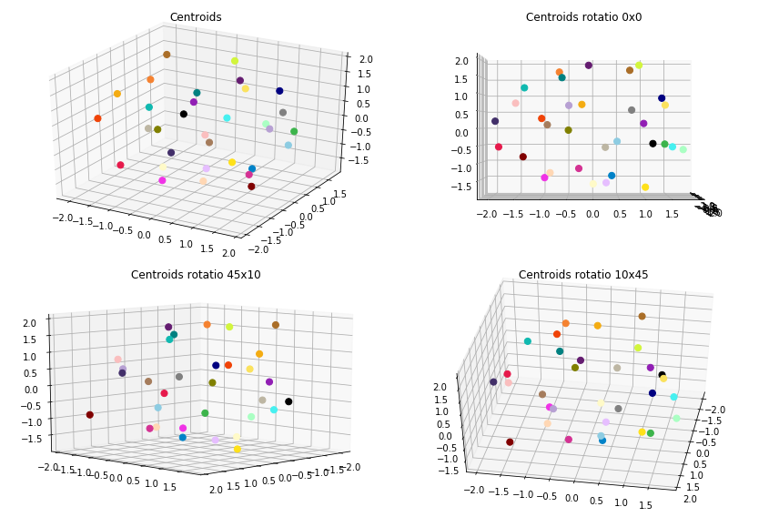
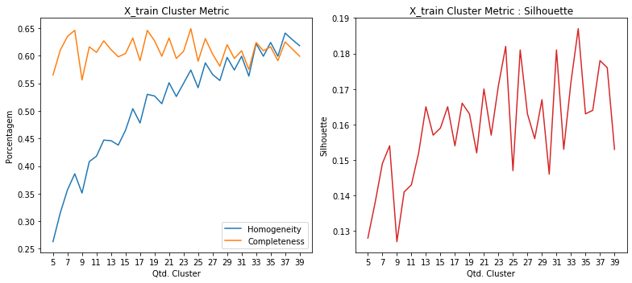
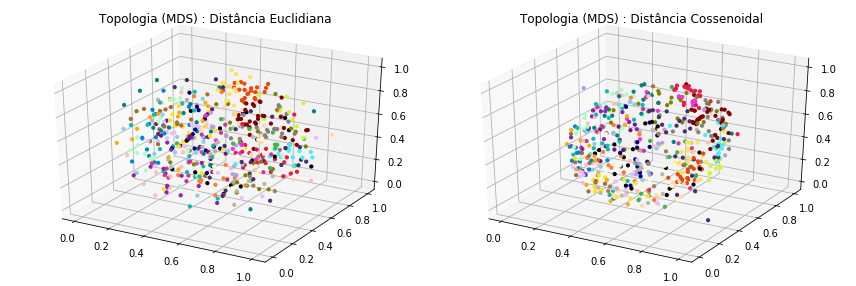
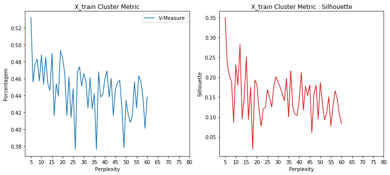
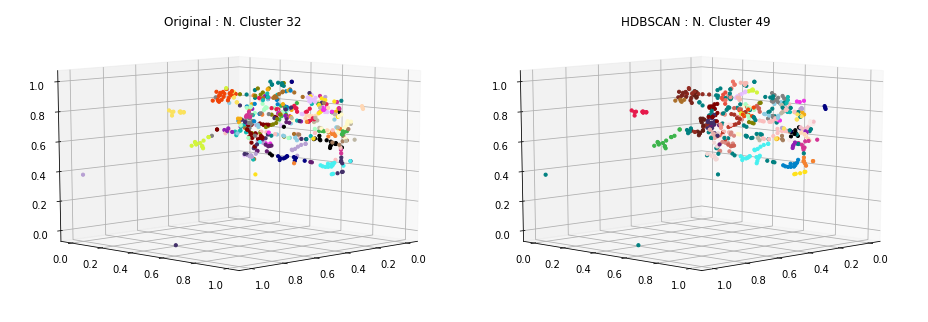
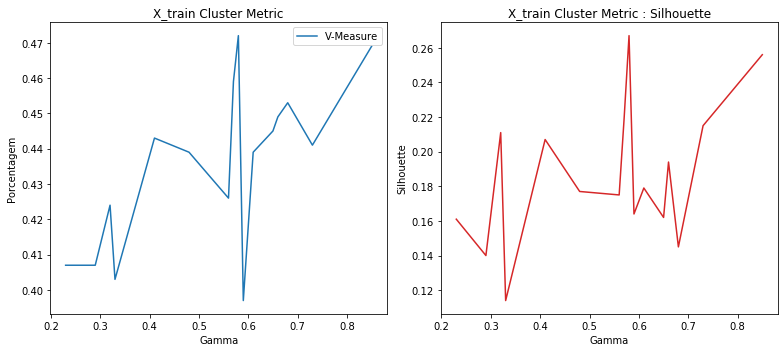
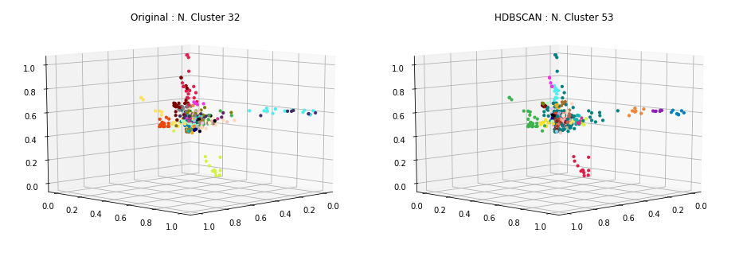
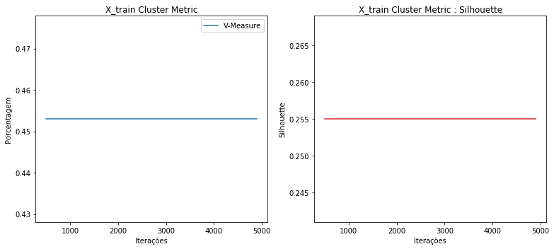
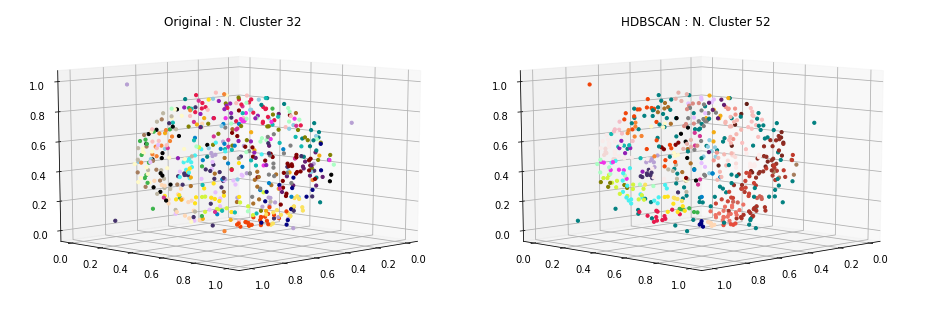

### Carregamento dos datasets

Os datasets de exemplos são frases já pré-categorizadas usadas em chatbots.

Contém 33 categorias e ao todo 696 documentos ou frases.

<table border="1" class="dataframe">
  <thead>
    <tr style="text-align: right;">
      <th></th>
      <th>perguntas</th>
      <th>cluster</th>
    </tr>
  </thead>
  <tbody>
    <tr>
      <th>13</th>
      <td>Como posso registrar um cartão SIM?</td>
      <td>ACTIVATE_DEVICE</td>
    </tr>
    <tr>
      <th>44</th>
      <td>Por favor adicione o roaming internacional na minha conta.</td>
      <td>ACTIVATE_ROAMING</td>
    </tr>
    <tr>
      <th>70</th>
      <td>Fui assaltado, preciso acionar seguro.</td>
      <td>ADD_INSURANCE</td>
    </tr>
    <tr>
      <th>97</th>
      <td>Oi, eu estava esperando que você pudesse me dizer como adicionar o recurso de mensagens de texto ao meu plano?</td>
      <td>ADD_SERVICE_FEATURES</td>
    </tr>
    <tr>
      <th>152</th>
      <td>Como cancelo meu serviço de telefone pré-pago?</td>
      <td>DEACTIVATE_PREPAID_PLAN</td>
    </tr>
    <tr>
      <th>195</th>
      <td>Você pode verificar se posso fazer um upgrade?</td>
      <td>DEVICE_UPGRADE_ELIGIBILITY</td>
    </tr>
    <tr>
      <th>34</th>
      <td>quero mudar minha password como devo proceder?</td>
      <td>PASSWORD</td>
    </tr>
    <tr>
      <th>24</th>
      <td>Minha Senha está com problema</td>
      <td>PASSWORD</td>
    </tr>
    <tr>
      <th>45</th>
      <td>Minha senha não funciona</td>
      <td>PASSWORD</td>
    </tr>
    <tr>
      <th>393</th>
      <td>Como faço para transferir o serviço de um dispositivo antigo para um novo?</td>
      <td>SWAP_DEVICE</td>
    </tr>
  </tbody>
</table>

    Qtde. de documentos por categoria:

<table border="1" class="dataframe">
  <thead>
    <tr style="text-align: right;">
      <th></th>
      <th>Categoria</th>
      <th>Qtde</th>
    </tr>
  </thead>
  <tbody>
    <tr>
      <th>0</th>
      <td>ACCOUNT</td>
      <td>29</td>
    </tr>
    <tr>
      <th>1</th>
      <td>ACTIVATE_DEVICE</td>
      <td>19</td>
    </tr>
    <tr>
      <th>2</th>
      <td>ACTIVATE_PREPAID_PLAN</td>
      <td>21</td>
    </tr>
    <tr>
      <th>3</th>
      <td>ACTIVATE_ROAMING</td>
      <td>20</td>
    </tr>
    <tr>
      <th>4</th>
      <td>ADD_INSURANCE</td>
      <td>18</td>
    </tr>
    <tr>
      <th>5</th>
      <td>ADD_SERVICE_FEATURES</td>
      <td>20</td>
    </tr>
    <tr>
      <th>6</th>
      <td>BOT_FOUND</td>
      <td>20</td>
    </tr>
    <tr>
      <th>7</th>
      <td>BOT_NAME</td>
      <td>16</td>
    </tr>
    <tr>
      <th>8</th>
      <td>CERTIFICATE</td>
      <td>18</td>
    </tr>
    <tr>
      <th>9</th>
      <td>CHANGE_PRICE_PLAN</td>
      <td>19</td>
    </tr>
    <tr>
      <th>10</th>
      <td>COVERAGE_AREA_INQUIRY</td>
      <td>19</td>
    </tr>
    <tr>
      <th>11</th>
      <td>DEACTIVATE_PREPAID_PLAN</td>
      <td>18</td>
    </tr>
    <tr>
      <th>12</th>
      <td>DEACTIVATE_ROAMING</td>
      <td>18</td>
    </tr>
    <tr>
      <th>13</th>
      <td>DEVICE_UPGRADE_ELIGIBILITY</td>
      <td>24</td>
    </tr>
    <tr>
      <th>14</th>
      <td>EMAIL</td>
      <td>40</td>
    </tr>
    <tr>
      <th>15</th>
      <td>INTERNATIONAL_RATE_PLAN_INQUIRY</td>
      <td>21</td>
    </tr>
    <tr>
      <th>16</th>
      <td>NETWORK_COMPLAINTS</td>
      <td>23</td>
    </tr>
    <tr>
      <th>17</th>
      <td>NETWORK_UNLOCK</td>
      <td>21</td>
    </tr>
    <tr>
      <th>18</th>
      <td>NO_OPTION</td>
      <td>18</td>
    </tr>
    <tr>
      <th>19</th>
      <td>PASSWORD</td>
      <td>27</td>
    </tr>
    <tr>
      <th>20</th>
      <td>PORT_IN</td>
      <td>21</td>
    </tr>
    <tr>
      <th>21</th>
      <td>PRICE_PLAN_INQUIRY</td>
      <td>23</td>
    </tr>
    <tr>
      <th>22</th>
      <td>RECHARGE_SIM</td>
      <td>18</td>
    </tr>
    <tr>
      <th>23</th>
      <td>REMOTE_ACCESS</td>
      <td>20</td>
    </tr>
    <tr>
      <th>24</th>
      <td>REMOVE_SERVICE_FEATURES</td>
      <td>20</td>
    </tr>
    <tr>
      <th>25</th>
      <td>RETURN_DEVICE</td>
      <td>21</td>
    </tr>
    <tr>
      <th>26</th>
      <td>ROAMING_INQUIRY</td>
      <td>20</td>
    </tr>
    <tr>
      <th>27</th>
      <td>SERVICES</td>
      <td>20</td>
    </tr>
    <tr>
      <th>28</th>
      <td>SWAP_DEVICE</td>
      <td>15</td>
    </tr>
    <tr>
      <th>29</th>
      <td>THANK_YOU</td>
      <td>23</td>
    </tr>
    <tr>
      <th>30</th>
      <td>TROUBLESHOOTING</td>
      <td>36</td>
    </tr>
    <tr>
      <th>31</th>
      <td>WIFI</td>
      <td>24</td>
    </tr>
  </tbody>
</table>

    Total docs     : 690
    Total cluster  : 690
    X_train size   : (552,)
    X_test  size   : (138,)

### Dataset tokenization

    Tokenization...
    Qtd documentos treino:  552
    Qtd Intents treino   :  32
    Finished...

    [TaggedDocument(words=['ir', 'viajar', 'certar', 'empresar', 'fornecer', 'cobertura', 'telefonar', 'viagem', 'poder', 'informacaes', 'servico', 'recepcao', 'disponivel'], tags=[0]),
     TaggedDocument(words=['servico', 'bot', 'oferecer'], tags=[1]),
     TaggedDocument(words=['voce', 'um', 'nome'], tags=[2]),
     TaggedDocument(words=['nao', 'recarregar', 'desativar', 'ativar'], tags=[3]),
     TaggedDocument(words=['voce', 'poder', 'ajudar', 'mudar', 'tocar', 'telefonar'], tags=[4]),
     TaggedDocument(words=['configurar', 'email', 'thunderbird'], tags=[5]),
     TaggedDocument(words=['nao', 'precisar', 'mais'], tags=[6]),
     TaggedDocument(words=['nao', 'conseguir', 'acessar', 'web', 'telefonar', 'nao', 'precisar', 'configuracao'], tags=[7]),
     TaggedDocument(words=['poder', 'correar', 'voz', 'permanentemente', 'remover', 'planar'], tags=[8]),
     TaggedDocument(words=['tutorial', 'configuracao', 'redar', 'fiar', 'android'], tags=[9])]

### **Doc2Vec**

Parâmetros iniciais... quantidade de dimensões dos vetores gerados para cada frase, épocas de treinamento e épocas de posterior inferência para novas frases.

A quantidade de épocas de inferência, sugere-se ser bem superior as de treinamento.

    Dimensions   : 500
    Epochs       : 200
    Infer Epochs : 15000

    Starting model...
    Building vocab...
    Training...
    Finish...

Validação do modelo gerado pelo Doc2Vec... teste tanto nos dados apresentados para treinamento quanto nos dados de testes e as acurácias alcançadas.

    - Acurácia treino: 100.0
     - Acurácia teste 1  : 58.0
     - Acurácia teste 2  : 58.0
     - Acurácia teste 3  : 57.0
     - Acurácia teste 4  : 64.0
     - Acurácia teste 5  : 59.0
    - Acurácia média teste: 59.2

### Clusterização

Utilizou-se o KMeans definindo a quantidade de clusters para o número ideal de categorias existentes no caso 33. A métrica de distância utilizada, não foi a euclidiana, mas sim a de cosseno (métrica comumente usada na classificação de texto em seu espaço vetorial).

    Frases por cluster:

<table border="1" class="dataframe">
  <thead>
    <tr style="text-align: right;">
      <th>title</th>
      <th>cluster</th>
    </tr>
  </thead>
  <tbody>
    <tr>
      <td>Existe a possibilidade de ter o meu dispositivo de telefone de alguma forma assegurado?</td>
      <td>0</td>
    </tr>
    <tr>
      <td>Eu vou estar viajando e estou certo se minha empresa fornece cobertura de telefone na minha área de viagens. Poderia me dar informações sobre onde o serviço e recepção estará disponível?</td>
      <td>0</td>
    </tr>
    <tr>
      <td>Quanto da área total no meu país é coberta pela recepção?</td>
      <td>0</td>
    </tr>
    <tr>
      <td>Qual é o mais recente plano 4G adequado para mim como um pacote família?</td>
      <td>1</td>
    </tr>
    <tr>
      <td>Gostaria de adicionar o MMS ao meu pacote.</td>
      <td>1</td>
    </tr>
    <tr>
      <td>Eu tenho um plano com outra empresa. Posso manter meu número?</td>
      <td>1</td>
    </tr>
    <tr>
      <td>Posso excluir o envio de sms?</td>
      <td>2</td>
    </tr>
    <tr>
      <td>Eu gostaria de cancelar o serviço de encaminhamento das minhas ligações. Como faço isso?</td>
      <td>2</td>
    </tr>
    <tr>
      <td>Você pode me dizer a tarifa atual de cobrança da Europa Continental para o Reino Unido do meu telefone?</td>
      <td>2</td>
    </tr>
    <tr>
      <td>Como cancelo meu serviço de telefone pré-pago?</td>
      <td>3</td>
    </tr>
    <tr>
      <td>Eu não sei como desativar meu telefone pré-pago, você pode me dizer?</td>
      <td>3</td>
    </tr>
    <tr>
      <td>Alguém poderia me mostrar como ativar meu novo dispositivo pré-pago?</td>
      <td>3</td>
    </tr>
    <tr>
      <td>tem como configurar meu email no outlook?</td>
      <td>4</td>
    </tr>
    <tr>
      <td>Como redirecionar meus emails para outro endereço</td>
      <td>4</td>
    </tr>
    <tr>
      <td>Como faço para recuperar meus emails?</td>
      <td>4</td>
    </tr>
    <tr>
      <td>Posso trocar meu equipamento para o mais recente e o melhor disponível?</td>
      <td>5</td>
    </tr>
    <tr>
      <td>Você pode explicar como desbloquear um gflex por favor?</td>
      <td>5</td>
    </tr>
    <tr>
      <td>Você pode verificar se posso fazer um upgrade?</td>
      <td>5</td>
    </tr>
    <tr>
      <td>Quanto vai custar para usar a quantidade de dados que normalmente uso, em Londres?</td>
      <td>6</td>
    </tr>
    <tr>
      <td>Como desligar meus dados automaticamente quando o WI-FI está disponível?</td>
      <td>6</td>
    </tr>
    <tr>
      <td>Oi, a velocidade de dados no meu dispositivo ainda está muito abaixo dos níveis anunciados. Isso já está acontecendo por dois meses agora. Como serei compensado por isso? Estou pensando em mudar de novo. Isto é uma quebra de contrato.</td>
      <td>6</td>
    </tr>
    <tr>
      <td>Há alguma limitação quanto aos países no exterior que eu posso chamar e acessar do meu país de origem?</td>
      <td>7</td>
    </tr>
    <tr>
      <td>Quais são os custos de fazer ligações internacionais do meu país?</td>
      <td>7</td>
    </tr>
    <tr>
      <td>Como posso fazer uma ligação internacional do meu país de origem?</td>
      <td>7</td>
    </tr>
    <tr>
      <td>Minha bateria esgotou rapidamente</td>
      <td>8</td>
    </tr>
    <tr>
      <td>Será que um humano pode me atender?</td>
      <td>8</td>
    </tr>
    <tr>
      <td>Oi Tom. Recebi o meu novo dispositivo. Gostaria de saber se você pode me ajudar a desativá-lo?</td>
      <td>8</td>
    </tr>
    <tr>
      <td>Problema com suporte</td>
      <td>9</td>
    </tr>
    <tr>
      <td>Estou tendo um problema com o meu telefone. Não consigo fazer ou receber chamadas! Eu preciso de ajuda!</td>
      <td>9</td>
    </tr>
    <tr>
      <td>Tenho problemas com a minha linha pré-paga. Existe um fórum disponível com passos/etapas que eu poderia seguir?</td>
      <td>9</td>
    </tr>
    <tr>
      <td>houve um erro de senha</td>
      <td>10</td>
    </tr>
    <tr>
      <td>quero mais informacoes sobre senhas e como proceder</td>
      <td>10</td>
    </tr>
    <tr>
      <td>como alterar minha senha do usuário?</td>
      <td>10</td>
    </tr>
    <tr>
      <td>Como posso desativar o roaming de dados em meu telefone?</td>
      <td>11</td>
    </tr>
    <tr>
      <td>Custo cancelamento roaming</td>
      <td>11</td>
    </tr>
    <tr>
      <td>Ajuda com a desativação de roaming</td>
      <td>11</td>
    </tr>
    <tr>
      <td>Como faço para me certificar que posso manter meu número de telefone quando troco de operadora?</td>
      <td>12</td>
    </tr>
    <tr>
      <td>Alteração de certificado digital</td>
      <td>12</td>
    </tr>
    <tr>
      <td>Revogação de certificado digital</td>
      <td>12</td>
    </tr>
    <tr>
      <td>Eu estive dirigido muito recentemente e foi praticamente impossível usar o serviço em algumas áreas. Você poderia me fornecer uma lista de locais / áreas com pouca ou nenhuma recepção?</td>
      <td>13</td>
    </tr>
    <tr>
      <td>Como trocar de plano, o plano ilimitado é muito caro</td>
      <td>13</td>
    </tr>
    <tr>
      <td>Quero informações sobre como alterar meu plano para uma nova oferta</td>
      <td>13</td>
    </tr>
    <tr>
      <td>Minhas mensagens de texto não estão funcionando. Não posso receber mensagens de texto, mas posso enviá-las. Pode me ajudar com isso?</td>
      <td>14</td>
    </tr>
    <tr>
      <td>Posso incluir mensagens de vídeo como um recurso de serviço novo no meu telefone?</td>
      <td>14</td>
    </tr>
    <tr>
      <td>Como faço para remover o serviço de mensagens de texto?</td>
      <td>14</td>
    </tr>
    <tr>
      <td>Quero perguntar sobre o cancelamento do pedido de um dispositivo móvel</td>
      <td>15</td>
    </tr>
    <tr>
      <td>Que tipo de planos de roaming são oferecidos pelo meu provedor de serviços? Gostaria de um plano econômico que me permita roaming enquanto viajo.</td>
      <td>15</td>
    </tr>
    <tr>
      <td>Você pode por favor me informar o status do meu Serviço de Valor Agregado (VAS) - novo toque de chamadas? Eu tinha pedido isso ontem, eu ainda não o vejo ativado.</td>
      <td>15</td>
    </tr>
    <tr>
      <td>Consulta sobre portabilidade</td>
      <td>16</td>
    </tr>
    <tr>
      <td>quem e voce?</td>
      <td>16</td>
    </tr>
    <tr>
      <td>você não possui outras opções para consultar?</td>
      <td>16</td>
    </tr>
    <tr>
      <td>Quais servicos posso remover diretamente pelo meu aparelho?</td>
      <td>17</td>
    </tr>
    <tr>
      <td>Como poderia ter meu correio de voz permanentemente removido do meu plano?</td>
      <td>17</td>
    </tr>
    <tr>
      <td>Remover o encaminhamento de chamada</td>
      <td>17</td>
    </tr>
    <tr>
      <td>Olá, eu tenho um novo dispositivo, e um cartão SIM de vocês com contrato mensal que obtive em uma loja, e já passaram 24 horas e o SIM ainda não está funcionando, e a loka está dizendo que tudo está ativado da parte deles</td>
      <td>18</td>
    </tr>
    <tr>
      <td>Como faço para transferir o serviço de um dispositivo antigo para um novo?</td>
      <td>18</td>
    </tr>
    <tr>
      <td>Eu não sei como desbloquear o meu novo dispositivo. Pode me dizer como?</td>
      <td>18</td>
    </tr>
    <tr>
      <td>Eu não sou elegível para uma atualização gratuita, mas eu gostaria de comprar um novo celular. Por favor, me mostre o preço do mais moderno.</td>
      <td>19</td>
    </tr>
    <tr>
      <td>Como trocar um plano de conversação direta para um telefone desta operadora gratuitamente?</td>
      <td>19</td>
    </tr>
    <tr>
      <td>Oi, eu preciso de um seguro para o meu telefone, quais são as opções disponíveis para o meu plano?</td>
      <td>19</td>
    </tr>
    <tr>
      <td>você atende outro tipo de serviço? ou só estes?</td>
      <td>20</td>
    </tr>
    <tr>
      <td>você disponibiliza outro tipo de serviço?</td>
      <td>20</td>
    </tr>
    <tr>
      <td>Bom dia, eu me pergunto se você gostaria de saber quais são as áreas de cobertura da companhia telefônica?</td>
      <td>20</td>
    </tr>
    <tr>
      <td>Indique quanto tempo eu aguardo para mudar meu telefone para um modelo mais novo</td>
      <td>21</td>
    </tr>
    <tr>
      <td>Eu quero obter um telefone diferente.</td>
      <td>21</td>
    </tr>
    <tr>
      <td>Eu pedi o plano errado. Você poderia mudar isso para o plano de R$ 50?</td>
      <td>21</td>
    </tr>
    <tr>
      <td>Eu já tenho um sim da operadora, eu quero adicionar serviço de roaming internacional.</td>
      <td>22</td>
    </tr>
    <tr>
      <td>E se eu diminuir meu plano de dados para 5Gb e desejar alterá-lo de volta para 15GB minutos depois. Posso pegar meu plano atual de volta?</td>
      <td>22</td>
    </tr>
    <tr>
      <td>como você se chama?</td>
      <td>22</td>
    </tr>
    <tr>
      <td>O que eu preciso fazer para desbloquear meu novo aparelho?</td>
      <td>23</td>
    </tr>
    <tr>
      <td>Quero ativar o meu novo aparelho telefonico por favor</td>
      <td>23</td>
    </tr>
    <tr>
      <td>Preciso saber como devolver meu celular</td>
      <td>23</td>
    </tr>
    <tr>
      <td>não obrigado, isso é tudo</td>
      <td>24</td>
    </tr>
    <tr>
      <td>Não consigo iniciar o bluetooth para emparelhar com o fone de ouvido, o que devo fazer?</td>
      <td>24</td>
    </tr>
    <tr>
      <td>Meu email não entra, sem acesso</td>
      <td>24</td>
    </tr>
    <tr>
      <td>poxa, obrigado, me ajudou muito</td>
      <td>25</td>
    </tr>
    <tr>
      <td>muito obrigado mesmo</td>
      <td>25</td>
    </tr>
    <tr>
      <td>acho que nenhuma opção padrão me interessa</td>
      <td>25</td>
    </tr>
    <tr>
      <td>utilizar o acesso remoto via vpn</td>
      <td>26</td>
    </tr>
    <tr>
      <td>voce nao sabe nada sobre vpn?</td>
      <td>26</td>
    </tr>
    <tr>
      <td>how to configure vpn?</td>
      <td>26</td>
    </tr>
    <tr>
      <td>Eu estou pagando pela cobertura da LTE. Eu não posso usar isso? Espero que isso seja refletido como um desconto na minha conta até que eu possa usar o que eu pago.</td>
      <td>27</td>
    </tr>
    <tr>
      <td>Você pode me enviar uma nova cópia da minha conta?</td>
      <td>27</td>
    </tr>
    <tr>
      <td>Eu quero adicionar um serviço de produto à minha conta, ou seja, mais dados ao seguro eurotraveller</td>
      <td>27</td>
    </tr>
    <tr>
      <td>Preciso ir até uma loja para ativar meu novo SIM?</td>
      <td>28</td>
    </tr>
    <tr>
      <td>Quando meu produto solicitado será ativado?</td>
      <td>28</td>
    </tr>
    <tr>
      <td>Não consigo receber chamadas no meu telefone, mas posso fazer chamadas para qualquer pessoa em qualquer lugar.</td>
      <td>28</td>
    </tr>
    <tr>
      <td>Preciso de outro tipo de ajuda</td>
      <td>29</td>
    </tr>
    <tr>
      <td>Preciso remover o MMS no meu telefone.</td>
      <td>29</td>
    </tr>
    <tr>
      <td>Eu não quero mais usar meu telefone pré-pago atual.</td>
      <td>29</td>
    </tr>
    <tr>
      <td>Não consigo acessar a web no meu telefone, não tenho certeza se isso precisar de algumas configurações.</td>
      <td>30</td>
    </tr>
    <tr>
      <td>Eu não sei porque, mas o meu telefone não funciona em casa.</td>
      <td>30</td>
    </tr>
    <tr>
      <td>Ei, quando estou no meu jardim eu não consigo um sinal, pode explicar isto por favor?</td>
      <td>30</td>
    </tr>
    <tr>
      <td>como acessar os sistemas da empresa de casa</td>
      <td>31</td>
    </tr>
    <tr>
      <td>como eu faco para acessar a rede da empresa estando eu em outro pais</td>
      <td>31</td>
    </tr>
    <tr>
      <td>como acessar wifi da empresa?</td>
      <td>31</td>
    </tr>
  </tbody>
</table>

    --------------------
    Documentos por cluster:

<table border="1" class="dataframe">
  <tbody>
    <tr>
      <td>C0</td>
      <td>13</td>
    </tr>
    <tr>
      <td>C1</td>
      <td>8</td>
    </tr>
    <tr>
      <td>C2</td>
      <td>6</td>
    </tr>
    <tr>
      <td>C3</td>
      <td>31</td>
    </tr>
    <tr>
      <td>C4</td>
      <td>19</td>
    </tr>
    <tr>
      <td>C5</td>
      <td>8</td>
    </tr>
    <tr>
      <td>C6</td>
      <td>13</td>
    </tr>
    <tr>
      <td>C7</td>
      <td>13</td>
    </tr>
    <tr>
      <td>C8</td>
      <td>28</td>
    </tr>
    <tr>
      <td>C9</td>
      <td>11</td>
    </tr>
    <tr>
      <td>C10</td>
      <td>22</td>
    </tr>
    <tr>
      <td>C11</td>
      <td>27</td>
    </tr>
    <tr>
      <td>C12</td>
      <td>13</td>
    </tr>
    <tr>
      <td>C13</td>
      <td>9</td>
    </tr>
    <tr>
      <td>C14</td>
      <td>9</td>
    </tr>
    <tr>
      <td>C15</td>
      <td>11</td>
    </tr>
    <tr>
      <td>C16</td>
      <td>16</td>
    </tr>
    <tr>
      <td>C17</td>
      <td>10</td>
    </tr>
    <tr>
      <td>C18</td>
      <td>19</td>
    </tr>
    <tr>
      <td>C19</td>
      <td>33</td>
    </tr>
    <tr>
      <td>C20</td>
      <td>16</td>
    </tr>
    <tr>
      <td>C21</td>
      <td>18</td>
    </tr>
    <tr>
      <td>C22</td>
      <td>25</td>
    </tr>
    <tr>
      <td>C23</td>
      <td>19</td>
    </tr>
    <tr>
      <td>C24</td>
      <td>24</td>
    </tr>
    <tr>
      <td>C25</td>
      <td>13</td>
    </tr>
    <tr>
      <td>C26</td>
      <td>12</td>
    </tr>
    <tr>
      <td>C27</td>
      <td>23</td>
    </tr>
    <tr>
      <td>C28</td>
      <td>21</td>
    </tr>
    <tr>
      <td>C29</td>
      <td>15</td>
    </tr>
    <tr>
      <td>C30</td>
      <td>11</td>
    </tr>
    <tr>
      <td>C31</td>
      <td>36</td>
    </tr>
  </tbody>
</table>

### Visualização

Apresentação dos protótipos gerados pelo KMeans, reduzindo a dimensão usando o algoritmo MDS (Multidimensional Scaling).

### Clusterização dos dados de Teste

Por fim, realizada a clusterização dos dados de teste e a apresentação das 8 primeiras frases do conjunto de teste juntamente com outras duas frases do cluster ao qual foi identificado como o melhor.

    * Se eu ativar roaming agora, já posso utilizar?
      -  utilizar o acesso remoto via vpn
      -  how to configure vpn?
    --------------------
    * Fui assaltado, preciso acionar seguro.
      -  Como trocar um plano de conversação direta para um telefone desta operadora gratuitamente?
      -  Oi, eu preciso de um seguro para o meu telefone, quais são as opções disponíveis para o meu plano?
    --------------------
    * Estou bastante cansado do meu telefone existente e gostaria de saber quando eu vou ser elegível para sua atualização?
      -  Como faço para transferir o serviço de um dispositivo antigo para um novo?
      -  Eu não sei como desbloquear o meu novo dispositivo. Pode me dizer como?
    --------------------
    * Oi, como posso ativar o encaminhamento de chamada no meu plano?
      -  Remover o encaminhamento de chamada
      -  Quais servicos posso remover diretamente pelo meu aparelho?
    --------------------
    * Eu não consigo acessar meu email
      -  Não consigo iniciar o bluetooth para emparelhar com o fone de ouvido, o que devo fazer?
      -  Meu email não entra, sem acesso
    --------------------
    * Estou indo para uma viagem ao extremo norte da Ilha de Vancouver e gostaria de verificar se há serviço de celular nessa área. Você pode verificar o quanto longe do norte eu posso esperar para receber a recepção.
      -  Que tipo de planos de roaming são oferecidos pelo meu provedor de serviços? Gostaria de um plano econômico que me permita roaming enquanto viajo.
      -  Quero perguntar sobre o cancelamento do pedido de um dispositivo móvel
    --------------------
    * Gostaria de verificar todas as taxas para cobertura internacional
      -  E se eu diminuir meu plano de dados para 5Gb e desejar alterá-lo de volta para 15GB minutos depois. Posso pegar meu plano atual de volta?
      -  Eu já tenho um sim da operadora, eu quero adicionar serviço de roaming internacional.
    --------------------
    * Além do fornecimento de água vocês oferecem algum outro serviço?
      -  Bom dia, eu me pergunto se você gostaria de saber quais são as áreas de cobertura da companhia telefônica?
      -  você atende outro tipo de serviço? ou só estes?
    --------------------

### Métricas

Abaixo são apresentadas métricas para demonstrar o quanto a clusterização parece funcionar.

    Homogeneidade    :  0.668
    Completude       :  0.687
    V-Measure        :  0.678
    Silhouette       :  0.004

Como exemplo de comparação, foi executado o mesmo algoritmo de clusterização (conforme apresentado acima) entretanto variando a quantidade do número de clusters para verificar como as métricas se comportam.

### HDBSCAN no espaço dos dados

    Frases por cluster:

<table border="1" class="dataframe">
  <thead>
    <tr style="text-align: right;">
      <th>title</th>
      <th>cluster</th>
    </tr>
  </thead>
  <tbody>
    <tr>
      <td>Essa não é a instrução que me deram. Me mandaram um novo chip e me mandaram transferir meu velho número da outra operadora</td>
      <td>0</td>
    </tr>
    <tr>
      <td>Posso transferir meus dados quando troco telefones?</td>
      <td>0</td>
    </tr>
    <tr>
      <td>Como trocar um plano de conversação direta para um telefone desta operadora gratuitamente?</td>
      <td>0</td>
    </tr>
    <tr>
      <td>Se eu recarregar R$ 50, o que eu ganho?</td>
      <td>1</td>
    </tr>
    <tr>
      <td>Quanto preciso pagar para ativar meu plano pré-pago?</td>
      <td>1</td>
    </tr>
    <tr>
      <td>Por favor, eu preciso de uma maneira fácil de recarregar.</td>
      <td>1</td>
    </tr>
    <tr>
      <td>Se eu mudar um proveder, o que acontecerá com o meu número atual?</td>
      <td>2</td>
    </tr>
    <tr>
      <td>Quanto tempo eu tenho para devolver o telefone, se eu mudar de ideia?</td>
      <td>2</td>
    </tr>
    <tr>
      <td>Você poderia me ajudar em como mudar o toque do meu telefone?</td>
      <td>2</td>
    </tr>
    <tr>
      <td>posso fazer a configuracao em meu so sem usar a informacao de certificado digital disponibilizada?</td>
      <td>3</td>
    </tr>
    <tr>
      <td>quero solicitar a renovação de um certificado digital</td>
      <td>3</td>
    </tr>
    <tr>
      <td>como emitir novos certificados digitais?</td>
      <td>3</td>
    </tr>
    <tr>
      <td>Ei, posso incluir chamada internacional por favor</td>
      <td>4</td>
    </tr>
    <tr>
      <td>Chamadas feitas enquanto estou viajando no exterior estão incluídas no meu plano?</td>
      <td>4</td>
    </tr>
    <tr>
      <td>Como atualizo minha conta para incluir chamadas internacionais?</td>
      <td>4</td>
    </tr>
    <tr>
      <td>Você pode me ajudar a aumentar meus minutos no meu telefone?</td>
      <td>5</td>
    </tr>
    <tr>
      <td>Quero adicionar minutos à minha subscrição.</td>
      <td>5</td>
    </tr>
    <tr>
      <td>Como adiciono minutos?</td>
      <td>5</td>
    </tr>
    <tr>
      <td>é permitido que patrulheiros tenham uma conta?</td>
      <td>6</td>
    </tr>
    <tr>
      <td>Como posso criar uma conta para Colaborador Externo?</td>
      <td>6</td>
    </tr>
    <tr>
      <td>um patrulheiro pode ter uma conta de usuário?</td>
      <td>6</td>
    </tr>
    <tr>
      <td>Você pode me dizer como posso retornar meu telefone atual para uma atualização?</td>
      <td>7</td>
    </tr>
    <tr>
      <td>Eu fiz uma atualização e eu quero registrar um novo cartão SIM.</td>
      <td>7</td>
    </tr>
    <tr>
      <td>Quero registrar o meu chip e o telefone novo</td>
      <td>7</td>
    </tr>
    <tr>
      <td>Oi! Este telefone tem seguro? Posso fazer o seguro para este telefone eu mesmo?</td>
      <td>8</td>
    </tr>
    <tr>
      <td>Quero saber se posso comprar o seguro de telefone.</td>
      <td>8</td>
    </tr>
    <tr>
      <td>Eu gostaria de comprar um plano somente</td>
      <td>8</td>
    </tr>
    <tr>
      <td>vc tem nome?</td>
      <td>9</td>
    </tr>
    <tr>
      <td>como e o seu nome?</td>
      <td>9</td>
    </tr>
    <tr>
      <td>qual o nome que atribuiram a você?</td>
      <td>9</td>
    </tr>
    <tr>
      <td>consigo alterar meu username para um novo?</td>
      <td>10</td>
    </tr>
    <tr>
      <td>é possível trocar o meu username?</td>
      <td>10</td>
    </tr>
    <tr>
      <td>Username já cadastrado</td>
      <td>10</td>
    </tr>
    <tr>
      <td>utilizar o acesso remoto via vpn</td>
      <td>11</td>
    </tr>
    <tr>
      <td>how to configure vpn?</td>
      <td>11</td>
    </tr>
    <tr>
      <td>como utilizar acesso vpn</td>
      <td>11</td>
    </tr>
    <tr>
      <td>Oi. Tenho um sinal forte, mas não consigo fazer ou receber chamadas. Você pode me ajudar a ver como resolver esse problema?</td>
      <td>12</td>
    </tr>
    <tr>
      <td>Estou tendo um problema com o meu telefone. Não consigo fazer ou receber chamadas! Eu preciso de ajuda!</td>
      <td>12</td>
    </tr>
    <tr>
      <td>Não consigo receber chamadas no meu telefone, mas posso fazer chamadas para qualquer pessoa em qualquer lugar.</td>
      <td>12</td>
    </tr>
    <tr>
      <td>Quais os meios de cancelamento do meu plano pré-pago?</td>
      <td>13</td>
    </tr>
    <tr>
      <td>O que eu preciso fazer para que o serviço do telefone pré-pago seja desligado?</td>
      <td>13</td>
    </tr>
    <tr>
      <td>Como posso cancelar minha linha de telefone pré-pago?</td>
      <td>13</td>
    </tr>
    <tr>
      <td>Quero saber sobre os planos pré-pagos</td>
      <td>14</td>
    </tr>
    <tr>
      <td>Quais são os preços para os planos de dados e chamadas diferentes que você oferece?</td>
      <td>14</td>
    </tr>
    <tr>
      <td>Que planos de dados posso escolher?</td>
      <td>14</td>
    </tr>
    <tr>
      <td>acho que nenhuma opção padrão me interessa</td>
      <td>15</td>
    </tr>
    <tr>
      <td>nenhuma das opções apresentadas tem o que quero fazer</td>
      <td>15</td>
    </tr>
    <tr>
      <td>nenhuma dessas opções me interessa</td>
      <td>15</td>
    </tr>
    <tr>
      <td>acessar a rede wifi (sem fio) no macbook</td>
      <td>16</td>
    </tr>
    <tr>
      <td>como acessa a rede interna da empresa da minha casa?</td>
      <td>16</td>
    </tr>
    <tr>
      <td>quero acessar a rede da empresa da minha casa</td>
      <td>16</td>
    </tr>
    <tr>
      <td>Desativar meu dispositivo quando no exterior</td>
      <td>17</td>
    </tr>
    <tr>
      <td>Quero desligar o roaming da minha conta</td>
      <td>17</td>
    </tr>
    <tr>
      <td>Se eu estiver nos EUA, consigo ligar na boa pro Brasil com o roaming?</td>
      <td>17</td>
    </tr>
    <tr>
      <td>voce nao conseguiu me ajudar, quero falar com um humano</td>
      <td>18</td>
    </tr>
    <tr>
      <td>Você não resolveu meu problema, quero falar com um humano</td>
      <td>18</td>
    </tr>
    <tr>
      <td>um chatbot nao conseguirá resolver meu problema</td>
      <td>18</td>
    </tr>
    <tr>
      <td>estou falando com um chatbot com certeza</td>
      <td>19</td>
    </tr>
    <tr>
      <td>Você é um bot?</td>
      <td>19</td>
    </tr>
    <tr>
      <td>Quero falar com um humano</td>
      <td>19</td>
    </tr>
    <tr>
      <td>inseri o email e senha e não deu certo</td>
      <td>20</td>
    </tr>
    <tr>
      <td>meu usuário e senha não estão funcionando</td>
      <td>20</td>
    </tr>
    <tr>
      <td>Minha senha não funciona</td>
      <td>20</td>
    </tr>
    <tr>
      <td>como recuperar meus emails?</td>
      <td>21</td>
    </tr>
    <tr>
      <td>Como faço para recuperar meus emails?</td>
      <td>21</td>
    </tr>
    <tr>
      <td>Não consigo recuperar a minha senha</td>
      <td>21</td>
    </tr>
    <tr>
      <td>o acesso ao meu email foi bloqueado</td>
      <td>22</td>
    </tr>
    <tr>
      <td>Não consigo iniciar o bluetooth para emparelhar com o fone de ouvido, o que devo fazer?</td>
      <td>22</td>
    </tr>
    <tr>
      <td>tem como configurar meu email no outlook?</td>
      <td>22</td>
    </tr>
    <tr>
      <td>nao preciso mais de ajuda</td>
      <td>23</td>
    </tr>
    <tr>
      <td>preciso de ajudar</td>
      <td>23</td>
    </tr>
    <tr>
      <td>não preciso mais de ajuda, estou satisfeito</td>
      <td>23</td>
    </tr>
    <tr>
      <td>você tem outras opções para ajudar?</td>
      <td>24</td>
    </tr>
    <tr>
      <td>estou com problemas de autenticacao</td>
      <td>24</td>
    </tr>
    <tr>
      <td>quem e voce?</td>
      <td>24</td>
    </tr>
    <tr>
      <td>poxa, obrigado, me ajudou muito</td>
      <td>25</td>
    </tr>
    <tr>
      <td>muitíssimo obrigado</td>
      <td>25</td>
    </tr>
    <tr>
      <td>agradeço muito ajuda</td>
      <td>25</td>
    </tr>
    <tr>
      <td>Algo parece estar seriamente errado, já que nem posso fazer nem receber chamadas independentemente de onde estou.</td>
      <td>26</td>
    </tr>
    <tr>
      <td>isso e tudo, obrigado</td>
      <td>26</td>
    </tr>
    <tr>
      <td>Qual é o mais recente plano 4G adequado para mim como um pacote família?</td>
      <td>26</td>
    </tr>
  </tbody>
</table>

    --------------------
    Documentos por cluster:

<table border="1" class="dataframe">
  <tbody>
    <tr>
      <td>C0</td>
      <td>6</td>
    </tr>
    <tr>
      <td>C1</td>
      <td>7</td>
    </tr>
    <tr>
      <td>C2</td>
      <td>11</td>
    </tr>
    <tr>
      <td>C3</td>
      <td>12</td>
    </tr>
    <tr>
      <td>C4</td>
      <td>8</td>
    </tr>
    <tr>
      <td>C5</td>
      <td>6</td>
    </tr>
    <tr>
      <td>C6</td>
      <td>6</td>
    </tr>
    <tr>
      <td>C7</td>
      <td>6</td>
    </tr>
    <tr>
      <td>C8</td>
      <td>13</td>
    </tr>
    <tr>
      <td>C9</td>
      <td>12</td>
    </tr>
    <tr>
      <td>C10</td>
      <td>9</td>
    </tr>
    <tr>
      <td>C11</td>
      <td>9</td>
    </tr>
    <tr>
      <td>C12</td>
      <td>6</td>
    </tr>
    <tr>
      <td>C13</td>
      <td>6</td>
    </tr>
    <tr>
      <td>C14</td>
      <td>5</td>
    </tr>
    <tr>
      <td>C15</td>
      <td>5</td>
    </tr>
    <tr>
      <td>C16</td>
      <td>31</td>
    </tr>
    <tr>
      <td>C17</td>
      <td>16</td>
    </tr>
    <tr>
      <td>C18</td>
      <td>5</td>
    </tr>
    <tr>
      <td>C19</td>
      <td>15</td>
    </tr>
    <tr>
      <td>C20</td>
      <td>5</td>
    </tr>
    <tr>
      <td>C21</td>
      <td>7</td>
    </tr>
    <tr>
      <td>C22</td>
      <td>18</td>
    </tr>
    <tr>
      <td>C23</td>
      <td>7</td>
    </tr>
    <tr>
      <td>C24</td>
      <td>10</td>
    </tr>
    <tr>
      <td>C25</td>
      <td>7</td>
    </tr>
    <tr>
      <td>C26</td>
      <td>304</td>
    </tr>
  </tbody>
</table>

### Topologia dos dados de treinamento usando MDS

## **HDBSCAN**

 - [How HDBSCAN Works](https://nbviewer.jupyter.org/github/scikit-learn-contrib/hdbscan/blob/master/notebooks/How%20HDBSCAN%20Works.ipynb)
 - [hdbscan github implementation](https://github.com/scikit-learn-contrib/hdbscan)
 - [Density-Based Clustering Based on Hierarchical Density Estimates](https://link.springer.com/chapter/10.1007/978-3-642-37456-2_14)

---

## **t-SNE + HDBSCAN**

<table border="1" class="dataframe">
  <thead>
    <tr style="text-align: right;">
      <th></th>
      <th>Perplexity</th>
      <th>Learning Rate</th>
      <th>Angle</th>
      <th>V-Measure</th>
      <th>Silhouette</th>
    </tr>
  </thead>
  <tbody>
    <tr>
      <th>0</th>
      <td>5</td>
      <td>125</td>
      <td>0.87</td>
      <td>0.532</td>
      <td>0.349</td>
    </tr>
    <tr>
      <th>7</th>
      <td>12</td>
      <td>186</td>
      <td>0.79</td>
      <td>0.485</td>
      <td>0.282</td>
    </tr>
    <tr>
      <th>10</th>
      <td>15</td>
      <td>125</td>
      <td>0.87</td>
      <td>0.490</td>
      <td>0.250</td>
    </tr>
    <tr>
      <th>5</th>
      <td>10</td>
      <td>127</td>
      <td>0.67</td>
      <td>0.488</td>
      <td>0.231</td>
    </tr>
    <tr>
      <th>1</th>
      <td>6</td>
      <td>276</td>
      <td>0.85</td>
      <td>0.456</td>
      <td>0.230</td>
    </tr>
    <tr>
      <th>31</th>
      <td>36</td>
      <td>276</td>
      <td>0.85</td>
      <td>0.376</td>
      <td>0.216</td>
    </tr>
    <tr>
      <th>36</th>
      <td>41</td>
      <td>140</td>
      <td>0.83</td>
      <td>0.469</td>
      <td>0.212</td>
    </tr>
    <tr>
      <th>2</th>
      <td>7</td>
      <td>129</td>
      <td>0.84</td>
      <td>0.477</td>
      <td>0.205</td>
    </tr>
    <tr>
      <th>24</th>
      <td>29</td>
      <td>161</td>
      <td>0.86</td>
      <td>0.451</td>
      <td>0.201</td>
    </tr>
    <tr>
      <th>29</th>
      <td>34</td>
      <td>215</td>
      <td>0.76</td>
      <td>0.424</td>
      <td>0.197</td>
    </tr>
    <tr>
      <th>14</th>
      <td>19</td>
      <td>161</td>
      <td>0.86</td>
      <td>0.493</td>
      <td>0.193</td>
    </tr>
    <tr>
      <th>25</th>
      <td>30</td>
      <td>127</td>
      <td>0.67</td>
      <td>0.466</td>
      <td>0.188</td>
    </tr>
    <tr>
      <th>45</th>
      <td>50</td>
      <td>175</td>
      <td>0.85</td>
      <td>0.434</td>
      <td>0.187</td>
    </tr>
    <tr>
      <th>3</th>
      <td>8</td>
      <td>137</td>
      <td>0.87</td>
      <td>0.483</td>
      <td>0.187</td>
    </tr>
    <tr>
      <th>15</th>
      <td>20</td>
      <td>127</td>
      <td>0.67</td>
      <td>0.484</td>
      <td>0.182</td>
    </tr>
    <tr>
      <th>40</th>
      <td>45</td>
      <td>161</td>
      <td>0.89</td>
      <td>0.447</td>
      <td>0.181</td>
    </tr>
    <tr>
      <th>6</th>
      <td>11</td>
      <td>140</td>
      <td>0.83</td>
      <td>0.453</td>
      <td>0.180</td>
    </tr>
    <tr>
      <th>43</th>
      <td>48</td>
      <td>178</td>
      <td>0.87</td>
      <td>0.428</td>
      <td>0.180</td>
    </tr>
    <tr>
      <th>23</th>
      <td>28</td>
      <td>137</td>
      <td>0.87</td>
      <td>0.474</td>
      <td>0.178</td>
    </tr>
    <tr>
      <th>38</th>
      <td>43</td>
      <td>121</td>
      <td>0.87</td>
      <td>0.460</td>
      <td>0.177</td>
    </tr>
    <tr>
      <th>12</th>
      <td>17</td>
      <td>129</td>
      <td>0.84</td>
      <td>0.454</td>
      <td>0.175</td>
    </tr>
    <tr>
      <th>26</th>
      <td>31</td>
      <td>140</td>
      <td>0.83</td>
      <td>0.457</td>
      <td>0.175</td>
    </tr>
    <tr>
      <th>20</th>
      <td>25</td>
      <td>125</td>
      <td>0.87</td>
      <td>0.448</td>
      <td>0.169</td>
    </tr>
    <tr>
      <th>52</th>
      <td>57</td>
      <td>159</td>
      <td>0.81</td>
      <td>0.457</td>
      <td>0.166</td>
    </tr>
    <tr>
      <th>27</th>
      <td>32</td>
      <td>186</td>
      <td>0.79</td>
      <td>0.425</td>
      <td>0.159</td>
    </tr>
  </tbody>
</table>

    Homogeneidade    :  0.541
    Completude       :  0.523
    V-Measure        :  0.532
    Silhouette       :  0.349

    Frases por cluster:

<table border="1" class="dataframe">
  <thead>
    <tr style="text-align: right;">
      <th>title</th>
      <th>cluster</th>
    </tr>
  </thead>
  <tbody>
    <tr>
      <td>how to configure vpn?</td>
      <td>0</td>
    </tr>
    <tr>
      <td>gostaria de utilizar a vpn da empresa</td>
      <td>0</td>
    </tr>
    <tr>
      <td>voce nao sabe nada sobre vpn?</td>
      <td>0</td>
    </tr>
    <tr>
      <td>quero mais informacoes sobre senhas e como proceder</td>
      <td>1</td>
    </tr>
    <tr>
      <td>Solicitação de certificado digital</td>
      <td>1</td>
    </tr>
    <tr>
      <td>quero revogar meu certificado digital emitido para meu sistema</td>
      <td>1</td>
    </tr>
    <tr>
      <td>ainda estou com dificuldades, um bot não pode resolver meu problema</td>
      <td>2</td>
    </tr>
    <tr>
      <td>Você não resolveu meu problema, quero falar com um humano</td>
      <td>2</td>
    </tr>
    <tr>
      <td>voce nao conseguiu me ajudar, quero falar com um atendente</td>
      <td>2</td>
    </tr>
    <tr>
      <td>eu nao gosto de falar com chatbots</td>
      <td>3</td>
    </tr>
    <tr>
      <td>não quero falar com um bot, quero falar com um humano</td>
      <td>3</td>
    </tr>
    <tr>
      <td>você é um chatbot?</td>
      <td>3</td>
    </tr>
    <tr>
      <td>Posso falar com um humano?</td>
      <td>4</td>
    </tr>
    <tr>
      <td>Preciso que um humano me ajude</td>
      <td>4</td>
    </tr>
    <tr>
      <td>Será que um humano pode me atender?</td>
      <td>4</td>
    </tr>
    <tr>
      <td>Eu quero mudar meu serviço para um novo dispositivo, mas mantendo os mesmos dados pessoais. Você pode me dizer como fazê-lo?</td>
      <td>5</td>
    </tr>
    <tr>
      <td>Quanto é a taxa de ativação de um novo cartão SIM da minha operadora?</td>
      <td>5</td>
    </tr>
    <tr>
      <td>Olá. É possível mudar o meu provedor para outro enquanto mantenho este número?</td>
      <td>5</td>
    </tr>
    <tr>
      <td>muito obrigado mesmo</td>
      <td>6</td>
    </tr>
    <tr>
      <td>não tem outras opções para me mostrar?</td>
      <td>6</td>
    </tr>
    <tr>
      <td>essas opções não tem o que estou procurando</td>
      <td>6</td>
    </tr>
    <tr>
      <td>Eu preciso recarregar o dongle que pago mensalmente. Os dados foram consumidos.</td>
      <td>7</td>
    </tr>
    <tr>
      <td>Eu preciso devolver os controles para a empresa?</td>
      <td>7</td>
    </tr>
    <tr>
      <td>Preciso saber como devolver meu celular</td>
      <td>7</td>
    </tr>
    <tr>
      <td>Esta operadora pode adicionar o seguro no celular após 30 dias?</td>
      <td>8</td>
    </tr>
    <tr>
      <td>Se eu cancelar o roaming agora, demora muito pra concluir o pedido?</td>
      <td>8</td>
    </tr>
    <tr>
      <td>Como ativar meu roaming pra usar na Argentina?</td>
      <td>8</td>
    </tr>
    <tr>
      <td>Olá. Eu nunca fiz uma chamada internacional no meu telefone e gostaria de saber sobre o que acontece se eu fizer?</td>
      <td>9</td>
    </tr>
    <tr>
      <td>como e o seu nome?</td>
      <td>9</td>
    </tr>
    <tr>
      <td>seu nome qual é mesmo?</td>
      <td>9</td>
    </tr>
    <tr>
      <td>Quando meu produto solicitado será ativado?</td>
      <td>10</td>
    </tr>
    <tr>
      <td>Quanto me custará por minuto para chamar minha tia na Austrália?</td>
      <td>10</td>
    </tr>
    <tr>
      <td>Quanto vai custar para usar a quantidade de dados que normalmente uso, em Londres?</td>
      <td>10</td>
    </tr>
    <tr>
      <td>Como desativar a função roaming?</td>
      <td>11</td>
    </tr>
    <tr>
      <td>Qual a carência para desativar o roaming?</td>
      <td>11</td>
    </tr>
    <tr>
      <td>Eu tenho algumas perguntas sobre roaming.</td>
      <td>11</td>
    </tr>
    <tr>
      <td>quero acessar a rede rede sem fim (wifi)</td>
      <td>12</td>
    </tr>
    <tr>
      <td>como acessar wifi da empresa?</td>
      <td>12</td>
    </tr>
    <tr>
      <td>acessar a rede wifi (sem fio) no macbook</td>
      <td>12</td>
    </tr>
    <tr>
      <td>Como posso ativar o uso internacional na minha linha?</td>
      <td>13</td>
    </tr>
    <tr>
      <td>Eu estava querendo me inscrever em um plano com sua empresa e estava pensando quais são alguns dos planos de preços que você tem para oferecer?</td>
      <td>13</td>
    </tr>
    <tr>
      <td>Gostaria de alterar meu plano de preços. Você pode listar opções de planos de preços que têm conversas e textos ilimitados?</td>
      <td>13</td>
    </tr>
    <tr>
      <td>Chamadas feitas enquanto estou viajando no exterior estão incluídas no meu plano?</td>
      <td>14</td>
    </tr>
    <tr>
      <td>As tarifas internacionais são calculadas por minutos ou por chamadas individuais?</td>
      <td>14</td>
    </tr>
    <tr>
      <td>Você pode por favor me dizer como posso adicionar roaming ao meu plano atual?</td>
      <td>14</td>
    </tr>
    <tr>
      <td>Quais servicos posso remover diretamente pelo meu aparelho?</td>
      <td>15</td>
    </tr>
    <tr>
      <td>Você pode me dizer se o roaming internacional está configurado no meu telefone?</td>
      <td>15</td>
    </tr>
    <tr>
      <td>Posso ativar roaming diretamente no meu aparelho?</td>
      <td>15</td>
    </tr>
    <tr>
      <td>que tipos de serviços você oferece?</td>
      <td>16</td>
    </tr>
    <tr>
      <td>Já posso fazer o upgrade do meu telefone? Se não, quanto tempo vai demorar até que eu possa?</td>
      <td>16</td>
    </tr>
    <tr>
      <td>Quanto tempo vai demorar para o meu telefone ativar?</td>
      <td>16</td>
    </tr>
    <tr>
      <td>Comprei um celular através da Amazon, como posso adicioná-lo à minha conta?</td>
      <td>17</td>
    </tr>
    <tr>
      <td>Eu não sou elegível para uma atualização gratuita, mas eu gostaria de comprar um novo celular. Por favor, me mostre o preço do mais moderno.</td>
      <td>17</td>
    </tr>
    <tr>
      <td>Disseram que eu preciso trocar meu celular atual. Eles vão me pagar a taxa de rescisão mas preciso comprar o telefone ao preço total...?</td>
      <td>17</td>
    </tr>
    <tr>
      <td>Indique quanto tempo eu aguardo para mudar meu telefone para um modelo mais novo</td>
      <td>18</td>
    </tr>
    <tr>
      <td>Eu não sei como desbloquear o meu novo dispositivo. Pode me dizer como?</td>
      <td>18</td>
    </tr>
    <tr>
      <td>Posso ter ajuda na ativação de meu novo telefone pré-pago por favor?</td>
      <td>18</td>
    </tr>
    <tr>
      <td>Preciso de alguém que possa me ensinar a cancelar meu telefone pré-pago.</td>
      <td>19</td>
    </tr>
    <tr>
      <td>Estou tentando ativar o meu novo telefone com o serviço pré-pago.</td>
      <td>19</td>
    </tr>
    <tr>
      <td>O que eu preciso fazer para desbloquear meu novo aparelho?</td>
      <td>19</td>
    </tr>
    <tr>
      <td>Eu gostaria de segurar meu telefone. Pode me ajudar com isso?</td>
      <td>20</td>
    </tr>
    <tr>
      <td>Eu não tenho seguro para o meu telefone, como posso fazer/obter isso?</td>
      <td>20</td>
    </tr>
    <tr>
      <td>Oi! Este telefone tem seguro? Posso fazer o seguro para este telefone eu mesmo?</td>
      <td>20</td>
    </tr>
    <tr>
      <td>Preciso ir até uma loja para ativar meu novo SIM?</td>
      <td>21</td>
    </tr>
    <tr>
      <td>Eu preciso do meu PUK para o meu celular, fiz uma tentativa on-line, mas a operadora não aceitou meu nome, data de nascimento e endereço de e-mail válidos.</td>
      <td>21</td>
    </tr>
    <tr>
      <td>Estou tendo problemas ao desativar o meu dispositivo pré-pago. Existe um FAQ disponível para me explicar isso passo a passo?</td>
      <td>21</td>
    </tr>
    <tr>
      <td>Como trocar um plano de conversação direta para um telefone desta operadora gratuitamente?</td>
      <td>22</td>
    </tr>
    <tr>
      <td>Tom, quais são as políticas para retornar um dispositivo que foi usado por um tempo?</td>
      <td>22</td>
    </tr>
    <tr>
      <td>Quero trocar o meu antigo telefone por um crédito</td>
      <td>22</td>
    </tr>
    <tr>
      <td>Eu quero obter o telefone preto em vez do telefone prateado que eu pedi</td>
      <td>23</td>
    </tr>
    <tr>
      <td>Eu pedi o telefone errado on-line e preciso devolvê-lo. Como faço para obter uma etiqueta de retorno e obter o telefone certo?</td>
      <td>23</td>
    </tr>
    <tr>
      <td>Quanto tempo leva para que um dispositivo pré-pago pare de funcionar?</td>
      <td>23</td>
    </tr>
    <tr>
      <td>Tenho um sim card pré-pago e preciso ativar</td>
      <td>24</td>
    </tr>
    <tr>
      <td>É possível desativar o meu dispositivo de telefone pré-pago?</td>
      <td>24</td>
    </tr>
    <tr>
      <td>Tenho usado o meu celular menos desde o ano passado, então eu gostaria de ter melhores planos de preços que atendam às minhas necessidades.</td>
      <td>24</td>
    </tr>
    <tr>
      <td>Recebi o dispositivo pré-pago e quero saber como ativar</td>
      <td>25</td>
    </tr>
    <tr>
      <td>Como faço para ativar o novo dispositivo pré-pago que acabei de receber?</td>
      <td>25</td>
    </tr>
    <tr>
      <td>Seria possível alguém para me acompanhar através das etapas para ativar meu dispositivo pré-pago?</td>
      <td>25</td>
    </tr>
    <tr>
      <td>Se eu mudar um proveder, o que acontecerá com o meu número atual?</td>
      <td>26</td>
    </tr>
    <tr>
      <td>Quando vou poder usar meu novo dispositivo, com o meu número de telefone comum?</td>
      <td>26</td>
    </tr>
    <tr>
      <td>Por favor me diga quando eu vou ser elegível para minha próxima atualização do dispositivo.</td>
      <td>26</td>
    </tr>
    <tr>
      <td>Como faço para recuperar meus emails?</td>
      <td>27</td>
    </tr>
    <tr>
      <td>consigo recuperar emails perdidos?</td>
      <td>27</td>
    </tr>
    <tr>
      <td>Você não conseguiu me ajudar</td>
      <td>27</td>
    </tr>
    <tr>
      <td>Posso levar meu telefone comigo se eu mudar para uma nova empresa.</td>
      <td>28</td>
    </tr>
    <tr>
      <td>Eu tenho um plano com outra empresa. Posso manter meu número?</td>
      <td>28</td>
    </tr>
    <tr>
      <td>Você poderia me ajudar em como mudar o toque do meu telefone?</td>
      <td>28</td>
    </tr>
    <tr>
      <td>Se eu recarregar R$ 50, o que eu ganho?</td>
      <td>29</td>
    </tr>
    <tr>
      <td>Como posso recarregar meu dispositivo quando estou na Áustria?</td>
      <td>29</td>
    </tr>
    <tr>
      <td>Eu não posso recarregar porque diz que meu sim está desativado , meu sim pode ser ativado?</td>
      <td>29</td>
    </tr>
    <tr>
      <td>qual senha usar para acessar o sistema</td>
      <td>30</td>
    </tr>
    <tr>
      <td>Não consigo restaurar a minha senha</td>
      <td>30</td>
    </tr>
    <tr>
      <td>qual usuario e senha usar para acessar os sistemas?</td>
      <td>30</td>
    </tr>
    <tr>
      <td>Como posso fazer mais chamadas com o meu cartão recarregável?</td>
      <td>31</td>
    </tr>
    <tr>
      <td>Minhas mensagens de texto não estão funcionando. Não posso receber mensagens de texto, mas posso enviá-las. Pode me ajudar com isso?</td>
      <td>31</td>
    </tr>
    <tr>
      <td>as pessoas te chamam como?</td>
      <td>31</td>
    </tr>
    <tr>
      <td>Quero atualizar o meu plano com o seguro de telefone.</td>
      <td>32</td>
    </tr>
    <tr>
      <td>Se eu atualizar o meu plano/dispositivo e decidir que não gosto do telefone, posso devolver o telefone?</td>
      <td>32</td>
    </tr>
    <tr>
      <td>Atualizar para um novo telefone</td>
      <td>32</td>
    </tr>
    <tr>
      <td>Eu preciso de ajuda para manter o meu número antigo enquanto mudo de fornecedores.</td>
      <td>33</td>
    </tr>
    <tr>
      <td>Quando minha conta vai ser elegível para um dispositivo atualizado</td>
      <td>33</td>
    </tr>
    <tr>
      <td>Qual é o primeiro mês quando eu posso atualizar um dos meus dispositivos</td>
      <td>33</td>
    </tr>
    <tr>
      <td>Não consigo entrar no meu email</td>
      <td>34</td>
    </tr>
    <tr>
      <td>nao preciso de mais nada, obrigado</td>
      <td>34</td>
    </tr>
    <tr>
      <td>Não preciso mais do meu roaming</td>
      <td>34</td>
    </tr>
    <tr>
      <td>configurar outlook</td>
      <td>35</td>
    </tr>
    <tr>
      <td>Como acesso meu email</td>
      <td>35</td>
    </tr>
    <tr>
      <td>meu email foi bloqueado</td>
      <td>35</td>
    </tr>
    <tr>
      <td>ainda estou com problemas, você não me ajudou</td>
      <td>36</td>
    </tr>
    <tr>
      <td>como eu faço para encaminhar meus emails para outro conta?</td>
      <td>36</td>
    </tr>
    <tr>
      <td>como você se chama?</td>
      <td>36</td>
    </tr>
    <tr>
      <td>Usuário / Matrícula já cadastrado com o username</td>
      <td>37</td>
    </tr>
    <tr>
      <td>Não consigo criar meu username</td>
      <td>37</td>
    </tr>
    <tr>
      <td>você tem outros serviços?</td>
      <td>37</td>
    </tr>
    <tr>
      <td>você pode me responder sobre quais serviços disponíveis?</td>
      <td>38</td>
    </tr>
    <tr>
      <td>Meu telefone não tem sinal no meu porão.</td>
      <td>38</td>
    </tr>
    <tr>
      <td>Eu não recebo sinal quando estou no Edifício 32.</td>
      <td>38</td>
    </tr>
    <tr>
      <td>Algo parece estar seriamente errado, já que nem posso fazer nem receber chamadas independentemente de onde estou.</td>
      <td>39</td>
    </tr>
    <tr>
      <td>Ei, quando estou no meu jardim eu não consigo um sinal, pode explicar isto por favor?</td>
      <td>39</td>
    </tr>
    <tr>
      <td>Estou tendo um problema com o meu telefone. Não consigo fazer ou receber chamadas! Eu preciso de ajuda!</td>
      <td>39</td>
    </tr>
    <tr>
      <td>A rede está horrível! Alguma manutenção acontecendo?</td>
      <td>40</td>
    </tr>
    <tr>
      <td>preciso conectar me a internet através da rede sem fio (wifi)</td>
      <td>40</td>
    </tr>
    <tr>
      <td>Eu fui cobrada pelo serviço de identificação de chamadas que eu solicitei especificamente para não ter. Você pode remover o serviço e reembolsar a cobrança?</td>
      <td>40</td>
    </tr>
    <tr>
      <td>como eu faco para configurar a rede sem fio (wifi)?</td>
      <td>41</td>
    </tr>
    <tr>
      <td>queria configurar rede sem fio</td>
      <td>41</td>
    </tr>
    <tr>
      <td>como conectar a rede wifi do meu departamento?</td>
      <td>41</td>
    </tr>
    <tr>
      <td>como eu acesso a rede interna da minha empresa estando em outro pais?</td>
      <td>42</td>
    </tr>
    <tr>
      <td>quero acessar a rede da empresa da minha casa</td>
      <td>42</td>
    </tr>
    <tr>
      <td>É possível remover serviço de conferencias do meu plano?</td>
      <td>42</td>
    </tr>
    <tr>
      <td>consigo criar um endereço eletrônico de email institucional?</td>
      <td>43</td>
    </tr>
    <tr>
      <td>não obrigado, isso é tudo</td>
      <td>43</td>
    </tr>
    <tr>
      <td>o email não esta no spam</td>
      <td>43</td>
    </tr>
    <tr>
      <td>meu email esta sem acesso, não estou conseguindo acessar</td>
      <td>44</td>
    </tr>
    <tr>
      <td>não consegui acessar meu email</td>
      <td>44</td>
    </tr>
    <tr>
      <td>Eu preciso criar um email institucional</td>
      <td>44</td>
    </tr>
    <tr>
      <td>Posso cancelar meu roaming em qualquer momento?</td>
      <td>45</td>
    </tr>
    <tr>
      <td>Posso mudar o meu plano de tarifa para algo que funcione melhor para mim?</td>
      <td>45</td>
    </tr>
    <tr>
      <td>O serviço de roaming é ativado automaticamente ou eu preciso ativá-lo manualmente?</td>
      <td>45</td>
    </tr>
    <tr>
      <td>Por favor adicione o roaming internacional na minha conta.</td>
      <td>46</td>
    </tr>
    <tr>
      <td>Gostaria de adicionar o MMS ao meu pacote.</td>
      <td>46</td>
    </tr>
    <tr>
      <td>Qual é o mais recente plano 4G adequado para mim como um pacote família?</td>
      <td>46</td>
    </tr>
    <tr>
      <td>Como posso atualizar o mapa de cobertura de seu serviço? O mapa mostra que eu deveria ter total cobertura 4G, mas a realidade diz o contrário.</td>
      <td>47</td>
    </tr>
    <tr>
      <td>Qual plano de dados é o menos caro para mim?</td>
      <td>47</td>
    </tr>
    <tr>
      <td>Queria excluir as ligações fora da minha região do meu plano</td>
      <td>47</td>
    </tr>
    <tr>
      <td>Há certas partes na minha cidade onde eu não tenho sinal. Pode me dizer qual poderia ser o motivo?</td>
      <td>48</td>
    </tr>
    <tr>
      <td>Quero informações sobre como alterar meu plano para uma nova oferta</td>
      <td>48</td>
    </tr>
    <tr>
      <td>Não tenho nenhum sinal dentro da minha casa. Existe uma maneira de corrigir isso?</td>
      <td>48</td>
    </tr>
  </tbody>
</table>

    --------------------
    Documentos por cluster:

<table border="1" class="dataframe">
  <tbody>
    <tr>
      <td>C0</td>
      <td>10</td>
    </tr>
    <tr>
      <td>C1</td>
      <td>15</td>
    </tr>
    <tr>
      <td>C2</td>
      <td>5</td>
    </tr>
    <tr>
      <td>C3</td>
      <td>10</td>
    </tr>
    <tr>
      <td>C4</td>
      <td>7</td>
    </tr>
    <tr>
      <td>C5</td>
      <td>6</td>
    </tr>
    <tr>
      <td>C6</td>
      <td>20</td>
    </tr>
    <tr>
      <td>C7</td>
      <td>6</td>
    </tr>
    <tr>
      <td>C8</td>
      <td>8</td>
    </tr>
    <tr>
      <td>C9</td>
      <td>28</td>
    </tr>
    <tr>
      <td>C10</td>
      <td>100</td>
    </tr>
    <tr>
      <td>C11</td>
      <td>7</td>
    </tr>
    <tr>
      <td>C12</td>
      <td>5</td>
    </tr>
    <tr>
      <td>C13</td>
      <td>6</td>
    </tr>
    <tr>
      <td>C14</td>
      <td>14</td>
    </tr>
    <tr>
      <td>C15</td>
      <td>7</td>
    </tr>
    <tr>
      <td>C16</td>
      <td>5</td>
    </tr>
    <tr>
      <td>C17</td>
      <td>6</td>
    </tr>
    <tr>
      <td>C18</td>
      <td>5</td>
    </tr>
    <tr>
      <td>C19</td>
      <td>14</td>
    </tr>
    <tr>
      <td>C20</td>
      <td>7</td>
    </tr>
    <tr>
      <td>C21</td>
      <td>10</td>
    </tr>
    <tr>
      <td>C22</td>
      <td>8</td>
    </tr>
    <tr>
      <td>C23</td>
      <td>9</td>
    </tr>
    <tr>
      <td>C24</td>
      <td>9</td>
    </tr>
    <tr>
      <td>C25</td>
      <td>8</td>
    </tr>
    <tr>
      <td>C26</td>
      <td>5</td>
    </tr>
    <tr>
      <td>C27</td>
      <td>5</td>
    </tr>
    <tr>
      <td>C28</td>
      <td>6</td>
    </tr>
    <tr>
      <td>C29</td>
      <td>5</td>
    </tr>
    <tr>
      <td>C30</td>
      <td>19</td>
    </tr>
    <tr>
      <td>C31</td>
      <td>10</td>
    </tr>
    <tr>
      <td>C32</td>
      <td>6</td>
    </tr>
    <tr>
      <td>C33</td>
      <td>8</td>
    </tr>
    <tr>
      <td>C34</td>
      <td>13</td>
    </tr>
    <tr>
      <td>C35</td>
      <td>8</td>
    </tr>
    <tr>
      <td>C36</td>
      <td>13</td>
    </tr>
    <tr>
      <td>C37</td>
      <td>15</td>
    </tr>
    <tr>
      <td>C38</td>
      <td>7</td>
    </tr>
    <tr>
      <td>C39</td>
      <td>8</td>
    </tr>
    <tr>
      <td>C40</td>
      <td>13</td>
    </tr>
    <tr>
      <td>C41</td>
      <td>11</td>
    </tr>
    <tr>
      <td>C42</td>
      <td>20</td>
    </tr>
    <tr>
      <td>C43</td>
      <td>5</td>
    </tr>
    <tr>
      <td>C44</td>
      <td>5</td>
    </tr>
    <tr>
      <td>C45</td>
      <td>12</td>
    </tr>
    <tr>
      <td>C46</td>
      <td>9</td>
    </tr>
    <tr>
      <td>C47</td>
      <td>8</td>
    </tr>
    <tr>
      <td>C48</td>
      <td>6</td>
    </tr>
  </tbody>
</table>

---

## **Spectral Embedding + HDBSCAN**

<table border="1" class="dataframe">
  <thead>
    <tr style="text-align: right;">
      <th></th>
      <th>Gamma</th>
      <th>V-Measure</th>
      <th>Silhouette</th>
    </tr>
  </thead>
  <tbody>
    <tr>
      <th>10</th>
      <td>0.58</td>
      <td>0.472</td>
      <td>0.267</td>
    </tr>
    <tr>
      <th>12</th>
      <td>0.85</td>
      <td>0.469</td>
      <td>0.256</td>
    </tr>
    <tr>
      <th>18</th>
      <td>0.57</td>
      <td>0.459</td>
      <td>0.219</td>
    </tr>
    <tr>
      <th>16</th>
      <td>0.57</td>
      <td>0.459</td>
      <td>0.219</td>
    </tr>
    <tr>
      <th>13</th>
      <td>0.73</td>
      <td>0.441</td>
      <td>0.215</td>
    </tr>
    <tr>
      <th>4</th>
      <td>0.32</td>
      <td>0.424</td>
      <td>0.211</td>
    </tr>
    <tr>
      <th>11</th>
      <td>0.32</td>
      <td>0.424</td>
      <td>0.211</td>
    </tr>
    <tr>
      <th>2</th>
      <td>0.32</td>
      <td>0.424</td>
      <td>0.211</td>
    </tr>
    <tr>
      <th>9</th>
      <td>0.41</td>
      <td>0.443</td>
      <td>0.207</td>
    </tr>
    <tr>
      <th>19</th>
      <td>0.66</td>
      <td>0.449</td>
      <td>0.194</td>
    </tr>
    <tr>
      <th>3</th>
      <td>0.61</td>
      <td>0.439</td>
      <td>0.179</td>
    </tr>
    <tr>
      <th>8</th>
      <td>0.48</td>
      <td>0.439</td>
      <td>0.177</td>
    </tr>
    <tr>
      <th>0</th>
      <td>0.56</td>
      <td>0.426</td>
      <td>0.175</td>
    </tr>
    <tr>
      <th>5</th>
      <td>0.59</td>
      <td>0.397</td>
      <td>0.164</td>
    </tr>
    <tr>
      <th>15</th>
      <td>0.65</td>
      <td>0.445</td>
      <td>0.162</td>
    </tr>
    <tr>
      <th>17</th>
      <td>0.23</td>
      <td>0.407</td>
      <td>0.161</td>
    </tr>
    <tr>
      <th>6</th>
      <td>0.68</td>
      <td>0.453</td>
      <td>0.145</td>
    </tr>
    <tr>
      <th>14</th>
      <td>0.29</td>
      <td>0.407</td>
      <td>0.140</td>
    </tr>
    <tr>
      <th>7</th>
      <td>0.29</td>
      <td>0.407</td>
      <td>0.140</td>
    </tr>
    <tr>
      <th>1</th>
      <td>0.33</td>
      <td>0.403</td>
      <td>0.114</td>
    </tr>
  </tbody>
</table>

    Homogeneidade    :  0.477
    Completude       :  0.468
    V-Measure        :  0.472
    Silhouette       :  0.267

---

## **MDS + HDBSCAN**

<table border="1" class="dataframe">
  <thead>
    <tr style="text-align: right;">
      <th></th>
      <th>Iterações</th>
      <th>N_Init</th>
      <th>V-Measure</th>
      <th>Silhouette</th>
    </tr>
  </thead>
  <tbody>
    <tr>
      <th>0</th>
      <td>500</td>
      <td>19</td>
      <td>0.453</td>
      <td>0.255</td>
    </tr>
    <tr>
      <th>23</th>
      <td>2800</td>
      <td>18</td>
      <td>0.453</td>
      <td>0.255</td>
    </tr>
    <tr>
      <th>25</th>
      <td>3000</td>
      <td>17</td>
      <td>0.453</td>
      <td>0.255</td>
    </tr>
    <tr>
      <th>26</th>
      <td>3100</td>
      <td>12</td>
      <td>0.453</td>
      <td>0.255</td>
    </tr>
    <tr>
      <th>27</th>
      <td>3200</td>
      <td>34</td>
      <td>0.453</td>
      <td>0.255</td>
    </tr>
    <tr>
      <th>28</th>
      <td>3300</td>
      <td>20</td>
      <td>0.453</td>
      <td>0.255</td>
    </tr>
    <tr>
      <th>29</th>
      <td>3400</td>
      <td>11</td>
      <td>0.453</td>
      <td>0.255</td>
    </tr>
    <tr>
      <th>30</th>
      <td>3500</td>
      <td>19</td>
      <td>0.453</td>
      <td>0.255</td>
    </tr>
    <tr>
      <th>31</th>
      <td>3600</td>
      <td>16</td>
      <td>0.453</td>
      <td>0.255</td>
    </tr>
    <tr>
      <th>32</th>
      <td>3700</td>
      <td>42</td>
      <td>0.453</td>
      <td>0.255</td>
    </tr>
    <tr>
      <th>33</th>
      <td>3800</td>
      <td>18</td>
      <td>0.453</td>
      <td>0.255</td>
    </tr>
    <tr>
      <th>34</th>
      <td>3900</td>
      <td>40</td>
      <td>0.453</td>
      <td>0.255</td>
    </tr>
    <tr>
      <th>35</th>
      <td>4000</td>
      <td>17</td>
      <td>0.453</td>
      <td>0.255</td>
    </tr>
    <tr>
      <th>36</th>
      <td>4100</td>
      <td>12</td>
      <td>0.453</td>
      <td>0.255</td>
    </tr>
    <tr>
      <th>37</th>
      <td>4200</td>
      <td>34</td>
      <td>0.453</td>
      <td>0.255</td>
    </tr>
    <tr>
      <th>38</th>
      <td>4300</td>
      <td>20</td>
      <td>0.453</td>
      <td>0.255</td>
    </tr>
    <tr>
      <th>39</th>
      <td>4400</td>
      <td>11</td>
      <td>0.453</td>
      <td>0.255</td>
    </tr>
    <tr>
      <th>40</th>
      <td>4500</td>
      <td>10</td>
      <td>0.453</td>
      <td>0.255</td>
    </tr>
    <tr>
      <th>41</th>
      <td>4600</td>
      <td>38</td>
      <td>0.453</td>
      <td>0.255</td>
    </tr>
    <tr>
      <th>42</th>
      <td>4700</td>
      <td>45</td>
      <td>0.453</td>
      <td>0.255</td>
    </tr>
    <tr>
      <th>43</th>
      <td>4800</td>
      <td>48</td>
      <td>0.453</td>
      <td>0.255</td>
    </tr>
    <tr>
      <th>24</th>
      <td>2900</td>
      <td>40</td>
      <td>0.453</td>
      <td>0.255</td>
    </tr>
    <tr>
      <th>22</th>
      <td>2700</td>
      <td>42</td>
      <td>0.453</td>
      <td>0.255</td>
    </tr>
    <tr>
      <th>1</th>
      <td>600</td>
      <td>16</td>
      <td>0.453</td>
      <td>0.255</td>
    </tr>
    <tr>
      <th>21</th>
      <td>2600</td>
      <td>16</td>
      <td>0.453</td>
      <td>0.255</td>
    </tr>
  </tbody>
</table>

    Homogeneidade    :  0.464
    Completude       :  0.441
    V-Measure        :  0.453
    Silhouette       :  0.255

