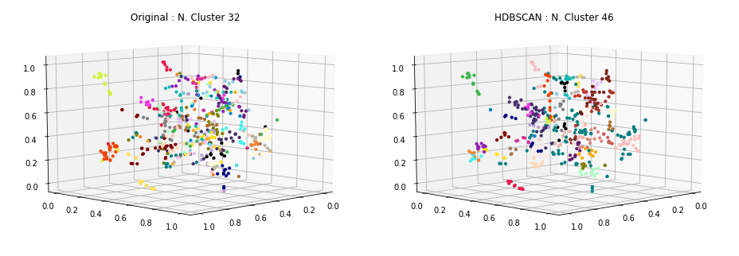
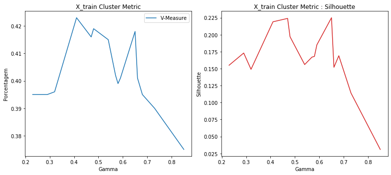

### Carregamento dos datasets

Os datasets de exemplos são frases já pré-categorizadas usadas em chatbots.

Contém 33 categorias e ao todo 696 documentos ou frases.

<table border="1" class="dataframe">
  <thead>
    <tr style="text-align: right;">
      <th></th>
      <th>perguntas</th>
      <th>cluster</th>
    </tr>
  </thead>
  <tbody>
    <tr>
      <th>13</th>
      <td>Como posso registrar um cartão SIM?</td>
      <td>ACTIVATE_DEVICE</td>
    </tr>
    <tr>
      <th>44</th>
      <td>Por favor adicione o roaming internacional na minha conta.</td>
      <td>ACTIVATE_ROAMING</td>
    </tr>
    <tr>
      <th>70</th>
      <td>Fui assaltado, preciso acionar seguro.</td>
      <td>ADD_INSURANCE</td>
    </tr>
    <tr>
      <th>97</th>
      <td>Oi, eu estava esperando que você pudesse me dizer como adicionar o recurso de mensagens de texto ao meu plano?</td>
      <td>ADD_SERVICE_FEATURES</td>
    </tr>
    <tr>
      <th>152</th>
      <td>Como cancelo meu serviço de telefone pré-pago?</td>
      <td>DEACTIVATE_PREPAID_PLAN</td>
    </tr>
    <tr>
      <th>195</th>
      <td>Você pode verificar se posso fazer um upgrade?</td>
      <td>DEVICE_UPGRADE_ELIGIBILITY</td>
    </tr>
    <tr>
      <th>34</th>
      <td>quero mudar minha password como devo proceder?</td>
      <td>PASSWORD</td>
    </tr>
    <tr>
      <th>24</th>
      <td>Minha Senha está com problema</td>
      <td>PASSWORD</td>
    </tr>
    <tr>
      <th>45</th>
      <td>Minha senha não funciona</td>
      <td>PASSWORD</td>
    </tr>
    <tr>
      <th>393</th>
      <td>Como faço para transferir o serviço de um dispositivo antigo para um novo?</td>
      <td>SWAP_DEVICE</td>
    </tr>
  </tbody>
</table>

    Qtde. de documentos por categoria:

<table border="1" class="dataframe">
  <thead>
    <tr style="text-align: right;">
      <th></th>
      <th>Categoria</th>
      <th>Qtde</th>
    </tr>
  </thead>
  <tbody>
    <tr>
      <th>0</th>
      <td>ACCOUNT</td>
      <td>29</td>
    </tr>
    <tr>
      <th>1</th>
      <td>ACTIVATE_DEVICE</td>
      <td>19</td>
    </tr>
    <tr>
      <th>2</th>
      <td>ACTIVATE_PREPAID_PLAN</td>
      <td>21</td>
    </tr>
    <tr>
      <th>3</th>
      <td>ACTIVATE_ROAMING</td>
      <td>20</td>
    </tr>
    <tr>
      <th>4</th>
      <td>ADD_INSURANCE</td>
      <td>18</td>
    </tr>
    <tr>
      <th>5</th>
      <td>ADD_SERVICE_FEATURES</td>
      <td>20</td>
    </tr>
    <tr>
      <th>6</th>
      <td>BOT_FOUND</td>
      <td>20</td>
    </tr>
    <tr>
      <th>7</th>
      <td>BOT_NAME</td>
      <td>16</td>
    </tr>
    <tr>
      <th>8</th>
      <td>CERTIFICATE</td>
      <td>18</td>
    </tr>
    <tr>
      <th>9</th>
      <td>CHANGE_PRICE_PLAN</td>
      <td>19</td>
    </tr>
    <tr>
      <th>10</th>
      <td>COVERAGE_AREA_INQUIRY</td>
      <td>19</td>
    </tr>
    <tr>
      <th>11</th>
      <td>DEACTIVATE_PREPAID_PLAN</td>
      <td>18</td>
    </tr>
    <tr>
      <th>12</th>
      <td>DEACTIVATE_ROAMING</td>
      <td>18</td>
    </tr>
    <tr>
      <th>13</th>
      <td>DEVICE_UPGRADE_ELIGIBILITY</td>
      <td>24</td>
    </tr>
    <tr>
      <th>14</th>
      <td>EMAIL</td>
      <td>40</td>
    </tr>
    <tr>
      <th>15</th>
      <td>INTERNATIONAL_RATE_PLAN_INQUIRY</td>
      <td>21</td>
    </tr>
    <tr>
      <th>16</th>
      <td>NETWORK_COMPLAINTS</td>
      <td>23</td>
    </tr>
    <tr>
      <th>17</th>
      <td>NETWORK_UNLOCK</td>
      <td>21</td>
    </tr>
    <tr>
      <th>18</th>
      <td>NO_OPTION</td>
      <td>18</td>
    </tr>
    <tr>
      <th>19</th>
      <td>PASSWORD</td>
      <td>27</td>
    </tr>
    <tr>
      <th>20</th>
      <td>PORT_IN</td>
      <td>21</td>
    </tr>
    <tr>
      <th>21</th>
      <td>PRICE_PLAN_INQUIRY</td>
      <td>23</td>
    </tr>
    <tr>
      <th>22</th>
      <td>RECHARGE_SIM</td>
      <td>18</td>
    </tr>
    <tr>
      <th>23</th>
      <td>REMOTE_ACCESS</td>
      <td>20</td>
    </tr>
    <tr>
      <th>24</th>
      <td>REMOVE_SERVICE_FEATURES</td>
      <td>20</td>
    </tr>
    <tr>
      <th>25</th>
      <td>RETURN_DEVICE</td>
      <td>21</td>
    </tr>
    <tr>
      <th>26</th>
      <td>ROAMING_INQUIRY</td>
      <td>20</td>
    </tr>
    <tr>
      <th>27</th>
      <td>SERVICES</td>
      <td>20</td>
    </tr>
    <tr>
      <th>28</th>
      <td>SWAP_DEVICE</td>
      <td>15</td>
    </tr>
    <tr>
      <th>29</th>
      <td>THANK_YOU</td>
      <td>23</td>
    </tr>
    <tr>
      <th>30</th>
      <td>TROUBLESHOOTING</td>
      <td>36</td>
    </tr>
    <tr>
      <th>31</th>
      <td>WIFI</td>
      <td>24</td>
    </tr>
  </tbody>
</table>

    Total docs     : 690
    Total cluster  : 690
    X_train size   : (552,)
    X_test  size   : (138,)

### Dataset tokenization

    Tokenization...
    Qtd documentos treino:  552
    Qtd Intents treino   :  32
    Finished...

    ['ir viajar certar empresar fornecer cobertura telefonar viagem poder informacaes servico recepcao disponivel',
     'servico bot oferecer',
     'voce um nome',
     'nao recarregar desativar ativar',
     'voce poder ajudar mudar tocar telefonar',
     'configurar email thunderbird',
     'nao precisar mais',
     'nao conseguir acessar web telefonar nao precisar configuracao',
     'poder correar voz permanentemente remover planar',
     'tutorial configuracao redar fiar android']

### **TF-IDF**

Validação do modelo gerado pelo TF-IDF... teste tanto nos dados apresentados para treinamento quanto nos dados de testes e as acurácias alcançadas.

    - Acurácia treino: 96.0
    --------------------
     - Acurácia teste 1  : 61.0
     - Acurácia teste 2  : 62.0
     - Acurácia teste 3  : 59.0
     - Acurácia teste 4  : 63.0
     - Acurácia teste 5  : 66.0
    - Acurácia média teste: 62.2

### Clusterização

Utilizou-se o KMeans definindo a quantidade de clusters para o número ideal de categorias existentes no caso 33. A métrica de distância utilizada, não foi a euclidiana, mas sim a de cosseno (métrica comumente usada na classificação de texto em seu espaço vetorial).

    Frases por cluster:

<table border="1" class="dataframe">
  <thead>
    <tr style="text-align: right;">
      <th>title</th>
      <th>cluster</th>
    </tr>
  </thead>
  <tbody>
    <tr>
      <td>isso e tudo, obrigado</td>
      <td>0</td>
    </tr>
    <tr>
      <td>vc tem nome?</td>
      <td>0</td>
    </tr>
    <tr>
      <td>Preciso remover o MMS no meu telefone.</td>
      <td>1</td>
    </tr>
    <tr>
      <td>Qual é o mais recente plano 4G adequado para mim como um pacote família?</td>
      <td>1</td>
    </tr>
    <tr>
      <td>Gostaria que meu celular seja ativado hoje</td>
      <td>2</td>
    </tr>
    <tr>
      <td>Se eu atualizar o meu plano/dispositivo e decidir que não gosto do telefone, posso devolver o telefone?</td>
      <td>2</td>
    </tr>
    <tr>
      <td>Como faço para ativar o novo dispositivo pré-pago que acabei de receber?</td>
      <td>3</td>
    </tr>
    <tr>
      <td>Eu gostaria de saber se seria possível para mim usar meu novo dispositivo pré-pago, enquanto na França ou não.</td>
      <td>3</td>
    </tr>
    <tr>
      <td>meu email foi bloqueado</td>
      <td>4</td>
    </tr>
    <tr>
      <td>o acesso ao meu email foi bloqueado</td>
      <td>4</td>
    </tr>
    <tr>
      <td>voce nao sabe nada sobre vpn?</td>
      <td>5</td>
    </tr>
    <tr>
      <td>Você pode me dizer por que nunca tenho sinal no meu telefone quando estou no trabalho, mas não tenho problema em nenhum outro lugar?</td>
      <td>5</td>
    </tr>
    <tr>
      <td>Como atualizo minha conta para incluir chamadas internacionais?</td>
      <td>6</td>
    </tr>
    <tr>
      <td>Quais são os preços para os planos de dados e chamadas diferentes que você oferece?</td>
      <td>6</td>
    </tr>
    <tr>
      <td>Qual é o procedimento para incluir um seguro para o meu telefone?</td>
      <td>7</td>
    </tr>
    <tr>
      <td>Qual é o procedimento para incluir minutos no meu pré-pago?</td>
      <td>7</td>
    </tr>
    <tr>
      <td>um chatbot nao conseguirá resolver meu problema</td>
      <td>8</td>
    </tr>
    <tr>
      <td>não quero falar com um bot, quero falar com um humano</td>
      <td>8</td>
    </tr>
    <tr>
      <td>estou com problemas de autenticacao</td>
      <td>9</td>
    </tr>
    <tr>
      <td>O serviço ainda está indisponível na zona de ramblas, estou tendo problemas com o meu streaming de vídeo, a qualidade está extremamente ruim.</td>
      <td>9</td>
    </tr>
    <tr>
      <td>meu novo username não esta sendo criado</td>
      <td>10</td>
    </tr>
    <tr>
      <td>esta dando erro ao tentar criar meu novo username</td>
      <td>10</td>
    </tr>
    <tr>
      <td>Quero perguntar sobre o cancelamento do pedido de um dispositivo móvel</td>
      <td>11</td>
    </tr>
    <tr>
      <td>Eu disse que recebi um novo sim e gostaria de compartilhar o código de pac do meu número atual com você.</td>
      <td>11</td>
    </tr>
    <tr>
      <td>Revogação de certificado digital</td>
      <td>12</td>
    </tr>
    <tr>
      <td>certificado digital das ACs onde encontrar?</td>
      <td>12</td>
    </tr>
    <tr>
      <td>Quanto da área total no meu país é coberta pela recepção?</td>
      <td>13</td>
    </tr>
    <tr>
      <td>Eu pedi o plano errado. Você poderia mudar isso para o plano de R$ 50?</td>
      <td>13</td>
    </tr>
    <tr>
      <td>Meu telefone novo não pode receber nenhuma mensagem de texto ou e-mail enquanto eu estou em uma chamada? Eu costumava ser capaz de fazer isso com meu telefone antigo</td>
      <td>14</td>
    </tr>
    <tr>
      <td>Oi, eu estava esperando que você pudesse me dizer como adicionar o recurso de mensagens de texto ao meu plano?</td>
      <td>14</td>
    </tr>
    <tr>
      <td>O servico de roaming é cobrado na fatura, em real?</td>
      <td>15</td>
    </tr>
    <tr>
      <td>Ligue a função de roaming internacional.</td>
      <td>15</td>
    </tr>
    <tr>
      <td>você tem outras opções para ajudar?</td>
      <td>16</td>
    </tr>
    <tr>
      <td>A portabilidade possui alguma cobranca?</td>
      <td>16</td>
    </tr>
    <tr>
      <td>Eu tenho uma melodia de chamadas no meu número e quero desativá-la</td>
      <td>17</td>
    </tr>
    <tr>
      <td>as pessoas te chamam como?</td>
      <td>17</td>
    </tr>
    <tr>
      <td>será que posso ser atendido por um humano</td>
      <td>18</td>
    </tr>
    <tr>
      <td>Tenho usado o meu celular menos desde o ano passado, então eu gostaria de ter melhores planos de preços que atendam às minhas necessidades.</td>
      <td>18</td>
    </tr>
    <tr>
      <td>Eu gostaria de segurar meu telefone. Pode me ajudar com isso?</td>
      <td>19</td>
    </tr>
    <tr>
      <td>Tenho um novo telefone, mas estou sem serviço. Removi o cartão SIM e coloquei-o de volta. Carreguei o telefone e não o usei durante a noite.</td>
      <td>19</td>
    </tr>
    <tr>
      <td>Você pode por favor fornecer-me com informações sobre os diferentes planos que estão disponíveis?</td>
      <td>20</td>
    </tr>
    <tr>
      <td>Você pode me ajudar com problemas técnicos no meu telefone, ou você apenas fornece informações sobre planos de preços, etc.?</td>
      <td>20</td>
    </tr>
    <tr>
      <td>Como posso começar a usar o meu telefone no exterior?</td>
      <td>21</td>
    </tr>
    <tr>
      <td>Quando dentro do contrato sou elegivel para atualizar meu atual aparelho?</td>
      <td>21</td>
    </tr>
    <tr>
      <td>Você pode me dizer como posso adicionar minutos ao meu telefone pré-pago?</td>
      <td>22</td>
    </tr>
    <tr>
      <td>E se eu diminuir meu plano de dados para 5Gb e desejar alterá-lo de volta para 15GB minutos depois. Posso pegar meu plano atual de volta?</td>
      <td>22</td>
    </tr>
    <tr>
      <td>Posso por favor ter as instruções para desbloquear meu dispositivo?</td>
      <td>23</td>
    </tr>
    <tr>
      <td>Após quanto tempo do pagamento da fatura atrasada, meu chip é desbloqueado?</td>
      <td>23</td>
    </tr>
    <tr>
      <td>não estou tendo sucesso ao tentar acessar meu email</td>
      <td>24</td>
    </tr>
    <tr>
      <td>como eu faço para encaminhar meus emails para outro conta?</td>
      <td>24</td>
    </tr>
    <tr>
      <td>você ajudou muito</td>
      <td>25</td>
    </tr>
    <tr>
      <td>Sim, minha conexão está muito lenta, e as minhas mensagens estão levando muito tempo para serem enviadas. Onde fica a melhor cobertura?</td>
      <td>25</td>
    </tr>
    <tr>
      <td>como alterar minha senha do usuário?</td>
      <td>26</td>
    </tr>
    <tr>
      <td>configurar o vpn (acesso remoto) no macOSX</td>
      <td>26</td>
    </tr>
    <tr>
      <td>Qual é a razão do meu celular sempre ter uma taxa de acesso à Internet lenta?</td>
      <td>27</td>
    </tr>
    <tr>
      <td>colaboradores externos conseguem ter uma conta de usuário?</td>
      <td>27</td>
    </tr>
    <tr>
      <td>Estou recebendo chamadas indesejadas de números desconhecidos, como posso ativar Não perturbe?</td>
      <td>28</td>
    </tr>
    <tr>
      <td>Eu solicitei uma troca de SIM, mas ainda não está completo, então não consigo fazer ou receber chamadas</td>
      <td>28</td>
    </tr>
    <tr>
      <td>Quero sua ajuda para colocar o dinheiro no meu cartão SIM.</td>
      <td>29</td>
    </tr>
    <tr>
      <td>Preciso de outro tipo de ajuda</td>
      <td>29</td>
    </tr>
    <tr>
      <td>Há certas partes na minha cidade onde eu não tenho sinal. Pode me dizer qual poderia ser o motivo?</td>
      <td>30</td>
    </tr>
    <tr>
      <td>Estou planejando uma viagem ao Havaí e estava pensando se eu vou ter sinal lá.</td>
      <td>30</td>
    </tr>
    <tr>
      <td>como utilizar a rede sem fio (wifi)</td>
      <td>31</td>
    </tr>
    <tr>
      <td>Eu tenho um plano com outra empresa. Posso manter meu número?</td>
      <td>31</td>
    </tr>
  </tbody>
</table>

    --------------------
    Documentos por cluster:

<table border="1" class="dataframe">
  <tbody>
    <tr>
      <td>C0</td>
      <td>25</td>
    </tr>
    <tr>
      <td>C1</td>
      <td>3</td>
    </tr>
    <tr>
      <td>C2</td>
      <td>13</td>
    </tr>
    <tr>
      <td>C3</td>
      <td>41</td>
    </tr>
    <tr>
      <td>C4</td>
      <td>2</td>
    </tr>
    <tr>
      <td>C5</td>
      <td>19</td>
    </tr>
    <tr>
      <td>C6</td>
      <td>22</td>
    </tr>
    <tr>
      <td>C7</td>
      <td>2</td>
    </tr>
    <tr>
      <td>C8</td>
      <td>32</td>
    </tr>
    <tr>
      <td>C9</td>
      <td>6</td>
    </tr>
    <tr>
      <td>C10</td>
      <td>14</td>
    </tr>
    <tr>
      <td>C11</td>
      <td>6</td>
    </tr>
    <tr>
      <td>C12</td>
      <td>13</td>
    </tr>
    <tr>
      <td>C13</td>
      <td>15</td>
    </tr>
    <tr>
      <td>C14</td>
      <td>12</td>
    </tr>
    <tr>
      <td>C15</td>
      <td>31</td>
    </tr>
    <tr>
      <td>C16</td>
      <td>13</td>
    </tr>
    <tr>
      <td>C17</td>
      <td>17</td>
    </tr>
    <tr>
      <td>C18</td>
      <td>5</td>
    </tr>
    <tr>
      <td>C19</td>
      <td>20</td>
    </tr>
    <tr>
      <td>C20</td>
      <td>14</td>
    </tr>
    <tr>
      <td>C21</td>
      <td>26</td>
    </tr>
    <tr>
      <td>C22</td>
      <td>17</td>
    </tr>
    <tr>
      <td>C23</td>
      <td>22</td>
    </tr>
    <tr>
      <td>C24</td>
      <td>30</td>
    </tr>
    <tr>
      <td>C25</td>
      <td>13</td>
    </tr>
    <tr>
      <td>C26</td>
      <td>21</td>
    </tr>
    <tr>
      <td>C27</td>
      <td>18</td>
    </tr>
    <tr>
      <td>C28</td>
      <td>11</td>
    </tr>
    <tr>
      <td>C29</td>
      <td>28</td>
    </tr>
    <tr>
      <td>C30</td>
      <td>16</td>
    </tr>
    <tr>
      <td>C31</td>
      <td>25</td>
    </tr>
  </tbody>
</table>

### Visualização

Apresentação dos protótipos gerados pelo KMeans, reduzindo a dimensão usando o algoritmo MDS (Multidimensional Scaling).

### Clusterização dos dados de Teste

Por fim, realizada a clusterização dos dados de teste e a apresentação das 8 primeiras frases do conjunto de teste juntamente com outras duas frases do cluster ao qual foi identificado como o melhor.

    * Se eu ativar roaming agora, já posso utilizar?
      -  Ligue a função de roaming internacional.
      -  O servico de roaming é cobrado na fatura, em real?
    --------------------
    * Fui assaltado, preciso acionar seguro.
      -  Eu gostaria de segurar meu telefone. Pode me ajudar com isso?
      -  Tenho um novo telefone, mas estou sem serviço. Removi o cartão SIM e coloquei-o de volta. Carreguei o telefone e não o usei durante a noite.
    --------------------
    * Estou bastante cansado do meu telefone existente e gostaria de saber quando eu vou ser elegível para sua atualização?
      -  Gostaria que meu celular seja ativado hoje
      -  Se eu atualizar o meu plano/dispositivo e decidir que não gosto do telefone, posso devolver o telefone?
    --------------------
    * Oi, como posso ativar o encaminhamento de chamada no meu plano?
      -  Eu tenho uma melodia de chamadas no meu número e quero desativá-la
      -  as pessoas te chamam como?
    --------------------
    * Eu não consigo acessar meu email
      -  como eu faço para encaminhar meus emails para outro conta?
      -  não estou tendo sucesso ao tentar acessar meu email
    --------------------
    * Estou indo para uma viagem ao extremo norte da Ilha de Vancouver e gostaria de verificar se há serviço de celular nessa área. Você pode verificar o quanto longe do norte eu posso esperar para receber a recepção.
      -  Gostaria que meu celular seja ativado hoje
      -  Se eu atualizar o meu plano/dispositivo e decidir que não gosto do telefone, posso devolver o telefone?
    --------------------
    * Gostaria de verificar todas as taxas para cobertura internacional
      -  Gostaria que meu celular seja ativado hoje
      -  Se eu atualizar o meu plano/dispositivo e decidir que não gosto do telefone, posso devolver o telefone?
    --------------------
    * Além do fornecimento de água vocês oferecem algum outro serviço?
      -  Você pode me ajudar com problemas técnicos no meu telefone, ou você apenas fornece informações sobre planos de preços, etc.?
      -  Você pode por favor fornecer-me com informações sobre os diferentes planos que estão disponíveis?
    --------------------

### Métricas

Abaixo são apresentadas métricas para demonstrar o quanto a clusterização parece funcionar.

    Homogeneidade    :  0.68
    Completude       :  0.709
    V-Measure        :  0.694
    Silhouette       :  0.054

### HDBSCAN no espaço dos dados

    Frases por cluster:

<table border="1" class="dataframe">
  <thead>
    <tr style="text-align: right;">
      <th>title</th>
      <th>cluster</th>
    </tr>
  </thead>
  <tbody>
    <tr>
      <td>Preciso desconectar uma das minhas linhas telefônicas. Posso fazer isso por telefone?</td>
      <td>0</td>
    </tr>
    <tr>
      <td>Há alguma limitação quanto aos países no exterior que eu posso chamar e acessar do meu país de origem?</td>
      <td>0</td>
    </tr>
    <tr>
      <td>Quais são os custos de fazer ligações internacionais do meu país?</td>
      <td>0</td>
    </tr>
    <tr>
      <td>onde consigo mais informações sobre a emição / manutenção de certificados digitais emitidos pela empresa?</td>
      <td>1</td>
    </tr>
    <tr>
      <td>tem como renovar um certificado digital emitido?</td>
      <td>1</td>
    </tr>
    <tr>
      <td>Alteração de certificado digital</td>
      <td>1</td>
    </tr>
    <tr>
      <td>Qual é o custo por ativação de um dispositivo?</td>
      <td>2</td>
    </tr>
    <tr>
      <td>Posso ter ajuda na ativação de meu novo telefone pré-pago por favor?</td>
      <td>2</td>
    </tr>
    <tr>
      <td>Quanto é o custo de um plano familiar de 3 linhas?</td>
      <td>2</td>
    </tr>
    <tr>
      <td>É possível criar um conta para colaborador externo?</td>
      <td>3</td>
    </tr>
    <tr>
      <td>um patrulheiro pode ter uma conta de usuário?</td>
      <td>3</td>
    </tr>
    <tr>
      <td>Como posso criar uma conta para Colaborador Externo?</td>
      <td>3</td>
    </tr>
    <tr>
      <td>Eu quero aumentar o número de mensagens no meu plano de serviço</td>
      <td>4</td>
    </tr>
    <tr>
      <td>Quanto custa enviar uma mensagem de texto internacionalmente?</td>
      <td>4</td>
    </tr>
    <tr>
      <td>Meu telefone novo não pode receber nenhuma mensagem de texto ou e-mail enquanto eu estou em uma chamada? Eu costumava ser capaz de fazer isso com meu telefone antigo</td>
      <td>4</td>
    </tr>
    <tr>
      <td>Você pode por favor fornecer-me com informações sobre os diferentes planos que estão disponíveis?</td>
      <td>5</td>
    </tr>
    <tr>
      <td>Que planos estão disponíveis para chamada e dados Internacional?</td>
      <td>5</td>
    </tr>
    <tr>
      <td>Que planos de dados posso escolher?</td>
      <td>5</td>
    </tr>
    <tr>
      <td>Quanto tempo eu tenho para devolver o telefone, se eu mudar de ideia?</td>
      <td>6</td>
    </tr>
    <tr>
      <td>Quero mudar os provedores de serviço, ainda posso manter meu mesmo número de telefone?</td>
      <td>6</td>
    </tr>
    <tr>
      <td>Como mudar de telefone?</td>
      <td>6</td>
    </tr>
    <tr>
      <td>Foi-me prometido uma cobertura total na minha cidade quando me inscrevi no ano passado. 12 meses depois, metade da minha cidade não tem conexão. Quando isso será consertado?</td>
      <td>7</td>
    </tr>
    <tr>
      <td>Olá, estava imaginando se essa queda de rede já foi consertada? Já existe uma cobertura LTE nesta área?</td>
      <td>7</td>
    </tr>
    <tr>
      <td>Eu disse que recebi um novo sim e gostaria de compartilhar o código de pac do meu número atual com você.</td>
      <td>7</td>
    </tr>
    <tr>
      <td>tenho duvidas sobre vpn</td>
      <td>8</td>
    </tr>
    <tr>
      <td>gostaria de utilizar a vpn da empresa</td>
      <td>8</td>
    </tr>
    <tr>
      <td>voce nao sabe nada sobre vpn?</td>
      <td>8</td>
    </tr>
    <tr>
      <td>Posso cancelar meu roaming em qualquer momento?</td>
      <td>9</td>
    </tr>
    <tr>
      <td>Preciso de informações em como cancelar o roaming</td>
      <td>9</td>
    </tr>
    <tr>
      <td>Quero cancelar o pagamento do meu telefone pré-pago.</td>
      <td>9</td>
    </tr>
    <tr>
      <td>Como posso desbloquear meu novo telefone pré-pago para que meu plano de serviço funcione?</td>
      <td>10</td>
    </tr>
    <tr>
      <td>Por favor me ajude desbloquear meu novo telefone no meu plano de serviço.</td>
      <td>10</td>
    </tr>
    <tr>
      <td>Eu não sei como desbloquear o meu novo dispositivo. Pode me dizer como?</td>
      <td>10</td>
    </tr>
    <tr>
      <td>Eu gostaria de saber sobre os encargos de roaming internacional e como ativar isto.</td>
      <td>11</td>
    </tr>
    <tr>
      <td>Como posso ativar o uso internacional na minha linha?</td>
      <td>11</td>
    </tr>
    <tr>
      <td>Você pode me dizer se o roaming internacional está configurado no meu telefone?</td>
      <td>11</td>
    </tr>
    <tr>
      <td>estou tentando acessar meu email mas sem sucesso</td>
      <td>12</td>
    </tr>
    <tr>
      <td>o acesso ao meu email foi bloqueado</td>
      <td>12</td>
    </tr>
    <tr>
      <td>acesso ao meu email foi negado</td>
      <td>12</td>
    </tr>
    <tr>
      <td>Você pode me dizer como posso adicionar minutos ao meu telefone pré-pago?</td>
      <td>13</td>
    </tr>
    <tr>
      <td>Adicionar uma quantidade de minutos ao meu pré-pago.</td>
      <td>13</td>
    </tr>
    <tr>
      <td>Como adiciono minutos?</td>
      <td>13</td>
    </tr>
    <tr>
      <td>qual é seu nome?</td>
      <td>14</td>
    </tr>
    <tr>
      <td>qual o nome que atribuiram a você?</td>
      <td>14</td>
    </tr>
    <tr>
      <td>qual o nome que lhe foi dado?</td>
      <td>14</td>
    </tr>
    <tr>
      <td>Usuário / Matrícula já cadastrado com o username</td>
      <td>15</td>
    </tr>
    <tr>
      <td>não consigo criar meu username, da mensagem de username já cadastrado</td>
      <td>15</td>
    </tr>
    <tr>
      <td>estou tentanto criar meu username, mas não estou conseguindo</td>
      <td>15</td>
    </tr>
    <tr>
      <td>Como faço para recuperar meus emails?</td>
      <td>16</td>
    </tr>
    <tr>
      <td>como recuperar meus emails?</td>
      <td>16</td>
    </tr>
    <tr>
      <td>Não consigo recuperar a minha senha</td>
      <td>16</td>
    </tr>
    <tr>
      <td>Eu não sei porque, mas o meu telefone não funciona em casa.</td>
      <td>17</td>
    </tr>
    <tr>
      <td>inseri o email e senha e não deu certo</td>
      <td>17</td>
    </tr>
    <tr>
      <td>qual senha usar para acessar o sistema</td>
      <td>17</td>
    </tr>
    <tr>
      <td>como utilizar a rede sem fio (wifi)</td>
      <td>18</td>
    </tr>
    <tr>
      <td>como me conectar a internet wireless da empresa ou do meu departamento?</td>
      <td>18</td>
    </tr>
    <tr>
      <td>como eu configuro a rede sem fio no meu computador?</td>
      <td>18</td>
    </tr>
    <tr>
      <td>É possível desativar o meu dispositivo de telefone pré-pago?</td>
      <td>19</td>
    </tr>
    <tr>
      <td>Eu não sei como desativar meu telefone pré-pago, você pode me dizer?</td>
      <td>19</td>
    </tr>
    <tr>
      <td>Como posso desativar o serviço no meu dispositivo pré-pago que é novo?</td>
      <td>19</td>
    </tr>
    <tr>
      <td>Como desativar a função roaming?</td>
      <td>20</td>
    </tr>
    <tr>
      <td>Qual a carência para desativar o roaming?</td>
      <td>20</td>
    </tr>
    <tr>
      <td>Eu quero desligar a função de roaming.</td>
      <td>20</td>
    </tr>
    <tr>
      <td>quais outros serviços eu posso consultar por você?</td>
      <td>21</td>
    </tr>
    <tr>
      <td>quem e voce?</td>
      <td>21</td>
    </tr>
    <tr>
      <td>existem outros serviços que posso consultar com você?</td>
      <td>21</td>
    </tr>
    <tr>
      <td>nao preciso mais de ajuda</td>
      <td>22</td>
    </tr>
    <tr>
      <td>preciso de ajudar</td>
      <td>22</td>
    </tr>
    <tr>
      <td>nao preciso de mais nada, obrigado</td>
      <td>22</td>
    </tr>
    <tr>
      <td>você ajudou muito, obrigadão</td>
      <td>23</td>
    </tr>
    <tr>
      <td>muitíssimo obrigado</td>
      <td>23</td>
    </tr>
    <tr>
      <td>você tem outras opções para ajudar?</td>
      <td>23</td>
    </tr>
    <tr>
      <td>voce nao conseguiu me ajudar, quero falar com um humano</td>
      <td>24</td>
    </tr>
    <tr>
      <td>estou falando com um bot não?</td>
      <td>24</td>
    </tr>
    <tr>
      <td>quero falar com um atendente de verdade</td>
      <td>24</td>
    </tr>
  </tbody>
</table>

    --------------------
    Documentos por cluster:

<table border="1" class="dataframe">
  <tbody>
    <tr>
      <td>C0</td>
      <td>7</td>
    </tr>
    <tr>
      <td>C1</td>
      <td>12</td>
    </tr>
    <tr>
      <td>C2</td>
      <td>6</td>
    </tr>
    <tr>
      <td>C3</td>
      <td>5</td>
    </tr>
    <tr>
      <td>C4</td>
      <td>8</td>
    </tr>
    <tr>
      <td>C5</td>
      <td>5</td>
    </tr>
    <tr>
      <td>C6</td>
      <td>12</td>
    </tr>
    <tr>
      <td>C7</td>
      <td>326</td>
    </tr>
    <tr>
      <td>C8</td>
      <td>9</td>
    </tr>
    <tr>
      <td>C9</td>
      <td>10</td>
    </tr>
    <tr>
      <td>C10</td>
      <td>5</td>
    </tr>
    <tr>
      <td>C11</td>
      <td>8</td>
    </tr>
    <tr>
      <td>C12</td>
      <td>15</td>
    </tr>
    <tr>
      <td>C13</td>
      <td>5</td>
    </tr>
    <tr>
      <td>C14</td>
      <td>12</td>
    </tr>
    <tr>
      <td>C15</td>
      <td>7</td>
    </tr>
    <tr>
      <td>C16</td>
      <td>5</td>
    </tr>
    <tr>
      <td>C17</td>
      <td>15</td>
    </tr>
    <tr>
      <td>C18</td>
      <td>30</td>
    </tr>
    <tr>
      <td>C19</td>
      <td>8</td>
    </tr>
    <tr>
      <td>C20</td>
      <td>6</td>
    </tr>
    <tr>
      <td>C21</td>
      <td>5</td>
    </tr>
    <tr>
      <td>C22</td>
      <td>9</td>
    </tr>
    <tr>
      <td>C23</td>
      <td>12</td>
    </tr>
    <tr>
      <td>C24</td>
      <td>10</td>
    </tr>
  </tbody>
</table>

### Topologia dos dados de treinamento usando MDS

## **HDBSCAN**

 - [How HDBSCAN Works](https://nbviewer.jupyter.org/github/scikit-learn-contrib/hdbscan/blob/master/notebooks/How%20HDBSCAN%20Works.ipynb)
 - [hdbscan github implementation](https://github.com/scikit-learn-contrib/hdbscan)
 - [Density-Based Clustering Based on Hierarchical Density Estimates](https://link.springer.com/chapter/10.1007/978-3-642-37456-2_14)

---

## **t-SNE + HDBSCAN**

<table border="1" class="dataframe">
  <thead>
    <tr style="text-align: right;">
      <th></th>
      <th>Perplexity</th>
      <th>Learning Rate</th>
      <th>Angle</th>
      <th>V-Measure</th>
      <th>Silhouette</th>
    </tr>
  </thead>
  <tbody>
    <tr>
      <th>0</th>
      <td>5</td>
      <td>71</td>
      <td>0.80</td>
      <td>0.534</td>
      <td>0.360</td>
    </tr>
    <tr>
      <th>20</th>
      <td>25</td>
      <td>71</td>
      <td>0.80</td>
      <td>0.499</td>
      <td>0.333</td>
    </tr>
    <tr>
      <th>1</th>
      <td>6</td>
      <td>112</td>
      <td>0.83</td>
      <td>0.517</td>
      <td>0.327</td>
    </tr>
    <tr>
      <th>27</th>
      <td>32</td>
      <td>140</td>
      <td>0.83</td>
      <td>0.503</td>
      <td>0.268</td>
    </tr>
    <tr>
      <th>29</th>
      <td>34</td>
      <td>121</td>
      <td>0.87</td>
      <td>0.495</td>
      <td>0.261</td>
    </tr>
    <tr>
      <th>10</th>
      <td>15</td>
      <td>71</td>
      <td>0.80</td>
      <td>0.522</td>
      <td>0.259</td>
    </tr>
    <tr>
      <th>39</th>
      <td>44</td>
      <td>121</td>
      <td>0.87</td>
      <td>0.491</td>
      <td>0.259</td>
    </tr>
    <tr>
      <th>45</th>
      <td>50</td>
      <td>215</td>
      <td>0.85</td>
      <td>0.452</td>
      <td>0.257</td>
    </tr>
    <tr>
      <th>21</th>
      <td>26</td>
      <td>112</td>
      <td>0.83</td>
      <td>0.481</td>
      <td>0.254</td>
    </tr>
    <tr>
      <th>17</th>
      <td>22</td>
      <td>140</td>
      <td>0.83</td>
      <td>0.485</td>
      <td>0.254</td>
    </tr>
    <tr>
      <th>16</th>
      <td>21</td>
      <td>127</td>
      <td>0.67</td>
      <td>0.502</td>
      <td>0.254</td>
    </tr>
    <tr>
      <th>3</th>
      <td>8</td>
      <td>151</td>
      <td>0.87</td>
      <td>0.473</td>
      <td>0.248</td>
    </tr>
    <tr>
      <th>13</th>
      <td>18</td>
      <td>151</td>
      <td>0.87</td>
      <td>0.471</td>
      <td>0.245</td>
    </tr>
    <tr>
      <th>53</th>
      <td>58</td>
      <td>159</td>
      <td>0.81</td>
      <td>0.452</td>
      <td>0.243</td>
    </tr>
    <tr>
      <th>9</th>
      <td>14</td>
      <td>121</td>
      <td>0.87</td>
      <td>0.500</td>
      <td>0.242</td>
    </tr>
    <tr>
      <th>14</th>
      <td>19</td>
      <td>162</td>
      <td>0.83</td>
      <td>0.460</td>
      <td>0.240</td>
    </tr>
    <tr>
      <th>4</th>
      <td>9</td>
      <td>162</td>
      <td>0.83</td>
      <td>0.467</td>
      <td>0.235</td>
    </tr>
    <tr>
      <th>31</th>
      <td>36</td>
      <td>112</td>
      <td>0.83</td>
      <td>0.494</td>
      <td>0.232</td>
    </tr>
    <tr>
      <th>37</th>
      <td>42</td>
      <td>140</td>
      <td>0.83</td>
      <td>0.469</td>
      <td>0.229</td>
    </tr>
    <tr>
      <th>51</th>
      <td>56</td>
      <td>161</td>
      <td>0.89</td>
      <td>0.464</td>
      <td>0.221</td>
    </tr>
    <tr>
      <th>23</th>
      <td>28</td>
      <td>151</td>
      <td>0.87</td>
      <td>0.471</td>
      <td>0.221</td>
    </tr>
    <tr>
      <th>5</th>
      <td>10</td>
      <td>177</td>
      <td>0.76</td>
      <td>0.479</td>
      <td>0.220</td>
    </tr>
    <tr>
      <th>25</th>
      <td>30</td>
      <td>177</td>
      <td>0.76</td>
      <td>0.461</td>
      <td>0.218</td>
    </tr>
    <tr>
      <th>19</th>
      <td>24</td>
      <td>121</td>
      <td>0.87</td>
      <td>0.488</td>
      <td>0.214</td>
    </tr>
    <tr>
      <th>30</th>
      <td>35</td>
      <td>71</td>
      <td>0.80</td>
      <td>0.503</td>
      <td>0.213</td>
    </tr>
  </tbody>
</table>

    Homogeneidade    :  0.536
    Completude       :  0.533
    V-Measure        :  0.534
    Silhouette       :  0.36

    Frases por cluster:

<table border="1" class="dataframe">
  <thead>
    <tr style="text-align: right;">
      <th>title</th>
      <th>cluster</th>
    </tr>
  </thead>
  <tbody>
    <tr>
      <td>utilizar o acesso remoto via vpn</td>
      <td>0</td>
    </tr>
    <tr>
      <td>how to configure vpn?</td>
      <td>0</td>
    </tr>
    <tr>
      <td>voce nao sabe nada sobre vpn?</td>
      <td>0</td>
    </tr>
    <tr>
      <td>Alteração de certificado digital</td>
      <td>1</td>
    </tr>
    <tr>
      <td>Revogação de certificado digital</td>
      <td>1</td>
    </tr>
    <tr>
      <td>quero revogar meu certificado digital emitido para meu sistema</td>
      <td>1</td>
    </tr>
    <tr>
      <td>acessar remotamente os sistemas da empresa da minha casa</td>
      <td>2</td>
    </tr>
    <tr>
      <td>como acessar os sistemas da empresa de casa</td>
      <td>2</td>
    </tr>
    <tr>
      <td>como eu acesso a rede interna da minha empresa estando em outro pais?</td>
      <td>2</td>
    </tr>
    <tr>
      <td>O cliente deseja ter o seu serviço desbloqueado</td>
      <td>3</td>
    </tr>
    <tr>
      <td>quero informações sobre email da minha empresa</td>
      <td>3</td>
    </tr>
    <tr>
      <td>como saber mais sobre o email da empresa</td>
      <td>3</td>
    </tr>
    <tr>
      <td>queria conectar a rede sem fio da empresa, como proceder?</td>
      <td>4</td>
    </tr>
    <tr>
      <td>quero me conectar a rede sem fio</td>
      <td>4</td>
    </tr>
    <tr>
      <td>e necessario instalar algum software adicional para conectar na rede sem fio?</td>
      <td>4</td>
    </tr>
    <tr>
      <td>como me conectar a internet wireless da empresa ou do meu departamento?</td>
      <td>5</td>
    </tr>
    <tr>
      <td>como eu faco para configurar a rede sem fio (wifi)?</td>
      <td>5</td>
    </tr>
    <tr>
      <td>como acessar wifi da empresa?</td>
      <td>5</td>
    </tr>
    <tr>
      <td>como eu configuro a rede sem fio no meu computador?</td>
      <td>6</td>
    </tr>
    <tr>
      <td>quero configurar a rede sem fio no meu celular</td>
      <td>6</td>
    </tr>
    <tr>
      <td>queria saber se consigo configurar o wifi da empresa</td>
      <td>6</td>
    </tr>
    <tr>
      <td>Quais são os custos de fazer ligações internacionais do meu país?</td>
      <td>7</td>
    </tr>
    <tr>
      <td>Há alguma limitação quanto aos países no exterior que eu posso chamar e acessar do meu país de origem?</td>
      <td>7</td>
    </tr>
    <tr>
      <td>Preciso desconectar uma das minhas linhas telefônicas. Posso fazer isso por telefone?</td>
      <td>7</td>
    </tr>
    <tr>
      <td>Como posso cancelar minha linha de telefone pré-pago?</td>
      <td>8</td>
    </tr>
    <tr>
      <td>Posso cancelar meu plano pré-pago a qualquer momento?</td>
      <td>8</td>
    </tr>
    <tr>
      <td>Quero cancelar o pagamento do meu telefone pré-pago.</td>
      <td>8</td>
    </tr>
    <tr>
      <td>Se eu atualizar o meu plano/dispositivo e decidir que não gosto do telefone, posso devolver o telefone?</td>
      <td>9</td>
    </tr>
    <tr>
      <td>Quero atualizar o meu plano com o seguro de telefone.</td>
      <td>9</td>
    </tr>
    <tr>
      <td>Será que meu telefone seja elegível para atualizar este ano em um preço com desconto?</td>
      <td>9</td>
    </tr>
    <tr>
      <td>Como desativar a função roaming?</td>
      <td>10</td>
    </tr>
    <tr>
      <td>A desativação online está disponível para o meu telefone pré-pago?</td>
      <td>10</td>
    </tr>
    <tr>
      <td>Meu telefone novo não pode receber nenhuma mensagem de texto ou e-mail enquanto eu estou em uma chamada? Eu costumava ser capaz de fazer isso com meu telefone antigo</td>
      <td>10</td>
    </tr>
    <tr>
      <td>pra que voce serve?</td>
      <td>11</td>
    </tr>
    <tr>
      <td>quais serviços estão disponíveis?</td>
      <td>11</td>
    </tr>
    <tr>
      <td>você pode me responder sobre quais serviços disponíveis?</td>
      <td>11</td>
    </tr>
    <tr>
      <td>Você é um bot?</td>
      <td>12</td>
    </tr>
    <tr>
      <td>estou falando com um bot</td>
      <td>12</td>
    </tr>
    <tr>
      <td>eu nao gosto de falar com chatbots</td>
      <td>12</td>
    </tr>
    <tr>
      <td>quais outras informações sobre serviços prestados você oferece?</td>
      <td>13</td>
    </tr>
    <tr>
      <td>quais outros serviços este bot oferece?</td>
      <td>13</td>
    </tr>
    <tr>
      <td>quais os serviços que podem ser resolvidos pelo bot?</td>
      <td>13</td>
    </tr>
    <tr>
      <td>A rede está horrível! Alguma manutenção acontecendo?</td>
      <td>14</td>
    </tr>
    <tr>
      <td>Existe a possibilidade de ter o meu dispositivo de telefone de alguma forma assegurado?</td>
      <td>14</td>
    </tr>
    <tr>
      <td>Existe alguma interrupção no sinal? estou sem cobertura.</td>
      <td>14</td>
    </tr>
    <tr>
      <td>Você poderia me ajudar em como mudar o toque do meu telefone?</td>
      <td>15</td>
    </tr>
    <tr>
      <td>posso ver outras opções de serviços?</td>
      <td>15</td>
    </tr>
    <tr>
      <td>quais outras opções você pode me atender?</td>
      <td>15</td>
    </tr>
    <tr>
      <td>Eu preciso devolver os controles para a empresa?</td>
      <td>16</td>
    </tr>
    <tr>
      <td>Quanto tempo eu tenho para devolver o telefone, se eu mudar de ideia?</td>
      <td>16</td>
    </tr>
    <tr>
      <td>Quando é o último dia que posso devolver meu telefone?</td>
      <td>16</td>
    </tr>
    <tr>
      <td>Meu email não entra, sem acesso</td>
      <td>17</td>
    </tr>
    <tr>
      <td>Onde estão as áreas perto de mim que eu poderia ter boa recepção?</td>
      <td>17</td>
    </tr>
    <tr>
      <td>Eu tenho algumas perguntas sobre roaming.</td>
      <td>17</td>
    </tr>
    <tr>
      <td>consigo recuperar emails perdidos?</td>
      <td>18</td>
    </tr>
    <tr>
      <td>Eu não sei como desbloquear o meu novo dispositivo. Pode me dizer como?</td>
      <td>18</td>
    </tr>
    <tr>
      <td>O que eu preciso fazer para desbloquear meu novo aparelho?</td>
      <td>18</td>
    </tr>
    <tr>
      <td>Que tipo de planos de roaming são oferecidos pelo meu provedor de serviços? Gostaria de um plano econômico que me permita roaming enquanto viajo.</td>
      <td>19</td>
    </tr>
    <tr>
      <td>Eu já tenho um sim da operadora, eu quero adicionar serviço de roaming internacional.</td>
      <td>19</td>
    </tr>
    <tr>
      <td>Você pode me informar sobre cobranças internacionais adicionais?</td>
      <td>19</td>
    </tr>
    <tr>
      <td>Eu preciso recarregar o dongle que pago mensalmente. Os dados foram consumidos.</td>
      <td>20</td>
    </tr>
    <tr>
      <td>O que eu preciso fazer para ativar meu novo telefone pré-pago e remover a restrição?</td>
      <td>20</td>
    </tr>
    <tr>
      <td>Gostaria de adicionar o MMS ao meu pacote.</td>
      <td>20</td>
    </tr>
    <tr>
      <td>isso e tudo, obrigado</td>
      <td>21</td>
    </tr>
    <tr>
      <td>Estou tentando ativar o meu novo telefone com o serviço pré-pago.</td>
      <td>21</td>
    </tr>
    <tr>
      <td>valeu mesmo, obrigado</td>
      <td>21</td>
    </tr>
    <tr>
      <td>Qual é a razão do meu celular sempre ter uma taxa de acesso à Internet lenta?</td>
      <td>22</td>
    </tr>
    <tr>
      <td>Há alguma dívida em aberto no meu número e qual é o plano de internet que está aplicada no meu número?</td>
      <td>22</td>
    </tr>
    <tr>
      <td>A minha internet não funciona no meu celular</td>
      <td>22</td>
    </tr>
    <tr>
      <td>Eu preciso mudar o meu plano para um que tenha chamadas locais ilimitadas. Diga-me quais planos funcionariam.</td>
      <td>23</td>
    </tr>
    <tr>
      <td>Posso mudar o meu plano de tarifa para algo que funcione melhor para mim?</td>
      <td>23</td>
    </tr>
    <tr>
      <td>Estou mudando de empresa e queria encontrar um plano pré-pago que funciona para mim, o que você tem?</td>
      <td>23</td>
    </tr>
    <tr>
      <td>Quero poder encaminhar chamadas do meu telefone, como posso adicionar esse recurso ao meu plano atual?</td>
      <td>24</td>
    </tr>
    <tr>
      <td>Adicionar uma quantidade de minutos ao meu pré-pago.</td>
      <td>24</td>
    </tr>
    <tr>
      <td>Quanto custará aumentar a velocidade da minha internet para 1GB?</td>
      <td>24</td>
    </tr>
    <tr>
      <td>Qual é o plano de dados que estou na ativa?</td>
      <td>25</td>
    </tr>
    <tr>
      <td>Qual é o mais recente plano 4G adequado para mim como um pacote família?</td>
      <td>25</td>
    </tr>
    <tr>
      <td>Quantos tabletes podem ser adicionados ao meu plano de família?</td>
      <td>25</td>
    </tr>
    <tr>
      <td>preciso de ajuda de verdade</td>
      <td>26</td>
    </tr>
    <tr>
      <td>Posso levar meu telefone comigo se eu mudar para uma nova empresa.</td>
      <td>26</td>
    </tr>
    <tr>
      <td>Você não conseguiu me ajudar</td>
      <td>26</td>
    </tr>
    <tr>
      <td>você ajudou muito, obrigadão</td>
      <td>27</td>
    </tr>
    <tr>
      <td>ainda estou com problemas, você não me ajudou</td>
      <td>27</td>
    </tr>
    <tr>
      <td>Não tenho nenhum sinal dentro da minha casa. Existe uma maneira de corrigir isso?</td>
      <td>27</td>
    </tr>
    <tr>
      <td>consigo criar um endereço eletrônico de email institucional?</td>
      <td>28</td>
    </tr>
    <tr>
      <td>estou sem acesso ao meu endereco eletronico</td>
      <td>28</td>
    </tr>
    <tr>
      <td>como criar um endereço eletrônico de email institucional</td>
      <td>28</td>
    </tr>
    <tr>
      <td>Quero trocar o meu antigo telefone por um crédito</td>
      <td>29</td>
    </tr>
    <tr>
      <td>existe alguma maneira de alterar meu nome de usuário?</td>
      <td>29</td>
    </tr>
    <tr>
      <td>meu usuario e senha expiraram o que fazer?</td>
      <td>29</td>
    </tr>
    <tr>
      <td>qual é o seu nome?</td>
      <td>30</td>
    </tr>
    <tr>
      <td>Username já cadastrado</td>
      <td>30</td>
    </tr>
    <tr>
      <td>Eu fiz uma atualização e eu quero registrar um novo cartão SIM.</td>
      <td>30</td>
    </tr>
    <tr>
      <td>Posso cancelar meu roaming em qualquer momento?</td>
      <td>31</td>
    </tr>
    <tr>
      <td>Posso remover um novo recurso no meu plano?</td>
      <td>31</td>
    </tr>
    <tr>
      <td>Minhas mensagens de texto não estão funcionando. Não posso receber mensagens de texto, mas posso enviá-las. Pode me ajudar com isso?</td>
      <td>31</td>
    </tr>
    <tr>
      <td>Eu gostaria de incluir SMS no meu telefone em serviços. Como faço isso?</td>
      <td>32</td>
    </tr>
    <tr>
      <td>colaboradores externos conseguem ter uma conta de usuário?</td>
      <td>32</td>
    </tr>
    <tr>
      <td>um patrulheiro pode ter uma conta de usuário?</td>
      <td>32</td>
    </tr>
    <tr>
      <td>estou com problemas para acessar meu email</td>
      <td>33</td>
    </tr>
    <tr>
      <td>Eu vou estar viajando e estou certo se minha empresa fornece cobertura de telefone na minha área de viagens. Poderia me dar informações sobre onde o serviço e recepção estará disponível?</td>
      <td>33</td>
    </tr>
    <tr>
      <td>existem outros programas para acessar meu email?</td>
      <td>33</td>
    </tr>
    <tr>
      <td>estou tentando acessar meu email mas sem sucesso</td>
      <td>34</td>
    </tr>
    <tr>
      <td>inseri o email e senha e não deu certo</td>
      <td>34</td>
    </tr>
    <tr>
      <td>não obrigado, isso é tudo</td>
      <td>34</td>
    </tr>
    <tr>
      <td>Meu aparelho nao esta funcionando direito.</td>
      <td>35</td>
    </tr>
    <tr>
      <td>Posso ter ajuda na ativação de meu novo telefone pré-pago por favor?</td>
      <td>35</td>
    </tr>
    <tr>
      <td>ok funcionou direito, obrigado</td>
      <td>35</td>
    </tr>
    <tr>
      <td>Preciso que um humano me ajude</td>
      <td>36</td>
    </tr>
    <tr>
      <td>Você não resolveu meu problema, quero falar com um humano</td>
      <td>36</td>
    </tr>
    <tr>
      <td>Quanto tempo leva para que um dispositivo pré-pago pare de funcionar?</td>
      <td>36</td>
    </tr>
    <tr>
      <td>estou falando com um chatbot com certeza</td>
      <td>37</td>
    </tr>
    <tr>
      <td>Quero falar com um atendente humano</td>
      <td>37</td>
    </tr>
    <tr>
      <td>quero falar com um atendente de verdade</td>
      <td>37</td>
    </tr>
    <tr>
      <td>As chamadas internacionais estão incluídas no meu plano?</td>
      <td>38</td>
    </tr>
    <tr>
      <td>Preciso de informações sobre plano de chamada internacional, o que você sugere?</td>
      <td>38</td>
    </tr>
    <tr>
      <td>Chamadas feitas enquanto estou viajando no exterior estão incluídas no meu plano?</td>
      <td>38</td>
    </tr>
    <tr>
      <td>Como posso ativar o roaming internacional, por favor?</td>
      <td>39</td>
    </tr>
    <tr>
      <td>Como posso ativar o uso internacional na minha linha?</td>
      <td>39</td>
    </tr>
    <tr>
      <td>Você poderia me falar sobre os diferentes planos de preços disponíveis na minha localização?</td>
      <td>39</td>
    </tr>
    <tr>
      <td>Desativar meu dispositivo quando no exterior</td>
      <td>40</td>
    </tr>
    <tr>
      <td>Como posso atualizar o mapa de cobertura de seu serviço? O mapa mostra que eu deveria ter total cobertura 4G, mas a realidade diz o contrário.</td>
      <td>40</td>
    </tr>
    <tr>
      <td>como você se chama?</td>
      <td>40</td>
    </tr>
    <tr>
      <td>você não possui outras opções para consultar?</td>
      <td>41</td>
    </tr>
    <tr>
      <td>Posso fazer chamadas internacionais diretamente do meu celular?</td>
      <td>41</td>
    </tr>
    <tr>
      <td>Consulta sobre portabilidade</td>
      <td>41</td>
    </tr>
    <tr>
      <td>Meu roteador esta com uma luz vermelha</td>
      <td>42</td>
    </tr>
    <tr>
      <td>as pessoas te chamam como?</td>
      <td>42</td>
    </tr>
    <tr>
      <td>Como posso fazer mais chamadas com o meu cartão recarregável?</td>
      <td>42</td>
    </tr>
    <tr>
      <td>Posso ativar meu novo telefone na loja local da minha cidade?</td>
      <td>43</td>
    </tr>
    <tr>
      <td>Preciso mudar para um novo dispositivo e preciso que você o ative depois de desativar o meu atual.</td>
      <td>43</td>
    </tr>
    <tr>
      <td>Tenho um sim card pré-pago e preciso ativar</td>
      <td>43</td>
    </tr>
    <tr>
      <td>Por favor desative o dispositivo pré-pago.</td>
      <td>44</td>
    </tr>
    <tr>
      <td>Como posso desativar o serviço no meu dispositivo pré-pago que é novo?</td>
      <td>44</td>
    </tr>
    <tr>
      <td>Preciso ir até uma loja para ativar meu novo SIM?</td>
      <td>44</td>
    </tr>
    <tr>
      <td>Estou tendo problemas ao desativar o meu dispositivo pré-pago. Existe um FAQ disponível para me explicar isso passo a passo?</td>
      <td>45</td>
    </tr>
    <tr>
      <td>Como faço para ativar o novo dispositivo pré-pago que acabei de receber?</td>
      <td>45</td>
    </tr>
    <tr>
      <td>Recebi o dispositivo pré-pago e quero saber como ativar</td>
      <td>45</td>
    </tr>
  </tbody>
</table>

    --------------------
    Documentos por cluster:

<table border="1" class="dataframe">
  <tbody>
    <tr>
      <td>C0</td>
      <td>10</td>
    </tr>
    <tr>
      <td>C1</td>
      <td>12</td>
    </tr>
    <tr>
      <td>C2</td>
      <td>7</td>
    </tr>
    <tr>
      <td>C3</td>
      <td>5</td>
    </tr>
    <tr>
      <td>C4</td>
      <td>8</td>
    </tr>
    <tr>
      <td>C5</td>
      <td>11</td>
    </tr>
    <tr>
      <td>C6</td>
      <td>6</td>
    </tr>
    <tr>
      <td>C7</td>
      <td>8</td>
    </tr>
    <tr>
      <td>C8</td>
      <td>5</td>
    </tr>
    <tr>
      <td>C9</td>
      <td>20</td>
    </tr>
    <tr>
      <td>C10</td>
      <td>104</td>
    </tr>
    <tr>
      <td>C11</td>
      <td>9</td>
    </tr>
    <tr>
      <td>C12</td>
      <td>5</td>
    </tr>
    <tr>
      <td>C13</td>
      <td>5</td>
    </tr>
    <tr>
      <td>C14</td>
      <td>6</td>
    </tr>
    <tr>
      <td>C15</td>
      <td>11</td>
    </tr>
    <tr>
      <td>C16</td>
      <td>8</td>
    </tr>
    <tr>
      <td>C17</td>
      <td>9</td>
    </tr>
    <tr>
      <td>C18</td>
      <td>11</td>
    </tr>
    <tr>
      <td>C19</td>
      <td>7</td>
    </tr>
    <tr>
      <td>C20</td>
      <td>11</td>
    </tr>
    <tr>
      <td>C21</td>
      <td>5</td>
    </tr>
    <tr>
      <td>C22</td>
      <td>6</td>
    </tr>
    <tr>
      <td>C23</td>
      <td>6</td>
    </tr>
    <tr>
      <td>C24</td>
      <td>11</td>
    </tr>
    <tr>
      <td>C25</td>
      <td>6</td>
    </tr>
    <tr>
      <td>C26</td>
      <td>10</td>
    </tr>
    <tr>
      <td>C27</td>
      <td>13</td>
    </tr>
    <tr>
      <td>C28</td>
      <td>6</td>
    </tr>
    <tr>
      <td>C29</td>
      <td>5</td>
    </tr>
    <tr>
      <td>C30</td>
      <td>46</td>
    </tr>
    <tr>
      <td>C31</td>
      <td>14</td>
    </tr>
    <tr>
      <td>C32</td>
      <td>8</td>
    </tr>
    <tr>
      <td>C33</td>
      <td>19</td>
    </tr>
    <tr>
      <td>C34</td>
      <td>7</td>
    </tr>
    <tr>
      <td>C35</td>
      <td>9</td>
    </tr>
    <tr>
      <td>C36</td>
      <td>11</td>
    </tr>
    <tr>
      <td>C37</td>
      <td>9</td>
    </tr>
    <tr>
      <td>C38</td>
      <td>9</td>
    </tr>
    <tr>
      <td>C39</td>
      <td>12</td>
    </tr>
    <tr>
      <td>C40</td>
      <td>12</td>
    </tr>
    <tr>
      <td>C41</td>
      <td>19</td>
    </tr>
    <tr>
      <td>C42</td>
      <td>5</td>
    </tr>
    <tr>
      <td>C43</td>
      <td>10</td>
    </tr>
    <tr>
      <td>C44</td>
      <td>7</td>
    </tr>
    <tr>
      <td>C45</td>
      <td>9</td>
    </tr>
  </tbody>
</table>

---

## **Spectral Embedding + HDBSCAN**

<table border="1" class="dataframe">
  <thead>
    <tr style="text-align: right;">
      <th></th>
      <th>Gamma</th>
      <th>V-Measure</th>
      <th>Silhouette</th>
    </tr>
  </thead>
  <tbody>
    <tr>
      <th>10</th>
      <td>0.65</td>
      <td>0.418</td>
      <td>0.225</td>
    </tr>
    <tr>
      <th>18</th>
      <td>0.47</td>
      <td>0.416</td>
      <td>0.224</td>
    </tr>
    <tr>
      <th>19</th>
      <td>0.41</td>
      <td>0.423</td>
      <td>0.219</td>
    </tr>
    <tr>
      <th>4</th>
      <td>0.41</td>
      <td>0.423</td>
      <td>0.219</td>
    </tr>
    <tr>
      <th>3</th>
      <td>0.48</td>
      <td>0.419</td>
      <td>0.197</td>
    </tr>
    <tr>
      <th>0</th>
      <td>0.59</td>
      <td>0.401</td>
      <td>0.185</td>
    </tr>
    <tr>
      <th>2</th>
      <td>0.29</td>
      <td>0.395</td>
      <td>0.173</td>
    </tr>
    <tr>
      <th>9</th>
      <td>0.29</td>
      <td>0.395</td>
      <td>0.173</td>
    </tr>
    <tr>
      <th>1</th>
      <td>0.68</td>
      <td>0.395</td>
      <td>0.169</td>
    </tr>
    <tr>
      <th>17</th>
      <td>0.68</td>
      <td>0.395</td>
      <td>0.169</td>
    </tr>
    <tr>
      <th>15</th>
      <td>0.68</td>
      <td>0.395</td>
      <td>0.169</td>
    </tr>
    <tr>
      <th>5</th>
      <td>0.58</td>
      <td>0.399</td>
      <td>0.168</td>
    </tr>
    <tr>
      <th>13</th>
      <td>0.57</td>
      <td>0.402</td>
      <td>0.167</td>
    </tr>
    <tr>
      <th>11</th>
      <td>0.57</td>
      <td>0.402</td>
      <td>0.167</td>
    </tr>
    <tr>
      <th>16</th>
      <td>0.54</td>
      <td>0.415</td>
      <td>0.156</td>
    </tr>
    <tr>
      <th>12</th>
      <td>0.23</td>
      <td>0.395</td>
      <td>0.155</td>
    </tr>
    <tr>
      <th>14</th>
      <td>0.66</td>
      <td>0.401</td>
      <td>0.152</td>
    </tr>
    <tr>
      <th>6</th>
      <td>0.32</td>
      <td>0.396</td>
      <td>0.149</td>
    </tr>
    <tr>
      <th>8</th>
      <td>0.73</td>
      <td>0.390</td>
      <td>0.114</td>
    </tr>
    <tr>
      <th>7</th>
      <td>0.85</td>
      <td>0.375</td>
      <td>0.031</td>
    </tr>
  </tbody>
</table>

    Homogeneidade    :  0.415
    Completude       :  0.422
    V-Measure        :  0.418
    Silhouette       :  0.225

---

## **MDS + HDBSCAN**

<table border="1" class="dataframe">
  <thead>
    <tr style="text-align: right;">
      <th></th>
      <th>Iterações</th>
      <th>N_Init</th>
      <th>V-Measure</th>
      <th>Silhouette</th>
    </tr>
  </thead>
  <tbody>
    <tr>
      <th>38</th>
      <td>4300</td>
      <td>48</td>
      <td>0.516</td>
      <td>0.346</td>
    </tr>
    <tr>
      <th>17</th>
      <td>2200</td>
      <td>45</td>
      <td>0.516</td>
      <td>0.346</td>
    </tr>
    <tr>
      <th>28</th>
      <td>3300</td>
      <td>48</td>
      <td>0.516</td>
      <td>0.346</td>
    </tr>
    <tr>
      <th>27</th>
      <td>3200</td>
      <td>45</td>
      <td>0.516</td>
      <td>0.346</td>
    </tr>
    <tr>
      <th>7</th>
      <td>1200</td>
      <td>45</td>
      <td>0.516</td>
      <td>0.346</td>
    </tr>
    <tr>
      <th>8</th>
      <td>1300</td>
      <td>48</td>
      <td>0.516</td>
      <td>0.346</td>
    </tr>
    <tr>
      <th>37</th>
      <td>4200</td>
      <td>45</td>
      <td>0.516</td>
      <td>0.346</td>
    </tr>
    <tr>
      <th>18</th>
      <td>2300</td>
      <td>48</td>
      <td>0.516</td>
      <td>0.346</td>
    </tr>
    <tr>
      <th>1</th>
      <td>600</td>
      <td>12</td>
      <td>0.501</td>
      <td>0.304</td>
    </tr>
    <tr>
      <th>34</th>
      <td>3900</td>
      <td>11</td>
      <td>0.480</td>
      <td>0.279</td>
    </tr>
    <tr>
      <th>29</th>
      <td>3400</td>
      <td>14</td>
      <td>0.480</td>
      <td>0.279</td>
    </tr>
    <tr>
      <th>35</th>
      <td>4000</td>
      <td>10</td>
      <td>0.480</td>
      <td>0.279</td>
    </tr>
    <tr>
      <th>25</th>
      <td>3000</td>
      <td>10</td>
      <td>0.480</td>
      <td>0.279</td>
    </tr>
    <tr>
      <th>24</th>
      <td>2900</td>
      <td>11</td>
      <td>0.480</td>
      <td>0.279</td>
    </tr>
    <tr>
      <th>21</th>
      <td>2600</td>
      <td>12</td>
      <td>0.480</td>
      <td>0.279</td>
    </tr>
    <tr>
      <th>19</th>
      <td>2400</td>
      <td>14</td>
      <td>0.480</td>
      <td>0.279</td>
    </tr>
    <tr>
      <th>31</th>
      <td>3600</td>
      <td>12</td>
      <td>0.480</td>
      <td>0.279</td>
    </tr>
    <tr>
      <th>15</th>
      <td>2000</td>
      <td>10</td>
      <td>0.480</td>
      <td>0.279</td>
    </tr>
    <tr>
      <th>14</th>
      <td>1900</td>
      <td>11</td>
      <td>0.480</td>
      <td>0.279</td>
    </tr>
    <tr>
      <th>39</th>
      <td>4400</td>
      <td>14</td>
      <td>0.480</td>
      <td>0.279</td>
    </tr>
    <tr>
      <th>40</th>
      <td>4500</td>
      <td>13</td>
      <td>0.480</td>
      <td>0.279</td>
    </tr>
    <tr>
      <th>11</th>
      <td>1600</td>
      <td>12</td>
      <td>0.480</td>
      <td>0.279</td>
    </tr>
    <tr>
      <th>9</th>
      <td>1400</td>
      <td>14</td>
      <td>0.480</td>
      <td>0.279</td>
    </tr>
    <tr>
      <th>5</th>
      <td>1000</td>
      <td>10</td>
      <td>0.480</td>
      <td>0.279</td>
    </tr>
    <tr>
      <th>4</th>
      <td>900</td>
      <td>11</td>
      <td>0.480</td>
      <td>0.279</td>
    </tr>
  </tbody>
</table>

    Homogeneidade    :  0.552
    Completude       :  0.485
    V-Measure        :  0.516
    Silhouette       :  0.346

