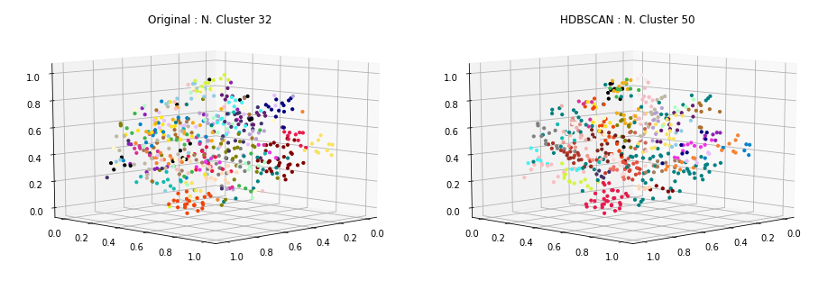

### Carregamento dos datasets

Os datasets de exemplos são frases já pré-categorizadas usadas em chatbots.

Contém 33 categorias e ao todo 696 documentos ou frases.

<table border="1" class="dataframe">
  <thead>
    <tr style="text-align: right;">
      <th></th>
      <th>perguntas</th>
      <th>cluster</th>
    </tr>
  </thead>
  <tbody>
    <tr>
      <th>13</th>
      <td>Como posso registrar um cartão SIM?</td>
      <td>ACTIVATE_DEVICE</td>
    </tr>
    <tr>
      <th>44</th>
      <td>Por favor adicione o roaming internacional na minha conta.</td>
      <td>ACTIVATE_ROAMING</td>
    </tr>
    <tr>
      <th>70</th>
      <td>Fui assaltado, preciso acionar seguro.</td>
      <td>ADD_INSURANCE</td>
    </tr>
    <tr>
      <th>97</th>
      <td>Oi, eu estava esperando que você pudesse me dizer como adicionar o recurso de mensagens de texto ao meu plano?</td>
      <td>ADD_SERVICE_FEATURES</td>
    </tr>
    <tr>
      <th>152</th>
      <td>Como cancelo meu serviço de telefone pré-pago?</td>
      <td>DEACTIVATE_PREPAID_PLAN</td>
    </tr>
    <tr>
      <th>195</th>
      <td>Você pode verificar se posso fazer um upgrade?</td>
      <td>DEVICE_UPGRADE_ELIGIBILITY</td>
    </tr>
    <tr>
      <th>34</th>
      <td>quero mudar minha password como devo proceder?</td>
      <td>PASSWORD</td>
    </tr>
    <tr>
      <th>24</th>
      <td>Minha Senha está com problema</td>
      <td>PASSWORD</td>
    </tr>
    <tr>
      <th>45</th>
      <td>Minha senha não funciona</td>
      <td>PASSWORD</td>
    </tr>
    <tr>
      <th>393</th>
      <td>Como faço para transferir o serviço de um dispositivo antigo para um novo?</td>
      <td>SWAP_DEVICE</td>
    </tr>
  </tbody>
</table>

    Qtde. de documentos por categoria:

<table border="1" class="dataframe">
  <thead>
    <tr style="text-align: right;">
      <th></th>
      <th>Categoria</th>
      <th>Qtde</th>
    </tr>
  </thead>
  <tbody>
    <tr>
      <th>0</th>
      <td>ACCOUNT</td>
      <td>29</td>
    </tr>
    <tr>
      <th>1</th>
      <td>ACTIVATE_DEVICE</td>
      <td>19</td>
    </tr>
    <tr>
      <th>2</th>
      <td>ACTIVATE_PREPAID_PLAN</td>
      <td>21</td>
    </tr>
    <tr>
      <th>3</th>
      <td>ACTIVATE_ROAMING</td>
      <td>20</td>
    </tr>
    <tr>
      <th>4</th>
      <td>ADD_INSURANCE</td>
      <td>18</td>
    </tr>
    <tr>
      <th>5</th>
      <td>ADD_SERVICE_FEATURES</td>
      <td>20</td>
    </tr>
    <tr>
      <th>6</th>
      <td>BOT_FOUND</td>
      <td>20</td>
    </tr>
    <tr>
      <th>7</th>
      <td>BOT_NAME</td>
      <td>16</td>
    </tr>
    <tr>
      <th>8</th>
      <td>CERTIFICATE</td>
      <td>18</td>
    </tr>
    <tr>
      <th>9</th>
      <td>CHANGE_PRICE_PLAN</td>
      <td>19</td>
    </tr>
    <tr>
      <th>10</th>
      <td>COVERAGE_AREA_INQUIRY</td>
      <td>19</td>
    </tr>
    <tr>
      <th>11</th>
      <td>DEACTIVATE_PREPAID_PLAN</td>
      <td>18</td>
    </tr>
    <tr>
      <th>12</th>
      <td>DEACTIVATE_ROAMING</td>
      <td>18</td>
    </tr>
    <tr>
      <th>13</th>
      <td>DEVICE_UPGRADE_ELIGIBILITY</td>
      <td>24</td>
    </tr>
    <tr>
      <th>14</th>
      <td>EMAIL</td>
      <td>40</td>
    </tr>
    <tr>
      <th>15</th>
      <td>INTERNATIONAL_RATE_PLAN_INQUIRY</td>
      <td>21</td>
    </tr>
    <tr>
      <th>16</th>
      <td>NETWORK_COMPLAINTS</td>
      <td>23</td>
    </tr>
    <tr>
      <th>17</th>
      <td>NETWORK_UNLOCK</td>
      <td>21</td>
    </tr>
    <tr>
      <th>18</th>
      <td>NO_OPTION</td>
      <td>18</td>
    </tr>
    <tr>
      <th>19</th>
      <td>PASSWORD</td>
      <td>27</td>
    </tr>
    <tr>
      <th>20</th>
      <td>PORT_IN</td>
      <td>21</td>
    </tr>
    <tr>
      <th>21</th>
      <td>PRICE_PLAN_INQUIRY</td>
      <td>23</td>
    </tr>
    <tr>
      <th>22</th>
      <td>RECHARGE_SIM</td>
      <td>18</td>
    </tr>
    <tr>
      <th>23</th>
      <td>REMOTE_ACCESS</td>
      <td>20</td>
    </tr>
    <tr>
      <th>24</th>
      <td>REMOVE_SERVICE_FEATURES</td>
      <td>20</td>
    </tr>
    <tr>
      <th>25</th>
      <td>RETURN_DEVICE</td>
      <td>21</td>
    </tr>
    <tr>
      <th>26</th>
      <td>ROAMING_INQUIRY</td>
      <td>20</td>
    </tr>
    <tr>
      <th>27</th>
      <td>SERVICES</td>
      <td>20</td>
    </tr>
    <tr>
      <th>28</th>
      <td>SWAP_DEVICE</td>
      <td>15</td>
    </tr>
    <tr>
      <th>29</th>
      <td>THANK_YOU</td>
      <td>23</td>
    </tr>
    <tr>
      <th>30</th>
      <td>TROUBLESHOOTING</td>
      <td>36</td>
    </tr>
    <tr>
      <th>31</th>
      <td>WIFI</td>
      <td>24</td>
    </tr>
  </tbody>
</table>

    Total docs     : 690
    Total cluster  : 690
    X_train size   : (552,)
    X_test  size   : (138,)

### Dataset tokenization

    Tokenization...
    Qtd documentos treino:  552
    Qtd Intents treino   :  32
    Finished...

    ['ir viajar certar empresar fornecer cobertura telefonar viagem poder informacaes servico recepcao disponivel',
     'servico bot oferecer',
     'voce um nome',
     'nao recarregar desativar ativar',
     'voce poder ajudar mudar tocar telefonar',
     'configurar email thunderbird',
     'nao precisar mais',
     'nao conseguir acessar web telefonar nao precisar configuracao',
     'poder correar voz permanentemente remover planar',
     'tutorial configuracao redar fiar android']

### **TF-IDF**

Validação do modelo gerado pelo TF-IDF... teste tanto nos dados apresentados para treinamento quanto nos dados de testes e as acurácias alcançadas.

### Acurácia distância cossenoidal

    - Acurácia treino: 99.0
    --------------------
     - Acurácia teste 1  : 57.0
     - Acurácia teste 2  : 62.0
     - Acurácia teste 3  : 57.0
     - Acurácia teste 4  : 60.0
     - Acurácia teste 5  : 63.0
    - Acurácia média teste: 59.8

### Acurácia distância euclidiana

    - Acurácia treino: 99.0
    --------------------
     - Acurácia teste 1  : 46.0
     - Acurácia teste 2  : 48.0
     - Acurácia teste 3  : 39.0
     - Acurácia teste 4  : 45.0
     - Acurácia teste 5  : 47.0
    - Acurácia média teste: 45.0

### Clusterização

Utilizou-se o KMeans definindo a quantidade de clusters para o número ideal de categorias existentes no caso 33. A métrica de distância utilizada, não foi a euclidiana, mas sim a de cosseno (métrica comumente usada na classificação de texto em seu espaço vetorial).

    Frases por cluster:

<table border="1" class="dataframe">
  <thead>
    <tr style="text-align: right;">
      <th>title</th>
      <th>cluster</th>
    </tr>
  </thead>
  <tbody>
    <tr>
      <td>Solicitação de certificado digital</td>
      <td>0</td>
    </tr>
    <tr>
      <td>como faço para criar um novo certificado digital?</td>
      <td>0</td>
    </tr>
    <tr>
      <td>Quero informações sobre como alterar meu plano para uma nova oferta</td>
      <td>1</td>
    </tr>
    <tr>
      <td>A rede está horrível! Alguma manutenção acontecendo?</td>
      <td>1</td>
    </tr>
    <tr>
      <td>Posso cancelar meu roaming em qualquer momento?</td>
      <td>2</td>
    </tr>
    <tr>
      <td>Cancelar o serviço de roaming</td>
      <td>2</td>
    </tr>
    <tr>
      <td>Olá, eu gostaria de saber como manter meu número antigo do meu provedor de serviços anterior na minha nova conta com vocês, por favor</td>
      <td>3</td>
    </tr>
    <tr>
      <td>Oi Tom, como posso transferir meu número de telefone da antiga operadora para a minha nova linha com vocês?</td>
      <td>3</td>
    </tr>
    <tr>
      <td>Como desativar a função roaming?</td>
      <td>4</td>
    </tr>
    <tr>
      <td>O que eu preciso fazer para que o serviço do telefone pré-pago seja desligado?</td>
      <td>4</td>
    </tr>
    <tr>
      <td>Se eu cancelar o roaming agora, demora muito pra concluir o pedido?</td>
      <td>5</td>
    </tr>
    <tr>
      <td>pra que voce serve?</td>
      <td>5</td>
    </tr>
    <tr>
      <td>Minhas mensagens de texto não estão funcionando. Não posso receber mensagens de texto, mas posso enviá-las. Pode me ajudar com isso?</td>
      <td>6</td>
    </tr>
    <tr>
      <td>Você pode por favor me dizer se eu sou elegível para atualizar meu celular de graça? Caso contrário, em que data serei elegível para fazê-lo?</td>
      <td>6</td>
    </tr>
    <tr>
      <td>Quero desligar o roaming da minha conta</td>
      <td>7</td>
    </tr>
    <tr>
      <td>minha conta de email foi desativada</td>
      <td>7</td>
    </tr>
    <tr>
      <td>Qual é a taxa de roaming para a Internet em Dubai?</td>
      <td>8</td>
    </tr>
    <tr>
      <td>quais os serviços que podem ser resolvidos pelo bot?</td>
      <td>8</td>
    </tr>
    <tr>
      <td>Quanto tempo vai demorar para o meu telefone ativar?</td>
      <td>9</td>
    </tr>
    <tr>
      <td>Quanto tempo eu tenho para devolver o telefone, se eu mudar de ideia?</td>
      <td>9</td>
    </tr>
    <tr>
      <td>Qual é o mais recente plano 4G adequado para mim como um pacote família?</td>
      <td>10</td>
    </tr>
    <tr>
      <td>E se eu diminuir meu plano de dados para 5Gb e desejar alterá-lo de volta para 15GB minutos depois. Posso pegar meu plano atual de volta?</td>
      <td>10</td>
    </tr>
    <tr>
      <td>Comprei um celular através da Amazon, como posso adicioná-lo à minha conta?</td>
      <td>11</td>
    </tr>
    <tr>
      <td>Eu gostaria de comprar um plano somente</td>
      <td>11</td>
    </tr>
    <tr>
      <td>Quanto me custará por minuto para chamar minha tia na Austrália?</td>
      <td>12</td>
    </tr>
    <tr>
      <td>Eu quero ativar o identificador de chamadas.</td>
      <td>12</td>
    </tr>
    <tr>
      <td>Existe uma maneira de obter informações precisas sobre a área de cobertura e a qualidade da chamada esperada em cada área respectiva?</td>
      <td>13</td>
    </tr>
    <tr>
      <td>Eu estou pagando pela cobertura da LTE. Eu não posso usar isso? Espero que isso seja refletido como um desconto na minha conta até que eu possa usar o que eu pago.</td>
      <td>13</td>
    </tr>
    <tr>
      <td>Trocar meu aparelho por um novo é possivel?</td>
      <td>14</td>
    </tr>
    <tr>
      <td>Porque não é o meu novo telefone desbloqueado ainda?</td>
      <td>14</td>
    </tr>
    <tr>
      <td>Como posso fazer mais chamadas com o meu cartão recarregável?</td>
      <td>15</td>
    </tr>
    <tr>
      <td>não preciso mais de ajuda, obrigado</td>
      <td>15</td>
    </tr>
    <tr>
      <td>estou sem acesso ao meu endereco eletronico</td>
      <td>16</td>
    </tr>
    <tr>
      <td>o email não esta no spam</td>
      <td>16</td>
    </tr>
    <tr>
      <td>é possível trocar o meu username?</td>
      <td>17</td>
    </tr>
    <tr>
      <td>Não consigo criar meu username</td>
      <td>17</td>
    </tr>
    <tr>
      <td>você ajudou muito</td>
      <td>18</td>
    </tr>
    <tr>
      <td>Você pode me ajudar a aumentar meus minutos no meu telefone?</td>
      <td>18</td>
    </tr>
    <tr>
      <td>Preciso remover o MMS no meu telefone.</td>
      <td>19</td>
    </tr>
    <tr>
      <td>O que eu preciso fazer para ativar meu novo telefone pré-pago e remover a restrição?</td>
      <td>19</td>
    </tr>
    <tr>
      <td>como configurar a vpn</td>
      <td>20</td>
    </tr>
    <tr>
      <td>gostaria de utilizar a vpn da empresa</td>
      <td>20</td>
    </tr>
    <tr>
      <td>quero me conectar a rede sem fio</td>
      <td>21</td>
    </tr>
    <tr>
      <td>preciso conectar me a internet através da rede sem fio (wifi)</td>
      <td>21</td>
    </tr>
    <tr>
      <td>Existem áreas sem recepção das quais que eu deveria estar ciente?</td>
      <td>22</td>
    </tr>
    <tr>
      <td>como eu devo lhe chamar?</td>
      <td>22</td>
    </tr>
    <tr>
      <td>Você poderia me falar sobre os diferentes planos de preços disponíveis na minha localização?</td>
      <td>23</td>
    </tr>
    <tr>
      <td>Quais são os preços para os planos de dados e chamadas diferentes que você oferece?</td>
      <td>23</td>
    </tr>
    <tr>
      <td>Não consigo recuperar a minha senha</td>
      <td>24</td>
    </tr>
    <tr>
      <td>Há certas partes na minha cidade onde eu não tenho sinal. Pode me dizer qual poderia ser o motivo?</td>
      <td>24</td>
    </tr>
    <tr>
      <td>Consulta sobre portabilidade</td>
      <td>25</td>
    </tr>
    <tr>
      <td>Por favor me avise se eu vou poder ficar com o meu número de telefone atual quando mudar de fornecedores</td>
      <td>25</td>
    </tr>
    <tr>
      <td>Posso excluir o envio de sms?</td>
      <td>26</td>
    </tr>
    <tr>
      <td>Queria excluir as ligações fora da minha região do meu plano</td>
      <td>26</td>
    </tr>
    <tr>
      <td>Qual é o procedimento para incluir um seguro para o meu telefone?</td>
      <td>27</td>
    </tr>
    <tr>
      <td>As chamadas internacionais estão incluídas no meu plano?</td>
      <td>27</td>
    </tr>
    <tr>
      <td>como eu faco para acessar a rede da empresa estando eu em outro pais</td>
      <td>28</td>
    </tr>
    <tr>
      <td>Eu preciso devolver os controles para a empresa?</td>
      <td>28</td>
    </tr>
    <tr>
      <td>você tem um nome?</td>
      <td>29</td>
    </tr>
    <tr>
      <td>seu nome qual é mesmo?</td>
      <td>29</td>
    </tr>
    <tr>
      <td>Quero perguntar sobre o cancelamento do pedido de um dispositivo móvel</td>
      <td>30</td>
    </tr>
    <tr>
      <td>Estou tentando ativar o meu novo telefone com o serviço pré-pago.</td>
      <td>30</td>
    </tr>
    <tr>
      <td>como alterar minha senha do usuário?</td>
      <td>31</td>
    </tr>
    <tr>
      <td>houve um erro de senha</td>
      <td>31</td>
    </tr>
  </tbody>
</table>

    --------------------
    Documentos por cluster:

<table border="1" class="dataframe">
  <tbody>
    <tr>
      <td>C0</td>
      <td>26</td>
    </tr>
    <tr>
      <td>C1</td>
      <td>17</td>
    </tr>
    <tr>
      <td>C2</td>
      <td>15</td>
    </tr>
    <tr>
      <td>C3</td>
      <td>16</td>
    </tr>
    <tr>
      <td>C4</td>
      <td>21</td>
    </tr>
    <tr>
      <td>C5</td>
      <td>5</td>
    </tr>
    <tr>
      <td>C6</td>
      <td>9</td>
    </tr>
    <tr>
      <td>C7</td>
      <td>16</td>
    </tr>
    <tr>
      <td>C8</td>
      <td>33</td>
    </tr>
    <tr>
      <td>C9</td>
      <td>21</td>
    </tr>
    <tr>
      <td>C10</td>
      <td>19</td>
    </tr>
    <tr>
      <td>C11</td>
      <td>7</td>
    </tr>
    <tr>
      <td>C12</td>
      <td>15</td>
    </tr>
    <tr>
      <td>C13</td>
      <td>17</td>
    </tr>
    <tr>
      <td>C14</td>
      <td>21</td>
    </tr>
    <tr>
      <td>C15</td>
      <td>23</td>
    </tr>
    <tr>
      <td>C16</td>
      <td>27</td>
    </tr>
    <tr>
      <td>C17</td>
      <td>38</td>
    </tr>
    <tr>
      <td>C18</td>
      <td>38</td>
    </tr>
    <tr>
      <td>C19</td>
      <td>10</td>
    </tr>
    <tr>
      <td>C20</td>
      <td>10</td>
    </tr>
    <tr>
      <td>C21</td>
      <td>23</td>
    </tr>
    <tr>
      <td>C22</td>
      <td>4</td>
    </tr>
    <tr>
      <td>C23</td>
      <td>14</td>
    </tr>
    <tr>
      <td>C24</td>
      <td>11</td>
    </tr>
    <tr>
      <td>C25</td>
      <td>6</td>
    </tr>
    <tr>
      <td>C26</td>
      <td>4</td>
    </tr>
    <tr>
      <td>C27</td>
      <td>17</td>
    </tr>
    <tr>
      <td>C28</td>
      <td>10</td>
    </tr>
    <tr>
      <td>C29</td>
      <td>12</td>
    </tr>
    <tr>
      <td>C30</td>
      <td>33</td>
    </tr>
    <tr>
      <td>C31</td>
      <td>14</td>
    </tr>
  </tbody>
</table>

### Visualização

Apresentação dos protótipos gerados pelo KMeans, reduzindo a dimensão usando o algoritmo MDS (Multidimensional Scaling).

### Clusterização dos dados de Teste

Por fim, realizada a clusterização dos dados de teste e a apresentação das 8 primeiras frases do conjunto de teste juntamente com outras duas frases do cluster ao qual foi identificado como o melhor.

    * Se eu ativar roaming agora, já posso utilizar?
      -  Qual é a taxa de roaming para a Internet em Dubai?
      -  quais os serviços que podem ser resolvidos pelo bot?
    --------------------
    * Fui assaltado, preciso acionar seguro.
      -  As chamadas internacionais estão incluídas no meu plano?
      -  Qual é o procedimento para incluir um seguro para o meu telefone?
    --------------------
    * Estou bastante cansado do meu telefone existente e gostaria de saber quando eu vou ser elegível para sua atualização?
      -  Comprei um celular através da Amazon, como posso adicioná-lo à minha conta?
      -  Eu gostaria de comprar um plano somente
    --------------------
    * Oi, como posso ativar o encaminhamento de chamada no meu plano?
      -  Quanto me custará por minuto para chamar minha tia na Austrália?
      -  Eu quero ativar o identificador de chamadas.
    --------------------
    * Eu não consigo acessar meu email
      -  estou sem acesso ao meu endereco eletronico
      -  o email não esta no spam
    --------------------
    * Estou indo para uma viagem ao extremo norte da Ilha de Vancouver e gostaria de verificar se há serviço de celular nessa área. Você pode verificar o quanto longe do norte eu posso esperar para receber a recepção.
      -  você ajudou muito
      -  Você pode me ajudar a aumentar meus minutos no meu telefone?
    --------------------
    * Gostaria de verificar todas as taxas para cobertura internacional
      -  Qual é a taxa de roaming para a Internet em Dubai?
      -  quais os serviços que podem ser resolvidos pelo bot?
    --------------------
    * Além do fornecimento de água vocês oferecem algum outro serviço?
      -  Você pode me ajudar a aumentar meus minutos no meu telefone?
      -  você ajudou muito
    --------------------

### Métricas

Abaixo são apresentadas métricas para demonstrar o quanto a clusterização parece funcionar.

    Homogeneidade    :  0.67
    Completude       :  0.716
    V-Measure        :  0.692
    Silhouette       :  0.058

### HDBSCAN no espaço dos dados

    Frases por cluster:

<table border="1" class="dataframe">
  <thead>
    <tr style="text-align: right;">
      <th>title</th>
      <th>cluster</th>
    </tr>
  </thead>
  <tbody>
    <tr>
      <td>Quero informações sobre fazer ligações internacionais de casa</td>
      <td>0</td>
    </tr>
    <tr>
      <td>Preciso desconectar uma das minhas linhas telefônicas. Posso fazer isso por telefone?</td>
      <td>0</td>
    </tr>
    <tr>
      <td>Logo precisarei fazer várias ligações internacionais do meu país. Onde posso encontrar, ou como posso ter uma lista completa com todos os preços possíveis indicados?</td>
      <td>0</td>
    </tr>
    <tr>
      <td>tem como renovar um certificado digital emitido?</td>
      <td>1</td>
    </tr>
    <tr>
      <td>onde consigo mais informações sobre a emição / manutenção de certificados digitais emitidos pela empresa?</td>
      <td>1</td>
    </tr>
    <tr>
      <td>Solicitação de certificado digital</td>
      <td>1</td>
    </tr>
    <tr>
      <td>posso acessar meu endereço eletrônico via thunderbird ou outlook?</td>
      <td>2</td>
    </tr>
    <tr>
      <td>consigo criar um endereço eletrônico de email institucional?</td>
      <td>2</td>
    </tr>
    <tr>
      <td>Eu preciso criar um email institucional</td>
      <td>2</td>
    </tr>
    <tr>
      <td>Existe uma loja local que poderia ativar o meu telefone pré-pago?</td>
      <td>3</td>
    </tr>
    <tr>
      <td>Qual é o processo para retornar o produto para uma loja?</td>
      <td>3</td>
    </tr>
    <tr>
      <td>Preciso ir até uma loja para ativar meu novo SIM?</td>
      <td>3</td>
    </tr>
    <tr>
      <td>Quais são os preços para os planos de dados e chamadas diferentes que você oferece?</td>
      <td>4</td>
    </tr>
    <tr>
      <td>Você pode por favor fornecer-me com informações sobre os diferentes planos que estão disponíveis?</td>
      <td>4</td>
    </tr>
    <tr>
      <td>Que planos estão disponíveis para chamada e dados Internacional?</td>
      <td>4</td>
    </tr>
    <tr>
      <td>um patrulheiro pode ter uma conta de usuário?</td>
      <td>5</td>
    </tr>
    <tr>
      <td>quero criar uma conta de usuário para um colaborador externo, como fazer?</td>
      <td>5</td>
    </tr>
    <tr>
      <td>Como posso criar uma conta para Colaborador Externo?</td>
      <td>5</td>
    </tr>
    <tr>
      <td>Posso adicionar mensagens de texto aos meus serviços?</td>
      <td>6</td>
    </tr>
    <tr>
      <td>Como faço para remover o serviço de mensagens de texto?</td>
      <td>6</td>
    </tr>
    <tr>
      <td>Meu telefone novo não pode receber nenhuma mensagem de texto ou e-mail enquanto eu estou em uma chamada? Eu costumava ser capaz de fazer isso com meu telefone antigo</td>
      <td>6</td>
    </tr>
    <tr>
      <td>Posso incluir roaming no meu plano por duas semanas?</td>
      <td>7</td>
    </tr>
    <tr>
      <td>Como atualizo minha conta para incluir chamadas internacionais?</td>
      <td>7</td>
    </tr>
    <tr>
      <td>Eu vou à Florença neste fim de semana e quero ativar roaming.</td>
      <td>7</td>
    </tr>
    <tr>
      <td>Você poderia me ajudar em como mudar o toque do meu telefone?</td>
      <td>8</td>
    </tr>
    <tr>
      <td>Como mudar de telefone?</td>
      <td>8</td>
    </tr>
    <tr>
      <td>Quero mudar os provedores de serviço, ainda posso manter meu mesmo número de telefone?</td>
      <td>8</td>
    </tr>
    <tr>
      <td>Oi! Este telefone tem seguro? Posso fazer o seguro para este telefone eu mesmo?</td>
      <td>9</td>
    </tr>
    <tr>
      <td>Quero atualizar o meu plano com o seguro de telefone.</td>
      <td>9</td>
    </tr>
    <tr>
      <td>Será que meu telefone seja elegível para atualizar este ano em um preço com desconto?</td>
      <td>9</td>
    </tr>
    <tr>
      <td>voce nao sabe nada sobre vpn?</td>
      <td>10</td>
    </tr>
    <tr>
      <td>configurar vpn (acesso remoto) em aparelhos da nokia</td>
      <td>10</td>
    </tr>
    <tr>
      <td>configurar o vpn (acesso remoto) no macOSX</td>
      <td>10</td>
    </tr>
    <tr>
      <td>consigo recuperar emails perdidos?</td>
      <td>11</td>
    </tr>
    <tr>
      <td>Não consigo restaurar a minha senha</td>
      <td>11</td>
    </tr>
    <tr>
      <td>Não consigo recuperar a minha senha</td>
      <td>11</td>
    </tr>
    <tr>
      <td>Preciso de informações em como cancelar o roaming</td>
      <td>12</td>
    </tr>
    <tr>
      <td>Como cancelo meu serviço de telefone pré-pago?</td>
      <td>12</td>
    </tr>
    <tr>
      <td>Posso cancelar meu plano pré-pago a qualquer momento?</td>
      <td>12</td>
    </tr>
    <tr>
      <td>Porque não é o meu novo telefone desbloqueado ainda?</td>
      <td>13</td>
    </tr>
    <tr>
      <td>Eu não sei como desbloquear o meu novo dispositivo. Pode me dizer como?</td>
      <td>13</td>
    </tr>
    <tr>
      <td>Por favor me ajude desbloquear meu novo telefone no meu plano de serviço.</td>
      <td>13</td>
    </tr>
    <tr>
      <td>Qual o preço para ativar o roaming?</td>
      <td>14</td>
    </tr>
    <tr>
      <td>Eu gostaria de saber sobre os encargos de roaming internacional e como ativar isto.</td>
      <td>14</td>
    </tr>
    <tr>
      <td>Como posso ativar o roaming internacional, por favor?</td>
      <td>14</td>
    </tr>
    <tr>
      <td>estou com problemas para acessar meu email</td>
      <td>15</td>
    </tr>
    <tr>
      <td>não consegui acessar meu email</td>
      <td>15</td>
    </tr>
    <tr>
      <td>Não consigo entrar no meu email</td>
      <td>15</td>
    </tr>
    <tr>
      <td>como eu devo lhe chamar?</td>
      <td>16</td>
    </tr>
    <tr>
      <td>Qual é a taxa de roaming para a Internet em Dubai?</td>
      <td>16</td>
    </tr>
    <tr>
      <td>Posso fazer chamadas internacionais diretamente do meu celular?</td>
      <td>16</td>
    </tr>
    <tr>
      <td>qual é o seu nome?</td>
      <td>17</td>
    </tr>
    <tr>
      <td>tem como eu mudar meu nome de usuário?</td>
      <td>17</td>
    </tr>
    <tr>
      <td>você tem um nome?</td>
      <td>17</td>
    </tr>
    <tr>
      <td>Não consigo criar meu username</td>
      <td>18</td>
    </tr>
    <tr>
      <td>Username já cadastrado</td>
      <td>18</td>
    </tr>
    <tr>
      <td>Usuário / Matrícula já cadastrado com o username</td>
      <td>18</td>
    </tr>
    <tr>
      <td>como alterar minha senha do usuário?</td>
      <td>19</td>
    </tr>
    <tr>
      <td>meu usuário e senha não estão funcionando</td>
      <td>19</td>
    </tr>
    <tr>
      <td>inseri o email e senha e não deu certo</td>
      <td>19</td>
    </tr>
    <tr>
      <td>Estou tendo um problema com o meu telefone. Não consigo fazer ou receber chamadas! Eu preciso de ajuda!</td>
      <td>20</td>
    </tr>
    <tr>
      <td>Oi. Tenho um sinal forte, mas não consigo fazer ou receber chamadas. Você pode me ajudar a ver como resolver esse problema?</td>
      <td>20</td>
    </tr>
    <tr>
      <td>Não consigo receber chamadas no meu telefone, mas posso fazer chamadas para qualquer pessoa em qualquer lugar.</td>
      <td>20</td>
    </tr>
    <tr>
      <td>quero acessar a rede da empresa da minha casa</td>
      <td>21</td>
    </tr>
    <tr>
      <td>quero configurar a rede sem fio (wifi) da empresa no meu computador</td>
      <td>21</td>
    </tr>
    <tr>
      <td>quero configurar a rede sem fio no meu celular</td>
      <td>21</td>
    </tr>
    <tr>
      <td>como conectar a rede wifi do meu departamento?</td>
      <td>22</td>
    </tr>
    <tr>
      <td>preciso conectar me a internet através da rede sem fio (wifi)</td>
      <td>22</td>
    </tr>
    <tr>
      <td>como me conectar a rede sem fio</td>
      <td>22</td>
    </tr>
    <tr>
      <td>Onde eu ativo o meu dispositivo pré-pago?</td>
      <td>23</td>
    </tr>
    <tr>
      <td>É possível desativar o meu dispositivo de telefone pré-pago?</td>
      <td>23</td>
    </tr>
    <tr>
      <td>Como faço para ativar o novo dispositivo pré-pago que acabei de receber?</td>
      <td>23</td>
    </tr>
    <tr>
      <td>Eu quero desligar a função de roaming.</td>
      <td>24</td>
    </tr>
    <tr>
      <td>Sim eu quero desativar o roaming no meu número de telefone</td>
      <td>24</td>
    </tr>
    <tr>
      <td>Como desativar a função roaming?</td>
      <td>24</td>
    </tr>
    <tr>
      <td>preciso de ajudar</td>
      <td>25</td>
    </tr>
    <tr>
      <td>voce nao conseguiu me entender preciso de ajuda de verdade</td>
      <td>25</td>
    </tr>
    <tr>
      <td>não preciso mais de ajuda, obrigado</td>
      <td>25</td>
    </tr>
    <tr>
      <td>quem e voce?</td>
      <td>26</td>
    </tr>
    <tr>
      <td>você tem outros serviços?</td>
      <td>26</td>
    </tr>
    <tr>
      <td>existem mais serviços com os quais eu posso consultar?</td>
      <td>26</td>
    </tr>
    <tr>
      <td>Meu novo telefone não está ativado ainda. Quem pode me ajudar com este problema?</td>
      <td>27</td>
    </tr>
    <tr>
      <td>você tem outras opções para ajudar?</td>
      <td>27</td>
    </tr>
    <tr>
      <td>Você não conseguiu me ajudar</td>
      <td>27</td>
    </tr>
    <tr>
      <td>Posso falar com um humano?</td>
      <td>28</td>
    </tr>
    <tr>
      <td>voce nao conseguiu me ajudar, quero falar com um atendente</td>
      <td>28</td>
    </tr>
    <tr>
      <td>estou falando com um bot</td>
      <td>28</td>
    </tr>
  </tbody>
</table>

    --------------------
    Documentos por cluster:

<table border="1" class="dataframe">
  <tbody>
    <tr>
      <td>C0</td>
      <td>7</td>
    </tr>
    <tr>
      <td>C1</td>
      <td>12</td>
    </tr>
    <tr>
      <td>C2</td>
      <td>5</td>
    </tr>
    <tr>
      <td>C3</td>
      <td>5</td>
    </tr>
    <tr>
      <td>C4</td>
      <td>6</td>
    </tr>
    <tr>
      <td>C5</td>
      <td>5</td>
    </tr>
    <tr>
      <td>C6</td>
      <td>8</td>
    </tr>
    <tr>
      <td>C7</td>
      <td>7</td>
    </tr>
    <tr>
      <td>C8</td>
      <td>9</td>
    </tr>
    <tr>
      <td>C9</td>
      <td>23</td>
    </tr>
    <tr>
      <td>C10</td>
      <td>9</td>
    </tr>
    <tr>
      <td>C11</td>
      <td>5</td>
    </tr>
    <tr>
      <td>C12</td>
      <td>9</td>
    </tr>
    <tr>
      <td>C13</td>
      <td>5</td>
    </tr>
    <tr>
      <td>C14</td>
      <td>7</td>
    </tr>
    <tr>
      <td>C15</td>
      <td>15</td>
    </tr>
    <tr>
      <td>C16</td>
      <td>303</td>
    </tr>
    <tr>
      <td>C17</td>
      <td>12</td>
    </tr>
    <tr>
      <td>C18</td>
      <td>7</td>
    </tr>
    <tr>
      <td>C19</td>
      <td>13</td>
    </tr>
    <tr>
      <td>C20</td>
      <td>5</td>
    </tr>
    <tr>
      <td>C21</td>
      <td>18</td>
    </tr>
    <tr>
      <td>C22</td>
      <td>7</td>
    </tr>
    <tr>
      <td>C23</td>
      <td>8</td>
    </tr>
    <tr>
      <td>C24</td>
      <td>6</td>
    </tr>
    <tr>
      <td>C25</td>
      <td>11</td>
    </tr>
    <tr>
      <td>C26</td>
      <td>5</td>
    </tr>
    <tr>
      <td>C27</td>
      <td>10</td>
    </tr>
    <tr>
      <td>C28</td>
      <td>10</td>
    </tr>
  </tbody>
</table>

### Topologia dos dados de treinamento usando MDS

## **HDBSCAN**

 - [How HDBSCAN Works](https://nbviewer.jupyter.org/github/scikit-learn-contrib/hdbscan/blob/master/notebooks/How%20HDBSCAN%20Works.ipynb)
 - [hdbscan github implementation](https://github.com/scikit-learn-contrib/hdbscan)
 - [Density-Based Clustering Based on Hierarchical Density Estimates](https://link.springer.com/chapter/10.1007/978-3-642-37456-2_14)

---

## **t-SNE + HDBSCAN**

<table border="1" class="dataframe">
  <thead>
    <tr style="text-align: right;">
      <th></th>
      <th>Perplexity</th>
      <th>Learning Rate</th>
      <th>Angle</th>
      <th>V-Measure</th>
      <th>Silhouette</th>
    </tr>
  </thead>
  <tbody>
    <tr>
      <th>53</th>
      <td>58</td>
      <td>134</td>
      <td>0.77</td>
      <td>0.513</td>
      <td>0.310</td>
    </tr>
    <tr>
      <th>47</th>
      <td>52</td>
      <td>209</td>
      <td>0.87</td>
      <td>0.466</td>
      <td>0.299</td>
    </tr>
    <tr>
      <th>10</th>
      <td>15</td>
      <td>148</td>
      <td>0.90</td>
      <td>0.499</td>
      <td>0.299</td>
    </tr>
    <tr>
      <th>20</th>
      <td>25</td>
      <td>148</td>
      <td>0.90</td>
      <td>0.510</td>
      <td>0.283</td>
    </tr>
    <tr>
      <th>0</th>
      <td>5</td>
      <td>148</td>
      <td>0.90</td>
      <td>0.496</td>
      <td>0.281</td>
    </tr>
    <tr>
      <th>8</th>
      <td>13</td>
      <td>94</td>
      <td>0.89</td>
      <td>0.517</td>
      <td>0.273</td>
    </tr>
    <tr>
      <th>28</th>
      <td>33</td>
      <td>94</td>
      <td>0.89</td>
      <td>0.472</td>
      <td>0.258</td>
    </tr>
    <tr>
      <th>14</th>
      <td>19</td>
      <td>189</td>
      <td>0.85</td>
      <td>0.456</td>
      <td>0.245</td>
    </tr>
    <tr>
      <th>22</th>
      <td>27</td>
      <td>204</td>
      <td>0.87</td>
      <td>0.479</td>
      <td>0.243</td>
    </tr>
    <tr>
      <th>37</th>
      <td>42</td>
      <td>187</td>
      <td>0.87</td>
      <td>0.474</td>
      <td>0.242</td>
    </tr>
    <tr>
      <th>51</th>
      <td>56</td>
      <td>77</td>
      <td>0.81</td>
      <td>0.492</td>
      <td>0.239</td>
    </tr>
    <tr>
      <th>41</th>
      <td>46</td>
      <td>77</td>
      <td>0.81</td>
      <td>0.493</td>
      <td>0.238</td>
    </tr>
    <tr>
      <th>30</th>
      <td>35</td>
      <td>148</td>
      <td>0.90</td>
      <td>0.487</td>
      <td>0.234</td>
    </tr>
    <tr>
      <th>19</th>
      <td>24</td>
      <td>127</td>
      <td>0.89</td>
      <td>0.474</td>
      <td>0.232</td>
    </tr>
    <tr>
      <th>5</th>
      <td>10</td>
      <td>165</td>
      <td>0.90</td>
      <td>0.491</td>
      <td>0.230</td>
    </tr>
    <tr>
      <th>9</th>
      <td>14</td>
      <td>127</td>
      <td>0.89</td>
      <td>0.485</td>
      <td>0.228</td>
    </tr>
    <tr>
      <th>17</th>
      <td>22</td>
      <td>187</td>
      <td>0.87</td>
      <td>0.450</td>
      <td>0.223</td>
    </tr>
    <tr>
      <th>23</th>
      <td>28</td>
      <td>170</td>
      <td>0.84</td>
      <td>0.452</td>
      <td>0.220</td>
    </tr>
    <tr>
      <th>38</th>
      <td>43</td>
      <td>94</td>
      <td>0.89</td>
      <td>0.486</td>
      <td>0.216</td>
    </tr>
    <tr>
      <th>16</th>
      <td>21</td>
      <td>176</td>
      <td>0.85</td>
      <td>0.472</td>
      <td>0.209</td>
    </tr>
    <tr>
      <th>40</th>
      <td>45</td>
      <td>133</td>
      <td>0.80</td>
      <td>0.447</td>
      <td>0.208</td>
    </tr>
    <tr>
      <th>55</th>
      <td>60</td>
      <td>173</td>
      <td>0.74</td>
      <td>0.489</td>
      <td>0.205</td>
    </tr>
    <tr>
      <th>52</th>
      <td>57</td>
      <td>98</td>
      <td>0.86</td>
      <td>0.478</td>
      <td>0.204</td>
    </tr>
    <tr>
      <th>35</th>
      <td>40</td>
      <td>165</td>
      <td>0.90</td>
      <td>0.451</td>
      <td>0.201</td>
    </tr>
    <tr>
      <th>46</th>
      <td>51</td>
      <td>122</td>
      <td>0.84</td>
      <td>0.469</td>
      <td>0.200</td>
    </tr>
  </tbody>
</table>

    Homogeneidade    :  0.526
    Completude       :  0.501
    V-Measure        :  0.513
    Silhouette       :  0.31

    Frases por cluster:

<table border="1" class="dataframe">
  <thead>
    <tr style="text-align: right;">
      <th>title</th>
      <th>cluster</th>
    </tr>
  </thead>
  <tbody>
    <tr>
      <td>acessar remotamente os sistemas da empresa da minha casa</td>
      <td>0</td>
    </tr>
    <tr>
      <td>como acessar wifi da empresa?</td>
      <td>0</td>
    </tr>
    <tr>
      <td>como acessar os sistemas da empresa de casa</td>
      <td>0</td>
    </tr>
    <tr>
      <td>Quando minha conta vai ser elegível para um dispositivo atualizado</td>
      <td>1</td>
    </tr>
    <tr>
      <td>Por favor me diga quando eu vou ser elegível para minha próxima atualização do dispositivo.</td>
      <td>1</td>
    </tr>
    <tr>
      <td>Quando dentro do contrato sou elegivel para atualizar meu atual aparelho?</td>
      <td>1</td>
    </tr>
    <tr>
      <td>Eu estou pagando pela cobertura da LTE. Eu não posso usar isso? Espero que isso seja refletido como um desconto na minha conta até que eu possa usar o que eu pago.</td>
      <td>2</td>
    </tr>
    <tr>
      <td>O que vai custar menos ficar no meu plano atual ou mudar para o novo?</td>
      <td>2</td>
    </tr>
    <tr>
      <td>Por favor me avise se eu vou poder ficar com o meu número de telefone atual quando mudar de fornecedores</td>
      <td>2</td>
    </tr>
    <tr>
      <td>how to configure vpn?</td>
      <td>3</td>
    </tr>
    <tr>
      <td>Como posso atualizar o mapa de cobertura de seu serviço? O mapa mostra que eu deveria ter total cobertura 4G, mas a realidade diz o contrário.</td>
      <td>3</td>
    </tr>
    <tr>
      <td>como configurar a vpn</td>
      <td>3</td>
    </tr>
    <tr>
      <td>como eu devo lhe chamar?</td>
      <td>4</td>
    </tr>
    <tr>
      <td>Como posso fazer uma ligação internacional do meu país de origem?</td>
      <td>4</td>
    </tr>
    <tr>
      <td>como utilizar acesso vpn</td>
      <td>4</td>
    </tr>
    <tr>
      <td>não consigo criar meu username, da mensagem de username já cadastrado</td>
      <td>5</td>
    </tr>
    <tr>
      <td>Não consigo criar meu username</td>
      <td>5</td>
    </tr>
    <tr>
      <td>meu novo username não esta sendo criado</td>
      <td>5</td>
    </tr>
    <tr>
      <td>Me qualifico para uma atualização de telefone neste momento?</td>
      <td>6</td>
    </tr>
    <tr>
      <td>Eu gostaria de incluir texto de mensagem para o meu plano, pode fazer isso por mim?</td>
      <td>6</td>
    </tr>
    <tr>
      <td>Meu telefone novo não pode receber nenhuma mensagem de texto ou e-mail enquanto eu estou em uma chamada? Eu costumava ser capaz de fazer isso com meu telefone antigo</td>
      <td>6</td>
    </tr>
    <tr>
      <td>quero informações sobre email da minha empresa</td>
      <td>7</td>
    </tr>
    <tr>
      <td>Não consigo acessar a web no meu telefone, não tenho certeza se isso precisar de algumas configurações.</td>
      <td>7</td>
    </tr>
    <tr>
      <td>como saber mais sobre o email da empresa</td>
      <td>7</td>
    </tr>
    <tr>
      <td>Como remover recursos do plano do telefone sem fio em casa?</td>
      <td>8</td>
    </tr>
    <tr>
      <td>Eu preciso devolver os controles para a empresa?</td>
      <td>8</td>
    </tr>
    <tr>
      <td>Eu gostaria de cancelar o serviço de encaminhamento das minhas ligações. Como faço isso?</td>
      <td>8</td>
    </tr>
    <tr>
      <td>Oi, a velocidade de dados no meu dispositivo ainda está muito abaixo dos níveis anunciados. Isso já está acontecendo por dois meses agora. Como serei compensado por isso? Estou pensando em mudar de novo. Isto é uma quebra de contrato.</td>
      <td>9</td>
    </tr>
    <tr>
      <td>Posso levar meu telefone comigo se eu mudar para uma nova empresa.</td>
      <td>9</td>
    </tr>
    <tr>
      <td>Posso incluir mensagens de vídeo como um recurso de serviço novo no meu telefone?</td>
      <td>9</td>
    </tr>
    <tr>
      <td>Meu email não entra, sem acesso</td>
      <td>10</td>
    </tr>
    <tr>
      <td>O meu telefone não recebe cobertura quando eu dirijo para a casa da minha mãe. Se eu lhe der o endereço dela, poderia me dizer o que posso fazer para melhorar minha recepção lá?</td>
      <td>10</td>
    </tr>
    <tr>
      <td>Como faço para ativar o novo dispositivo pré-pago que acabei de receber?</td>
      <td>10</td>
    </tr>
    <tr>
      <td>estou com problemas para acessar meu email</td>
      <td>11</td>
    </tr>
    <tr>
      <td>não estou conseguindo acessar meu email</td>
      <td>11</td>
    </tr>
    <tr>
      <td>posso acessar meu endereço eletrônico via thunderbird ou outlook?</td>
      <td>11</td>
    </tr>
    <tr>
      <td>posso ver outras opções de serviços?</td>
      <td>12</td>
    </tr>
    <tr>
      <td>quais outras opcoes voce consegue responder pra mim?</td>
      <td>12</td>
    </tr>
    <tr>
      <td>nenhuma das opções apresentadas tem o que quero fazer</td>
      <td>12</td>
    </tr>
    <tr>
      <td>Existe uma maneira de obter informações precisas sobre a área de cobertura e a qualidade da chamada esperada em cada área respectiva?</td>
      <td>13</td>
    </tr>
    <tr>
      <td>Preciso de informações em como cancelar o roaming</td>
      <td>13</td>
    </tr>
    <tr>
      <td>Favor realizar a ativação do meu SIM card</td>
      <td>13</td>
    </tr>
    <tr>
      <td>Como posso registrar um cartão SIM?</td>
      <td>14</td>
    </tr>
    <tr>
      <td>Eu fiz uma atualização e eu quero registrar um novo cartão SIM.</td>
      <td>14</td>
    </tr>
    <tr>
      <td>Eu não sou elegível para uma atualização gratuita, mas eu gostaria de comprar um novo celular. Por favor, me mostre o preço do mais moderno.</td>
      <td>14</td>
    </tr>
    <tr>
      <td>será que posso ser atendido por um humano</td>
      <td>15</td>
    </tr>
    <tr>
      <td>essas opções não tem o que estou procurando</td>
      <td>15</td>
    </tr>
    <tr>
      <td>ainda estou com dificuldades, um bot não pode resolver meu problema</td>
      <td>15</td>
    </tr>
    <tr>
      <td>valeu mesmo, obrigado</td>
      <td>16</td>
    </tr>
    <tr>
      <td>isso e tudo, obrigado</td>
      <td>16</td>
    </tr>
    <tr>
      <td>Eu vou sair de férias em breve. Eu preciso adicionar chamadas internacionais para o meu plano.</td>
      <td>16</td>
    </tr>
    <tr>
      <td>Meu aparelho nao esta funcionando direito.</td>
      <td>17</td>
    </tr>
    <tr>
      <td>Eu quero colocar tempo de conversação no meu telefone.</td>
      <td>17</td>
    </tr>
    <tr>
      <td>Quero sua ajuda para colocar o dinheiro no meu cartão SIM.</td>
      <td>17</td>
    </tr>
    <tr>
      <td>Como posso fazer mais chamadas com o meu cartão recarregável?</td>
      <td>18</td>
    </tr>
    <tr>
      <td>é possível trocar o meu username?</td>
      <td>18</td>
    </tr>
    <tr>
      <td>Quais são os custos de fazer ligações internacionais do meu país?</td>
      <td>18</td>
    </tr>
    <tr>
      <td>Preciso ir até uma loja para ativar meu novo SIM?</td>
      <td>19</td>
    </tr>
    <tr>
      <td>Por que sua loja não aceita o meu retorno?</td>
      <td>19</td>
    </tr>
    <tr>
      <td>Posso ativar meu novo telefone na loja local da minha cidade?</td>
      <td>19</td>
    </tr>
    <tr>
      <td>Você poderia me falar sobre os diferentes planos de preços disponíveis na minha localização?</td>
      <td>20</td>
    </tr>
    <tr>
      <td>Quais são os preços para os planos de dados e chamadas diferentes que você oferece?</td>
      <td>20</td>
    </tr>
    <tr>
      <td>Que planos de dados posso escolher?</td>
      <td>20</td>
    </tr>
    <tr>
      <td>nao preciso mais de ajuda</td>
      <td>21</td>
    </tr>
    <tr>
      <td>Não consigo receber chamadas no meu telefone, mas posso fazer chamadas para qualquer pessoa em qualquer lugar.</td>
      <td>21</td>
    </tr>
    <tr>
      <td>as pessoas te chamam como?</td>
      <td>21</td>
    </tr>
    <tr>
      <td>Qual plano de dados é o menos caro para mim?</td>
      <td>22</td>
    </tr>
    <tr>
      <td>Tenho um sim card pré-pago e preciso ativar</td>
      <td>22</td>
    </tr>
    <tr>
      <td>Eu gostaria de saber se seria possível para mim usar meu novo dispositivo pré-pago, enquanto na França ou não.</td>
      <td>22</td>
    </tr>
    <tr>
      <td>existem outros serviços que posso consultar com você?</td>
      <td>23</td>
    </tr>
    <tr>
      <td>Eu não quero mais usar meu telefone pré-pago atual.</td>
      <td>23</td>
    </tr>
    <tr>
      <td>nao preciso de mais nada, obrigado</td>
      <td>23</td>
    </tr>
    <tr>
      <td>Preciso desconectar uma das minhas linhas telefônicas. Posso fazer isso por telefone?</td>
      <td>24</td>
    </tr>
    <tr>
      <td>Você pode me enviar uma nova cópia da minha conta?</td>
      <td>24</td>
    </tr>
    <tr>
      <td>Meu dispositivo parou de funcionar. Posso devolver e obter um novo dispositivo?</td>
      <td>24</td>
    </tr>
    <tr>
      <td>quem e voce?</td>
      <td>25</td>
    </tr>
    <tr>
      <td>Meu novo telefone não está ativado ainda. Quem pode me ajudar com este problema?</td>
      <td>25</td>
    </tr>
    <tr>
      <td>Você não conseguiu me ajudar</td>
      <td>25</td>
    </tr>
    <tr>
      <td>você ajudou muito, obrigadão</td>
      <td>26</td>
    </tr>
    <tr>
      <td>quero solicitar a renovação de um certificado digital</td>
      <td>26</td>
    </tr>
    <tr>
      <td>quero revogar meu certificado digital emitido para meu sistema</td>
      <td>26</td>
    </tr>
    <tr>
      <td>preciso de ajuda de verdade</td>
      <td>27</td>
    </tr>
    <tr>
      <td>Eu preciso de ajuda para manter o meu número antigo enquanto mudo de fornecedores.</td>
      <td>27</td>
    </tr>
    <tr>
      <td>Estou tendo um problema com o meu telefone. Não consigo fazer ou receber chamadas! Eu preciso de ajuda!</td>
      <td>27</td>
    </tr>
    <tr>
      <td>Como faço para recuperar meus emails?</td>
      <td>28</td>
    </tr>
    <tr>
      <td>Posso por favor ter as instruções para desbloquear meu dispositivo?</td>
      <td>28</td>
    </tr>
    <tr>
      <td>como recuperar meus emails?</td>
      <td>28</td>
    </tr>
    <tr>
      <td>Posso falar com um humano?</td>
      <td>29</td>
    </tr>
    <tr>
      <td>um chatbot nao conseguirá resolver meu problema</td>
      <td>29</td>
    </tr>
    <tr>
      <td>Oi. Tenho um sinal forte, mas não consigo fazer ou receber chamadas. Você pode me ajudar a ver como resolver esse problema?</td>
      <td>29</td>
    </tr>
    <tr>
      <td>Quero ativar o meu novo aparelho telefonico por favor</td>
      <td>30</td>
    </tr>
    <tr>
      <td>Oi, eu comprei um celular novo e gostaria de trocar a minha conta do meu telefone velho para o meu telefone novo, por favor</td>
      <td>30</td>
    </tr>
    <tr>
      <td>Posso ativar roaming diretamente no meu aparelho?</td>
      <td>30</td>
    </tr>
    <tr>
      <td>Eu não sei como desativar meu telefone pré-pago, você pode me dizer?</td>
      <td>31</td>
    </tr>
    <tr>
      <td>É possível desativar o meu dispositivo de telefone pré-pago?</td>
      <td>31</td>
    </tr>
    <tr>
      <td>Se eu recarregar R$ 50, o que eu ganho?</td>
      <td>31</td>
    </tr>
    <tr>
      <td>não quero falar com um bot, quero falar com um humano</td>
      <td>32</td>
    </tr>
    <tr>
      <td>quais outros servicos voce oferece?</td>
      <td>32</td>
    </tr>
    <tr>
      <td>Onde adicionar servicos extras?</td>
      <td>32</td>
    </tr>
    <tr>
      <td>onde consigo mais informações sobre a emição / manutenção de certificados digitais emitidos pela empresa?</td>
      <td>33</td>
    </tr>
    <tr>
      <td>que tipos de serviços você oferece?</td>
      <td>33</td>
    </tr>
    <tr>
      <td>voce nao conseguiu me ajudar, quero falar com um atendente</td>
      <td>33</td>
    </tr>
    <tr>
      <td>minha senha não esta funcionando</td>
      <td>34</td>
    </tr>
    <tr>
      <td>A minha internet não funciona no meu celular</td>
      <td>34</td>
    </tr>
    <tr>
      <td>Você pode explicar como desbloquear um gflex por favor?</td>
      <td>34</td>
    </tr>
    <tr>
      <td>Você sabe quanto tempo levará para ativar o meu telefone pré-pago?</td>
      <td>35</td>
    </tr>
    <tr>
      <td>Quanto me custará por minuto para chamar minha tia na Austrália?</td>
      <td>35</td>
    </tr>
    <tr>
      <td>Preciso de alguém que possa me ensinar a cancelar meu telefone pré-pago.</td>
      <td>35</td>
    </tr>
    <tr>
      <td>Recebi o dispositivo pré-pago e quero saber como ativar</td>
      <td>36</td>
    </tr>
    <tr>
      <td>O que eu preciso fazer para ativar meu novo telefone pré-pago e remover a restrição?</td>
      <td>36</td>
    </tr>
    <tr>
      <td>Alguém poderia me mostrar como ativar meu novo dispositivo pré-pago?</td>
      <td>36</td>
    </tr>
    <tr>
      <td>Qual é a razão do meu celular sempre ter uma taxa de acesso à Internet lenta?</td>
      <td>37</td>
    </tr>
    <tr>
      <td>Meu telefone não tem sinal no meu porão.</td>
      <td>37</td>
    </tr>
    <tr>
      <td>Qual é a taxa de roaming para a Internet em Dubai?</td>
      <td>37</td>
    </tr>
    <tr>
      <td>O que eu preciso fazer para que o serviço do telefone pré-pago seja desligado?</td>
      <td>38</td>
    </tr>
    <tr>
      <td>Como desligar meus dados automaticamente quando o WI-FI está disponível?</td>
      <td>38</td>
    </tr>
    <tr>
      <td>Como trocar um plano de conversação direta para um telefone desta operadora gratuitamente?</td>
      <td>38</td>
    </tr>
    <tr>
      <td>Eu quero adicionar mais dados na minha conta para os dias restantes, por favor</td>
      <td>39</td>
    </tr>
    <tr>
      <td>Oi, eu preciso de um seguro para o meu telefone, quais são as opções disponíveis para o meu plano?</td>
      <td>39</td>
    </tr>
    <tr>
      <td>Eu quero adicionar um serviço de produto à minha conta, ou seja, mais dados ao seguro eurotraveller</td>
      <td>39</td>
    </tr>
    <tr>
      <td>Posso adicionar mensagens de texto aos meus serviços?</td>
      <td>40</td>
    </tr>
    <tr>
      <td>Eu quero aumentar o número de mensagens no meu plano de serviço</td>
      <td>40</td>
    </tr>
    <tr>
      <td>Qual é o procedimento para incluir minutos no meu pré-pago?</td>
      <td>40</td>
    </tr>
    <tr>
      <td>Oi Tom, como posso transferir meu número de telefone da antiga operadora para a minha nova linha com vocês?</td>
      <td>41</td>
    </tr>
    <tr>
      <td>Gostaria que meu celular seja ativado hoje</td>
      <td>41</td>
    </tr>
    <tr>
      <td>Que tipo de planos de roaming são oferecidos pelo meu provedor de serviços? Gostaria de um plano econômico que me permita roaming enquanto viajo.</td>
      <td>41</td>
    </tr>
    <tr>
      <td>Como posso começar a usar o meu telefone no exterior?</td>
      <td>42</td>
    </tr>
    <tr>
      <td>Desativar meu dispositivo quando no exterior</td>
      <td>42</td>
    </tr>
    <tr>
      <td>Olá, estava imaginando se essa queda de rede já foi consertada? Já existe uma cobertura LTE nesta área?</td>
      <td>42</td>
    </tr>
    <tr>
      <td>Quanto é o custo de um plano familiar de 3 linhas?</td>
      <td>43</td>
    </tr>
    <tr>
      <td>Eu pedi o telefone errado on-line e preciso devolvê-lo. Como faço para obter uma etiqueta de retorno e obter o telefone certo?</td>
      <td>43</td>
    </tr>
    <tr>
      <td>Você pode me dizer se o roaming internacional está configurado no meu telefone?</td>
      <td>43</td>
    </tr>
    <tr>
      <td>Trocar meu aparelho por um novo é possivel?</td>
      <td>44</td>
    </tr>
    <tr>
      <td>Quanto vai custar para usar a quantidade de dados que normalmente uso, em Londres?</td>
      <td>44</td>
    </tr>
    <tr>
      <td>Como você desbloqueia o seu novo aparelho? Você usa o mesmo SIM que no seu aparelho anterior?</td>
      <td>44</td>
    </tr>
    <tr>
      <td>Ligue a função de roaming internacional.</td>
      <td>45</td>
    </tr>
    <tr>
      <td>Como desativar a função roaming?</td>
      <td>45</td>
    </tr>
    <tr>
      <td>Tom, quais são as políticas para retornar um dispositivo que foi usado por um tempo?</td>
      <td>45</td>
    </tr>
    <tr>
      <td>Eu não tenho seguro para o meu telefone, como posso fazer/obter isso?</td>
      <td>46</td>
    </tr>
    <tr>
      <td>Qual é o primeiro mês quando eu posso atualizar um dos meus dispositivos</td>
      <td>46</td>
    </tr>
    <tr>
      <td>Por favor adicione o roaming internacional na minha conta.</td>
      <td>46</td>
    </tr>
    <tr>
      <td>Acabei de receber um novo celular. Tentei desbloquear meu novo celular, mas falhou. Você pode me ajudar a desbloquear meu novo celular?</td>
      <td>47</td>
    </tr>
    <tr>
      <td>como faco para trocar o meu usuario</td>
      <td>47</td>
    </tr>
    <tr>
      <td>você tem um nome?</td>
      <td>47</td>
    </tr>
    <tr>
      <td>seu nome qual é mesmo?</td>
      <td>48</td>
    </tr>
    <tr>
      <td>como e o seu nome?</td>
      <td>48</td>
    </tr>
    <tr>
      <td>Precio ir em uma loja fisica para fazer desbloqueio do meu aparelho celular?</td>
      <td>48</td>
    </tr>
    <tr>
      <td>qual é seu nome?</td>
      <td>49</td>
    </tr>
    <tr>
      <td>Por favor me ajude desbloquear meu novo telefone no meu plano de serviço.</td>
      <td>49</td>
    </tr>
    <tr>
      <td>Como posso desbloquear meu novo telefone pré-pago para que meu plano de serviço funcione?</td>
      <td>49</td>
    </tr>
  </tbody>
</table>

    --------------------
    Documentos por cluster:

<table border="1" class="dataframe">
  <tbody>
    <tr>
      <td>C0</td>
      <td>33</td>
    </tr>
    <tr>
      <td>C1</td>
      <td>8</td>
    </tr>
    <tr>
      <td>C2</td>
      <td>7</td>
    </tr>
    <tr>
      <td>C3</td>
      <td>6</td>
    </tr>
    <tr>
      <td>C4</td>
      <td>15</td>
    </tr>
    <tr>
      <td>C5</td>
      <td>5</td>
    </tr>
    <tr>
      <td>C6</td>
      <td>9</td>
    </tr>
    <tr>
      <td>C7</td>
      <td>11</td>
    </tr>
    <tr>
      <td>C8</td>
      <td>13</td>
    </tr>
    <tr>
      <td>C9</td>
      <td>13</td>
    </tr>
    <tr>
      <td>C10</td>
      <td>88</td>
    </tr>
    <tr>
      <td>C11</td>
      <td>6</td>
    </tr>
    <tr>
      <td>C12</td>
      <td>9</td>
    </tr>
    <tr>
      <td>C13</td>
      <td>7</td>
    </tr>
    <tr>
      <td>C14</td>
      <td>5</td>
    </tr>
    <tr>
      <td>C15</td>
      <td>5</td>
    </tr>
    <tr>
      <td>C16</td>
      <td>13</td>
    </tr>
    <tr>
      <td>C17</td>
      <td>5</td>
    </tr>
    <tr>
      <td>C18</td>
      <td>7</td>
    </tr>
    <tr>
      <td>C19</td>
      <td>13</td>
    </tr>
    <tr>
      <td>C20</td>
      <td>9</td>
    </tr>
    <tr>
      <td>C21</td>
      <td>5</td>
    </tr>
    <tr>
      <td>C22</td>
      <td>7</td>
    </tr>
    <tr>
      <td>C23</td>
      <td>21</td>
    </tr>
    <tr>
      <td>C24</td>
      <td>5</td>
    </tr>
    <tr>
      <td>C25</td>
      <td>13</td>
    </tr>
    <tr>
      <td>C26</td>
      <td>17</td>
    </tr>
    <tr>
      <td>C27</td>
      <td>12</td>
    </tr>
    <tr>
      <td>C28</td>
      <td>10</td>
    </tr>
    <tr>
      <td>C29</td>
      <td>8</td>
    </tr>
    <tr>
      <td>C30</td>
      <td>5</td>
    </tr>
    <tr>
      <td>C31</td>
      <td>20</td>
    </tr>
    <tr>
      <td>C32</td>
      <td>13</td>
    </tr>
    <tr>
      <td>C33</td>
      <td>7</td>
    </tr>
    <tr>
      <td>C34</td>
      <td>5</td>
    </tr>
    <tr>
      <td>C35</td>
      <td>6</td>
    </tr>
    <tr>
      <td>C36</td>
      <td>6</td>
    </tr>
    <tr>
      <td>C37</td>
      <td>8</td>
    </tr>
    <tr>
      <td>C38</td>
      <td>8</td>
    </tr>
    <tr>
      <td>C39</td>
      <td>12</td>
    </tr>
    <tr>
      <td>C40</td>
      <td>5</td>
    </tr>
    <tr>
      <td>C41</td>
      <td>13</td>
    </tr>
    <tr>
      <td>C42</td>
      <td>6</td>
    </tr>
    <tr>
      <td>C43</td>
      <td>9</td>
    </tr>
    <tr>
      <td>C44</td>
      <td>9</td>
    </tr>
    <tr>
      <td>C45</td>
      <td>5</td>
    </tr>
    <tr>
      <td>C46</td>
      <td>6</td>
    </tr>
    <tr>
      <td>C47</td>
      <td>6</td>
    </tr>
    <tr>
      <td>C48</td>
      <td>12</td>
    </tr>
    <tr>
      <td>C49</td>
      <td>6</td>
    </tr>
  </tbody>
</table>

---

## **Spectral Embedding + HDBSCAN**

<table border="1" class="dataframe">
  <thead>
    <tr style="text-align: right;">
      <th></th>
      <th>Gamma</th>
      <th>V-Measure</th>
      <th>Silhouette</th>
    </tr>
  </thead>
  <tbody>
    <tr>
      <th>4</th>
      <td>0.25</td>
      <td>0.400</td>
      <td>0.237</td>
    </tr>
    <tr>
      <th>14</th>
      <td>0.25</td>
      <td>0.400</td>
      <td>0.237</td>
    </tr>
    <tr>
      <th>18</th>
      <td>0.23</td>
      <td>0.393</td>
      <td>0.222</td>
    </tr>
    <tr>
      <th>12</th>
      <td>0.39</td>
      <td>0.384</td>
      <td>0.221</td>
    </tr>
    <tr>
      <th>10</th>
      <td>0.28</td>
      <td>0.401</td>
      <td>0.210</td>
    </tr>
    <tr>
      <th>15</th>
      <td>0.21</td>
      <td>0.396</td>
      <td>0.209</td>
    </tr>
    <tr>
      <th>19</th>
      <td>0.55</td>
      <td>0.397</td>
      <td>0.189</td>
    </tr>
    <tr>
      <th>5</th>
      <td>0.55</td>
      <td>0.397</td>
      <td>0.189</td>
    </tr>
    <tr>
      <th>3</th>
      <td>0.35</td>
      <td>0.390</td>
      <td>0.184</td>
    </tr>
    <tr>
      <th>13</th>
      <td>0.76</td>
      <td>0.388</td>
      <td>0.176</td>
    </tr>
    <tr>
      <th>1</th>
      <td>0.31</td>
      <td>0.395</td>
      <td>0.171</td>
    </tr>
    <tr>
      <th>11</th>
      <td>0.65</td>
      <td>0.393</td>
      <td>0.168</td>
    </tr>
    <tr>
      <th>7</th>
      <td>0.57</td>
      <td>0.394</td>
      <td>0.166</td>
    </tr>
    <tr>
      <th>0</th>
      <td>0.75</td>
      <td>0.382</td>
      <td>0.163</td>
    </tr>
    <tr>
      <th>2</th>
      <td>0.75</td>
      <td>0.382</td>
      <td>0.163</td>
    </tr>
    <tr>
      <th>16</th>
      <td>0.66</td>
      <td>0.391</td>
      <td>0.155</td>
    </tr>
    <tr>
      <th>17</th>
      <td>0.66</td>
      <td>0.391</td>
      <td>0.155</td>
    </tr>
    <tr>
      <th>8</th>
      <td>0.88</td>
      <td>0.396</td>
      <td>0.148</td>
    </tr>
    <tr>
      <th>6</th>
      <td>0.74</td>
      <td>0.392</td>
      <td>0.136</td>
    </tr>
    <tr>
      <th>9</th>
      <td>0.90</td>
      <td>0.390</td>
      <td>0.102</td>
    </tr>
  </tbody>
</table>

    Homogeneidade    :  0.402
    Completude       :  0.398
    V-Measure        :  0.4
    Silhouette       :  0.237

---

## **MDS + HDBSCAN**

<table border="1" class="dataframe">
  <thead>
    <tr style="text-align: right;">
      <th></th>
      <th>Iterações</th>
      <th>N_Init</th>
      <th>V-Measure</th>
      <th>Silhouette</th>
    </tr>
  </thead>
  <tbody>
    <tr>
      <th>19</th>
      <td>1034</td>
      <td>24</td>
      <td>0.480</td>
      <td>0.263</td>
    </tr>
    <tr>
      <th>9</th>
      <td>1034</td>
      <td>14</td>
      <td>0.480</td>
      <td>0.263</td>
    </tr>
    <tr>
      <th>22</th>
      <td>4642</td>
      <td>27</td>
      <td>0.480</td>
      <td>0.263</td>
    </tr>
    <tr>
      <th>13</th>
      <td>4606</td>
      <td>18</td>
      <td>0.480</td>
      <td>0.263</td>
    </tr>
    <tr>
      <th>23</th>
      <td>4606</td>
      <td>28</td>
      <td>0.480</td>
      <td>0.263</td>
    </tr>
    <tr>
      <th>8</th>
      <td>4021</td>
      <td>13</td>
      <td>0.480</td>
      <td>0.263</td>
    </tr>
    <tr>
      <th>18</th>
      <td>4021</td>
      <td>23</td>
      <td>0.480</td>
      <td>0.263</td>
    </tr>
    <tr>
      <th>5</th>
      <td>2643</td>
      <td>10</td>
      <td>0.480</td>
      <td>0.263</td>
    </tr>
    <tr>
      <th>15</th>
      <td>2643</td>
      <td>20</td>
      <td>0.480</td>
      <td>0.263</td>
    </tr>
    <tr>
      <th>16</th>
      <td>2519</td>
      <td>21</td>
      <td>0.480</td>
      <td>0.263</td>
    </tr>
    <tr>
      <th>6</th>
      <td>2519</td>
      <td>11</td>
      <td>0.480</td>
      <td>0.263</td>
    </tr>
    <tr>
      <th>17</th>
      <td>2336</td>
      <td>22</td>
      <td>0.480</td>
      <td>0.263</td>
    </tr>
    <tr>
      <th>7</th>
      <td>2336</td>
      <td>12</td>
      <td>0.480</td>
      <td>0.263</td>
    </tr>
    <tr>
      <th>10</th>
      <td>2042</td>
      <td>15</td>
      <td>0.480</td>
      <td>0.263</td>
    </tr>
    <tr>
      <th>20</th>
      <td>2042</td>
      <td>25</td>
      <td>0.480</td>
      <td>0.263</td>
    </tr>
    <tr>
      <th>14</th>
      <td>1664</td>
      <td>19</td>
      <td>0.480</td>
      <td>0.263</td>
    </tr>
    <tr>
      <th>4</th>
      <td>1664</td>
      <td>9</td>
      <td>0.480</td>
      <td>0.263</td>
    </tr>
    <tr>
      <th>24</th>
      <td>1664</td>
      <td>29</td>
      <td>0.480</td>
      <td>0.263</td>
    </tr>
    <tr>
      <th>11</th>
      <td>1083</td>
      <td>16</td>
      <td>0.480</td>
      <td>0.263</td>
    </tr>
    <tr>
      <th>21</th>
      <td>1083</td>
      <td>26</td>
      <td>0.480</td>
      <td>0.263</td>
    </tr>
    <tr>
      <th>12</th>
      <td>4642</td>
      <td>17</td>
      <td>0.480</td>
      <td>0.263</td>
    </tr>
    <tr>
      <th>0</th>
      <td>2042</td>
      <td>5</td>
      <td>0.451</td>
      <td>0.236</td>
    </tr>
    <tr>
      <th>3</th>
      <td>4606</td>
      <td>8</td>
      <td>0.451</td>
      <td>0.236</td>
    </tr>
    <tr>
      <th>2</th>
      <td>4642</td>
      <td>7</td>
      <td>0.451</td>
      <td>0.236</td>
    </tr>
    <tr>
      <th>1</th>
      <td>1083</td>
      <td>6</td>
      <td>0.451</td>
      <td>0.236</td>
    </tr>
  </tbody>
</table>

    Homogeneidade    :  0.488
    Completude       :  0.473
    V-Measure        :  0.48
    Silhouette       :  0.263

